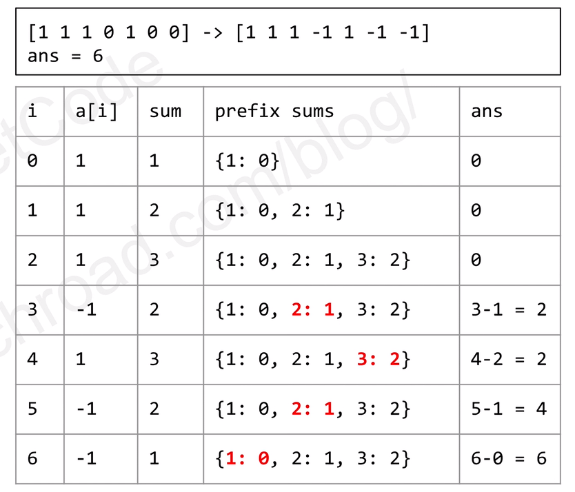

参考项目：[algorithmPractice](https://github.com/3218870799/algorithmPractice)

本笔记的每一个代码都有在上述项目的项目代码以及可运行测试类

# 1：数组

## 1.1：easy

LeetCode118：杨辉三角

给定一个非负整数 numRows，生成杨辉三角的前 numRows 行。

在杨辉三角中，每个数是它左上方和右上方的数的和。

示例:

输入: 5
输出:
[
     [1],
    [1,1],
   [1,2,1],
  [1,3,3,1],
 [1,4,6,4,1]
]

```java
package com.leetcode.array.easy;

import java.beans.IntrospectionException;
import java.lang.reflect.Array;
import java.util.*;

public class YanghuiTriangle118 {
    public static void main(String[] args) {
        int n = 5;
        //结果返回二维数组形式
        int[][] result2 = generate2(5);
        //lambda表达式遍历输出
        Arrays.stream(result2).forEach(arr->{
            Arrays.stream(arr).filter(i->i!=0).forEach( i ->System.out.print(i));
            System.out.println();
        });
        List<List<Integer>> result = generate(5);
    }

    /**
     * 解决：先给第一列全部赋值为1
     * 然后遍历二位数组，从第二行第二个开始，每一个等于上一行位置的加上上一行前一列位置的和
     * @param n
     * @return
     */
    public static int[][] generate2(int n) {
        int [][] result = new int[n][n];
        if (n<0){
            return result;
        }
        for (int j = 0; j < n; j++) {
            result[j][0] = 1;
        }
        for (int i = 1; i < n; i++) {
            for (int j = 1; j < n; j++) {
                result[i][j] =  result[i-1][j-1] + result[i-1][j];
            }
        }
        return result;
    }

    /**
     * 返回List<list<Integer>>
     * 两个List指针分别指向上一行和当前行
     * 第一行初始为1
     * 从第二行开始遍历
     * 当前行第一个为1，中间为currentList.add( last.get(j)+last.get(j-1));最后一个为1
     *
     * @param numRows
     * @return
     */
    public static List<List<Integer>> generate(int numRows) {
        if (numRows <= 0){
            return new ArrayList<List<Integer>>();
        }
        List<List<Integer>> result = new  ArrayList<List<Integer>>();
        List<Integer> last = new ArrayList<Integer>();
        last.add(1);
        result.add(last);
        for(int i=1; i< numRows;i++){
            List<Integer> currentList =  new ArrayList<Integer>();
            currentList.add(1);
            for (int j=1;j< i;j++){
                currentList.add( last.get(j)+last.get(j-1));
            }
            currentList.add(1);
            last = currentList;
            result.add(currentList);
        }
        return result;
    }

}

```


## 1.2：medium

525：连续数组

给定一个二进制数组, 找到含有相同数量的 0 和 1 的最长连续子数组的长度。

示例 1:

输入: [0,1]
输出: 2
说明: [0, 1] 是具有相同数量0和1的最长连续子数组，长度为2
示例 2:

输入: [0,1,0]
输出: 2
说明: [0, 1] (或 [1, 0]) 是具有相同数量0和1的最长连续子数组，长度为2。


注意: 给定的二进制数组的长度不会超过50000。

思路：

```
* 将0变成-1
* 使用hashtable，将和作为key，位置作为value，
* 如果遍历时和已经存在，说明从value到该位置的和为0，则result = 该位置index - value，判断哪个result最长
```



```java
private static int findMaxLength(int[] nums) {
    if(nums.length<=1) return 0;
    HashMap<Integer,Integer> pos = new HashMap<>();
    int sum = 0;
    int ans = 0;
    for (int i = 0; i < nums.length; i++) {
        sum += nums[i]==1?1:-1;
        //如果和为0，则也是其中一种结果
        if(sum==0){
            ans=i+1;
        }else if(pos.containsKey(sum)){
            //如果和已经存在，则取以前结果 和现在位置差最大的一个
            ans = Math.max(ans,i-pos.get(sum));
        }else{
            //如果没有，就放到hashMap里
            pos.put(sum,i);
        }
    }
    return ans;
}
```

//使用Array进行加速


## 1.3：Hard

315：计算右侧小于当前元素的个数


给定一个整数数组 nums，按要求返回一个新数组 counts。数组 counts 有该性质： counts[i] 的值是  nums[i] 右侧小于 nums[i] 的元素的数量。

 

示例：

输入：nums = [5,2,6,1]
输出：[2,1,1,0] 
解释：
5 的右侧有 2 个更小的元素 (2 和 1)
2 的右侧仅有 1 个更小的元素 (1)
6 的右侧有 1 个更小的元素 (1)
1 的右侧有 0 个更小的元素


提示：

0 <= nums.length <= 10^5
-10^4 <= nums[i] <= 10^4

思路：

```txt
1：暴力的两层for循环，但是数太多太大

```


## 


# 

https://cuijiahua.com/blog/2018/02/basis_67.html

https://www.nowcoder.com/ta/coding-interviews

# 2：字符串

牛客网：

题目描述

输入一个字符串,按字典序打印出该字符串中字符的所有排列。例如输入字符串abc,则按字典序打印出由字符a,b,c所能排列出来的所有字符串abc,acb,bac,bca,cab和cba。

输入描述:

```
输入一个字符串,长度不超过9(可能有字符重复),字符只包括大小写字母。
```

示例1

输入

```
"ab"
```

返回值

```
["ab","ba"]
```

**思路**

假设输入为a、b、c
那么其实排序的总数：
fun（a，b，c）=a（fun（b，c））+ b（fun（a，c））{即将a和b交换}+ c（fun（b，a））{ 即将a和c交换 }
fun（b，c） = b+fun（c）+c（fun（b））{即将b与c交换}
fun（c）=1

题目中说可能存在重复字符，因此交换时需要判断交换的字符是否相等，如果相等就没必要换了

```java
import java.util.*;

public class StringSort {

    public static void main(String[] args) {
        String str = "abcd";
        ArrayList<String> result = Permutation(str);
        result.stream().forEach(System.out::println);
    }

    public static ArrayList<String> Permutation(String str) {
        StringBuilder strBuilder = new StringBuilder(str);
        ArrayList<String> result = PermutationHelp(strBuilder);
        return result;
    }
    public static ArrayList<String> PermutationHelp(StringBuilder str){
        ArrayList<String> result = new  ArrayList<String>();
        if(str.length() == 1){
            result.add(str.toString());
        }else{
            for(int i = 0; i < str.length(); i++){
                //可能有重复字符，先判定该字符是否已经交换过排序过
                if(i == 0 || str.charAt(i) != str.charAt(0)){
                    char temp = str.charAt(i);
                    str.setCharAt(i, str.charAt(0));
                    str.setCharAt(0, temp);
                    ArrayList<String> newResult = PermutationHelp(new StringBuilder(str.substring(1)));
                    for(int j =0; j < newResult.size(); j++)
                        result.add(str.substring(0,1)+newResult.get(j));
                    //用完还是要放回去的
                    temp = str.charAt(0);
                    str.setCharAt(0, str.charAt(i));
                    str.setCharAt(i, temp);
                }
            }
            //需要在做一个排序操作
            Collections.sort(result);
        }
        return result;
    }
}

```

