参考项目：[algorithmPractice](https://github.com/3218870799/algorithmPractice)

本笔记的每一个代码都有在上述项目的项目代码以及可运行测试类

# 1：数组

## 1.1：easy

**LeetCode118：杨辉三角**

给定一个非负整数 numRows，生成杨辉三角的前 numRows 行。

在杨辉三角中，每个数是它左上方和右上方的数的和。

示例:

输入: 5
输出:
[
     [1],
    [1,1],
   [1,2,1],
  [1,3,3,1],
 [1,4,6,4,1]
]

```java
package com.leetcode.array.easy;

import java.beans.IntrospectionException;
import java.lang.reflect.Array;
import java.util.*;

public class YanghuiTriangle118 {
    public static void main(String[] args) {
        int n = 5;
        //结果返回二维数组形式
        int[][] result2 = generate2(5);
        //lambda表达式遍历输出
        Arrays.stream(result2).forEach(arr->{
            Arrays.stream(arr).filter(i->i!=0).forEach( i ->System.out.print(i));
            System.out.println();
        });
        List<List<Integer>> result = generate(5);
    }

    /**
     * 解决：先给第一列全部赋值为1
     * 然后遍历二位数组，从第二行第二个开始，每一个等于上一行位置的加上上一行前一列位置的和
     * @param n
     * @return
     */
    public static int[][] generate2(int n) {
        int [][] result = new int[n][n];
        if (n<0){
            return result;
        }
        for (int j = 0; j < n; j++) {
            result[j][0] = 1;
        }
        for (int i = 1; i < n; i++) {
            for (int j = 1; j < n; j++) {
                result[i][j] =  result[i-1][j-1] + result[i-1][j];
            }
        }
        return result;
    }

    /**
     * 返回List<list<Integer>>
     * 两个List指针分别指向上一行和当前行
     * 第一行初始为1
     * 从第二行开始遍历
     * 当前行第一个为1，中间为currentList.add( last.get(j)+last.get(j-1));最后一个为1
     *
     * @param numRows
     * @return
     */
    public static List<List<Integer>> generate(int numRows) {
        if (numRows <= 0){
            return new ArrayList<List<Integer>>();
        }
        List<List<Integer>> result = new  ArrayList<List<Integer>>();
        List<Integer> last = new ArrayList<Integer>();
        last.add(1);
        result.add(last);
        for(int i=1; i< numRows;i++){
            List<Integer> currentList =  new ArrayList<Integer>();
            currentList.add(1);
            for (int j=1;j< i;j++){
                currentList.add( last.get(j)+last.get(j-1));
            }
            currentList.add(1);
            last = currentList;
            result.add(currentList);
        }
        return result;
    }

}

```


牛客网：

**数组左边最大值减右边最大值的差最大**


先遍历一遍数组，先求出全局最大值MAX

1）MAX被划分到左边，让右部分最大值尽量小，则只留最后一个，因为最后一个怎么划分都存在，故最后一个一定是差值最大的

2）MAX被划分到右边，则同理，划分到0的位置


### 找出在一个数组中出现次数超过一半的数

思路一：遍历数组放入Map中，去的数组长度，遍历Map取得value值大于数组长度一半的值


思路二：

数组中有一个数字出现的次数超过了数组长度的一半。如果把这个数组『排序』，那么排序之后位于数组中间的数字一定就是那个出现次数超过数组长度一半的数字。

那么就变成找中间的这个数，快速排序的一个partition过程就是将


思路三：

数组中有一个数字出现的次数超过数组长度的一半，也就是说**它出现的次数比其他所有数字出现次数的和还要多**。

- 当我们遍历到下一个数字的时候，如果下一个数字和我们之前保存的数字相同，则次数加1；
- 如果下一个数字和我们之前保存的数字不同，则次数减1。
- 如果次数为零，我们需要保存下一个数字，并把次数设为1

我们要找的数字出现的次数比其他所有数字出现的次数之和还要多，那么要找的数字肯定是最后一次把次数设为1时对应的数字。

```java
public class MoreThanHalfNum {
    public static void main(String[] args) {
        int[] a = {1,5,2,2,3,4,2,2};
        int resutl = getMoreThanHalfNum(a);
    }

    private static Integer getMoreThanHalfNum(int[] array) {
        //如果数组为空
        if (array == null)
            return null;
        Integer number = null;
        int count = 0;
        Integer resultInteger = null;
        
        for (int i = 0; i < array.length; i++) {
            
            if (number == null) {
                number = array[i];
                count++;
            } else {
                if (array[i] != number)
                    if (count == 0) {
                        number = array[i];
                        count = 1;
                    } else
                        count--;
                else
                    count++;
            }
            if (count == 1)
                resultInteger = number;
        }
        return resultInteger;

    }
}
```


### 买卖股票的最佳时机

给定一个数组，它的第 i 个元素是一支给定股票第 i 天的价格。

如果你最多只允许完成一笔交易（即买入和卖出一支股票），设计一个算法来计算你所能获取的最大利润。

注意你不能在买入股票前卖出股票。

示例 1:

```
输入: [7,1,5,3,6,4]
输出: 5
```

解释: 在第 2 天（股票价格 = 1）的时候买入，在第 5 天（股票价格 = 6）的时候卖出，最大利润 = 6-1 = 5 。

```
注意利润不能是 7-1 = 6, 因为卖出价格需要大于买入价格。
```

示例 2:

```
输入: [7,6,4,3,1]
输出: 0
```

解释: 在这种情况下, 没有交易完成, 所以最大利润为 0。

题解

纪录两个状态, 一个是最大利润, 另一个是遍历过的子序列的最小值。知道之前的最小值我们就可以算出当前天可能的最大利润是多少

```java
class Solution {
    public int maxProfit(int[] prices) {
        // 7,1,5,3,6,4
        int maxProfit = 0;
        int minNum = Integer.MAX_VALUE;
        for (int i = 0; i < prices.length; i++) {
            if (Integer.MAX_VALUE != minNum && prices[i] - minNum > maxProfit) {
                maxProfit = prices[i] - minNum;
            }

            if (prices[i] < minNum) {
                minNum = prices[i];
            }
        }
        return maxProfit;
    }
}
```

### 买卖股票的最佳时机 II

这次改成股票可以买卖多次, 但是你必须要在出售股票之前把持有的股票卖掉。
示例 1:

```
输入: [7,1,5,3,6,4]
输出: 7
解释: 在第 2 天（股票价格 = 1）的时候买入，在第 3 天（股票价格 = 5）的时候卖出, 这笔交易所能获得利润 = 5-1 = 4 。
     随后，在第 4 天（股票价格 = 3）的时候买入，在第 5 天（股票价格 = 6）的时候卖出, 这笔交易所能获得利润 = 6-3 = 3 。
```

示例 2:

```
输入: [1,2,3,4,5]
输出: 4
解释: 在第 1 天（股票价格 = 1）的时候买入，在第 5 天 （股票价格 = 5）的时候卖出, 这笔交易所能获得利润 = 5-1 = 4 。
     注意你不能在第 1 天和第 2 天接连购买股票，之后再将它们卖出。
     因为这样属于同时参与了多笔交易，你必须在再次购买前出售掉之前的股票。
```

示例 3:

```
输入: [7,6,4,3,1]
输出: 0
解释: 在这种情况下, 没有交易完成, 所以最大利润为 0。
```

题解

由于可以无限次买入和卖出。我们都知道炒股想挣钱当然是低价买入高价抛出，那么这里我们只需要从第二天开始，如果当前价格比之前价格高，则把差值加入利润中，因为我们可以昨天买入，今日卖出，若明日价更高的话，还可以今日买入，明日再抛出。以此类推，遍历完整个数组后即可求得最大利润。

```
class Solution {
    public int maxProfit(int[] prices) {
        // 7,1,5,3,6,4
        int maxProfit = 0;
        for (int i = 0; i < prices.length; i++) {
            if (i != 0 && prices[i] - prices[i-1] > 0) {
                maxProfit += prices[i] - prices[i-1];
            }
        }
        return maxProfit;
    }
}
```

### 顺时针打印矩阵

输入一个矩阵，按照从外向里以顺时针的顺序依次打印出每一个数字。

 

示例 1：

输入：matrix = [[1,2,3],[4,5,6],[7,8,9]]
输出：[1,2,3,6,9,8,7,4,5]


思路

对于每层，从左上方开始以顺时针的顺序遍历所有元素。假设当前层的左上角位于 `(left,right)` ，右下角位于 `(bottom,right)`按照如下顺序遍历当前层的元素。

从左到右遍历上侧元素，依次为`(top,left)` 到`(top,right)`。

从上到下遍历右侧元素，依次为 `(top+1,right)`  到`(bottom,right)`。

如果 left<right 且 top<bottom，则从右到左遍历下侧元素，依次为(bottom,right−1) 到(bottom,left+1)，以及从下到上遍历左侧元素，依次为(bottom,left) 到(top+1,left)。

遍历完当前层的元素之后，将eft 和 top 分别增加 1，将 right 和 bottom 分别减少 1，进入下一层继续遍历，直到遍历完所有元素为止。

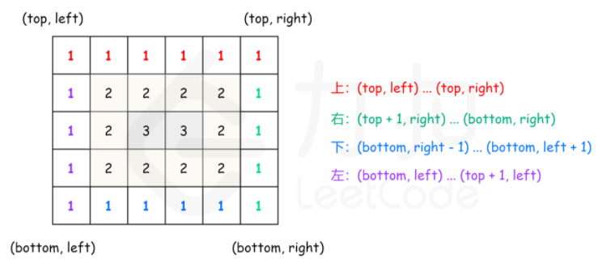

代码：

```java
    public static int[] spiralOrder(int[][] matrix) {
        if (matrix==null || matrix.length==0 || matrix[0].length ==0){
            return new int[0];
        }

        int rows = matrix.length,columns = matrix[0].length;
        int[] order = new int[rows * columns];
        int index = 0;
        int left =0,right = columns -1,top =0,bottom = rows -1;
        //左上每次往右下走一次，右下每次向左上走一次，当……结束
        while (left <= right && top<=bottom){
            //走上边，往右走
            for (int column = left; column <= right; column++) {
                order[index++] = matrix[top][column];
            }
            //走右边，往下走
            for (int row = top +1 ; row < bottom; row++) {
                order[index++] = matrix[row][right];
            }
            if (left < right && top < bottom) {
                //走下边，往左走
                for (int column = right - 1; column > left; column--) {
                    order[index++] = matrix[bottom][column];
                }
                //走左边，往上走
                for (int row = bottom; row > top; row--) {
                    order[index++] = matrix[row][left];
                }
            }
            left++;
            right--;
            top++;
            bottom--;
        }
        return order;
    }
```


### 和为s的两个数

输入一个递增排序的数组和一个数字s，在数组中查找两个数，使得它们的和正好是s。如果有多对数字的和等于s，则输出任意一对即可。

 

示例 1：

输入：nums = [2,7,11,15], target = 9
输出：[2,7] 或者 [7,2]

思路：

方法一：双指针

利用数组排好序的特性。x，y分别指向数组的两端。
当nums[x] + nums[y] == target时，有解{nums[x] ,nums[y]}。
当nums[x] + nums[y] > target时，y--。这样能使两者之和减小。
当nums[x] + nums[y] < target时，x++。这样能使两者之和增大。

```java
    public int[] twoSumByDoublePoint(int[] nums, int target) {
        int x =0,y=nums.length-1;
        while (x < y) {
            int s = nums[x] + nums[y];
            if (s == target){
                return new int[]{nums[x],nums[y]};
            }else if (s < target){
                x++;
            }else if (s > target){
                y--;
            }
        }
        return new int[0];
    }
```


## 1.2：medium

### 连续数组

给定一个二进制数组, 找到含有相同数量的 0 和 1 的最长连续子数组的长度。

示例 1:

输入: [0,1]
输出: 2
说明: [0, 1] 是具有相同数量0和1的最长连续子数组，长度为2
示例 2:

输入: [0,1,0]
输出: 2
说明: [0, 1] (或 [1, 0]) 是具有相同数量0和1的最长连续子数组，长度为2。


注意: 给定的二进制数组的长度不会超过50000。

思路：

```
* 将0变成-1
* 使用hashtable，将和作为key，位置作为value，
* 如果遍历时和已经存在，说明从value到该位置的和为0，则result = 该位置index - value，判断哪个result最长
```


```java
private static int findMaxLength(int[] nums) {
    if(nums.length<=1) return 0;
    HashMap<Integer,Integer> pos = new HashMap<>();
    int sum = 0;
    int ans = 0;
    for (int i = 0; i < nums.length; i++) {
        sum += nums[i]==1?1:-1;
        //如果和为0，则也是其中一种结果
        if(sum==0){
            ans=i+1;
        }else if(pos.containsKey(sum)){
            //如果和已经存在，则取以前结果 和现在位置差最大的一个
            ans = Math.max(ans,i-pos.get(sum));
        }else{
            //如果没有，就放到hashMap里
            pos.put(sum,i);
        }
    }
    return ans;
}
```

//使用Array进行加速


### 300：最长上升子序列


思路一：动态规划

记录数组中每一个数的最长上升子序列

该数的最长上升子序列  =   前一个比它小的 +1 

代码思路

一开始一个外部循环

​			内部循环从第一位截止到当前位置

​						如果前面的比当前位置小，则长度 + 1，选取最长的进行赋值

更新全局的最长长度

```java
	/**
	 * 最长上升子序列
	 * [10,9,2,5,7,101,18]则最长上升子序列为2，3, 7, 18
	 * 使用动态规划
	 * @param nums
	 * @return
	 */
	public static int lengthOfLIS(int[] nums){
		
		int n = nums.length;
		//截止到某一个index的最长上升子序列
		int[] dp = new int[n];
		int maxLen = 0;
		
		for(int i=0;i<n;i++){
			//一个数也是上升子序列
			int len =1;		
			for(int j=0;j<i;j++){
				//
				if(nums[j]<nums[i]){
					len=Math.max(len, dp[j]+1);
				}
			}
			//截止到i的最长长度
			dp[i]=len;
			if(dp[i]>maxLen){
				maxLen=dp[i];
			}
		}
		return maxLen;		
	}
```


思路二：二分搜索

[10,9,2,5,7,101,18]

10

9

2

2,5

2,5,7

2,5,7,101

2,5,7,18

对于每一个新来的数，看他在最长上升子序列中的那个部分，把对应部分加入

只有放在最后的时候长度才会++

如果放在开始和中间，只有中间数更小，后边才能更新更长的

复杂度nlogn

```java

	/**
	 * 最长上升子序列
	 * 如果新加入的对比于原本的中间，则替换，如果在最后，则长度加一
	 * @param nums
	 * @return
	 */
	public static int lengthOfLISFunction2(int[] nums){
		int n = nums.length;
		int[] dp = new int[n];
		int len =0;
		for (int num : nums) {
			//二分收索判断num在dp中的什么地方，即下标多少，范围是0到len
			int index = Arrays.binarySearch(dp, 0, len ,num);
			//<0则没有出现过，取到应该放的地方
			//pos = 
			if(index<0){
				index = -(index+1);
			}
			//如果在中间就直接更新为这个数
			dp[index] = num;
			//这个应该插入的位置在最后
			if(index==len){
				//长度要加一
				len++;
			}	
		}
		return len;
	}
```


### 最长连续子数组

[-4, -3, -2, -1, 2, 3, 5, 6, 7, 9, 12, 33, 35]，找出它的最长连续子数组，如这个数组的最长连续子数组是-4, -3, -2, -1。

思路1

思路：1、将数组元素放入二叉树  2、对二叉树使用中序排列，得到一个有序数组  3、对有序数组元素进行-1判断，获得最长连续数组。

思路2

用**hash表**来解决这个问题，先初始化一个hash表， 存储所有数组元素， 然后遍历这个数组， 对找到的数组元素， 去搜索其相连的上下两个元素是否在hash表中， 如果在， 删除相应元素并增加此次查找的数据长度， 如果不在， 从下一个元素出发查找。已经访问过的元素记录下来或者删除

思路三：

设` dp[i] ` 是第 ` i ` 个节点结尾的最长连续子数组，如果 ` arr[i] = arr[ i -1 ] + 1 `即与前面的是连续的，则 ` dp[i] = dp[i-1] +1 `  否则就等于1，最后遍历一遍` dp` 数组，找到最大的一个即可。  

### 1014：最佳观光组合

给定正整数数组 `A`，`A[i]` 表示第 `i` 个观光景点的评分，并且两个景点 `i` 和 `j` 之间的距离为 `j - i`。

一对景点（`i < j`）组成的观光组合的得分为（`A[i] + A[j] + i - j`）：景点的评分之和**减去**它们两者之间的距离。

返回一对观光景点能取得的最高分。

**示例：**

```
输入：[8,1,5,2,6]
输出：11
解释：i = 0, j = 2, A[i] + A[j] + i - j = 8 + 5 + 0 - 2 = 11
```

**提示：**

1. `2 <= A.length <= 50000`
2. `1 <= A[i] <= 1000`

**思路**

直接暴力两层 for 循环肯定过不了关，我们把公式变化为 `(A[i] + i) + (A[j] - j)`，看到此应该就可以想到在每次遍历 `j` 时，只需要知道 `max(A[i] + i)` 即可。

```java
class Solution {

    public int maxScoreSightseeingPair(int[] A) {
        int ans = 0, cur = A[0] + 0;
        for (int j = 1; j < A.length; j++) {
            ans = Math.max(ans, cur + A[j] - j); // 计算当前最大得分
            cur = Math.max(cur, A[j] + j);       // 更新最大的 A[i] + i
        }
        return ans;
    }

    public static void main(String[] args) {
        Solution solution = new Solution();
        int[] A = new int[]{8, 1, 5, 2, 6};
        System.out.println(solution.maxScoreSightseeingPair(A));
    }
}
```

### 构建乘积数组

给定一个[数组](https://cuijiahua.com/blog/tag/数组/)A[0,1,...,n-1],请构建一个数组B[0,1,...,n-1],其中B中的元素B[i]=A[0]*A[1]*...*A[i-1]*A[i+1]*...*A[n-1]。不能使用除法。

思路

正常如果可以将所有乘积起来记录一个数，然后B[i] = all / A[i] 即可，但是不能使用除法的话

可以维护一个前缀乘积 `left = A[0] * A[1] * …… A[i-1]` 然后维护一个后缀乘积 `right[i] = A[n-1] * A[n-2] …… A[i +1] ` 那么` B[i] = left[ i - 1 ] * right[ i + 1]` 

其本质就是三个dp数组，分别维护

```java
    public int[] constructArr(int[] a) {
        if(a ==null || a.length ==0){
            return a;
        }
        int len = a.length;
        int[] left = new int[len];
        int[] right = new int[len];

        left[0] = right[len -1] = 1;

        for (int i = 1; i < len; i++) {
            left[i] = left[i-1] * a[i-1];
        }

        for (int i = len - 2 ; i >=0 ; i--) {
            right[i] = right[i+1] * a[i+1];
        }

        int[] b = new int[len];
        for (int i = 0; i < len; i++) {
            b[i] = left[i] * right[i];
        }
        return  b;
    }
```


### 把数组排成最小的数

输入一个非负整数数组，把数组里所有数字拼接起来排成一个数，打印能拼接出的所有数字中最小的一个。

 

**示例 1:**

```
输入: [10,2]
输出: "102"
```


思路

通过在排序时传入一个自定义的 Comparator 实现，重新定义 String 列表内的排序方法，若拼接 s1 + s2 > s2 + s1，那么显然应该把 s2 在拼接时放在前面，以此类推，将整个 String 列表排序后再拼接起来。


代码：

```java
    public static String minNumber(int[] nums) {
    	List<String> strList = new ArrayList<>();
    	//将数字转换为字符串
		for (int num:nums) {
			strList.add(String.valueOf(num));
		}
		strList.sort((s1,s2)->(s1+s2).compareTo(s2 +s1));

		StringBuilder sb = new StringBuilder();
		for (String str:strList) {
			sb.append(str);
		}
    	return sb.toString();
    }
```


### 旋转数组

给定一个数组，将数组中的元素向右移动 k 个位置，其中 k 是非负数。

 

进阶：

尽可能想出更多的解决方案，至少有三种不同的方法可以解决这个问题。
你可以使用空间复杂度为 O(1) 的 原地 算法解决这个问题吗？


示例 1:

输入: nums = [1,2,3,4,5,6,7], k = 3
输出: [5,6,7,1,2,3,4]
解释:
向右旋转 1 步: [7,1,2,3,4,5,6]
向右旋转 2 步: [6,7,1,2,3,4,5]
向右旋转 3 步: [5,6,7,1,2,3,4]

链接：https://leetcode-cn.com/problems/rotate-array

思路一：使用额外的数组，

用 nn 表示数组的长度，我们遍历原数组，将原数组下标为 ii 的元素放至新数组下标为 (i+k)\bmod n(i+k)modn 的位置，最后将新数组拷贝至原数组即可。

思路二：

先整个翻转，再翻转前半部分，再翻转后半部分，翻转方法使用双指针，交换前后两个位置即可。


```java
public void rotate(int[] nums, int k) {
        //防止k的多余数组长度，旋转的就不止一圈
        k %= nums.length;
        //现将数组整个旋转
        reverseArray(nums,0,nums.length-1);
        //再将前k个进行旋转
        reverseArray(nums,0,k-1);
        //再将后面的进行旋转
        reverseArray(nums,k,nums.length);
    }

    private void reverseArray(int[] nums, int start, int end) {
        while (start<end){
            swap(nums,start,end);
            start++;
            end--;
        }
    }

    private void swap(int[] nums, int start, int end) {
        int temp = nums[start];
        nums[start] = nums[end];
        nums[end] = temp;
    }
```


## 1.3：Hard

### 315：计算右侧小于当前元素的个数


给定一个整数数组 nums，按要求返回一个新数组 counts。数组 counts 有该性质： counts[i] 的值是  nums[i] 右侧小于 nums[i] 的元素的数量。

 

示例：

输入：nums = [5,2,6,1]
输出：[2,1,1,0] 
解释：
5 的右侧有 2 个更小的元素 (2 和 1)
2 的右侧仅有 1 个更小的元素 (1)
6 的右侧有 1 个更小的元素 (1)
1 的右侧有 0 个更小的元素


提示：

0 <= nums.length <= 10^5
-10^4 <= nums[i] <= 10^4

思路：

```txt
1：暴力的两层for循环，但是数太多太大

```


## 


# 

https://cuijiahua.com/blog/2018/02/basis_67.html

https://www.nowcoder.com/ta/coding-interviews


### 数组中的逆序对

在数组中的两个数字，如果前面一个数字大于后面的数字，则这两个数字组成一个逆序对。输入一个数组，求出这个数组中的逆序对的总数。

 

示例 1:

输入: [7,5,6,4]

输出: 5


归并排序合并两个有序数组

采用分治算法：

先分

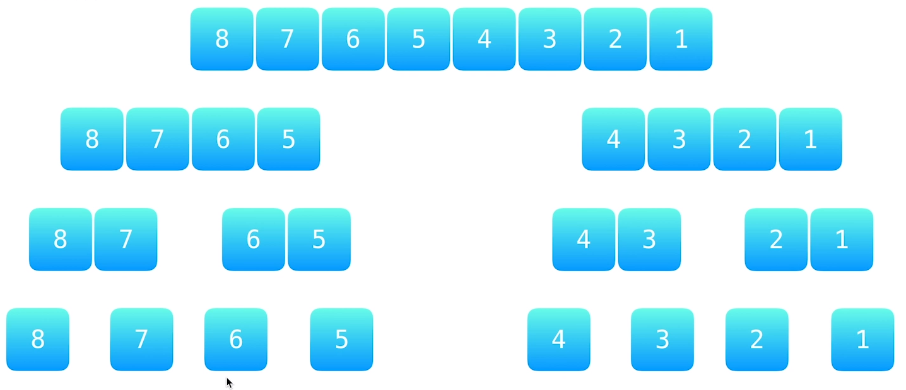

再治

在合并的过程中，计算逆序个数，两个有序数组，合并为一个有序数组的过程中，当后边的数小于前面数组中待合并的数时，就证明后面的数比前面数组中后边所有的数都要小，即与后面的数都能构成逆序对，即逆序对的个数为后面数的个数，比如：


此时合并两个有序数组，1比2小，1先合并回去，那么1就和前边数组中的2,3,5,7都可以构成逆序数组，则逆序个数加4


继续比较2和4,2比4小，则将2合并回去即可，2与后边的数并不过程逆序关系。


继续合并3

继续合并4，当合并4时，4和5比较，4比5小，则4与5,7等都过程逆序关系，数量为2，则逆序对数量加2


代码：

```java
public int reversePairs(int[] nums) {
        //输入数组长度
        int len = nums.length;

        if (len < 2) {
            return 0;
        }
        //将原始数组进行拷贝，因为需要修改原始数组
        int[] copy = new int[len];
        for (int i = 0; i < len; i++) {
            copy[i] = nums[i];
        }
        //辅助数组用于归并有序数组
        int[] temp = new int[len];
        return reversePairs(copy, 0, len - 1, temp);
    }

    /**
     * nums[left..right] 计算逆序对个数并且排序
     */
    private int reversePairs(int[] nums, int left, int right, int[] temp) {
        //递归终止条件
        if (left == right) {
            return 0;
        }
        //当left + right很大时容易发生溢出，二分查找典型的错误
        int mid = left + (right - left) / 2;
        //分别计算左右两边进行计算
        int leftPairs = reversePairs(nums, left, mid, temp);
        int rightPairs = reversePairs(nums, mid + 1, right, temp);

        if (nums[mid] <= nums[mid + 1]) {
            return leftPairs + rightPairs;
        }
        //计算合并时逆序数对的数量
        int crossPairs = mergeAndCount(nums, left, mid, right, temp);
        //返回结果逆序对为左边的+右边的 + 合并时的
        return leftPairs + rightPairs + crossPairs;
    }

    /**
     * nums[left..mid] 有序，nums[mid + 1..right] 有序
     */
    private int mergeAndCount(int[] nums, int left, int mid, int right, int[] temp) {
        for (int i = left; i <= right; i++) {
            temp[i] = nums[i];
        }
        //分别指向两个有序对的第一个元素
        int i = left;
        int j = mid + 1;

        int count = 0;
        for (int k = left; k <= right; k++) {

            if (i == mid + 1) {
                nums[k] = temp[j];
                j++;
            } else if (j == right + 1) {
                nums[k] = temp[i];
                i++;
            } else if (temp[i] <= temp[j]) {
                nums[k] = temp[i];
                i++;
            } else {
                nums[k] = temp[j];
                j++;
                count += (mid - i + 1);
            }
        }
        return count;
    }
```


# 2：字符串

## 2.1Easy

牛客网：

题目描述

输入一个字符串,按字典序打印出该字符串中字符的所有排列。例如输入字符串abc,则按字典序打印出由字符a,b,c所能排列出来的所有字符串abc,acb,bac,bca,cab和cba。

输入描述:

```
输入一个字符串,长度不超过9(可能有字符重复),字符只包括大小写字母。
```

示例1

输入

```
"ab"
```

返回值

```
["ab","ba"]
```

**思路**

假设输入为a、b、c那么其实排序的总数：

fun（a，b，c）=a（fun（b，c））+ b（fun（a，c））{即将a和b交换}+ c（fun（b，a））{ 即将a和c交换 }

fun（b，c） = b+fun（c）+c（fun（b））{即将b与c交换}

fun（c）=1

题目中说可能存在重复字符，因此交换时需要判断交换的字符是否相等，如果相等就没必要换了

```java
import java.util.*;

public class StringSort {

    public static void main(String[] args) {
        String str = "abcd";
        ArrayList<String> result = Permutation(str);
        result.stream().forEach(System.out::println);
    }

    public static ArrayList<String> Permutation(String str) {
        StringBuilder strBuilder = new StringBuilder(str);
        ArrayList<String> result = PermutationHelp(strBuilder);
        return result;
    }
    public static ArrayList<String> PermutationHelp(StringBuilder str){
        ArrayList<String> result = new  ArrayList<String>();
        if(str.length() == 1){
            result.add(str.toString());
        }else{
            for(int i = 0; i < str.length(); i++){
                //可能有重复字符，先判定该字符是否已经交换过排序过
                if(i == 0 || str.charAt(i) != str.charAt(0)){
                    char temp = str.charAt(i);
                    str.setCharAt(i, str.charAt(0));
                    str.setCharAt(0, temp);
                    ArrayList<String> newResult = PermutationHelp(new StringBuilder(str.substring(1)));
                    for(int j =0; j < newResult.size(); j++)
                        result.add(str.substring(0,1)+newResult.get(j));
                    //用完还是要放回去的
                    temp = str.charAt(0);
                    str.setCharAt(0, str.charAt(i));
                    str.setCharAt(i, temp);
                }
            }
            //需要在做一个排序操作
            Collections.sort(result);
        }
        return result;
    }
}

```

### 最长公共子串

给定两个字符串，求他们之间最长饿相同子字符串的长度

使用dp\[i][j]来表示第一个串的前i位和第二个串的前j位中的最长公共子串，

计算某个二维矩阵的值的时候顺便计算出来当前最长的公共子串的长度，即某个二维矩阵元素的值由record[i][j]=1演变为record[i][j]=1 +record\[i-1][j-1]，这样就避免了后续查找对角线长度的操作了。

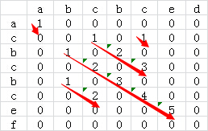


```java
public int getLCS(String s, String t) {
        if (s == null || t == null) {
            return 0;
        }
        int result = 0;
        int sLength = s.length();
        int tLength = t.length();
        int[][] dp = new int[sLength][tLength];
        for (int i = 0; i < sLength; i++) {
            for (int k = 0; k < tLength; k++) {
                if (s.charAt(i) == t.charAt(k)) {
                    if (i == 0 || k == 0) {
                        dp[i][k] = 1;
                    } else {
                        dp[i][k] = dp[i - 1][k - 1] + 1;
                    }
                    result = Math.max(dp[i][k], result);
                } else {
                    dp[i][k] = 0;
                }
            }
        }
        return result;
    }
```


### 最长公共子序列

公共子串与公共子序列不同，公共子序列不要求连续，公共子串必须是连续的。

如

A = “helloworld”

B = “loop”

则最长公共子串是lo

最长公共子序列是loo

* 规划二维数组，比较字符相同，如果相同则把i-1.j-1的值加1
* 如果不同，则把两个对角的最大的值复制过来

```java
	public static int LCS(String a,String b){
		int m = a.length();
		int n = b.length();
		int[][] dp = new int[m+1][n+1];

		for(int i=0;i<m;i++){
			for(int j=0;j<n;j++){
				char c1 = a.charAt(i);
				char c2 = b.charAt(j);
				if(c1==c2){
					dp[i+1][j+1]=dp[i][j]+1;
				}else {
					dp[i+1][j+1]=Math.max(dp[i+1][j], dp[i][j+1]);
				}
			}
		}	
		return dp[m][n];
	}
```


### 最长上升子序列

参考前面数组Easy中最长上升子序列

## Offer 19

正则表达式匹配


## Offer20

请实现一个函数用来判断字符串是否表示数值（包括整数和小数）。例如，字符串"+100"、"5e2"、"-123"、"3.1416"、"-1E-16"、"0123"都表示数值，但"12e"、"1a3.14"、"1.2.3"、"+-5"及"12e+5.4"都不是。


正则表达式：

```java
    public boolean isNumber(String s){
        s = s.trim();
        //排除三种清空，空串，e前没有数字，只有.
        // \s空白字符 * 多个
        // ([+-]? \\.?[eE][\\s\\S]* : +-有或没有.有或者没有，跟着e或则E，跟空白或则非空白，
        String regex = "\\s* | ([+-]?\\.?[eE][\\s\\S]*) | ([+-]?\\.)";
        if (s.matches(regex)){
            return false;
        }
        //对不是特殊情况的字符串，进行正则匹配
        regex = "(([+-])?\\d*\\.?\\d*)([eE][+-]?\\d+)?";
        return s.matches(regex);
    }
```

### 回文子串

给定一个字符串，你的任务是计算这个字符串中有多少个回文子串。

具有不同开始位置或结束位置的子串，即使是由相同的字符组成，也会被视作不同的子串。

示例 1：

输入："abc"
输出：3
解释：三个回文子串: "a", "b", "c"
示例 2：

输入："aaa"
输出：6
解释：6个回文子串: "a", "a", "a", "aa", "aa", "aaa"

思路一：动态规划

设  ` dp[i][j] ` 为从 ` i ` 开始到 ` j ` 结束是不是回文串，如果第i位置与第j 位置相等，则` dp[i][j] `与 ` dp[i +1 ][j-1] `位置的结果一样。

```java
    public int countSubstrings(String s) {
        int n = s.length();
        //定义从第i到第j位置的子串是不是回文串
        boolean[][] dp = new boolean[n][n];
        //记录回文串的个数
        int count = 0;
        //当只有一个字符时，全部为ture
        for (int i = 0; i < n; i++) {
            dp[i][i] = true;
            count++;
        }
        //当只有两个字符时
        for (int i = 0; i < n-1; i++) {
            if (s.charAt(i) == s.charAt(i+1)){
                dp[i][i+1] = true;
                count++;
            }
        }
        //当三个字符以上时
        for (int len = 3; len <= n; len++) {
            //起点为i，终点为j，跨度为len的
            for (int i = 0; i + len <=n ; i++) {
                int j = i + len -1;
                if (s.charAt(i) == s.charAt(j)){
                    dp[i][j] = dp[i+1][j-1];
                    if (dp[i][j]){
                        count++;
                    }
                }
            }
        }
        return count;
    }
```

思路二：中心扩展，遍历以i为中心的字符串向两边扩展，如果相等，则计数加一。

```java
    //中心扩展
    static int totalCount = 0;
    public static int countSubstringsByCenterExpansion(String s) {
        if (s==null){
            return 0;
        }
        //遍历字符串，计算以i位置为中心的字符串是回文串的个数
        for (int i = 0; i < s.length(); i++) {
            //计算奇数回文串
            count(s,i,i);
            //计算偶数回文串
            count(s,i,i+1);
        }
        return totalCount;
    }
    public static void count(String s ,int i,int j){
        //以i为中心向两边扩展，如果两边相等，则是回文，加1，如果不等，再扩大也不可能是了
        while (i>=0 && j<=s.length()-1 && s.charAt(i) == s.charAt(j)){
            i--;j++;
            totalCount++;
        }
    }
```

思路三：Manacher

Manacher 算法是在线性时间内求解最长回文子串的算法。

对于中心扩展方式处理奇数长度和偶数长度的问题，它的处理方式是：

在所有的相邻字符中间插入 \##，比如 abaaabaa 会被处理成 \#a\#b\#a\#a\##a#b#a#a#，这样可以保证所有找到的回文串都是奇数长度的，以任意一个字符为回文中心，既可以包含原来的奇数长度的情况，也可以包含原来偶数长度的情况。假设原字符串为 S，经过这个处理之后的字符串为 s。

我们用 f(i)f(i) 来表示以 ss 的第 ii 位为回文中心，可以拓展出的最大回文半径，那么 f(i) - 1f(i)−1 就是以 ii 为中心的最大回文串长度 


# 3：链表

## **160. 相交链表**

编写一个程序，找到两个单链表相交的起始节点。

如下面的两个链表**：**


在节点 c1 开始相交。

思路：

1. 如果两个链表相交，则交点比在较短的链表的其中一个节点上

2. 遍历两个链表计算两个链表的长度，相减计算长度的差值

3. 较长的链表先走差值的长度

4. 同时遍历两个链表，比较两个链表的值，相等则相交

   

```java
package com.xqc.LinkedList.Easy;

/**
 * @ClassName GetIntersectionNode160
 * @Author Administrator
 * @Date 2020/12/16/016 18:02
 * @Description TODO
 */
public class GetIntersectionNode160 {
    public class ListNode {
      int val;
      ListNode next;
      ListNode(int x) {
          val = x;
          next = null;
      }
    }
    public static void main(String[] args) {

    }
    public static ListNode getIntersectionNode(ListNode headA, ListNode headB) {
        int lenA = 0;
        int lenB = 0;
        ListNode listA = headA;
        ListNode listB = headB;

        while (listA != null) {
            listA = listA.next;
            lenA++;
        }
        while (listB != null) {
            listB = listB.next;
            lenB++;
        }

        int diff;
        if(lenA > lenB) {
            diff = lenA - lenB;
            while (diff > 0) {
                diff--;
                headA = headA.next;
            }
        } else {
            diff = lenB - lenA;
            while (diff > 0) {
                diff--;
                headB = headB.next;

            }
        }

        while (headA != null && headB != null) {
            if (headA == headB) {
                return headA;
            }
            headA = headA.next;
            headB = headB.next;
        }

        return null;
    }

}
```


## Offer22：链表中倒数第k个结点

输入一个链表，输出该链表中倒数第k个节点。为了符合大多数人的习惯，本题从1开始计数，即链表的尾节点是倒数第1个节点。例如，一个链表有6个节点，从头节点开始，它们的值依次是1、2、3、4、5、6。这个链表的倒数第3个节点是值为4的节点。

思路：

两个指针，一个先往前走k-1步，然后两个指针一起往后走，当第二个指针走到尾部时，第一个指针刚好到达倒数第k个节点


```java
    public ListNode getKthFromEnd(ListNode head ,int k){
        ListNode first = head;
        ListNode sencond = head;
        for (int i = 0; i < k-1; i++) {
            sencond = sencond.next;
        }
        while(sencond.next!=null){
            first = first.next;
            sencond = sencond.next;
        }
        return first;
    }
```


## Offer24：反转链表

定义一个函数，输入一个链表的头节点，反转该链表并输出反转后链表的头节点。

```
输入: 1->2->3->4->5->NULL
输出: 5->4->3->2->1->NULL
```

思路：


```java
    public ListNode reverseList(ListNode head) {
        ListNode pre = null;
        ListNode cur = head;
        while(cur!=null){
            ListNode nextNode = cur.next;
            cur.next = pre;
            pre = cur;
            cur = nextNode;
        }
        return pre;
    }
```

## 排序链表

给你链表的头结点 head ，请将其按 升序 排列并返回 排序后的链表 。

进阶：

你可以在 O(n log n) 时间复杂度和常数级空间复杂度下，对链表进行排序吗？


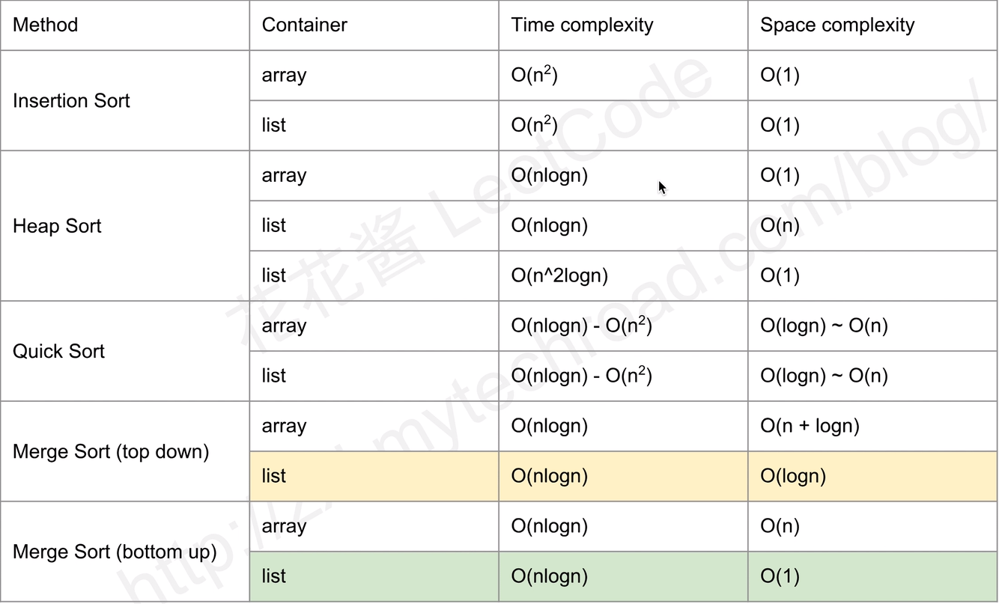

归并排序时间复杂度O(nlogn)

Top-down方式：时间复杂度O(nlongn)空间复杂度O(logn)

```
//将链表分成两部分，使用快慢指针,快指针走两步，慢指针走一步，当快指针.next为空停止,慢指针正好走到一半
l1 ,l2 = split(l);
//递归排序两个
l1*,l2* = sortList(l1),sortList(l2)
//将已经排序好的的进行merger
merge(l1*,l2*)
```

代码实现：

```java
 public ListNode sortListTopDown(ListNode head){
        //
        if(head == null || head.next == null){
            return head;
        }
        //使用快慢指针
        ListNode slow = head;
        ListNode fast = head.next;
        while(fast!=null && fast.next!=null){
            fast = fast.next.next;
            slow = slow.next;
        }
        //结束后慢指针正好走到中间
        ListNode l2 = slow.next;
        slow.next = null;
        return merge(sortListTopDown(head),sortListTopDown(l2));
    }
```

对于合并两个有序链表

```java
    //将两个已经排序的链表进行合并，并没有去重
    //如果想去重，可以在判断时加上if(temp<temp1 || temp <temp2)再进入，否则，指针只往后走
    private ListNode merge(ListNode l1, ListNode l2) {
        ListNode dummyHead = new ListNode(0);
        ListNode temp = dummyHead,temp1 = l1,temp2 = l2;
        while (temp1!=null && temp2!=null){
            if (temp1.val <=temp2.val){
                temp.next = temp1;
                temp1 = temp1.next;
            }else{
                temp.next = temp2;
                temp2 = temp2.next;
            }
            temp = temp.next;
        }
        if (temp1 != null) {
            temp.next = temp1;
        } else if (temp2 != null) {
            temp.next = temp2;
        }
        return dummyHead.next;
    }
```


Bottom Up方式进行

将链表分成 `n/ 2^i` 个链表，每个链表有 `2^i` 个元素，直接进行合并


首先求得链表的长度{length}，然后将链表拆分成子链表进行合并。

有点没懂还是


两个无序单链合并成一个有序单链表


## 复杂链表的复制

请实现 copyRandomList 函数，复制一个复杂链表。在复杂链表中，每个节点除了有一个 next 指针指向下一个节点，还有一个 random 指针指向链表中的任意节点或者 null。

示例 1：

 

输入：head = [[7,null],[13,0],[11,4],[10,2],[1,0]]
输出：[[7,null],[13,0],[11,4],[10,2],[1,0]]


思路1：

使用HashMap将当前节点信息与新节点值存储起来

复制时直接取出新节点然后复制源节点信息

```java
    public Node copyRandomListByHashMap(Node head) {
        //创建HashMap集合
        HashMap<Node,Node> map = new HashMap<>();
        Node cur = head;
        //复制结点值
        while (cur!=null){
            //存储put:<key,value1>
            //顺序遍历，存储老结点和新结点(先存储新创建的结点值)
            map.put(cur,new Node(cur.val));
            cur = cur.next;
        }
        //复制结点指向
        cur = head;
        while (cur!=null){
            //得到get:<key>.value2,3
            //新结点next指向同旧结点的next指向
            map.get(cur).next = map.get(cur.next);
            //新结点random指向同旧结点的random指向
            map.get(cur).random = map.get(cur.random);
            cur = cur.next;
        }
        //返回复制的链表
        return map.get(head);
    }
```


思路2：

当成图来处理，进行DFS或者BFS


sub = str.substring(i,i+j)

System.out.println(sub);


# 3：栈

### 栈的压入、弹出序列

输入两个整数序列，第一个序列表示[栈](https://cuijiahua.com/blog/tag/栈/)的压入顺序，请判断第二个序列是否为该栈的弹出顺序。假设压入栈的所有数字均不相等。例如序列1,2,3,4,5是某栈的压入顺序，序列4，5,3,2,1是该压栈序列对应的一个弹出序列，但4,3,5,1,2就不可能是该压栈序列的弹出序列。（注意：这两个序列的长度是相等的）

思路：

利用一个栈，按入栈顺序将元素入栈，入栈时，如果栈顶元素和出栈的第 j 个元素相同，则出栈，出栈的顺序后移一位，知道走到最后一个

```java
    public static boolean validateStackSequences(int[] pushed, int[] popped) {
        //如果入栈与出栈长度不相同，则直接返回false
        if (pushed.length != popped.length){
            return false;
        }
        //如果为空，直接为真
        if (pushed.length <1){
            return true;
        }
        //现将第一个元素入栈
        Stack<Integer> stack = new Stack<>();
        stack.push(pushed[0]);
        int i =1;
        for (int j = 0; j < popped.length; j++) {
            //取出出栈的元素
            int num = popped[j];
            //如果栈顶的元素不等于出栈元素，继续入栈
            while(stack.peek() != num && i < pushed.length){
                stack.push(pushed[i++]);
            }
            if(stack.peek() == num){
                stack.pop();
                continue;
            }
            //一直没找到与栈顶相同的
            return false;
        }
        return true;
    }
```

### 最小栈

LeetCode155

设计一个支持 push ，pop ，top 操作，并能在常数时间内检索到最小元素的栈。

- push(x) —— 将元素 x 推入栈中。
- pop() —— 删除栈顶的元素。
- top() —— 获取栈顶元素。
- getMin() —— 检索栈中的最小元素。

输入：

> ["MinStack","push","push","push","getMin","pop","top","getMin"]
>
> [[],[-2],[0],[-3],[],[],[],[]]

输出：

> [null,null,null,null,-3,null,0,-2]


思路：

我们使用一个辅助栈，与元素栈同步插入和删除相对应的最小值，当插入时，判断当前值是否比辅助栈的栈顶元素小

```java
public class LeetCode155MinStack {
    //定义元素栈
    private Stack<Integer> dataStack;
    //定义辅助栈
    private Stack<Integer> minStack;


    /** initialize your data structure here. */
    public LeetCode155MinStack() {
        dataStack = new Stack<>();
        minStack = new Stack<>();
    }

    public void push(int x) {
        dataStack.push(x);
        minStack.push(Math.min(minStack.peek(),x));
    }

    public void pop() {
        dataStack.pop();
        minStack.pop();
    }
    public int top() {
        return dataStack.peek();
    }
    public int getMin() {
        return minStack.peek();
    }
}
```


### 每日温度

LeetCode739

请根据每日 气温 列表，重新生成一个列表。对应位置的输出为：要想观测到更高的气温，至少需要等待的天数。如果气温在这之后都不会升高，请在该位置用 0 来代替。

例如，给定一个列表 temperatures = [73, 74, 75, 71, 69, 72, 76, 73]，你的输出应该是 [1, 1, 4, 2, 1, 1, 0, 0]。

提示：气温 列表长度的范围是 [1, 30000]。每个气温的值的均为华氏度，都是在 [30, 100] 范围内的整数。


思路1：暴力解

数组从前往后扫描，找到第一个比它更大的元素

思路2：

单调栈

维护一个单调栈，遍历温度数组，如果当日温度大于栈顶元素，则说明当日就是升温日，则将栈顶元素取出做差，否则就入栈

```java
    public int[] dailyTemperatures(int[] T) {
        //
        Deque<Integer> stack = new ArrayDeque<>();
        //定义结果数组
        int[] res = new int[T.length];
        //遍历每日温度
        for (int i = 0; i < T.length; i++) {
            //若当日温度大于栈顶温度，说明当日未升温日，栈顶一直出栈，计算差
            while (!stack.isEmpty() && T[stack.peek()] < T[i]){
                int index = stack.pop();
                res[index] = i - index;
            }
            stack.push(i);
        }
        return res;
    }
```

### 接雨水

LeetCode42

给定 *n* 个非负整数表示每个宽度为 1 的柱子的高度图，计算按此排列的柱子，下雨之后能接多少雨水。

 

输入：height = [0,1,0,2,1,0,1,3,2,1,2,1]
输出：6
解释：上面是由数组 [0,1,0,2,1,0,1,3,2,1,2,1] 表示的高度图，在这种情况下，可以接 6 个单位的雨水（蓝色部分表示雨水）。 


思路：

单调栈解法：

举例：

输入：[4,3,2,0,1,1,5

输出：13

如图：

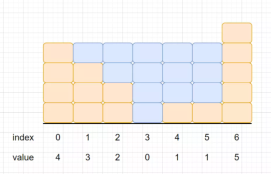

我们还是维护一个单调不增的栈，依次将值为4,3,2,0的数组下标入栈，接下来是1，但是1比栈顶的0大，而次栈顶是2，则2,0,1形成一个低洼，则 **第一层**就可以接到一个单位的雨水

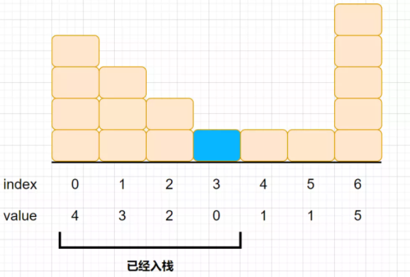

继续

让0出栈，1入栈，此时栈内为[4,3,2,1]，继续遍历，则栈内为[4,3,2,1,1]

下一元素为5，栈顶元素为1，栈顶的下一元素仍为1，则需要再下一个元素，为2，那我们求当前层接到的水的数量。

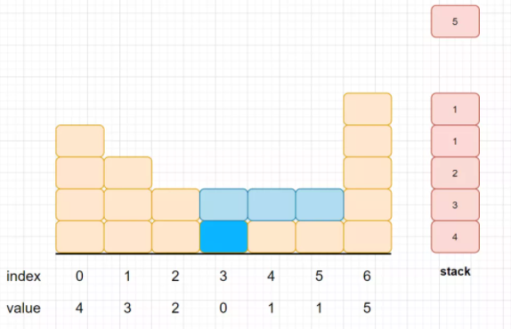

此时2,1,1,5形成一个低洼，在第二层所接的雨水为1*3 = 3；

其中 高度 = min （2-1,5-1）= 1，宽度 = 右边界 - 左边界 =  5的索引 - 2的索引 - 1= 6 -2 -1= 3

继续

将1出栈，栈顶元素变成2，此时栈内为【4,3,2】为维护一个单调不增的栈，5此时还未入栈

顶元素就变成了2，下一元素变成了3，那么3，2，5这三个元素同样也可以接到水。

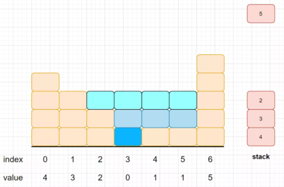

第三层的接水情况，能够接到4个单位的水，下面我们继续出栈2，那么我们的4，3，5仍然可以接到水啊。


我们第四层接水的情况，一共能够接到5个单位的水，那么我们总的接水数加起来，那就是1+3+4+5=13

代码：

```java
    public int trap(int[] height) {
        Stack<Integer> stack = new Stack<>();
        int water = 0;
        //特殊情况，无法形成低洼时
        if (height.length < 3){
            return 0;
        }
        //循环遍历数组
        for (int i = 0; i < height.length; i++) {
            //维护单调栈，当当前元素大于栈顶元素时
            while (!stack.isEmpty() && height[i] > height[stack.peek()]){
                //栈顶元素出栈
                int popnum = stack.pop();
                //相同元素情况。如1,1
                while (!stack.isEmpty() && (height[i] == height[stack.peek()])){
                    stack.pop();
                }
                //计算该层水的单位
                if (!stack.isEmpty()){
                    //次栈顶元素，及左边界高度
                    int temp = height[stack.peek()];
                    //高
                    int high = Math.min(temp-height[popnum],height[i]-height[popnum]);
                    //宽
                    int wid = i - stack.peek() -1;
                    water += high * wid;
                }
            }
            //将索引入栈，继续下一轮
        }
        return water;
    }
```


# 4：队列

### 滑动窗口的最大值

给定一个数组和滑动窗口的大小，找出所有滑动窗口里数值的最大值。例如，如果输入数组{2,3,4,2,6,2,5,1}及滑动窗口的大小3，那么一共存在6个滑动窗口，他们的最大值分别为{4,4,6,6,6,5}。


思路：

暴力解法：

每次遍历窗口中的最大值，存到结果数组中

```java
    //暴力解法，直接遍历计算窗口内的最大值，然后保存到数组中
    public ArrayList<Integer> maxSlidingWindowFunc1(int[] nums, int k) {
        //定义保存结果数组
        ArrayList<Integer> list = new ArrayList<>();
        //当窗口大小为空，或则窗口大小大于数组长度
        if (k < 1 || nums.length < k) {
            return list;
        }
        int left = 0;
        int right = k - 1;
        //窗口移动
        while (right < nums.length) {
            //计算当前窗口最大值
            int val = calcMax(left, right, nums);
            list.add(val);
            left++;
            right++;
        }
        return list;
    }

    public int calcMax(int left, int right, int[] nums) {
        int max = nums[left];
        for (int i = left; i <= right; i++) {
            if (max < nums[i]) {
                max = nums[i];
            }
        }
        return max;
    }
```


思路二：

使用一个双端队列实现一个单调队列（即队列中的数只能单调递增的保存的保存）

数组的第一个数字是2，把它存入[队列](https://cuijiahua.com/blog/tag/队列/)中。第二个数字是3，比2大，所以2不可能是滑动窗口中的最大值，因此把2从队列里删除，再把3存入队列中。第三个数字是4，比3大，同样的删3存4。此时滑动窗口中已经有3个数字，而它的最大值4位于队列的头部。

第四个数字2比4小，但是当4滑出之后它还是有可能成为最大值的，所以我们把2存入队列的尾部。下一个数字是6，比4和2都大，删4和2，存6。就这样依次进行，最大值永远位于队列的头部。

但是我们怎样判断滑动窗口是否包括一个数字？应该在队列里存入数字在数组里的下标，而不是数值。当一个数字的下标与当前处理的数字的下标之差大于或者相等于滑动窗口大小时，这个数字已经从窗口中滑出，可以从队列中删除。

```java
    public int[] maxSlidingWindow(int[] nums, int k) {
        if (nums.length == 0 || k == 0) {
        	return new int[0];
		}
        //单调队列，用链表实现
        Deque<Integer> deque = new LinkedList<>();
        //定义返回结果数组
        int[] res = new int[nums.length - k + 1];
		//res数组的下标
		int index = 0;
		//未形成窗口区间
        for (int i = 0; i < k; i++) {
            //队列不为空时，当前值与队列尾部值比较，如果大于，删除队列尾部值
            //一直循环删除到队列中的值都大于当前值，或者删到队列为空
            while (!deque.isEmpty() && nums[i] > deque.peekLast()){
            	// [ 3,2 ]
            	deque.removeLast();
			}
            //执行完上面的循环后，队列中要么为空，要么值都比当前值大，然后就把当前值添加到队列中
            deque.addLast(nums[i]);
        }
        //窗口区间刚形成后，把队列首位值添加到结果数组中
        //因为窗口形成后，就需要把队列首位添加到数组中，而下面的循环是直接跳过这一步的，所以需要我们直接添加
		res[index++] = deque.peekFirst();
        //窗口区间形成，i此时为右侧窗口
        for (int i = k; i < nums.length; i++) {
            //i-k是已经在区间外了，如果首位等于nums[i-k]，那么说明此时首位值已经不再区间内了，需要删除
			//最大值正好等于要删除的那个元素
            if (deque.peekFirst() == nums[i - k]) {
            	deque.removeFirst();
			}
            //删除队列中比当前值大的值
            while (!deque.isEmpty() && nums[i] > deque.peekLast()) {
            	deque.removeLast();
			}
            //把当前值添加到队列中
            deque.addLast(nums[i]);
            //把队列的首位值添加到arr数组中
            res[index++] = deque.peekFirst();
        }
        return res;
    }
```


# 5：堆

### 数据流中的中位数

如何得到一个数据流中的中位数？如果从数据流中读出奇数个数值，那么中位数就是所有数值排序之后位于中间的数值。如果从数据流中读出偶数个数值，那么中位数就是所有数值排序之后中间两个数的平均值。

例如，

[2,3,4] 的中位数是 3

[2,3] 的中位数是 (2 + 3) / 2 = 2.5

设计一个支持以下两种操作的数据结构：

void addNum(int num) - 从数据流中添加一个整数到数据结构中。
double findMedian() - 返回目前所有元素的中位数。

思路

维护两个堆，左边维护一个大根堆，右边维护一个小根堆，左边的数都比中位数小，大根堆堆顶最大，右边都比中位数大，小根堆堆顶最小，然后每加入一个新的元素，就跟堆顶元素进行比较，保证两个堆内的数量一致，中间的数就是中位数

插入时

先判断左右堆的数量，相等就插到左边去，保证左边的数量只比右边可能多一个（这里插入左边不是直接往左边插入，而是将元素插入右边堆，调整后，取出右边最小的插入到左边去）

不相等就插入到右边去（


Java中对于堆的实现可以用优先队列进行实现


```java
    //定义小顶堆
    private PriorityQueue<Integer> MinHeap;
    //重写比较器，定义大顶堆
    private  PriorityQueue<Integer> MaxHeap;
    //计数
    private Integer count = 0;

    public Offer41MedianFinder() {
        MinHeap = new PriorityQueue<>();
        MaxHeap = new PriorityQueue<>((o1,o2) -> o2-o1);
    }
    public void addNum(int num) {
        if (MinHeap.size() == MaxHeap.size()){
            MaxHeap.add(num);
            MinHeap.add(MaxHeap.poll());
        }else{
            MinHeap.add(num);
            MaxHeap.add(MinHeap.poll());
        }
    }
    public double findMedian() {
        if (MinHeap.size() ==MaxHeap.size()){
            return (MinHeap.peek() + MaxHeap.peek()) / 2.0;
        }else {
            return MinHeap.peek()/1.0;
        }
    }
```


# 4：二叉树

### 找一条和最大的路径

思路：

首先一条路径遍历到叶子节点的时候，两个叶子节点的根节点相同，也就是到其根节点的路径上节点的val的和是一样的，此时那个节点的值大，那么最大路劲就会在哪个路径上。这就是递归的最初思想，之后扩展到左右子树

即：

递归求出左边最大值，递归求出右边最大值，出口为节点为null返回0

最大值等于 Max(左边最大值，右边最大值) + 根的值

```java
public class TreeMaxPath {

    public static int max = Integer.MIN_VALUE;  // 始终保持最大的和

    // root到叶节点的最大路径的和
    public static int solution(TreeNode root) {
        if(root == null) {
            return 0;
        }
        int left = solution(root.left);
        int right = solution(root.right);
        max = Math.max(max, left + right + root.val);// 更新max值
        return Math.max(left, right) + root.val;
    }


    public static void main(String[] args) {
        // Test case
        TreeNode node1 = new TreeNode(1);
        TreeNode node2 = new TreeNode(2);
        TreeNode node3 = new TreeNode(3);
        TreeNode node4 = new TreeNode(4);
        TreeNode node5 = new TreeNode(5);

        node1.left = node2;
        node1.right = node3;
        node2.left = node4;
        node2.right = node5;

        solution(node1);
        System.out.println("max = " + max);
    }
}
class TreeNode{
    int val;
    TreeNode left;
    TreeNode right;
    TreeNode(int val){
        this.val = val;
    }
}
```

#### 二叉树中和为某一值的路径

Offer34

输入一颗[二叉树](https://cuijiahua.com/blog/tag/二叉树/)和一个整数，打印出[二叉树](https://cuijiahua.com/blog/tag/二叉树/)中结点值的和为输入整数的所有路径。路径定义为从树的根结点开始往下一直到叶结点所经过的结点形成一条路径。

思路：

深度优先搜索。使用前序遍历，使用两个全局变量result和tmp，result来存放最终结果，tmp用来存放临时结果。每次遍历，我们先把root的值压入tmp，然后判断当前root是否同时满足：

- 与给定数值相减为0；
- 左子树为空；
- 右子树为空。

如果满足条件，就将tmp压入result中，否则，依次遍历左右子树。需要注意的是，遍历左右子树的时候，全局变量tmp是不清空的，直到到了根结点才请空tmp。

```java
public class Offer34PathSum {

    List<List<Integer>> result = new LinkedList<>();
    List<Integer> path = new LinkedList<Integer>();

    public List<List<Integer>> pathSum(TreeNode root, int sum) {
        //递归进行先序遍历
        recur(root,sum);
        return result;
    }
    private void recur(TreeNode root, int sum) {
        if (root == null) {
            return;
        }
        path.add(root.val);
        sum-=root.val;
        //如果等于sum并且是叶子节点，就是一条途径，加入
        if (sum == 0 && root.left == null && root.right == null){
            result.add(new LinkedList(path));
        }
        recur(root.left,sum);
        recur(root.right,sum);
    }
}
```


思路1：递归

转换为是否存在从当前节点的子节点到叶子节点的路径，满足其路径为 ` sum -val ` 

```java
    //递归方法求解
    public boolean hasPathSumMethod1(TreeNode root, int sum) {
        if (root == null) {
            return false;
        }
        //如果是根节点而且val == sum 则是
        if (root.left == null && root.right == null) {
            return sum == root.val;
        }
        //任意左右有一个是则是
        return hasPathSumMethod1(root.left, sum - root.val) || hasPathSumMethod1(root.right, sum - root.val);
    }
```

思路二：广度优先搜素DFS

### 104：二叉树转链表

给定一个二叉树，原地将它展开为链表。

例如，给定二叉树

```
    1
   / \
  2   5
 / \   \
3   4   6
```

将其展开为：

```
1
 \
  2
   \
    3
     \
      4
       \
        5
         \
          6
```


思路：

转换的时候递归的时候记住是先转换右子树，再转换左子树。

右子树转换完之后链表的头结点在哪里。注意没有新定义一个next指针，而是直接将right 当做next指针,那么Left指针我们赋值成null就可以了。

```java
class Solution {
    private TreeNode prev = null;

    public void flatten(TreeNode root) {
        if (root == null)  return;
        flatten(root.right); // 先转换右子树
        flatten(root.left); 
        root.right = prev;  // 右子树指向链表的头
        root.left = null; // 把左子树置空
        prev = root; // 当前结点为链表头
    }
}
```

非递归实现

```java
class Solution {
    public void flatten(TreeNode root) {
        if (root == null) return;
        Stack<TreeNode> stack = new Stack<TreeNode>();
        stack.push(root);
        while (!stack.isEmpty()) {
            TreeNode current = stack.pop();
            if (current.right != null) stack.push(current.right);
            if (current.left != null) stack.push(current.left);
            if (!stack.isEmpty()) current.right = stack.peek();
            current.left = null;
        }
    }
}
```


### 树中两个节点的最低公共祖先

 输入两个二叉搜索树的结点，求两个结点的最低公共祖先，所谓的最低公共祖先是指距离两个节点最近的共同祖先。

解题思路：

- 1.二叉搜索树具有一个很好的特点。**以当前结点为根节点的左边结点的值都是小于根节点的值，右边结点的值都大于根节点的值。**
- 2.根据这个特点，如果给的两个节点的值都`小于`根节点，那么它们的最低公共祖先就一定在它左子树。
- 3.如果给的两个节点的值都`大于`根节点，那么它们的最低公共祖先就一定在它右子树。
- 4.如果`一个结点的值大于根节点的值`，`一个结点的值小于根节点的值`，那么这个根节点就是它的最低公共祖先。

若只是一颗二叉树

- 如果一个结点为根，另一个结点无论在什么地方它们的最低公共祖先一定为根结点。
- 如果一个结点在左树，另一个结点在右树，那么它的最低公共祖先一定是根节点。
- 如果两个结点都在左树，以子问题在左树查找。
- 如果两个结点都在右树，以子问题在右树查找。

```java
public class Solution {  
    public TreeNode lowestCommonAncestor(TreeNode root, TreeNode p, TreeNode q) {  
        //发现目标节点则通过返回值标记该子树发现了某个目标结点  
        if(root == null || root == p || root == q) return root;  
        //查看左子树中是否有目标结点，没有为null  
        TreeNode left = lowestCommonAncestor(root.left, p, q);  
        //查看右子树是否有目标节点，没有为null  
        TreeNode right = lowestCommonAncestor(root.right, p, q);  
        //都不为空，说明做右子树都有目标结点，则公共祖先就是本身  
        if(left!=null&&right!=null) return root;  
        //如果发现了目标节点，则继续向上标记为该目标节点  
        return left == null ? right : left;  
    }  
}
```

### 重建二叉树

输入某[二叉树](https://cuijiahua.com/blog/tag/二叉树/)的前序遍历和中序遍历的结果，请重建出该[二叉树](https://cuijiahua.com/blog/tag/二叉树/)。假设输入的前序遍历和中序遍历的结果中都不含重复的数字。例如输入前序遍历序列{1,2,4,7,3,5,6,8}和中序遍历序列{4,7,2,1,5,3,8,6}，则重建二叉树并返回。

思路：

根据前序遍历和中序遍历的结果，重建二叉树，

前序遍历第一个节点是根节点

找到中序遍历中根节点位置，左边为左子树，右边为右子树，递归进行即可

```java
    public TreeNode buildTree(int[] preorder, int[] inorder) {
        //判空
        if (preorder == null || inorder ==null || preorder.length==0 ||inorder.length==0){
            return null;
        }
        //使用一个 Map 存储中序遍历的每个元素及其对应的下标，目的是为了快速获得一个元素在中序遍历中的位置。
        Map<Integer,Integer> indexMap = new HashMap<Integer,Integer>();
        int length = preorder.length;
        for (int i =0;i<length;i++){
            indexMap.put(inorder[i],i);
        }
        TreeNode root = buildTreeHelp(preorder,0,length-1,inorder,0,length-1,indexMap);
        return root;
    }
    public TreeNode buildTreeHelp(int[] preorder, int preorderStart, int preorderEnd, int[] inorder, int inorderStart, int inorderEnd, Map<Integer, Integer> indexMap) {
        //
        if (preorderStart > preorderEnd) {
            return null;
        }
        //根节点为前序遍历的第一个节点
        int rootVal = preorder[preorderStart];
        TreeNode root = new TreeNode(rootVal);
        //递归出口，当只有一个节点时，返回该节点
        if (preorderStart == preorderEnd) {
            return root;
        } else {
            //找到根节点在后续遍历中的位置
            int rootIndex = indexMap.get(rootVal);
            //左子树节点数等于根节点索引减去后续开始索引，右子树节点数等于后续的结束索引减去根节点索引
            int leftNodes = rootIndex - inorderStart, rightNodes = inorderEnd - rootIndex;
            //递归左子树，
            TreeNode leftSubtree = buildTreeHelp(preorder, preorderStart + 1, preorderStart + leftNodes, inorder, inorderStart, rootIndex - 1, indexMap);
            TreeNode rightSubtree = buildTreeHelp(preorder, preorderEnd - rightNodes + 1, preorderEnd, inorder, rootIndex + 1, inorderEnd, indexMap);
            root.left = leftSubtree;
            root.right = rightSubtree;
            return root;
        }
    }
```


### 树的子结构

输入两颗二叉[树](https://cuijiahua.com/blog/tag/树/)A，B，判断B是不是A的子结构。（PS：我们约定空[树](https://cuijiahua.com/blog/tag/树/)不是任意一个树的子结构）。

思路

要查找树A中是否存在和树B结构一样的子树，我们可以分为两步：第一步在树A中找到和B的根结点的值一样的结点R，第二步再判断树A中以R为根节点的子树是不是包含和树B一样的结构。

```java
    public boolean isSubStructure(TreeNode A, TreeNode B) {
        return (A != null && B != null) && (recur(A, B) || isSubStructure(A.left, B) || isSubStructure(A.right, B));
    }
    
    //以A为根节点的树是否包含树B
    boolean recur(TreeNode A, TreeNode B) {
        //???
        if(B == null) return true;
        if(A == null || A.val != B.val) return false;
        return recur(A.left, B.left) && recur(A.right, B.right);
    }
```


总结：

匹配类二叉树可以使用一种套路相对固定的递归函数

- 先将根节点匹配；
- 根节点匹配后，对子树进行匹配。


### 二叉树的镜像

操作给定的二叉[树](https://cuijiahua.com/blog/tag/树/)，将其变换为源二叉[树](https://cuijiahua.com/blog/tag/树/)的镜像。

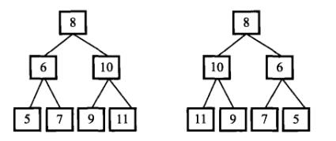

```java
    public TreeNode mirrorTree(TreeNode root) {
        if (root == null) return null;
        TreeNode tmp = root.left;
        root.left = mirrorTree(root.right);
        root.right = mirrorTree(tmp);
        return root;
    }
```

### 二叉搜索树的第k个结点

给定一颗二叉搜索树，请找出其中的第k大的结点。例如，在下图中，按结点数值大小顺序第三个结点的值为4。


思路：

二叉搜索树的一个特点：左子结点的值 < 根结点的值 < 右子结点的值。

中序遍历得到递增序列，[2,3,4,5,6,7,8]。即可


### 不同的二叉搜索树

给定一个整数 n，求以 1 ... n 为节点组成的二叉搜索树有多少种？

示例:

```
输入: 3
输出: 5
解释:
给定 n = 3, 一共有 5 种不同结构的二叉搜索树:

   1         3     3      2      1
    \       /     /      / \      \
     3     2     1      1   3      2
    /     /       \                 \
   2     1         2                 3
```


思路：

假设 n 个节点存在二叉排序树的个数是 G (n)，令 f(i) 为以 i 为根的二叉搜索树的个数，则
G(n) = f(1) + f(2) + f(3) + f(4) + ... + f(n)G(n)=f(1)+f(2)+f(3)+f(4)+...+f(n)

当 i 为根节点时，其左子树节点个数为 i-1 个，右子树节点为 n-i，则
f(i) = G(i-1)*G(n-i)f(i)=G(i−1)∗G(n−i)

综合两个公式可以得到 卡特兰数 公式
G(n) = G(0)*G(n-1)+G(1)*(n-2)+...+G(n-1)*G(0)G(n)=G(0)∗G(n−1)+G(1)∗(n−2)+...+G(n−1)∗G(0)

代码：

```java
    public static int numTrees(int n) {
        //定义前i个节点有多少种不同的二叉搜索树
        int[] dp = new int[n+1];
        dp[0] = 1;
        dp[1] = 1;
        for (int i = 2; i <= n; i++) {
            for (int j = 1; j <=i; j++) {
                dp[i] += dp[j -1] * dp[i-j];
            }
        }
        return dp[n];
    }
```


# 4：图


## medium

LeetCode133：克隆图

一个无向图，如何深copy

给你无向 连通 图中一个节点的引用，请你返回该图的 深拷贝（克隆）。

图中的每个节点都包含它的值 val（int） 和其邻居的列表（list[Node]）。

class Node {
    public int val;
    public List<Node> neighbors;
}

思路：

采用深度优先递归克隆节点，克隆节点邻居时，遍历克隆邻居并深度递归克隆邻居节点


```java
public class cloneGraph133 {
    class Solution{
        //定义一个hashMap，key代表节点的值，value代表该节点，可以用于记录是否已经遍历过该节点
        Map<Integer,Node> map = new HashMap<>();
        public Node cloneGraph(Node node){
            //判空
            if (node==null)
                return null;
            //如果不为空，深度优先克隆图
            return dfsClone(node);
        }
        private Node dfsClone(Node node){
            if(node==null) return null;
            //如果该节点已经遍历过，已经存放于map中
            if (map.containsKey(node.val)){
                return map.get(node.val);
            }
            //如果没有遍历过，新建一个节点
            Node newNode = new Node(node.val,new ArrayList<>());
            //然后将该节点放入到map中
            map.put(node.val,newNode);
            for (Node neighbor:node.neighbors) {
                //然后深度优先克隆他的邻居节点
                newNode.neighbors.add(dfsClone(neighbor));
            }
            return newNode;
        }
    }
    class Node {
        public int val;
        public List<Node> neighbors;
        public Node() {
            val = 0;
            neighbors = new ArrayList<Node>();
        }
        public Node(int _val) {
            val = _val;
            neighbors = new ArrayList<Node>();
        }
        public Node(int _val, ArrayList<Node> _neighbors) {
            val = _val;
            neighbors = _neighbors;
        }
    }
}
```

# 5：哈希表

### 554：砖墙

你的面前有一堵矩形的、由多行砖块组成的砖墙。 这些砖块高度相同但是宽度不同。你现在要画一条自顶向下的、穿过最少砖块的垂线。

砖墙由行的列表表示。 每一行都是一个代表从左至右每块砖的宽度的整数列表。

如果你画的线只是从砖块的边缘经过，就不算穿过这块砖。你需要找出怎样画才能使这条线穿过的砖块数量最少，并且返回穿过的砖块数量。

你不能沿着墙的两个垂直边缘之一画线，这样显然是没有穿过一块砖的。

 

示例：

输入: [[1,2,2,1],
      [3,1,2],
      [1,3,2],
      [2,4],
      [3,1,2],
      [1,3,1,1]]

输出: 2

解释: 

 

提示：

每一行砖块的宽度之和应该相等，并且不能超过 INT_MAX。
每一行砖块的数量在 [1,10,000] 范围内， 墙的高度在 [1,10,000] 范围内， 总的砖块数量不超过 20,000。

思路：

题意根据图示已经描述得很清楚了，就是在从底部到顶部，求最少交叉的数量，我们可以把每堵墙可以穿过的地方保存到哈希表中，每次遇到哈希表中的值加一，代表就是这条路不用交叉的数量，最终我们可以算出不用交叉的最大值，让总墙数减去其值就是最少交叉的数量。

```java
class Solution {
    public int leastBricks(List<List<Integer>> wall) {
        Map<Integer, Integer> map = new HashMap<>();
        int width = 0, max = 0;
        for (List<Integer> sub : wall) {
            int p = 0;
            for (int i = 0, len = sub.size() - 1; i < len; ++i) {
                p += sub.get(i);
                Integer v = map.get(p);
                map.put(p, (v == null ? 0 : v) + 1);
            }
        }
        for (Integer integer : map.values()) {
            if (integer > max) max = integer;
        }
        return wall.size() - max;
    }
}
```


### 第一个只出现一次的字符

Offer50

在字符串 s 中找出第一个只出现一次的字符。如果没有，返回一个单空格。 s 只包含小写字母。

示例:

s = "abaccdeff"
返回 "b"

s = "" 
返回 " "


思路：

方法一：使用有序哈希表

在Hash表的基础上，有序哈希表按照插入顺序排序，因此，可通过遍历有序哈希表，实现搜索收个数量为1的字符

```java
    public char firstUniqCharByLinkedHashMap(String s) {
        //使用有序哈希表进行存储
        Map<Character,Boolean> dic = new LinkedHashMap<>();
        char[] sc = s.toCharArray();
        //遍历字符串，将字符串可能的存储起来
        for (char c :sc) {
            dic.put(c,!dic.containsKey(c));
        }
        //有序遍历有序链表
        for (Map.Entry<Character,Boolean> d :dic.entrySet()) {
            //如果只出现一个，则返回key
            if (d.getValue()){
                return d.getKey();
            }
        }
        //没有，返回 ‘ ’ 
        return ' ';
    }
```

方法二：直接数组实现

因为只有小写字母，故只需用数组存储，a对应ASCII码为65

```java
    public char firstUniqCharByArr(String s) {
        //使用数组进行存储
        int[] dic = new int[26];
        int MinIndex = Integer.MAX_VALUE;
        //将字符串转换为数组
        char[] sc = s.toCharArray();
        for (char c : sc) {
            dic[c -'a']++;
        }
        for (int i = 0; i < dic.length; i++) {
          if (dic[i]==1){
              return (char) (i + 'a');
          }
        }
        return ' ';
    }
```


### LRU缓存机制

LeetCode146

设计和实现一个  LRU (最近最少使用) 缓存机制 。
实现 LRUCache 类：

LRUCache(int capacity) 以正整数作为容量 capacity 初始化 LRU 缓存
int get(int key) 如果关键字 key 存在于缓存中，则返回关键字的值，否则返回 -1 。
void put(int key, int value) 如果关键字已经存在，则变更其数据值；如果关键字不存在，则插入该组「关键字-值」。当缓存容量达到上限时，它应该在写入新数据之前删除最久未使用的数据值，从而为新的数据值留出空间。


思路：

一旦出现建和值就要想到哈希表，它可以在O(1)时间内通过键找到值。

使用双向链表进行存储获取，使用HashMap进行定位。

get操作直接从HashMap中取数据，然后更新双向链表（将原来的删掉，直接将获取到的放入头部）

put操作：先看是否已经存在（从HashMap中获取），同时放入HashMap和双向链表，如果容量多了就移除尾部的。

```java
public class LRUCache {
    class DLinkedNode {
        int key;
        int value;
        DLinkedNode prev;
        DLinkedNode next;
        public DLinkedNode() {}
        public DLinkedNode(int _key, int _value) {key = _key; value = _value;}
    }

    private Map<Integer, DLinkedNode> cache = new HashMap<Integer, DLinkedNode>();
    private int size;
    private int capacity;
    private DLinkedNode head, tail;

    public LRUCache(int capacity) {
        this.size = 0;
        this.capacity = capacity;
        // 使用伪头部和伪尾部节点
        head = new DLinkedNode();
        tail = new DLinkedNode();
        head.next = tail;
        tail.prev = head;
    }

    public int get(int key) {
        DLinkedNode node = cache.get(key);
        if (node == null) {
            return -1;
        }
        // 如果 key 存在，先通过哈希表定位，再移到头部
        moveToHead(node);
        return node.value;
    }

    public void put(int key, int value) {
        DLinkedNode node = cache.get(key);
        if (node == null) {
            // 如果 key 不存在，创建一个新的节点
            DLinkedNode newNode = new DLinkedNode(key, value);
            // 添加进哈希表
            cache.put(key, newNode);
            // 添加至双向链表的头部
            addToHead(newNode);
            ++size;
            if (size > capacity) {
                // 如果超出容量，删除双向链表的尾部节点
                DLinkedNode tail = removeTail();
                // 删除哈希表中对应的项
                cache.remove(tail.key);
                --size;
            }
        }
        else {
            // 如果 key 存在，先通过哈希表定位，再修改 value，并移到头部
            node.value = value;
            moveToHead(node);
        }
    }

    private void addToHead(DLinkedNode node) {
        node.prev = head;
        node.next = head.next;
        head.next.prev = node;
        head.next = node;
    }

    private void removeNode(DLinkedNode node) {
        node.prev.next = node.next;
        node.next.prev = node.prev;
    }

    private void moveToHead(DLinkedNode node) {
        removeNode(node);
        addToHead(node);
    }

    private DLinkedNode removeTail() {
        DLinkedNode res = tail.prev;
        removeNode(res);
        return res;
    }
}
```


# 7：动态规划

## 子序列问题：

#### 53：最大子序和

给定一个整数数组 nums ，找到一个具有最大和的连续子数组（子数组最少包含一个元素），返回其最大和。

示例:

输入: [-2,1,-3,4,-1,2,1,-5,4]
输出: 6
解释: 连续子数组 [4,-1,2,1] 的和最大，为 6。


思路分析：

**以** **`nums[i]`** **为结尾的「最大子数组和」为** **`dp[i]`**。

这种定义之下，想得到整个 `nums` 数组的「最大子数组和」，不能直接返回 `dp[n-1]`，而需要遍历整个 `dp` 数组：

`dp[i]` 有两种「选择」，要么与前面的相邻子数组连接，形成一个和更大的子数组；要么不与前面的子数组连接，自成一派，自己作为一个子数组。

即：

```java
// 要么自成一派，要么和前面的子数组合并
dp[i] = Math.max(nums[i], nums[i] + dp[i - 1]);
```

代码：

```java
int maxSubArray(int[] nums) {
    int n = nums.length;
    if (n == 0) return 0;
    int[] dp = new int[n];
    // base case
    // 第一个元素前面没有子数组
    dp[0] = nums[0];
    // 状态转移方程
    for (int i = 1; i < n; i++) {
        dp[i] = Math.max(nums[i], nums[i] + dp[i - 1]);
    }
    // 得到 nums 的最大子数组
    int res = Integer.MIN_VALUE;
    for (int i = 0; i < n; i++) {
        res = Math.max(res, dp[i]);
    }
    return res;
}
```

以上解法时间复杂度是 O(N)，空间复杂度也是 O(N)，较暴力解法已经很优秀了，不过**注意到** **`dp[i]`** **仅仅和** **`dp[i-1]`** **的状态有关**，那么我们可以进行「状态压缩」，将空间复杂度降低：

```java
int maxSubArray(int[] nums) {
    int n = nums.length;
    if (n == 0) return 0;
    // base case
    int dp_0 = nums[0];
    int dp_1 = 0, res = dp_0;

    for (int i = 1; i < n; i++) {
        // dp[i] = max(nums[i], nums[i] + dp[i-1])
        dp_1 = Math.max(nums[i], nums[i] + dp_0);
        dp_0 = dp_1;
        // 顺便计算最大的结果
        res = Math.max(res, dp_1);
    }

    return res;
}
```


### Hard

#### 72：编辑距离


思路：

编辑距离问题就是给我们两个字符串 `s1` 和 `s2`，只能用三种操作，让我们把 `s1` 变成 `s2`，求最少的操作数。

**解决两个字符串的动态规划问题，一般都是用两个指针** **`i,j`** **分别指向两个字符串的最后，然后一步步往前走，缩小问题的规模**。

设两个字符串分别为 "rad" 和 "apple"，为了把 `s1` 变成 `s2`，算法会这样进行：


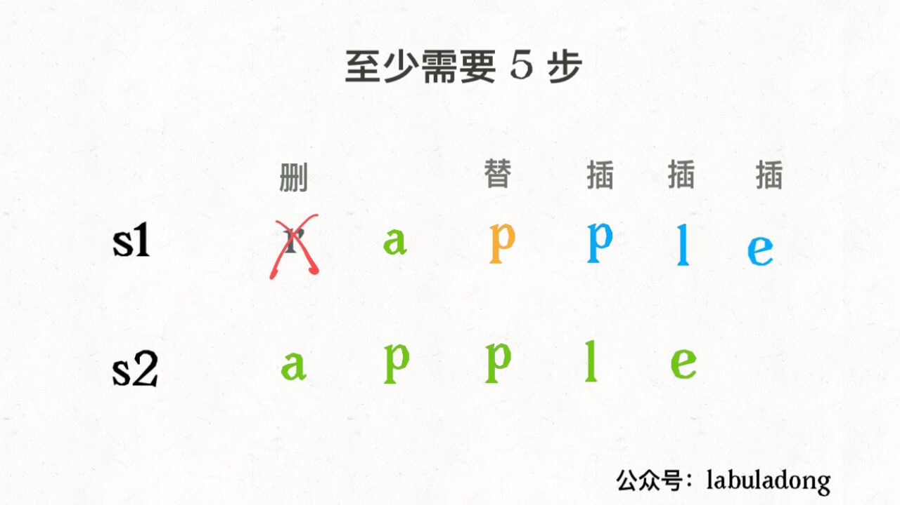

根据上面的 GIF，可以发现操作不只有三个，其实还有第四个操作，就是什么都不要做（skip）

因为这两个字符本来就相同，为了使编辑距离最小，显然不应该对它们有任何操作，直接往前移动 `i,j` 即可。

还有一个很容易处理的情况，就是 `j` 走完 `s2` 时，如果 `i` 还没走完 `s1`，那么只能用删除操作把 `s1` 缩短为 `s2`。比如这个情况：

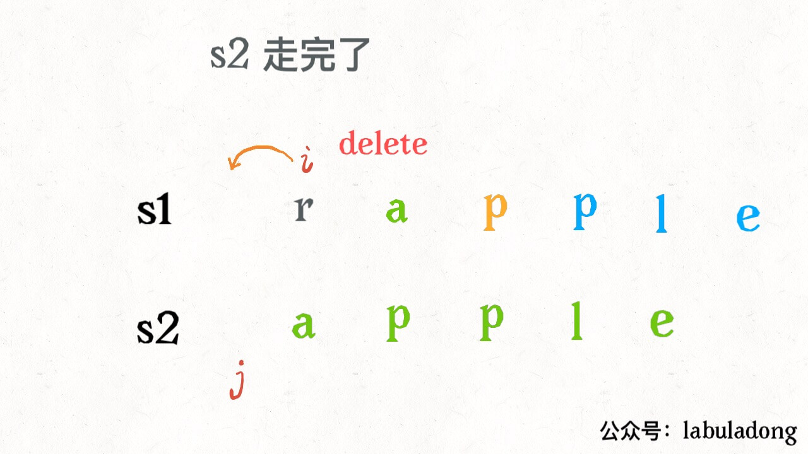

类似的，如果 `i` 走完 `s1` 时 `j` 还没走完了 `s2`，那就只能用插入操作把 `s2` 剩下的字符全部插入 `s1`。等会会看到，这两种情况就是算法的 **base case**。

代码思路：

```java
public int Solution(String s1,String s2){
    // base case
    if(i==-1)return j+1;
    if(j==-1)return i+1;
    
    if(s1[i]==s2[j]){
        //啥也不做
        return dp[i-1][j-1];
    }else{
        //插入删除，替换中最小的步数
        return Math.min(dp[i,j-1] + 1,dp[i-1,j]+1,dp[i-1][j-1]+1);
    }
    
}
```

动态规划思路：


Java实现

```java
    private int getEditDistance(String s1, String s2) {
        //
        int d = 0;
        //s1的前i位与s2的前j位转换所需要的步骤数
        int[][] dp = new int[s1.length()+1][s2.length()+1];
        //s1与s2为空，不用变换
        dp[0][0] = 0;
        //一个串为空，变成另一个串则插入该串的长度的步骤
        for (int i = 0; i < s1.length()+1; i++) {
            dp[i][0] = i;
        }
        for (int j = 0; j < s2.length()+1; j++) {
            dp[0][j] = j;
        }

        for (int i = 1; i < s1.length()+1; i++) {
            for (int j = 0; j < s2.length()+1; j++) {
                //如果该位相等，则啥也不做
                if (s1.charAt(i-1)==s2.charAt(j-1)){
                    d=0;
                }else{
                    //如果不等，步数加一
                    d=1;
                }
                /*该位的步骤数等于：
                dp[i-1][j] 删除一位
                dp[i][j-1] 插入一位
                dp[i-1][j-1] 替换一位 或则 啥也不做
                 */
                dp[i][j]=Min(dp[i-1][j]+1,dp[i][j-1]+1,dp[i-1][j-1]+d)
            }
        }
        return dp[s1.length()][s2.length()];
    }
    public int Min(int a,int b,int c) {
        return (a<b?a:b)<c?(a<b?a:b):c;
    }
```


#### 354.俄罗斯套娃信封问题

排序进行预处理


思路：

信封嵌套问题就需要先按特定的规则排序，之后就转换为一个 [最长递增子序列问题](https://github.com/labuladong/algo/tree/1ed5e674983f857aa5745a0810575a0edd5a78a0/动态规划系列/动态规划设计：最长递增子序列.md)

**先对宽度** **`w`** **进行升序排序，如果遇到** **`w`** **相同的情况，则按照高度** **`h`** **降序排序。之后把所有的** **`h`** **作为一个数组，在这个数组上计算 LIS 的长度就是答案。**

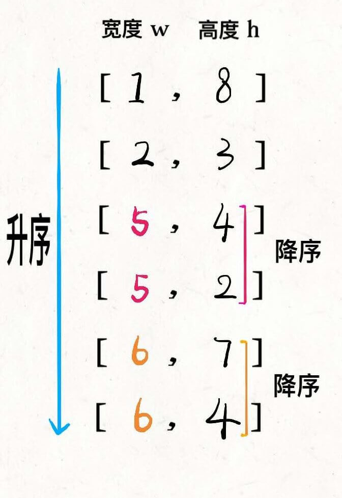

然后在 `h` 上寻找最长递增子序列：


这个解法的关键在于，对于宽度 `w` 相同的数对，要对其高度 `h` 进行降序排序。因为两个宽度相同的信封不能相互包含的，逆序排序保证在 `w` 相同的数对中最多只选取一个。

代码：

```java
// envelopes = [[w, h], [w, h]...]
public int maxEnvelopes(int[][] envelopes) {
    int n = envelopes.length;
    // 按宽度升序排列，如果宽度一样，则按高度降序排列
    Arrays.sort(envelopes, new Comparator<int[]>() 
    {
        public int compare(int[] a, int[] b) {
            return a[0] == b[0] ? 
                b[1] - a[1] : a[0] - b[0];
        }
    });
    // 对高度数组寻找 LIS
    int[] height = new int[n];
    for (int i = 0; i < n; i++)
        height[i] = envelopes[i][1];
	//套用最长上升子序列模板
    return lengthOfLIS(height);
}
```

## 背包问题：

### medium

#### 416：分割等和子集(01背包)

给定一个只包含正整数的非空数组。是否可以将这个数组分割成两个子集，使得两个子集的元素和相等。

注意:

每个数组中的元素不会超过 100
数组的大小不会超过 200
示例 1:

输入: [1, 5, 11, 5]

输出: true

解释: 数组可以分割成 [1, 5, 5] 和 [11].


示例 2:

输入: [1, 2, 3, 5]

输出: false

解释: 数组不能分割成两个元素和相等的子集.


思路：


两个子集的和相等，每个等于sum/2

可以转换为：

在若干物品中选中一些物品，每个物品只能使用一次，这些物品恰好能够填满容量为sum/2的背包。

剩下的自然为sum/2也就。


**第一步要明确两点，「状态」和「选择」**。

状态就是「背包的容量」和「可选择的物品」，选择就是「装进背包」或者「不装进背包」。

**第二步要明确** **`dp`** **数组的定义**。

dp\[i][j]表示考虑下标[0,i]这个区间里的所有整数，在他们当中能够选出一些数，使得这些数之和恰好为整数j

**第三步，根据「选择」，思考状态转移的逻辑**。


**第四步，考虑初始化与输出**。


规划：

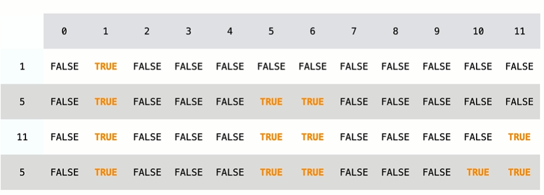


代码：

```java
    public boolean canPartition(int[] nums){
        int len = nums.length;
        //先计算sum
        int sum = 0;
        for (int num:nums) {
            sum+=num;
        }
        //如果sum是奇数，直接返回false
        if((sum & 1)==1){
            return false;
        }
        int target = sum/2;
        //对于数组前i个是否有子集使总和为j
        boolean[][] dp = new boolean[len][target+1];
        //赋值第一行，第一行只能填满容量为0的背包
        if(nums[0]<=target){
            dp[0][nums[0]] = true;
        }
        //从第二行开始填表
        for (int i = 1; i < len; i++) {
            for (int j = 0; j <=target ; j++) {
                //不考虑当前元素，直接从上一行抄下来
                dp[i][j] = dp[i-1][j];
                //如果当前值恰好等于当前容量
                if (nums[i]==j){
                    dp[i][j] = true;
                    continue;
                }
                //如果当前值严格小于当前容量
                if(nums[i]<j){
                    //或者上一行的值，或则上一行右边的值(考虑当前数，容量减少），其中一个成立即可
                    dp[i][j] = dp[i-1][j] || dp[i-1][j-nums[i]];
                }
            }

        }
    return dp[len -1][target];
    }
```


优化：

使用一维数组，从右向左填写表格，不断覆盖

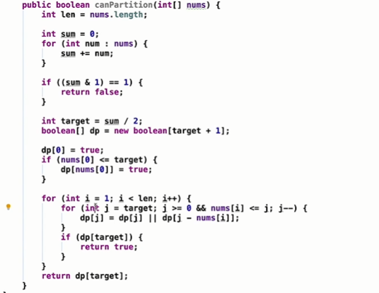


#### 518：零钱兑换II（完全背包）

给定不同面额的硬币和一个总金额。写出函数来计算可以凑成总金额的硬币组合数。假设每一种面额的硬币有无限个。 

 

示例 1:

输入: amount = 5, coins = [1, 2, 5]
输出: 4
解释: 有四种方式可以凑成总金额:
5=5
5=2+2+1
5=2+1+1+1
5=1+1+1+1+1
示例 2:

输入: amount = 3, coins = [2]
输出: 0
解释: 只用面额2的硬币不能凑成总金额3。
示例 3:

输入: amount = 10, coins = [10] 
输出: 1


注意:

你可以假设：

0 <= amount (总金额) <= 5000
1 <= coin (硬币面额) <= 5000
硬币种类不超过 500 种
结果符合 32 位符号整数

思路：

**第一步要明确两点，「状态」和「选择」**。

状态有两个，就是「背包的容量」和「可选择的物品」，选择就是「装进背包」或者「不装进背包」嘛，背包问题的套路都是这样。

伪代码：

```java
for 状态1 in 状态1的所有取值：
    for 状态2 in 状态2的所有取值：
        for ...
            dp[状态1][状态2][...] = 计算(选择1，选择2...)
```

**第二步要明确 `dp` 数组的定义**。

首先看看刚才找到的「状态」，有两个，也就是说我们需要一个二维 `dp` 数组。

`dp[i][j]` 的定义如下：

若只使用前 `i` 个物品，当背包容量为 `j` 时，有 `dp[i][j]` 种方法可以装满背包。

换句话说，翻译回我们题目的意思就是：

**若只使用 `coins` 中的前 `i` 个硬币的面值，若想凑出金额 `j`，有 `dp[i][j]` 种凑法**。

base case 为 `dp[0][..] = 0， dp[..][0] = 1`。因为如果不使用任何硬币面值，就无法凑出任何金额；如果凑出的目标金额为 0，那么“无为而治”就是唯一的一种凑法

|      | 0    | 1    | 2    | 3    | 4    | 5    |
| ---- | ---- | ---- | ---- | ---- | ---- | ---- |
| 0    | 1    | 0    | 0    | 0    | 0    | 0    |
| 1    | 1    |      |      |      |      |      |
| 2    | 1    |      |      |      |      |      |
| 5    | 1    |      |      |      |      |      |

**第三步，根据「选择」，思考状态转移的逻辑**。

**如果你不把这第 `i` 个物品装入背包**，也就是说你不使用 `coins[i]` 这个面值的硬币，那么凑出面额 `j` 的方法数 `dp[i][j]` 应该等于 `dp[i-1][j]`，继承之前的结果。

**如果你把这第 `i` 个物品装入了背包**，也就是说你使用 `coins[i]` 这个面值的硬币，那么 `dp[i][j]` 应该等于 `dp[i][j-coins[i-1]]`。

首先由于 `i` 是从 1 开始的，所以 `coins` 的索引是 `i-1` 时表示第 `i` 个硬币的面值。

`dp[i][j-coins[i-1]]` 也不难理解，如果你决定使用这个面值的硬币，那么就应该关注如何凑出金额 `j - coins[i-1]`。

比如说，你想用面值为 2 的硬币凑出金额 5，那么如果你知道了凑出金额 3 的方法，再加上一枚面额为 2 的硬币，不就可以凑出 5 了嘛。

所以可能使用一个2，可能使用2个2，即最多使用  j - coins[i-1] * n > 0


我用 Java 写的代码，把上面的思路完全翻译了一遍，并且处理了一些边界问题：

```java
int change(int amount, int[] coins) {
    int n = coins.length;
    int[][] dp = amount int[n + 1][amount + 1];
    // base case
    for (int i = 0; i <= n; i++) 
        dp[i][0] = 1;

    for (int i = 1; i <= n; i++) {
        for (int j = 1; j <= amount; j++)
            if (j - coins[i-1] >= 0)
                dp[i][j] = dp[i - 1][j] 
                         + dp[i][j - coins[i-1]];
            else 
                dp[i][j] = dp[i - 1][j];
    }
    return dp[n][amount];
}
```

而且，我们通过观察可以发现，`dp` 数组的转移只和 `dp[i][..]` 和 `dp[i-1][..]` 有关，所以可以压缩状态，进一步降低算法的空间复杂度：

```java
int change(int amount, int[] coins) {
    int n = coins.length;
    int[] dp = new int[amount + 1];
    dp[0] = 1; // base case
    for (int i = 0; i < n; i++)
        for (int j = 1; j <= amount; j++)
            if (j - coins[i] >= 0)
                dp[j] = dp[j] + dp[j-coins[i]];

    return dp[amount];
}
```

这个解法和之前的思路完全相同，将二维 `dp` 数组压缩为一维，时间复杂度 O(N*amount)，空间复杂度 O(amount)。


# 分治算法

### 241：为运算表达式设计优先级

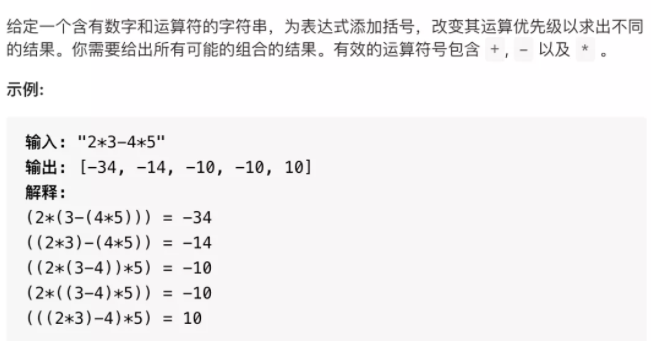

思路：

**1、不要思考整体，而是把目光聚焦局部，只看一个运算符**。

**2、明确递归函数的定义是什么，相信并且利用好函数的定义**。


显然我们有四种加括号方式：

```
(1)   +    (2 * 3 - 4 * 5)
(1 + 2)   *   (3 - 4 * 5)
(1 + 2 * 3)   -   (4 * 5)
(1 + 2 * 3 - 4)   *   (5)
```

那么前边的和后边的又可以递归

最后再将左右两边根据中间运算符进行运算

```java
List<Integer> diffWaysToCompute(String input) {
	List<Integer> res = new LinkedList<>();
    for (int i = 0; i < input.length(); i++) {
        char c = input.charAt(i);
        // 扫描算式 input 中的运算符
        if (c == '-' || c == '*' || c == '+') {
            /****** 分 ******/
            
            // 以运算符为中心，分割成两个字符串，分别递归计算
            List<Integer> left = diffWaysToCompute(input.substring(0, i));
            List<Integer> right = diffWaysToCompute(input.substring(i + 1));
            /****** 治 ******/
            // 通过子问题的结果，合成原问题的结果
            for (int a : left)
                for (int b : right)
                    if (c == '+')
                        res.add(a + b);
                    else if (c == '-')
                        res.add(a - b);
                    else if (c == '*')
                        res.add(a * b);
        }
    }
    // base case
    // 如果 res 为空，说明算式是一个数字，没有运算符
    if (res.isEmpty()) {
        res.add(Integer.parseInt(input));
    }
    return res;
    
}

```

优化：减少重复记录，将字符串记录存储在HashMap中，如果已经存在，则直接取出，不在计算

```java
// 备忘录
HashMap<String, List<Integer>> memo = new HashMap<>();

List<Integer> diffWaysToCompute(String input) {
    // 避免重复计算
    if (memo.containsKey(input)) {
        return memo.get(input);
    }
    /****** 其他都不变 ******/

    /***********************/

    // 将结果添加进备忘录
    memo.put(input, res);
    return res;
}
```


# 并查集

基础知识请参考《数据结构与算法》

684：

# 回溯法

## 矩阵中的路径

请设计一个函数，用来判断在一个矩阵中是否存在一条包含某字符串所有字符的路径。路径可以从矩阵中的任意一个格子开始，每一步可以在矩阵中向左，向右，向上，向下移动一个格子。如果一条路径经过了矩阵中的某一个格子，则该路径不能再进入该格子。 例如在下面的3x4的矩阵中包含一条字符串"bcced"的路径（路径中的字母用斜体表示）。但是矩阵中不包含"abcb"路径，因为字符串的第一个字符b占据了矩阵中的第一行第二个格子之后，路径不能再次进入这个格子。


思路：

回溯法

首先，遍历这个矩阵，我们很容易就能找到与字符串str中第一个字符相同的矩阵元素ch。

然后遍历ch的上下左右四个字符，

如果有和字符串str中下一个字符相同的，就把那个字符当作下一个字符（下一次遍历的起点），

如果没有，就需要回退到上一个字符，然后重新遍历。为了避免路径重叠，需要一个辅助矩阵来记录路径情况。


```java
    public boolean exist(char[][] board, String word) {
        //判断矩阵形状
        if(board.length==0) {
            return false;
        }
        //定义二维矩阵标记是否已经遍历过
        boolean[][] vis = new boolean[board.length][board[0].length];
        //初始化全为false
        //遍历每一个，寻找第一个字符
        for (int i = 0; i < board.length; i++) {
            for (int j = 0; j < board[0].length; j++) {
                //以第一个字符为起点深度遍历，找到一个就返回
                //
                if (dfs(board,word,i,j,vis,0)){
                    return true;
                }
            }
        }
        //一直没有，返回false
        return false;
    }
    //id代表在所需要查的字符串的第几个位置了匹配到
    public boolean dfs(char[][] board, String word,int i,int j,boolean[][] vis,int id) {
        //回溯函数，成功退出和失败退出
        //先考虑失败退出
        if(i<0 || i>=board.length || j<0 || j>=board[0].length || vis[i][j] == true){
            return false;
        }
        if (board[i][j] != word.charAt(id)){
            return false;
        }
        //成功退出
        //word遍历完了
        if (id == word.length() -1){
            return true;
        }
        //如果到现在还没退出，就从该位置开始遍历
        vis[i][j] = true;
        boolean flag = dfs(board,word,i+1,j,vis,id+1)
                    || dfs(board,word,i-1,j,vis,id+1)
                    || dfs(board,word,i,j+1,vis,id+1)
                    || dfs(board,word,i,j-1,vis,id+1);
        //每次回溯完之后，再改回来
        vis[i][j] = false;
        return flag;
    }
```

## 机器人的运动范围


地上有一个m行和n列的方格。一个机器人从坐标0,0的格子开始移动，每一次只能向左，右，上，下四个方向移动一格，但是不能进入行坐标和列坐标的数位之和大于k的格子。 例如，当k为18时，机器人能够进入方格（35,37），因为3+5+3+7 = 18。但是，它不能进入方格（35,38），因为3+5+3+8 = 19。请问该机器人能够达到多少个格子？

思路：

搜索问题，则DFS或者BFS

递归思路：该点(i,j)出发到达的格子数 = 1+ （i-1,j）+ (i,j-1) + (i+1,j) + (i,j+1)

矩阵搜索，一定需要一个二维数组记录当前格子是否被访问过，

搜索问题深度优先更直观


代码：

```java
public class offer66MovingCount {

    public int movingCount(int m,int n,int k){
        boolean[][] visited = new boolean[m][n];
        //机器人从[0,0]开始移动
        return dfs(m,n,k,visited,0,0);
    }

    private int dfs(int m, int n, int k, boolean[][] visited, int x, int y) {
        //递归终止条件,如果已经访问过或者超出k的限制
        if((get(x) + get(y) > k) || x <0 ||x>=m || y >=n ||visited[x][y]){
            return 0;
        }
        //将该格子标记为已经访问过
        visited[x][y] = true;
        //递归搜索其他四个方向
        return 1 + dfs(m,n,k,visited,x,y+1)
                 + dfs(m,n,k,visited,x,y-1)
                 + dfs(m,n,k,visited,x-1,y)
                 + dfs(m,n,k,visited,x+1,y);
    }

    private int get(int x) {
        int res = 0;
        while (x != 0) {
            res += x % 10;
            x /= 10;
        }
        return res;
    }
    /*    public int movingCount(int m, int n, int k) {
        if (k == 0) {
            return 1;
        }
        Queue<int[]> queue = new LinkedList<int[]>();
        // 向右和向下的方向数组
        int[] dx = {0, 1};
        int[] dy = {1, 0};
        boolean[][] vis = new boolean[m][n];
        queue.offer(new int[]{0, 0});
        vis[0][0] = true;
        int ans = 1;
        while (!queue.isEmpty()) {
            int[] cell = queue.poll();
            int x = cell[0], y = cell[1];
            for (int i = 0; i < 2; ++i) {
                int tx = dx[i] + x;
                int ty = dy[i] + y;
                if (tx < 0 || tx >= m || ty < 0 || ty >= n || vis[tx][ty] || get(tx) + get(ty) > k) {
                    continue;
                }
                queue.offer(new int[]{tx, ty});
                vis[tx][ty] = true;
                ans++;
            }
        }
        return ans;
    }*/
}
```


# 数学计算

### 数值的整数次方

给定一个double类型的浮点数base和int类型的整数exponent。求base的exponent次方。

思路：

暴力

用n个base相乘即可

快速幂

指数减半，底数平方

举例

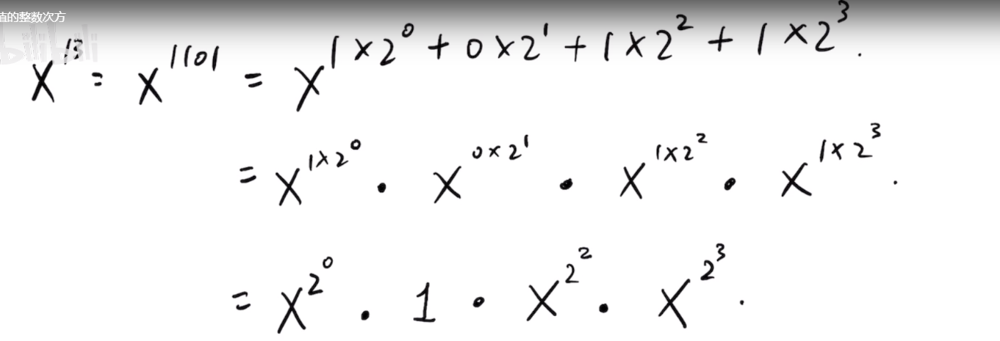

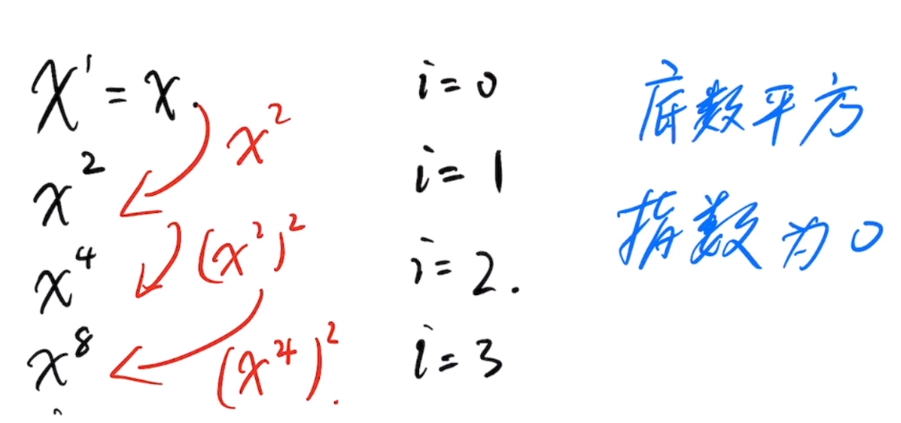

```java
    public double myPow(double x, int n) {
        //特判
        if(x == 0){
            return 0;
        }
        long b = n;
        double result = 1.0;
        //如果小于零，求
        if (b < 0){
            b = -b;
            x = 1/x;
        }
        while(b > 0){
            //如果是奇数
            if ((b%1)==1){
                result *= x;
            }
            //底数平方，指数减半
            b >>=1;
            x *=x;
        }
        return result;
    }
```


# 其他：

从一个日志文件中根据关键字读取日志，记录出现的次数，最后按照次数排序打印

```java
public class AnswerApp {

    public static void main(String[] args) throws IOException {
        long startTime = System.currentTimeMillis();

        statistics();

        long endTime = System.currentTimeMillis();

        System.out.println("execute time " + (endTime - startTime) + " ms.");
    }


    public static void statistics() throws IOException {
        System.out.println("请输入搜索关键词(多个关键词以英文逗号隔开):");
        Scanner scanner = new Scanner(System.in);
        String keyWord = scanner.nextLine();

        String[] keyWords = keyWord.split(",");

        File file = new File("C:\\Users\\answer\\work detail.txt");
        BufferedReader bufferedReader = new BufferedReader(new FileReader(file));
		
		// 直接读取文本到集合中. commons.io 包	
//		List<String> datas = FileUtils.readLines(file, Charsets.UTF_8);

        String line;

        // 定义一个结果存储容器, key 为 关键词, value 为关键词出现的次数
        HashMap<String, Integer> resultMap = new HashMap<>();

        while ((line = bufferedReader.readLine()) != null) {
            for (String kw : keyWords) {
                kw = kw.trim();

                if (StringUtils.isEmpty(kw)) {
                    continue;
                }

                int count = line.split(kw).length - 1;

                // 如果是以 关键词 结尾的, 此处会统计不到, 因此要单独判断
                if (count == 0) {
                    if (line.endsWith(kw)) {
                        count = 1;
                    }
                }

                if (resultMap.containsKey(kw)) {
                    resultMap.put(kw, resultMap.get(kw) + count);
                } else {
                    resultMap.put(kw, count);
                }
            }
        }

        List<Map.Entry<String, Integer>> list = Lists.newArrayList(resultMap.entrySet());

        // 自定义比较器, 根据 list 中元素的 value 值进行 从大到小 排序
        list.sort((o1, o2) -> o2.getValue() - o1.getValue());

        System.out.println();
        System.out.println("统计结果: ");
        for (Map.Entry entry : list) {
            System.out.println(entry.getKey() + " " + entry.getValue());
        }

    }

}
```


# 贪心

## 任务调度器

LeetCode621：

给你一个用字符数组 tasks 表示的 CPU 需要执行的任务列表。其中每个字母表示一种不同种类的任务。任务可以以任意顺序执行，并且每个任务都可以在 1 个单位时间内执行完。在任何一个单位时间，CPU 可以完成一个任务，或者处于待命状态。

然而，两个 相同种类 的任务之间必须有长度为整数 n 的冷却时间，因此至少有连续 n 个单位时间内 CPU 在执行不同的任务，或者在待命状态。

你需要计算完成所有任务所需要的 最短时间 。

 

示例 1：

输入：tasks = ["A","A","A","B","B","B"], n = 2
输出：8
解释：A -> B -> (待命) -> A -> B -> (待命) -> A -> B
     在本示例中，两个相同类型任务之间必须间隔长度为 n = 2 的冷却时间，而执行一个任务只需要一个单位时间，所以中间出现了（待命）状态。 

思路：

返回最小的，一般是动态规划或者是贪心

首先将任务进行统计，假设统计完是6个A，6个B，3个C，2个F，2个E，n = 5，则我们可以取最长的一个做标杆，画格子，画最长-1行，因为最后一行不需要补东西，然后将其他任务填入后边，空下的必须用空任务去补，但是由于最大的不唯一，故不能直接计算相乘再加上多余的，所以计算空格的地方，然后用任务量加上空格的地方即可。

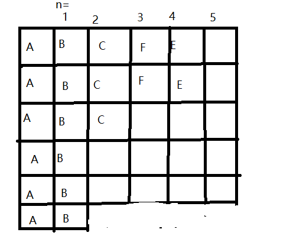

```java
    public int leastInterval(char[] tasks, int n) {
        int[] record = new int[26];
        for (char c :tasks){
            record[c -'A']++;
        }
        Arrays.sort(record);
        int max_n = record[25]-1;
        //由于最大的不唯一，所以只能算补出来的，然后再加上任务量
        int space = max_n * n;
        for (int i = 24; i >=0 && record[i]>0 ; i--) {
            space-=Math.min(max_n,record[i]);
        }
        return space>0? tasks.length+space : tasks.length;
    }
```


# 经验

input Size VS Time Complexity

输入范围推算算法使用

CPU上线2*10^9

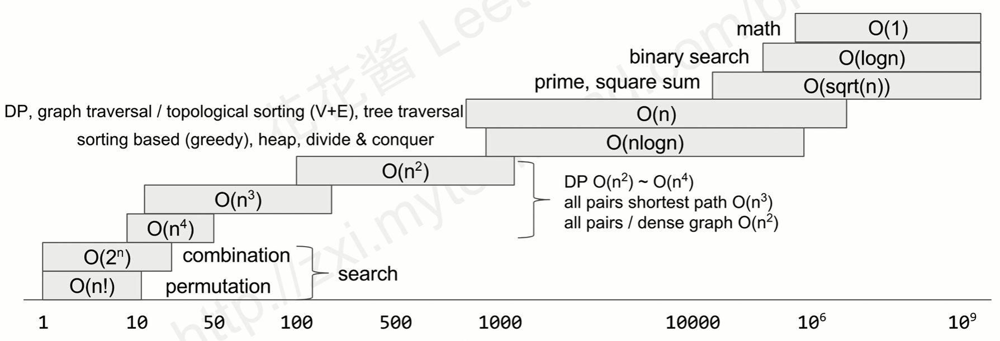


递归的时间与空间复杂度


# 多线程


用两个线程，一个输出字母，一个输出数字，交替输出，

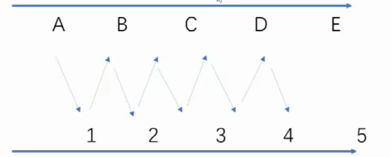


有这样一个任务T，T由N个子任务构成，每个子任务完成的时长不同，若其中一个子任务失败，所有任务结束，T任务失败，请写程序模拟这个过程，要求，Fail Fast 即只要有一个结束失败，立即通知其他线程不再执行了。

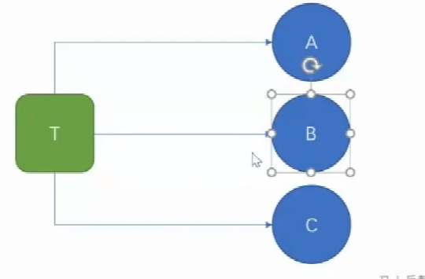


