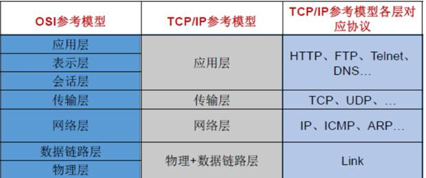
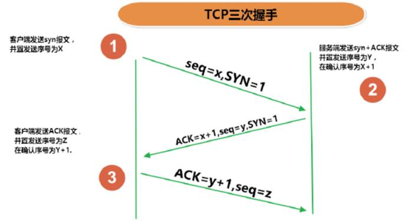
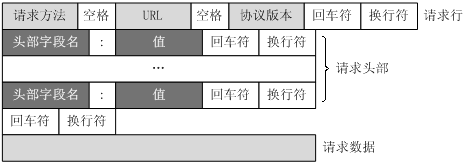

# 第一章：计算机网络体系结构

## 1：概述

### 1.1：名称解释

性能指标：

1）带宽：网络的通信线路传送数据的能力。即：在单位时间内从网络中的某一个点到另一点所能通过的“最高数据率”。

2）时延：数据（一个报文或分组，甚至比特）从网络（或链路）的一端传送到另一端所需的时间。

发送时延：主机或路由器发送数据帧所需要的时间，即：从发送数据帧的第一个比特算起到该帧的最后一个比特发送完毕所需要的时间。

传播时延：电磁波在信道中传播一定的距离需要花费的时间。

处理时延：主机或路由器在收到分组时要花费一定的时间进行处理。

排队时延：分组在经过网络传输时，要经过许多路由器。但分组在进入路由器后要先在输入队列中排队等待处理。

6:）时延带宽积：传播时延*带宽

7）往返时延RTT：从发送方发送数据开始，到发送方收到来自接收方的确认总共经历的时间。

8）吞吐量：在单位时间内通过某个网络（信道/接口）的数据量。

9）速率：连接在计算机网络上的主机在数字信道上传送数据的速率

服务：

1）面向连接和无连接服务

2）可靠服务和不可靠服务

3）有应答服务和无应答服务

### 1.2：分类

按交换技术分：

1）电路交换网络：专用通道

2）报文交换网络：

存储转发的传输方式，

加上原地址和目的地址，校检码

3）分组交换网络：

存储转发的传输方式

包交换，

 

### 1.3：网络模型

 

 

# 第二章：物理层

## **2.1、基带调制**

1）编码：把数字信号转换为另一种形式的数字信号。

常用编码方式：不归零制，归零制（正脉冲代表1，负脉冲代表0），曼彻斯特编码（位周期中心的向上跳变代表0，向下代表1，反之亦可），差分曼彻斯特编码（每一位的中心处始终有跳变。位开始边界有跳变为0，位开始边界无跳变为1）。

2）基本的带通调制方法

调幅，调频，调相

## 2.1：通信基础

奈奎斯特定理：

香农定理：

编码方式

## 2.2：传输介质

## 2.3：信道复用

1）频分复用FDM:所有用户在同样的时间占用不同的带宽频率（频率带宽）

2）TDM:

3）波分复用WDM：

4）码分复用CDM: 

码分多址CDMA

## 2.3：物理层设备

中继器，集线器

 

# 第三章：数据链路层

三个基本问题：封装成帧，透明传输，差错检测

 **数据链路层拆分为两个子层**

1）逻辑链路控制LLC

2）媒体接入控制MAC

CSMA/CD

载波监听

# 第四章：网络层

##  4.1：IP

1)地址解析协议ARP(Address Resolution Protocol)

2)网际控制报文协议ICMP(Internet Control Message Protocol)

3)网际组管理协议IGMP(Internet Group Management Protocol)

私有地址

私有地址包括3组

A类：10.0.0.0~10.255.255.255

B类：172.16.0.0~172.31.255.255

C类：192.168.0.0~192.168.255.255

# 第五章：传输层

## 5.2：UDP协议

使用UDP协议包括：TFTP（简单文件传输协议）、SNMP（简单网络管理协议）、DNS（域名解析协议）、NFS、BOOTP。

## 5.3：TCP协议

TCP报文首部格式：

 　**注：seq**:"sequance"序列号；**ack**:"acknowledge"确认号；**SYN**:"synchronize"请求同步标志；**；ACK**:"acknowledge"确认标志"**；****FIN**："Finally"结束标志。

TCP协议通过使用连续ARQ协议和滑动窗口协议，来保证数据传输的正确性，从而提供可靠的传输。

1）ARQ协议，即自动重传请求

2）连续ARQ协议：由于停止等待ARQ协议信道利用率太低，所以需要使用连续ARQ协议来进行改善。这个协议会连续发送一组数据包，然后再等待这些数据包的ACK。

发送方采用流水线传输。流水线传输就是发送方可以连续发送多个分组，不必每发完一个分组就停下来等待对方确认

3）滑动窗口协议：在发送方和接收方之间各自维持一个滑动窗口，发送方是发送窗口，接收方是接收窗口，而且这个窗口是随着时间变化可以向前滑动的。它允许发送方发送多个分组而不需等待确认。TCP的滑动窗口是以字节为单位的。

拥塞控制：

1）慢开始

指在TCP开始发送报文段时先设置拥塞窗口为1。

2）拥塞避免

3）快重传

4）快恢复

## 5.4：对比

TCP与UDP有什么不同

|              | UDP                                        | TCP                                    |
| :----------- | :----------------------------------------- | -------------------------------------- |
| 是否连接     | 无连接                                     | 面向连接                               |
| 是否可靠     | 不可靠传输，不使用流量控制和拥塞控制       | 可靠传输，使用流量控制和拥塞控制       |
| 连接对象个数 | 支持一对一，一对多，多对一和多对多交互通信 | 只能是一对一通信                       |
| 传输方式     | 面向报文                                   | 面向字节流                             |
| 首部开销     | 首部开销小，仅8字节                        | 首部最小20字节，最大60字节             |
| 适用场景     | 适用于实时应用（IP电话、视频会议、直播等） | 适用于要求可靠传输的应用，例如文件传输 |

# 第六章：应用层

## 6.1：HTTP

HTTP请求由三部分组成，分别是：
（1）请求行：
（2）消息报头；
（3）请求正文。

HTTP响应由四部分组成，分别是：
（1）状态行；
（2）消息报头；
（3）空行；
（4）响应正文；

请求方法

HTTP 1.0包括三种请求方法，分别是:
（1）GET：请求指定的页面信息，并返回实体主体。
（2）HEAD：类似于get请求，只不过返回的响应中没有具体的内容，用于获取报头
（3）POST：向指定资源提交数据进行处理请求（例如提交表单或者上传文件）。数据被包含在请求体中。POST请求可能会导致新的资源的建立和/或已有资源的修改。
HTTP 1.1中新增了五中请求方法：
（1）OPTIONS： 允许客户端查看服务器的性能；
（2）PUT： 从客户端向服务器传送的数据取代指定的文档的内容；
（3）DELETE：请求服务器删除指定的页面；
（4）TRACE：回显服务器收到的请求，主要用于测试或诊断；
（5）CONNECT：HTTP/1.1协议中预留给能够将连接改为管道方式的代理服务器。

http协议不同的版本区别：

HTTP 1.0：

（1）、支持POST、GET、HEAD三种方法；
（2）、规定浏览器与服务器之间只保持短暂的连接，浏览器的每次请求都需要与服务器建立一个TCP连接，服务器完成请求处理后立即断开TCP连接，服务器不跟踪每个客户也不记录过去的请求；

HTTP 1.1：

（1）、新增了五种请求方法：PUT、DELETE、CONNECT、TRACE、OPTIONS；
（2）、HTTP 1.1 在Request消息头里头多了一个Host域，便于一台WEB服务器上可以在同一个IP地址和端口号上使用不同的主机名来创建多个虚拟WEB站点；
（3）、在HTTP/1.1中新增了24个状态响应码：
100-199 用于指定客户端应相应的某些动作。
200-299 用于表示请求成功。
300-399 用于已经移动的文件并且常被包含在定位头信息中指定新的地址信息。
400-499 用于指出客户端的错误。
500-599 用于支持服务器错误。

http调优

1：使用base64码减少请求

2：httpCLient

修改连接池连接数

设置失败重试次数

设置连接超时时长

缓存

## 6.2：DNS

