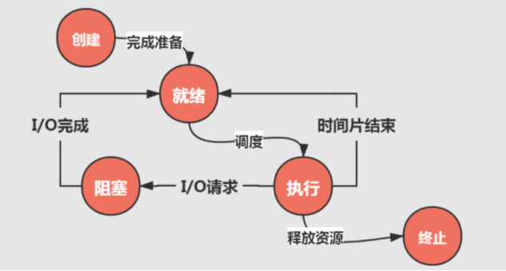
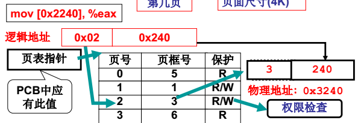
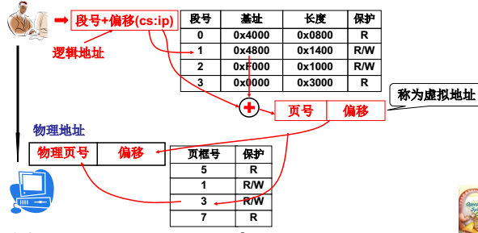
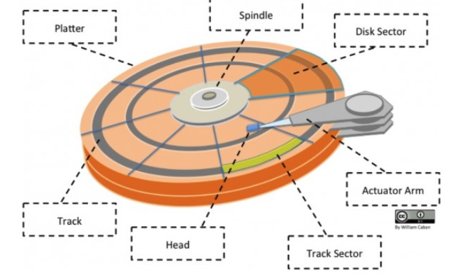

# 第一章：绪论

## 1.1：作用

作为用户与计算机硬件系统之间的接口

作为计算机系统资源的管理者

实现对计算机资源的抽象

## 1.2：发展

人工操作

脱机输入/输出方式


**单道批处理**

特点：单路性、独占性、自动性、封闭性、顺序性

缺点：系统的资源得不到充分的利用


**多道批处理**

特点：多路性、共享性、自动型、封闭性、无序性、调度性

好处：

提高CPU的利用率

提高内存和I/O设备的利用率

增加系统吞吐量

缺点：平均周转时间长，无交互能力


分时系统

实时系统

## 1.3：基本特征

并发：

同一段时间内多个程序执行(注意区别并行和并发，前者是同一时刻的多个事件，后者是同一时间段内的多个事件)

并发是指两个或则多个事件在同一时刻发生，

而并发是指两个或多个事件在同一时间间隔内发生

共享：

系统中的资源可以被内存中多个并发执行的进线程共同使用

虚拟：

通过时分复用（如分时系统）以及空分复用（如虚拟内存）技术实现把一个物理实体虚拟为多个

异步：

系统中的进程是以走走停停的方式执行的，且以一种不可预知的速度推进

1.4：主要功能

处理机管理

存储器管理

设备管理

文件管理

用户接口

## 1.5

1. 大内核

大内核是将操作系统功能作为一个紧密结合的整体放到内核。

由于各模块共享信息，因此有很高的性能。

2. 微内核

由于操作系统不断复杂，因此将一部分操作系统功能移出内核，从而降低内核的复杂性。移出的部分根据分层的原则划分成若干服务，相互独立。

在微内核结构下，操作系统被划分成小的、定义良好的模块，只有微内核这一个模块运行在内核态，其余模块运行在用户态。

因为需要频繁地在用户态和核心态之间进行切换，所以会有一定的性能损失。


# 第二章：进程管理

PCB：进程控制块，用于存放进程的管理和控制信息的数据结构

## 进程

状态

三态模型：


**`就绪状态`** 是指进程已经被分配到了所有必需的资源，除了`CPU`。在这个状态下，进程处于箭在弦上随时待发的状态，只要一获得`CPU`的执行权限，进程便会立刻执行，从而进入执行状态。

当有多个处于就绪状态的进程时，不同的进程会根据优先级被划分入不同的队列。一个因为时间片用完而进入就绪状态的进程会被划分入低优先级队列，而因为`I/O`操作完成而进入就绪状态的进程，则会被划分入高优先级队列。

**`执行状态`** 是指进程正常运行的状态。而当处于执行状态的进程由于需要等待某个事件发送（通常为等待`I/O`）时，就会放弃`CPU`，从而进入暂时的阻塞状态。`CPU`这时一旦空出，通过不同的调度算法，`CPU`又会被分配给另一个就绪进程。

**`阻塞状态`** 相当于就绪状态和执行状态的一个缓冲状态。当处于执行状态的进程无法正常执行时，会先进入阻塞状态，等待需要的请求执行完成，再回到就绪状态，等待下一次的`CPU`分配和执行。


五态模型



**`创建状态`** 是指进程刚刚创建的状态，在这个状态下，需要等待操作系统完成创建和分配进程的各种所需信息，包括建立`PCB（Process Control Block）`、加载程序并创建地址空间等。在完成这些准备工作后，该进程的状态就会转移为就绪状态并划分入就绪队列中。

**`终止状态`** 代表着进程的结束，当进程执行完成后，需要操作系统在终止状态对进程的运行结果进行善后处理。这样的善后处理包括对进程所使用的资源进行回收，并将其它进程所需要的信息传递出去。最后，操作系统还需要对终止的进程进行内存释放，将其`PCB`中的内容清空，并将这部分内存返还给系统。

七态模型


活跃就绪是指进程在主存并且可被调度的状态。而静止就绪状态是指就绪进程被对换到辅存时的状态，它是不能被直接调度的状态，只有当主存中没有活跃就绪态进程，或者是挂起态进程具有更高的优先级时，系统才会把挂起就绪态进程调回主存并转换为活跃就绪状态。

## 线程

线程是程序执行的任务，它是程序使用CPU的基本单位，


## 中断


## 进程同步

临界区

对临界资源进行访问的那段代码称为临界区。

为了互斥访问临界资源，每个进程在进入临界区之前，需要先进行检查。

2. 同步与互斥

- 同步：多个进程按一定顺序执行；

- 互斥：多个进程在同一时刻只有一个进程能进入临界区。

信号量

> P 和 V 是来源于两个荷兰语词汇，P() ---prolaag （荷兰语，尝试减少的意思），V() ---verhoog（荷兰语，增加的意思）

信号量（Semaphore）是一个整型变量，可以对其执行 down 和 up 操作，也就是常见的 P 和 V 操作。


4. 管程

管程 (英语：Monitors，也称为监视器) 是一种程序结构，结构内的多个子程序（对象或模块）形成的多个工作线程互斥访问共享资源。

使用信号量机制实现的生产者消费者问题需要客户端代码做很多控制，而管程把控制的代码独立出来，不仅不容易出错，也使得客户端代码调用更容易。

管程是为了解决信号量在临界区的 PV 操作上的配对的麻烦，把配对的 PV 操作集中在一起，生成的一种并发编程方法。其中使用了条件变量这种同步机制。


### 经典同步问题：

1：读者写者问题

2：哲学家进餐问题


五个哲学家围着一张圆桌，每个哲学家面前放着食物。哲学家的生活有两种交替活动：吃饭以及思考。当一个哲学家吃饭时，需要先拿起自己左右两边的两根筷子，并且一次只能拿起一根筷子。

为了防止死锁的发生，可以设置两个条件：

- 必须同时拿起左右两根筷子；
- 只有在两个邻居都没有进餐的情况下才允许进餐。

3：


## 进程通信

### 管道

管道是通过调用 pipe 函数创建的，fd[0] 用于读，fd[1] 用于写。

```
#include <unistd.h>
int pipe(int fd[2]);
```

它具有以下限制：

- 只支持半双工通信（单向传输）；
- 只能在父子进程中使用。
### 命名管道

也称为命名管道，去除了管道只能在父子进程中使用的限制。

```
#include <sys/stat.h>
int mkfifo(const char *path, mode_t mode);
int mkfifoat(int fd, const char *path, mode_t mode);
```

FIFO 常用于客户-服务器应用程序中，FIFO 用作汇聚点，在客户进程和服务器进程之间传递数据。

### 消息队列

间接（内核）

相比于 FIFO，消息队列具有以下优点：

- 消息队列可以独立于读写进程存在，从而避免了 FIFO 中同步管道的打开和关闭时可能产生的困难；
- 避免了 FIFO 的同步阻塞问题，不需要进程自己提供同步方法；
- 读进程可以根据消息类型有选择地接收消息，而不像 FIFO 那样只能默认地接收。

### 信号量

它是一个计数器，用于为多个进程提供对共享数据对象的访问。

### 共享内存

允许多个进程共享一个给定的存储区。因为数据不需要在进程之间复制，所以这是最快的一种 IPC。

需要使用信号量用来同步对共享存储的访问。

多个进程可以将同一个文件映射到它们的地址空间从而实现共享内存。另外 XSI 共享内存不是使用文件，而是使用使用内存的匿名段。

### 套接字

与其它通信机制不同的是，它可用于不同机器间的进程通信。

## 线程间通信

- 锁机制：包括互斥锁，条件变量，读写锁
  - 互斥锁提供了以排他方式防止数据结构被并发修改的问题
  - 读写锁运行多线程同时读共享数据，而对写操作是互斥的
  - 条件变量可以以原子方式阻塞进程，知道某个特定条件为真为止。对条件的测试是在互斥锁的保护下进行的，条件变量始终与互斥锁一起使用。
- 信号量机制（Semaphore）：包括无名线程信号量和命名线程信号量
- 信号机制（Signal）：类似进程间的信号处理，线程间的通信目的主要是用于线程同步，所以线程没有像进程通信中的用于数据交换的通信机制。

## 孤儿进程和僵尸进程

孤儿进程：一个父进程退出，而它的一个或多个子进程还在运行，那么那些子进程将成为孤儿进程。孤儿进程将被 init 进程（进程号为1）所收养，并由 init 进程对它们完成状态收集工作**。**

僵尸进程：一个进程使用 fork 创建子进程，如果子进程退出，而父进程并没有调用 wait 或 waitpid 获取子进程的状态信息，那么子进程的进程描述符仍然保存在系统中。这种进程称之为僵尸进程。


# 第三章：处理机调度与死锁

## 调度算法

先了解两个概念：

- 周转时间： 从开始申请执行任务，到执行任务完成
- 响应时间： 从开始申请执行任务到开始执行任务

**先来先服务调度算法FCFS：**按作业或者进程到达的先后顺序依次调度；（平均周转时间可能会很长 ）

**短作业优先调度算法SJF：**算法从就绪队列中选择估计时间最短的作业进行处理，直到得出结果或者无法继续执行（周转时间短，但是响应时间长 ）

**高相应比算法HRN：**响应比=(等待时间+要求服务时间)/要求服务时间；

**时间片轮转调度RR：**按到达的先后对进程放入队列中，然后给队首进程分配CPU时间片，时间片用完之后计时器发出中断，暂停当前进程并将其放到队列尾部，循环 ;（响应时间可以得到保证）

**多级反馈队列调度算法：**目前公认较好的调度算法；设置多个就绪队列并为每个队列设置不同的优先级，第一个队列优先级最高，其余依次递减。优先级越高的队列分配的时间片越短，进程到达之后按FCFS放入第一个队列，如果调度执行后没有完成，那么放到第二个队列尾部等待调度，如果第二次调度仍然没有完成，放入第三队列尾部…。只有当前一个队列为空的时候才会去调度下一个队列的进程。

## 死锁

**死锁定义：**

　　在两个或多个并发进程中，如果每个进程持有某种资源而又都等待别的进程释放它或它们现在保持着的资源，在未改变这种状态之前都不能向前推进，称这一组进程产生了死锁。通俗地讲，就是两个或多个进程被无限期地阻塞、相互等待的一种状态。

**产生条件：**

1：互斥条件     -- 一个资源一次只能被一个进程使用

2：请求保持条件 -- 一个进程因请求资源而阻塞时，对已经获得资源保持不放 

3：不可抢占条件 -- 进程已获得的资源在未使用完之前不能强行剥夺

4：循环等待条件 -- 若干进程之间形成一种头尾相接的循环等待资源的关系 


**死锁处理：**

1. 预防死锁：破坏产生死锁的4个必要条件中的一个或者多个；实现起来比较简单，但是如果限制过于严格会降低系统资源利用率以及吞吐量
2. 避免死锁：在资源的动态分配中，防止系统进入不安全状态(可能产生死锁的状态)-如银行家算法


1. 检测死锁：允许系统运行过程中产生死锁，在死锁发生之后，采用一定的算法进行检测，并确定与死锁相关的资源和进程，采取相关方法清除检测到的死锁。实现难度大
2. 解除死锁：与死锁检测配合，将系统从死锁中解脱出来（撤销进程或者剥夺资源）。对检测到的和死锁相关的进程以及资源，通过撤销或者挂起的方式，释放一些资源并将其分配给处于阻塞状态的进程，使其转变为就绪态。实现难度大
3. 死锁忽略： windows，Linux个人版都不做死锁处理，直接忽略，大不了重启就好了，小概率事件，代价可以接受


## 银行家算法


# 第四章：存储器管理

分段

一个程序分成多个段（每个段特性不同为了方便管理，例如代码段只读、数据段等等），当然这都是逻辑上的。

管理段的结构叫段表，段表保存中进程的PCB中。


### 页表

　　把程序按段分对程序员是友好的，但是如果物理存储也按段存，则会导致大块的内存碎片，例如现在需要分个10M的段但是连续的存储空间只有8M/9M/5M三个。**解决办法：** （将段打散存到页中）不要对内存进行连续的分配，将内存划分成1页1页，按页分配，1页4kb大小，最多浪费的也就4KB。这样不会有内存碎片，也不会出现没有符合要求大小的内存可以申请的情况，因为可以打散了分散到一页一页中。 



多级页表


### **段页结合的内存管理**

实际在内存管理中的段页结合如下图，页号加偏移称为虚拟地址，MMU负载从虚拟地址到物理地址的转换，同时也负责权限检查。




### **请求调页内存换入**

**CPU对数据进行请求时，才会进行映射（虚拟内存到物理内存）。**

****


页面置换算法

**1：最佳置换算法**（Optimal）：一种理论的算法，选着淘汰的页面是以后一定不再使用的页面（理想化的），该算法无法实现，只能作为其他算法好坏的一个评价对比。

**2：先进先出（FIFO）算法：**总是最先淘汰最先进去的页面，该算法容易实现。缺点：通常程序调入内存的先后顺序和程序执行的先后顺序不一致，导致缺页率高。

**3：最近最久未使用算法LRU：**算法赋予每个页面一个访问字段，用来记录上次页面被访问到现在所经历的时间t，每次置换的时候把t值最大的页面置换出去(实现方面可以采用寄存器或者栈的方式实现)。

**4：时钟算法clock(也被称为是最近未使用算法NRU)**：页面设置一个访问位R，并将页面链接为一个环形队列，页面被访问的时候访问位设置R为1。页面置换的时候，如果当前指针所指页面访问R为0，那么置换，否则将其置为0，循环直到遇到一个访问为位0的页面。


## 虚拟内存


# 第五章：设备管理

## 磁盘结构

- 盘面（Platter）：一个磁盘有多个盘面；
- 磁道（Track）：盘面上的圆形带状区域，一个盘面可以有多个磁道；
- 扇区（Track Sector）：磁道上的一个弧段，一个磁道可以有多个扇区，它是最小的物理储存单位，目前主要有 512 bytes 与 4 K 两种大小；
- 磁头（Head）：与盘面非常接近，能够将盘面上的磁场转换为电信号（读），或者将电信号转换为盘面的磁场（写）；
- 制动手臂（Actuator arm）：用于在磁道之间移动磁头；
- 主轴（Spindle）：使整个盘面转动。



## 磁盘调度算法

先来先服务

最短寻道时间

电梯算法


# 第六章：IO

依据`I/O`设备工作方式的不同，通常进行如下分类：

（1）字符设备`character device`，又叫做人机交互设备。用户通过这些设备实现与计算机系统的通信。它们大多是以字符为单位发送和接受数据的，数据通信的速度比较慢。

> 例如，键盘和显示器为一体的字符终端、打印机、扫描仪、包括鼠标等，还有早期的卡片和纸带输入和输出机。含有显卡的图形显示器的速度相对较快，可以用来进行图像处理中的复杂图形的显示。

（2）块设备`block device`，又叫外部存储器，用户通过这些设备实现程序和数据的长期保存。与字符设备相比，它们是以块为单位进行传输的，如磁盘、磁带和光盘等。块的常见尺寸为`512~32768B`之间。

（3）网络通信设备。这类设备主要有网卡、调制解调器等，主要用于与远程设备的通信。这类设备的传输速度比字符设备高，但比外部存储器低。

# 第六章：文件系统

#### 目录结构


# 第七章：操作系统接口

# 第八章：网络操作系统

# 第九章：系统安全性

# 第10章：Unix系统内核


