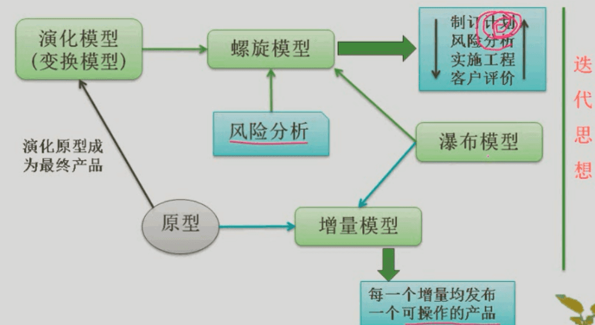
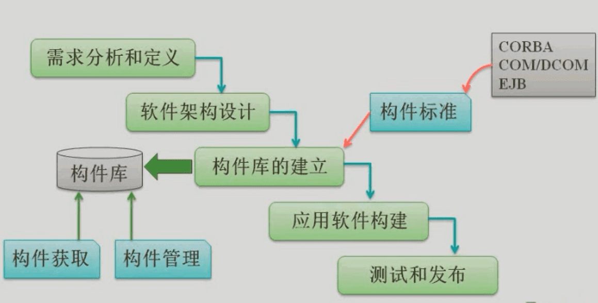
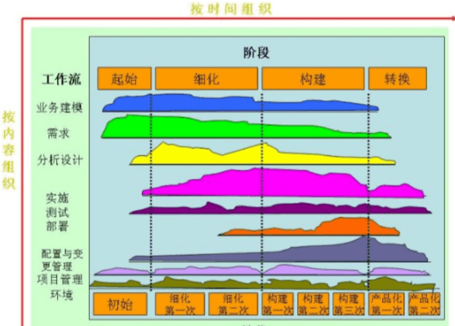
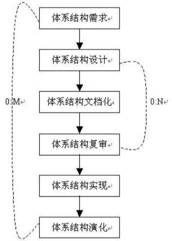

全文链接：https://www.cnblogs.com/nullering/p/9684820.html

## 一：软件生命周期

软件生存周期，分为8个阶段：

 1、可行性研究与计划 

2、需求分析 

3、概要设计 

4、详细设计 

5、实现 

6、集成测试 

7、确认测试 

8、使用和维护 

## 二：软件开发模型

### 1：瀑布模型

瀑布模型也称为生命周期法，是结构化方法中最常用的开发模型。开发如同瀑布，从一个阶段流向下一个阶段。其思想认为软件开发是一个阶段化的精确过程，每一个步骤都划分得很明确，阶段之间有明显的界线。

当软件需求明确、稳定时，可以采用瀑布模型，一旦需求变动剧烈，往往到测试阶段才暴露，造成修改代价太大，风险难以控制。

### 2：演化模型

若干次瀑布模型的迭代。原型的基础上，根据用户在调用原型的过程中提出的反馈意见和建议，对原型进行改进，获得原型的新版本，重复这一过程，直到演化成最终的软件产品。

根据迭代内容，演化模型可以演变为螺旋模型、增量模型和原型法开发。

### 3：增量模型

增量发布将系统划分为若干版本，每一个版本都是完整的。版本的划分要均匀。

### 4：螺旋模型

特点是强调风险，每次瀑布模型迭代前，引入风险控制。将软件项目分解成一个个小项目，每个都标识风险，直到所有风险都被确定。 
演化模型适合高风险项目。

### 5：原型

部分衍生关系：

 

### 6：快速应用开发（RAD）

　　是一个增量型的软件开发过程模型，强调极短的开发周期。RAD模型是瀑布模型的一个高速变种，通过大量使用可复用构件，**采用基于构件的建造方法**赢得快速开发。如果需求理解得好且约束了项目的范围，利用这种模型可以很快地创建出功能完善的信息系统。其流程从业务建模开始，随后是数据建模、过程建模、应用生成、测试及反复。

RAD只能用于信息系统的开发，不适合技术风险很高的情况。

### 7：敏捷开发

极限编程，自适应编程，特性驱动开发，水晶方法，Scrum

增量迭代开发，整个开发过程由若干个短的迭代周期组成，一个短周期称为一个sprint，长度2到4周，甚至1周。 
scrum按照优先顺序对用户需求进行排序、开发，每个条目称为用户故事。

基本原则一致为：

从开发者角度，主要关注点有短平快会议（Stand Up）、小版本发布（Frequent Release）、较少的文档（Minimal Documentation）、合作为重（Collaborative Focus）、客户直接参与（Customer Engagement）、自动化测试 （Automated Testing）、 适应性计划调整 （Adaptive Planning）和结对编程 （Pair Programming）；

从管理者的角度，主要的关注点有测试驱动开发（Test-Driven Development）、持续集（Continuous Integration）和重构（Refactoring）。

### 7：构件组装模型

面向构件的编程（COP）：

关注于如何支持建立面向构件的解决方案。一个基于一般 OOP 风格的 COP 定义如下（ Szyperski ，1995）：

面向构件的编程需要下列基本的支持：

——多态性（可替代性）；

——模块封装性（高层次信息的隐藏）；

——后期的绑定和装载（部署独立性）；

——安全性（类型和模块安全性）。 

 

### 8：统一过程

二维模型，横轴是时间，纵轴是工作内容。

RUP 也称为 UP 、统一过程，其核心特点是：以架构为中心，用例驱动，迭代与增量。该开发模型分4个阶段，分别为：

初始：是为系统建立业务模型并确定项目的边界。

细化：确定系统的体系结构细化阶段的任务是分析问题领域，建立健全的架构基础，淘汰项目中最高风险的元素。

构造：在构建阶段，要开发所有剩余的构件和应用程序功能，把这些构件集成为产品，并进行详细测

交付：交付阶段的重点是确保软件对最终用户是可用的。交付阶段的主要任务是进行β测试，制作产品发布版本；对最终用户支持文档定稿；按用户的需求确认新系统；培训用户和维护人员；获得用户对当前版本的反馈，基于反馈调整产品，如进行调试、性能或可用性的增强等。 

### 10：软件重用

 

### 11：基于架构的软件设计

**1：ABSD**

1）ABSD有3个基础： 
功能分解 
选择架构风格来实现质量和业务需求 
使用软件模板

2）ABSD方法与生命周期

3：ABSD开发模型

ABSDM。将这种基于架构的软件过程划分为 
架构需求、设计、文档化、复审、实现、演化6个子过程。

##  三：软件开发方法

###  净室方法

　　净室方法从使用盒结构表示的分析和设计模型入手，一个“盒”在某特定的抽象层次上封装系统（或系统的某些方面）。通过逐步求精的过程，盒被精化为层次，其中每个盒具有引用透明性：每个盒规约的信息内容对定义其精华是足够的，不需要信赖于任何其他盒的实现。这使得分析人员能够层次地划分一个系统，从在顶层的本质表示转移向在底层的实现特定的细节。

净室方法主要使用三种盒类型：

（1）黑盒。这种盒刻划系统或系统的某部分的行为。通过运用由激发得到反应的一组变迁规则，系统（或部分）对特定的激发（事件）作出反应。

（2）状态盒。这种盒以类似于对象的方式封装状态数据和服务（操作）。在这个规约视图中，表示出状态盒的输入（激发）和输出（反应）。状态盒也表示黑盒“激活历史”，即，封装在状态盒中的，必须在蕴含的变迁间保留的数据。

（3）清晰盒。在清晰盒中定义状态盒所蕴含的变迁功能，简单地说，清晰盒包含了对状态盒的过程设计。

### 结构化方法

　　结构化方法属于自顶向下的开发方法，其基本思想是“**自顶向下，逐步求精**”，强调开发方法的结构合理性及所开发软件的结构合理性。结构是指系统内各个组成要素之间的相互联系、相互作用的框架。结构化开发方法提出了一组提高软件结构合理性的准则，如分解与抽象、模块独立性、信息隐蔽等。

　　针对软件生存周期各个不同的阶段，它包括了

结构化分析（Structured Analysis，A）、结构化设计（Structured Design，SD）结构化程序设计（Structured Programing，P）

### 面向对象方法

面向对象方法是当前的主流开发方法，拥有大量不同的方法，主要包括OMT（对象建模技术）方法、Coad/Yourdon方法、OOSE（面向对象的软件工程）及Booch方法等，

而OMT、OOSE及Booch最后可统一成为UML（统一建模语言）。

详情请参考：《[软考架构师（14）——面向对象方法](https://www.cnblogs.com/nullering/p/9784471.html) 》

### 原型法

抛弃型原型：主要用于解决需求不确定性，二义性，不完整性，和含糊性

演化性原型：为开发增量式产品提供基础，主要用于必须易于升级和优化，适合于Web的项目

### 逆向工程

再工程：

软件重构：

逆向工程：

实现级：包括程序的抽象语法树、符号表、过程的设计表示。

结构级：包括反映程序分量之间相互依赖关系的信息，例如调用图、结构图、程序和数据结构。

功能级：包括反映程序段功能及程序段之间关系的信息，例如数据和控制流模型。

领域级：包括反映程序分量或程序诸实体与应用领域概念之间对应关系的信息，例如实体关系模型。

 

##  四：系统规划

### 1：可行性分析

（1）技术可行性。

（2）经济可行性。

（3）操作可行性。

### 2：成本效益分析

 

### 3：新旧系统分析与比较

 

 

## 五：需求工程

### 1：需求获取

用户访谈，用户调查，现场观摩，阅读历史文档，联合讨论会

### 2：需求分析

业务流程分析：

数据流图：数据的流动方向

数据字典：数据的信息集合

### 3：需求定义

 

### 4：需求管理

 

## 六：软件测试

### 1：类型

动态测试：运行程序时发现错误，分为黑盒【等价类划分，边界值分析，错误推测，因果图】，白盒【逻辑覆盖，循环覆盖，基本路径法】，灰盒

静态测试：指被测试程序不在机器上运行，而采用人工检测和计算机辅助静态分析的手段对程序进行检测，有桌前检查，代码审查，代码走查

### 2：测试的阶段：

**1：单元测试：**

其目的在于检查每个程序单元能否正确实现详细设计说明中的模块功能、性能、接口和设计约束等要求，以及发现各模块内部可能存在的各种错误。

单元测试需要从程序的内部结构出发设计测试用例，多个模块可以平行地独立进行单元测试。

**2：集成测试：**

　　它将已通过单元测试的模块集成在一起，主要测试模块之间的协作性。从组装策略而言，可以分为一次性组装和增量式组装（包括自顶向下、自底向上及混合式）两种。

模块并不是一个独立的程序，在考虑测试模块时，同时要考虑它和外界的联系，用一些辅助模块去模拟与被测模块相联系的其它模块。这些辅助模块分为两种：

（1）驱动模块：相当于被测模块的主程序。它接收测试数据，把这些数据传送给被测模块，最后输出实测结果。

（2）桩模块：用以代替被测模块调用的子模块。桩模块可以做少量的数据操作，不需要把子模块所有功能都带进来，但不允许什么事情也不做。

**3：确认测试：**

确认测试也称为有效性测试，主要包括验证软件的功能、性能及其他特性是否与用户要求（需求）一致。确认测试计划通常是在需求分析阶段完成的。根据用户的参与程度，通常包括以下4种类型：

（1）内部确认测试：主要由软件开发组织内部按软件需求说明书进行测试。
（2）Alpha 测试：由用户在开发环境下进行测试。
（3）Beta 测试：由用户在实际使用环境下进行测试。
（4）验收测试：针对软件需求说明书，在交付前以用户为主进行的测试

**4：系统测试：**

如果项目不只包含软件，还有硬件和网络等，则要将软件与外部支持的硬件、外设、支持软件、数据等其他系统元素结合在一起，在实际运行环境下，对计算机系统进行一系列集成与确认测试。

一般来说，系统测试的主要内容包括功能测试、健壮性测试、性能测试、用户界面测试、安全性测试、安装与反安装测试等。

系统测试计划通常在系统分析阶段（需求分析阶段）完成。

### 3：性能测试

 

 

 

 