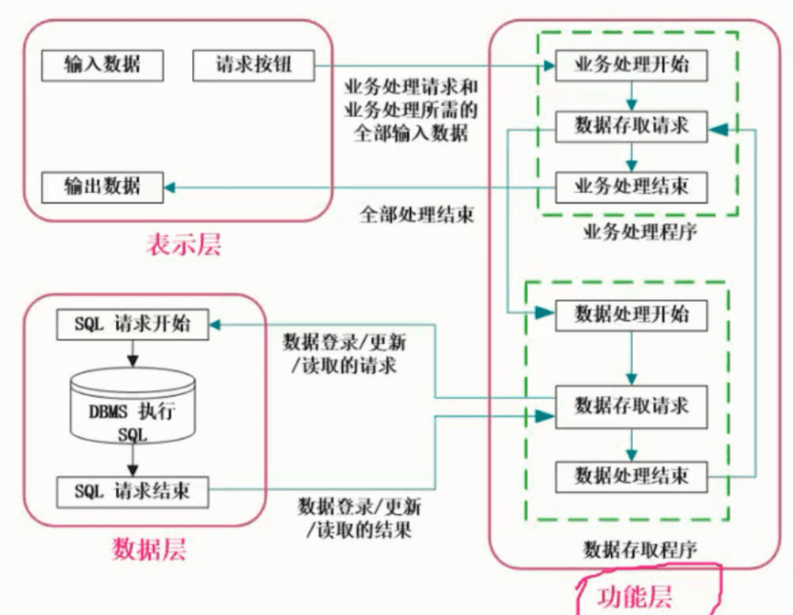
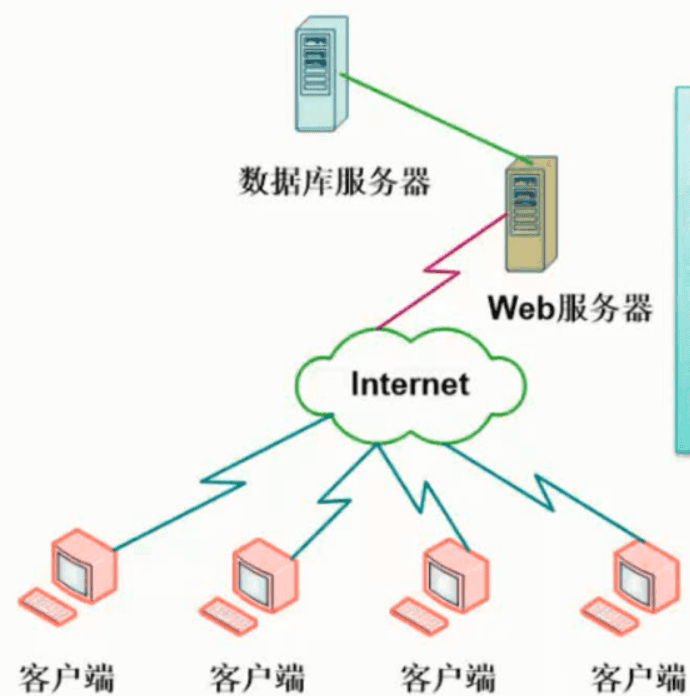
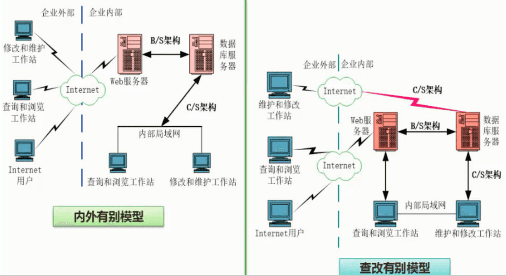
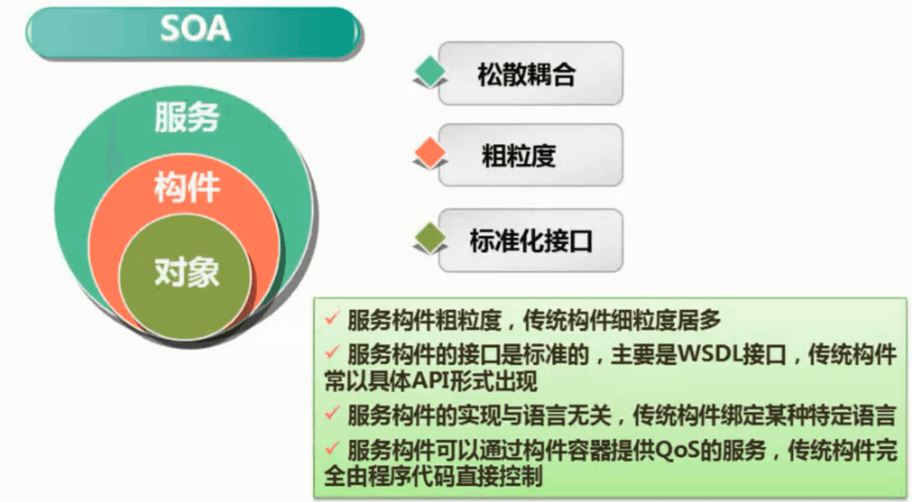
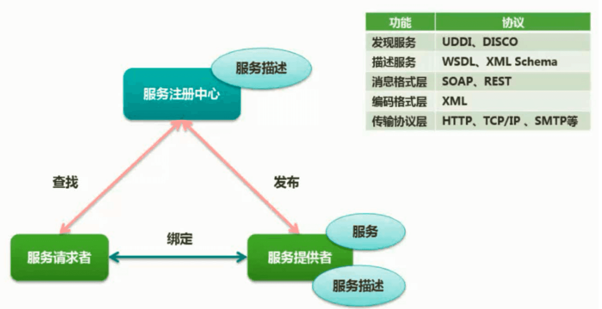

全文链接：https://www.cnblogs.com/nullering/p/9684820.html

## 一：架构模型

　　软件架构可归纳为

（1）结构模型：这是一个最直观、最普遍的建模方法。这种方法以架构的构件、连接件（connector）和其他概念来刻画结构，并力图通过结构来反映系统的重要语义内容，包括系统的配置、约束、隐含的假设条件、风格、性质等。研究结构模型的核心是架构描述语言。

（2）框架模型：框架模型与结构模型类似，但它不太侧重描述结构的细节而更侧重于整体的结构。框架模型主要以一些特殊的问题为目标建立只针对和适应该问题的结构。

（3）动态模型：动态模型是对结构或框架模型的补充，研究系统的“大颗粒”的行为性质。例如，描述系统的重新配置或演化。动态可以指系统总体结构的配置、建立或拆除通信通道或计算的过程。这类系统常是激励型的。

（4）过程模型：过程模型研究构造系统的步骤和过程。因而结构是遵循某些过程脚本的结果。

（5）功能模型：该模型认为架构是由一组功能构件按层次组成，下层向上层提供服务。它可以看作是一种特殊的框架模型。

5种，但各有所长，将它们有机统一起来也许更合适，所以有人提出了“4+1”视图模型： 

**逻辑视图：**逻辑视图关注功能，不仅包括用户可见的功能，还包括为实现用户功能而必须提供的"辅助功能模块"；它们可能是逻辑层、功能模块等。

**开发视图：**开发视图关注程序包，不仅包括要编写的源程序，还包括可以直接使用的第三方SDK和现成框架、类库，以及开发的系统将运行于其上的系统软件或中间件。开发视图和逻辑视图之间可能存在一定的映射关系：比如逻辑层一般会映射到多个程序包等。

**处理视图：**处理视图关注进程、线程、对象等运行时概念，以及相关的并发、同步、通信等问题。处理视图和开发视图的关系：开发视图一般偏重程序包在编译时期的静态依赖关系，而这些程序运行起来之后会表现为对象、线程、进程，处理视图比较关注的正是这些运行时单元的交互问题。
**物理视图：**物理视图关注"目标程序及其依赖的运行库和系统软件"最终如何安装或部署到物理机器，以及如何部署机器和网络来配合软件系统的可靠性、可伸缩性等要求。物理视图和处理视图的关系：处理视图特别关注目标程序的动态执行情况，而物理视图重视目标程序的静态位置问题；物理视图是综合考虑软件系统和整个IT系统相互影响的架构视图。

**场景（scenarios）**：可以看作是那些重要系统活动的抽象，它使四个视图有机联系起来，从某种意义上说场景是最重要的需求抽象。在开发架构时，它可以帮助设计者找到架构的构件和它们之间的作用关系。同时，也可以用场景来分析一个特定的视图，或描述不同视图构件间是如何相互作用的。场景可以用文本表示，也可以用图形表示。

## 二：架构需求与软件质量属性

### 1：软件质量属性

一是可在运行时确定的系统系统质量属性，如性能，安全性，可用性和使用性

二是无法通过观察系统运行确定的：可更改性，可移植性，可重用性，可集成性，可测试性

三是架构直接相关的：概念完整性，正确性，完整性，可构建性。

1、性能

性能( performance ）是指系统的响应能力，即要经过多长时间才能对某个事件做出响应，或者在某段时间内系统所能处理的事件的个数。经常用单位时间内所处理事务的数量或系统完成某个事务处理所需的时间来对性能进行定量的表示。性能测试经常要使用基准测试程序(用以测量性能指标的特定事务集或工作量环境)。

2、可靠性

可靠性( reliability ）是软件系统在应用或系统错误面前，在意外或错误使用的情况下维持软件系统的功能特性的基本能力。可靠性通常用平均失效等待时间（MeanTime ToFailure，简称MTTF）和平均失效间隔时间(Mean Time Between Failure，简称MTBF）来衡量。在失效率为常数和修复时间很短的情况下，MTTF和MTBF几乎相等。

3、可用性

可用性( availability）是系统能够正常运行的时间比例。经常用两次故障之间的时间长度或在出现故障时系统能够恢复正常的速度来表示。

4、安全性

安全性(security ）是指系统在向合法用户提供服务的同时能够阻止非授权用户使用的企图或拒绝服务的能力。安全性是根据系统可能受到的安全威胁的类型来分类的。安全性又可划分为机密性、完整性、不可否认性及可控性等特性。

5、可修改性

可修改性( modifiability）是指能够快速地以较高的性能价格比对系统进行变更的能力。通常以某些具体的变更为基准，通过考察这些变更的代价衡量可修改性。

6、功能性

功能性(functionality)是系统所能完成所期望的工作的能力。一项任务的完成需要系统中许多或大多数构件的相互协作。

7、可变性

可变性( changeability）是指体系结构经扩充或变更而成为新体系结构的能力。这种新体系结构应该符合预先定义的规则，在某些具体方面不同于原有的体系结构。当要将某个体系结构作为一系列相关产品（例如，软件产品线）的基础时，可变性是很重要的。

8、互操作性

作为系统组成部分的软件不是独立存在的，经常与其他系统或自身环境相互作用。为了支持互操作性(interoperation )，软件体系结构必须为外部可视的功能特性和数据结构提供精心设计的软件入口。程序和用其他编程语言编写的软件系统的交互作用就是互操作性的问题，这种互操作性也影响应用的软件体系结构。

**1、可用性及其实现**
故障处置。
1）错误检测
日志 心跳 异常捕捉
2）错误恢复
冗余，备件，回滚，事务，降级
3）错误预防
事务等

**2、可修改性及其实现**
1）将修改限制在局部
高内聚低耦合，降低对其他模块的依赖；提高模块的通用性；限制变更范围等；
2）防止连锁反应
对扩展开放， 对更改关闭。
3）推迟绑定时间
配置文件，多态，注册

**3、性能及其实现**
1）减少及控制资源使用
2）资源管理
引入并发，缓存，增加资源
3）资源仲裁
资源调度

**4、安全性及其实现**
1）防御攻击
2）检测攻击
3）恢复

**5、可测试性及其实现**
1）输入输出
记录，接口与实现分离，用实现替代用于测试
2）内部监控

**6、易用性及其实现**
1）运用时
记录用户习惯，收集用户反馈
2）设计时
用户接口独立
3）支持用户主动操作

### 2：软件架构评估

**名词解释**

敏感点：敏感点是一个或多个构件（和/或构件之间的关系）的特性。研究敏感点可使构设计师或系统分析师明确在搞清楚如何实现质量目标时应注意什么。

权衡点：权衡点是影响多个质量属性的特性，是多个质量属性的敏感点。

风险点

非风险点

质量属性效应树：

**软件评估方式：**

基于调查问卷（检查表）的方式

基于度量的方式

基于场景的方式：

架构权衡分析法（ATAM）

软件架构分析法（SAAM）

成本效益分析法（CBAM）

 

## 三：软件架构风格

架构设计的一个核心问题是能能否达到架构级的软件服用

架构风格反映了领域中众多系统所共有的结构和语义特性，并指导如何将各个构件有效地组织成一个完成的系统

软件架构风格是描述某一特定应用领域中系统组织方式的惯用模式（idiomatic paradigm）。

### 1：数据流风格

　　在管道/过滤器风格中，每个构件都有一组输入和输出，构件读输入的数据流，经过内部处理，
然后产生输出数据流。传统的编译器一直被认为是一种管道系统，在该系统中，一个阶段（包括词法分析、语法分析、语义分析和代码生成）的输出是另一个阶段的输入。

1：批处理序列

构件为一系列固定顺序的计算单元，构件之间只通过数据传递交互。每个处理步骤是一个独立的程序，每一步必须在其前一步结束后才能开始，数据必须是完整的，以整体的方式传递

2：管道-过滤器

每个构件都有一组输入和输出，构件读输入的数据流，经过内部处理,然后产生输出数据流。这个过程通常是通过对输入数据流的变换或计算来完成的，包括通过计算和增加信息以丰富数据、通过浓缩和删除以精简数据、通过改变记录方式以转化数据和递增地转化数据等。这里的构件称为过滤器,连接件就是数据流传输的管道，将一个过滤器的输出传到另一个过滤器的输入

### 2：面向对象风格

面向对象风格建立在数据抽象和面向对象的基础上，数据的表示方法和它们的相应操作封装在一个抽象数据类型或对象中。这种风格的构件是对象，或者说是抽象数据类型的实例。

### 2：调用返回风格

1：主程序/子程序

单线程控制，把问题划分为若干个处理步骤，构件即为主程序和子程序，子程序通常可合成为模块。过程调用作为交互机制，即充当连接件的角色。调用关系具有层次性，其语义逻辑表现为主程序的正确性取决于它调用的子程序的正确性

2：面向对象

显式调用。构件是对象，对象是抽象数据类型的实例。在抽象数据类型中，数据的表示和它们的相应操作被封装起来，对象的行为体现在其接受和请求的动作。连接件即是对象间交互的方式，对象是通过函数和过程的调用来交互的

3：层次结构

构件组织成一个层次结构，连接件通过决定层间如何交互的协议来定义。每层为上一层提供服务，使用下一层的服务，只能见到与自己邻接的层。通过层次结构，可以将大的问题分解为若干个渐进的小问题逐步解决，可以隐藏问题的复杂度。修改某一层，最多影响其相邻的两层（通常只能影响上层)

### 3：独立构件风格

1：进程通信

独立构件。构件是独立的过程，连接件是消息传递。构件通常是命名过程，消息传递的方式可以是点对点、异步或同步方式，以及远程过程（方法）调用等

2：事件驱动系统

隐式调用。构件不直接调用一个过程,而是触发或广播一个或多个事件。构件中的过程在一个或多个事件中注册，当某个事件被触发时，系统自动调用在这个事件中注册的所有过程。一个事件的触发就导致了另一个模块中的过程调用。这种风格中的构件是匿名的过程，它们之间交互的连接件往往是以过程之间的隐式调用来实现的。主要优点是为软件复用提供了强大的支持，为构件的维护和演化带来了方便;其缺点是构件放弃了对系统计算的控制

### 4：虚拟机风格

1：解释器

解释器通常包括一个完成解释工作的解释引擎、一个包含将被解释的代码的存储区、一个记录解释引擎当前工作状态的数据结构，以及一个记录源代码被解释执行的进度的数据结构。具有解释器风格的软件中含有一个虚拟机，可以仿真硬件的执行过程和一些关键应用，其缺点是执行效率比较低

2：基于规则的系统

基于规则的系统包括规则集、规则解释器、规则/数据选择器和工作内存,一般用在人工智能领域和DSS中

### 5：仓库风格

1：数据库系统

数据共享。构件主要有两大类，一类是中央共享数据源，保存当前系统的数据状态;另一类是多个独立处理单元，处理单元对数据元素进行操作

2：黑板系统

包括知识源、黑板和控制三部分。知识源包括若干独立计算的不同单元，提供解决问题的知识。知识源响应黑板的变化，也只修改黑板;黑板是一个全局数据库，包含问题域解空间的全部状态，是知识源相互作用的唯一媒介;知识源响应是通过黑板状态的变化来控制的。黑板系统通常应用在对于解决问题没有确定性算法的软件中(信号处理、问题规划和编译器优化等)

黑板风格：语音识别的应用

3：超文本系统

构件以网状链接方式相互连接，用户可以在构件之间进行按照人类的联想思维方式任意跳转到相关构件。超文本是一种非线性的网状信息组织方法，它以结点为基本单位，链作为结点之间的联想式关联。超文本系统通常应用在互联网领域

### 6：基于事件的隐式调用

基于事件的隐式调用风格的思想是构件不直接调用一个过程，而是触发或广播一个或多个事件。系统中的其它构件中的过程在一个或多个事件中注册，当一个事件被触发，系统自动调用在这个事件中注册的所有过程，这样，一个事件的触发就导致了另一模块中的过程的调用。

### 6．C2风格

C2（Component-Connector）架构风格可以概括为：

通过连接件绑定在一起的按照一组规则运作的并行构件网络。C2风格中的系统组织规则如下：

（1）系统中的构件和连接件都有一个顶部和一个底部。

（2）构件的顶部应连接到某连接件的底部，构件的底部则应连接到某连接件的顶部，而构件与构件之间的直接连接是不允许的。

（3）一个连接件可以和任意数目的其它构件和连接件连接。

（4）当两个连接件进行直接连接时，必须由其中一个的底部到另一个的顶部。从C2风格的组织规则和结构图中，我们可以得出C2风格具有以下特点：

（1）系统中的构件可实现应用需求，并能将任意复杂度的功能封装在一起。

（2）所有构件之间的通讯是通过以连接件为中介的异步消息交换机制来实现的。

（3）构件相对独立，构件之间依赖性较少。系统中不存在某些构件将在同一地址空间内执行，或某些构件共享特定控制线程之类的相关性假设。

 

### 6：两层 C/S 架构

C/S架构的优点主要在于系统的客户应用程序和服务器构件分别运行在不同的计算机上，系统中每台服务器都可以适合各构件的要求，这对于硬件和软件的变化显示出极大的适应性和灵活性，而且易于对系统进行扩充和缩小

### 7：三层C/S架构

### 8：三层 B/S 架构

不足：

B/S 架构缺乏对动态页面的支持能力，没有集成有效地数据库处理功能

B/S架构的安全性难以控制

采用B/S架构的应用系统，在数据查询等响应速度上，要远低于C/S架构

B/S架构的数据提交一般以页面为单位，数据的动态交互性不强，不利于OLTP应用

### 9：混合架构风格

 

### 10：富换联网应用（RIA）

 

RIA结合了CS架构反应速度快，交互性强的有点，以及BS架构传播范围广及容易传播的特性。

RIA简化并改进了BS架构的用户交互；

数据能够被缓存在客户端，从而可以实现一个比基于HTML的响应速度更快且数据往返于服务器的次数更少的用户界面；

**RIA-AJAX**

基于XHTML和CSS标准的表示

使用DOM进行动态显示和交互

使用XML和XSLT进行数据交换及相关操作

使用XMLHttpRequest与服务器进行异步通信

使用JavaScript绑定一切

### 11：基于服务的架构（SOA）

服务是一种为了满足某项业务需求的操作，规则等的逻辑组合，它包含一系列有序活动的交互，为实现用户目标提供支持。

**基于服务的架构（SOA）到实现方式：**

**1：WebService**

**2：ESB**

提供位置透明性的消息路由和寻址服务提供服务注册和命名的管理功能

支持多种消息传递范型

支持多种可以广泛使用的传输协议支持多种数据格式及其相互转换提供日志和监控功能

### 12：特定领域软件架构（Domain Specific Software Architecture，DSSA）

DSSA是在一个特定应用领域中为一组应用提供组织结构参考的标准软件架构，是一个特定的问题领域中支持一组应用的领域模型、参考需求、参考架构等组成的开发基础，其目标是支持在一个特定领域中多个应用的生成。

从功能覆盖的范围角度可以有两种理解方式：

（1）垂直域：定义了一个特定的系统族，包含整个系统族内的多个系统，结果是在该领域中可作为系统的可行解决方案的一个通用软件架构。

（2）水平域：定义了在多个系统和多个系统族中功能区域的共有部分，在子系统级上涵盖多个系统族的特定部分功能，无法为系统提供完整的通用架构。

DSSA的基本活动包括：领域分析，领域设计，和领域实现。

其中：

领域分析的主要目的是获取领域模型，领域模型描述领域中系统之间共同的需求，即领域需求，

领域设计的主要目的是获取DSSA，DSSA描述领域模型中表示需求的解决方案，

领域实现的主要目的是依据领域模型和DSSA开发和组织可重用信息，并对基础软件架构进行实现。

DSSA的参与者：主要包括领域工程人员和应用工程人员

领域工程人员：

领域专家：有经验的用户，提供关于领域中的系统需求规约和实现知识以及复审领域模型

领域分析人员：控制领域分析过程，获取领域知识，并将领域知识组织到领域模型中

领域设计人员：设计DSSA，验证DSSA的准确性与一致性

领域实现人员：根据领域模型和DSSA，开发可服用的软件架构，利用在工程技术从现有系统中提取可复用的软件构件

应用工程人员

系统分析人员：以领域模型为基础2，结合系统的个性差异，获取其应用需求

系统设计人员：以领域设计框架为基础，给出应用系统的整体架构

系统实现人员：按照真题设计框架，将构件连接起来，已创建应用系统

##  四：软件产品线

软件产品线主要由两部分组成，分别是核心资源和产品集合。核心资源是领域工程的所有结果的集合，是产品线中产品构造的基础。

软件产品线开发有4个基本技术特点，即过程驱动、特定领域、技术支持和架构为中心。与其他软件开发方法相比，组织选择软件产品线的宏观上的原因有：对产品线及其实现所需的专家知识领域的清楚界定；对产品线的长期远景进行了战略性规划。