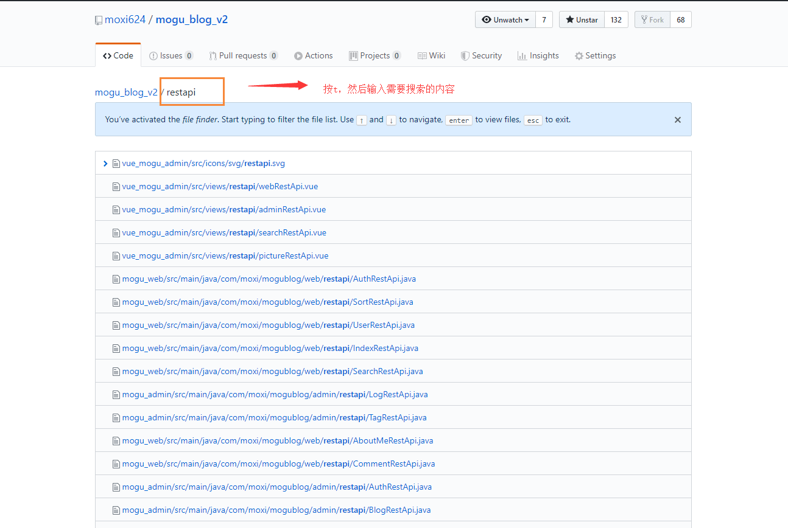
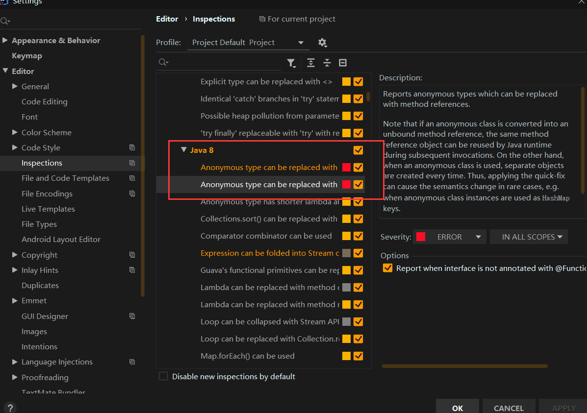

# 使用查看

给README添加小徽章

- https://shields.io/
- https://badgen.net/
- https://forthebadge.com/
- https://badge.fury.io/
- https://github.com/boennemann/badges

## 常用词含义

- watch：会持续收到该项目的动态
- fork：复制某个仓库到自己的Github仓库中
- star：可以理解为点赞
- clone：将项目下载至本地
- follow：关注你感兴趣的作者，会收到他们的动态

 

## in关键字限制搜索范围

- 公式：`XXX关键字 in:name 或 description 或 readme`
- xxx in:name   项目名称含有XXX的
- xxx in:description   项目描述含有XXX的
- xxx in:readme   项目的readme文件中包含XXX的
- 组合使用
  - xxx   in:name,readme    项目的名称和readme中包含xxx的


## stars或fork数量关键字查找

- 公式：
  - `xxx关键字  stars 通配符`  :>  或者 :>=
  - 区间范围数字：  `stars:数字1..数字2`
- 案例
  - 查找stars数大于等于5000的Springboot项目：springboot  stars:>=5000
  - 查找forks数在1000~2000之间的springboot项目：springboot forks:1000..5000
- 组合使用
  - 查找star大于1000，fork数在500到1000：`springboot stars:>1000 forks:500..1000`


## awesome加强搜索

- 公式：`awesome 关键字`：awesome系列，一般用来收集学习、工具、书籍类相关的项目
- 搜索优秀的redis相关的项目，包括框架，教程等  awesome redis


## 高亮显示某行代码

- 一行：地址后面紧跟  #L10
  - `https://github.com/moxi624/mogu_blog_v2/blob/master/mogu_admin/pom.xml#L13`
- 多行：地址后面紧跟 #Lx - #Ln
  - `https://github.com/moxi624/mogu_blog_v2/blob/master/mogu_admin/pom.xml#L13-L30`

## 项目内搜索

- 使用英文字母 `t` ,开启项目内搜索




## 搜索某个地区内的大佬

- location：地区
- language：语言
- 例如：`location:beijing language:java`


# GitHub Pages搭建网站

新建仓库，创建个人站点，仓库名必须是 【用户名.github.io】

在仓库下新建index.html文件即可。只支持静态网页。


# 开源协议

license译为许可证，也可作为开源协议，它可以将自己创作的东西，授权给他人使用，并约定了使用者可以有的权利和必须遵从的义务。现在很多优秀的开源项目都有设置license，不同的license所约束的条件也不同。因此开源不等于免费，开源也不等于没有约束。

对于大型的软件可能都有专门的律师团队去撰写软件协议。可是作为一名开发人员，有时候我们想开源自己的项目，但又不想自己的源代码被随意借鉴或者分享到别处。这个时候我们就可以设置license去约束一些行为。

但是协议往往需要具备专业的知识，它涉及到了法律规则，普通人不可能在短时间内就掌握这些知识。这时候我们可以选择一些流行的开源协议去满足项目的需求。

## 各协议介绍


| 协议                                                         | 简述                                                         |
| ------------------------------------------------------------ | ------------------------------------------------------------ |
| [Apache](https://choosealicense.com/licenses/apache-2.0/)    | 允许他人修改源代码后再闭源，但是必须对每个修改过的文件做版权说明 |
| [GPL3](https://choosealicense.com/licenses/gpl-3.0/)         | 无论以何种方式修改或者使用代码，都需要开源                   |
| [MIT](https://choosealicense.com/licenses/mit/)/[BSD2](https://choosealicense.com/licenses/bsd-2-clause/) | 允许他人修改源代码后再闭源，不用对修改过的文件做说明，且二次开发的软件可以使用原作者的名字做营销 |
| [BSD3](https://choosealicense.com/licenses/bsd-3-clause/)    | 和上面一条类似，但二次开发的软件不能使用原作者的名字做营销   |
| [BSL](https://choosealicense.com/licenses/bsl-1.0/)          | 和GPL类似，但不需要复制版权信息                              |
| [CCZ](https://choosealicense.com/licenses/cc0-1.0/)          | 放弃创作的作品版权权益，并将其奉献给大众，不对代码做任何担保 |
| [EPL](https://opensource.org/licenses/EPL-2.0)               | 与GPL类似，有权使用、修改、复制与发布软件原始版本和修改后版本，但在某些情况下则必须将修改内容一并释出 |
| [AGPL](https://choosealicense.com/licenses/agpl-3.0/)        | GPL拓展，使用在线网络服务的也需要开源                        |
| [GPL2](https://choosealicense.com/licenses/gpl-2.0/)         | 和GPL3相比，如果使用代码作为服务提供，而不分发软件，则不需要开源 |
| [LGPL](https://choosealicense.com/licenses/lgpl-3.0/)        | 和GPL相比，LGPL允许商业软件通过类库引用(link)方式使用LGPL类库而不需要开源商业软件的代码 |
| [Mozilla](https://choosealicense.com/licenses/mpl-2.0/)      | 与LGPL类似，但是需要对修改过的源码内容做说明                 |
| [Unlicense](https://choosealicense.com/licenses/unlicense/)  | 与CCZ相似，且开放商标和所用的专利授权                        |


# 为开源项目贡献

## 原则

一：做有价值的事

二：不要给别人添麻烦，可以让别人直接合并。一个提交只解决一个问题。

三：先搜索，不要走撞车的问题

四：使用工具


## 例子

为Gradle修改Java8语法

将需要更改关心的变成Error



然后在项目上右键——>Analuze——>Inspect Code

点击错误，使用 ` Alt + Enter ` 修改


为SpringBoot贡献代码

先 ` fork ` ,下载到本地


写PR 

```
i found some code to simplify when using IDEA to inspect the Code,so i submit a PR here,Thanks!
```

签署贡献协议，签署个人


为Guava


Java中一切的操作都是一个拼接命令行参数而已。


草案：

Issue讨论


谷歌文档


Effective.java


远程仓库资源

remote-working：中国远程工作资料大全

网站：一早一晚


社区：https://forum.westack.live

一定是自己使用熟悉的项目


