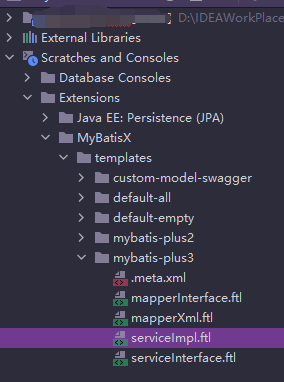

# 插件推荐

## 热部署插件

1：安装并重启

File——Setting——Plugins——MarketPlace搜索 ` JRebel and XRebel ` 

2：提示 Enable jrebel 点击使用，根据设置导航进行设置


3：激活

（1）：点此链接生成 guid： https://www.guidgen.com/ 复制生成的 guid

（2）：选择第一个选项 Team URL

在第一个空白地址中填写：

```txt
https://jrebel.qekang.com/+生成的guid
```

第二个选项则填写你自己的邮箱即可

然后选择同意接受协议等等

4：然后继续点击右侧的  ` JRebel setup guide ` 

5：设置自动编译

File——Setting——Build，Execution，Deployment ——Complier——右侧找到 ` Bulid project Automatically ` ，将前面的√勾选上；

6：设置运行时编译

7：修改后手动更新 ctrl+shift +F9

以后就不要再使用 debug 启动了，使用  ` Jrebel debug  ` 启动即可。


## MybatisCodeHelper

1：下载与安装

蓝奏云("https://borber.lanzous.com/b0cq9t1jc") 密码:6llf

然后直接拖拽进 IDEA，重启 IDEA

按照以下方法激活即可

2：激活

IDEA顶部菜单：Tools——MybatisCodeHelper——Activation——OffineActivation，在offline key框输入任意字符串

3：使用功能

（1）根据实体类生成建表语句

（2）根据表生成 bean，mapper.xml：连接数据库，打开 DataBase 窗口，选择要生成的代码对应的表，右键


（3）点击小鸟可实现 Dao 与 mapper.xml 文件的跳转

## MybatisX

由于mybatisCodeHelper收费新版破解失效，可以采用MybatisX代替；

功能基本都有，对于生成代码的模板，可以到下面的目录下进行设置，然后其他生成代码操作和MybatisCodeHelperPro一样；



个人提供一个模板自己的模板；对于里面的一些参数，官网有文档：https://mp.baomidou.com/guide/mybatisx-idea-plugin.html#%E5%B8%B8%E8%A7%81%E9%97%AE%E7%AD%94

## Grep Console

这是一个可以实现控制台彩色输出的插件，比如可以设置ERROR 和 SQL等以彩色方式输出

1：安装插件

File——Setting——Plugins——MarketPlace搜索 ` Grep Console ` 

2：设置：个人设置如下，可供参考


我是配合打印 SQL 语句，这样直观；如果你还不知道如何打印 SQL 语句，可以参考我的文章使用拦截器，或者使用另一个插件MybatisLog

## Mybatis Log

控制台打印出的一般是没有拼装好的SQL，MybatisLog可以帮你打印出拼装好的SQL语句，帮助你检查问题；

1：下载安装

下载链接：https://www.aliyundrive.com/s/FvUhbXKGLJe

安装：File——Setting——Plugins——找到Install右侧设置按钮——下拉选择：Install Plugin from Disk——然后选择刚刚下载的插件

2：配置打印

在mybatis配置文件中添加如下内容

```xml
  <setting name="logImpl" value="STDOUT_LOGGING" />
```

## SonarLint

这个插件是配合 SonarQube 代码质量管理平台进行使用的，不过如果你的团队没有进行代码质量管理，你也可以安装此插件自己使用，进行代码质量管理的自检。安装上即可使用，如果想在团队进行 SonarQube 质量管理，可以再进行 SonarQube 配置。

同样的还有Alibaba Java Coding Guidelines（阿里巴巴的编码规约检查插件）

检查你的编码习惯，让你更规范

## FindBug 或 spotBugs 

FindBug 新版不能用了，用 spotBugs 代替，它可以帮助寻找潜在的 Bug；安装后只需在文件中右键——Analyze Selected Files即可

## SequenceDiagram

调用链路自动生成时序图

双击顶部的类名可以跳转到对应类的源码中，双击调用的函数名可以直接调入某个函数的源码。

## Statistic

代码统计

## Maven Helper

帮助解决 Maven 冲突;

当安装成功后，打开项目的pom.xml文件，会多出来一个试图 ` Deendency Analyzer ` 

切换到此试图即可进行相应操作：

1. Conflicts（查看冲突）
2. All Dependencies as List（列表形式查看所有依赖）
3. All Dependencies as Tree（树形式查看所有依赖）

选中冲突的包，右键Exclude 冲突包


## CamelCase

驼峰式命名和下划线命名交替变化

## CodeGlance

代码迷你缩放图插件

## Translation

 翻译插件 ：将英文翻译成中文，阅读源码不再费劲；将中文翻译成英文，给接口起名字就不用费劲啦

## IdeaJad

以前查看class文件形式的时候或者jar，都会使用一个外部反编译工具，这样操作明显不方便，使用此插件可以一直在idea中查看文件。

选择class文件，右键 Decompile,完成反编译

## Lombok

这个也能算插件吧，他能以简单的注解形式来简化java代码，提高开发人员的开发效率。比如添加注解自动生成getting/Setter方法等，这要看团队要求，如果大家都装了这个插件还好，使用记得添加依赖

```xml
<groupId>org.projectlombok</groupId>
    <artifactId>lombok</artifactId>
<version>1.18.8</version>
```

## 美化插件

推荐几个，这个根据个人审美自行试验选择；

**Xcode-Dark Theme**：https://plugins.jetbrains.com/plugin/13106-xcode-dark-theme/versions

**Vuesion Theme**：https://plugins.jetbrains.com/plugin/13106-xcode-dark-theme/versions

**One Dark theme**：https://plugins.jetbrains.com/plugin/11938-one-dark-theme

**Dark Purple Theme**：https://plugins.jetbrains.com/plugin/12100-dark-purple-theme

Material Theme UI：

**BackgroundImagePlus**：可以更换IDEA的背景图片，我个人没有用，感觉反倒看不清楚代码了有些图片

# 开发插件

如果还不能满足你的需求，那就自己开发一款插件吧！

新建项目：


推荐使用社区版的 IDEA，这样可以阅读 IDEA 的源码：Gradle不会用的可以先去看我的另一篇笔记；

## 结构和配置

1：gradle 配置：build.gradle

```groovy
//默认会整成最新的JDk，这样导致有的项目不能用
sourceCompatibility = 1.8
//默认会整成最新的IDEA才能用，定义一个老一点的版本
intellij{
	version='2017.3'
	updateSinceUntilBuild=false
}
```

2：插件配置

resource-MATE-INF 目录下的 plugin.xml

具体内容如下

```xml
<idea-plugin url="https://github.com/XXX/myplugins" require-restart="false" allow-bundled-update="true">
    <!--表示当前插件的唯一id号-->
    <id>com.XXX.plugin.idea.myplugins</id>
    <!--插件名-->
    <name>myplugins</name>
    <!--填写开发人的邮箱，公司名称-->
    <vendor email="XXX" url="https://github.com/XXX/myplugins">MybatisX</vendor>
	<!--描述-->
    <description></description>
    <change-notes></change-notes>
	<!--表示当前插件所支持的所有Intellij Idea 的版本-->
    <!--兼容性配置-->
    <idea-version since-build="192.0"/>
    <depends>com.intellij.modules.java</depends>
    <depends optional="true" config-file="database.xml">com.intellij.database</depends>
    <!-- support aliases -->
    <depends optional="true" config-file="spring.xml">com.intellij.spring</depends>
    <!-- support aliases -->
    <depends optional="true" config-file="spring-boot.xml">com.intellij.spring.boot</depends>
	<!--这里一般会放一些我们自己的扩展的东西，比如新增高亮显示，新增语言支持都是需要在这里进行扩展-->
    <extensions defaultExtensionNs="com.intellij">
    </extensions>

</idea-plugin>
```

## 方法说明

### 对话框绘制

dialog文件夹下有个.from文件，点击打开可以在右侧选择相对应的组件，然后绑定组件的事件进行开发；

右键添加：

### Action


### 给插件设置图标

在 MATE-INF 文件夹下新建 pluginicorn.svg ，名称固定，


## 打包安装

打包成一个 zip 压缩包，

自己的话自己从硬盘上安装就可以了

4：发布上传

插件官网：https://plugins.jetbrains.com/

注册账号进行登录

直接点击自己头像下的 upload plugin，然后选择刚打包好的 zip 文件

上传后，人家官方审核，审核通过即可从插件库下载到；
