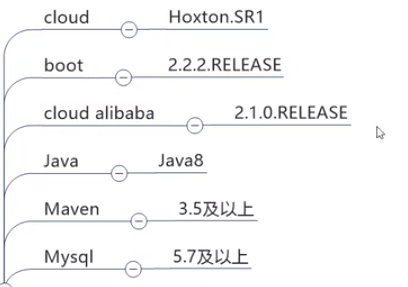
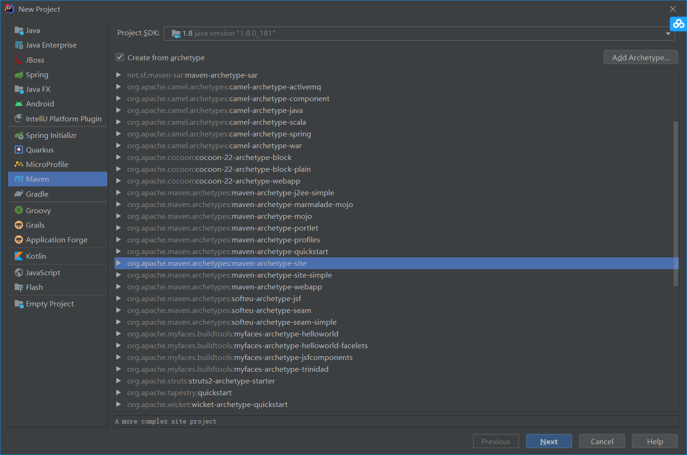
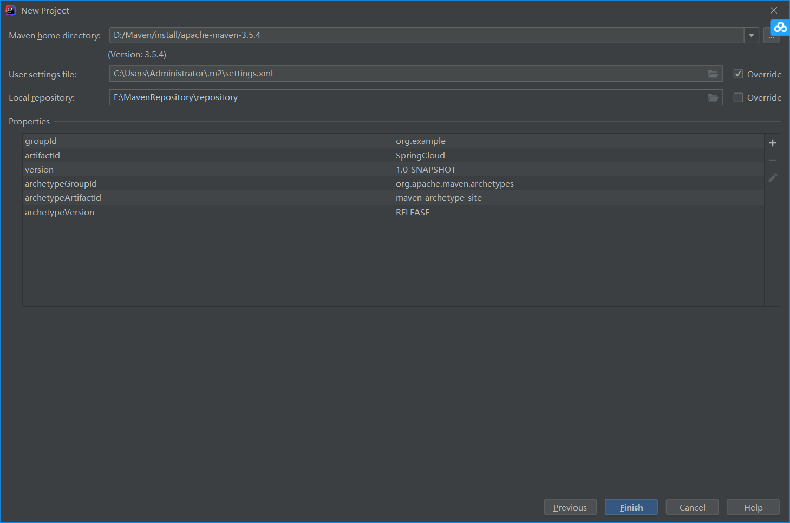
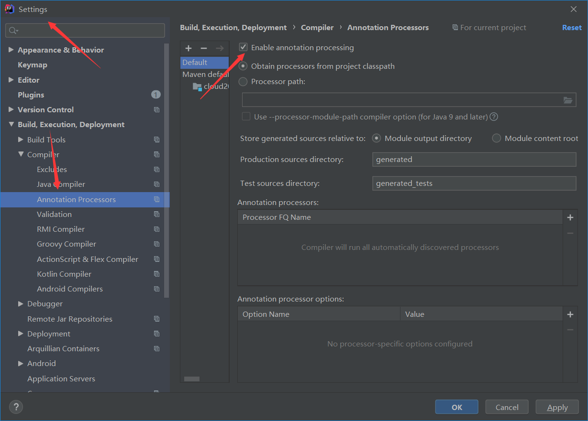
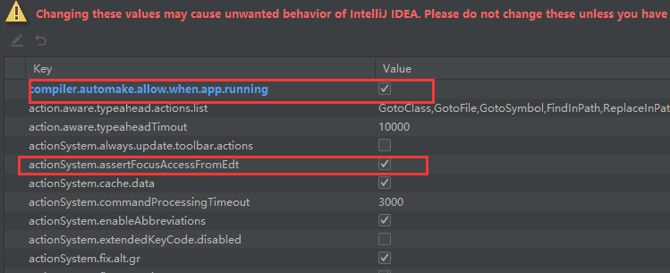

第一章：简介

## 1：版本

SpringCloud最早是从2014年推出的，在推出的前期更新迭代速度非常快，频繁发布新版本，目前更趋于稳定，变化稍慢一些；  

SpringCloud的版本并不是传统的使用数字的方式标识，而是使用诸如：Angel、Brixton、Camden......等伦敦的地名来命名版本，

版本的先后顺序使用字母表A-Z的先后来标识，

| Hoxton    | 2.2.x                                           |
| --------- | ----------------------------------------------- |
| Greenwish | 2.1.x                                           |
| Finchley  | 兼容Spring Boot 2.0.x， 不兼容Spring Boot 1.5.x |
| Edgware   | 兼容Spring Boot 1.5.x， 不兼容Spring Boot 2.0.x |
| Dalston   | 兼容Spring Boot 1.5.x， 不兼容Spring Boot 2.0.x |
| Camden    | 兼容Spring Boot 1.4.x， 也兼容Spring Boot 1.5.x |
| Brixton   | 兼容Spring Boot 1.3.x， 也兼容Spring Boot 1.4.x |
| Angel     | 兼容Spring Boot 1.2.x                           |

SpringCloud并不是从0开始开发一整套微服务解决方案，而是集成各个开源软件，构成一整套的微服务解决方案，这其中有非常著名的Netflix公司的开源产品；

阳哥环境：



## SpringCloud和Dubbo的区别？

dubbo 是二进制传输，占用带宽会少一点。SpringCloud是http 传输，带宽会多一点，同时使用http协议一般会使用JSON报文，消耗会更大。

Spring Cloud抛弃了Dubbo 的RPC通信，采用的是基于HTTP的REST方式。


## 2：SpringCloud升级,部分组件停用:

1,Eureka停用,可以使用zk作为服务注册中心，Consul也可以，阿里的Nacos推荐使用。

2,服务调用,Ribbon准备停更,代替为LoadBalance

3,Feign改为OpenFeign

4,服务降级Hystrix停更,但是也大量使用了。改为resilence4j或者阿里巴巴的sentienl

5.服务网关Zuul改为gateway

6,服务配置Config改为  Nacos

7,服务总线Bus改为Nacos

# 第三章：环境搭建

## 1：创建父工程,pom依赖



选择Maven自己的3.5以上的



约定>配置》编码

字符编码


注解激活生效



java编译版本8


FileType过滤，让一些文件不显示


删掉src文件夹，只保留pom.xml

跳过单元测试


添加总的jar包

```xml
<!-- 统一管理jar包版本 -->
    <properties>
        <project.build.sourceEncoding>UTF-8</project.build.sourceEncoding>
        <maven.compiler.source>1.8</maven.compiler.source>
        <maven.compiler.target>1.8</maven.compiler.target>
        <junit.version>4.12</junit.version>
        <log4j.version>1.2.17</log4j.version>
        <lombok.version>1.16.18</lombok.version>
        <mysql.version>5.1.47</mysql.version>
        <druid.version>1.1.16</druid.version>
        <mybatis.spring.boot.version>1.3.0</mybatis.spring.boot.version>
    </properties>

    <!-- 子模块继承之后，提供作用：锁定版本+子modlue不用写groupId和version 只声明依赖，不不引入jar包 -->
    <dependencyManagement>
        <dependencies>
            <!--spring boot 2.2.2-->
            <dependency>
                <groupId>org.springframework.boot</groupId>
                <artifactId>spring-boot-dependencies</artifactId>
                <version>2.2.2.RELEASE</version>
                <type>pom</type>
                <scope>import</scope>
            </dependency>
            <!--spring cloud Hoxton.SR1-->
            <dependency>
                <groupId>org.springframework.cloud</groupId>
                <artifactId>spring-cloud-dependencies</artifactId>
                <version>Hoxton.SR1</version>
                <type>pom</type>
                <scope>import</scope>
            </dependency>
            <!--spring cloud alibaba 2.1.0.RELEASE-->
            <dependency>
                <groupId>com.alibaba.cloud</groupId>
                <artifactId>spring-cloud-alibaba-dependencies</artifactId>
                <version>2.1.0.RELEASE</version>
                <type>pom</type>
                <scope>import</scope>
            </dependency>
            <dependency>
                <groupId>mysql</groupId>
                <artifactId>mysql-connector-java</artifactId>
                <version>${mysql.version}</version>
            </dependency>
            <dependency>
                <groupId>com.alibaba</groupId>
                <artifactId>druid</artifactId>
                <version>${druid.version}</version>
            </dependency>
            <dependency>
                <groupId>org.mybatis.spring.boot</groupId>
                <artifactId>mybatis-spring-boot-starter</artifactId>
                <version>${mybatis.spring.boot.version}</version>
            </dependency>
            <dependency>
                <groupId>junit</groupId>
                <artifactId>junit</artifactId>
                <version>${junit.version}</version>
            </dependency>
            <dependency>
                <groupId>log4j</groupId>
                <artifactId>log4j</artifactId>
                <version>${log4j.version}</version>
            </dependency>
            <dependency>
                <groupId>org.projectlombok</groupId>
                <artifactId>lombok</artifactId>
                <version>${lombok.version}</version>
                <optional>true</optional>
            </dependency>
        </dependencies>
    </dependencyManagement>

    <build>
        <plugins>
            <plugin>
                <groupId>org.springframework.boot</groupId>
                <artifactId>spring-boot-maven-plugin</artifactId>
                <configuration>
                    <fork>true</fork>
                    <addResources>true</addResources>
                </configuration>
            </plugin>
        </plugins>
    </build>
```
## 2：创建子模块,pay模块

实现


步骤


### 2.1：建module


此时的父pom中已经自动加入了module的配置

```java
  <modules>
    <module>cloud-provider-payment8001</module>
  </modules>
```

### 2.2：pom依赖

```xml
  <dependencies>
        <!--包含了sleuth+zipkin-->
        <dependency>
            <groupId>org.springframework.cloud</groupId>
            <artifactId>spring-cloud-starter-zipkin</artifactId>
        </dependency>
        <!--eureka-client-->
        <dependency>
            <groupId>org.springframework.cloud</groupId>
            <artifactId>spring-cloud-starter-netflix-eureka-client</artifactId>
        </dependency>
        <dependency>
            <groupId>org.springframework.boot</groupId>
            <artifactId>spring-boot-starter-web</artifactId>
        </dependency>
        <dependency>
            <groupId>org.springframework.boot</groupId>
            <artifactId>spring-boot-starter-actuator</artifactId>
        </dependency>
        <dependency>
            <groupId>org.mybatis.spring.boot</groupId>
            <artifactId>mybatis-spring-boot-starter</artifactId>
        </dependency>
        <dependency>
            <groupId>com.alibaba</groupId>
            <artifactId>druid-spring-boot-starter</artifactId>
            <version>1.1.10</version>
        </dependency>
        <!--mysql-connector-java-->
        <dependency>
            <groupId>mysql</groupId>
            <artifactId>mysql-connector-java</artifactId>
        </dependency>
        <!--jdbc-->
        <dependency>
            <groupId>org.springframework.boot</groupId>
            <artifactId>spring-boot-starter-jdbc</artifactId>
        </dependency>
        <dependency>
            <groupId>org.springframework.boot</groupId>
            <artifactId>spring-boot-devtools</artifactId>
            <scope>runtime</scope>
            <optional>true</optional>
        </dependency>
        <dependency>
            <groupId>org.projectlombok</groupId>
            <artifactId>lombok</artifactId>
            <optional>true</optional>
        </dependency>
        <dependency>
            <groupId>org.springframework.boot</groupId>
            <artifactId>spring-boot-starter-test</artifactId>
            <scope>test</scope>
        </dependency>
    </dependencies>

```

### 2.3：创建application.yml


一定要变成树叶的标志，如果没有：

https://blog.csdn.net/qq_42449963/article/details/105518286


如果还不行，就maven clean 一下，应该是spring的jar包没导入

```yml
server:
	port: 8001   
spring:
	application:
		name: cloud-payment-service
	datasource:
    # 当前数据源操作类型
    type: com.alibaba.druid.pool.DruidDataSource
    # mysql驱动类
    driver-class-name: com.mysql.cj.jdbc.Driver
      url: jdbc:mysql://localhost:3306/db2019?useUnicode=true&characterEncoding=
            UTF-8&useSSL=false&serverTimezone=GMT%2B8								
    username: root
    password: root
mybatis:			
    mapper-locations: classpath*:mapper/*.xml
   	type-aliases-package: com.eiletxie.springcloud.entities
   			它一般对应我们的实体类所在的包，这个时候会自动取对应包中不包括包名的简单类名作为包括包名的别名。多个package之间可以用逗号或者分号等来进行分隔（value的值一定要是包的全）
```

### 2.4：主启动类

```java
@SpringBootApplication
public class PaymentMain8001 {

    public static void main(String[] args) {
        SpringApplication.run(PaymentMain8001.class,args);
   }
}
```

### 2.5：业务类

1：sql

```sql
CREATE DATABASE `db2019`;

USE `db2019`;

DROP TABLE IF EXISTS `payment`;

CREATE TABLE `payment` (
  `id` BIGINT(20) NOT NULL AUTO_INCREMENT COMMENT 'ID',
  `serial` VARCHAR(200) DEFAULT '',
  PRIMARY KEY (`id`)
) ENGINE=INNODB DEFAULT CHARSET=utf8;
```

2：实体类

Payment

```java
//引入lombok，不再写get和set方法
@Data
//对全部参数应用get和set
@AllArgsConstructor
//空参数
@NoArgsConstructor
//序列化
public class Payment implements Serializable {
    private Long id;
    private String serial;
}
```

前端返回实体

```java
//引入lombok，不再写get和set方法
@Data
//对全部参数应用get和set
@AllArgsConstructor
//空参数
@NoArgsConstructor
//序列化
/**
 * 返回前端的数据通用类
 */
public class CommonResult<T> {
    private Integer code;
    private String message;
    private T data;

    public CommonResult(Integer code,String message)
    {
        this(code,message,null);
    }

}
```

报错是因为没有安装lombok插件

4,dao层:

```java
@Mapper
public interface PaymentDao {

    public int create(Payment payment);

    public Payment getPaymentById(@Param("id") Long id);
}
```

5,mapper配置文件类

在resource下创建directory目录mapper，创建File为PaymentMapper.xml

```xml
<?xml version="1.0" encoding="UTF-8" ?>
<!DOCTYPE mapper PUBLIC "-//mybatis.org//DTD Mapper 3.0//EN" "http://mybatis.org/dtd/mybatis-3-mapper.dtd" >

<mapper namespace="com.xqc.springcloud.dao.PaymentDao">

    <insert id="create" parameterType="Payment" useGeneratedKeys="true" keyProperty="id">
        insert into payment(serial)  values(#{serial});
    </insert>

    <resultMap id="BaseResultMap" type="com.xqc.springcloud.entities.Payment">
        <id column="id" property="id" jdbcType="BIGINT"/>
        <id column="serial" property="serial" jdbcType="VARCHAR"/>
    </resultMap>
    <select id="getPaymentById" parameterType="Long" resultMap="BaseResultMap">
        select * from payment where id=#{id};
    </select>

</mapper>

```

6,写service和serviceImpl


7,controller


## 3：热部署

module中添加插件：

```xml
        <!--自动热部署开发工具-->
        <dependency>
            <groupId>org.springframework.boot</groupId>
            <artifactId>spring-boot-devtools</artifactId>
            <scope>runtime</scope>
            <optional>true</optional>
        </dependency>
```

父工程中添加

```xml
    <build>
        <plugins>
            <plugin>
                <groupId>org.springframework.boot</groupId>
                <artifactId>spring-boot-maven-plugin</artifactId>
                <configuration>
                    <fork>true</fork>
                    <addResources>true</addResources>
                </configuration>
            </plugin>
        </plugins>
    </build>
```

开启自动编译的选项


在父pom.xml中按Ctrl  +  Shift + Alt +  /点击Registry



如果遇到这个错误不用管，这是阿里犯的错


## 4：order模块

1：建moudle

2：改pom

3：写yml

```xml
server
	port:80
```

4：主启动类

```java
@SpringBootApplication
@EnableDiscoveryClient
public class OrderZKMain80
{
    public static void main(String[] args) {
            SpringApplication.run(OrderZKMain80.class, args);
    }
}
```


5：业务类

controller类

因为这里是消费者类,主要是消费,那么就没有service和dao,需要调用pay模块的方法。并且这里还没有微服务的远程调用,那么如果要调用另外一个模块,则需要使用基本的api调用

使用RestTemplate调用pay模块


使用配置类将restTemplate注入到容器

```java
@Configuration
public class ApplicationContextConfig
{
    //依赖注入
    @Bean
    public RestTemplate getRestTemplate()
    {
        return new RestTemplate();
    }
}
```

编写controller


测试启动两个服务，访问消费者路径

localhost/consumer/payment/get/31

注意：在提供者模块不要忘记@RequestBody对于参数

运行窗口：Run DashBoard

	<option name="configurationTypes">
		<set>
			<option value="SpringBootApplicationConfigurationType/>
		</set>
	</option>
## 5：重构,

新建一个模块,将重复代码抽取到一个公共模块中

### 5.1,创建commons模块

### 5.2 抽取公共pom

```xml
    <dependencies>
        <dependency>
            <groupId>org.springframework.boot</groupId>
            <artifactId>spring-boot-devtools</artifactId>
            <scope>runtime</scope>
            <optional>true</optional>
        </dependency>
        <dependency>
            <groupId>org.projectlombok</groupId>
            <artifactId>lombok</artifactId>
            <optional>true</optional>
        </dependency>
        <!--hut工具包，对时间格式有很好的支持-->
        <dependency>
            <groupId>cn.hutool</groupId>
            <artifactId>hutool-all</artifactId>
            <version>5.1.0</version>
        </dependency>
    </dependencies>
```

### 5.3：entity和实体类放入commons中

### 5.4：使用mavne,将commone模块打包(install),

删除原有模块的实体类

其他模块引入commons

# 第四章：服务注册与发现

## 1：Eureka:

当服务很多时,单靠代码手动管理是很麻烦的,需要一个公共组件,统一管理多服务,包括服务是否正常运行,等

Eureka用于**==服务注册==**,目前官网**已经停止更新**

**服务治理**

管理服务与服务之间的依赖关系，可以实现服务调用，负载均衡，容错等，实现服务发现与注册

**服务注册与发现**

Eureka采用CS的设计架构，EurekaServer作为服务注册功能的服务器，它是服务注册中心，而系统中的其他微服务，使用Eureka的客户端连接到Eureka Server并维持心跳连接。


 Eureka包含两个组件：EurekaServer和EurekaClient

EurekaServer提供服务注册服务：EurekaServer中服务注册表中将会存储所有可用服务节点的信息，服务节点的信息可以在界面中直观看到。

EurekaClient通过注册中心进行访问：Java客户端，具备一个内置的，使用轮询负载算法的负载均衡器。在启动后，将会向EurekaServer发送心跳（默认周期为30秒）。如果EurekaServer在多个心跳周期内没有接收到某个节点的心跳。将会从服务注册表中把这个服务节点移除（默认90秒）

### 1.1：**单机版eureka:**

**1,1.1：创建项目cloud_eureka_server_7001**

**1.1.2,引入pom依赖**

​		eurka最新的依赖变了，服务端引用下边的


1.1.3,配置文件

```yml
server:
  port: 7001

eureka:
  instance:
    hostname: eureka7001.com #eureka服务端的实例名称
  client:
    register-with-eureka: false     #false表示不向注册中心注册自己。
    fetch-registry: false     #false表示自己端就是注册中心，我的职责就是维护服务实例，并不需要去检索服务
    service-url:
    #集群指向其它eureka
      #defaultZone: http://eureka7002.com:7002/eureka/
    #单机就是7001自己
      defaultZone: http://eureka7001.com:7001/eureka/
  #server:
    #关闭自我保护机制，保证不可用服务被及时踢除
    #enable-self-preservation: false
    #eviction-interval-timer-in-ms: 2000
```

1.1.4,主启动类

```java
@SpringBootApplication
@EnableEurekaServer
public class EurekaMain7001
{
    public static void main(String[] args) {
            SpringApplication.run(EurekaMain7001.class, args);
    }
}
```

**1.1.5,此时就可以启动当前项目了**

1.1.6：测试

打开：localhost:7001


### **1.2：其他服务注册到eureka**

比如此时pay模块加入eureka

1.主启动类上,加注解,表示当前是eureka客户端

```java
@EnableDiscoveryClient
```

2,修改pom,引入


3,修改配置文件

```yml
eureka:
  client:
    #表示是否将自己注册进EurekaServer默认为true。
    register-with-eureka: true
    #是否从EurekaServer抓取已有的注册信息，默认为true。单节点无所谓，集群必须设置为true才能配合ribbon使用负载均衡
    fetchRegistry: true
    service-url:
      #单机版
      defaultZone: http://localhost:7001/eureka
      # 集群版
      #defaultZone: http://eureka7001.com:7001/eureka,http://eureka7002.com:7002/eureka
  instance:
      instance-id: payment8001
      #访问路径可以显示IP地址
      prefer-ip-address: true
      #Eureka客户端向服务端发送心跳的时间间隔，单位为秒(默认是30秒)
      #lease-renewal-interval-in-seconds: 1
      #Eureka服务端在收到最后一次心跳后等待时间上限，单位为秒(默认是90秒)，超时将剔除服务
      #lease-expiration-duration-in-seconds: 2

```

4,pay模块重启,就可以注册到eureka中了

### 1.3：集群版eureka

#### 集群原理:


 ```java
1,就是pay模块启动时,注册自己,并且自身信息也放入eureka
2.order模块,首先也注册自己,放入信息,当要调用pay时,先从eureka拿到pay的调用地址
3.通过HttpClient调用
 	并且还会缓存一份到本地,每30秒更新一次
 ```

问：微服务RPC远程调用最核心的是什么？

高可用：要是注册中心坏了，就直接崩溃，可以搭建Eureka注册中心集群。

**集群构建原理:**

​		互相注册


#### **构建新erueka项目**

名字:cloud_eureka_server_7002

1,pom文件:

​		粘贴7001的即可

2,配置文件:

在写配置文件前,修改一下主机的C:\Windows\System32\drivers\etchosts文件


首先修改之前的7001的eureka项目,因为多个eureka需要互相注册


然后修改7002

7002也是一样的,只不过端口和地址改一下

3,主启动类:

​		复制7001的即可

4,然后启动7001,7002即可

**


### 1.4：将pay,order模块注册到eureka集群中:

1,只需要修改配置文件即可:


2,两个模块都修改上面的都一样即可

​			然后启动两个模块

​			要先启动7001,7002,然后是pay模块8001,然后是order(80)


### 1.5：将pay模块也配置为集群模式:

0,创建新模块,8002

​	名称: cloud_pay_8002

1,pom文件,复制8001的

2,pom文件复制8001的

3,配置文件复制8001的

​		端口修改一下,改为8002

​		服务名称不用改,用一样的

4.主启动类,复制8001的

5,mapper,service,controller都复制一份

​		然后就启动服务即可

​		此时访问order模块,发现并没有负载均衡到两个pay,模块中,而是只访问8001

​		虽然我们是使用RestTemplate访问的微服务,但是也可以负载均衡的

​		

**注意这样还不可以,需要让RestTemplate开启负载均衡注解,还可以指定负载均衡算法,默认轮询**


### 1.6：修改服务主机名和ip在eureka的web上显示

比如修改pay模块

1,修改配置文件:

添加实例


### 1.7：服务发现Discovery

对于注册进Eureka里面的微服务，可以铜鼓服务发现来了获得该服务的信息。

以pay模块为例

**1,首先添加一个注解,在controller中**


**2,在主启动类上添加一个注解**


**然后重启8001.访问/payment/discover**y


### 1.8：Eureka自我保护:


概述
保护模式主要用于一组客户端与Euraka Server之间存在网络分区场景下的保护，一旦进入保护模式：**Eureka Server 将会尝试保护其服务注册表中的信息，不再删除服务注册表中的数据，也就是不会注销任何微服务**

一句话：某时刻某一个微服务不可用了，Eureka不会立即清理。依旧会对该微服务新的进行保存，属于CAP里面的AP分支。

为什么会产生Eureka的自我保护机制？

为了防止EurekaClient可以正常运行，但是与EurekaServer网络不通情况下，EurekaServer不会立即将EurekaClient服务剔除

什么是自我保护模式？

默认情况下，如果EurekaServer在一定时间内没有收到某个微服务实例的心跳，EurekaServer将会注销该实例（默认90秒）。但是当网络分区故障发生（延时，卡顿，拥挤）时，微服务与EurekaServer之间无法正常通信，以上行为可能变得危险了——因为微服务本身其实是健康的，此时不应该注销这个微服务，EUreka通过自我保护来解决这个问题——当EurekaServer节点在短时间内丢失过多客户端时（可能发生了网络分区故障）那么这个节点就会进入自我保护模式。

**eureka服务端配置:**

出厂默认。自我保护机制开启：

eureka.server.enable-self-proservation = false可以禁用自我保护机制

evicition-interval-timer-in-ms2000

**设置接受心跳时间间隔**

客户端(比如pay模块):


此时启动erueka和pay.此时如果直接关闭了pay,那么erueka会直接删除其注册信息


## 2：Zookeeper

### 2.1：启动zk,到linux上


### 2.2：创建新的pay模块,

单独用于注册到zk中  

名字 : cloud-provider1_pay_8004

1,pom依赖

2,配置文件


3,主启动类


4,controller


5,然后就可以启动

**此时启动,会报错,因为jar包与我们的zk版本不匹配**

解决:
		修改pom文件,改为与我们zk版本匹配的jar包


**此时8003就注册到zk中了**

```java
我们在zk上注册的node是临时节点,当我们的服务一定时间内没有发送心跳
  	那么zk就会`将这个服务的node删除了
```


**这里测试,就不写service与dao什么的了**


### 2.3：创建order消费模块注册到zk

创建项目

名字: cloud_order_zk_80

2,pom

3,配置文件


4主启动类:


5,RestTemolate


6,controller


**然后启动即可注册到zk**

8,集群版zk注册:

只需要修改配置文件:


这个connect-string指定多个zk地址即可

connect-string: 1.2.3.4,2.3.4.5

## 3：Consul

Consul是一套开源的分布式服务发现和配置管理系统，由HashiCorp公司用 `Go` 语言开发

提供了微服务中的服务治理。配置中心，控制总线等功能，这些功能中的每一个都可以根据需要单独使用，也可以在一起使用。

优点：

- 基于raft协议，比较简洁

- 支持健康检查，服务发现同时支持Http和DNS协议支持跨越数据中心的WAN集群，提供图形界面跨平台，支持Linux，Mac，Windows

- KV存储

- 多数据中心

- 可视化WEB界面

  

  


### 1,安装consul

需要下载一个安装包

双击运行

```cmd
# 使用开发模式启动
consul agent -dev
```

访问主页

http://localhost:8500

### 2,创建新的pay模块,8006

1,项目名字

cloud_consule_pay_8006

2,pom依赖

3,配置文件


4,主启动类


5,controller


6,启动服务


#### 


### 3,创建新order模块

cloud-consul-order-80


1,pom文件

2,配置文件


3,主启动类


4,RestTemplate注册

配置类注册

5,controller


6,启动服务,测试


## 4：三个注册中心的异同

CAP：[一致性](https://baike.baidu.com/item/一致性/9840083)（Consistency）、[可用性](https://baike.baidu.com/item/可用性/109628)（Availability）、[分区容错性](https://baike.baidu.com/item/分区容错性/23734073)（Partition tolerance）。

- zookeeper当主节点故障时，zk会在剩余节点重新选择主节点，耗时过长，虽然最终能够恢复，但是选取主节点期间会导致服务不可用，这是不能容忍的。
- eureka各个节点是平等的，一个节点挂掉，其他节点仍会正常保证服务。


# 第五章：服务调用

## 10,Ribbon负载均衡

主要提供客户端的软件负载均衡和服务调用。Ribbon客户端组件提供一系列完善的配置项如连接超时，重试等。简单的说，就是在配置文件中列出Load Balencer后面所有的机器，Ribbon会自动的帮助你基于某种规则（如简单轮询，随机连接等）去连接这些机器。我们很容易使用Ribbon实现自定义的负载均衡算法。


**Ribbon目前也进入维护,基本上不准备更新了**

**进程内LB(本地负载均衡)**

将LB逻辑集成到消费方，消费方从服务注册中心获知有哪些地址可用，然后自己再从这些地址中选择一个合适的服务器。


集中式（LB）（服务器负载均衡）

集中式LB，即再服务的消费方和提供方之间使用独立的LB设施（可以是硬件F5软件Negix等措施                                                                                                                                                                                                                                                                                                                                                                                                                                                                                                             


**区别**

Ribbon本地负载均衡客户端VS Nginx服务端负载均衡：

Nginx是服务器负载均衡，客户端所有请求都会交给Nginx，然后由Ngixn实现转发。

Ribbon本地父子啊均衡，在调用微服务接口时候，会在服务注册中心上获取信息表之后缓存到JV


**Ribbon就是负载均衡+RestTemplate**


Ribbon在工作时分成两步：

第一步选择EurekaServer，它优先选择在同一区域内负载较少的Server

第二步在根据用户指定的策略，在从server取到的服务注册列表中选择一个地址。

其中Ribbon提供了多种策略：轮询，随机，和根绝响应时间加权。

​                                                                                                                                                                                                                                                                                                                                                                                                                                                                                                                              

### 使用Ribbon:

1,默认我们使用eureka的新版本时,它默认集成了ribbon


**==这个starter中集成了reibbon了==**


2,我们也可以手动引入ribbon

**放到order模块中,因为只有order访问pay时需要负载均衡**


3,RestTemplate类:


```java
RestTemplate的:
		xxxForObject()方法,返回的是响应体中的数据
    xxxForEntity()方法.返回的是entity对象,这个对象不仅仅包含响应体数据,还包含响应体信息(状态码等)
```


#### Ribbon常用负载均衡算法:

**IRule接口,Riboon使用该接口,根据特定算法从所有服务中,选择一个服务,**

**Rule接口有7个实现类,每个实现类代表一个负载均衡算法**


**==这里使用eureka的那一套服务==**


**==也就是不能放在主启动类所在的包及子包下==**

1,修改order模块

2,额外创建一个包


3,创建配置类,指定负载均衡算法


4,在主启动类上加一个注解


**表示,访问CLOUD_pAYMENT_SERVICE的服务时,使用我们自定义的负载均衡算法**


#### 自定义负载均衡算法:

1,ribbon的轮询算法原理

rest接口第几次请求数%服务器集群总数量 = 实际调用服务器位置下标，每次服务重启后rest接口计数从1开始


2,自定义负载均衡算法:

- **给**pay模块(8001,8002),的controller方法添加一个方法,返回当前节点端口


- **修改order模块**

去掉@LoadBalanced


3,自定义接口


​					==具体的算法在实现类中实现==

4,接口实现类


5,修改controller:


6,启动服务,测试即可	


## 11,OpenFeign

是一个声明式的web客户端,只需要创建一个接口,添加注解即可完成微服务之间的调用

Feign支持可插拔式的编码器和解码器，SpringCloud对Feign进行封装。使其支持SpringMVC标准注解和HttpMessageConverters。


作用：

远程调用其他服务

实际开发中，由于对服务依赖的调用可能不止一处，往往一个接口会被多处调用，所以通常都会针对每个微服务自行封装一些客户端类来包装这些依赖服务的调用。

在Feign的实现下，我们只需要创建一个接口并使用注解的方式来配置它（以前是DAO接口上面标注Mapper注解，现在是一个微服务接口上面标注一个Feign注解即可）即可完成对服务提供方的接口绑定，简化了使用SrpingCloudRibbon时，自动封装服务调用客户端的开发量。


就是A要调用B,Feign就是在A中创建一个一模一样的B对外提供服务的的接口,我们调用这个接口,就可以服务到B


### **Feign与OpenFeign区别**


### 使用OpenFeign

```java
之前的服务间调用,我们使用的是ribbon+RestTemplate
		现在改为使用Feign
```

1,新建一个order项目,用于feign测试

名字cloud_order_feign-80

2,pom文件

3,配置文件


4,主启动类


5,fegin需要调用的其他的服务的接口


6,controller


7测试:

启动两个erueka(7001,7002)

启动两个pay(8001,8002)

启动当前的order模块


**Feign默认使用ribbon实现负载均衡**


### OpenFeign超时机制

==OpenFeign默认等待时间是1秒,超过1秒,直接报错==

1,设置超时时间,修改配置文件:

**因为OpenFeign的底层是ribbon进行负载均衡,所以它的超时时间是由ribbon控制**


### OpenFeign日志

Feign提供日志打印功能，我们可以通过配置来调整日志级别，从而了解Fegin中Http请求的细节。

对feign接口的调用情况进行监控和输出。

**OpenFeign的日志级别有:**

NONE：默认的，不显示任何日志

BASIC：仅记录请求方法，URL，响应状态码及执行时间。

HEADERS：除了BASIC中定义的信息以外，还有请求和响应的头信息

FULL：除了HEADERS中定义的信息以外，还有请求和响应的正文及元数据


#### 	1,使用OpenFeign的日志:

**实现在配置类中添加OpenFeign的日志类**


#### 2,为指定类设置日志级别:


**配置文件中:**


#### 	3,启动服务即可


# 第六章：服务降级

Hystrix能够保证在一个依赖出问题的情况下，不会导致整体服务失败，避免级联故障，以提高分布式系统的弹性。

断路器本身就是一种开关装置，当某个服务单元故障时，通过断路器的故障监控（类似熔断保险丝），向调用方返回一个符合预期的，可处理的备选响应（FallBack），而不是长时间的等待或者抛出调用方无法处理的异常。


### hystrix中的重要概念:

1,服务降级

服务降级是从整个系统的负荷情况出发和考虑的，对某些负荷会比较高的情况，为了预防某些功能（业务场景）出现负荷过载或者响应慢的情况，在其内部 `暂时舍弃对一些非核心的接口和数据的请求` ，而直接返回一个提前准备好的fallback（退路）错误处理信息。这样，虽然提供的是一个有损的服务，但却保证了整个系统的稳定性和可用性。

2,服务熔断

当某服务出现不可用或响应超时的情况时，为了防止整个系统出现雪崩，暂时停止对该服务的调用。**然后调用服务降级**

3,服务限流

**限流,比如秒杀场景,不能访问用户瞬间都访问服务器,限制一次只可以有多少请求**


4：服务雪崩

多个微服务之间调用的时候，假设微服务A调用微服务B和微服务C，微服务B和C又调用其他的微服务，这就是所谓的“扇出”。

如果扇出的链路上某个微服务的调用响应时间过程或者不可用，对微服务A的调用就会占用越来越多的系统资源，进而引起系统崩溃，所谓的“雪崩效应”


### 使用hystrix,服务降级

1,创建带降级机制的pay模块 

名字: cloud-hystrix-pay-8007

2,pom文件

3,配置文件


4,主启动类


5,service


6controller


7,先测试:

```java
此时使用压测工具,并发20000个请求,请求会延迟的那个方法,
		压测中,发现,另外一个方法并没有被压测,但是我们访问它时,却需要等待
		这就是因为被压测的方法它占用了服务器大部分资源,导致其他请求也变慢了
```


8,先不加入hystrix,


2,创建带降级的order模块:

1,名字:  cloud-hystrix-order-80

2,pom

3,配置文件


4,主启动类


5,远程调用pay模块的接口:


6,controller:


7,测试

​			启动order模块,访问pay

​			再次压测2万并发,发现order访问也变慢了


**解决:**


##### 


3,配置服务降级

1,修改pay模块

1,为service的指定方法(会延迟的方法)添加@HystrixCommand注解


2,主启动类上,添加激活hystrix的注解


3,触发异常


**可以看到,也触发了降级**


2,修改order模块,进行服务降级

一般服务降级,都是放在客户端(order模块),


1,修改配置文件:


**2,主启动类添加直接,启用hystrix:**


​	

3,修改controller,添加降级方法什么的


4,测试

启动pay模块,order模块,

**注意:,这里pay模块和order模块都开启了服务降级**

​			但是order这里,设置了1.5秒就降级,所以访问时,一定会降级

 

##### 4,重构:

**上面出现的问题:**
		1,降级方法与业务方法写在了一块,耦合度高

​		2.每个业务方法都写了一个降级方法,重复代码多

##### **解决重复代码的问题**:

**配置一个全局的降级方法,所有方法都可以走这个降级方法,至于某些特殊创建,再单独创建方法**

1,创建一个全局方法


2,使用注解指定其为全局降级方法(默认降级方法)


3,业务方法使用默认降级方法:


4,测试:


##### 解决代码耦合度的问题:

修改order模块,这里开始,pay模块就不服务降级了,服务降级写在order模块即可

1,Payservice接口是远程调用pay模块的,我们这里创建一个类实现service接口,在实现类中统一处理异常


2,修改配置文件:添加:


3,让PayService的实现类生效:


```java
它的运行逻辑是:
		当请求过来,首先还是通过Feign远程调用pay模块对应的方法
    但是如果pay模块报错,调用失败,那么就会调用PayMentFalbackService类的
    当前同名的方法,作为降级方法
```

4,启动测试

启动order和pay正常访问--ok

==此时将pay服务关闭,order再次访问==


可以看到,并没有报500错误,而是降级访问==实现类==的同名方法

这样,即使服务器挂了,用户要不要一直等待,或者报错

问题:

​		**这样虽然解决了代码耦合度问题,但是又出现了过多重复代码的问题,每个方法都有一个降级方法**


### 使用服务熔断

类似保险丝达到最大访问服务后，直接拒绝访问，然后调用服务降级的方法并返回友好提示。


**比如并发达到1000,我们就拒绝其他用户访问,在有用户访问,就访问降级方法**

1,修改前面的pay模块

**1,修改Payservice接口,添加服务熔断相关的方法:**


这里属性整体意思是:
			10秒之内(窗口,会移动),如果并发==超过==10个,或者10个并发中,失败了6个,就开启熔断器


IdUtil是Hutool包下的类,这个Hutool就是整合了所有的常用方法,比如UUID,反射,IO流等工具方法什么的都整合了


```java
断路器的打开和关闭,是按照一下5步决定的
  	1,并发此时是否达到我们指定的阈值
  	2,错误百分比,比如我们配置了60%,那么如果并发请求中,10次有6次是失败的,就开启断路器
  	3,上面的条件符合,断路器改变状态为open(开启)
  	4,这个服务的断路器开启,所有请求无法访问
  	5,在我们的时间窗口期,期间,尝试让一些请求通过(半开状态),如果请求还是失败,证明断路器还是开启状态,服务没有恢复
  		如果请求成功了,证明服务已经恢复,断路器状态变为close关闭状态
```


2,修改controller

添加一个测试方法;


3,测试:

启动pay,order模块

==多次访问,并且错误率超过60%:==


此时服务熔断,此时即使访问正确的也会报错:


**但是,当过了几秒后,又恢复了**

​				因为在10秒窗口期内,它自己会尝试接收部分请求,发现服务可以正常调用,慢慢的当错误率低于60%,取消熔断


### Hystrix所有可配置的属性:

**全部在这个方法中记录,以成员变量的形式记录,**

​		以后需要什么属性,查看这个类即可


### 总结

熔断类型

- 熔断打开：请求不再调用当前服务，内部设置时钟一般为MTTR（平均故障处理时间）当打开时长达到所设置的时钟则进入半熔断状态。
- 熔断半开：部分请求根据规则调用当前服务，如果请求成功且符合规则则认为当前服务恢复正常，关闭熔断。
- 熔断关闭：熔断关闭不会对服务进行熔断

**==当断路器开启后:==**

​	1：再有请求调用的时候，将不会调用主逻辑，而是直接调用降级fallback，通过断路器，实现了自动地发现错误并将降级逻辑切换为主逻辑，减少响应延迟的效果。

​	2：原来的主逻辑要如何恢复呢？

当断路器打开时，对主逻辑进行熔断之后。Hystrix会启动一个休眠时间窗，在这个时间窗内，降级逻辑是临时的主逻辑

当休眠时间窗到期，断路器将进入搬开状态，释放一次请求到原来的主逻辑上，如果此次请求正常返回，那么断路器将继续闭合。

如果请求仍然有问题，断路器就继续打开，重新计算休眠空窗期

**==其他参数:==**


**熔断整体流程:**

```java
1请求进来,首先查询缓存,如果缓存有,直接返回
  	如果缓存没有,--->2
2,查看断路器是否开启,如果开启的,Hystrix直接将请求转发到降级返回,然后返回
  	如果断路器是关闭的,
				判断线程池等资源是否已经满了,如果已经满了
  					也会走降级方法
  			如果资源没有满,判断我们使用的什么类型的Hystrix,决定调用构造方法还是run方法
        然后处理请求
        然后Hystrix将本次请求的结果信息汇报给断路器,因为断路器此时可能是开启的
          			(因为断路器开启也是可以接收请求的)
        		断路器收到信息,判断是否符合开启或关闭断路器的条件,
				如果本次请求处理失败,又会进入降级方法
        如果处理成功,判断处理是否超时,如果超时了,也进入降级方法
        最后,没有超时,则本次请求处理成功,将结果返回给controller
         
 
```


### Hystrix服务监控:

#### HystrixDashboard

除了隔离依赖服务调用以外，Hystrix还提供了准实时的调用监控，Hystrix会持续地记录所有通过Hystrix发起的请求和执行信息，并以统计报表和图形的形式展示给用户，包括每秒执行多少成功，多少失败等。

#### 使用HystrixDashboard:

1,创建项目:

名字: cloud_hystrixdashboard_9001

2,pom文件

3,配置文件


4,主启动类


5,修改所有pay模块(8001,8002,8003...)

**他们都添加一个pom依赖:**


之前的pom文件中都添加过了,==这个是springboot的监控组件==

6,启动9001即可

​			访问: **localhost:9001/hystrix**

7,注意,此时仅仅是可以访问HystrixDashboard,并不代表已经监控了8001,8002

​							如果要监控,还需要配置:(8001为例)

==8001的主启动类添加:==


**其他8002,8003都是一样的**

8,到此,可以启动服务

启动7001,8001,9001

**然后在web界面,指定9001要监控8001:**

##### 


# 第七章：服务网关:

zuul停更了,

## GateWay

GateWay旨在提供一种简单而有效的方法来对API进行路由，以及提供强大的过滤器功能，例如：熔断，限流，重试等。

**gateway之所以性能号,因为底层使用WebFlux,而webFlux底层使用netty通信(NIO)**

提供了统一的路由方式且基于Filter链的方式提供了网关基本的功能。


### GateWay的特性

动态路由：能够匹配任何请求属性。

可以对路由指定Predicate（断言）和Filter（过滤器）

集成Hystrix的断路器功能

集成SpringCloud服务发现功能

易于编写的Predicate（断言）和Filter（过滤器）

请求限流功能

支持路径重写

### GateWay与zuul的区别:

1：Zuul 1.x 是一个基于阻塞I/O的API Gateway

2：Zuul 1.x 基于Servlet2.5使用阻塞架构它不支持任何长连接（如，WebSocket）Zuul的设计模式和Nginx比较像，每次I/O操作都是从工作线程中选择一个执行，请求线程被阻塞到工作线程完成，但是差别是Nginx用C++实现，Zuul用Java实现，而JVM本身会有第一次加载较慢的情况，使得Zuul的性能相对较差

3：Zuul 2.x想基于Netty非阻塞和长连接，但SpringCloud目前没有整合

4：Gateway 使用非阻塞的API，还支持WebSocket，并且与Spring紧密集

### zuul1.x的模型:

基于Servlet的阻塞式处理模型

### webflux:

**是一个非阻塞的web框架,类似springmvc这样的**

Servlet3之后有了异步非阻塞的支持。而WebFlux是一个典型非阻塞异步的框架，它的核心是基于Reactor的相关API实现的。

### GateWay的一些概念:

#### 1,路由

路由是构建网关的基本模块，它由ID，目标URL，一系列的断言和过滤器组成，如果断言为true则匹配该路由。

就是根据某些规则,将请求发送到指定服务上

#### 2,断言

参考Java8的Predicate，开发人员可以匹配HTTP请求中所有内容（比如请求头或请求参数）如果请求与断言相匹配，则进行路

就是判断,如果符合条件就是xxxx,反之yyyy


#### 3,过滤

指的是Spring框架中GateWayFilter的实例，使用过滤器，可以请求被路由前或后对请求进行修改

​	**路由前后,过滤请求**

### 工作原理:


客户端向Gateway发出请求，然后在Gateway Handler Mapping中找到与请求相匹配的路由，将其发送到Gateway Web Handler

Handler再通过制定的过滤器链来将请求发送到实际的服务之星业务逻辑，然后返回

过滤器之间用虚线分开是因为过滤器可能会在发送代理请求之前（pre）或之后（post）执行业务逻辑

Filter在“pre”类型的过滤器可以做参数校检，权限校检，零流量监控，日志输出，协议转换

在post类型的过滤器中可以做响应内容，响应头的修改，日志的输出，流量监控等作用

### 使用GateWay:

想要新建一个GateWay的项目

名字: 	cloud_gateway_9527

1,pom

2,配置文件


3,主启动类


4,针对pay模块,设置路由:


**==修改GateWay模块(9527)的配置文件==:**


这里表示,

​			当访问localhost:9527/payment/get/1时,     

​			路由到localhost:8001/payment/get/1


5,开始测试

**启动7001,8001,9527**

```java
如果启动GateWay报错
  	可能是GateWay模块引入了web和监控的starter依赖,需要移除
```

访问:

​		localhost:9527/payment/get/1


6,GateWay的网关配置,

​		**GateWay的网关配置,除了支持配置文件,还支持硬编码方式**

7使用硬编码配置GateWay:

创建配置类:


8,然后重启服务即可

 


### 重构:

上面的配置虽然首先了网关,但是是在配置文件中写死了要路由的地址

现在需要修改,不指定地址,而是根据微服务名字进行路由,我们可以在注册中心获取某组微服务的地址

需要:

​		1个eureka,2个pay模块

#### 修改GateWay模块的配置文件:


然后就可以启动微服务.测试


### Pridicate断言

参考Java8的Predicate，开发人员可以匹配HTTP请求中所有内容（比如请求头或请求参数）如果请求与断言相匹配，则进行路

就是判断,如果符合条件就是xxxx,反之yyyy


**我们之前在配置文件中配置了断言:**


**这个断言表示,如果外部访问路径是指定路径,就路由到指定微服务上**

可以看到,这里有一个Path,这个是断言的一种,==断言的类型==:


```java
After:
		可以指定,只有在指定时间后,才可以路由到指定微服务
```


​				这里表示,只有在==2020年的2月21的15点51分37秒==之后,访问==才可以路由==

​				在此之前的访问,都会报404

如何获取当前时区?**


```java
before:
		与after类似,他说在指定时间之前的才可以访问
between:
		需要指定两个时间,在他们之间的时间才可以访问
```


```java
cookie:
		只有包含某些指定cookie(key,value),的请求才可以路由
```


```java
Header:
		只有包含指定请求头的请求,才可以路由
```


测试:


```java
host:
		只有指定主机的才可以访问,
		比如我们当前的网站的域名是www.aa.com
    那么这里就可以设置,只有用户是www.aa.com的请求,才进行路由
```


可以看到,如果带了域名访问,就可以,但是直接访问ip地址.就报错了


```java
method:
		只有指定请求才可以路由,比如get请求...
```


```java
path:
		只有访问指定路径,才进行路由
     比如访问,/abc才路由
```


```java
Query:
		必须带有请求参数才可以访问
```


### Filter过滤器

指的是Spring框架中GateWayFilter的实例，使用过滤器，可以请求被路由前或后对请求进行修改

​	**路由前后,过滤请求**

可用于修改进入的Http请求和返回的HTTP响应，路由过滤器只能指定路由进行使用，Gateway内置了多种路由过滤器，他们都有GatewayFilter的工厂类来产生。

#### 生命周期:

**在请求进入路由之前,和处理请求完成,再次到达路由之前**

#### 种类

- GatewayFilter
- GlobalFilter

GateWayFilter,单一的过滤器

**与断言类似,比如闲置,请求头,只有特定的请求头才放行,反之就过滤**

```yml
routes:
	-id:paymet_routh # payment_route # 路由的ID，没有固定规则但要求唯一，建议配合服务名
	uri:lb://cloud-provider-payment # 匹配后的目标服务地址，供服务的路由地址
	#uri：http://localhost:8001 #匹配后提供服务的路由地址
	filters:
		-AddRequestParameter=X-Request-Id,1024 # 过滤器工厂会在匹配的请求头加上一堆请求头，名称为X-Request—Id值为1024
```

GlobalFilter,全局过滤器:


#### **自定义过滤器:**

实现两个接口


​	**然后启动服务,即可,因为过滤器通过@COmponet已经加入到容器了**


# 第八章：服务配置Config

==微服务面临的问题==

```java
可以看到,每个微服务都需要一个配置文件,并且,如果有几个微服务都需要连接数据库
		那么就需要配4次数据库相关配置,并且当数据库发生改动,那么需要同时修改4个微服务的配置文件才可以
```

所以有了springconfig配置中心

SpringCloud Config为微服务架构中的微服务提供集中化的外部配置支持，配置服务器为各个不同微服务应用的所有环境提供一个中心化的外部配置。


SpringCloud Config分为服务端和客户端两部分。

服务端也称为分布式配置中心，他是一个独立的微服务应用，用来连接配置服务器并未客户端提供获取配置信息，加密解密信息等访问接口。

客户端则是通过制定的配置中心来管理应用资源，以及与业务相关的配置内容，并在启动的时候从配置中心获取和加载配置信息配置信息。配置服务器默认采用Git来存储配置信息，这样就有助于对环境配置进行吧版本管理，并且可以通过git客户端工具来方便的管理和访问配置内容。


## 使用配置中心:

0,使用github作为配置中心的仓库:

**初始化git环境:**


1,新建config模块:

名字:   cloud-config-3344

2,pom

3,配置文件


4,主启动类


5,修改hosts:


6,配置完成

测试,3344是否可以从github上获取配置

启动3344	(要先启动eureka)


它实际上就是,读取到配置文件中的GitHub的地址,然后拼接上/master/config-dev.yml

7,读取配置文件的规则:


==2,==


**这里默认会读取master分支,因为我们配置文件中配置了**


==3==


注意,这个方式读取到的配置是==json格式==的

**所有规则:**


## 创建配置中心客户端:

1,创建config客户端项目

名字: 	cloud-config-client-3355

2,pom

3,配置文件

注意这个配置文件就不是application.yml

​			而是bootstrap.yml

这个配置文件的作用是,先到配置中心加载配置,然后加载到application.yml中


4,主启动类:


5,controller类

就是上面提到的,以rest风格将配置对外暴露


**如果客户端运行正常,就会读取到github上配置文件的,config.info下的配置**

6,测试:

启动3344,3355

​	访问3355的  /configInfo


7,问题::

```java
上面3355确实获取到了配置文件,但是如果此时配置文件修改了,3355是获取不到的
		3344可以实时获取到最新配置文件,但是3355却获取不到
  	除非重启服务
```

**8,实现动态刷新:**

1,修改3355,添加一个pom依赖:


2,修改配置文件,添加一个配置:


3,修改controller:


4,此时重启服务

**此时3355还不可以动态获取**

因为此时,还需要==外部==发送post请求通知3355


**此时在刷新3355,发现可以获取到最新的配置文件了,这就实现了动态获取配置文件,因为3355并没有重启**


具体流程就是:

​			我们启动好服务后

​			运维人员,修改了配置文件,然后发送一个post请求通知3355

​			3355就可以获取最新配置文件


**问题:**

​		如果有多个客户端怎么办(3355,3356,3357.....)

​						虽然可以使用shell脚本,循环刷新

​		但是,可不可以使用广播,一次通知??

​					这些springconfig做不到,需要使用springcloud Bus消息总线

## 3：配置中心内容加密

从配置获取的配置默认是明文的，有些像数据源这样的配置需要加密的话，需要对配置中心进行加密处理。

下面使用对称性加密来加密配置，需要配置一个密钥，当然也可以使用RSA非对称性加密，但对称加密比较方便也够用了，这里就以对称加密来配置即可。

1、安装JCE

JDK下的JCR默认是有长度限制的，需要替换没有长度限制的JCE版本。

> http://www.oracle.com/technetwork/java/javase/downloads/jce-7-download-432124.html

把下载包里面的两个jar文件复制替换到JAVA_HOME/jre/lib/security目录下。

2、添加加密KEY

配置中心配置文件中加入加密密钥。

```
encrypt:   key: 0e010e17-2529-4581-b907-c8edcfd6be09
```

3、查看加密功能状态

```
http://192.168.1.237:7100/encrypt/status
```

功能正常会显示OK

```
{"status":"OK"}
```

4、加密解密

对 `develop`字符串加密

```
curl http://192.168.1.237:7100/encrypt -d  develop -u config-user:99282424-5939-4b08-a40f-87b2cbc403f6
```

对 `develop`字符串解密

```
curl http://192.168.1.237:7100/decrypt -d  0fb593294187a31f35dea15e8bafaf77745328dcc20d6d6dd0dfa5ae753d6836 -u config-user:99282424-5939-4b08-a40f-87b2cbc403f6
```

-u username:password 为basic认证

5、配置文件

```
spring:   datasource:     username: '{cipher}0fb593294187a31f35dea15e8bafaf77745328dcc20d6d6dd0dfa5ae753d6836'
```

需要加密的内容以 `{cipher}`开头，并注意要使节单引号包起来，不然报错。

6、读取配置

这样客户端读取出来的配置是自动解密了的，如果要关闭自动解密功能通过客户端自己来解密，同时也要保留加解密的端点可以通过关闭以下配置即可。

```
spring.cloud.config.server.encrypt.enabled=false
```


## 4：动态刷新配置信息

有时候在配置中心有些参数是需要修改的，这时候如何不重启而达到实时生效的效果呢？

添加依赖

```xml
<dependencies>
	<dependency> 
		<groupId>org.springframework.boot</groupId>
		<artifactId>spring-boot-starter-actuator</artifactId>
	</dependency>
</dependencies>
```

`spring-boot-starter-actuator`：这个模块的/refresh(POST请求)端点可以刷新配置，更多的使用参考Spring Boot系列文章。

生效前提

在需要刷新的Bean上添加@RefreshScope注解。

```java
@RefreshScope
@RestController
public class TestController {    
	@Value("${username}")    
	private String username;
	
```

当配置更改时，标有@RefreshScope的Bean将得到特殊处理来生效配置。

扩展问题

如果项目少配置少的情况可以通过/refresh来手动刷新配置，如果项目比较复杂的情况呢这种肯定是行不通的，Spring Cloud Bus消息总线可以解决配置修改的真正的动态刷新。


# 第九章：消息总线BUS

用来将分布式系统的节点与轻量级消息系统链接起来的框架，它整合了Java的事件处理机制和消息中间件的功能。


注意,这里年张图片,就代表两种广播方式

​			图1:		**它是Bus直接通知给其中一个客户端,由这个客户端开始蔓延,传播给其他所有客户端**

​			图2:		它**是通知给配置中心的服务端,有服务端广播给所有客户端**


**为什么被称为总线?**


```java
就是通过消息队列达到广播的效果
  		我们要广播每个消息时,主要放到某个topic中,所有监听的节点都可以获取到
```


### 使用Bus:

1,配置rabbitmq环境:


**2,之前只有一个配置中心客户端,这里在创建一个**

​		==**复制3355即可,创建为3366**==


全部复制3355的即可


2,使用Bus实现全局广播

**Bus广播有两种方式:**

​		==就是上面两个图片的两种方式==


**这两种方式,第二种跟合适,因为:**

​			==第一种的缺点:==


**配置第二种方式:**

**1,配置3344(配置中心服务端):**

1,修改配置文件:


2,添加pom

**springboot的监控组件,和消息总线**


2,修改3355(配置中心的客户端)

1,pom:


2,配置文件:

==注意配置文件的名字,要改为bootstrap.yml==


3,修改3366(也是配置中心的客户端)

​			修改与3355是一模一样的


4,测试

启动7001,3344,3355,3366

此时修改GitHub上的配置文件

==此时只需要刷新3344,即可让3355,3366动态获取最新的配置文件==


其原理就是:


**所有客户端都监听了一个rabbitMq的topic,我们将信息放入这个topic,所有客户端都可以送到,从而实时更新**


配置定点通知

​		就是只通知部分服务,比如只通知3355,不通知3366


**只通知3355**


​	

**可以看到,实际上就是通过==微服务的名称+端口号==进行指定**


# 第十章：消息驱动Stream

```java
现在一个很项目可能分为三部分:
			前端--->后端---->大数据
			而后端开发使用消息中间件,可能会使用RabbitMq
			而大数据开发,一般都是使用Kafka,
			那么一个项目中有多个消息中间件,对于程序员,因为人员都不友好
```

而Spring Cloud Stream就类似jpa,屏蔽底层消息中间件的差异,程序员主要操作Spring Cloud Stream即可

​			不需要管底层是kafka还是rabbitMq，屏蔽底层消息中间件的差异，降低切换成本，统一消息的编程模型

## 简介

一个构建消息驱动微服务的框架

应用程序通过生产者或则消费者来与SrpingCloud中binder对象交互。我们主要就是操作binder对象与底层mq交换

通过我们胚子来binding（绑定）而SpringCloudStream的binder对象负责与消息中间件交互

所以我们只需要搞清楚如何与SpringCloudStram狡猾就可以方便使用消息驱动的方式

通过使用SpringIntegration来连接消息代理中间件以实现消息事件驱动。

SpringCloudStram 为一些供应商的消息中间件产品提供了个性化的自动化配置实现，引用了发布-定于，消费组，分区的三个核心概念。

目前仅支持RabbitMQ和Kafka


比方说我们用到了RabbitMQ和Kafkab，由于这两个消息中间件的架构上的不同，像RabbitMQ有exchange，kafka有Topic和Partitions分区。


如果我么用了其中一个，后面的业务需求，我们向往另外一种消息队列进行迁移，很多东西只能推到重新做，

### **屏蔽底层差异**

通过定义绑定器作为中间层，完美地实现了应用程序与消息中间件细节之间的隔离

通过向应用程序暴露统一的Channel通道，使得应用程序不需要考虑各种不同的消息中间件实现。

**绑定器Binder:**

Input对应于消费者

OutPut对应于生产者


### 通信模式:

Sream中消息通信方式遵循了发布-订阅模式

Topic主题进行广播

- 在RabbitMQ就是Exchange
- 在Kafka中就是Topic

### 业务流程:


Source和Sink

简单的可理解为参照对象是SpringCloudStream自身

从Stream发布消息就是输出，接受消息就是输入

Channel

通道，是队列Queue的一种抽象，在消息通讯系统中就是实现存储和转发的媒介

```java
类似flume中的channel,source,sink  估计是借鉴(抄袭)的
  	source用于获取数据(要发送到mq的数据)
  	channel类似SpringCloudStream中的中间件,用于存放source接收到的数据,或者是存放binder拉取的数据	
```

### 常用注解和api:


## 使用SpringCloudStream

需要创建三个项目,一个生产者,两个消费者


### 1,创建生产者

1,pom

2,配置文件


3,主启动类


4,service和实现类

service定义发送消息


**这里,就会调用send方法,将消息发送给channel,**

​				**然后channel将消费发送给binder,然后发送到rabbitmq中**

5,controller


6,可以测试

**启动rabbitmq**

**启动7001,8801**

​		确定8801后,会在rabbitmq中创建一个Exchange,就是我们配置文件中配置的exchange

**访问8801的/sendMessage**


### 创建消费者:

1,pom文件

2,配置文件

==**这里排版一点问题**==

**==input==就表示,当前服务是一个消费者,需要消费消息,下面就是指定消费哪个Exchange中的消息**


3,主启动类


4,业务类(消费数据)


**生产者发送消息时,使用send方法发送,send方法发送的是一个个Message,里面封装了数据**

5,测试:

启动7001.8801.8802

**此时使用生产者生产消息**


==可以看到,消费者已经接收到消息了==


### 创建消费者2

创建8803,

==与8802创建一模一样,就不写了==

**创建8803主要是为了演示重复消费等问题**

...

....

...


### 重复消费问题:

此时启动7001.8801.8802.8803

此时生产者生产一条消息

但是此时查询消费者,发现8802,8803==都消费到了同一条数据


订单系统做集群部署，都会从RabbitMQ中获取订单信息

那如果一个订单同时被两个服务获取到，那么就会造成数据错误

可以使用Straam中的消息分组来解决

Stream中处于同一个group中的多个消费者是竞争关系，就能够保证消息只能会被其中一个应用消费一次，不同组是可以重复消费的。


#### 自定义分组

**修改8802,8803的配置文件**


**现在将8802,8803都分到了A组**

然后去重启02,03

**然后此时生产者生产两条消息**


**可以看到,每人只消费了一条消息,并且没有重复消费**


### 持久化问题:

就是当服务挂了,怎么消费没有消费的数据??


这里,先将8802移除A组,

​		然后将02,03服务关闭

此时生产者开启,发送3条消息

​		此时重启02,03

​		可以看到,当02退出A组后,它就获取不到在它宕机的时间段内的数据

​		但是03重启后,直接获取到了宕机期间它没有消费的数据,并且消费了

总结:
		也就是,当我们没有配置分组时,会出现消息漏消费的问题

​		而配置分组后,我们可以自动获取未消费的数据


# 第十一章：链路追踪Sleuth

**sleuth要解决的问题:**

在微服务框架中，一个由客户端发起的请求在后端系统中会经过多个不同的服务节点调用来协同产生最后的请求结果，每一个前段请求都会形成一个复杂的分布式服务调用链路，链路中的任何一环出现高延迟或错误都会引起整个请求的失败。

**而来sleuth就是用于追踪每个请求的整体链路**

## 使用sleuth

### 1,安装zipkin:


**运行jar包**

​			java -jar xxxx.jar

**然后就可以访问web界面,  默认zipkin监听的端口是9411**

​			localhost:9411/zipkin/


**一条链路完整图片:**


**精简版:**


**可以看到,类似链表的形式**


### 2,使用sleuth:

不需要额外创建项目,使用之前的8001和order的80即可


1,修改8001

**引入pom:**


这个包虽然叫zipkin但是,里面包含了zpikin与sleuth

**修改配置文件:**


2,修改80

**添加pom**

与上面是一样的


**添加配置**:

与上面也是一样的


3,测试:

启动7001.8001,80,9411


