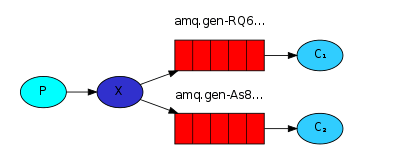
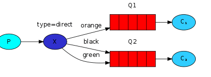
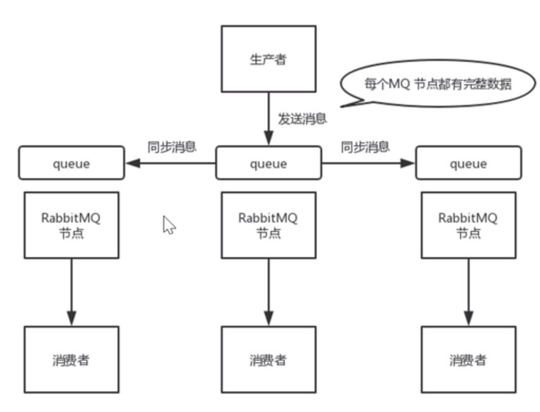
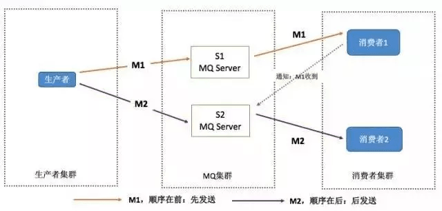

# 第 1 章 RabbitMQ 概述

## RabbitMQ 特点

RabbitMQ 是一个由 Erlang 语言开发的 AMQP 的开源实现。

RabbitMQ 最初起源于金融系统，用于在分布式系统中存储转发消息，在易用性、扩展性、高可用性等方面表现不俗。具体特点包括：

1、可靠性（Reliability）

RabbitMQ 使用一些机制来保证可靠性，如持久化、传输确认、发布确认。

2、灵活的路由（Flexible Routing）

在消息进入队列之前，通过 Exchange 来路由消息的。对于典型的路由功能，RabbitMQ 已经提供了一些内置的 Exchange 来实现。针对更复杂的路由功能，可以将多个 Exchange 绑定在一起，也通过插件机制实现自己的 Exchange 。

3、 消息集群（Clustering）

多个 RabbitMQ 服务器可以组成一个集群，形成一个逻辑 Broker 。

3、 高可用（Highly Available Queues）

队列可以在集群中的机器上进行镜像，使得在部分节点出问题的情况下队列仍然可用。

4、多种协议（Multi-protocol）

RabbitMQ 支持多种消息队列协议，比如 STOMP、MQTT 等等。

5、多语言客户端（Many Clients）

RabbitMQ 几乎支持所有常用语言，比如 Java、.NET、Ruby 等等。

6、 管理界面（Management UI）

RabbitMQ 提供了一个易用的用户界面，使得用户可以监控和管理消息 Broker 的许多方面。

7、 跟踪机制（Tracing）

如果消息异常，RabbitMQ 提供了消息跟踪机制，使用者可以找出发生了什么。

缺点：

降低了稳定性，消息队列挂了，系统就不能正常通信，增加了复杂性，需要考虑：一致性问题，重复消费，消息可靠传输等

# 第 2 章 RabbitMQ 安装

## 1：Window 安装

下载 Erlang，选择正确的对应 RabbitMQ 的版本

一路 Next，不要怀疑，不过中间要是让你安装说明插件驱动不要立即重启

安装 RabbitMQ

下载地址:([http://www.rabbitmq.com/install-windows.html](https://www.rabbitmq.com/install-windows.html)),选择对应系统的版本

配置环境变量：

将 Erlang 加入到环境变量中

将其添加到 PATH 中

```
%ERLANG_HOME%\bin
```

将 RabbitMQ 加入到环境变量中

重启计算机

运行 RabbitMQ Service - start

切换到安装目录的 sbin 目录，启动图形化界面：

```cmd
# 开启图形化界面
rabbitmq-plugins enable rabbitmq_management
```

访问：

本地浏览器输入 http://localhost:15672

## 2：linux 安装

一般来说安装 RabbitMQ 之前要安装 Erlang ，可以去 Erlang 官网下载。接着去 RabbitMQ 官网下载安装包，之后解压缩即可。

Erlang 官方下载地址：https://www.erlang.org/downloads

RabbitMQ 官方下载地址：https://www.rabbitmq.com/download.html

依赖包安装

安装 RabbitMQ 之前必须要先安装所需要的依赖包可以使用下面的一次性安装命令

yum install gcc glibc-devel make ncurses-devel openssl-devel xmlto -y

安装 Erlang

1、 将 Erlang 源代码包 otp_src_19.3.tar.gz 上传到 Linux 的/home 目录下

2、解压 erlang 源码包

tar -zxvf otp_src_19.3.tar.gz

3、手动创建 erlang 的安装目录

mkdir /usr/local/erlang

4、进入 erlang 的解压目录

cd otp_src_19.3

5、配置 erlang 的安装信息

./configure --prefix=/usr/local/erlang --without-javac

6、编译并安装

make && make install

7、配置环境变量

vim /etc/profile

8、将这些配置填写到 profile 文件的最后

ERL_HOME=/usr/local/erlang

PATH=$ERL_HOME/bin:$PATH

export ERL_HOME PATH

9、启动环境变量配置文件

source /etc/profile

安装 RabbitMQ

1、 将 RabbitMQ 安装包 rabbitmq-server-3.7.2-1.el7.noarch.rpm 上传到/home 目录

2、安装 RabbitMQ

rpm -ivh --nodeps rabbitmq-server-3.7.2-1.el7.noarch.rpm

## 3：常用命令

```shell
### 2.3.1 启动和关闭

1、启动 RabbitMQ

rabbitmq -server start

注意：这里可能会出现错误，错误原因是/var/lib/rabbitmq/.erlang.cookie 文件权限不够。

解决方案对这个文件授权

chown rabbitmq:rabbitmq /var/lib/rabbitmq/.erlang.cookie

chmod 400 /var/lib/rabbitmq/.erlang.cookie

2、停止服务

rabbitmqctl stop

### 2.3.2 插件管理

1、添加插件

rabbitmq-plugins enable {插件名}

2、删除插件

rabbitmq-plugins disable {插件名}

注意：RabbitMQ 启动以后可以使用浏览器进入管控台但是默认情况 RabbitMQ 不允许直接使用浏览器浏览器进行访问因此必须添加插件

rabbitmq-plugins enable rabbitmq_management

3、使用浏览器访问管控台 http://RabbitMQ 服务器 IP:15672

http://192.168.71.128:15672
```

## 4：用户权限管理

1：角色分类

```txt
none:不能访问management plugin
management ： 查看自己相关节点信息
policymarker：
monitoring：管理员，只能看不能操作
administrator：所有信息，能操作
```

2：用户管理

RabbitMQ 安装成功后使用默认用户名 guest 登录

账号：guest

密码：guest

注意：这里 guest 只允许本机登录访问需要创建用户并授权远程访问命令如下

 添加用户：

```shell
rabbitmqctl add_user {username} {password}
rabbitmqctl add_user root root
```

 删除用户：

```shell
rabbitmqctl delete_user {username}
```

 修改密码：

```shell
rabbitmqctl change_password {username} {newpassword}
rabbitmqctl change_password root 123456
```

 设置用户角色：

```shell
## tag 参数表示用户角色取值为：management，monitoring _，policymaker,administrator
rabbitmqctl set_user_tags {username} {tag}
rabbitmqctl set_user_tags root administrator
```


3：权限管理

 授权命令：

```shell
rabbitmqctl set_permissions [-p vhostpath] {user} {conf} {write} {read}

-p vhostpath ：用于指定一个资源的命名空间，例如 –p / 表示根路径命名空间
user：用于指定要为哪个用户授权填写用户名
conf:一个正则表达式 match 哪些配置资源能够被该用户配置。
write:一个正则表达式 match 哪些配置资源能够被该用户读。
read:一个正则表达式 match 哪些配置资源能够被该用户访问。
```

查看用户权限

```shell
rabbitmqctl list_permissions
```

查看指定用户下的权限

```shell
rabbitmqctl list_user_permissions root
```

清除用户权限

```shell
rabbitmqctl clear_permissions root
```


5：vhost 管理

vhost 是 RabbitMQ 中的一个命名空间，可以限制消息的存放位置利用这个命名空间可以进行权限的控制有点类似 Windows 中的文件夹一样，在不同的文件夹中存放不同的文件。

添加 vhost: 

rabbitmqctl add vhost xqc

删除 vhost：

rabbitmqctl delete vhost xqc

# 第 3 章 基本原理

## 3.1 机制

### 1：结构

所有 MQ 产品从模型抽象上来说都是一样的过程：消费者（consumer）订阅某个队列。生产者（producer）创建消息，然后发布到队列（queue）中，最后将消息发送到监听的消费者。


上面是 MQ 的基本抽象模型，但是不同的 MQ 产品有有者不同的机制，RabbitMQ 实际基于 AMQP 协议的一个开源实现，因此 RabbitMQ 内部也是 AMQP 的基本概念。

RabbitMQ 的内部结构如下：


1、Message
消息，消息是不具体的，它由消息头和消息体组成。消息体是不透明的，而消息头则由一系列的可选属性组成，这些属性包括 routing-key（路由键）、priority（相对于其他消息的优先权）、delivery-mode（指出该消息可能需要持久性存储）等。

2、Publisher
消息的生产者，也是一个向交换器发布消息的客户端应用程序。

3、Exchange
交换器，用来接收生产者发送的消息并将这些消息路由给服务器中的队列。

4、Binding
绑定，用于消息队列和交换器之间的关联。一个绑定就是基于路由键将交换器和消息队列连接起来的路由规则，所以可以将交换器理解成一个由绑定构成的路由表。

5、Routing key：是一个路由规则，虚拟机可以用它来确定如何路由一个特定的信息。

5、Queue
消息队列，用来保存消息直到发送给消费者。它是消息的容器，也是消息的终点。一个消息可投入一个或多个队列。消息一直在队列里面，等待消费者连接到这个队列将其取走。

6、Connection
网络连接，比如一个 TCP 连接。

7、Channel
信道，多路复用连接中的一条独立的双向数据流通道。信道是建立在真实的 TCP 连接内地虚拟连接，AMQP 命令都是通过信道发出去的，不管是发布消息、订阅队列还是接收消息，这些动作都是通过信道完成。因为对于操作系统来说建立和销毁 TCP 都是非常昂贵的开销，所以引入了信道的概念，以复用一条 TCP 连接。

8、Consumer
消息的消费者，表示一个从消息队列中取得消息的客户端应用程序。

9、Virtual Host
虚拟主机，表示一批交换器、消息队列和相关对象。虚拟主机是共享相同的身份认证和加密环境的独立服务器域。每个 vhost 本质上就是一个 mini 版的 RabbitMQ 服务器，拥有自己的队列、交换器、绑定和权限机制。vhost 是 AMQP 概念的基础，必须在连接时指定，RabbitMQ 默认的 vhost 是 / 。

10、Broker
表示消息队列服务器实体。


### 2：确认机制

确保消息正确发送至 RabbitMQ，确保接受方消费了消息。

**发送方确认模式：**

将信道设置成 confirm 模式（发送方确认模式），则所有在信道上发布的消息都会被指派一个唯一的 ID。

一旦消息被投递到目的队列后，或者消息被写入磁盘后（可持久化的消息），信道会发送一个确认给生产者（包含消息唯一 ID）。

如果 RabbitMQ 发生内部错误从而导致消息丢失，会发送一条 nack（notacknowledged，未确认）消息。

发送方确认模式是异步的，生产者应用程序在等待确认的同时，可以继续发送消息。当确认消息到达生产者应用程序，生产者应用程序的回调方法就会被触发来处理确认消息。

**接受方确认机制：**

消费者接收每一条消息后都必须进行确认（消息接收和消息确认是两个不同操作）。只有消费者确认了消息，RabbitMQ 才能安全地把消息从队列中删除。

特殊：

- 如果消费者接收到消息，在确认之前断开了连接或取消订阅，RabbitMQ 会认为消息没有被分发，然后重新分发给下一个订阅的消费者。（可能存在消息重复消费的隐患，需要去重）
- 如果消费者接收到消息却没有确认消息，连接也未断开，则 RabbitMQ 认为该消费者繁忙，将不会给该消费者分发更多的消息。

### 3：可靠传输

消息丢失（生产者丢失消息、消息列表丢失消息、消费者丢失），劫持，

**生产者丢失消息**：从生产者弄丢数据这个角度来看，RabbitMQ 提供 transaction 和 confirm 模式来确保生产者不丢消息；

事务：发送消息前，开启事务（channel.txSelect()）,然后发送消息，如果发送过程中出现什么异常，事务就会回滚（channel.txRollback()）,如果发送成功则提交事务（channel.txCommit()）。

confirm：一旦 channel 进入 confirm 模式，所有在该信道上发布的消息都将会被指派一个唯一的 ID（从 1 开始），一旦消息被投递到所有匹配的队列之后；

落地实现：采用补偿机制，最多重试三次，三次不成功则需要人工介入

```java
if(ack){

}
```

**消息队列丢数据**：消息持久化。

持久化配置可以和 confirm 机制配合使用，你可以在消息持久化磁盘后，再给生产者发送一个 Ack 信号。

持久化设置：

1. 将 queue 的持久化标识 durable 设置为 true,则代表是一个持久的队列
2. 发送消息的时候将 deliveryMode=2

不应该对所有的 message 都使用持久化机制：性能下降，

**消费者丢失消息**：消费者丢数据一般是因为采用了自动确认消息模式，改为手动确认消息即可！

处理消息成功后，手动回复确认消息。

### 3：传输原理

由于 TCP 连接的创建和销毁开销较大，且并发数受系统资源限制，会造成性能瓶颈。RabbitMQ 使用信道的方式来传输数据。channel 是建立在真实的 TCP 连接内的虚拟连接，且每条 TCP 连接上的信道数量没有限制

### 4：持久化机制

持久化设置：

1. 将 queue 的持久化标识 durable 设置为 true,则代表是一个持久的队列
2. 发送消息的时候将 deliveryMode=2

不应该对所有的 message 都使用持久化机制：性能下降，


对于交换机，队列关系的持久化：

如果开启持久化，性能下降至1/4左右，不开启机器重启关系丢失；


### 5：分发

若该队列至少有一个消费者订阅，消息将以循环（round-robin）的方式发送给消费者。每条消息只会分发给一个订阅的消费者（前提是消费者能够正常处理消息并进行确认）。

通过路由可实现多消费的功能

## 3.2：工作模式

1：simple 模式

缺点：


消息可能没有被消费者正确处理,已经从队列中消失了,造成消息的丢失，这里可以设置成手动的 ack,但如果设置成手动 ack，处理完后要及时发送 ack 消息给队列，否则会造成内存溢出。

2：work 工作模式：资源竞争

消费者 1,消费者 2 同时监听同一个队列,消息被消费。C1 C2 共同争抢当前的消息队列内容,谁先拿到谁负责消费消息


均衡算法，消费者是平均分配的。

缺点：

高并发情况下,默认会产生某一个消息被多个消费者共同使用,可以设置一个开关(syncronize) 保证一条消息只能被一个消费者使用


资源竞争的模式有两种：1轮询模式，2公平竞争(多劳多得)


3：Fanout,广播模式下



每个消费者监听自己的队列；

生产者将消息发给 broker 交换机，由交换机将消息转发到绑定此交换机的每个队列，每个绑定交换机的队列都将接收到消息。注册业务，注册成功后既要发邮件又要发短信

4：routing 路由模式



消息生产者将消息发送给交换机按照路由判断,路由是字符串(info) 当前产生的消息携带路由字符(对象的方法),交换机根据路由的 key,只能匹配上路由 key 对应的消息队列,对应的消费者才能消费消息;

业务场景:

error 通知;

EXCEPTION;错误通知的功能;传统意义的错误通知;客户通知;利用 key 路由,可以将程序中的错误封装成消息传入到消息队列中,开发者可以自定义消费者,实时接收错误;


5：topic 主题模式


\*代表多个单词，#代表一个单词

路由功能添加模式匹配

## 3.3 Exchange 类型

Exchange 分发消息时根据类型的不同分发策略有区别，目前共四种类型：direct、fanout、topic、headers 。

headers 匹配 AMQP 消息的 header 而不是路由键，此外 headers 交换器和 direct 交换器完全一致，但性能差很多，目前几乎用不到了，所以直接看另外三种类型

1、direct

消息中的路由键（routing key）如果和 Binding 中的 binding key 一致， 交换器就将消息发到对应的队列中。路由键与队列名完全匹配，如果一个队列绑定到交换机要求路由键为“dog”，则只转发 routing key 标记为“dog”的消息，不会转发“dog.puppy”，也不会转发“dog.guard”等等。它是完全匹配、单播的模式。


2、fanout

每个发到 fanout 类型交换器的消息都会分到所有绑定的队列上去。fanout 交换器不处理路由键，只是简单的将队列绑定到交换器上，每个发送到交换器的消息都会被转发到与该交换器绑定的所有队列上。很像子网广播，每台子网内的主机都获得了一份复制的消息。fanout 类型转发消息是最快的。


3、topic

topic 交换器通过模式匹配分配消息的路由键属性，将路由键和某个模式进行匹配，此时队列需要绑定到一个模式上。它将路由键和绑定键的字符串切分成单词，这些单词之间用点隔开。它同样也会识别两个通配符：符号“#”和符号“_”。#匹配 0 个或多个单词，“_”匹配不多不少一个单词。


消息基于信道进行传输，

由于 TCP 连接的创建和销毁开销较大，且并发数受系统资源限制，会造成性能瓶颈。

信道是建立在真实的 TCP 连接内的虚拟连接，且每条 TCP 连接上的信道数量没有限制。

AMQP 协议中的核心思想就是生产者和消费者的解耦，生产者从不直接将消息发送给队列。生产者通常不知道是否一个消息会被发送到队列中，只是将消息发送到一个交换机。先由 Exchange 来接收，然后 Exchange 按照特定的策略转发到 Queue 进行存储。Exchange 就类似于一个交换机，将各个消息分发到相应的队列中。

在实际应用中我们只需要定义好 Exchange 的路由策略，而生产者则不需要关心消息会发送到哪个 Queue 或被哪些 Consumer 消费。在这种模式下生产者只面向 Exchange 发布消息，消费者只面向 Queue 消费消息，Exchange 定义了消息路由到 Queue 的规则，将各个层面的消息传递隔离开，使每一层只需要关心自己面向的下一层，降低了整体的耦合度。

## 3.4 Java 发送和接收 Queue 的消息

1：以simple模式为例：

发送：

```java
public class Send{
        public static void main(String[] args) throws IOException, TimeoutException {
             //创建链接工厂对象
            ConnectionFactory factory=new ConnectionFactory();
            factory.setHost("192.168.222.128");//设置RabbitMQ的主机IP
            factory.setPort(5672);//设置RabbitMQ的端口号
            factory.setUsername("root");//设置访问用户名
            factory.setPassword("root");//设置访问密码
            Connection connection=null;//定义链接对象
            
            Channel channel=null;//定义通道对象
            connection=factory.newConnection();//实例化链接对象
            channel=connection.createChannel();//实例化通道对象
            String message ="Hello World!3";
            
            //创建队列 ，名字为myQueue
            //队列名称，是否持久化，是否独占独立，是否自动删除，携带附属参数
            channel.queueDeclare("myQueue", true, false, false, null);
            
            //发送消息到指定队列
            channel.basicPublish("","myQueue",null,message.getBytes("UTF-8"));
            System.out.println("消息发送成功: "+message);
            channel.close();
            connection.close();
    }
}
```

接收类

```java
public class Receive {
       public static void main(String[] args) throws IOException, TimeoutException {
           ConnectionFactory factory = new ConnectionFactory();
           factory.setUsername("root");
           factory.setPassword("root");
           factory.setHost("192.168.222.128");
           //建立到代理服务器到连接
           Connection conn = factory.newConnection();
           //获得信道
           final Channel channel = conn.createChannel();
           //声明队列
           channel.queueDeclare("myQueue", true, false, false, null);
           //消费消息
           boolean autoAck = true;
           String consumerTag = "";
           
           //接收消息
           //参数1 队列名称
           //参数2 是否自动确认消息 true表示自动确认 false表示手动确认
           //参数3 为消息标签 用来区分不同的消费者这里暂时为""
           // 参数4 消费者回调方法用于编写处理消息的具体代码（例如打印或将消息写入数据库）
           channel.basicConsume("myQueue", autoAck, consumerTag, new DefaultConsumer(channel) {
               @Override
               public void handleDelivery(String consumerTag,
                                          Envelope envelope,
                                          AMQP.BasicProperties properties,
                                          byte[] body) throws IOException {
                   //获取消息数据
                   String bodyStr = new String(body, "UTF-8");
                   System.out.println(bodyStr);
               }
           });
//            channel.close();
//            conn.close();
       }
}

```

2 Exchange 的 direct 消息绑定

发送

```java
public class Send {
    public static void main(String[] args) throws IOException, TimeoutException {
        //创建链接工厂对象
        ConnectionFactory factory=new ConnectionFactory();
        factory.setHost("192.168.222.128");//设置RabbitMQ的主机IP
        factory.setPort(5672);//设置RabbitMQ的端口号
        factory.setUsername("root");//设置访问用户名
        factory.setPassword("root");//设置访问密码
        Connection connection=null;//定义链接对象
        Channel channel=null;//定义通道对象
        connection=factory.newConnection();//实例化链接对象
        channel=connection.createChannel();//实例化通道对象
       String message ="Hello World!3";
       String exchangeName="myExchange";
channel.queueDeclare("myQueueDirect", true, false, false, null);
       //指定Exchange的类型
       //参数1为 交换机名称
       //参数2为交换机类型取值为 direct、queue、topic、headers
       //参数3 为是否为持久化消息 true表示持久化消息 false表示非持久化
        channel.exchangeDeclare(exchangeName, "direct", true);
        //发送消息到RabbitMQ
        //参数1 我们自定义的交换机名称
        //参数2 自定义的RoutingKey值
        //参数3 设置消息的属性，可以通过消息属性设置消息是否是持久化的
        //参数4 具体要发送的消息信息
        channel.basicPublish(exchangeName,"myRoutingKey",null,message.getBytes("UTF-8"));
        System.out.println("消息发送成功: "+message);
//        channel.close();
//        connection.close();
    }
}
```

注意：使用 direct 消息模式时必须要指定 RoutingKey（路由键），将指定的消息绑定到指定的路由键上

接受：

```java
public static void main(String[] args) throws IOException, TimeoutException {
       //创建链接工厂对象
       ConnectionFactory factory=new ConnectionFactory();
       factory.setHost("192.168.222.128");//设置RabbitMQ的主机IP
       factory.setPort(5672);//设置RabbitMQ的端口号
       factory.setUsername("root");//设置访问用户名
       factory.setPassword("root");//设置访问密码
       Connection connection=null;//定义链接对象
       Channel channel=null;//定义通道对象
       connection=factory.newConnection();//实例化链接对象
       channel=connection.createChannel();//实例化通道对象
       String message ="Hello World!3111";
channel.queueDeclare("myQueueDirect", true, false, false, null);
       String exchangeName="myExchange";
  //指定Exchange的类型
       //参数1为 交换机名称
       //参数2为交换机类型取值为 direct、queue、topic、headers
       //参数3 为是否为持久化消息 true表示持久化消息 false表示非持久化
       channel.exchangeDeclare(exchangeName, "direct", true);
       channel.queueDeclare("myQueueDirect", true, false, false, null);

        channel.basicConsume("myQueueDirect ", autoAck, consumerTag, new DefaultConsumer(channel) {
               @Override
               public void handleDelivery(String consumerTag,
                                          Envelope envelope,
                                          AMQP.BasicProperties properties,
                                          byte[] body) throws IOException {
                   //获取消息数据
                   String bodyStr = new String(body, "UTF-8");
                   System.out.println(bodyStr);
               }
           });
//            channel.close();
//            conn.close();
       }
   }
```

注意：

1、使用 Exchange 的 direct 模式时接收者的 RoutingKey 必须要与发送时的 RoutingKey 完全一致否则无法获取消息

2、接收消息时队列名也必须要发送消息时的完全一致


3 ：Exchange 的 fanout 消息绑定

发送类

```java
public static void main(String[] args) throws IOException, TimeoutException {
        //创建链接工厂对象
        ConnectionFactory factory=new ConnectionFactory();
        factory.setHost("192.168.222.128");//设置RabbitMQ的主机IP
        factory.setPort(5672);//设置RabbitMQ的端口号
        factory.setUsername("root");//设置访问用户名
        factory.setPassword("root");//设置访问密码
        Connection connection=null;//定义链接对象
        Channel channel=null;//定义通道对象
        connection=factory.newConnection();//实例化链接对象
        channel=connection.createChannel();//实例化通道对象
        String message ="Hello World!3111";
        String exchangeName="myExchangeFanout";
        //指定Exchange的类型
        //参数1为 交换机名称
        //参数2为交换机类型取值为 direct、queue、topic、headers
        //参数3 为是否为持久化消息 true表示持久化消息 false表示非持久化
        channel.exchangeDeclare(exchangeName, "fanout", true);
        //接收消息
        //参数1 队列名称
        //参数2 是否自动确认消息 true表示自动确认 false表示手动确认
        //参数3 为消息标签 用来区分不同的消费者这列暂时为""
        // 参数4 消费者回调方法用于编写处理消息的具体代码（例如打印或将消息写入数据库）
        System.out.println(queueName);
        channel.basicConsume(queueName,autoAck,consumerTag,new DefaultConsumer(channel) {
            @Override
            public void handleDelivery(String consumerTag,
                                       Envelope envelope,
                                       AMQP.BasicProperties properties,
                                       byte[] body) throws IOException {
                //获取消息数
                String bodyStr = new String(body, "UTF-8");
                System.out.println(bodyStr);
            }
        });
    }
```

注意：

fanout 模式的消息需要将一个消息同时绑定到多个队列中因此这里不能创建并指定某个队列

接收类

```java
public static void main(String[] args) throws IOException, TimeoutException {
        ConnectionFactory factory = new ConnectionFactory();
        factory.setUsername("root");
        factory.setPassword("root");
        factory.setHost("192.168.222.128");
        //建立到代理服务器到连接
        Connection conn = factory.newConnection();
        //获得信道
        final Channel channel = conn.createChannel();
        //声明交换器
        String exchangeName = "myExchangeFanout";
        channel.exchangeDeclare(exchangeName, "fanout", true);
        //声明队列
        String queueName = channel.queueDeclare().getQueue();
        String routingKey = "";
        //绑定队列，通过键 hola 将队列和交换器绑定起来
        channel.queueBind(queueName, exchangeName, routingKey);
        //消费消息
        boolean autoAck = true;
        String consumerTag = "";
        //接收消息
        //参数1 队列名称
        //参数2 是否自动确认消息 true表示自动确认 false表示手动确认
        //参数3 为消息标签 用来区分不同的消费者这列暂时为""
        // 参数4 消费者回调方法用于编写处理消息的具体代码（例如打印或将消息写入数据库）
        System.out.println(queueName);
        channel.basicConsume(queueName,autoAck,consumerTag,new DefaultConsumer(channel) {
            @Override
            public void handleDelivery(String consumerTag,
                                       Envelope envelope,
                                       AMQP.BasicProperties properties,
                                       byte[] body) throws IOException {
                //获取消息数
                String bodyStr = new String(body, "UTF-8");
                System.out.println(bodyStr);
            }
        });
    }
```

注意：

1、使用 fanout 模式获取消息时不需要绑定特定的队列名称，只需使用 channel.queueDeclare().getQueue();获取一个随机的队列名称，然后绑定到指定的 Exchange 即可获取消息。

2、这种模式中可以同时启动多个接收者只要都绑定到同一个 Exchang 即可让所有接收者同时接收同一个消息是一种广播的消息机制


5：  topic 消息绑定

发送：

```java
public static void main(String[] args) throws IOException, TimeoutException {
   //创建链接工厂对象
   ConnectionFactory factory=new ConnectionFactory();
   factory.setHost("192.168.222.128");//设置RabbitMQ的主机IP
   factory.setPort(5672);//设置RabbitMQ的端口号
   factory.setUsername("root");//设置访问用户名
   factory.setPassword("root");//设置访问密码
   Connection connection=null;//定义链接对象
   Channel channel=null;//定义通道对象
   connection=factory.newConnection();//实例化链接对象
   channel=connection.createChannel();//实例化通道对象
   String message ="Hello World!";
   String exchangeName="myExchangeTopic";
   //指定Exchange的类型
   //参数1为 交换机名称
   //参数2为交换机类型取值为 direct、queue、topic、headers
   //参数3 为是否为持久化消息 true表示持久化消息 false表示非持久化
   channel.exchangeDeclare(exchangeName, "topic", true);
   //发送消息到RabbitMQ
   //参数1 我们自定义的交换机名称
   //参数2 自定义的RoutingKey值
   //参数3 设置消息的属性，可以通过消息属性设置消息是否是持久化的
   //参数4 具体要发送的消息信息
   channel.basicPublish(exchangeName,"test.myRoutingKey",null,message.getBytes("UTF-8"));
   System.out.println("消息发送成功: "+message);
   channel.close();
   connection.close();
}

```

注意：

1、在 topic 模式中必须要指定 Routingkey，并且可以同时指定多层的 RoutingKey，每个层次之间使用 点分隔即可 例如 test.myRoutingKey

接收类

```java
public static void main(String[] args) throws IOException, TimeoutException {
   ConnectionFactory factory = new ConnectionFactory();
   factory.setUsername("root");
   factory.setPassword("root");
   factory.setHost("192.168.222.128");
   //建立到代理服务器到连接
   Connection conn = factory.newConnection();
   //获得信道
   final Channel channel = conn.createChannel();
   //声明交换器
   String exchangeName = "myExchangeTopic";
   channel.exchangeDeclare(exchangeName, "topic", true);
   //声明队列
   String queueName = channel.queueDeclare().getQueue();

   String routingKey = "test.#";
   //绑定队列，通过键 将队列和交换器绑定起来
   channel.queueBind(queueName, exchangeName, routingKey);
   //消费消息
   boolean autoAck = true;
   String consumerTag = "";
   //接收消息
   //参数1 队列名称
   //参数2 是否自动确认消息 true表示自动确认 false表示手动确认
   //参数3 为消息标签 用来区分不同的消费者这列暂时为""
   // 参数4 消费者回调方法用于编写处理消息的具体代码（例如打印或将消息写入数据库）
   channel.basicConsume(queueName, autoAck, consumerTag, new DefaultConsumer(channel) {
       @Override
       public void handleDelivery(String consumerTag,
                                  Envelope envelope,
                                  AMQP.BasicProperties properties,
                                  byte[] body) throws IOException {
           //获取消息数据
           String bodyStr = new String(body, "UTF-8");
           System.out.println("test.#----"+bodyStr);
       }
   });
}
```

注意：

1、Topic 模式的消息接收时必须要指定 RoutingKey 并且可以使用# 和 *来做统配符号，#表示通配任意一个单词 *表示通配任意多个单词，例如消费者的 RoutingKey 为 test.#或#.myRoutingKey 都可以获取 RoutingKey 为 test.myRoutingKey 发送者发送的消息


## 3.5 事务消息

事务消息与数据库的事务类似，只是 MQ 中的消息是要保证消息是否会全部发送成功，防止丢失消息的一种策略。

RabbitMQ 有两种方式来解决这个问题：

1. 通过 AMQP 提供的事务机制实现；
2. 使用发送者确认模式实现；


1 事务使用

事务的实现主要是对信道（Channel）的设置，主要的方法有三个：

channel.txSelect()声明启动事务模式；

channel.txCommint()提交事务；

channel.txRollback()回滚事务；


 发送类

```java
public class Send{
   public static void main(String[] args) throws IOException, TimeoutException {
       //创建链接工厂对象
       ConnectionFactory factory=new ConnectionFactory();
       factory.setHost("192.168.171.143");//设置RabbitMQ的主机IP
       factory.setPort(5672);//设置RabbitMQ的端口号
       factory.setUsername("root");//设置访问用户名
       factory.setPassword("root");//设置访问密码
       Connection connection=null;//定义链接对象
       Channel channel=null;//定义通道对象
       connection=factory.newConnection();//实例化链接对象
       channel=connection.createChannel();//实例化通道对象
       String message ="Hello World!";
String exchangeName="myExchangeTransaction";
//指定Exchange的类型
//参数1为 交换机名称
//参数2为交换机类型取值为 direct、fanout、topic、headers
//参数3 为是否为持久化消息 true表示持久化消息 false表示非持久化
channel.exchangeDeclare(exchangeName, "direct", true);
      // 声明事务
channel.txSelect();
       //发送消息到RabbitMQ
       //参数1 我们自定义的交换机名称
       //参数2 自定义的RoutingKey值
       //参数3 设置消息的属性，可以通过消息属性设置消息是否是持久化的
       //参数4 具体要发送的消息信息
      channel.basicPublish(exchangeName,"myRoutingKeyTransaction",null,message.getBytes("UTF-8"));
// 提交事务
      channel.txCommit();
       System.out.println("消息发送成功: "+message);
       channel.close();
       connection.close();
   }
}

```

接收类

```java
public class Receive{
   public static void main(String[] args) throws IOException, TimeoutException {
       ConnectionFactory factory = new ConnectionFactory();
       factory.setUsername("root");
       factory.setPassword("root");
       factory.setHost("192.168.171.143");
       //建立到代理服务器到连接
       Connection conn = factory.newConnection();
       //获得信道
       final Channel channel = conn.createChannel();
       //声明交换器
       String exchangeName = "myExchangeTransaction";
       channel.exchangeDeclare(exchangeName, "direct", true);
       //声明队列
       String queueName = channel.queueDeclare().getQueue();
       String routingKey = "myRoutingKeyTransaction";
       //绑定队列，通过键 hola 将队列和交换器绑定起来
       channel.queueBind(queueName, exchangeName, routingKey);
       //消费消息
       boolean autoAck = true;
       String consumerTag = "";
           //接收消息
           //参数1 队列名称
           //参数2 是否自动确认消息 true表示自动确认 false表示手动确认
          //参数3 为消息标签 用来区分不同的消费者这列暂时为""
          // 参数4 消费者回调方法用于编写处理消息的具体代码（例如打印或将消息写入数据库）
           channel.basicConsume(queueName, autoAck, consumerTag, new DefaultConsumer(channel) {
               @Override
               public void handleDelivery(String consumerTag,
                                          Envelope envelope,
                                          AMQP.BasicProperties properties,
                                          byte[] body) throws IOException {
                   //获取消息数据
                   String bodyStr = new String(body, "UTF-8");
                   System.out.println(bodyStr);
               }
           });
channel.close();
       conn.close();
   }
}

```

## 3.6 确认机制实现

1：发送者的确认机制

Confirm 发送方确认模式使用和事务类似，也是通过设置 Channel 进行发送方确认的，最终达到确保所有的消息全部发送成功

**Confirm 的三种实现方式：**

方式一：channel.waitForConfirms()普通发送方确认模式

```java
public class Send {
    public static void main(String[] args) throws IOException, TimeoutException, InterruptedException {
        //创建链接工厂对象
        ConnectionFactory factory=new ConnectionFactory();
        factory.setHost("192.168.222.128");//设置RabbitMQ的主机IP
        factory.setPort(5672);//设置RabbitMQ的端口号
        factory.setUsername("root");//设置访问用户名
        factory.setPassword("root");//设置访问密码
        Connection connection=null;//定义链接对象
        Channel channel=null;//定义通道对象
        connection=factory.newConnection();//实例化链接对象
        channel=connection.createChannel();//实例化通道对象
        String message ="Hello World!3";

        //创建队列 ，名字为myQueue
        channel.queueDeclare("myQueue", true, false, false, null);
        // 开启发送方确认模式
        channel.confirmSelect();
        long time=System.currentTimeMillis();
        //发送消息到指定队列
        for(int i=0;i<10000;i++){
            message="Hello World!"+i;
            channel.basicPublish("","myQueue",null,message.getBytes("UTF-8"));
        }
        channel.waitForConfirms();
        System.out.println(System.currentTimeMillis()-time);
        System.out.println("消息发送成功: "+message);
        channel.close();
        connection.close();
    }
}

```

方式二：channel.waitForConfirmsOrDie()批量确认模式；

```java
public class Send {
   public static void main(String[] args) throws IOException, TimeoutException, InterruptedException {
       //创建链接工厂对象
       ConnectionFactory factory=new ConnectionFactory();
       factory.setHost("192.168.222.128");//设置RabbitMQ的主机IP
       factory.setPort(5672);//设置RabbitMQ的端口号
       factory.setUsername("root");//设置访问用户名
       factory.setPassword("root");//设置访问密码
       Connection connection=null;//定义链接对象
       Channel channel=null;//定义通道对象
       connection=factory.newConnection();//实例化链接对象
       channel=connection.createChannel();//实例化通道对象
       String message ="Hello World!3";

       //创建队列 ，名字为myQueue
       channel.queueDeclare("myQueue", true, false, false, null);
       // 开启发送方确认模式
       channel.confirmSelect();
       long time=System.currentTimeMillis();
       //发送消息到指定队列
       for(int i=0;i<10000;i++){
           message="Hello World!"+i;
           channel.basicPublish("","myQueue",null,message.getBytes("UTF-8"));
       }
       channel.waitForConfirmsOrDie();
       System.out.println(System.currentTimeMillis()-time);
       System.out.println("消息发送成功: "+message);
       channel.close();
       connection.close();
   }
}

```

方式三：channel.addConfirmListener()异步监听发送方确认模式

```java
public class Send {
    public static void main(String[] args) throws IOException, TimeoutException, InterruptedException {
        //创建链接工厂对象
        ConnectionFactory factory=new ConnectionFactory();
        factory.setHost("192.168.222.128");//设置RabbitMQ的主机IP
        factory.setPort(5672);//设置RabbitMQ的端口号
        factory.setUsername("root");//设置访问用户名
        factory.setPassword("root");//设置访问密码
        Connection connection=null;//定义链接对象
        Channel channel=null;//定义通道对象
        connection=factory.newConnection();//实例化链接对象
        channel=connection.createChannel();//实例化通道对象
        String message ="Hello World!3";

        //创建队列 ，名字为myQueue
        channel.queueDeclare("myQueue", true, false, false, null);
        // 开启发送方确认模式
        channel.confirmSelect();
        long time=System.currentTimeMillis();
        //发送消息到指定队列
        for(int i=0;i<10000;i++){
            message="Hello World!"+i;
            channel.basicPublish("","myQueue",null,message.getBytes("UTF-8"));
        }
        channel.addConfirmListener(new ConfirmListener() {
            public void handleAck(long deliveryTag, boolean multiple) throws IOException {
                System.out.println("未确认消息，标识：" + deliveryTag+"----"+multiple);
            }

            public void handleNack(long deliveryTag, boolean multiple) throws IOException {
                System.out.println("已确认消息，标识："+deliveryTag+" ---多个消息："+multiple);
            }
        });
        System.out.println(System.currentTimeMillis()-time);
        System.out.println("消息发送成功: "+message);
        channel.close();
        connection.close();
    }
}

```


2 ：消费者确认模式

为了保证消息从队列可靠地到达消费者，RabbitMQ 提供消息确认机制(message acknowledgment)。消费者在声明队列时，可以指定 noAck 参数，当 noAck=false 时，RabbitMQ 会等待消费者显式发回 ack 信号后才从内存(和磁盘，如果是持久化消息的话)中移去消息。否则，RabbitMQ 会在队列中消息被消费后立即删除它。

在 Consumer 中 Confirm 模式中分为手动确认和自动确认。

手动确认主要并使用以下方法：

basicAck(): 用于肯定确认，multiple 参数用于多个消息确认。

basicRecover()：是路由不成功的消息可以使用 recovery 重新发送到队列中。

basicReject()：是接收端告诉服务器这个消息我拒绝接收,不处理,可以设置是否放回到队列中还是丢掉，而且只能一次拒绝一个消息,官网中有明确说明不能批量拒绝消息，为解决批量拒绝消息才有了 basicNack。

basicNack()：可以一次拒绝 N 条消息，客户端可以设置 basicNack 方法的 multiple 参数为 true。


注意：

1、如果开启了事务手动提交以后再开始事务，如果事务执行了回滚操作那么即使手动确认了消息那么消息也不会从队列中移除，除非使用事务执行提交以后才会移除。

# 第 4 章 SpringBoot 集成 RabbitMQ

配置模块send 的 application.properties 文件添加对 RabbitMQ 的集成

```yml
#配置RabbitMQ链接信息
#配置RabbitMQ服务器的IP地址
spring.rabbitmq.host=192.168.222.128
#配置RabbitMQ服务器的端口
spring.rabbitmq.port=5672
#配置RabbitMQ服务器的访问账号
spring.rabbitmq.username=root
#配置RabbitMQ服务器的访问密码
spring.rabbitmq.password=root
```

创建 SendService 接口与实现类

```java
@service("sendService")
public class SendServiceImpl implements SendService{
    //注入Amap的模板类，利用这个对象来发送和接收消息
    @Resource
    private AmqpTemplate amqpTemplate;
    @Override
    public void sendMessage(String message){
        amqpTemplate.convertANdSend("bootDirectExchange","bootDirectRouting",message);
    }
}
```

Application.java

```java
@SpringBootApplication
public class Application{
    public static void main(String[] args){
        ApplicationContext ac = SpringApplication.run(Application.class,args);
        SendService service = (SendService) ac.getBean("sendService");

        service.sendMessage("Boot的测试数据");
    }
}
```

配置模块 receive 的 application.properties 文件添加对 RabbitMQ 的集成

```yml
#配置RabbitMQ链接信息
#配置RabbitMQ服务器的IP地址
spring.rabbitmq.host=192.168.222.128
#配置RabbitMQ服务器的端口
spring.rabbitmq.port=5672
#配置RabbitMQ服务器的访问账号
spring.rabbitmq.username=root
#配置RabbitMQ服务器的访问密码
spring.rabbitmq.password=root
```

## 4.3 Direct 模式消息发送和接收

### 4.3.1 消息发送

com.xqc.direct.Send

```java
@Service
public class Send {
    //自动注入Amqp的模板对象
    @Resource
    private AmqpTemplate template;
    public void send(){
        //发送消息到队列
        //参数 1 为消息存放的交换机名称 （需要事前创建）
        //参数 2 为RoutingKey，接收者需要根据这个key精准接收消息
        //参数 3 为具体存入队列中的消息数据
        template.convertAndSend("BootDirectExchange","BootRouting","SpringBootDirect");
    }
}
```

创建 Amqp 配置类 com.xqc.rabbitmq.config.AmqpConfig

```java
@Configuration
public class AmqpConfig {
//@Bean 用于模拟Spring配置文件中的<bean>标签，用于创建名字为
// BootDirectExchange的交换机
   @Bean
   public DirectExchange myChange(){
       return new DirectExchange("BootDirectExchange");
   }
}
```

运行测试 Direct 消息发送，编写 Application.java 类

```java
@SpringBootApplication
public class Application {
    public static void main(String[] args) {
      ApplicationContext ac= SpringApplication.run(Application.class, args);
      Send send= (Send) ac.getBean("send");
      send.send();
    }
}
```

### 4.3.2 消息接收

在 02-rabbitmq-springboot-receive 模块中创建类，com.xqc.direct.Receive

```java
@Service
public class Receive {
   //@RabbitListener注解用于标记当前方法为消息监听方法，可以监听某个队列，当队列中有新消息则自动完成接收，不需要调用，自动进行接受
   @RabbitListener(queues ="myQueueDirect")
   public void receive(String message){
       System.out.println("Boot的Direct消息----"+message);
   }
}
```

创建 Amqp 配置类 com.xqc.rabbitmq.config.AmqpConfig

```java
@Configuration
public class AmqpConfig {

//创建一个名字为BootDirectExchange的交换机
    @Bean
    public DirectExchange myChange(){
        return new DirectExchange("BootDirectExchange");
    }
//创建一个名字为myQueueDirect的队列
    @Bean
    public Queue queue(){
        return new Queue("myQueueDirect");
    }

//将队列绑定到交换机，配置一个队列和交换机的绑定
    @Bean("binding")
//参数1 为自定义队列对象，参数名queue为自定义队列Bean 的id
//参数 2 为自定义的交换机，参数名myChange 为自定义交换机Bean 的id
    public Binding binding(Queue queue,Exchange myChange){
// 将队列绑定到交换机，参数BootRouting为RoutingKey
        return BindingBuilder.bind(queue).to(myChange).with("BootRouting ").noargs();
    }
}
```

运行测试 Receive 消息接收，编写 Application.java 类

```java
@SpringBootApplication
public class Application {
    public static void main(String[] args) {
        SpringApplication.run(Application.class, args);
    }
}
```

**只能接受一次，执行一次接受一次，不能不间断的接受**

**如果当前监听方法正常结束 spring 就会启动自动确认消息，如果出现异常则不会确认消息，因此在消息处理时我们要做好消息的防止重复处理工作。**

## 4.4 Fanout 模式消息发送和接收

多个接受者可以

### 4.4.1 消息发送

在 02-rabbitmq-springboot-send 模块中创建类，com.xqc.fanout.Send

```java
@Service
public class Send {
    //自动注入Amqp的模板对象
    @Resource
    private AmqpTemplate template;
    public void fanoutSend(){
//发送消息
//参数 1 为交换机名称
//参数 2 为Routingkey ，由于Fanout不需要绑定RoutingKey因此可以为空
//参数 3 为具体的消息内容
        template.convertAndSend("BootFanoutExchange","","SpringBootFanout");
    }
}
```

修改 Amqp 配置类 com.xqc.rabbitmq.config.AmqpConfig，增加以下内容

```java
//创建交换机
@Bean
public FanoutExchange fanoutExchange(){
//创建一个基于Fanout的交换机 名字为BootFanoutExchange
    return new FanoutExchange("BootFanoutExchange");
}
```

运行测试 Direct 消息发送，编写 Application.java 类

```java
@SpringBootApplication
public class Application {
    public static void main(String[] args) {
      ApplicationContext ac= SpringApplication.run(Application.class, args);
      Send send= (Send) ac.getBean("send");
      send.fanoutSend();
    }
}
```

### 4.4.2 消息接收

在 02-rabbitmq-springboot-receive 模块中创建类，com.xqc.fanout.Receove

```java
@Service
public class Receive {
   @RabbitListener(queues ="fanoutQueue")
   public void fanoutReceive(String message){
       System.out.println("Boot的Fanout消息----"+message);
   }
}
```

修改 Amqp 配置类 com.xqc.rabbitmq.config.AmqpConfig，增加以下内容

```java
//创建一个名字为 fanoutQueue的队列
@Bean
public Queue fanoutQueue(){
    return new Queue("fanoutQueue");
}
//创建一个名字为 BootFanoutExchange的交换机
@Bean
public FanoutExchange fanoutExchange(){
    return new FanoutExchange("BootFanoutExchange");
}

@Bean
public Binding  fanoutBinding(Queue fanoutQueue,FanoutExchange fanoutExchange){
   //将队列绑定到指定的交换机上
//参数1 为指定的队列对象
//参数2 为指定的交换机对象
    return BindingBuilder.bind(fanoutQueue).to(fanoutExchange);
}
```

运行测试 Receive 消息接收，编写 Application.java 类

```java
@SpringBootApplication
public class Application {
    public static void main(String[] args) {
        SpringApplication.run(Application.class, args);
    }
}
```

## 4.5 Topic 模式消息发送和接收

### 4.5.1 消息发送

在 02-rabbitmq-springboot-send 模块中创建类，com.xqc.topic.Send

```java
@Service
public class Send {
   //自动注入Amqp的模板对象
   @Resource
   private AmqpTemplate template;
public void topicSend(){
//发送消息
//参数 1 为交换机名称
//参数 2 为Routingkey
//参数 3 为具体的消息内容
       template.convertAndSend("BootTopicExchange","Boot.text","SpringBootTopic");
   }
}
```

修改 Amqp 配置类 com.xqc.rabbitmq.config.AmqpConfig，增加以下内容

```java
//创建交换机
@Bean
public TopicExchange topicExchange(){
  return new TopicExchange("BootTopicExchange");
}
```

运行测试 Direct 消息发送，编写 Application.java 类

```java
@Service
public class Receive {
    @RabbitListener(queues ="topicQueue")
    public void topicReceive(String message){
        System.out.println("Boot的Fanout消息111----"+message);
    }
@RabbitListener(queues ="topicQueue2")
    public void fanoutReceive 02(String message){
        System.out.println("Boot的Fanout消息222----"+message);
    }
}
```

### 4.5.2 消息接收

在 02-rabbitmq-springboot-receive 模块中创建类，com.xqc.topic.Receove

```java
@Service
public class Receive {
   @RabbitListener(queues ="topicQueue")
   public void topicReceive(String message){
       System.out.println("Boot的Fanout消息111----"+message);
   }
@RabbitListener(queues ="topicQueue2")
   public void fanoutReceive 02(String message){
       System.out.println("Boot的Fanout消息222----"+message);
   }
}

```

修改 Amqp 配置类 com.xqc.rabbitmq.config.AmqpConfig，增加以下内容

```java
//创建交换机，
@Bean
public TopicExchange TopicExchange(){
//创建一个名为BootTopicExchange的Topic的交换机
    return new TopicExchange("BootTopicExchange");
}
//创建队列
@Bean
public Queue topicQueue(){
    return new Queue("topicQueue");
}
//创建队列
@Bean
public Queue topicQueue2(){
    return new Queue("topicQueue2");
}
//绑定队列到交换机
@Bean
public Binding  topicBinding(Queue topicQueue,TopicExchange topicExchange){
    //将队列绑定到指定交换机
//参数1 为指定队列对象
//参数2 为指定的交换机对象
//参数3 为RoutingKey的匹配规则，Boot.#表示 可以接收以Boot开头的任意子孙路径下的队列
Return BindingBuilder.bind(topicQueue).to(topicExchange).with("Boot.#");
}
@Bean
public Binding  topicBinding2(Queue topicQueue2,TopicExchange topicExchange){
    //将队列绑定到指定交换机
//参数1 为指定队列对象
//参数2 为指定的交换机对象
//参数3 为RoutingKey的匹配规则，#.test表示 可以接收以任意路径靠头的但是必须以test结尾的队列
    return BindingBuilder.bind(topicQueue2).to(topicExchange).with("#.text");
}
```

运行测试 Receive 消息接收，编写 Application.java 类

```java
@SpringBootApplication
public class Application {
    public static void main(String[] args) {
        SpringApplication.run(Application.class, args);
    }
}
```

# 第 5 章 RabbitMQ 集群

普通集群：


只有一台机器上存储着原本的数据，其他两台服务器上只存储数据所在的位置，如果通过第一第三台去查，还是去第二台查，查完后返回一三，然后再返回消费者。

缺点：第二台服务器性能消耗比较大，如果第二台服务器挂了，所有的数据就都没了。

镜像集群：



每个节点上都保存了数据。生产者给一个发，发完交给 RabbitMQ 去同步，如果其中一个挂了，就换一个发消息。该模式也带来了副作用，除了降低系统性能外，如果镜像队列过多，加之有大量的消息进入，集群内部的网络带宽将会被这种同步通讯大大消耗掉。

但是这个模式还存在问题：就是不是分布式的，如果这个 queue 的数据量很大，大到这个机器上的容量无法容纳的时候，就可以考虑使用 Kafka 实现高可用了。


```yml
#spring.rabbitmq.port=5672 
#配置 RabbitMQ 的集群访问地址
spring.rabbitmq.addresses=192.168.222.129:5672,192.168.222.130:5672
#配置 RabbitMQ 服务器的访问账号 
spring.rabbitmq.username=root 
#配置 RabbitMQ 服务器的访问密码 
spring.rabbitmq.password=root
```

主从（ 非分布式）的高可用，其实很简单 rabbitmq 有很好的管理控制台，就是在后台新增一个策略，这个策略是镜像集群模式的策略，指定的时候可以要求数据同步到所有节点的，也可以要求就同步到指定数量的节点，然后你再次创建 queue 的时候，应用这个策略，就会自动将数据同步到其他的节点上去了。

# 第 6 章：MQ 中常见问题

## 顺序问题

消息有序指的是可以按照消息的发送顺序来消费

假如生产者产生了 2 条消息：M1、M2，假定 M1 发送到 S1，M2 发送到 S2，如果要保证 M1 先于 M2 被消费，怎么做？



乱序情况：

一个 queue，有多个 consumer 去消费，每个 consumer 的执行时间是不固定的，无法保证先读到消息的 consumer 一定先完成操作。

一个 queue 对应一个 consumer，但是 consumer 里面进行了**多线程**消费，这样也会造成消息消费顺序错误。

kafka同一个partition中能保证顺讯，但是不同的partition无法保证顺序。

rabbitmq的同一个queue能够保证顺序，但是如果多个消费者同一个queue也会有顺序问题。

如果消费者使用多线程，也无法保证顺序。

**解决方案：**

局部顺序消费：

（1）保证生产者—MQ—消费者是一对一的关系

缺点：并行度不够，消费端出现问题，就会导致整个处理流程阻塞。全局有序才用，导致不能高可用了

（2）生产者依据消息 ID 将同组消息发送到一个 Queue 中。多个消费者同时获取 Queue 中的消息进行消费。MQ 使用分段锁保证单个 Queue 中的有序消费。

比如：张三发送消息：M3，M2，M1，李四发送消息：S3，S2，S1

将张三和李四发送的消息分别发送到两个 Queue 中，如果张三要求顺序消费，当消费者 1 消费了 Queue1 中的数据后，就给 Queue1 加上一个分段锁，直到消费者 1ack 以后才释放分段锁，其他队列不受影响。


RocketMQ 的实现：

生产者实现发送到同一个队列：

```java
//匿名内部类，选择队列
sendResult sendResult = producer.send(msg，new MessageQueueselector(){
    @Override
    public MessageQueue select(List<MessageQueue> mqs，Message msg，object arg) {
        Long id = (Long)arg;//根据订单id选择发送queue
        long index = id % mqs.size();
        return mqs.get((int) index);
},orderList.get(i).getOrderId());//订单id，需要唯一的id

```

消费者：

```java
//匿名内部类，直接给队列加锁，
consumer.registerMessageListener(new MessageListenerOrderly(){
    @Override
    public ConsumeOrderlyStatus consumMessage(List<MessageExt context){
        for(MessageExt msg:msgs){
            //业务处理
            ……
            return ConsumeOrderlyStatus.SUCCESS;
        }
    }
})
```

将一个放到一个 MQ 服务器上，拆分多个 queue，每个 queue 一个 consumer，将三个有先后顺序的消息根据用户订单 id 哈希后发送到同一个 queue 中，来保证消息的先后性。

一个 queue 对应一个 consumer，在 consumer 内部根据 ID 映射到不同内存队列，然后用内存队列做排队 分发给底层不同的 worker 来处理

（2）：单线程消费保证消息的顺序性；对消息进行编号，消费者处理消息是根据编号处理消息；

## 重复消费

可能会出现重复的消息？

1：消息生产者产生了重复消息

2：Kafka和RocketMQ的offset被回调了。

3：消费者确认失败，确认超时，进行重试。

可以分为 生产者端重复消费 和 消费者端重复消费，解决办法是是通过**幂等性**来保证重复消费的消息不对结果产生影响即可。

消息生成时 RabbitMQ 内部 对每个生产的消息生成个 inner-msg-id，作为去重和幂等的依据（消息投递失败并重传），避免重复的消息进入队列。

消息消费时 ，要求消息体中必须要有一个 bizId（对于同一业务全局唯一，如支付 ID、订单 ID、帖子 ID 等）作为去重的依据，避免同一条消息被重复消费。消费者获取消息后先根据 id 在 redis/db 中查询是否存在消费记录，如果没有消费过就正常消费，消费完毕后写入 redis/db,如果消息消费过就直接舍弃。

在 RocketMQ 中生产者发送消息前询问 RocketMQ 信息是否已发送过，或者通过 Redis 记录已查询记录。不过最好的还是直接在消费端去重消费。

如果消费端收到两条一样的信息，应该怎么处理？

每条消息都有唯一编号且保证消息处理成功与去重表的日志同时出现。利用一张日志表来记录已经处理成功的消息的 ID，如果新到的消息 ID 已经在日志表中，那么就不再处理这条消息。

正常情况下，消费完毕后，会发送一个 ACK 确认消息给消息队列，网络故障，ACK 没有到达，消息队列就不会将已经消费了的消息进行清除。


## 数据一致性问题

一个完整的业务流程，下单成功，送100个积分，下单写库成功，积分写库不成功，导致数据不一致。

为性能考虑，一般采用最终一致性。消费者业务逻辑增加重试机制。

重试分为同步重试和异步重试。

小业务同步重试，处理失败l立刻重试3-5次，如果还是失败，则写入到记录表，但如果消息量比较大，不建议使用这种方式，容易由于网络异常，造成消息积压。

而消息量比较大的业务场景，建议采用异步重试，在消费者处理失败之后，立刻写入`重试表`，有个`job`专门定时重试。

## 延时队列

详细：https://www.cnblogs.com/mfrank/p/11260355.html

10 分钟不支付完成就进行回滚。

介绍一下 RabbitMQ 中的一个高级特性——`TTL（Time To Live）` ，`TTL`是 RabbitMQ 中一个消息或者队列的属性，表明`一条消息或者该队列中的所有消息的最大存活时间`，单位是毫秒。换句话说，如果一条消息设置了 TTL 属性或者进入了设置 TTL 属性的队列，那么这条消息如果在 TTL 设置的时间内没有被消费，则会成为“死信”。如果同时配置了队列的 TTL 和消息的 TTL，那么较小的那个值将会被使用。

第一种是在创建队列的时候设置队列的 `x-message-tt` 属性

```java
Map<String, Object> args = new HashMap<String, Object>();
args.put("x-message-ttl", 6000);
channel.queueDeclare(queueName, durable, exclusive, autoDelete, args);
```

这样所有被投递到该队列的消息都最多不会存活超过 6s

第二种是针对每条消息设置 TTL

```java
AMQP.BasicProperties.Builder builder = new AMQP.BasicProperties.Builder();
builder.expiration("6000");
AMQP.BasicProperties properties = builder.build();
channel.basicPublish(exchangeName, routingKey, mandatory, properties, "msg body".getBytes());
```

但这两种方式是有区别的，如果设置了队列的 TTL 属性，那么一旦消息过期，就会被队列丢弃，而第二种方式，消息即使过期，也不一定会被马上丢弃，因为消息是否过期是在即将投递到消费者之前判定的，如果当前队列有严重的消息积压情况，则已过期的消息也许还能存活较长时间。

**使用 TTL 和死信队列实现延时队列功能：**

TTL 则刚好能让消息在延迟多久之后成为死信，另一方面，成为死信的消息都会被投递到死信队列里，这样只需要消费者一直消费死信队列里的消息就万事大吉了，因为里面的消息都是希望被立即处理的消息。

生产者生产一条延时消息，根据需要延时时间的不同，利用不同的 routingkey 将消息路由到不同的延时队列，每个队列都设置了不同的 TTL 属性，并绑定在同一个死信交换机中，消息过期后，根据 routingkey 的不同，又会被路由到不同的死信队列中，消费者只需要监听对应的死信队列进行处理即可。

如果这样使用的话，岂不是每增加一个新的时间需求，就要新增一个队列，这样只能将 TTL 设置在消息属性里了。增加一个延时队列，用于接收设置为任意延时时长的消息，增加一个相应的死信队列和 routingkey：

但是，在最开始的时候，就介绍过，如果使用在消息属性上设置 TTL 的方式，消息可能并不会按时“死亡“，因为 RabbitMQ 只会检查第一个消息是否过期，如果过期则丢到死信队列，索引如果第一个消息的延时时长很长，而第二个消息的延时时长很短，则第二个消息并不会优先得到执行。

**利用 RabbitMQ 插件实现延时队列：**

安装一个插件即可：https://www.rabbitmq.com/community-plugins.html ，下载 rabbitmq_delayed_message_exchange 插件，然后解压放置到 RabbitMQ 的插件目录。

## 死信队列

DLX,也称为死信交换机，当消息再一个队列中变成死信之后，他能重新发送都另一个交换机中，这个交换机就是 DLX，绑定 DLX 的队列就称为死信队列。

消息变成死信，可能的原因有：

- 消息被拒绝

- 消息过期，超过 TTL

- 队列达到最大长度

DLX 也是一个正常的交换机，。当这个队列中存在死信时，RabbitMQ 就会自动地将这个消息重新发布到设置的 DLX 上去，进而被路由到另一个队列，即死信队列。

要想使用使用死信队列，只需要在定义队列的时候设置队列参数 `x-dead-letter-exchange` 指定交换机即可。

**常见应用：**

保证数据消息不丢失。

**处理流程：**

队列中有死信消息，RabbitMQ 会自动将这个消息重新发布到设置的 Exchange 上，进而路由到另外一个队列(死信队列)。监听这个队列中的消息做处理，即处理死信消息。

**配置死信队列**

为业务队列配置死信交换机和死信队列 Key，死信队列为点对点模式。

**死信被丢到死信队列后，会发生什么变化？**

使用 `message.getMessageProperties()` 来获取死信消息的变化,多了如下信息

` x-first-death-exchange` ：第一次被抛入得死信交换机的名称

`x-first-death-reason=rejected` ：第一次称为死信的原因

` x-first-death-queue=dead.demo.simple.business.queuea` ：第一次称为死信前所在的队列名称

`x-death=[{reason=rejected,count=1,exchange=dead.letter.demo.simple.business.exchange,}]` ：历史被投入到死信交换机的信息列表。

**生命周期**

- 业务消息被投入到业务队列

- 消费者消费业务队列的消息，由于处理过程中发生异常，于是进行了 nck 或则 reject 操作
- 被 nck 或 reject 的消息由 RabbitMQ 投递到死信交换机中
- 死信交换机将消息投入到响应的死信队列
- 死信队列的消费者消费死信消息。


## 消息数据丢失

生产者数据丢失：开启 confirm 模式，每次写的消息都会分配一个唯一的 id，如果被写入了 RabbitMQ，就回传一个 ACK，如果没有处理得到这个消息，就回调生产者 nack 接口，超过一定时间没有接受到，可以重发。

RabbitMQ 丢失数据：开启持久化（持久化标识 durable 设置为 true），及时 RabbitMQ 挂了，也会恢复，但是如果有那种写入到了 RabbitMQ 中，但是还没来得及持久化的时候，RabbitMQ 挂了，可以重新灌入。还可以使用死信队列。防止数据丢失。

消费者丢失数据：开启 ack 机制。

## 补偿措施

生产者可靠性投递，消费者 ACK 确认机制，死信队列，基本可以保证消息投递成功。但是：可能还有其他问题导致，持久化机制机制会保存到硬盘上，要是硬盘也坏了，消息丢了怎么把？

消息补偿机制需要建立在业务数据库和 MQ 数据库的基础之上 , 当我们发送消息时 , 需要同时将消息数据保存在数据库中, 两者的状态必须记录。 然后通过业务数据库和 MQ 数据库的对比检查消费是否成功，不成功，进行消息补偿措施，重新发送消息处理


## 消息积压


原因：消费者网络故障一直没消费，或者消费者消费了没有`ACK` 确认，

解决：

方案一：临时紧急扩容：

先修复 consumer 的问题，确保其恢复消费速度，然后将现有 cnosumer 都停掉。新建一个 topic，partition 是原来的 10 倍，临时建立好原先 10 倍的 queue 数量。然后写一个临时的分发数据的 consumer 程序，这个程序部署上去消费积压的数据，消费之后不做耗时的处理，直接均匀轮询写入临时建立好的 10 倍数量的 queue。接着临时征用 10 倍的机器来部署 consumer，每一批 consumer 消费一个临时 queue 的数据。这种做法相当于是临时将 queue 资源和 consumer 资源扩大 10 倍，以正常的 10 倍速度来消费数据。等快速消费完积压数据之后，得恢复原先部署的架构，重新用原先的 consumer 机器来消费消息。

方案二：批量重导

就是大量积压的时候，我们当时就直接丢弃数据了，然后等过了高峰期以后，比如大家一起喝咖啡熬夜到晚上 12 点以后，用户都睡觉了。这个时候我们就开始写程序，将丢失的那批数据，写个临时程序，一点一点的查出来，然后重新灌入 mq 里面去，把白天丢的数据给他补回来。但是这样是有要求的，第一时效性没有要求，第二没有什么顺序要求；


## 高可用

首先这个 mq 得支持可伸缩性吧，就是需要的时候快速扩容，就可以增加吞吐量和容量，那怎么搞？设计个分布式的系统呗，参照一下 kafka 的设计理念，broker -> topic -> partition，每个 partition 放一个机器，就存一部分数据。如果现在资源不够了，简单啊，给 topic 增加 partition，然后做数据迁移，增加机器，不就可以存放更多数据，提供更高的吞吐量了？

其次你得考虑一下这个 mq 的数据要不要落地磁盘吧？那肯定要了，落磁盘才能保证别进程挂了数据就丢了。那落磁盘的时候怎么落啊？顺序写，这样就没有磁盘随机读写的寻址开销，磁盘顺序读写的性能是很高的，这就是 kafka 的思路。

其次你考虑一下你的 mq 的可用性啊？这个事儿，具体参考之前可用性那个环节讲解的 kafka 的高可用保障机制。多副本 -> leader & follower -> broker 挂了重新选举 leader 即可对外服务。

能不能支持数据 0 丢失啊？可以的，参考我们之前说的那个 kafka 数据零丢失方案。

## 最大连接数

默认情况下，rabbitmq 文件句柄数设置是 1024。连接数最多为 829，连接数的具体计算方式为：

连接数=（文件句柄数-100）\*0.9，计算后的值取整再减 2。