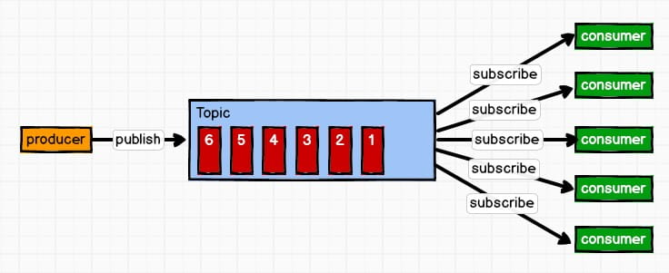

# MQ基础

## 概述

消息（Message）是指在应用间传送的数据。消息可以非常简单，比如只包含文本字符串，也可以更复杂，可能包含嵌入对象。

消息队列（Message Queue）是一种应用间的通信方式，消息发送后可以立即返回，由消息系统来确保消息的可靠传递。消息发布者只管把消息发布到 MQ 中而不用管谁来取，消息使用者只管从 MQ 中取消息而不管是谁发布的。这样发布者和使用者都不用知道对方的存在。

## 作用

- 服务间异步通信
- 顺序消费
- 定时任务
- 请求削峰
- 解耦
- 限流：省钱

## 模式

1：点对点模式（一对一，消费者主动拉取数据，消息收到后消息清除）

消息生产者生产消息发送到 Queue 中，然后消息消费者从 Queue 中取出并且消费消息。消息被消费以后，queue 中不再有存储，所以消息消费者不可能消费到已经被消费的消息。

Queue 支持存在多个消费者，但是对一个消息而言，只会有一个消费者可以消费。

2：发布**/**订阅模式（一对多，消费者消费数据之后不会清除消息）

消息生产者（发布）将消息发布到 topic 中，同时有多个消息消费者（订阅）消费该消息。和点对点方式不同，发布到 topic 的消息会被所有订阅者消费。

# MQ常见协议

## JMS（ Java消息服务)：

JMS消息服务接口规范，由三部分组成，消息头，消息属性，消息体；

JMS domain ：消息传递域，JMS规范定义了两种：点对点和发布订阅模式；

JMS 的

对象：发送者，消费者，消费中转角色；  

1：消息模型

P2P模式：P2P模式包含三个角色：消息队列（Queue），发送者(Sender)，接收者(Receiver)。每个消息都被发送到一个特定的队列，接收者从队列中获取消息。队列保留着消息，直到他们被消费或超时。

Pub/Sub模式：包含三个角色主题（Topic），发布者（Publisher），订阅者（Subscriber） 多个发布者将消息发送到Topic，系统将这些消息传递给多个订阅者。

STOMP（面向流文本消息协议）：

## AMQP

（高级消息队列协议）Advanced Message Queue，高级消息队列协议。它是应用层协议的一个开放标准，为面向消息的中间件设计，基于此协议的客户端与消息中间件可传递消息，并不受产品、开发语言等条件的限制。

MQTT（消息队列遥测传输）：

微服务之间有两种常见的通信方式：同步和异步。在同步通信中，调用方在发送下一条消息之前等待响应，并且它作为 HTTP 之上的 REST 协议运行。相反，在异步通信中，无需等待响应即可发送消息。这适用于分布式系统，通常需要消息代理来管理消息。

异步通信是非阻塞的。它也支持比同步操作更好的缩放

# 选型

| 特性       | ActiveMQ                                                     | RabbitMQ                                                     | RocketMQ                                                     | Kafka                                                        |
| ---------- | ------------------------------------------------------------ | ------------------------------------------------------------ | ------------------------------------------------------------ | ------------------------------------------------------------ |
| 单机吞吐量 | 万级，吞吐量比RocketMQ和Kafka要低一个数量级                  | 万级，吞吐量比RocketMQ和Kafka要低一个数量级                  | 10万级，RocketMQ也是可以支撑高吞吐的一种MQ                   | 10万级这是kafka最大的优点，就是吞吐量高。一般配置和数据类的系统进行实时数据计算、日志采集等场景 |
| 时效性     | ms级                                                         | 微妙级，这是RabbitMQ的一大特点，就是延迟最低                 | ms级                                                         | 延迟在ms级内                                                 |
| 可用性     | 基于主从架构实现高可用                                       | 高，基于主从架构实现高可用                                   | 非常高，分布式架构                                           | 非常高，kafka是分布式的，一个数据多个副本，少数机器宕机后，不会丢失数据，不会导致不可用 |
| 消息可靠性 | 有较低的概率丢失数据                                         | 消息不丢失                                                   | 经过参数优化配置，可以做到0丢失                              | 经过参数优化配置可以做到0丢失                                |
| 核心特点   | MQ领域的功能及其完备                                         | 基于Erlang开发，所以并发能力强，性能及其好，延时很低         | MQ功能较为完善，还是分布式的，扩展性好                       | 功能较为简单，主要支持简单的MQ功能，在大数据领域的实时计算以及日志采集被大规模使用，是实时上的标准。 |
|            | 非常成熟，功能强大，在业内大量公司以及项目都有应用。 但是偶尔消息丢失的概率，并且现在社区以及国内应用都越来越少，官方社区对ActiveMQ5.X维护越来越少，而且确实主要是基于解耦和异步来用的，较少在大规模吞吐场景中使用 | erlang语言开发的，性能及其好，延时很低。而且开源的版本，就提供的管理界面非常棒，在国内一些互联网公司近几年用RabbitMQ也是比较多一些，特别适用于中小型的公司 缺点显而易见，就是吞吐量会低一些，这是因为它做的实现机制比较中，因为使用erlang开发，目前没有多少公司使用其开发。所以针对源码界别的定制，非常困难，因此公司的掌控非常弱，只能依赖于开源社区的维护。 | 接口简单易用，毕竟在阿里大规模应用过，有阿里平台保障，日处理消息上 百亿之多，可以做到大规模吞吐，性能也非常好，分布式扩展也很方便，社区维护还可以，可靠性和可用性都是OK的，还可以支撑大规模的topic数量，支持复杂MQ业务场景。 | 仅仅提供较少的核心功能，但是提供超高的吞吐量，ms级别的延迟，极高的可用性以及可靠性，分布式可以任意扩展。 同时kafka最好是支撑较少的topic数量即可，保证其超高的吞吐量。 |

## RabbitMQ

AMQP（高级消息队列协议）的标准实现，部署相对比于其他简单一些。本身支持很多的协议：AMQP，XMPP, SMTP,STOMP，核心思想是生产者不会将消息直接发送给队列，消息在发送给客户端时先在中心队列排队。对路由(Routing)，负载均衡(Load balance)、数据持久化都有很好的支持。

规模：根据配置和资源，这里的运行速度约为每秒 50K msg。

持久性：支持持久性消息和瞬时消息。

一对一与一对多的消费者：两者都有。

缺点：

Erlang 语言，目前用 Erlang 的还是少一些

## kafka

高吞吐量的分布式发布订阅消息系统。它可以处理消费者规模的网站中的所有动作流数据。 这种动作（网页浏览，搜索和其他用户的行动）是在现代网络上的许多社会功能的一个关键因素。 这些数据通常是由于吞吐量的要求而通过处理日志和日志聚合来解决。 对于像 Hadoop 的一样的日志数据和离线分析系统，但又要求实时处理的限制，这是一个可行的解决方案。

多用于实时性的处理

规模：每秒最多可以发送一百万条消息。

持久性：是的。

一对一 vs 一对多的消费者：只有一对多

- 吞吐量较低：Kafka 和 RabbitMQ 都可以。
- 吞吐量高：Kafka。
- 完全的分布式系统：Broker、Producer、Consumer 都原生自动支持分布式，依赖 zookeeper 自动实现复杂均衡；

缺点：

消费失败不支持重试

支持消息顺序，但是一台代理宕机后，就会产生消息乱序；

## ActiveMQ

## RocketMQ

RabbitMQ支持主从架构，RocketMQ支持分布式架构，功能相对完善，可扩展性好。

阿里，因为内部产物，很多接口与 API 并不是普遍适用。参考 Kafka 设计的，

- 能够保证严格的消息顺序
- 提供针对消息的过滤功能
- 提供丰富的消息拉取模式
- 高效的订阅者水平扩展能力
- 实时的消息订阅机制
- 亿级消息堆积能力

基于文件的持久化；

# MQ问题

## 消息分发策略

|                      | ActiveMQ | RabbitMQ | Kafka | RocketMQ |
| -------------------- | -------- | -------- | ----- | -------- |
| 发布订阅             | 支持     | 支持     | 支持  | 支持     |
| 轮询分发（公平）     | 支持     | 支持     | 支持  |          |
| 公平分发（能者多劳） |          | 支持     | 支持  |          |
| 重发                 | 支持     | 支持     |       | 支持     |
| 消息拉取             |          | 支持     | 支持  | 支持     |

## 高可用和高可靠

## MQ解决分布式事务

