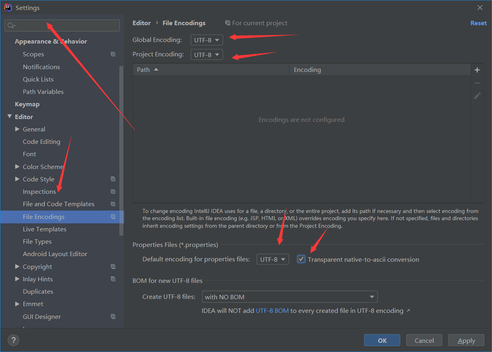
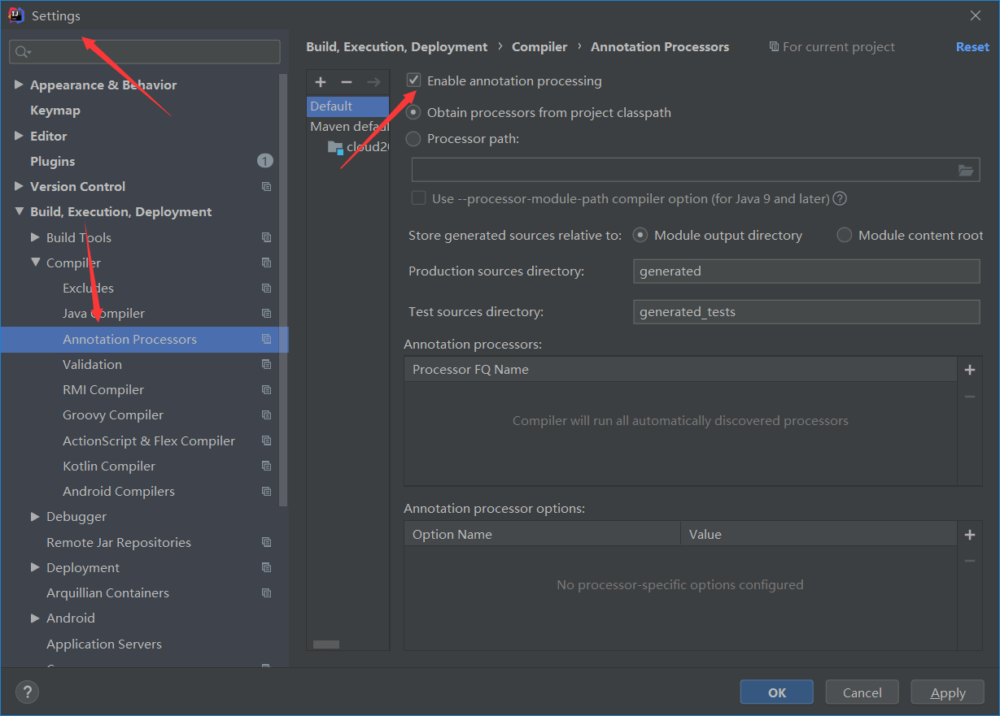
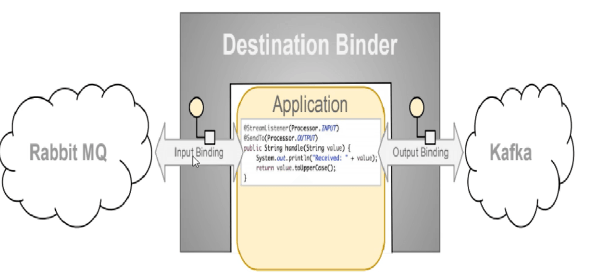
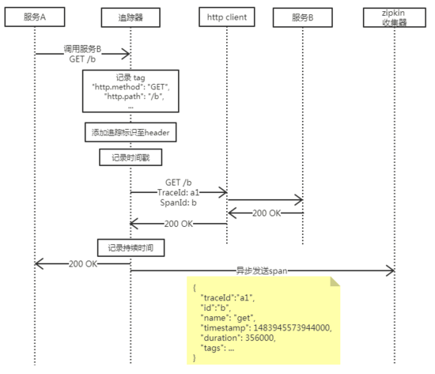

# 第一章：概述

Spring Cloud 并没有重复制造轮子，它只是将各家公司开发的比较成熟、经得起实际考验的服务框架组合起来，通过 Spring Boot 风格进行再封装屏蔽掉了复杂的配置和实现原理，最终给开发者留出了一套简单易懂、易部署和易维护的分布式系统开发工具包。这其中有非常著名的 Netflix 公司的开源产品；


SpringCloud 和 Dubbo 的区别？

dubbo 是二进制传输，占用带宽会少一点。SpringCloud 是 http 传输，带宽会多一点，同时使用 http 协议一般会使用 JSON 报文，消耗会更大。

Spring Cloud 抛弃了 Dubbo 的 RPC 通信，采用的是基于 HTTP 的 REST 方式。

|              | Dubbo         | SpringCloud |
| ------------ | ------------- | ----------- |
| 服务注册中心 | Zookeeper     | Eureka      |
| 服务调用方式 | RPC           | RestAPI     |
| 服务监控     | Dubbo-monitor | Admin       |
| 断路器       |               | Hystrix     |
| 服务网关     |               | Zuul        |
| 分布式配置   |               | Config      |
| 服务跟踪     |               | Sleuth      |
| 消息总线     |               | Bus         |

服务间的通信：

Dubbo，PRC的方式，底层采用Netty来实现，基于TCP建立的长连接

注意：BIO，NIO只是一种网络通信模式，BIO为每个连接创建一个线程，NIO一个线程服务多个连接；Netty封装了NIO，添加了主从处理组，BossGroup，WorkerGroup

编程模型：Reactor（反应堆）思想，NIO和Netty是其一种实现。

SpringCloud：使用Restful，http的方式，短连接的方式

性能：Dubbo>SpringCloud

3：SpringCloud 发展,部分组件停用:

1,Eureka 停用,可以使用 zk 作为服务注册中心，Consul 也可以，阿里的 Nacos 推荐使用。

2,服务调用,Ribbon 准备停更,代替为 LoadBalance

3,Feign 改为 OpenFeign

4,服务降级 Hystrix 停更,但是也大量使用了。改为 resilence4j 或者阿里巴巴的 sentienl

5.服务网关 Zuul 改为 gateway

6,服务配置 Config 改为 Nacos

7,服务总线 Bus 改为 Nacos

# 第二章：环境搭建

## 1：创建父工程,pom 依赖

选择 Maven 自己的 3.5 以上的

约定>配置>编码

字符编码



注解激活生效



java 编译版本 8


FileType 过滤，让一些文件不显示


删掉 src 文件夹，只保留 pom.xml

跳过单元测试


添加总的 jar 包

```xml
<!-- 统一管理jar包版本 -->
    <properties>
        <project.build.sourceEncoding>UTF-8</project.build.sourceEncoding>
        <maven.compiler.source>1.8</maven.compiler.source>
        <maven.compiler.target>1.8</maven.compiler.target>
        <junit.version>4.12</junit.version>
        <log4j.version>1.2.17</log4j.version>
        <lombok.version>1.16.18</lombok.version>
        <mysql.version>5.1.47</mysql.version>
        <druid.version>1.1.16</druid.version>
        <mybatis.spring.boot.version>1.3.0</mybatis.spring.boot.version>
    </properties>

    <!-- 子模块继承之后，提供作用：锁定版本+子modlue不用写groupId和version 只声明依赖，不不引入jar包 -->
    <dependencyManagement>
        <dependencies>
            <!--spring boot 2.2.2-->
            <dependency>
                <groupId>org.springframework.boot</groupId>
                <artifactId>spring-boot-dependencies</artifactId>
                <version>2.2.2.RELEASE</version>
                <type>pom</type>
                <scope>import</scope>
            </dependency>
            <!--spring cloud Hoxton.SR1-->
            <dependency>
                <groupId>org.springframework.cloud</groupId>
                <artifactId>spring-cloud-dependencies</artifactId>
                <version>Hoxton.SR1</version>
                <type>pom</type>
                <scope>import</scope>
            </dependency>
            <!--spring cloud alibaba 2.1.0.RELEASE-->
            <dependency>
                <groupId>com.alibaba.cloud</groupId>
                <artifactId>spring-cloud-alibaba-dependencies</artifactId>
                <version>2.1.0.RELEASE</version>
                <type>pom</type>
                <scope>import</scope>
            </dependency>
            <dependency>
                <groupId>mysql</groupId>
                <artifactId>mysql-connector-java</artifactId>
                <version>${mysql.version}</version>
            </dependency>
            <dependency>
                <groupId>com.alibaba</groupId>
                <artifactId>druid</artifactId>
                <version>${druid.version}</version>
            </dependency>
            <dependency>
                <groupId>org.mybatis.spring.boot</groupId>
                <artifactId>mybatis-spring-boot-starter</artifactId>
                <version>${mybatis.spring.boot.version}</version>
            </dependency>
            <dependency>
                <groupId>junit</groupId>
                <artifactId>junit</artifactId>
                <version>${junit.version}</version>
            </dependency>
            <dependency>
                <groupId>log4j</groupId>
                <artifactId>log4j</artifactId>
                <version>${log4j.version}</version>
            </dependency>
            <dependency>
                <groupId>org.projectlombok</groupId>
                <artifactId>lombok</artifactId>
                <version>${lombok.version}</version>
                <optional>true</optional>
            </dependency>
        </dependencies>
    </dependencyManagement>

    <build>
        <plugins>
            <plugin>
                <groupId>org.springframework.boot</groupId>
                <artifactId>spring-boot-maven-plugin</artifactId>
                <configuration>
                    <fork>true</fork>
                    <addResources>true</addResources>
                </configuration>
            </plugin>
        </plugins>
    </build>
```

## 2：创建子模块,pay 模块

实现


步骤

2.1：建 module


此时的父 pom 中已经自动加入了 module 的配置

```java
  <modules>
    <module>cloud-provider-payment8001</module>
  </modules>
```

2.2：pom 依赖

```xml
  <dependencies>
        <!--包含了sleuth+zipkin-->
        <dependency>
            <groupId>org.springframework.cloud</groupId>
            <artifactId>spring-cloud-starter-zipkin</artifactId>
        </dependency>
        <!--eureka-client-->
        <dependency>
            <groupId>org.springframework.cloud</groupId>
            <artifactId>spring-cloud-starter-netflix-eureka-client</artifactId>
        </dependency>
        <dependency>
            <groupId>org.springframework.boot</groupId>
            <artifactId>spring-boot-starter-web</artifactId>
        </dependency>
        <dependency>
            <groupId>org.springframework.boot</groupId>
            <artifactId>spring-boot-starter-actuator</artifactId>
        </dependency>
        <dependency>
            <groupId>org.mybatis.spring.boot</groupId>
            <artifactId>mybatis-spring-boot-starter</artifactId>
        </dependency>
        <dependency>
            <groupId>com.alibaba</groupId>
            <artifactId>druid-spring-boot-starter</artifactId>
            <version>1.1.10</version>
        </dependency>
        <!--mysql-connector-java-->
        <dependency>
            <groupId>mysql</groupId>
            <artifactId>mysql-connector-java</artifactId>
        </dependency>
        <!--jdbc-->
        <dependency>
            <groupId>org.springframework.boot</groupId>
            <artifactId>spring-boot-starter-jdbc</artifactId>
        </dependency>
        <dependency>
            <groupId>org.springframework.boot</groupId>
            <artifactId>spring-boot-devtools</artifactId>
            <scope>runtime</scope>
            <optional>true</optional>
        </dependency>
        <dependency>
            <groupId>org.projectlombok</groupId>
            <artifactId>lombok</artifactId>
            <optional>true</optional>
        </dependency>
        <dependency>
            <groupId>org.springframework.boot</groupId>
            <artifactId>spring-boot-starter-test</artifactId>
            <scope>test</scope>
        </dependency>
    </dependencies>

```

2.3：创建 application.yml


一定要变成树叶的标志，如果没有：

https://blog.csdn.net/qq_42449963/article/details/105518286


如果还不行，就 maven clean 一下，应该是 spring 的 jar 包没导入

```yml
server:
	port: 8001
spring:
	application:
		name: cloud-payment-service
	datasource:
    # 当前数据源操作类型
    type: com.alibaba.druid.pool.DruidDataSource
    # mysql驱动类
    driver-class-name: com.mysql.cj.jdbc.Driver
      url: jdbc:mysql://localhost:3306/db2019?useUnicode=true&characterEncoding=
            UTF-8&useSSL=false&serverTimezone=GMT%2B8
    username: root
    password: root
mybatis:
    mapper-locations: classpath*:mapper/*.xml
   	type-aliases-package: com.eiletxie.springcloud.entities
   			它一般对应我们的实体类所在的包，这个时候会自动取对应包中不包括包名的简单类名作为包括包名的别名。多个package之间可以用逗号或者分号等来进行分隔（value的值一定要是包的全）
```

2.4：主启动类

```java
@SpringBootApplication
public class PaymentMain8001 {

    public static void main(String[] args) {
        SpringApplication.run(PaymentMain8001.class,args);
   }
}
```

2.5：业务类

1：sql

```sql
CREATE DATABASE `db2019`;

USE `db2019`;

DROP TABLE IF EXISTS `payment`;

CREATE TABLE `payment` (
  `id` BIGINT(20) NOT NULL AUTO_INCREMENT COMMENT 'ID',
  `serial` VARCHAR(200) DEFAULT '',
  PRIMARY KEY (`id`)
) ENGINE=INNODB DEFAULT CHARSET=utf8;
```

2：实体类

Payment

```java
//引入lombok，不再写get和set方法
@Data
//对全部参数应用get和set
@AllArgsConstructor
//空参数
@NoArgsConstructor
//序列化
public class Payment implements Serializable {
    private Long id;
    private String serial;
}
```

前端返回实体

```java
//引入lombok，不再写get和set方法
@Data
//对全部参数应用get和set
@AllArgsConstructor
//空参数
@NoArgsConstructor
//序列化
/**
 * 返回前端的数据通用类
 */
public class CommonResult<T> {
    private Integer code;
    private String message;
    private T data;

    public CommonResult(Integer code,String message)
    {
        this(code,message,null);
    }

}
```

报错是因为没有安装 lombok 插件

4,dao 层:

```java
@Mapper
public interface PaymentDao {

    public int create(Payment payment);

    public Payment getPaymentById(@Param("id") Long id);
}
```

5,mapper 配置文件类

在 resource 下创建 directory 目录 mapper，创建 File 为 PaymentMapper.xml

```xml
<?xml version="1.0" encoding="UTF-8" ?>
<!DOCTYPE mapper PUBLIC "-//mybatis.org//DTD Mapper 3.0//EN" "http://mybatis.org/dtd/mybatis-3-mapper.dtd" >

<mapper namespace="com.xqc.springcloud.dao.PaymentDao">

    <insert id="create" parameterType="Payment" useGeneratedKeys="true" keyProperty="id">
        insert into payment(serial)  values(#{serial});
    </insert>

    <resultMap id="BaseResultMap" type="com.xqc.springcloud.entities.Payment">
        <id column="id" property="id" jdbcType="BIGINT"/>
        <id column="serial" property="serial" jdbcType="VARCHAR"/>
    </resultMap>
    <select id="getPaymentById" parameterType="Long" resultMap="BaseResultMap">
        select * from payment where id=#{id};
    </select>

</mapper>

```

6：写 service 和 serviceImpl

```java
@Service
public class PaymentServiceImpl implements PaymentService
{
    @Resource
    private PaymentDao paymentDao;
    public int create(Payment payment){
    	return paymentDao.create(payment) ;
    }
    public Payment getPaymentById( Long id){
    	return paymentDao.getPaymentById(id);
    }

}
```

7：controller

```java
@Restcontroller
@Slf4j
public class PaymentController{
    @Resource
	private Paymentservice paymentservice;
	@PostMapping(value = "/ payment/ create" )
	public CommonResult create(Payment payment){
        int result = paymentservice.create(payment);
        log.info("*****插入结果:"+result);
        if(result > o)
        {
        	return new commonResult( code: 20o,message:"插入数据库成功" ,result);
        }else{
        	return new CommonResult( code: 444,message:"插入数据库失败" , data: null);
        }
        @GetMapping(value = "/ payment/get/{id}")
        public CommonResult getPaymentById(@Pathvariable("id") Long id){
        	Payment payment = paymentservice.getPaymentById(id);log.info( "*****插入结果:"+payment);
        	if(payment != nul1)
        	{
        		return new CommonResult( code: 200,message: "查询成功" , payment);
            }else{
        		return new CommonResult( code: 444,message: "没有对应记录,大败" , data: null);
            }
		}
    }
    @GetMapping(value = "/payment/get/{id}")
	public CommonResult getpaymentById(@Pathvariable("id") Long id){
        Payment payment = paymentservice.getPaymentById(id);log.info("*****插入结果:"+payment);
        if(payment != null)
        {
        	return new CommonResult( code: 200,message: "查询成功" , payment);
        }else{
        	return new CommonResult( code: 444,message: "没有对应记录,大败", data: null);
        }


```


## 3：热部署

module 中添加插件：

```xml
        <!--自动热部署开发工具-->
        <dependency>
            <groupId>org.springframework.boot</groupId>
            <artifactId>spring-boot-devtools</artifactId>
            <scope>runtime</scope>
            <optional>true</optional>
        </dependency>
```

父工程中添加

```xml
    <build>
        <plugins>
            <plugin>
                <groupId>org.springframework.boot</groupId>
                <artifactId>spring-boot-maven-plugin</artifactId>
                <configuration>
                    <fork>true</fork>
                    <addResources>true</addResources>
                </configuration>
            </plugin>
        </plugins>
    </build>
```

开启自动编译的选项


在父 pom.xml 中按 Ctrl + Shift + Alt + /点击 Registry


如果遇到这个错误不用管，这是阿里犯的错


## 4：order 模块

1：建 moudle

2：改 pom

3：写 yml

```xml
server
	port:80
```

4：主启动类

```java
@SpringBootApplication
@EnableDiscoveryClient
public class OrderZKMain80
{
    public static void main(String[] args) {
            SpringApplication.run(OrderZKMain80.class, args);
    }
}
```

5：业务类

controller 类

因为这里是消费者类,主要是消费,那么就没有 service 和 dao,需要调用 pay 模块的方法。并且这里还没有微服务的远程调用,那么如果要调用另外一个模块,则需要使用基本的 api 调用

使用 RestTemplate 调用 pay 模块，RestTemplate提供了多种便捷访问远程Http服务的方法，是一种简单便捷的访问restful服务模板类，是Spring提供的用于访问Rest服务的客户端模板工具集。

使用：

使用restTemplate访问restful接口非常的简单粗暴无脑。(url, requestMap, ResponseBean.class)这三个参数分别代表REST请求地址、请求参数、HTTP响应转换被转换成的对象类型。

使用配置类将 restTemplate 注入到容器

```java
@Configuration
public class ApplicationContextConfig
{
    //依赖注入
    @Bean
    public RestTemplate getRestTemplate()
    {
        return new RestTemplate();
    }
}
```

编写 controller

```java
@Restcontroller
@slf4j
public class ordercontroller{
    public static final string PAYMENT_URL = "http://localhost:8001";
    @Resource
    private RestTemplate restTemplate;
    @GetMapping( "/consumer/payment/create")
    public CommonResult<Payment> create(Payment payment){
    	return restTemplate.postForobject(url:PAYMENT_URL +"/payment/create" ,payment , commonResult.class);
    }
    @GetMapping("/consumer/payment/get/{id”)
    public commonResult<Payment> getPayment(@Pathvariable("id") Long id){
        return restTemplate.getForobject( url:PAYMENT_URL+"/payment/get/"+id,CommonResult.class);
    }
                }
```

测试启动两个服务，访问消费者路径

localhost/consumer/payment/get/31

注意：在提供者模块不要忘记@RequestBody 对于参数

运行窗口：Run DashBoard

    <option name="configurationTypes">
    	<set>
    		<option value="SpringBootApplicationConfigurationType/>
    	</set>
    </option>

## 5：重构

新建一个模块,将重复代码抽取到一个公共模块中

5.1,创建 commons 模块

5.2 抽取公共 pom

```xml
    <dependencies>
        <dependency>
            <groupId>org.springframework.boot</groupId>
            <artifactId>spring-boot-devtools</artifactId>
            <scope>runtime</scope>
            <optional>true</optional>
        </dependency>
        <dependency>
            <groupId>org.projectlombok</groupId>
            <artifactId>lombok</artifactId>
            <optional>true</optional>
        </dependency>
        <!--hut工具包，对时间格式有很好的支持-->
        <dependency>
            <groupId>cn.hutool</groupId>
            <artifactId>hutool-all</artifactId>
            <version>5.1.0</version>
        </dependency>
    </dependencies>
```

5.3：entity 和实体类放入 commons 中

5.4：使用 mavne,将 commone 模块打包(install),

删除原有模块的实体类

其他模块引入 commons

# 第三章：服务注册与发现

## 1：Eureka

**服务治理**

管理服务与服务之间的依赖关系，可以实现服务调用，负载均衡，容错等，实现服务发现与注册

**服务注册与发现**

Eureka 采用 CS 的设计架构，EurekaServer 作为服务注册功能的服务器，它是服务注册中心，而系统中的其他微服务，使用 Eureka 的客户端连接到 Eureka Server 并维持心跳连接。


Eureka 包含两个组件：EurekaServer 和 EurekaClient

EurekaServer 提供服务注册服务：EurekaServer 中服务注册表中将会存储所有可用服务节点的信息，服务节点的信息可以在界面中直观看到。

EurekaClient 通过注册中心进行访问：Java 客户端，具备一个内置的，使用轮询负载算法的负载均衡器。在启动后，将会向 EurekaServer 发送心跳（默认周期为 30 秒）。如果 EurekaServer 在多个心跳周期内没有接收到某个节点的心跳。将会从服务注册表中把这个服务节点移除（默认 90 秒）


**客户端启动时如何注册到服务端？**

Eureka 客户端在启动时，首先会创建一个心跳的定时任务，定时向服务端发送心跳信息，服务端会对客户端心跳做出响应，如果响应状态码为 404 时，表示服务端没有该客户端的服务信息，那么客户端则会向服务端发送注册请求，注册信息包括服务名、ip、端口、唯一实例 ID 等信息。

**服务端如何保存客户端服务信息？**

客户端通过 Jersey 框架（亚马逊的一个 http 框架）将服务实例信息发送到服务端，服务端将客户端信息放在一个 ConcurrentHashMap 对象中。

**客户端如何拉取服务端已保存的服务信息？**

客户端拉取服务端服务信息是通过一个定时任务定时拉取的，每次拉取后刷新本地已保存的信息，需要使用时直接从本地直接获取。

**心跳与服务剔除机制？**

心跳机制：

- 客户端启动后，就会启动一个定时任务，定时向服务端发送心跳数据，告知服务端自己还活着，默认的心跳时间间隔是 30 秒。

服务剔除机制：

- 如果开启了自我保护机制，那么所有的服务，包括长时间没有收到心跳的服务（即已过期的服务）都不会被剔除；
- 如果未开启自我保护机制，那么将判断最后一分钟收到的心跳数与一分钟收到心跳数临界值（计算方法参考 5.1 节）比较，如果前者大于后者，且后者大于 0 的话，则启用服务剔除机制；
- 一旦服务剔除机制开启，则 Eureka 服务端并不会直接剔除所有已过期的服务，而是通过随机数的方式进行剔除，避免自我保护开启之前将所有的服务（包括正常的服务）给剔除。

### 单机

1：服务端

创建Eureka服务端项目eureka_server_7001

引入 pom 依赖，eurka 最新的依赖变了，服务端引用下边的

```xml
<!--老版本-->
<dependency>
    <groupId>org.springframework.cloud</groupId>
    <artifactId>spring-cloud-starter-eureka</artifactId>
</dependency>

<!--新版本-->
<dependency>
    <groupId>org.springframework.cloud</groupId>
    <artifactId>spring-cloud-starter-neflix-eureka-server</artifactId>
</dependency>
```

配置文件

```yml
server:
  port: 7001

eureka:
  instance:
    hostname: eureka7001.com #eureka服务端的实例名称
  client:
    register-with-eureka: false #false表示不向注册中心注册自己。
    fetch-registry: false #false表示自己就是注册中心，我的职责就是维护服务实例，并不需要去检索服务
    service-url:
      #集群指向其它eureka
      #defaultZone: http://eureka7002.com:7002/eureka/
      #单机就是7001自己
      defaultZone: http://eureka7001.com:7001/eureka/
  #server:
  #关闭自我保护机制，保证不可用服务被及时踢除
  #enable-self-preservation: false
  #eviction-interval-timer-in-ms: 2000
```

主启动类

```java
@SpringBootApplication
@EnableEurekaServer
public class EurekaMain7001
{
    public static void main(String[] args) {
            SpringApplication.run(EurekaMain7001.class, args);
    }
}
```

此时就可以启动当前项目了

测试 打开：localhost:7001

2：客户端

主启动类上加注解,表示当前是 eureka 客户端

```java
@EnableDiscoveryClient
```

修改 pom引入客户端依赖

```xml
<!--eureka-client,引入client的依赖-->
<dependency>
    <groupId>org.springframework.cloud</groupId>
    <artifactId>spring-cloud-starter-neflix-eureka-client</artifactId>
</dependency>
```

修改配置文件

```yml
eureka:
  client:
    #表示是否将自己注册进EurekaServer默认为true。
    register-with-eureka: true
    #是否从EurekaServer抓取已有的注册信息，默认为true。单节点无所谓，集群必须设置为true才能配合ribbon使用负载均衡
    fetchRegistry: true
    service-url:
      # 单机版
      defaultZone: http://localhost:7001/eureka
      # 集群版
      #defaultZone: http://eureka7001.com:7001/eureka,http://eureka7002.com:7002/eureka
  instance:
    instance-id: payment8001
    #访问路径可以显示IP地址
    prefer-ip-address: true
    #Eureka客户端向服务端发送心跳的时间间隔，单位为秒(默认是30秒)
    #lease-renewal-interval-in-seconds: 1
    #Eureka服务端在收到最后一次心跳后等待时间上限，单位为秒(默认是90秒)，超时将剔除服务
    #lease-expiration-duration-in-seconds: 2
```

### 集群

1：集群原理


2：服务端

改配置即可

```yml
    service-url:
      # 单机版
      # defaultZone: http://localhost:7001/eureka
      # 集群版
      defaultZone: http://eureka7001.com:7001/eureka,http://eureka7002.com:7002/eureka
```

3：客户端

```java
//改成微服务名称，这样每次访问，都去Eureka中拿地址，就会轮询拿，就达到负载均衡的效果了
//public static final String PAYMENT_URL = "http://localhost:8001";
public static final String PAYMENT_URL = "http://CLOUD-PAYMENT-SSERVICE";

@Reource
private RetTemplate restTemplate;

@GetMapping("/consumer/payment/create")
public CommonResult<Payment> create(Payment payment){
    return retTemplate.postForObject(PAYMNET_URL + "/payment/create",payment,CommonResult.class);
}
```

需要让 RestTemplate 开启负载均衡注解,还可以指定负载均衡算法,默认轮询

```java
@Configuration
public class ApplicationContextConfig
{
    @Bean
    @LoadBalanced
    public RestTemplate getRestTemplate()
    {
        return new RestTemplate();
    }
}
```

### 服务发现

对于注册进 Eureka 里面的微服务，可以服务发现来了获得该服务的信息。

以 pay 模块为例

**1,首先添加一个注解,在 controller 中**

```java
@RestController
@Slf4j
public class PaymentController
{
    @Resource
    private PaymentService paymentService;
    @Value("${server.port}")
    private String serverPort;
    @Resource
    private DiscoveryClient discoveryClient
}
```

discovery

```java
@GerMapping(value="/payment/discovery")
public Object discovery()
{
    //拿到所有注册的信息
    List<String> service = discoveryClient.getServices();
    for(String element:services){
        log.info(element);
    }
    List<ServiceInstance> instances = discoveryClient.getInstances("CLOUD-PAYMENT-SERVICE");
    for(ServiceInstance instance:instances){
  	 log.info(instance.getServiceId()+"\t"+instance.getHost()+"\t"+instance.getPort()+"\t"+instance.getUri());
    }
    return this.discoveryClient;
}
```

**2,在主启动类上添加一个注解**

```java
@SpringBootApplication
@EnableEurekaClient
@EnableDiscoveryClient
public classPayMentMain8001{
}
```

**然后重启 8001.访问/payment/discover**y

### 自我保护

默认情况下，如果 EurekaServer 在一定时间内没有收到某个微服务实例的心跳，EurekaServer 将会注销该实例（默认 90 秒）。但是当网络分区故障发生（延时，卡顿，拥挤）时，微服务与 EurekaServer 之间无法正常通信，以上行为可能变得危险了——因为微服务本身其实是健康的，此时不应该注销这个微服务，Eureka 通过自我保护来解决这个问题——当 EurekaServer 节点在短时间内丢失过多客户端时（可能发生了网络分区故障）那么这个节点就会进入自我保护模式。

一句话：某时刻某一个微服务不可用了，Eureka 不会立即清理。依旧会对该微服务新的进行保存，属于 CAP 里面的 AP 分支。

生产环境中，机器挂掉情况少，网络抖动情况反倒很多，所以要打开该机制；

出厂默认。自我保护机制开启：可以禁用自我保护机制

```yml
eureka.server.enable-self-proservation = false 
evicition-interval-timer-in-ms2000
```

## 2：Zookeeper

参考Zookeeper文档

## 3：Consul

Consul 是一套开源的分布式服务发现和配置管理系统，由 HashiCorp 公司用 `Go` 语言开发

提供了微服务中的服务治理。配置中心，控制总线等功能，这些功能中的每一个都可以根据需要单独使用，也可以在一起使用。

优点：

- 基于 raft 协议，比较简洁

- 支持健康检查，服务发现同时支持 Http 和 DNS 协议支持跨越数据中心的 WAN 集群，提供图形界面跨平台，支持 Linux，Mac，Windows

- KV 存储

- 多数据中心

- 可视化 WEB 界面

### 1,安装 consul

需要下载一个安装包

双击运行

```cmd
# 使用开发模式启动
consul agent -dev
```

访问主页

http://localhost:8500


## 4：三个注册中心的异同

CAP：[一致性](https://baike.baidu.com/item/一致性/9840083)（Consistency）、[可用性](https://baike.baidu.com/item/可用性/109628)（Availability）、[分区容错性](https://baike.baidu.com/item/分区容错性/23734073)（Partition tolerance）。

- zookeeper 当主节点故障时，zk 会在剩余节点重新选择主节点，耗时过长，虽然最终能够恢复，但是选取主节点期间会导致服务不可用，这是不能容忍的。
- eureka 各个节点是平等的，一个节点挂掉，其他节点仍会正常保证服务。


# 第五章：服务调用

## Ribbon 负载均衡

主要提供客户端的软件负载均衡和服务调用。Ribbon 客户端组件提供一系列完善的配置项如连接超时，重试等。简单的说，就是在配置文件中列出 Load Balancer 后面所有的机器，Ribbon 会自动的帮助你基于某种规则（如简单轮询，随机连接等）去连接这些机器。我们很容易使用 Ribbon 实现自定义的负载均衡算法。

**Ribbon 目前也进入维护,基本上不准备更新了**

**进程内 LB(本地负载均衡)**

将 LB 逻辑集成到消费方，消费方从服务注册中心获知有哪些地址可用，然后自己再从这些地址中选择一个合适的服务器。

集中式（LB）（服务器负载均衡）

集中式 LB，即在服务的消费方和提供方之间使用独立的 LB 设施（可以是硬件 F5 软件 nginx 等

### 对比

Ribbon 本地负载均衡客户端 VS Nginx 服务端负载均衡：

Nginx 是服务器负载均衡，客户端所有请求都会交给 Nginx，然后由 Ngixn 实现转发。

Ribbon 本地父子负载均衡，在调用微服务接口时候，会在服务注册中心上获取信息表之后缓存到 JV

**Ribbon 就是负载均衡+RestTemplate**

Ribbon 其实就是一个软负载均衡的客户端组件，它可以和其他所需要请求的客户端结合使用，和 Eureka 结合只是其中一个实例。


Ribbon 在工作时分成两步：

第一步选择 EurekaServer，它优先选择在同一区域内负载较少的 Server

第二步在根据用户指定的策略，在从 server 取到的服务注册列表中选择一个地址。

其中 Ribbon 提供了多种策略：轮询，随机，和响应时间加权。

### 原理

（1）通过拦截器对被注解@LoadBalanced修饰的RestTemplate进行拦截。

（2）将RestTemplate中调用的服务名，解析成具体的IP地址，由于一个服务名会对应多个地址，那么在选择具体服务地址的时候，需要做负载均衡。

（3）确定目标服务的IP和PORT后，通过Httpclient进行http的调用。

ILoadBalance 负载均衡器：ribbon 内部提供了一个叫做 ILoadBalance 的接口代表负载均衡器的操作，有添加服务器操作、选择服务器操作、获取所有的服务器列表、获取可用的服务器列表等等。

流程：

LoadBalancerClient（RibbonLoadBalancerClient 是实现类）在初始化的时候（execute 方法），会通过 ILoadBalance（BaseLoadBalancer 是实现类）向 Eureka 注册中心获取服务注册列表，并且每 10s 一次向 EurekaClient 发送“ping”，来判断服务的可用性，如果服务的可用性发生了改变或者服务数量和之前的不一致，则从注册中心更新或者重新拉取。LoadBalancerClient 有了这些服务注册列表，就 根据具体的 IRule（路由）来进行负载均衡。

IRule 接口代表负载均衡策略，choose 方法时具体的选择服务器方法，其中 RandomRule 表示随机策略、RoundRobinRule 表示轮询策略、WeightedResponseTimeRule 表示加权策略、BestAvailableRule 表示请求数最少策略等等。

ribbon默认是懒加载的，只有第一次调用的时候才会生成ribbon对应的组件，这就会导致首次调用的时间会很长，可以更改配置


#### 负载策略策略

随机策略：

```java
int index = rand.nextInt(serverCount); // 使用jdk内部的Random类随机获取索引值index
server = upList.get(index); // 得到服务器实例
```

轮询策略：

最大权重：

有一个默认每 30 秒更新一次权重列表的定时任务，该定时任务会根据实例的响应时间来更新权重列表，choose 方法做的事情就是，用一个(0,1)的随机 double 数乘以最大的权重得到 randomWeight，然后遍历权重列表，找出第一个比 randomWeight 大的实例下标，然后返回该实例

最少并发请求：

```java
for (Server server: serverList) { // 遍历每个服务器
        ServerStats serverStats = loadBalancerStats.getSingleServerStat(server); // 获取各个服务器的状态
        if (!serverStats.isCircuitBreakerTripped(currentTime)) { // 没有触发断路器的话继续执行
            int concurrentConnections = serverStats.getActiveRequestsCount(currentTime); // 获取当前服务器的请求个数
            if (concurrentConnections < minimalConcurrentConnections) { // 比较各个服务器之间的请求数，然后选取请求数最少的服务器并放到chosen变量中
                minimalConcurrentConnections = concurrentConnections;
                chosen = server;
            }
        }
    }
```

HashCode

### 使用

1：默认我们使用 eureka 的新版本时,它默认集成了 ribbon

```xml
<dependency>
    <groupId>org.springframework.cloud</groupId>
    <artifactId>spring-cloud-starter-neflix-eureka-server</artifactId>
</dependency>
```

我们也可以手动引入 ribbon，放入到消费者模块中，只有消费者请求生产者才会用到负载均衡；

```xml
<dependency>
    <groupId>org.springframework.cloud</groupId>
    <artifactId>spring-cloud-starter-neflix-ribbon</artifactId>
</dependency>
```

2：RestTemplate 类:

```java
// 返回对象为响应体中数据转化成的对象，基本上可以理解为Json
@GetMapping(" / consumer/ payment/get/{id}")
public CommonResult<Payment> getPayment(@Pathvariable("id") Long id){
	return restTemplate.getForobject(PAYMENT_SRV+"/payment/get/"+id,CommonResult.class);
}
//返回对象为ResponseEntity对象，包含了响应中的一些重要信息，比如响应头、响应状态码、响应体等
@GetMapping( "/ consumer/ payment/getForEntity/{id}")
public commonResult<Payment> getPayment2(@Pathvariable("id") Long id){
	ResponseEntity<commonResult> entity = restTemplate.getForEntit(PAYMENT_SRV+" /payment/get/"+id，commonResul);
    if(entity.getstatuscode().is2xxSuccessful()){
        return entity.getBody();
    }e1se {
        return new CommonResult( code: 444，message: "操作失败");
    }
}
@GetMapping("/consumer/payment/getForEntity/{id}")
public commonResult<Payment> getPayment2(@Pathvariable("id") Long id){
	ResponseEntitycCommonResult> entity = restTemplate.getForEntity( url:PAYINENT_URL+"/payment/get/"+id,CommonResul.class);
	if(entity.getstatuscode().is2xxsuccessful()){
        return entity.getBody();//这个responseEntity中有判断,这里是判断,状态码是不是2xx,
    }else{
        return new commonResult<>( code: 444,message:"操作失败");
    }
}
```

```java
RestTemplate的:
		xxxForObject()方法,返回的是响应体中的数据
    xxxForEntity()方法.返回的是entity对象,这个对象不仅仅包含响应体数据,还包含响应体信息(状态码等)
```

#### 自定义负载均衡算法:

1：ribbon 的轮询算法原理

rest 接口第几次请求数%服务器集群总数量 = 实际调用服务器位置下标，每次服务重启后 rest 接口计数从 1 开始

2：自定义负载均衡算法:

#### 不同服务不同配置

比如调用客户服务用轮询负载均衡算法，调用订单服务用最小权重算法等；

给不同服务创建不同的spring上下文配置信息；


### 优先级


## OpenFeign

是一个声明式的 web 客户端,只需要创建一个接口,添加注解即可完成微服务之间的调用，封装了 Ribbon

Feign 支持可插拔式的编码器和解码器，SpringCloud 对 Feign 进行封装。使其支持 SpringMVC 标准注解和 HttpMessageConverters。

以前要写接口，写实现类，通过 Ribbon 负载均衡远程调用，拿到返回值继续写接下来的程序，现在直接写接口，添加注解，使用时直接使用远程的类方法即可，无感知远程 HTTP 请求。

作用：

远程调用其他服务

实际开发中，由于对服务依赖的调用可能不止一处，往往一个接口会被多处调用，所以通常都会针对每个微服务自行封装一些客户端类来包装这些依赖服务的调用。

在 Feign 的实现下，我们只需要创建一个接口并使用注解的方式来配置它（以前是 DAO 接口上面标注 Mapper 注解，现在是一个微服务接口上面标注一个 Feign 注解即可）即可完成对服务提供方的接口绑定，简化了使用 SrpingCloudRibbon 时，自动封装服务调用客户端的开发量。

就是 A 要调用 B,Feign 就是在 A 中创建一个一模一样的 B 对外提供服务的的接口,我们调用这个接口,就可以服务到 B

### 1：对比

Feign：Feign 是 SpringCloud 组件中的一个轻量级 RESTful 的 Http 服务客户端， Feign 内置了 Ribbon，用来做客户端负载均衡，去调用服务注册中心的服务。Feign 的使用方式是：使用 Feign 的注解定义接口，调用这个接口，就可以斯奥用服务注册中心的服务。

OpenFeign：OpenFeign 是 SpringCloud 在 Feign 的基础上支持了 SpringMVC 的注解，如@RequestMapping 等等，OpenFeign 的@FeignClient 可以解析 SpringMVC 的@RequestMapping 注解下的接口，并通过动态代理的方式产生实现类，实现类中做负载均衡并调用其他服务。

### 2：常用注解

1）：@FeignClient 和@EnableFeignClients

@FeignClient 标注用于声明 Feign 客户端可访问的 Web 服务。

@EnableFeignClients 标注用于修饰 Spring Boot 应用的入口类，以通知 Spring Boot 启动应用时，扫描应用中声明的 Feign 客户端可访问的 Web 服务。

### 使用

之前的服务间调用,我们使用的是 ribbon+RestTemplate，现在改为使用 Feign

1：创建服务提供者

配置文件

```yml
server:
  port: 9005
spring:
  application:
    ## 指定服务名称，在nacos中的名字
    name: openFeign-provider
```

2：创建服务消费者

主启动类

```java
@SpringBootApplication
@EnableFeignClients
public class OrderFeignMain80 {
    public static void main(String[] args) {
        SpringApplication.run(OrderFeignMain80.class, args);
    }
}
```

需要调用的其他的服务的接口

```java
@Component
@FeignClient(value = "cloud-payment-service")
public interface PaymentFeignService {

    @GetMapping(value = "/payment/get/{id}")
    public CommonResult<Payment> getPaymentById(@PathVariable("id") Long id);

    @GetMapping("/payment/feign/timeout")
    public String paymentFeignTimeout();
}
```

controller

```java
@RestController
@Slf4j
public class OrderFeignController {
    @Resource
    private PaymentFeignService paymentFeignService;

    @GetMapping(value = "/consumer/payment/get/{id}")
    public CommonResult<Payment> getPaymentById(@PathVariable("id") Long id){
        CommonResult<Payment> paymentById = paymentFeignService.getPaymentById(id);
        return paymentById;
    }

    @GetMapping("/consumer/payment/feign/timeout")
    public String paymentFeignTimeout(){
        //open-feign-ribbon,客户端默认等待一秒钟
        return paymentFeignService.paymentFeignTimeout();
    }
}
```

请求传参：

1：GET 方式：使用@PathVriable 注解或@RequestParam 注解接受请求参数。如上面演示，

2：POST 方式：

#### 认证传递

实现RequestInterceptor接口，将需要的认证信息传递到header中进行传递；

### 性能优化

#### gzip 压缩

压缩纯文本可以达到 70%以上，降低网络传输字节，加快网页加载速度，使用 deflate 算法

Http 协议关于压缩传输的规定

1：客户端向服务器请求中带有：` Accept-Encoding:gzip` ,`deflate ` 字段，向服务器表示客户端支持的压缩格式（gzip 或 deflate）如果不发送该请求头，服务端默认是不会压缩的。

2：服务端在收到请求之后，如果请求头中含有 `Accept-Encodeing` 字段，并且支持该压缩类型，就会对想用报文压缩之后返回给客户端，并且携带 `Content-Encoding:gzip` 消息头，表示响应报文是根据改格式进行压缩的

3：客户端接收到请求之后，先判断是否有 ` Content-Encoding` 消息头，如果有，按该格式解压报文，否则按正常报文处理

配置：

浏览器——>消费者——>生产者，并且返回的过程

局部是指：消费者——生产者直接进行压缩

全局是指：浏览器<——>消费者<——>生产者之间的传输进行压缩

局部：

服务消费者：application.yml

```yml
feign:
	compression:
		request:
			mime-types:text/xml,application/xml.application/json #配置压缩支持的MIME TYPE
			mime-request-size：512 # 配置压缩数据大小的最小阈值，默认2048
			enabled:true #请求是否开启gzip压缩
		response:
			enabled:true # 响应是否开启gzip压缩
```

全局：

```yml
server:
	port:9000 # 接口
	compression:
        # 是否开启压缩
        enabled:true
        # 配置压缩支持的MIME TYPE
        mime-types:application/json,application/xml,text/html,text/xml,text/plain
```

#### Http 连接池

Feign 的 Http 客户端支持 3 种框架：HttpURLConnection，HttpClient，OKHttp，默认是 HttpURLConnection，一般换成 HttpClient

如果不做特殊配置，OpenFeign默认使用JDK自带的HttpURLConnection，它是没有连接池的，性能效率比较低，可以采用HttpClient，可以添加依赖

```xml
<dependency>
    <groupId>io.github.openfeign</groupId>
    <artifactId>feign-httpclient</artifactId>
    <version>9.3.1</version>
</dependency>
```

并在properties文件中增加配置

```properties
feign.httpclient.enabled=true
```

也可以使用okHttpClient，同样引入依赖并配置

```properties
fegin.okhttp.enabled=true
```

#### 超时机制

==OpenFeign 默认等待时间是 1 秒,超过 1 秒,直接报错==

设置超时时间,修改配置文件:

**因为 OpenFeign 的底层是 ribbon 进行负载均衡,所以它的超时时间是由 ribbon 控制**

```properties
# 设置feign客户端超时时间(OpenFeign默认支持ribbon)
ribbon:
  # 指的是建立连接所用的时间,适用于网络状态正常的情况下,两端连接所用的时间
  ReadTimeout: 5000
  # 指的是建立连接后从服务器读取到可用资源所用的时间
  ConnectTimeout: 5000
```

全局超时时间：

```properties
feign.client.config.default.connectTimeout=2000
feign.client.config.default.readTimeout=60000
```

单服务超时时间：

```properties
feign.client.config.serviceC.connectTimeout=2000
feign.client.config.serviceC.readTimeout=60000
```

单接口超时时间

可以使用熔断进行实现，开启熔断，给单个接口配置超时时间

```java
@FeignClient(value = "serviceC"configuration = FeignMultipartSupportConfig.class)
public interface ServiceCClient {
    @GetMapping("/interface5")
    String interface5(String param);
}
```

#### 日志

Feign 提供日志打印功能，我们可以通过配置来调整日志级别，从而了解 Fegin 中 Http 请求的细节。对 feign 接口的调用情况进行监控和输出。后可以使用链路追踪进行监控

**OpenFeign 的日志级别有:**

NONE：默认的，不显示任何日志

BASIC：仅记录请求方法，URL，响应状态码及执行时间。

HEADERS：除了 BASIC 中定义的信息以外，还有请求和响应的头信息

FULL：除了 HEADERS 中定义的信息以外，还有请求和响应的正文及元数据

1,使用 OpenFeign 的日志:

**实现在配置类中添加 OpenFeign 的日志类**

```java
@Configuration
public class FeignConfig {
    /**
     * feignClient配置日志级别
     *
     * @return
     */
    @Bean
    public Logger.Level feignLoggerLevel() {
        // 请求和响应的头信息,请求和响应的正文及元数据
        return Logger.Level.FULL;
    }
}
```

2,为指定类设置日志级别

```java
@Component
@FeignClient(value="CLOUD-PAYMENT-SERVICE")
public interface PaymentFeignService{

}
```

**配置文件中:**

```yml
logging:
  level:
    # feign日志以什么级别监控哪个接口
    com.xqc.springcloud.service.PaymentFeignService: debug
```

3,启动服务即可

### 5：负载均衡配置

Feign 封装了 Ribbon 自然也就集成了负载均衡的功能，默认采用轮询策略，修改默认策略。

全局修改：

在启动类或配置类中注入负载均衡策略对象，所有服务请求均采用使用这种策略。

```java
@Bean
public RandomRule randomRule(){
    return new RandomRule();
}
```

局部配置：打开配置文件

```yml
# 负载均衡策略
# service-provide为调用的服务的名称
service-provider
	ribbon:
		NFLoadBalancerRuleClassName:com.netflix.loadbalancer.RandomRule
```

### 6：原理

引入@FeignClient注解，写上接口，底层是使用代理来完成的，会将服务名称和接口的注解路径拼接成一个URL，再使用Ribbon调用远程。

基于面向接口的动态代理方式生成实现类

FeignClientFactoryBean implement FactoryBean

Target：


# 第六章：服务降级

Hystrix 能够保证在一个依赖出问题的情况下，不会导致整体服务失败，避免级联故障，以提高分布式系统的弹性。

服务雪崩

多个微服务之间调用的时候，假设微服务 A 调用微服务 B 和微服务 C，微服务 B 和 C 又调用其他的微服务，这就是所谓的“扇出”。

如果扇出的链路上某个微服务的调用响应时间过程或者不可用，对微服务 A 的调用就会占用越来越多的系统资源，进而引起系统崩溃，所谓的“雪崩效应”；

Hystrix提供了四种防雪崩的方式：服务降级；服务熔断，服务隔离；服务监控；

1：降级（丢车保帅）：在秒杀时，通过服务降级把注册、修改个人信息等非核心功能关闭掉。

服务降级是从整个系统的负荷情况出发和考虑的，对某些负荷会比较高的情况，为了预防某些功能（业务场景）出现负荷过载或者响应慢的情况，在其内部 `暂时舍弃对一些非核心的接口和数据的请求` ，而直接返回一个提前准备好的 fallback（退路）错误处理信息。这样，虽然提供的是一个有损的服务，但却保证了整个系统的稳定性和可用性。

2：熔断：支付依赖第三方服务，要设置熔断策略，熔断后要给出友好提示，比如10分钟后再来支付。

当某服务出现不可用或响应超时的情况时，为了防止整个系统出现雪崩，暂时停止对该服务的调用。

3：限流：抢购下单接口采用限流方式，如抢购1000件商品，则设置2000大小的队列，请求超过2000后直接拒绝掉。

## 配置

熔断器默认线程数阈值为 3 个，默认时长 3000 毫秒，比较短相对于，很容易出现服务间超时。

## 熔断

类似保险丝达到最大访问服务后，直接拒绝访问，然后调用服务降级的方法并返回友好提示。

**比如并发达到 1000,我们就拒绝其他用户访问,在有用户访问,就访问降级方法**

添加服务熔断相关的方法:

涉及到断路器的三个重要参数:快照时间窗、请求总数阀值、错误百分比阀值。

- 快照时间窗:断路器确定是否打开需要统计一些请求和错误数据，而统计的时间范围就是快照时间窗，默认为最近的 10 秒。
- 请求总数阀值:在快照时间窗内，必须满足请求总数阀值才有资格熔断。默认为 20，意味着在 10 秒内，如果该 hystrix 命令的调用次数不足 20 次，即使所有的请求都超时或其他原因失败，断路器都不会打开。
- 错误百分比阀值:当请求总数在快照时间窗内超过了阀值，比如发生了 30 次调用，如果在这 30 次调用中，有 15 次发生了超时异常，也就是超过 50%的错误百分比，在默认设定 50%阀值情况下，这时候就会将断路器打开。

这里属性整体意思是:
10 秒之内(窗口,会移动),如果并发==超过==10 个,或者 10 个并发中,失败了 6 个,就开启熔断器

IdUtil 是 Hutool 包下的类,这个 Hutool 就是整合了所有的常用方法,比如 UUID,反射,IO 流等工具方法什么的都整合了

```java
断路器的打开和关闭,是按照以下5步决定的
  	1,并发此时是否达到我们指定的阈值
  	2,错误百分比,比如我们配置了60%,那么如果并发请求中,10次有6次是失败的,就开启断路器
  	3,上面的条件符合,断路器改变状态为open(开启)
  	4,这个服务的断路器开启,所有请求无法访问
  	5,在我们的时间窗口期,期间,尝试让一些请求通过(半开状态),如果请求还是失败,证明断路器还是开启状态,服务没有恢复
  		如果请求成功了,证明服务已经恢复,断路器状态变为close关闭状态
```

多次访问,并且错误率超过 60%:此时服务熔断,此时即使访问正确的也会报错:

但是,当过了几秒后,又恢复了，因为在 10 秒窗口期内,它自己会尝试接收部分请求,发现服务可以正常调用,慢慢的当错误率低于 60%,取消熔断

### Hystrix 所有可配置的属性:

全部在这个方法中记录,以成员变量的形式记录,

以后需要什么属性,查看这个类即可 `HystrixCommandProperties.java`

### 总结

熔断类型

- 熔断打开：请求不再调用当前服务，内部设置时钟一般为 MTTR（平均故障处理时间）当打开时长达到所设置的时钟则进入半熔断状态。
- 熔断半开：部分请求根据规则调用当前服务，如果请求成功且符合规则则认为当前服务恢复正常，关闭熔断。
- 熔断关闭：正常调用

**当断路器开启后:**

1：再有请求调用的时候，将不会调用主逻辑，而是直接调用降级 fallback，通过断路器，实现了自动地发现错误并将降级逻辑切换为主逻辑，减少响应延迟的效果。

2：原来的主逻辑要如何恢复呢？

当断路器打开时，对主逻辑进行熔断之后。Hystrix 会启动一个休眠时间窗，在这个时间窗内，降级逻辑是临时的主逻辑

当休眠时间窗到期，断路器将进入搬开状态，释放一次请求到原来的主逻辑上，如果此次请求正常返回，那么断路器将继续闭合。

如果请求仍然有问题，断路器就继续打开，重新计算休眠空窗期

**其他参数:**

**熔断整体流程:**

```java
1请求进来,首先查询缓存,如果缓存有,直接返回如果缓存没有,--->2
2,查看断路器是否开启,如果开启的,Hystrix直接将请求转发到降级返回,然后返回
  	如果断路器是关闭的,判断线程池等资源是否已经满了,
			如果已经满了也会走降级方法
  			如果资源没有满,判断我们使用的什么类型的Hystrix,决定调用构造方法还是run方法然后处理请求 然后Hystrix将本次请求的结果信息汇报给断路器,因为断路器此时可能是开启的(因为断路器开启也是可以接收请求的)断路器收到信息,判断是否符合开启或关闭断路器的条件,如果本次请求处理失败,又会进入降级方法如果处理成功,判断处理是否超时,如果超时了,也进入降级方法
   最后,没有超时,则本次请求处理成功,将结果返回给controller


```

## 降级

Hystrix实现服务降级是通过重写HystrixCommand中的getFallback()方法，当Hystrix 的run方法或 construct 执行发生错误时转而执行getFallback()方法；


## 服务监控:

#### HystrixDashboard

除了隔离依赖服务调用以外，Hystrix 还提供了准实时的调用监控，Hystrix 会持续地记录所有通过 Hystrix 发起的请求和执行信息，并以统计报表和图形的形式展示给用户，包括每秒执行多少成功，多少失败等。

#### 使用 HystrixDashboard:

1,创建项目:

名字: cloud_hystrixdashboard_9001

2,pom 文件

3,配置文件

```yml
server
port:9001
```

4,主启动类

```java
@springBootApplication
//表示开启HystrixDashboard
@EnableHystrixDashboard
public class HystrixDashboardMain9001
{
	public static void main(string[] args) {
		springApplication.run(HystrixDashboardMain9001.class，args );
	}
}
```

修改所有 pay 模块(8001,8002,8003...)

**他们都添加一个 pom 依赖:**

```xml
<! -- actuator监控信息完善-->
<dependency>
	<groupId>org.springframework.boot</groupId>
	<artifactId>spring-boot-starter-actuator</artifactId>
</dependency>
```

之前的 pom 文件中都添加过了,==这个是 springboot 的监控组件==

6,启动 9001 即可

访问: **localhost:9001/hystrix**

7,注意,此时仅仅是可以访问 HystrixDashboard,并不代表已经监控了 8001,8002

如果要监控,还需要配置:(8001 为例)

==8001 的主启动类添加:==

```java
/**
*此配置是为了服务监控而配置，与服务容错本身无关，springcLoud升级后的坑
*ServLetRegistrationBean因为springboot的默认路径不是"/hystrix.stream"，*只要在自己的项目里配置上下面的servlet就可以了
*入
*/
@Bean
public servletRegistrationBean getservlet() {
    HystrixMetricsstreamservlet streamServlet = new HystrixMetricsstreamServlet();
    servletRegistrationBean registrationBean = new ServletRegistrationBean(streamServlet);registrationBean.setLoadonstartup(1);
    registrationBean.addUrlMappings(" / hystrix.stream" );
    registrationBean.setName("HystrixMetricsstreamservlet" );return registrationBean;
}
```

**其他 8002,8003 都是一样的**

8,到此,可以启动服务

启动 7001,8001,9001

**然后在 web 界面,指定 9001 要监控 8001:**

##### 


7 色，1 圈，1 线

实心圆:共有两种含义。它通过颜色的变化代表了实例的健康程度，它的健康度从绿色<黄色<橙色<红色递减。该实心圆除了颜色的变化之外，它的大小也会根据实例的请求流量发生变化，流量越大该实心圆就越大。所以通过该实心圆的展示，就可以在大量的实例中快速的发现故障实例和高压力实例。


## 原理

服务隔离的底层实现：

1：线程池隔离：每一个远程资源调用都被放置在自己的线程池中，每一个线程池只有一定数量的线程来处理远程调用，一个性能低下的服务，只会影响同一个线程池中的其他服务调用；

2：信号量隔离技术，每接收一个请求，都是服务自身线程去直接调用依赖服务，信号量就相当于一道关卡，每个线程通过关卡后，信号量数量减1，当为0时不再允许线程通过，而是直接执行fallback逻辑并返回；


断路器的实现原理：

Hystrix通过滑动窗口来对数据进行“平滑”统计，默认情况下，一个滑动窗口包含10个桶（Bucket)，每个桶时间宽度是1秒，负责1秒的数据统计。断路器需要的时间窗口请求量和错误率这两个统计数据，都是指固定时间长度内的统计数据，断路器的目标，就是根据这些统计数据来预判并决定系统下一步的行为；

# 第七章：服务网关

常用网关解决方案：

1：Nginx + lua：比较适合做门户网关

2：Kong：基于Nginx + lua，与SpringCloud整合没有较好的方案

3：Tracy

4：Zuul

5：Gateway

## Zuul

zuul有四种过滤器类型，分别是：

Pre:过滤器在请求被路由之前调用。我们可利用这种过滤器实现身份验证、在集群中选择请求的微服务记录调试信息等;

Routing:过滤器将请求路由到微服务。这种过滤器用于构建发送给微服务的请求，并使用ApacheHttpClient或Netfilx feign请求微服;

Pokt:过滤器在路由到微服务以后执行。这种过滤器可用来为响应添加标准的HTTP Header、收集统计信息和指标、将响应从微服务发送给客户端;

Error:在其他阶段发生错误时执行该过滤器。除了默认的过滤器类型微服务;

## GateWay

利用路由重写转发等特性，根据前端传来的URL，进行权限校验，转发到相应的微服务。


#### 特性

动态路由：能够匹配任何请求属性。

可以对路由指定 Predicate（断言）和 Filter（过滤器）

集成 Hystrix 的断路器功能

集成 SpringCloud 服务发现功能

易于编写的 Predicate（断言）和 Filter（过滤器）

请求限流功能

支持路径重写

### 概念

路由：路由是构建网关的基本模块，它由 ID，目标 URL，一系列的断言和过滤器组成，如果断言为 true 则匹配该路由。就是根据某些规则,将请求发送到指定服务上

断言：参考 Java8 的 Predicate，开发人员可以匹配 HTTP 请求中所有内容（比如请求头或请求参数）如果请求与断言相匹配，则进行路，就是判断,如果符合条件就是 xxxx,反之 yyyy

过滤：指的是 Spring 框架中 GateWayFilter 的实例，使用过滤器，可以请求被路由前或后对请求进行修改

**路由前后,过滤请求**；**在请求进入路由之前,和处理请求完成,再次到达路由之前**

GateWay 旨在提供一种简单而有效的方法来对 API 进行路由，以及提供强大的过滤器功能，例如：熔断，限流，重试等。

**gateway 之所以性能号,因为底层使用 WebFlux,而 webFlux 底层使用 netty 通信(NIO)**

提供了统一的路由方式且基于 Filter 链的方式提供了网关基本的功能。

#### GateWay 与 zuul 的区别:

1：Zuul 1.x 是一个基于阻塞 I/O 的 API Gateway

2：Zuul 1.x 基于 Servlet2.5 使用阻塞架构它不支持任何长连接（如，WebSocket）Zuul 的设计模式和 Nginx 比较像，每次 I/O 操作都是从工作线程中选择一个执行，请求线程被阻塞到工作线程完成，但是差别是 Nginx 用 C++实现，Zuul 用 Java 实现，而 JVM 本身会有第一次加载较慢的情况，使得 Zuul 的性能相对较差

3：Zuul 2.x 想基于 Netty 非阻塞和长连接，但 SpringCloud 目前没有整合

4：Gateway 使用非阻塞的 API，还支持 WebSocket，并且与 Spring 紧密集

zuul1.x 的模型:基于 Servlet 的阻塞式处理模型

webflux:**是一个非阻塞的 web 框架,类似 springmvc 这样的**

Servlet3 之后有了异步非阻塞的支持。而 WebFlux 是一个典型非阻塞异步的框架，它的核心是基于 Reactor 的相关 API 实现的。


### 工作原理:


客户端向 Gateway 发出请求，然后在 Gateway Handler Mapping 中找到与请求相匹配的路由，将其发送到 Gateway Web Handler

Handler 再通过制定的过滤器链来将请求发送到实际的服务之星业务逻辑，然后返回

过滤器之间用虚线分开是因为过滤器可能会在发送代理请求之前（pre）或之后（post）执行业务逻辑

Filter 在“pre”类型的过滤器可以做参数校检，权限校检，零流量监控，日志输出，协议转换

在 post 类型的过滤器中可以做响应内容，响应头的修改，日志的输出，流量监控等作用

### 路由规则

Path：

Query：请求中是否包含指定参数，包含则为true进行路由

```yml
routes:
   - id: blog
    uri: http://blog.yuqiyu.com
    predicates:
    # 匹配路径转发
    - Query=token,abc. # 匹配请求参数中包含token并且参数值满足正则表达式abc.的请求

Eg:localhost:9000/product/1?token=abc2
```

Method：匹配对应的请求方式

```yml
predicates:
	- Method=POST
```

Datetime：匹配时间，有After，Between，Before

```yml
predicates:
	- After=2019-04-29T00:00:00+08:00[Asia/Shanghai]
```

RemoteAddr：匹配远程地址，只对指定ip地址的客户端进行请求转发

```yml
predicates:
	- RemoteAddr=192.168.1.56/24
```

Header：根据发送的请求的请求头信息进行匹配转发

```yml
predicates:
	- Header=X-Request-Id, \d+ # 如果X-Request-Id的值为数字，那么就可以转发到
```

### 动态路由

根据ServiceId自动从注册中心获取服务地址并转发请求

配置文件改成

```yml
uri:lb://product-service
```

服务名称转发：简化路由配置，不再写，直接写discovery

```yml
gateway:
      discovery:
        locator:
          enabled: true  #开启根据微服务名称自动转发
          lower-case-service-id: true  #微服务名称以小写形式呈现
```

### 过滤器

请求根路由匹配后，需要作出其他的功能，比如url重写，url分割，请求添加额外参数，都可以使用网关过滤器实现，实现权限验证等功能就可以全局过滤器实现。

根据作用范围划分为GatewayFilter和GlobalFilter

GatewayFilter：网关过滤器，需要通过` spring,cloud,routes.filters` 配置在具体路由下，只作用在当前路由上或通过 ` spring.cloud.default-filters ` 配置在全局，作用在所有路由上

GlobalFilter ： 全局过滤器，不需要在配置文件中配置，作用在所有的路由上，最终通过GatewayFilterAdapter包装成 GatewayFilterChain 可识别的过滤器，它为请求业务以及路由的URI转换为真实业务服务请求地址的核心过滤器，不需要配置系统初始化时加载，并作用在每个路由上。

#### 网关过滤器

底层都是一些工厂类，我们只需要配置就行。

Path路径过滤器：


AddRequestHeader：添加请求头网关过滤器工厂可以在请求头中添加一对键值对参数。

**AddRequestParameter**：添加请求参数网关过滤器工厂可以在请求中添加一对请求参数的键值对。

**AddResponseHeader**：添加响应头网关过滤器工厂可以在响应头中添加键值对。

**PrefixPath** ：PrefixPath 网关过滤器工厂使用的是一个简单的 prefix 参数。

```yml
filters:
	- PrefixPath=/mypath
```

这将使/mypath 为所有匹配请求的路径前缀。所以，向/hello 请求将被发送到/mypath/hello。

**PreserveHostHeader** :


#### 全局过滤器


#### 自定义过滤器

自定义网关过滤器：实现接口GatewayFilter，Ordered，数字越小，优先级越高。

自定义全局过滤器：实现GobalFilter，Ordered，通过全局过滤器可以实现权限校检，安全性验证等功能

```java
@component
@slf4j
public class MyLogGatewayFilter implements 6lobalFilter ,ordered
    @override
    public Mono<void> filter(ServerwebExchange exchange，GatewayFilterchain chain){
        log.info(“"**客章挛扉*事***come in MyLogGatewayFilter:“+new Date());
        获取到请求参数uname
        string uname = exchange.getRequest().getQueryParams( ).getFirst( key: "uname");
        如果uname为空,就直接过滤掉,不走路由
        if(uname == nul1)
        {
        Log.info("*家市容容**用户名为null，非法用户，o(-)o");
        exchange.getResponse().setstatuscode(Httpstatus.NOT_ACCEPTABLE);return exchange.getResponse( ).setcomplete();
        反之,调用下一个过滤器,也就是放行
        return chain.filter(exchange) ;
}  
}

```

### 使用 GateWay

针对 pay 模块,设置路由

**==修改 GateWay 模块(9527)的配置文件==:**


这里表示,

当访问 localhost:9527/payment/get/1 时,

路由到 localhost:8001/payment/get/1

5,开始测试

**启动 7001,8001,9527**

```java
如果启动GateWay报错
  	可能是GateWay模块引入了web和监控的starter依赖,需要移除
```

访问:

localhost:9527/payment/get/1


6,GateWay 的网关配置,

**GateWay 的网关配置,除了支持配置文件,还支持硬编码方式**

7 使用硬编码配置 GateWay:

创建配置类:

8,然后重启服务即可

## 网关限流

限流算法：

计数器算法：

内部计数器Count = 100，规定一分钟的访问次数不能超过100个，但是有临界问题，在59秒的时候100个请求过来，第二分钟刚开始，就把第二分钟能用的100个请求全部消耗，这样服务器还是压力很大。而且剩余时间还造成了资源浪费。

漏桶算法：

容易出现桶溢出，桶是网关，网关压力大出现问题更有问题

令牌桶算法：

固定速率生成令牌，令牌的数量与桶中能放的数量相同了就将令牌丢弃，拿到令牌才能进入桶里，没拿到令牌直接拒绝掉。

# 第八章：服务配置 Config

微服务面临的问题

每个微服务都需要一个配置文件,并且,如果有几个微服务都需要连接数据库那么就需要配 4 次数据库相关配置,并且当数据库发生改动,那么需要同时修改 4 个微服务的配置文件才可以

所以有了 springconfig 配置中心

SpringCloud Config 为微服务架构中的微服务提供集中化的外部配置支持，配置服务器为各个不同微服务应用的所有环境提供一个中心化的外部配置。


SpringCloud Config 分为服务端和客户端两部分。

服务端也称为分布式配置中心，他是一个独立的微服务应用，用来连接配置服务器并未客户端提供获取配置信息，加密解密信息等访问接口。

客户端则是通过制定的配置中心来管理应用资源，以及与业务相关的配置内容，并在启动的时候从配置中心获取和加载配置信息配置信息。配置服务器默认采用 Git 来存储配置信息，这样就有助于对环境配置进行吧版本管理，并且可以通过 git 客户端工具来方便的管理和访问配置内容。

集中管理配置文件

不同环境不同配置，动态化的配置更新，分环境部署比如 dev/test/prod/beta/release

运行期间动态调整配置，不再需要在每个服务部署的机器上编写配置文件，服务会向配置中心统一拉取配置自己的信息

当配置发生变动时，服务不需要重启即可感知到配置的变化并应用新的配置

将配置信息以 RESR 接口的形式暴露，

## 使用配置中心:

使用 github 作为配置中心的仓库:

**初始化 git 环境:**

1,新建 config 模块:

名字: cloud-config-3344

2,pom

3,配置文件

```yml
server:
	port: 3344
spring:
	application:
		name: cloud-config-center #注册进Eureka服务器的微服务名
	cloud:
		config:
			server:
				git:
					uri: git@github.com:zzyybs/springcloud-config.git #GitHub上:面的git仓库名字#拉##搜索目录
					search-paths:
						- springcloud-config # 将github上的这个目录作为配置文件存放仓库#搂哲转读取分支
			# 读取分支
			label: master
#服务注册到eureka地址
eureka:
	client:
		service-url:
			defaultzone: http://localhost:7001/eureka

```

4,主启动类

5,修改 hosts:

Windows 下修改 hosts 文件，增加映射：127.0.0.1 config-3344.com

6,配置完成

测试,3344 是否可以从 github 上获取配置

启动 3344 (要先启动 eureka)

它实际上就是,读取到配置文件中的 GitHub 的地址,然后拼接上/master/config-dev.yml

7,读取配置文件的规则:

这里默认会读取 master 分支,因为我们配置文件中配置了

注意,这个方式读取到的配置是==json 格式==的

**所有规则:**

## 创建配置中心客户端:

1,创建 config 客户端项目

名字: cloud-config-client-3355

2,pom

3,配置文件

注意这个配置文件就不是 application.yml

而是 bootstrap.yml

这个配置文件的作用是,先到配置中心加载配置,然后加载到 application.yml 中

applicaiton.ym1 是用户级的资源配置项

bootstrap.yml 是系统级的，优先级更加高

Spring Cloud 会创建一个“Bootstrap Context”，作为 Spring 应用的 Application Context'的父上下文。初始化的时候，`BootstrapContext`负责从外部源加载配置属性并解析配置。这两个上下文共享一个从外部获取的'Environment'。
`Bootstrap`属性有高优先级，默认情况下，它们不会被本地配置覆盖。`Bootstrap context`和`Application Context`有着不同的约定，所以新增了一个`bootstrap.yml`文件，保证`Bootstrap Context`和`Application Context`配置的分离。

要将 Client 模块下的 application.yml 文件改为 bootstrap.yml,这是很关键的，因为 bootstrap.yml 是比 application.yml 先加载的。bootstrap.yml 优先级高于 application.yml.

```yml
server:
	port: 3355
spring:
	application:
		name: config-client
	cloud:
	#Config客户端配置
	config:
	# 这四个整合在一起的意思是:客户端会读取http://localhost3344/master/config-dev.yml
		label: master # 分支名称
		name: config #定置文件名称
		profile: dev #读取后缀名称上:述3个综合: master分支Iconfig-dev.yml的配置文件被读取http:/
		uri: http://localhost:3344 # 配置中心地血卡
#服务注册到eureka地址
eureka:
	client:
		service-url:
			defaultzone: http://localhost:7001/eureka

```

4,主启动类:

5,controller 类

就是上面提到的,以 rest 风格将配置对外暴露

```java
@RestController
public class configclientController{
	@Value("${config.info]"")
    private String configInfo;
    @GetMapping("/configInfo")
    public String getConfigInfo(){
		return configInfo;
	}
}
```


**如果客户端运行正常,就会读取到 github 上配置文件的,config.info 下的配置**

6,测试:

启动 3344,3355

访问 3355 的 /configInfo


## 配置中心内容加密

从配置获取的配置默认是明文的，有些像数据源这样的配置需要加密的话，需要对配置中心进行加密处理。

下面使用对称性加密来加密配置，需要配置一个密钥，当然也可以使用 RSA 非对称性加密，但对称加密比较方便也够用了，这里就以对称加密来配置即可。

1、安装 JCE

JDK 下的 JCR 默认是有长度限制的，需要替换没有长度限制的 JCE 版本。

> http://www.oracle.com/technetwork/java/javase/downloads/jce-7-download-432124.html

把下载包里面的两个 jar 文件复制替换到 JAVA_HOME/jre/lib/security 目录下。

2、添加加密 KEY

配置中心配置文件中加入加密密钥。

```
encrypt:   key: 0e010e17-2529-4581-b907-c8edcfd6be09
```

3、查看加密功能状态

```
http://192.168.1.237:7100/encrypt/status
```

功能正常会显示 OK

```
{"status":"OK"}
```

4、加密解密

对 `develop`字符串加密

```
curl http://192.168.1.237:7100/encrypt -d  develop -u config-user:99282424-5939-4b08-a40f-87b2cbc403f6
```

对 `develop`字符串解密

```
curl http://192.168.1.237:7100/decrypt -d  0fb593294187a31f35dea15e8bafaf77745328dcc20d6d6dd0dfa5ae753d6836 -u config-user:99282424-5939-4b08-a40f-87b2cbc403f6
```

-u username:password 为 basic 认证

5、配置文件

```
spring:   datasource:     username: '{cipher}0fb593294187a31f35dea15e8bafaf77745328dcc20d6d6dd0dfa5ae753d6836'
```

需要加密的内容以 `{cipher}`开头，并注意要使节单引号包起来，不然报错。

6、读取配置

这样客户端读取出来的配置是自动解密了的，如果要关闭自动解密功能通过客户端自己来解密，同时也要保留加解密的端点可以通过关闭以下配置即可。

```
spring.cloud.config.server.encrypt.enabled=false
```

## 动态刷新配置信息

有时候在配置中心有些参数是需要修改的，这时候如何不重启而达到实时生效的效果呢？

添加依赖

```xml
<dependencies>
	<dependency>
		<groupId>org.springframework.boot</groupId>
		<artifactId>spring-boot-starter-actuator</artifactId>
	</dependency>
</dependencies>
```

`spring-boot-starter-actuator`：这个模块的/refresh(POST 请求)端点可以刷新配置，更多的使用参考 Spring Boot 系列文章。

生效前提

在需要刷新的 Bean 上添加@RefreshScope 注解。

```java
@RefreshScope
@RestController
public class TestController {
	@Value("${username}")
	private String username;

```

当配置更改时，标有@RefreshScope 的 Bean 将得到特殊处理来生效配置。

扩展问题

如果项目少配置少的情况可以通过/refresh 来手动刷新配置，如果项目比较复杂的情况呢这种肯定是行不通的，Spring Cloud Bus 消息总线可以解决配置修改的真正的动态刷新。

# 第九章：消息总线 BUS

用来将分布式系统的节点与轻量级消息系统链接起来的框架，它整合了 Java 的事件处理机制和消息中间件的功能。

SpringCloud Bus 能管理和传播分布式系统建的消息，就像一个分布式执行器，可用于广播状态更改，事件推送等，也可以当做微服务间的通信通道

Bus 直接通知给其中一个客户端,由这个客户端开始蔓延,传播给其他所有客户端

或者通知给配置中心的服务端,有服务端广播给所有客户端

在微服务架构的系统中，通常会使用轻量级的消息代理来构建一个公用的消息主题，并让系统中所有微服务实例都连接上来，由于该主题中产生的消息会被所有实例监听和消费，所以称之为消息总线，在总线上的各个实例，都可以方便地广播一些需要让其他连接在该主题上的实例都知道的消息；

基本原理：

ConfigClinet实例都监听MQ中同一个topic（默认是springCloudBus），当一个服务刷新数据的时候，它会把这个信息放入到Topic中，这样其他监听同一Topic的服务就能得到通知，然后取更新自身的配置；

```java
就是通过消息队列达到广播的效果
  		我们要广播每个消息时,主要放到某个topic中,所有监听的节点都可以获取到
```

### 使用 Bus:

1,配置 rabbitmq 环境:

2,之前只有一个配置中心客户端,这里在创建一个

2,使用 Bus 实现全局广播

**Bus 广播有两种方式:**

1）利用消息总线触发一个客户端bus、refresh，而刷新所有客户顿的配置

2）利用消息总线触发一个服务端ConfigServer的bus/refresh断点，而刷新所有客户端的配置；

这两种方式,第二种跟合适,


# 第十章：消息驱动 Stream

```java
现在一个很项目可能分为三部分:
			前端--->后端---->大数据
			而后端开发使用消息中间件,可能会使用RabbitMq
			而大数据开发,一般都是使用Kafka,
			那么一个项目中有多个消息中间件,对于程序员,因为人员都不友好
```

而 Spring Cloud Stream 就类似 jpa,屏蔽底层消息中间件的差异,程序员主要操作 Spring Cloud Stream 即可

不需要管底层是 kafka 还是 rabbitMq，屏蔽底层消息中间件的差异，降低切换成本，统一消息的编程模型

## 简介

一个构建消息驱动微服务的框架

应用程序通过生产者或则消费者来与 SrpingCloud 中 binder 对象交互。我们主要就是操作 binder 对象与底层 mq 交换

通过我们胚子来 binding（绑定）而 SpringCloudStream 的 binder 对象负责与消息中间件交互

所以我们只需要搞清楚如何与 SpringCloudStram 狡猾就可以方便使用消息驱动的方式

通过使用 SpringIntegration 来连接消息代理中间件以实现消息事件驱动。

SpringCloudStram 为一些供应商的消息中间件产品提供了个性化的自动化配置实现，引用了发布-定于，消费组，分区的三个核心概念。

目前仅支持 RabbitMQ 和 Kafka

比方说我们用到了 RabbitMQ 和 Kafkab，由于这两个消息中间件的架构上的不同，像 RabbitMQ 有 exchange，kafka 有 Topic 和 Partitions 分区。



如果我么用了其中一个，后面的业务需求，我们向往另外一种消息队列进行迁移，很多东西只能推到重新做，

### **屏蔽底层差异**

通过定义绑定器作为中间层，完美地实现了应用程序与消息中间件细节之间的隔离

通过向应用程序暴露统一的 Channel 通道，使得应用程序不需要考虑各种不同的消息中间件实现。

**绑定器 Binder:**

Input 对应于消费者

OutPut 对应于生产者


### 通信模式:

Sream 中消息通信方式遵循了发布-订阅模式

Topic 主题进行广播

- 在 RabbitMQ 就是 Exchange
- 在 Kafka 中就是 Topic

### 业务流程:


Source 和 Sink

简单的可理解为参照对象是 SpringCloudStream 自身

从 Stream 发布消息就是输出，接受消息就是输入

Channel

通道，是队列 Queue 的一种抽象，在消息通讯系统中就是实现存储和转发的媒介

```java
类似flume中的channel,source,sink  估计是借鉴(抄袭)的
  	source用于获取数据(要发送到mq的数据)
  	channel类似SpringCloudStream中的中间件,用于存放source接收到的数据,或者是存放binder拉取的数据
```

### 常用注解和 api:


### 重复消费问题:

此时启动 7001.8801.8802.8803

此时生产者生产一条消息

但是此时查询消费者,发现 8802,8803==都消费到了同一条数据

订单系统做集群部署，都会从 RabbitMQ 中获取订单信息

那如果一个订单同时被两个服务获取到，那么就会造成数据错误

可以使用 Straam 中的消息分组来解决

Stream 中处于同一个 group 中的多个消费者是竞争关系，就能够保证消息只能会被其中一个应用消费一次，不同组是可以重复消费的。

#### 自定义分组


### 持久化问题:

就是当服务挂了,怎么消费没有消费的数据??

这里,先将 8802 移除 A 组,

然后将 02,03 服务关闭

此时生产者开启,发送 3 条消息

此时重启 02,03

可以看到,当 02 退出 A 组后,它就获取不到在它宕机的时间段内的数据

但是 03 重启后,直接获取到了宕机期间它没有消费的数据,并且消费了

总结:
也就是,当我们没有配置分组时,会出现消息漏消费的问题

而配置分组后,我们可以自动获取未消费的数据

# 第十一章：链路追踪

实现：

|            | 公司     | 实现方式                                       | 优缺点                 |
| ---------- | -------- | ---------------------------------------------- | ---------------------- |
| cat        | 大众点评 | 代码埋点（拦截器，注解，过滤器）               | 代码侵入性强，需要埋点 |
| Zipkin     | 推特     | 拦截请求，发送（HTTP，目前）数据至 zipkin 服务 | zipkin 上报耗性能，    |
| pinpoint   |          | Java 探针，字节码增强                          | 二次开发难度高         |
| skywalking |          | Java 探针，字节码增强                          | 依赖的东西多           |

跟踪请求在分布式系统中的流转路径与状态，从而协助开发人员能够进行故障诊断、容量评估、性能瓶颈分析等工作。 我们可以看到典型的链路轨迹追踪例子：比如用户通过手机做了一个下单动作，这个请求会通过移动端来到网关，再到应用层，比如说有交易、下单、支付等等一系列的应用，然后中间也会穿插到去调用云基础设施，这样用户的行为轨迹是能够被清晰还原出来的。

应用分级：


最基础级就是通过调用链来还原单次请求的轨迹状态，这是最基本的应用。

再往上，可以对链路数据去做预聚合或后聚合统计的分析，去看整个链路在概率分布上的一些信息，比如说整个服务维度的监控数据，上下游整体的依赖，这是第二级

第三等级，就是除了调用链数据本身具备的这些链路数据之外，还可以更进一步发挥关联性作用，把一些间接的业务数据，包括容器或者 JVM 的一些指标信息或者是一些变更的日志事件，也能够通过调用链紧密的关联在一起，形成多维数据关联和分析，最终来实现我们根因定位的能力。

再往后有点像自动驾驶，有了这么多数据，能不能够自动发现其中一些问题？可以结合领域专家经验和恰当的算法，来实现整个诊断流程自动化或者半自动化。 

最后一步就是诊断问题的最终目标--保障系统稳定。能不能够把问题诊断和系统恢复两个事关联在一起？从而实现整个系统的故障自愈，进一步提升稳定性。这个就需要与管控系统去融合。目前开源 Tracing 系统大概是在 L1 到 L3 的等级。

完成一个链路的追踪，一般需要完成以下几步：

第一步，完成整个应用的全链条全链路的上下文透传，从端侧设备开始到后端，然后网关或者是应用等等。这里面的话其实就涉及到异构语言的数据打通和前后端的透传。

比如说前端或者说整个透传的格式，或需要采用统一格式，比如说我们可以选择统一的 Jaeger 格式来透传来我们的协议头，我们前端接入比如说我们可以采用 CDN 或者 NPM 两种的这种低代码的接入方式，可以支持外部小程序等各种各样的场景，我们后端如果是 JAVA 的话，就会优先推进使用 ARMS Agent 来完成无侵入的这样的一个代码的接入。并且在 JAVA 的应用上面，我们会提供很多比如说边缘诊断、无损统计的这样一些高阶的能力，非 JAVA 的话就可以比方说我们可以通过开源的 Agent 和 SDK 来接入，然后并且上报到我们的 Endpoint 上面，当然 ARMS 也在去兼容 SkyWalking 的协议格式。

第二步，完成了客户端的这种全链路埋点之后，我们数据要上报上来，就会面临存储和计算的成本，最好的方式就是说能够按需去存储数据，只存有价值的数据来降低成本。


第三步就是数据存储下来之后，肯定还要通过查询再发挥它的价值。这时候遇到的问题就是数据之间的格式不统一，能不能把所有的指标数据转化成一个比方说 Prometheus的这种格式，这样指标数据格式相对统一了，Traces 能不能支持这种 OpenTelemetry 的格式，然后是日志支持 Loki 这种方案。

第 4 步，释放价值。灵活自定义用户档案。当然还可以按照用户的使用习惯，也可以做一些自定义的控制台。同样道理，告警也是一样的，我们可以去用 PromQL 做一个灵活的自定义的告警，同时我们也支持把数据路由到用户名下的一些存储，比如说 SLS 下面，这样你想去做一些二次的批量的分析

## ZipKin

每个微服务都会向 zipkin 报告计时数据，聚合各业务系统调用延迟数据，达到链路调用监控跟踪。

在复杂的调用链路中假设存在一条调用链路响应缓慢，如何定位其中延迟高的服务呢？

- 日志： 通过分析调用链路上的每个服务日志得到结果
- zipkin：使用`zipkin`的`web UI`可以一眼看出延迟高的服务

各业务系统在彼此调用时，将特定的跟踪消息传递至`zipkin`,zipkin 在收集到跟踪信息后将其聚合处理、存储、展示等，用户可通过`web UI`方便获得网络延迟、调用链路、系统依赖等等。
同时 zipkin 会根据调用关系通过 zipkin ui 生成依赖关系图，

在使用 zipkin 链路追踪的时候，需要提前启动 zipkin 服务，来自 Twitte 的分布式日志收集工具，分为上传端(spring-cloud-starter-zipkin，集成到项目中)与服务端(独立部署，默认将数据存到内存中)

注意: Zipkin 仅对 RPC 通信过程进行记录，注意它与业务代码日志是无关的，如果你希望找到一款 LogAppender 来分析所有 Log4j 留下的日志，那么建议还是使用 Kakfa+ELK 这种传统的方法来实现。

### 概念：

zipkin(服务端)包含四个组件，分别是 collector、storage、search、web UI。

- collector 就是信息收集器,作为一个守护进程，它会时刻等待客户端传递过来的追踪数据，对这些数据进行验证、存储以及创建查询需要的索引。
- storage 是存储组件。zipkin 默认直接将数据存在内存中，此外支持使用 Cassandra、ElasticSearch 和 Mysql。
- search 是一个查询进程，它提供了简单的 JSON API 来供外部调用查询。
- web UI 是 zipkin 的服务端展示平台，主要调用 search 提供的接口，用图表将链路信息清晰地展示给开发人员

Span：基本工作单元，一次链路调用(可以是 RPC，DB 等没有特定的限制)创建一个 span，通过一个 64 位 ID 标识它，span 通过还有其他的数据，例如描述信息，时间戳，key-value 对的(Annotation)tag 信息，parent-id 等,其中 parent-id 可以表示 span 调用链路来源，通俗的理解 span 就是一次请求信息

TraceId：类似于树结构的 Span 集合，表示一条调用链路，存在唯一标识

Annotation：注解，用来记录请求特定事件相关信息（例如时间），通常包含四个注解信息

- cs： Client Start,表示客户端发起请求
- sr：Server Receive,表示服务端收到请求
- ss：Server Send,表示服务端完成处理，并将结果发送给客户端
- cr：Client Received,表示客户端获取到服务端返回信息

BinaryAnnotation：提供一些额外信息，一般已 key-value 对出现

### 原理

**基本思路**是在服务调用的请求和响应中加入 ID，标明上下游请求的关系。利用这些信息，可以可视化地分析服务调用链路和服务间的依赖关系。

在一次 Trace 中，每个服务的 **每一次调用** ，就是一个 **基本工作单元** ，称之为 **span** 。每一个 span 都有一个 **id 作为唯一标识** ，同样每一次 Trace 都会生成一个 **traceId 在 span 中作为追踪标识** ，另外再通过一个 **parentId 标明本次调用的发起者** （就是发起者的 span-id）。当 span 有了上面三个标识后，就可以很清晰的将多个 span 进行梳理串联，最终归纳出一条完整的跟踪链路。

追踪器位于应用程序上，负责生成相关 ID、记录 span 需要的信息，最后通过传输层传递给服务端的收集器。

一个 span 表示一次服务调用，那么追踪器必定是被服务调用发起的动作触发，生成基本信息，同时为了追踪服务提供方对其他服务的调用情况，便需要传递本次追踪链路的 traceId 和本次调用的 span-id。服务提供方完成服务将结果响应给调用方时，需要根据调用发起时记录的时间戳与当前时间戳计算本次服务的持续时间进行记录，至此这次调用的追踪 span 完成，就可以发送给 zipkin 服务端了。但是需要注意的是，发送 span 给 zipkin collector 不得影响此次业务结果，其发送成功与否跟业务无关，因此这里需要采用异步的方式发送，防止追踪系统发送延迟与发送失败导致用户系统的延迟与中断。



### 安装 zipkin:

下载：https://search.maven.org/remote_content?g=io.zipkin.java&a=zipkin-server&v=LATEST&c=exec

**运行 jar 包**

```cmd
java -jar zipkin-server-2.12.5-exec.jar
# 或集成RabbitMQ
java -jar zipkin-server-2.12.5-exec.jar --zipkin.collector.rabbitmq.addresses=127.0.0.1
```

**然后就可以访问 web 界面, 默认 zipkin 监听的端口是 9411**

localhost:9411/zipkin/

**一条链路完整 media:**


**精简版:**


**可以看到,类似链表的形式**

### 日志存储方式

目前 zipkin 收集的信息能够以三种方式进行存储

- 内存（默认）
- Mysql
- ElasticSearch

这里我们尝试的是以 mysql 的方式进行存储，如果不想以 mysql 进行存储的话，可以忽略这一步

- 初始化 mysql 数据库

首先需要在 mogu_blog 数据库中，执行下面的官方 SQL 脚本，创建对应的表

[官方脚本传送门](https://github.com/openzipkin/zipkin/blob/master/zipkin-storage/mysql-v1/src/main/resources/mysql.sql)

在之前，需要创建一个数据库，叫 zipkin

执行完成后，我们将会得到三个表

其中

- zipkin_spans：存放基本工作单元，也就是一次链路调用的信息
- zipkin_dependencies：存放的依赖信息
- zipkin_annotations：用来记录请求特定事件相关信息（例如时间）

然后在安装下面的方式进行启动

```cmd
java -jar zipkin.jar --STORAGE_TYPE=mysql --MYSQL_DB=zipkin --MYSQL_USER=root --MYSQL_PASS=root --MYSQL_HOST=localhost --MYSQL_TCP_PORT=3306
```

### 项目中集成 ZipKin

引入依赖

```xml
<!-- sleuth -->
<dependency>
    <groupId>org.springframework.cloud</groupId>
    <artifactId>spring-cloud-starter-sleuth</artifactId>
</dependency>

<!-- zipkin链路追踪 -->
<dependency>
    <groupId>org.springframework.cloud</groupId>
    <artifactId>spring-cloud-starter-zipkin</artifactId>
</dependency>
```

在业务服务的 application.yml 增加下面的配置，几乎每个模块

```yml
#spring
spring:
  # sleuth 配置
  sleuth:
    web:
      client:
        enabled: true
    sampler:
      probability: 1.0 # 采样比例为: 0.1(即10%),设置的值介于0.0到1.0之间，1.0则表示全部采集。
  # zipkin 配置
  zipkin:
    base-url: http://localhost:9411 # 指定了Zipkin服务器的地址
```

访问：：[http://localhost:9411](http://localhost:9411/)

## Sleuth

**sleuth 要解决的问题:**

在微服务框架中，一个由客户端发起的请求在后端系统中会经过多个不同的服务节点调用来协同产生最后的请求结果，每一个前段请求都会形成一个复杂的分布式服务调用链路，链路中的任何一环出现高延迟或错误都会引起整个请求的失败。

**而来 sleuth 就是用于追踪每个请求的整体链路**

它的功能是在项目中自动为日志加入 Tag 与序列号

### 2,使用 sleuth:

不需要额外创建项目,使用之前的 8001 和 order 的 80 即可

1,修改 8001

**引入 pom:**

```xml
<dependency>
    <groupId>org.springframenwork.cloud</groupId>
    <artifactId>spring-cloud-starter-zipkin</artifactId>
</dependency>
```

这个包虽然叫 zipkin 但是,里面包含了 zpikin 与 sleuth

**修改配置文件:**

```yml
spring:
	application:
		name:cloud-panyment-service
	zipkin:
		# 指定zipkin地址
		base-url:http://localhost:9411
	sleuth：
		sampler:
			# 采用率值介于0到1之间
			probability:1
```

2,修改 80

**添加 pom**

与上面是一样的

**添加配置**:

与上面也是一样的

3,测试:

启动 7001.8001,80,9411


### 原理：

调用侧请求中加入额外的 Span 序列号等上下文信息放入 Header 中(通过注入 Feign 定制 Client 实现)，被调用侧通过全局 Filter 模拟 AOP 记录执行情况，计算执行情况与耗时，并存入定制的 ByteBoundedQueue 队列中，然后通过 HTTP 等将信息异步发送到 Zipkin 收集器中，Zipkin 收集器通过 UI 显示调用详情

其中添加了如下组件

- TraceFeignClient： 请求端注入的 FeignClient，为 Request 的 Header 添加 SpanID, TraceID 等信息

- TraceFilter： 接收端注入的定制 Filter，它将解析 Request 中的 Header，执行业务，计算耗时，最终算出一个完整的 JSON 格式的 Span，通过队列异步发送到收集器 ZipKin 中
- ZipKin：日志收集器，读取 JSON 格式的 SPAN 信息，并存储与展示

采样率

如果使用 spring-cloud-sleuth-zipkin 或 spring-cloud-sleuth-stream，PercentageBasedSampler 是默认的（默认值是 0.1），你可以使用 spring.sleuth.sampler.percentage 配置输出

附加信息

用户可以使用 span tags 定制关键字，为了限制 span 数据量，一般一个 HTTP 请求只会被少数元数据标记，例如 status code、host 以及 URL，用户可以通过配置 spring.sleuth.keys.http.headers(一系列头名称)添加 request headers
