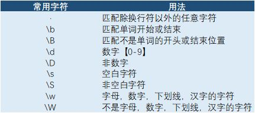

在线测试网站：https://regex101.com/

# 第一章：正则字符

## 1：常用字符

##   

 

## 2：重复次数

 

 

## 3：边界限定

 

 

对字符串进行操作

1：QQ号校验，一句句判断太麻烦

要求“5-15长度。0不能开头，只能是数字

String regex = “[1-9][0-9]{4,14}”;//第一位为1到9，第二位0到9，出现4到14次

Boolean flag = qq.matches(regex);

匹配字符

单个字符：

通配符：.匹配除了回车和换行以外的所有字符

[abcd]: 匹配方括号内的字符，里面是或的关系
[^abcd]: 匹配除了方括号里的所有字符，

​    [a-z]：匹配所有的小写字符

​    [A-Z]：匹配所有的大写字符

​    [a-zA-Z0-9]：匹配……中间没有空格 \w所有单词 \d代表所有的数字

*：匹配

+：多个·

？：

a{2,}长度:两个以上的a

\:转义符

/:就是字符斜杠

 

(?P<name>……)对group进行命名

 

Good （morning|evening|afternoon）

# 第二章：常用正则表达式

## 1、校验数字的表达式

·    数字：**^[0-9]\*$**

·    n位的数字：**^\d{n}$**

·    至少n位的数字**：****^\d{n,}$**

·    m-n位的数字：**^\d{m,n}$**

·    零和非零开头的数字：**^(0|[1-9][0-9]\*)$**

·    非零开头的最多带两位小数的数字：**^([1-9][0-9]\*)+(\.[0-9]{1,2})?$**

·    带1-2位小数的正数或负数：**^(\-)?\d+(\.\d{1,2})$**

·    正数、负数、和小数：**^(\-|\+)?\d+(\.\d+)?$**

·    有两位小数的正实数：**^[0-9]+(\.[0-9]{2})?$**

·    有1~3位小数的正实数：**^[0-9]+(\.[0-9]{1,3})?$**

·    非零的正整数：**^[1-9]\d\*$** **或** **^([1-9][0-9]\*){1,3}$** **或** **^\+?[1-9][0-9]\*$**

·    非零的负整数：**^\-[1-9][]0-9"\*$** **或** **^-[1-9]\d\*$**

·    非负整数：**^\d+$** **或** **^[1-9]\d\*|0$**

·    非正整数：**^-[1-9]\d\*|0$** **或** **^((-\d+)|(0+))$**

·    非负浮点数：**^\d+(\.\d+)?$** **或** **^[1-9]\d\*\.\d\*|0\.\d\*[1-9]\d\*|0?\.0+|0$**

·    非正浮点数：**^((-\d+(\.\d+)?)|(0+(\.0+)?))$** **或** **^(-([1-9]\d\*\.\d\*|0\.\d\*[1-9]\d\*))|0?\.0+|0$**

·    正浮点数：**^[1-9]\d\*\.\d\*|0\.\d\*[1-9]\d\*$** **或** **^(([0-9]+\.[0-9]\*[1-9][0-9]\*)|([0-9]\*[1-9][0-9]\*\.[0-9]+)|([0-9]\*[1-9][0-9]\*))$**

·    负浮点数：**^-([1-9]\d\*\.\d\*|0\.\d\*[1-9]\d\*)$** **或** **^(-(([0-9]+\.[0-9]\*[1-9][0-9]\*)|([0-9]\*[1-9][0-9]\*\.[0-9]+)|([0-9]\*[1-9][0-9]\*)))$**

·    浮点数：**^(-?\d+)(\.\d+)?$** **或** **^-?([1-9]\d\*\.\d\*|0\.\d\*[1-9]\d\*|0?\.0+|0)$**

## 2、校验字符的表达式

·    汉字：**^[\u4e00-\u9fa5]{0,}$**

·    英文和数字：**^[A-Za-z0-9]+$** **或** **^[A-Za-z0-9]{4,40}$**

·    长度为3-20的所有字符：**^.{3,20}$**

·    由26个英文字母组成的字符串：**^[A-Za-z]+$**

·    由26个大写英文字母组成的字符串：**^[A-Z]+$**

·    由26个小写英文字母组成的字符串：**^[a-z]+$**

·    由数字和26个英文字母组成的字符串：**^[A-Za-z0-9]+$**

·    由数字、26个英文字母或者下划线组成的字符串：**^\w+$** **或** **^\w{3,20}$**

·    中文、英文、数字包括下划线：**^[\u4E00-\u9FA5A-Za-z0-9_]+$**

·    中文、英文、数字但不包括下划线等符号：**^[\u4E00-\u9FA5A-Za-z0-9]+$** **或** **^[\u4E00-\u9FA5A-Za-z0-9]{2,20}$**

·    可以输入含有^%&',;=?$\"等字符：**[^%&',;=?$\x22]+**

·    禁止输入含有~的字符：**[^~\x22]+**

## 3、特殊需求表达式

·    Email地址：**^\w+([-+.]\w+)\*@\w+([-.]\w+)\*\.\w+([-.]\w+)\*$**

·    域名：**[a-zA-Z0-9][-a-zA-Z0-9]{0,62}(/.[a-zA-Z0-9][-a-zA-Z0-9]{0,62})+/.?**

·    InternetURL：**[a-zA-z]+://[^\s]\*** **或** **^http://([\w-]+\.)+[\w-]+(/[\w-./?%&=]\*)?$**

·    手机号码：**^(13[0-9]|14[5|7]|15[0|1|2|3|5|6|7|8|9]|18[0|1|2|3|5|6|7|8|9])\d{8}$**

·    电话号码("XXX-XXXXXXX"、"XXXX-XXXXXXXX"、"XXX-XXXXXXX"、"XXX-XXXXXXXX"、"XXXXXXX"和"XXXXXXXX)：**^(\(\d{3,4}-)|\d{3.4}-)?\d{7,8}$**

·    国内电话号码(0511-4405222、021-87888822)：**\d{3}-\d{8}|\d{4}-\d{7}**

·    电话号码正则表达式（支持手机号码，3-4位区号，7-8位直播号码，1－4位分机号）: **((\d{11})|^((\d{7,8})|(\d{4}|\d{3})-(\d{7,8})|(\d{4}|\d{3})-(\d{7,8})-(\d{4}|\d{3}|\d{2}|\d{1})|(\d{7,8})-(\d{4}|\d{3}|\d{2}|\d{1}))$)**

·    身份证号(15位、18位数字)，最后一位是校验位，可能为数字或字符X：**(^\d{15}$)|(^\d{18}$)|(^\d{17}(\d|X|x)$)**

·    帐号是否合法(字母开头，允许5-16字节，允许字母数字下划线)：**^[a-zA-Z][a-zA-Z0-9_]{4,15}$**

·    密码(以字母开头，长度在6~18之间，只能包含字母、数字和下划线)：**^[a-zA-Z]\w{5,17}$**

·    强密码(必须包含大小写字母和数字的组合，不能使用特殊字符，长度在 8-10 之间)：**^(?=.\*\d)(?=.\*[a-z])(?=.\*[A-Z])[a-zA-Z0-9]{8,10}$**

·    强密码(必须包含大小写字母和数字的组合，可以使用特殊字符，长度在8-10之间)：**^(?=.\*\d)(?=.\*[a-z])(?=.\*[A-Z]).{8,10}$**

·    日期格式：**^\d{4}-\d{1,2}-\d{1,2}**

·    一年的12个月(01～09和1～12)：**^(0?[1-9]|1[0-2])$**

·    一个月的31天(01～09和1～31)：**^((0?[1-9])|((1|2)[0-9])|30|31)$**

 