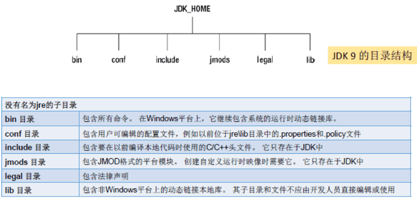
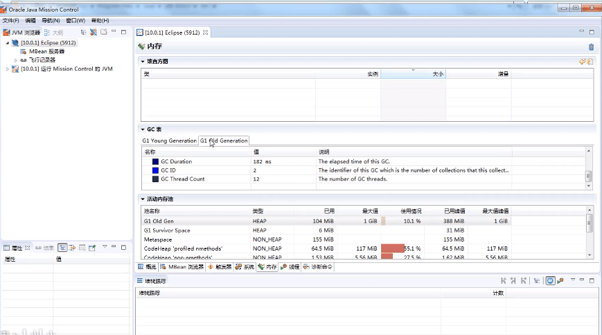

# Java9

从此以后六个月迭代一次，小步快跑，快速迭代。

官方提供的新特性列表：

https://docs.oracle.com/javase/9/whatsnew/toc.htm\#JSNEW-GUID-C23AFD78-C777-460B-8ACE-58BE5EA681F6

或参考 OpenJDK

http://openjdk.java.net/projects/jdk9/

在线 OracleJDK9Documentation

https://docs.oracle.com/javase/9/

## 1：目录结构的改变




不包含 jre 目录了

## 2：模块系统

最大变化之一引入模块系统（Jigsaw 项目）—>

运行环境的碰撞与臃肿，需要加载 rt.jar

减少内存消耗

对外暴露

## 3：REPL 工具：jShell 命令


REPL（read-evaluate-print-loop）交互式编程环境

bin 目录下 jshell.exe

配好环境变量后

cmd 输入 jshell

输出：

定义变量

定义方法：

如果定义一个已经存在的方法则直接修改原本的方法

```jshell
/edit add
```

可以直接修改 add 方法

tab 键补全

从外部文件加载源代码

/open 文件路径

受检异常

编译前异常，比如 IOExcetption

jshell 直接隐藏处理了

## 4：多版本兼容 jar 包

向后兼容

说明：root.jar 可以在Java 9中使用，不过A或B类使用的不是顶层的root.A或root.B这两个class，而是处在“META-INF/versions/9”下面的这两个。这是特别为Java 9 准备的class版本,可以运用Java 9所提供的特性和库。同时,在早期的Java诸版本中使用这个JAR也是能运行的,因为较老版本的Java只会看到顶层的A类或B类。|

## 5：接口的私有方法

接口中放啊的访问权限修饰符可以声明为 private 的了

```java
//声明私有方法
interface MyInterface{
    //jdk7:只能声明全局常量（public static final)和抽象方法(public abstract)
    void method1();
    
    //jdk8:声明静态方法和默认方法
    public static void method2{
        System.out.println("method2");
    }
    
    default void method3(){
        System.out.println("method3");
    }  
}
```

抽象类和接口的异同

1：声明的方式

2：内部结构

3：共同点

不能实例化，以多态的方式使用

4：不同点

单继承，多实现

## 6：钻石操作符的使用升级

即泛型

```java
//JDK7
Set<String> set = new HashSet<String>();
//JDK8可以进行类型推断
Set<String> set = new HashSet<>();
//JDK9中能够与匿名实现类共同使用钻石操作符
Set<String> set = new HashSet<>(){};
```

匿名实现类与钻石操作符共同使用在 8 中会报错，Java9 可以

```java
Comparator<Object> com = new Comparator<>(){
    @Override
    public int compare(0bject o1，Object o2) {
    	return 0;
    }
}
```

## 7：try 语句优化

流资源的关闭

JDK7 以前

```java
InputStreamReader reader = null;
try{
    reader = new InputStreamReader(System.in);
    //读取数据的过程
    reader.read();
}catch(IOException e){
    e.printStackTrace();
}finally{
    //资源的关闭操作
    if(reader!=null){
        try{
            reader.close();
        }catch(IOException e){
            e.printStackTrace();
        }
    }
}
```

JDK8 在 try 中声明的资源会自动关闭，不用显示处理资源的关闭，必须在资源对象实例化必须放在 try（）中

```java
try(InputStreamReader reader = new InputStreamReader(System.in)){
    reader.read();
}catch(IOException e){
    e.printStackTrace();
}
```

JDK9 支持在外部声明资源文件,此时的 reader 是 final 的，不可再被赋值。而且可以传多个，然后用；分开

```java
InputStreamReader reader = new InputStreamReader(System.in);
OutputStreamReader writer = new OutputStreamWriter(System.in);
try(reader;writer){
    reader.read();
}catch(IOException e){
    e.printStackTrace();
}
```

## 8：下划线

String \_是不允许的，是一个特殊的关键字

## API 层面

## 9：String

JDK8 以前 String 以前是 char[]存储的，每个是两个字节。

JDK9 使用 byte[]数组，并使用 encodeFlag 标记编码类型，防止中文等两个字节存储。


## 10：集合

创建只读集合，不可改变的集合

```java
//调用Collection中方法，将list变成只读的
List<String> newList = Collections.unmodifiablelist(list);
//遍历JDK8
newList.forEach(System.out::println);
```

//对只读 Map 的创建

```java
//匿名子类和泛型可以一起使用
Map<Object,Object> map = COllections.unmodifiableMap(new HashMap<>(){
    {
        put("1",1);
        put("2",2);
        put("3",3);
    }
})
 //遍历
map.forEach((k,v)->System.out.println(k + ":" + v));
```

//JDK9 中提供了更加方便的只读集合方法

```java
//创建只读list
List<Integer> list = List.of(1,2,3);
list.forEach(System.out::println);
//创建只读Set
Set<Integer> set = Set.of(2,3,4);
//创建只读Map法一
Map<String,Integer> map = Map.of("1",1,"2",2,"3",3);
//创建只读Map法二
Map<String,Integer> map = Map.ofEntries(Map.entry("1",1),Map.entry("2",2));
```

## 11：增强的 StreamAPI

JDK9 中针对 Stream 中添加了四个方法

1：takeWhile()：一直取直到满足条件就不取了，不同于 filter

```java
List<Integer> list = Arrays.asList(1,2,3,4,5,6,7,8);
Stream<Integer> stream = list.stream();
stream.takeWhile(x-x<5).forEach(System.out::println);
//此时输出为：1,2,3,4
```

2：dropWhile()：与 takeWhile 正好相反

```java
List<Integer> list = Arrays.asList(1,2,3,4,5,6,7,8);
Stream<Integer> stream = list.stream();
stream.dropWhile(x-x<5).forEach(System.out::println);
//此时输出为：5,6,7,8
```

3：ofNullable

Java8 中 Stream 不能完全为 null，否则会报空指针异常。而 Java9 中可以使用 ofNullable 方法创建一个单元素

```java
//Stream其中一种实例化方法of

Stream<Integer> stream = Stream.of(1,2,3，null);
//此时没有问题
stream.forEach(System.out::println);

//如果单元素且为null就会报空指针异常
Stream<Object> stream = Stream.of(null);

//JDK9中可以创建
Stream<String> stream = Stream.ofNullAble("Tom");
System.out.println(stream.count());//输出1
Stream<String> stream = Stream.ofNullAble(null);
System.out.println(stream.count());//输出0
```

4：iterator()的重载

Stream 的实例化方法：

通过集合的 stream()

通过数组工具类 Arrays

Stream 中静态方法 of

iterator()/gen

```java
//JDK8中
Stream.iterator(0,x->x+1).limit(10).forEach(System.out::println);
//输出0 1 2 3 4 5 6 7 8 9
//JDK9中对其进行重载，添加一个判定条件
Stream.iterate(0,x->x<10,x->x+1).forEach(System.out::println);
```

## 12：optional 的变化

可以转换成 stream

```java
Optional<List<String>> optional = Optional.ofNullable(list);

Stream<String> stream = optional.stream().flatMap(x->x.stream());
stream.forEach(System.out::println);
```

## 13：高分辨率图像 API

## 14：全新的 HTTP 客户端 API

2015 年推出 HTTP2

HTTP1.1 和 HTTP2 的主要区别在哪里？

区别在如何在客户端和服务器之间构件和传输数据

Http1 依赖于请求响应周期，Http2 允许服务器 push 数据，它可以发送比客户端请求更多的数据，这使得他可以优先处理并发送对于首先加载网页至关重要的数据

```java
//JDK9中可以使用HttpClient替换原有的HttpURLConnection
HttpClient client = HttpClient.newHttpClient();
HttpRequest req = HttpRequest.newBuilder(URL.create("http://www.baidu.com")).GET().build();
HttpResponse<String> response = null;
response = client.send(req,HttpResponse.BodyHandler.asString());
System.out.println(response.statusCode());
System.out.println(response.version.name());
System.out.println(response.body());
```

## 15：Deprecated 的 API

抛弃了几个不常用的 API，主要是 Applet API

## 16：智能 Java 编译工具

sjavac 慢慢代替 javac

## 17：统一的 JVM 日志系统

G1 作为了默认垃圾回收器

# Java10

## 1：局部变量类型推断

var ：JDK10 中提供的保留类型

只针对局部变量

var 是保留类型不是关键字，意味着我们还可以用 var 来定义变量名和方法名

```java
public static void main(String[] args){
    var i =10;
    var str = "abc";
    var list = new ArrayList<>();
    list.add("test");

    var set = new HashSet<>();

    var user = new User();
}
```

注意：不允许赋值为 null

```java
var aa = null;//错误
```

## 2：垃圾收集器的优化

Java9 的改变

新生代：ParNew

老年代：Paraller Old

JDK10：G1（Grabage -First）收集器：全收集器，既可以收集新生代又可以收集老年代。

分析工具



## 3：新增的 API 功能

### 3.1：copyOf()方法

在 List，Set 和 Map 下新增了 copyOf 方法

拷贝后的集合不可修改

且是根据其迭代顺序拷贝的

### 3.2：Java.io.ByteArrayOutStream::toString(Charset)

对 toString 进行重载，可以指定编码，默认使用 UTF-8

```java
String str = "中文测试";
//将str以GBK编码转换成Byte转换成流
ByteArrayInputStream bis = new ByteArrayInputStream(str.getByte("GBK"));

ByteArrayOutStream bos = new ByteArrayOutStream();

int c =0;
while((c=bis.read())!=-1){
    bos.write(c);
}
System.out.println(bos.toString());
System.out.println(bos.toString("GBK"));
```

### 3.3：PrintStream 和 PrintWrite 新增构造方法

```java
public static void main(String[] args){
    String str = "我是中国人";
    var p = new PrintWriter("d:/aa.txt","gbk");
    p.println(str);
    p.flush();
    p.close();
}
```

### 3.4：Reader::transferTo

### 3.5：Scanner 和 Formatter 新增构造方法

# Java11

## Flight Recoder飞机黑盒子

Flight Recorder以前是商业版的特性，在java11当中开源出来，它可以导出事件到文件中，之后可以用Java Mission Control来分析。可以在应用启动时配置java -XX:StartFlightRecording，或者在应用启动之后，使用jcmd来录制；

JFR 的性能开销最大不超过 1%，所以，工程师可以基本没有心理负担地在大规模分布式的生产系统使用，

```shell
$ jcmd <pid> JFR.start

$ jcmd <pid> JFR.dump filename=recording.jfr

$ jcmd <pid> JFR.stop
```

长期支持的版本

## 1：新增字符串处理方法


## 2：全新 HTTP 客户端 API

## 3：Epsilon 垃圾收集器

开发一个处理内存分配但不实现任何实际内存回收的机制的 GC

## 3：全新垃圾收集器 ZGC

可伸缩的，低延迟的！！初始只支持 64 位，支持 TB 级的，

热对象置于 DRAM

冷对象置于 NVMe 闪存

ZGC 是一个并发，基于 region，压缩型的垃圾收集器，只有 root 扫描阶段会 STW（所有线程暂停），因此 GC 停顿时间不会随着堆的增长和存活对象的增长而变长。

用法：-XX：+UnlockExperimentalVMOptions -XX:+UseZGC

在 Window 中暂时没有提供

由 oracle 开发，承诺在数 TB 的堆上具有非常低的暂停时间，多层堆（即热对象置于 DRAM 和冷对象置于 NVMe 闪存），压缩堆

SWT 阶段：应用程序线程被暂停，以便 gc 执行其工作。当应用程序因为 GC 暂停时，这通常是由于 Stop The World 阶段。

ZGC 给 Hotspot Garbage Collectors 增加了两种新技术：着色指针和读屏障。

### 着色指针

着色指针是一种将信息存储在指针（或使用 Java 术语引用）中的技术。因为在 64 位平台上（ZGC 仅支持 64 位平台），指针可以处理更多的内存，因此可以使用一些位来存储状态。
ZGC 将限制最大支持 4Tb 堆（42-bits），那么会剩下 22 位可用，它目前使用了 4 位：
finalizable， remap， mark0 和 mark1。

着色指针的一个问题是，当您需要取消着色时，它需要额外的工作（因为需要屏蔽信息位）。

### 多重映射

### 读屏障

读屏障是每当应用程序线程从堆加载引用时运行的代码片段（即访问对象上的非原生字段 non-primitive field）：
