# 一：基础语法

## 1：基本概念

标识符：

标识符可以包含英文字母26个(区分大小写) 、0-9数字 、$（美元符号） 和_（下划线） 。
标识符不能以数字开头。
标识符不能是关键字。


### 1.1：关键字

类与接口的声明：class（类）,extends（继承）,implements（实现）,interface

流程控制：if.else,switch,do,while,case,break,continue,return,default,for

异常处理：try,catch,finally,throw,throws,


- #### final

类：不能被继承，方法：不能被重写，变量：不能被改变

- #### static

“static”关键字表明一个成员变量或者是成员方法可以在没有所属的类的实例变量的情况下被访问。

Java中**static方法不能被覆盖**，因为方法覆盖是基于运行时动态绑定的，而static方法是编译时静态绑定的。static方法跟类的任何实例都不相关，所以概念上不适用。

- #### synchronized

Synchronized：保证在同一时刻，只有一个线程可以执行某个方法或某个代码块

同时synchronized可以保证一个线程的变化可见（可见性），即可以代替volatile。

可以修饰代码块，方法，静态方法，类

- #### volatile

保证可见性，有序性（指令重排），保证单次读写的原子性
保证了不同线程对这个变量进行操作时的可见性，即一个线程修改了某个变量的值，这新值对其他线程来说是立即可见的。（实现可见性）

禁止进行指令重排序。（实现有序性）

volatile 只能保证对单次读/写的原子性。i++ 这种操作不能保证原子性。


**synchronized 和 volatile 的区别是什么？**

- volatile 是变量修饰符；synchronized 是修饰类、方法、代码段。


- volatile 仅能实现变量的修改可见性，不能保证原子性；而 synchronized则可以保证变量的修改可见性和原子性。


- volatile 不会造成线程的阻塞；synchronized 可能会造成线程的阻塞。


**String、StringBuffer、StringBuilder**

5.1

String s=new String("abc") 创建了几个对象?

“abc” 创建一个对象new String（） 创建一个对象。

5.2

String被final修饰，声明不可改变的对象每次操作都会生成新的 String
对象，然后将指针指向新的 String 对象，修改用StringBuffer.append(“fkf”);方法

StringBuffer是线程安全的，

StringBuilder是不安全的，但是其性能却高于StringBuffer，单线程使用StringBuilder，多线程用StringBuffer

5.3

String类为什么是final类型

为了实现字符串池(只有当字符是不可变的，字符串池才有可能实现)

为了线程安全(字符串自己便是线程安全的)

为了实现String可以创建HashCode不可变性(Map的key一般String用的最多原因就是这个)

5.4

indexOf()：返回指定字符的索引。

charAt()：返回指定索引处的字符。

replace()：字符串替换。

trim()：去除字符串两端空白。

split()：分割字符串，返回一个分割后的字符串数组。

getBytes()：返回字符串的 byte 类型数组。

length()：返回字符串长度。

toLowerCase()：将字符串转成小写字母。

toUpperCase()：将字符串转成大写字符。

substring()：截取字符串。

equals()：字符串比较。

stringBuffer. reverse()字符串反转

- #### Serilizable和transient

一个对象只要实现了Serilizable接口，这个对象就可以被序列化，实际开发中有些敏感信息（密码，银行卡）字段的生命周期仅存在于调用者的内存而不会写到磁盘里序列化，不需要在网络传输，加上transient即可

Instanceof：用来指出对象是否是特定类或接口或该类子类的一个实例


- #### this与super

  super ：代表父类的存储空间标识(可以理解为父亲的引用)。
  this ：代表当前对象的引用(谁调用就代表谁)。


### 1.2：变量

局部变量与成员变量

定义的位置不同：局部变量定义在方法内部，成员变量定义在方法外部，直接写在类中

作用范围不一样：局部变量只有方法中才能用，成员变量都可以用

默认值不一样：局部变量没有默认值，如果想要使用，必须手动进行赋值，成员变量会有默认值，规则与数组相同

内存的位置不一样：局部变量位于栈内存，成员变量位于堆内存

生命周期不一样：局部变量随着方法进栈而诞生，方法出栈而消失。成员变量随对象创建而诞生

注：当局部变量与成员变量冲突时，根据就近原则，优先使用局部变量


### 1.3：访问控制

类中的数据成员和成员函数据具有的访问权限包括：public、private、protect、default（包访问权限）


public 所有类可见

protected
本包和所有子类都可见（本包中的子类非子类均可访问，不同包中的子类可以访问，不是子类不能访问）

default
本包可见（即默认的形式）（本包中的子类非子类均可访问，不同包中的类及子类均不能访问）

priavte 本类可见

**在非本包子类，通过父类的对象实例只能访问父类的public成员,不能访问protected成员。**


## 2：数据类型

**1）八种基本数据类型**


数据范围与字节数不一定相关，float数据范围比long更加广泛，但是float是4字节，long是8字节。

**注:double型比float型存储范围更大，精度更高，所以通常的浮点型的数据在不声明的情况下都是double型的。**

**2）引用类型**

引用数据类型传递的是内存的使用权，是一块内存空间，它可以由多个单位同时使用。

String：字符串型，用于存储一串字符


**3）数据类型转换：**

自动转换：将取值范围小的类型自动提升为取值范围大的类型 。

```java
byte、short、char‐‐>int‐‐>long‐‐>float‐‐>double
```

强制转换

浮点转成整数，直接取消小数点，可能造成数据损失精度。
int 强制转成short 砍掉2个字节，可能造成数据丢失。


Long转成Integer：

```java
LongNum.inValue();
```


4）**包装类**

基本类型与引用类型，使用基本类型在于效率，然而很多情况，会创建对象使用，因为对象可以做更多的功能，如果想要我们的基本类型像对象一样操作，就可以使用基本类型对应的包装类


| 基本类型 | 对应的包装类（位于java.lang包中） |
| -------- | --------------------------------- |
| byte     | Byte                              |
| short    | Short                             |
| int      | **Integer**                       |
| long     | Long                              |
| float    | Float                             |
| double   | Double                            |
| char     | **Character**                     |
| boolean  | Boolean                           |

* **装箱**：从基本类型转换为对应的包装类对象。

* **拆箱**：从包装类对象转换为对应的基本类型。

除了Character类之外，其他所有包装类都具有parseXxx静态方法可以将字符串参数转换为对应的基本类型：

- `public static byte parseByte(String s)`：将字符串参数转换为对应的byte基本类型。
- `public static short parseShort(String s)`：将字符串参数转换为对应的short基本类型。
- `public static int parseInt(String s)`：将字符串参数转换为对应的int基本类型。
- `public static long parseLong(String s)`：将字符串参数转换为对应的long基本类型。
- `public static float parseFloat(String s)`：将字符串参数转换为对应的float基本类型。
- `public static double parseDouble(String s)`：将字符串参数转换为对应的double基本类型。
- `public static boolean parseBoolean(String s)`：将字符串参数转换为对应的boolean基本类型。

### 2.3：==与equals

==比较的是地址

equals比较的是字符串，如果不重写比较的也是地址。

## 3：流程控制

if……else

switch……case……break

for

do……while

## 3：重载与重写

重载：指在同一个类中，允许存在一个以上的同名方法，只要它们的参数列表不同即可，与修饰符和返回值类型无关。

重载只是指参数不同，返回类型不同参数相同会报错，重复定义

## 4：面向对象

封装，继承，多台

### 4.1：封装

封装就是将一些细节信息隐藏起来，对于外界不可见

方法就是一种封装，关键字Private也是一种封装

### 4.2：继承

如果子类父类中出现重名的成员变量

Java中的向上转型与向下转型

1 ： 向上转型：大体可以理解为子类转换成父类，例子优先还是：

```java
1 public class Animal {
 2     public void eat(){
 3         System.out.println("animal eatting...");
 4     }
 5 }
 7 public class Cat extends Animal{
 9     public void eat(){
11         System.out.println("我吃鱼");
12     }
13 }
15 public class Dog extends Animal{
17     public void eat(){
19         System.out.println("我吃骨头");
20     }
22     public void run(){
23         System.out.println("我会跑");
24     }
25 }
27 public class Main {
29     public static void main(String[] args) {
31         Animal animal = new Cat(); //向上转型
32         animal.eat();
34         animal = new Dog();
35         animal.eat();
36     }
38 }
39 
40 //结果:
41 //我吃鱼
42 //我吃骨头
```

(1):虽然将子类转换成父类，但调用方法是调用的是子类的方法，这里的转型只是父类的引用指向了子类的实例。

(2):如果子类还有父类中没有的方法 w 可以调用吗 ？答案当然是不能，子类转换成父类，子类多余的方法会丢失，就像例子中dog的run（）方法会丢失

(3)为什么要用向上转型：父类是接口啊！接口的好处就不用说了，比如当你对所有动物全部放生，就不用一个个放生，可以 Save（Animal）；就OK

2：向下转型：简单来说就是将父类转换为子类，但是转换可就不像向上转那末好转了！理解起来也比向上转型不好理解

(1)：首先注意：向下转型的前提是父类对象指向的是子类对象，就是你必须先向上转然后才能向下转，可能会有人说转上去再转下来，没有意义啊！作用就是当再次转下来的时候，就可以调用向上转丢失的方法，而且编程以后接口一多会有很多泛型编程，这样就可以针对父类进行编程，如果需要再取用子类的方法。

（2）：强制类型转换：将一个子类的引用赋值给超类，编译器是允许的，但将一个超类引用赋给一个子类变量必须进行强制类型转换

```java
public class Sys{   
    public static void main(String[] args) {   
        Animal a=new Dog(); //向上转型  
        a.eat();  
          
        Dog aa=(Dog)a; //向下转型,编译和运行皆不会出错(正确的)  
        aa.eat();//向下转型时调用的是子类的  
        aa.run(); 
            
        Animal a2=new Animal();  
        Dog aa2=(Dog) a2; //-不安全的---向下转型,编译无错但会运行会出错  
        aa2.eat();  
        aa2.run();   
    }  
} 
//结果为：
//我吃骨头
//我吃骨头
//我会跑
//报错······
```

​     结果表明：只有先经过向上转型的才能进行向下转型，向下转型必须要进行强制类型转换，

（3）：另外要注意两点，

第一：如果Cat向上转成Animal，那末向下转Animal只能转成Cat，不能转成Dog，因为Cat怎么也不会变成Dog

第二：为了安全的类型转换，向下转型时最好先  if ( Dog instanceof Animal) 判断一下，否则一旦无法转换，程序就会直接终止


Java为什么只能单继承？

多继承的菱形继承问题


### 4.3：多态

是指同一行为，具有多个不同表现形式。

### 4.4：内部类

```java
//定义
class Car { //外部类
    class Engine { //内部类
    }
}
//使用
外部类名.内部类名 对象名 = new 外部类型().new 内部类型()；
```

### 4.4：匿名内部类

```java
FlyAble f = new FlyAble(){
    public void fly() {
    	System.out.println("我飞了~~~");
    }
};
```


## 5：抽象与接口

接口的内部主要就是封装了方法，包含抽象方法（JDK 7及以前），默认方法和静态方法（JDK 8），私有方法（JDK 9）。

抽象方法：使用abstract 关键字修饰，可以省略，没有方法体。该方法供子类实现使用。

默认方法：使用 default 修饰，不可省略，供子类调用或者子类重写。
静态方法：使用 static 修饰，供接口直接调用。

私有方法：使用 private 修饰，供接口中的默认方法或者静态方法调用。

优先级：

继承>实现

当一个类，既继承一个父类，又实现若干个接口时，父类中的成员方法与接口中的默认方法重名，子类就近选择执
行父类的成员方法。


实现接口的关键字为implements，继承抽象类的关键字为extends

一个类可以实现多个接口，只能继承一个抽象类

接口中所有的方法隐含的都是抽象的。而抽象类则可以同时包含抽象和非抽象的方法。

类可以不实现抽象类和接口声明的所有方法，当然，在这种情况下，类也必须得声明成是抽象的。  
抽象类可以在不提供接口方法实现的情况下实现接口。  
Java接口中声明的变量默认都是final的。抽象类可以包含非final的变量。  
Java接口中的成员函数默认是public的。抽象类的成员函数可以是private，protected或者是public。


## 5：方法

### 5.1：构造方法

### 5.2：可变参数方法

在**JDK1.5**之后，如果我们定义一个方法需要接受多个参数，并且多个参数类型一致，我们可以对其简化成如下格式：

```
修饰符 返回值类型 方法名(参数类型... 形参名){  }
```

其实这个书写完全等价与

```
修饰符 返回值类型 方法名(参数类型[] 形参名){  }
```

只是后面这种定义，在调用时必须传递数组，而前者可以直接传递数据即可。

```java
    int sum2 = getSum(6, 7, 2, 12, 2121);
	//可变参数写法
    public static int getSum(int... arr) {
        int sum = 0;
        for (int a : arr) {
            sum += a;
        }
        return sum;
    }
```

### 5.3：抽象方法及重写


## 面试题

1：跨平台原理

# 二：常用API

## 1：数组

```java
int[] arr = new int[3];
int[] arr = new int[]{1,2,3,4,5};
int[] arr = {1,2,3,4,5};
```

### Arrays类

来操作数组的各种方法，比如排序和搜索等。其所有方法均为静态方法，调用起来非常简单。

// 定义int 数组

int[] arr = {2,34,35,4,657,8,69,9};

// 打印数组,输出地址值

System.out.println(arr); // [I\@2ac1fdc4

```java
// 数组内容转为字符串
String s = Arrays.toString(arr);
public static String toString(int[] a) ：返回指定数组内容的字符串表示形式。
   public static void sort(int[] a) ：对指定的 int 型数组按数字升序进行排序。
    
```

### Vector类

实现类似动态数组的功能

创建了一个向量类的对象后，可以往其中随意地插入不同的类的对象，既不需顾及类型也不需预先选定向量的容量，并可方便地进行查找。

对于预先不知或不愿预先定义数组大小，并需频繁进行查找、插入和删除工作的情况，可以考虑使用向量类。

构造

　　public vector()
　　public vector(int initialcapacity,int capacityIncrement)
　　public vector(int initialcapacity)

就算设定了容量，当真正存放的数据个数超过容量时，系统也会扩充向量对象。

方法

插入

- public final synchronized void addElement(Object obj)
- public final synchronized void setElementAt(object obj,int index)
- public final synchronized void insertElementAt(Object obj,int index)

删除

- public final synchronized void removeElement(Object obj)
- public final synchronized void removeAllElement()
- public final synchronized void removeElementlAt(int index)

查询搜索


## 2：Object类

Java语言中的根类，即所有类的父类。它中描述的所有方法子类都可以使用。在对象实例化的时候，最终找的父类就是Object。

* `public String toString()`：返回该对象的字符串表示。
* `public boolean equals(Object obj)`：指示其他某个对象是否与此对象“相等”。

这里的“相同”有默认和自定义两种方式。

默认地址比较

如果没有覆盖重写equals方法，那么Object类中默认进行`==`运算符的对象地址比较，只要不是同一个对象，结果必然为false。

对象内容比较

如果希望进行对象的内容比较，即所有或指定的部分成员变量相同就判定两个对象相同，则可以覆盖重写equals方法。

### 1：Scanner类

```java
Scanner sc = new Scanner(System.in);

int b = sc.nextInt();
```


### 2：Random类

Random r = new Random();

int i = r.nextInt();

### 


### **3：ArrayList类**

大小可变的数组的实现，

ArrayList对象不能存储基本类型，只能存储引用类型的数据。

ArrayList\<String\> list = new ArrayList\<\>();

public boolean add(E e) ：将指定的元素添加到此集合的尾部。

public E remove(int index) ：移除此集合中指定位置上的元素。返回被删除的元素。

public E get(int index) ：返回此集合中指定位置上的元素。返回获取的元素。

public int size()
：返回此集合中的元素数。遍历集合时，可以控制索引范围，防止越界。

### 4：String类

1：查看构造方法

```java
//构造
public String() ：初始化新创建的 String对象，以使其表示空字符序列。
public String(char[] value) ：通过当前参数中的字符数组来构造新的String。
public String(byte[] bytes) ：通过使用平台的默认字符集解码当前参数中的字节数组来构造新的
```

2：判断功能的方法

```java
public boolean equals (Object anObject) ：将此字符串与指定对象进行比较。

public boolean equalsIgnoreCase (String anotherString)：将此字符串与指定对象进行比较，忽略大小写。获取功能的方法

public int length () ：返回此字符串的长度。

public String concat (String str) ：将指定的字符串连接到该字符串的末尾。

public char charAt (int index) ：返回指定索引处的 char值。

public int indexOf (String str) ：返回指定子字符串第一次出现在该字符串内的索引。

public String substring (int beginIndex)：返回一个子字符串，从beginIndex开始截取字符串到字符串结尾。

public String substring (int beginIndex, int endIndex)：返回一个子字符串，从beginIndex到endIndex截取字符串。含beginIndex，不含endIndex。转换功能的方法
public char[] toCharArray () ：将此字符串转换为新的字符数组。

public byte[] getBytes () ：使用平台的默认字符集将该String编码转换为新的字节数组。

public String replace (CharSequence target, CharSequence replacement)：将与target匹配的字符串使用replacement字符串替换。分割功能的方法

public String[] split(String regex)：将此字符串按照给定的regex（规则）拆分为字符串数组
```


**1：String类为什么是不可变的final类型？**

- 为了实现字符串池(只有当字符是不可变的，字符串池才有可能实现）

如果字符串可变的话，**当两个引用指向指向同一个字符串时，对其中一个做修改就会影响另外一个。**

- 为了线程安全(字符串自己便是线程安全的)


- 为了保证String的HashCode永远保持一致，每次使用时不用重复计算

(Map的key一般String用的最多原因就是这个)，故不能被继承


**2：String s=new String("abc") 创建了几个对象?**

“abc” 创建一个字符对象

new String（） 创建一个引用对象。

String s , 这个语句声明一个类String的引用变量 s

### 5：StringBuilder与StringBuffer

StringBuild线程不安全，StringBuffer线程安全

构造

- `public StringBuilder()`：构造一个空的StringBuilder容器。
- `public StringBuilder(String str)`：构造一个StringBuilder容器，并将字符串添加进去。

方法

- `public StringBuilder append(...)`：添加任意类型数据的字符串形式，并返回当前对象自身。
- `public String toString()`：将当前StringBuilder对象转换为String对象。


### 6：Math类


```java
public static double abs(double a) ：返回 double 值的绝对值。

public static double ceil(double a) ：返回大于等于参数的最小的整数。

public static double floor(double a) ：返回小于等于参数最大的整数。

public static long round(double a) ：返回最接近参数的 long。(相当于四舍五入方法)
```


### 8：Date类

构造

```java
        // 创建日期对象，把当前的时间
        System.out.println(new Date()); // Tue Jan 16 14:37:35 CST 2018
        // 创建日期对象，把当前的毫秒值转成日期对象
        System.out.println(new Date(0L)); // Thu Jan 01 08:00:00 CST 1970
```


\* \`public long getTime()\` 把日期对象转换成对应的时间毫秒值。

DateFormat format = new SimpleDateFormat("yyyy-MM-dd HH:mm:ss");

\- \`public String format(Date date)\`：将Date对象格式化为字符串。

\- \`public Date parse(String source)\`：将字符串解析为Date对象。

String str = df.format(date);


### 9：DateFormat类

`java.text.DateFormat` 是日期/时间格式化子类的抽象类，我们通过这个类可以帮我们完成日期和文本之间的转换,也就是可以在Date对象与String对象之间进行来回转换。

* **格式化**：按照指定的格式，从Date对象转换为String对象。
* **解析**：按照指定的格式，从String对象转换为Date对象。

构造

```java
        // 对应的日期格式如：2018-01-16 15:06:38
        DateFormat format = new SimpleDateFormat("yyyy-MM-dd HH:mm:ss");
```


常用的格式规则为：

| 标识字母（区分大小写） | 含义 |
| ---------------------- | ---- |
| y                      | 年   |
| M                      | 月   |
| d                      | 日   |
| H                      | 时   |
| m                      | 分   |
| s                      | 秒   |

方法：

- `public String format(Date date)`：将Date对象格式化为字符串。

```java
        Date date = new Date();
        // 创建日期格式化对象,在获取格式化对象时可以指定风格
        DateFormat df = new SimpleDateFormat("yyyy年MM月dd日");
        String str = df.format(date);
        System.out.println(str); // 2008年1月23日
```

- `public Date parse(String source)`：将字符串解析为Date对象。

```java
        DateFormat df = new SimpleDateFormat("yyyy年MM月dd日");
        String str = "2018年12月11日";
        Date date = df.parse(str);
        System.out.println(date); // Tue Dec 11 00:00:00 CST 2018
```


### 9：Calendar类

构造

`public static Calendar getInstance()`：使用默认时区和语言环境获得一个日历

```java
Calendar cal = Calender.getInstance();
```

方法：

- `public int get(int field)`：返回给定日历字段的值。

- `public void set(int field, int value)`：将给定的日历字段设置为给定值。

- `public abstract void add(int field, int amount)`：根据日历的规则，为给定的日历字段添加或减去指定的时间量。

- `public Date getTime()`：返回一个表示此Calendar时间值（从历元到现在的毫秒偏移量）的Date对象。

  Calendar类中提供很多成员常量，代表给定的日历字段：

  | 字段值       | 含义                                  |
  | ------------ | ------------------------------------- |
  | YEAR         | 年                                    |
  | MONTH        | 月（从0开始，可以+1使用）             |
  | DAY_OF_MONTH | 月中的天（几号）                      |
  | HOUR         | 时（12小时制）                        |
  | HOUR_OF_DAY  | 时（24小时制）                        |
  | MINUTE       | 分                                    |
  | SECOND       | 秒                                    |
  | DAY_OF_WEEK  | 周中的天（周几，周日为1，可以-1使用） |

```java
  // 创建Calendar对象
        Calendar cal = Calendar.getInstance();
        // 设置年 
        int year = cal.get(Calendar.YEAR);
        // 设置月
        int month = cal.get(Calendar.MONTH) + 1;
        // 设置日
        int dayOfMonth = cal.get(Calendar.DAY_OF_MONTH);
// 使用add方法
        cal.add(Calendar.DAY_OF_MONTH, 2); // 加2天
        cal.add(Calendar.YEAR, -3); // 减3年

```


### 10：System类

方法

- `public static long currentTimeMillis()`：返回以毫秒为单位的当前时间。

获取当前系统时间与1970年01月01日00:00点之间的毫秒差值

```java
//获取当前时间毫秒值
System.out.println(System.currentTimeMillis(); 
```


- `public static void arraycopy(Object src, int srcPos, Object dest, int destPos, int length)`：将数组中指定的数据拷贝到另一个数组中。

System.arraycopy方法具有5个参数，含义分别为：

| 参数序号 | 参数名称 | 参数类型 | 参数含义             |
| -------- | -------- | -------- | -------------------- |
| 1        | src      | Object   | 源数组               |
| 2        | srcPos   | int      | 源数组索引起始位置   |
| 3        | dest     | Object   | 目标数组             |
| 4        | destPos  | int      | 目标数组索引起始位置 |
| 5        | length   | int      | 复制元素个数         |


2：equals（）和==

Equals方法用来比较对象时，若没有对equals进行重写，其都是调用的Object类的equals方法，而Object方法中的equals方法返回的却是==判断

1、基本数据类型比较  
==和Equals都比较两个值是否相等。相等为true 否则为false；  
2、引用对象比较  
==和Equals都是比较栈内存中的地址是否相等 。相等为true 否则为false；  
需注意几点：  
1、string是一个特殊的引用类型。对于两个字符串的比较，不管是 == 和 Equals 这两者
比较的都是字符串是否相同；

3：HashCode的作用：

返回对象的哈希代码值（就是散列码），用来支持哈希表，例如：HashMap

如果两对象equals()是true,那么它们的hashCode()值一定相等

如果两对象的hashCode()值相等，它们的equals不一定相等（hash冲突啦）


3：基本数据类型与自动拆箱

### 11： Comparable接口和Comparator接口

Comparable接口只包含compareTo()方法

Comparator接口包含compare（Object ，Object ）方法和equals（）方法

* ` public int compare(Object o1, Object o2)`：比较其两个参数的顺序。

  > 两个对象比较的结果有三种：大于，等于，小于。
  >
  > 如果要按照升序排序，
  > 则o1 小于o2，返回（负数），相等返回0，01大于02返回（正数）
  > 如果要按照降序排序
  > 则o1 小于o2，返回（正数），相等返回0，01大于02返回（负数）


compareTo方法被称为它的自然比较方法。

实现此接口的对象列表（和数组）可以通过Collections.sort（Arrays.sort）进行自动排序。实现此接口的对象可以用作有序映射中的键or有序集合中的元素，无需指定比较器。

Comparator强行对某个对象collection进行整体排序的比较函数。可以将Comparator传递给sort方法（如Collections.sort
或者
Arrays.sort），从而允许在排序上实现精准控制。还可以使用Comparator来控制某些数据结构（如有序set或有序映射）的顺序，or为那些没有自然顺序的对象Collection提供排序。

Comparable是排序接口：

若一个类实现了Comnparable接口，就意味着“该类支持排序”，既然实现了Comparable接口的类支持排序，

假设现在存在“实现Comparable接口类的对象的List列表（or数组）”，则该List列表（or数组）可以通过Collection.sort（or
Arrays.sort）进行排序。

此外，“实现Comparable接口的类的对象”可以用作“有序映射（TreeMap）”中的键或“有序集合（TreeSet）”中的元素，而不需要指定比较器。

Comparator也可以看成一种排序算法的实现，将算法和数据分离。

应用场景：

1
开始设计类的时候，没有考虑到比较问题而没有实现Comparable，可以通过Comparator来实现排序而不必改变对象本身。

2
可以使用多种排序标准，比如员工按照员工号，年龄，名字，升序or降序排序等，并调用（如Collections.sort
或者 Arrays.sort）方法，对Collection进行排序

```java
// 自然排序按照员工号的顺序
public int compareTo(Employee obj) {
	Employee employee = (Employee) obj;
	return this.no - employee.no;
}

/*

*

* 按照员工的年龄进行比较的比较器。

*/

public class AgeComparator implements Comparator<Employee> {
@Override
public int compare(Employee o1, Employee o2) {
	return o1.getAge()-o2.getAge();
}
}
```

Comparable是【】排序接口，若一个类实现了Coparable接口，说明该类支持排序此外，“实现Comparable接口的类的对象”可以用作“有序映射(如TreeMap)”中的键或“有序集合(TreeSet)”中的元素，而不需要指定比较器。

接口中通过x.compareTo(y)来比较x和y的大小。若返回负数，意味着x比y小；返回零，意味着x等于y；返回正数，意味着x大于y。

5：Java 中的 Math. round(-1. 5) 等于多少？

等于 -1，因为在数轴上取值时，中间值（0.5）向右取整，所以正 0.5 是往上取整，负
0.5 是直接舍弃。

6：String的常用方法：

7：数组与List的转换

List.toArray(); Arrays.asList(array);

8：重构与重载

重载：方法重载是让类以统一的方法处理不同类型的数据的一种手段

重构即重写：子类重写父类的方法

# 三：集合

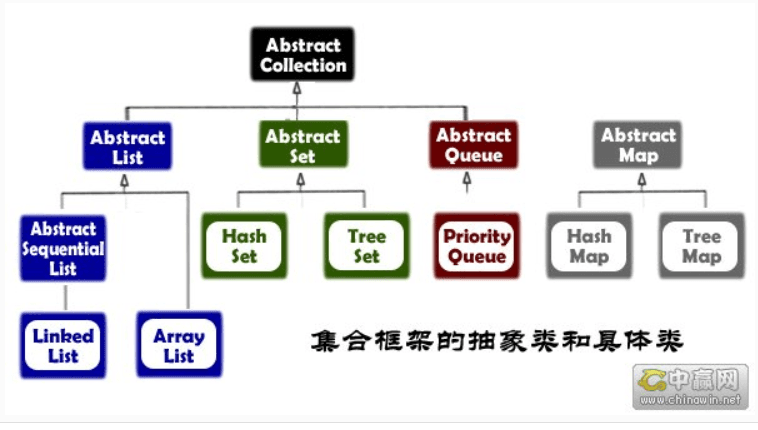

Vector、Hashtable、Stack 都是线程安全的，而像 HashMap 则是非线程安全的


Java. util. concurrent 并发包的出现，ConcurrentHashMap安全了

## 3.0：Collection

Collection是集合类的上级接口，继承于他的接口主要有Set 和List.，Map并不是Collection是针对集合类的一个帮助类，他提供一系列静态方法实现对各种集合的搜索、排序、线程安全化等操作

方法

* `public boolean add(E e)`：  把给定的对象添加到当前集合中 。
* `public void clear()` :清空集合中所有的元素。
* `public boolean remove(E e)`: 把给定的对象在当前集合中删除。
* `public boolean contains(E e)`: 判断当前集合中是否包含给定的对象。
* `public boolean isEmpty()`: 判断当前集合是否为空。
* `public int size()`: 返回集合中元素的个数。
* `public Object[] toArray()`: 把集合中的元素，存储到数组中。


## 3.1：Collections

是集合工具类，用来对集合进行操作

方法

- `public static <T> boolean addAll(Collection<T> c, T... elements)  `:往集合中添加一些元素。
- `public static void shuffle(List<?> list) 打乱顺序`:打乱集合顺序。
- `public static <T> void sort(List<T> list)`:将集合中元素按照默认规则排序。
- `public static <T> void sort(List<T> list，Comparator<? super T> )`:将集合中元素按照指定规则排序。

例

```java
        ArrayList<Integer> list = new ArrayList<Integer>();
        //原来写法
        //list.add(12);
        //list.add(14);
        //list.add(15);
        //list.add(1000);
        //采用工具类 完成 往集合中添加元素  
        Collections.addAll(list, 5, 222, 1，2);
        System.out.println(list);
        //排序方法 
        Collections.sort(list);
        System.out.println(list);

```


## 3.2：Iterator迭代器

Iterator（迭代器）是一个接口，它的作用就是遍历容器的所有元素。  

构造

```java
Iterator iter = list.iterator(); // 注意iterator，首字母小写
```

方法

* `public E next()`:返回迭代的下一个元素。
* `public boolean hasNext()`:判断 iterator内是否存在下1个元素，如果存在，返回true，否则返回false。（注意，这时上面的那个指针位置不变）
* `void remove()`删除 iterator 内指针的前1个元素，前提是至少执行过1次next();(这个方法不建议使用，建议使用容器本身的romove 方法)

例

```java
        //遍历
        //使用迭代器 遍历   每个集合对象都有自己的迭代器
        Iterator<String> it = coll.iterator();
        //  泛型指的是 迭代出 元素的数据类型
        while(it.hasNext()){ //判断是否有迭代元素
            String s = it.next();//获取迭代出的元素
            System.out.println(s);
        }
```


## 3.3：List接口

List是元素有序并且可以重复的集合，被称为序列

List可以精确的控制每个元素的插入位置，或删除某个位置元素

方法

- `public void add(int index, E element)`: 将指定的元素，添加到该集合中的指定位置上。
- `public E get(int index)`:返回集合中指定位置的元素。
- `public E remove(int index)`: 移除列表中指定位置的元素, 返回的是被移除的元素。
- `public E set(int index, E element)`:用指定元素替换集合中指定位置的元素,返回值的更新前的元素。

### ArrayList

JDK1.7 ：ArrayList像饿汉式，直接创建一个初始容量为10的数组

JDK1.8：ArrayList像懒汉式，一开始创建个长度为0的数组，当添加第一个元素时再创建一个始容量10的数组


动态数组，

1、ArrayList创建时的大小为0；当加入第一个元素时，进行第一次扩容时，默认容量大小为10。

2、ArrayList每次扩容都以当前数组大小的1.5倍去扩容。

3、Vector创建时的默认大小为10。

4、Vector每次扩容都以当前数组大小的2倍去扩容。当指定了capacityIncrement之后，每次扩容仅在原先基础上增加capacityIncrement个单位空间。

5、ArrayList和Vector的add、get、size方法的复杂度都为O(1)，remove方法的复杂度为O(n)。

6、ArrayList是非线程安全的，Vector是线程安全的。

1：array与ArrayList的区别

Array可以包含基本类型和对象类型，ArrayList只能包含对象类型。

1：ArrayList，Vector，linkedList的区别

ArrayList和Vector都是使用数组方式存储数据，此数组元素数大于实际存储的数据以便增加和插入元素，它们都允许直接按序号索引元素，但是插入元素要涉及数组元素移动等内存操作，所以索引数据快而插入数据慢，

Vector由于使用了synchronized方法（线程安全），通常性能上较ArrayList差，

LinkedList使用双向链表实现存储，按序号索引数据需要进行前向或后向遍历，但是插入数据时只需要记录本项的前后项即可，所以插入速度较快。

ArrayList是基于数组实现的，要求一段连续的空间

LinkedList是基于链表实现的，是一个双向循环列表。不是线程安全的。

### LinkedList

双向链表，允许插入null，线程不同步

Vector

加：

## 3.4：Set接口及其实现类

集合Set是Collection的子接口，Set不允许其数据元素重复出现，也就是说在Set中每一个数据元素都是唯一的。

虽然集合号称存储的是 Java 对象，但实际上并不会真正将 Java 对象放入 Set集合中，只是在 Set 集合中保留这些对象的引用而言。也就是说：Java集合实际上是多个引用变量所组成的集合，这些引用变量指向实际的 Java 对象。

### HashSet（常用）

基本上都是直接调用底层 **HashMap** 的相关方法来完成，

所谓的Hash算法就是把任意长度的输入（又叫做预映射），通过散列算法，变换成固定长度的输出，该输出就是散列值。
不允许重复的值。当我们使用HashSet存储自定义类时，需要在自定义类中重写equals和hashCode方法，主要原因是集合内不允许有重复的数据元素，在集合校验元素的有效性时（数据元素不可重复），需要调用equals和hashCode验证。

HashSet不能保证元素的排列顺序，HashSet不是线程安全的，集合元素可以是null

在**JDK1.8**之前，哈希表底层采用数组+链表实现，即使用链表处理冲突，同一hash值的链表都存储在一个链表里。但是当位于一个桶中的元素较多，即hash值相等的元素较多时，通过key值依次查找的效率较低。而JDK1.8中，哈希表存储采用数组+链表+红黑树实现，当链表长度超过阈值（8）时，将链表转换为红黑树，这样大大减少了查找时间。

简单的来说，哈希表是由数组+链表+红黑树（JDK1.8增加了红黑树部分）实现的

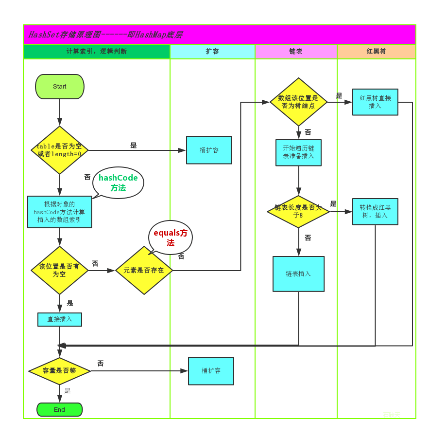

### LinkedHashSet

根据元素的 hashCode值来决定元素的存储位置， 但它同时使用双向链表
维护元素的次序，这使得看起来是以 插入 顺序保存,不允许重复


### TreeSet

TreeSet可以确保集合元素处于排序状态。TreeSet采用红黑树的数据结构来存储集合元素。

TreeSet会调用集合元素的compareTo(Object
o)方法来比较元素之间的大小关系，然后将集合元素按升序排列，这种方式是自然排序。

## 3：Queue

顾名思义，Queue用于模拟队列这种数据结构。队列先进先出。

Queue接口有一个PriorityQueue实现类。除此之外，Queue还有一个Deque接口，Deque代表一个“双端队列”，双端队列可以同时从两端删除或添加元素，因此Deque可以当作栈来使用。java为Deque提供了ArrayDeque实现类和LinkedList实现类。

2：Queue接口中定义了如下的几个方法：

void add(Object e): 将指定元素插入到队列的尾部。

object element(): 获取队列头部的元素，但是不删除该元素。

boolean offer(Object e):
将指定的元素插入此队列的尾部。当使用容量有限的队列时，此方法通常比add(Object
e)有效。

Object peek(): 返回队列头部的元素，但是不删除该元素。如果队列为空，则返回null。

Object poll(): 返回队列头部的元素，并删除该元素。如果队列为空，则返回null。

Object remove(): 获取队列头部的元素，并删除该元素。

PriorityQueue实现类


## 4：Stack

Stack类是Vector类的子类。它向用户提供了堆栈这种高级的数据结构。


## 5：Map

Key-value型，不允许重复，同一对象所对应的类

1：哈希表


2：Java7实现

容量必须是为2的n次幂，默认1\<\<4为16

创建的时候并没有分配桶，只有将东西put进去的时候才分配

Int I 变成 0到n-1的方法：取余，使用Hash&（length-1）（全1）

为防止碰撞，再次hash

超过一定阈值就要开始扩容

对桶里的所有元素进行重新hash，新桶是旧桶的两倍，

Transfer函数：把原本的遍历一遍，计算新的然后再计算新的里面


Java7的实现容易会出现死锁，它是线程不安全的

原本顺序是7-3，transfer之后顺序变成了3-7。

1.7的问题


1.8


不再是链表，用的是红黑树（二叉平衡树），re的时候保持顺序

Resize效率很低


**Entry对象**

`Map`中存放的是两种对象，一种称为**key**(键)，一种称为**value**(值)，它们在在`Map`中是一一对应关系，这一对对象又称做`Map`中的一个`Entry(项)`。`Entry`将键值对的对应关系封装成了对象。即键值对对象，这样我们在遍历`Map`集合时，就可以从每一个键值对（`Entry`）对象中获取对应的键与对应的值。

方法

* `public K getKey()`：获取Entry对象中的键。
* `public V getValue()`：获取Entry对象中的值。

在Map集合中也提供了获取所有Entry对象的方法：

* `public Set<Map.Entry<K,V>> entrySet()`: 获取到Map集合中所有的键值对对象的集合(Set集合)。

### HashMap(重点)

HashMap不是线程安全的，如果想要线程安全的HashMap，可以通过Collections类的静态方法synchronizedMap获得线程安全的HashMap。

#### 底层实现

HashMap的底层主要是基于数组，链表和红黑树来实现的，HashMap 会根据 key.
hashCode() 计算出 hash 值，根据 hash 值将 value 保存在 bucket 里。

HashMap类中有一个非常重要的字段，就是 Node[] table，即哈希桶数组，明显它是一个Node的数组


**当冲突时HashMap 的做法是用链表和红黑树存储相同 hash 值的 value。当 hash
冲突的个数比较少时，使用链表否则使用红黑树。**

key值不可重复，value值可以重复，

key,value 都可以是任何引用类型的数据，包括 null

boolean isEmpty() 长度为0返回true否则false

boolean containsKey(Object key) 判断集合中是否包含指定的key

boolean containsValue(Object value) 判断集合中是否包含指定的value


HashMap中关于红黑树的三个关键参数：

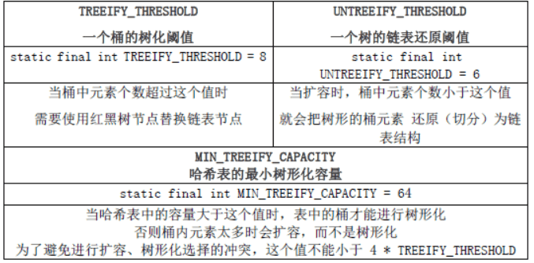

影响HashMap性能的两个重要参数，“initial capacity”（初始化容量）和”load factor“（负载因子）

容量就是哈希表桶的个数，负载因子就是键值对个数与哈希表长度的一个比值

当比值超过负载因子之后，HashMap就会进行rehash操作来进行扩容。

#### 方法

**PUT：**

1、先通过hash值计算出key映射到哪个桶。

2、如果桶上没有碰撞冲突，则直接采用`尾插法`将元素添加到链表中

3、如果出现碰撞冲突了，则需要处理冲突：

（1）如果该桶使用红黑树处理冲突，则调用红黑树的方法插入。红黑树插入的时间复杂度为logn

（2）否则采用传统的链式方法插入。如果链的长度到达临界值，则把链转变为红黑树。

4、如果桶中存在重复的键，则为该键替换新值。

5、如果size大于阈值，则进行扩容。

HashMap新增元素的时间复杂度是不固定的，可能的值有O(1)、O(logn)、O(n)。


**get**：

1、通过hash值获取该key映射到的桶。

2、桶上的key就是要查找的key，则直接命中。

3、桶上的key不是要查找的key，则查看后续节点：

（1）如果后续节点是树节点，通过调用树的方法查找该key。

（2）如果后续节点是链式节点，则通过循环遍历链查找该key。


**Hash：**

hash指的是key的哈希值，hash是通过下面这个方法计算出来的，采用了二次哈希的方式，其中key的hashCode方法是一个native方法：

```java
static final int hash(Object key) {   //jdk1.8 & jdk1.7
     int h;
     // h = key.hashCode() 为第一步 取hashCode值
     // h ^ (h >>> 16)  为第二步 高位参与运算
     return (key == null) ? 0 : (h = key.hashCode()) ^ (h >>> 16);
}
```


这个hash方法先通过key的hashCode方法获取一个哈希值，再拿这个哈希值与它的高16位的哈希值做一个异或操作来得到最后的哈希值

为啥要这样做呢？注释中是这样解释的：如果当n很小，假设为64的话，那么n-1即为63（0x111111），这样的值跟hashCode()直接做与操作，实际上只使用了哈希值的后6位。如果当哈希值的高位变化很大，低位变化很小，这样就很容易造成冲突了，所以这里把高低位都利用起来，从而解决了这个问题。

决定了HashMap的大小只能是2的幂次方。

当length总是2的n次方时，h& (length-1)运算等价于对length取模，也就是h%length，但是&比%具有更高的效率。

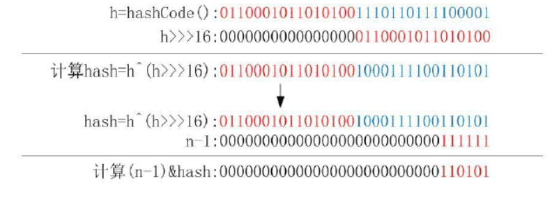

**Resize**

方法是使用一个新的数组代替已有的容量小的数组。

HashMap在进行扩容时，使用的rehash方式非常巧妙，因为每次扩容都是翻倍，与原来计算（n-1）&hash的结果相比，只是多了一个bit位，所以节点要么就在原来的位置，要么就被分配到“原位置+旧容量”这个位置。

例如，原来的容量为32，那么应该拿hash跟31（0x11111）做与操作；在扩容扩到了64的容量之后，应该拿hash跟63（0x111111）做与操作。新容量跟原来相比只是多了一个bit位，假设原来的位置在23，那么当新增的那个bit位的计算结果为0时，那么该节点还是在23；相反，计算结果为1时，则该节点会被分配到23+31的桶上。


**问：插入时为何采用尾插法而不是1.7之前的头插法？？**

在扩容时，头插法会改变链表中元素原本的顺序，以至于在并发场景下导致链表成环的问题，而尾插法，在扩容时会保持链表元素原本的顺序，就不会出现链表成环的问题。但是注意HashMap不是线程安全的，即使采用尾插法，也不能用到多线程中。


### ConcurrentHashMap

ConcurrentHashMap是由Segment数组结构和HashEntry数组结构组成。

Segment是一种可重入锁ReentrantLock，在ConcurrentHashMap里扮演锁的角色，HashEntry则用于存储键值对数据。

JDK1.8的实现已经抛弃了Segment分段锁机制，利用CAS+Synchronized来保证并发更新的安全。

#### 结构

数据结构采用：Node数组+链表+红黑树。

Node：是ConcurrentHashMap存储结构的基本单元，继承于HashMap中的Entry，用于存储数据

TreeNode：红黑树的数据的存储结构，用于红黑树中存储数据，当链表的节点数大于8时会转换成红黑树的结构，他就是通过TreeNode作为存储结构代替Node来转换成黑红树

TreeBin：reeBin就是封装TreeNode的容器，它提供转换黑红树的一些条件和锁的控制

#### 初始化

初始化：保证安全，加锁（尽量避免加锁，即使加锁范围尽量小），CAS加自旋

存取数据：初始容量，扩容安全，多个线程共同协助扩容

默认初始容量为16

New 的时候并不会初始化数组，只有但put时才会初始化数组。即延迟到第一次put行为时

创建时如果传入

```java
final ConcurrentHashMap chm = new ConcurrentHashMap(32);
```

这是其初始容量为64

注意：构造方法中，都涉及一个变量`sizeCtl`，这个变量是一个非常重要的变量，它的值不同，对应的含义也不同。

```txt
sizeCtl为0：代表数组未初始化，且数组的初始容量为16

sizeCtl为正数：如果数组未初始化，那么其记录的是数组的初始容量，如果数组已经初始化，那么其记录的是数组的扩容阈值（数组的初始容量的0.75倍）

sizeCtl为1，表示数组正在进行初始化

sizeCtl小于0，并且不是-1，表示数组正在扩容，-[1+n],表示此时有n个线程正在共同完成数组的扩容操作
```

源代码：

```java
public ConcurrentHahsMap(int initialCapacity){
    if(initialCapacity<0)
        throw new IllegalArgumentEcception();
    int cap = ((initialCapacity>=(MAXINUM_CAPACITY>>>1))?
              MAXINUM_CAPACITY:
               tableSizeFor(initialCapacity+(initialCapacity>>>1)+1));
    this.size = cap;
}
```

初始化后，将值赋值给了sizeCtl

#### put

对当前的table进行无条件自循环直到put成功

- 如果没有初始化就先调用initTable（）方法来进行初始化过程

- 如果没有hash冲突就直接CAS插入

- 如果还在进行扩容操作就先进行扩容

- 如果存在hash冲突，就加锁来保证线程安全，这里有两种情况，一种是链表形式就直接遍历到尾端插入，一种是红黑树就按照红黑树结构插入，

- 最后一个如果Hash冲突时会形成Node链表，在链表长度超过8，Node数组超过64时会将链表结构转换为红黑树的结构，break再一次进入循环

- 如果添加成功就调用addCount（）方法统计size，并且检查是否需要扩容


**2：添加安全**

Put—调用putVal方法，不允许空值空键

分段锁

CAS

hashCode & n-1

**3：扩容rehash**

当元素的数量达到容量阈值sizectl时，需要扩容

扩容两步：

1.  构建一个nextTable，大小为table的两倍。

2.  把table的数据复制到nextTable中。

并更新sizeCtl的大小为新数组的0.75倍

阈值

### HashTable

线程安全：所有涉及到多线程操作的都加上了synchronized关键字来锁住整个table

现在很少用了，多被HahsMap或ConcurrentHashMap代替，不允许插入null值

### LinkedHashMap

哈希表+链表，通过维护一个链表来保证对哈希表迭代时的有序性

HashMap中有三个空方法，二LinkedHashMap就是通过重写这三个方法来保证链表的插入，删除的有序性。

// Callbacks to allow LinkedHashMap post-actions

void afterNodeAccess(Node\<K,V\> p) { }

void afterNodeInsertion(boolean evict) { }

void afterNodeRemoval(Node\<K,V\> p) { }

### TreeMap

TreeMap是非线程安全的。

可以采用可以通过Collections类的静态方法synchronizedMap获得线程安全：

Map m = Collections.synchronizedSortedMap(new TreeMap(…));

TreeMap是用键来进行升序顺序来排序的。通过Comparable 或 Comparator来排序。
（实现和TreeSet基本一致）。

### 对比

1：HashMap与TreeMap的区别

实现方式

HashMap:基于哈希表实现。（1.8基于数组链表红黑树）使用HashMap要求添加的键类明确定义了hashCode（）和equals

TreeMap:基于红黑树实现。TreeMap没有调优选项，因为该树总处于平衡状态。

用途

HashMap：适用于在Map中插入、删除和定位元素。

TreeMap：适用于按自然顺序或自定义顺序遍历键（key)。

HashMap通常比TreeMap快一点（树和哈希表的数据结构使然），建议多使用HashMap,在需要排序的Map时候才用TreeMap.

**2：HashMap与HashTable的区别**

- HashMap是线程不安全的，HashTable是线程安全的，效率低。因此，HashMap更适合于单线程环境，而Hashtable适合于多线程环境。
- Hashtable的方法是Synchronize的，而HashMap不是
- HashMap是可以把null作为key或者value的，但是HashTable不行

要想既安全又效率高就用ConcurrentHashMap


### 常用的遍历Map的方法

 

1. Map<String, String> map = **new** HashMap<String, String>(); 
2.  map.put("1", "value1"); 
3.  map.put("2", "value2"); 
4.  map.put("3", "value3"); 

//第一种：普遍使用，由于二次取值,效率会比第二种和第三种慢一倍

```java
System.out.println("通过Map.keySet遍历key和value：");
 **for** (String key : map.keySet()) { 
 		System.out.println("key= "+ key + " and value= " + map.get(key)); 
 } 
```

//第二种 :通过Map.entrySet使用iterator遍历key和value

```java
 System.out.println("通过Map.entrySet使用iterator遍历key和value："); 
 Iterator<Map.Entry<String, String>> it = map.entrySet().iterator(); 
 **while** (it.hasNext()) { 
 		Map.Entry<String, String> entry = it.next(); 
 		System.out.println("key= " + entry.getKey() + " and value= " + entry.getValue()); 
 } 
```


//第三种：无法在for循环时实现remove等操作 

```java
 System.out.println("通过Map.entrySet遍历key和value"); 
 **for** (Map.Entry<String, String> entry : map.entrySet()) { 
 		System.out.println("key= " + entry.getKey() + " and value= " + entry.getValue()); 
 } 
```


//第四种：只能获取values,不能获取key 

```java
System.out.println("通过Map.values()遍历所有的value，但不能遍历key"); 
 **for** (String v : map.values()) { 
 		System.out.println("value= " + v); 
 } 
```

  Map.entrySet迭代器会生成EntryIterator,其返回的实例是一个包含key/value键值对的对象。而keySet中迭代器返回的只是key对象，还需要到map中二次取值。故entrySet要比keySet快一倍左右。


## 7：位集合类BitSet


# 四：异常

## 1：概述

异常体系


1：Exception和Error有什么区别？

Exception和Error都是Throwable的子类。Exception用于用户程序可以捕获的异常情况。Error定义了不期望被用户程序捕获的异常。

分类

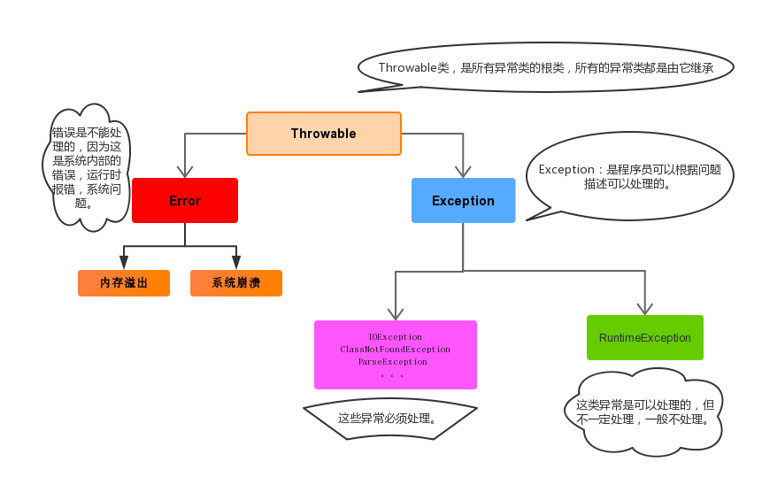

* 


异常事件可分为两类：

**Error**：Java虚拟机无法解决的严重问题。如：JVM系统内部错误、资源耗尽等严重情况。比如：StackOverflowError和OOM。一般不编写针对性的代码进行处理。

**Exception:**其它因编程错误或偶然的外在因素导致的一般性问题，可以使用针对性的代码进行处理。例如：

空指针访问

试图读取不存在的文件

网络连接中断

数组角标越界

* **编译时期异常**:checked异常。在编译时期,就会检查,如果没有处理异常,则编译失败。(如日期格式化异常)
* **运行时期异常**:runtime异常。在运行时期,检查异常.在编译时期,运行异常不会编译器检测(不报错)。(如数学异常)

## 2：常见异常

-   NullPointerException 空指针异常

-   ClassNotFoundException 指定类不存在

-   NumberFormatException 字符串转换为数字异常

-   IndexOutOfBoundsException 数组下标越界异常

-   ClassCastException 数据类型转换异常

-   FileNotFoundException 文件未找到异常

-   NoSuchMethodException 方法不存在异常

-   IOException IO 异常

-   SocketException Socket 异常

## 3：处理异常

**1）抛出异常throw**


**2）声明异常throws**

throw和throws有什么区别？

Throw用于方法内部，Throws用于方法声明上

Throw后跟异常对象，Throws后跟异常类型

Throw后只能跟一个异常对象，Throws后可以一次声明多种异常类型


**3）捕获异常try…catch**

1：在项目中不要捕获Java类库中继承自RuntimeException的运行时异常，ndexOutOfBoundsException
/ NullPointerException，这类异常由程序员预检查违法来规避，保证程序健壮性。

2：对大段代码进行 try-catch，这是不负责任的表现。 catch
时请分清稳定代码和非稳定代码，稳定代码指的是无论如何不会出错的代码。对于非稳定代码的
catch 尽可能进行区分异常类型，再做对应的异常处理。

3：有 try 块放到了事务代码中， catch
异常后，如果需要回滚事务，一定要注意手动回滚事务。

4：有特殊的流关闭等操作一定必须放在finally中

程序检测

If（num==0）{}

方式一：try-catch-finally

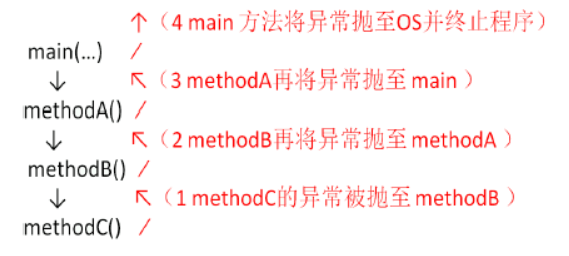

捕获异常的有关信息：

与其它对象一样，可以访问一个异常对象的成员变量或调用它的方法。

getMessage() 获取异常信息，返回字符串

printStackTrace()
获取异常类名和异常信息，以及异常出现在程序中的位置。返回值void。


方式二：throws + 异常类型

方法三：手动抛出异常

首先要生成异常类对象，然后通过throw语句实现抛出操作(提交给Java运行环境)。

**IOException e=new IOException();**

**Throw e;**

可以抛出的异常必须是Throwable或其子类的实例。下面的语句在编译时将会产生语法错误：

**Throw new String("wanttothrow");**


## 4：用户自定义异常类

定义异常类

```java
// 业务逻辑异常
public class RegisterException extends Exception {
    /**
     * 空参构造
     */
    public RegisterException() {
    }

    /**
     *
     * @param message 表示异常提示
     */
    public RegisterException(String message) {
        super(message);
    }
}
```

使用

```java
public static boolean checkUsername(String uname) throws LoginException{
        for (String name : names) {
            if(name.equals(uname)){//如果名字在这里面 就抛出登陆异常
                throw new RegisterException("亲"+name+"已经被注册了！");
            }
        }
        return true;
    }
}
```

### 总结：

1：在项目中不要捕获Java类库中继承自RuntimeException的运行时异常，这类异常由程序员预检查违法来规避，保证程序健壮性。

2：不能大段进行try……catch……对于非稳定代码的
catch 尽可能进行区分异常类型，再做对应的异常处理。给出准确的异常处理信息

3：有 try 块放到了事务代码中， catch异常后，如果需要回滚事务，一定要注意手动回滚事务。

4：有特殊的流关闭等操作一定必须放在finally中

5：请确保在Javadoc中添加一个@throws 声明，并描述可能导致的异常情况。

6：

# 五：多线程：

并行：多个cpu实例或者多台机器同时执行一段处理逻辑，是真正的同时。 
并发：通过cpu调度算法，让用户看上去同时执行，实际上从cpu操作层面不是真正的同时。

## 1：concurrent并发包

JUC包增加了并发编程中常用的工具类，用于定义类似于线程的自定义子 系统，包括线程池、异步 IO 和轻量级任务框架。提供可调的、灵活的线程池。还提供了设计用于多线程上下文中的 Collection 实现等。

1：Volatile关键字

见前关键字

2：原子变量与CAS算法

标量原子变量类 AtomicInteger，AtomicLong和AtomicBoolean类分别支持对原始数据类型int，long和boolean的操作。当引用变量需要以原子方式更新时，AtomicReference类用于处理引用数据类型。

原子数组类 有三个类称为AtomicIntegerArray，AtomicLongArray和AtomicReferenceArray，它们表示一个int，long和引用类型的数组，其元素可以进行原子性更新。


CAS（比较交换）是一种无锁非阻塞的算法实现

CAS会导致ABA问题，线程1准备用CAS将变量的值由A替换为B，在此之前，线程2将变量的值由A替换为C，又由C替换为A，然后线程1执行CAS时发现变量的值仍然为A，所以CAS成功。但实际上这时的现场已经和最初不同了，尽管CAS成功，但可能存在潜藏的问题。


3：ConcurrentHashMap

见前


4：CountDownLatch（闭锁）

一个同步辅助类，在完成一组正在其他线程中执行的操作之前，它允许一个或多个线程一直等待。

**CountDownLatch最重要的方法是countDown()——倒数 和 await()，前者主要是倒数一次，后者是等待倒数到0，如果没有到达0，就只有阻塞等待了。**


5：Lock同步锁


6：Condition 控制线程通信


7：**ReadWriteLock 读写锁**


8：**线程8锁**


**AbstractQueuedSynchronizer (AQS)**

提供了一个基于FIFO队列

 **6.1 ConcurrentHashMap**

**6.2 ReentrantLock**

**6.3 Condition**

**6.4 CopyOnWriteArrayList**

 CopyOnWriteArrayList是一个线程安全、并且在读操作时无锁的ArrayList

**6.5 CopyOnWriteArraySet**

CopyOnWriteArraySet基于CopyOnWriteArrayList实现，其唯一的不同是在add时调用的是CopyOnWriteArrayList的addIfAbsent方法。保证了无重复元素，但在add时每次都要进行数组的遍历，因此性能会略低于上个。

**6.6 ArrayBlockingQueue**

**6.7 ThreadPoolExecutor**


## 5.1：原理/方法机制

多线程执行时，在栈内存中，其实每一个执行线程都有一片自己所属的栈内存空间。进行方法的压栈和弹栈。

当执行线程的任务结束了，线程自动在栈内存中释放了。但是当所有的执行线程都结束了，那么进程就结束了。


synchronized, wait, notify 是任何对象都具有的同步工具。

wait/notify必须存在于synchronized块中。并且，这三个关键字针对的是同一个监视器（某对象的监视器）。

volatile 
多线程的内存模型：main memory（主存）、working memory（线程栈），在处理数据时，线程会把值从主存load到本地栈，完成操作后再save回去(volatile关键词的作用：每次针对该变量的操作都激发一次load and save)。 

## 5.2：线程状态

当线程被创建并启动以后，它既不是一启动就进入了执行状态，也不是一直处于执行状态。在线程的生命周期中，枚举中给出了六种线程状态：


**就绪(Runnable):**线程准备运行，不一定立马就能开始执行。

**运行中(Running)：**进程正在执行线程的代码。

**等待中(Waiting):**线程处于阻塞的状态，等待外部的处理结束。

**睡眠中(Sleeping)：**线程被强制睡眠。

**I/O阻塞(Blocked on I/O)：**等待I/O操作完成。

**同步阻塞(Blocked on Synchronization)：**等待获取锁。

**死亡(Dead)：**线程完成了执行

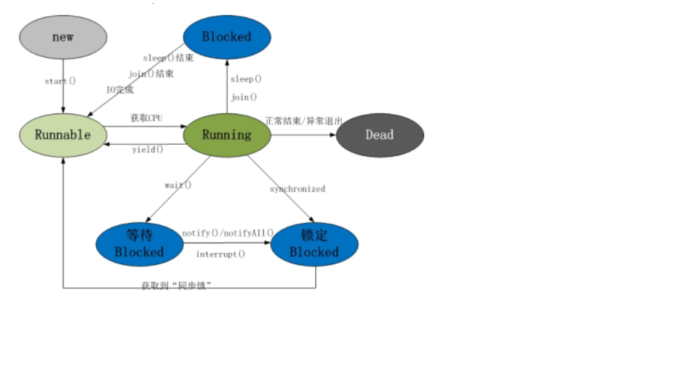多个线程处理同一个资源，需要线程间通信解决线程对资源的占用，避免对同一资源争夺。及引入等待唤醒机制（wait（），notify（））

(a）wait（）方法:线程调用wait()方法，**释放**它对锁的拥有权，然后**等待另外的线程来通知它**（通知的方式是notify()或者notifyAll()方法），这样它才能重新获得锁的拥有权和恢复执行。

　　  要确保调用wait()方法的时候**拥有锁**，即，wait()方法的调用必须放在**synchronized**方法或**synchronized**块中。

(b)notify()方法：`notify()方法会唤醒一个等待当前对象的锁的线程。唤醒在此对象监视器上等待的单个线程。`

(c)`notifAll()方法：**``**notifyAll（）方法会唤醒在此对象监视器上等待的所有线程。**`


## 5.2：Thread类

构造

- public Thread() :分配一个新的线程对象。
- public Thread(String name) :分配一个指定名字的新的线程对象。
- public Thread(Runnable target) :分配一个带有指定目标新的线程对象。
- public Thread(Runnable target,String name) :分配一个带有指定目标新的线程对象并指定名字。

常用方法：

- public String getName() :获取当前线程名称。
- public void start() :导致此线程开始执行; Java虚拟机调用此线程的run方法。
- public void run() :此线程要执行的任务在此处定义代码。
- public static void sleep(long millis) :使当前正在执行的线程以指定的毫秒数暂停（暂时停止执行）。
- public static Thread currentThread() :返回对当前正在执行的线程对象的引用。


## 5.2：ThreadLocal

线程变量

ThreadLocal提供了线程内存储变量的能力，这些变量不同之处在于每一个线程读取的变量是对应的互相独立的。通过get和set方法就可以得到当前线程对应的值。ThreadLocal实例通常来说都是private static类型的，用于关联线程和线程上下文。

好处：

- 传递数据：保存每个线程绑定的数据，在需要的地方可以直接获取，避免参数直接传递带来的代码耦合问题
- 线程隔离：各线程之间的数据相互隔离却又具备并发性，避免同步方式带来的性能损失

使用举例：

```java
public class MyDemo01 {
    // 变量
    private String content;

    public String getContent() {
        return content;
    }

    public void setContent(String content) {
        this.content = content;
    }

    public static void main(String[] args) {
        MyDemo01 myDemo01 = new MyDemo01();
        ThreadLocal<String> threadLocal = new ThreadLocal<>();
        for (int i = 0; i < 5; i++) {
            new Thread(() -> {
                threadLocal.set(Thread.currentThread().getName() + "的数据");
                System.out.println("-----------------------------------------");
                System.out.println(Thread.currentThread().getName() + "\t  " + threadLocal.get());
            }, String.valueOf(i)).start();
        }
    }
}
```

输出

```
4	  4的数据
-----------------------------------------
3	  3的数据
-----------------------------------------
2	  2的数据
-----------------------------------------
1	  1的数据
0	  0的数据
```


ThreadLocal与Synchronized的区别：

虽然ThreadLocal模式与Synchronized关键字都用于处理多线程并发访问变量的问题，不过两者处理问题的角度和思路不同。

|        | Synchronized                                                 | ThreadLocal                                                  |
| ------ | ------------------------------------------------------------ | ------------------------------------------------------------ |
| 原理   | 同步机制采用 以空间换时间 的方式，只提供了一份变量，让不同的线程排队访问 | ThreadLocal采用以空间换时间的概念，为每个线程都提供一份变量副本，从而实现同时访问而互不干扰 |
| 侧重点 | 多个线程之间访问资源的同步                                   | 多线程中让每个线程之间的数据相互隔离                         |

总结：在刚刚的案例中，虽然使用ThreadLocal和Synchronized都能解决问题，但是使用ThreadLocal更为合适，因为这样可以使程序拥有更高的并发性。

在JDK8中 ThreadLocal的设计是：每个Thread维护一个ThreadLocalMap，这个Map的key是ThreadLocal实例本身，value 才是真正要存储的值object。具体的过程是这样的：

- 每个Thread线程内部都有一个Map（ThreadLocalMap）
- Map里面存储ThreadLocal对象（key）和线程的变量副本（value）
- Thread内部的Map是由ThreadLocal维护的，由ThreadLocal负责向map获取和设置线程的变量值。
- 对于不同的线程，每次获取副本值时，别的线程并不能获取到当前线程的副本值，形成了副本的隔离，互不干扰。

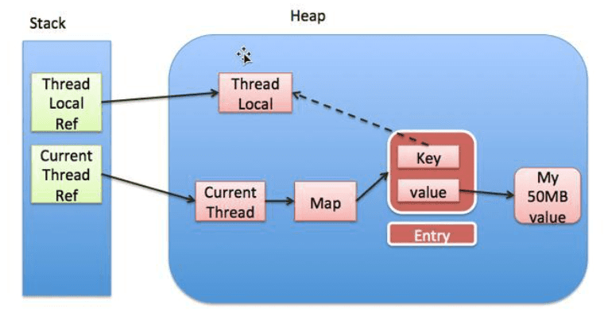

面这张图详细的揭示了ThreadLocal和Thread以及ThreadLocalMap三者的关系。

1、Thread中有一个map，就是ThreadLocalMap

2、ThreadLocalMap的key是ThreadLocal，值是我们自己设定的。

3、ThreadLocal是一个**弱引用**，当为null时，会被当成垃圾回收

**4、重点来了，突然我们ThreadLocal是null了，也就是要被垃圾回收器回收了，但是此时我们的ThreadLocalMap生命周期和Thread的一样，它不会回收，这时候就出现了一个现象。那就是ThreadLocalMap的key没了，但是value还在，这就造成了内存泄漏。**

**解决办法：使用完ThreadLocal后，执行remove操作，避免出现内存溢出情况。**


### 核心源码

除了构造方法之外，ThreadLocal对外暴露的方法有以下4个

| 方法声明                   | 描述                         |
| -------------------------- | ---------------------------- |
| protected T initialValue() | 返回当前线程局部变量的初始值 |
| public void set(T value)   | 返回当前线程绑定的局部变量   |
| public T get()             | 获取当前线程绑定的局部变量   |
| public void remove()       | 移除当前线程绑定的局部变量   |

以下是这4个方法的详细源码分析

了解到ThreadLocal的操作实际上是围绕ThreadLocalMap展开的。ThreadLocalMap的源码相对比较复杂，我们从以下三个方面进行讨论。

1：基本结构

ThreadLocalMap是ThreadLocal的内部类，没有实现Map接口，用独立的方式实现了Map的功能，其内部的Entry也是独立实现。

存储结果Entry


## 5.3：线程实现方式

**继承Thread类，重写run方法（其实Thread类本身也实现了Runnable接口）**

测试：

```java
class MyThread extends Thread{
  public void run(){

  }
}
public class TestThread{
  public static void main(String[] args）{
      MyThread thread = new MyThread();//创建用户线程对象
      thread.start();//启动用户线程
      thread.run();//主线程调用用户线程对象的run()方法
  }
}
```

方法

```java
//当前线程可转让cpu控制权，让别的就绪状态线程运行（切换）
public static Thread.yield() 
//暂停一段时间
public static Thread.sleep()  
//在一个线程中调用other.join(),将等待other执行完后才继续本线程。　　　　
public join()
//后两个函数皆可以被打断
public interrupte()
```

**实现Runnable接口，重写run方法**

当使用Thread(Runnable thread)方式创建线程对象时，须为该方法传递一个实现了Runnable接口的对象，这样创建的线程将调用实现Runnable接口的对象的run()方法

```java
public class TestThread{
  public static void main(String[] args){
      Mythread mt = new Mythread();
      Thread t = new Thread(mt);//创建用户线程
       t.start();//启动用户线程
  }
}
class Mythread implements Runnable{
    public void run(){

    }
}
```

**实现Callable接口，重写call方法（有返回值）**

**使用线程池（有返回值）**

上所有的多线程代码都是通过运行Thread的start()方法来运行的。因此，不管是继承Thread类还是实现
Runnable接口来实现多线程，最终还是通过Thread的对象的API来控制线程的


1：继承Thread类实现线程，扩展性不强，因为Java类只能继承一个

**2：t.start()才会启动一个线程，t.run（）只是普通的方法调用，所以是顺序执行的。**

>   **(可运行）状态,并没有运行，一旦得到cpu时间片，就开始执行run()方法**

>   。实现Runnable接口实现一个线程

>   。实现Callable接口：runnable 没有返回值，callable 可以拿到有返回值，callable
>   可以看作是 runnable 的补充。

2：**线程与进程的区别归纳：**

>   **a.地址空间和其它资源**：进程间相互独立，同一进程的各线程间共享。某进程内的线程在其它进程不可见。

>   **b.通信：**进程间通信IPC，线程间可以直接读写进程数据段（如全局变量）来进行通信——需要进程同步和互斥手段的辅助，以保证数据的一致性。

>   **c.调度和切换**：线程上下文切换比进程上下文切换要快得多。

>   d.在多线程OS中，进程不是一个可执行的实体。

守护线程：

>   守护线程是运行在后台的一种特殊进程。它独立于控制终端并且周期性地执行某种任务或等待处理某些发生的事件。在
>   Java 中垃圾回收线程就是特殊的守护线程。

多线程的同步实现方式

>   1：同步方法：即有synchronized关键字修饰的方法。由于java的每个对象都有一个内置锁，当用此关键字修饰方法时，  
>   内置锁会保护整个方法。在调用该方法前，需要获得内置锁，否则就处于阻塞状态。

Sleep()和wait()的区别：

sleep() 时间到会自动恢复；调用sleep不会释放对象锁。InterruptedException异常。

wait() 是Object的方法，导致本线程放弃对象锁，释放所持有的对象的lock。可以使用
notify()/notifyAll()直接唤醒。Notify唤醒一个处于等待状态的线程，并不能确切唤醒某一个等待的线程，而是由JVM确定唤醒那个线程。

反对使用stop（）因为它不安全

Suspend（）容易发生死锁调用suspend()的时候，目标线程会停下来，但却仍然持有在这之前获得的锁定。此时，其他任何线程都不能访问锁定的资源，除非被"挂起"的线程恢复运行。对任何线程来说，如果它们想恢复目标线程，同时又试图使用任何一个锁定的资源，就会造成死锁。

Yield（）：线程让步，暂停当前正在执行的线程，把机会让给优先级相同或更高的线程

Join（）：

## 5.6：线程池

作用：避免频繁地创建和销毁线程，达到线程对象的重用。另外，使用线程池还可以根据项目灵活地控制并发的数目。

ThreadPoolExecutor类是线程池中最核心的一个类，它提供了四个构造方法。

### 1，参数

**corePoolSize核心线程数量**

线程池中的核心线程数，当提交一个任务时，线程池创建一个新线程执行任务，直到当前线程数等于corePoolSize,
即使有其他空闲线程能够执行新来的任务,
也会继续创建线程；如果当前线程数为corePoolSize，继续提交的任务被保存到阻塞队列中，等待被执行；如果执行了线程池的prestartAllCoreThreads()方法，线程池会提前创建并启动所有核心线程。

**workQueue阻塞队列**

用来保存等待被执行的任务的阻塞队列. 在JDK中提供了如下阻塞队列：

```java
(1) ArrayBlockingQueue：基于数组结构的有界阻塞队列，按FIFO排序任务；

(2)
LinkedBlockingQuene：基于链表结构的阻塞队列，按FIFO排序任务，吞吐量通常要高于ArrayBlockingQuene；

(3)
SynchronousQuene：一个不存储元素的阻塞队列，每个插入操作必须等到另一个线程调用移除操作，否则插入操作一直处于阻塞状态，吞吐量通常要高于LinkedBlockingQuene；

(4) priorityBlockingQuene：具有优先级的无界阻塞队列
```

**maximumPoolSize最大线程数**
线程池中允许的最大线程数。如果当前阻塞队列满了，且继续提交任务，则创建新的线程执行任务，前提是当前线程数小于maximumPoolSize；当阻塞队列是无界队列,
则maximumPoolSize则不起作用,
因为无法提交至核心线程池的线程会一直持续地放入workQueue.

**keepAliveTime线程空闲时的存活时间**  
线程空闲时的存活时间，即当线程没有任务执行时，该线程继续存活的时间；默认情况下，该参数只在线程数大于corePoolSize时才有用,超过这个时间的空闲线程将被终止；

**unit**  
keepAliveTime的单位

```
有7种取值，在TimeUnit类中有7种静态属性
*    TimeUnit.DAYS;               //天
*    TimeUnit.HOURS;             //小时
*    TimeUnit.MINUTES;           //分钟
*    TimeUnit.SECONDS;           //秒
*    TimeUnit.MILLISECONDS;      //毫秒
*    TimeUnit.MICROSECONDS;      //微妙
*    TimeUnit.NANOSECONDS;       //纳秒
```

**threadFactory线程工厂**  
创建线程的工厂，通过自定义的线程工厂可以给每个新建的线程设置一个具有识别度的线程名。默认为DefaultThreadFactory

**handler当拒绝处理任务时的策略**  
线程池的饱和策略，当阻塞队列满了，且没有空闲的工作线程，如果继续提交任务，必须采取一种策略处理该任务，线程池提供了4种策略：  

```java
AbortPolicy：直接抛出异常，默认策略；
CallerRunsPolicy：用调用者所在的线程来执行任务；
DiscardOldestPolicy：丢弃阻塞队列中靠最前的任务，并执行当前任务；
DiscardPolicy：直接丢弃任务,当然也可以根据应用场景实现
```


RejectedExecutionHandler接口，自定义饱和策略，如记录日志或持久化存储不能处理的任务。

### 2：构造方法

```java
 public ThreadPoolExecutor(int corePoolSize,int maximumPoolSize,long keepAliveTime,TimeUnit unit,
            BlockingQueue<Runnable> workQueue);

    public ThreadPoolExecutor(int corePoolSize,int maximumPoolSize,long keepAliveTime,TimeUnit unit,
            BlockingQueue<Runnable> workQueue,ThreadFactory threadFactory);

    public ThreadPoolExecutor(int corePoolSize,int maximumPoolSize,long keepAliveTime,TimeUnit unit,
            BlockingQueue<Runnable> workQueue,RejectedExecutionHandler handler);

    public ThreadPoolExecutor(int corePoolSize,int maximumPoolSize,long keepAliveTime,TimeUnit unit,
        BlockingQueue<Runnable> workQueue,ThreadFactory threadFactory,RejectedExecutionHandler handler);
```

### 3：其他创建线程池的方法

1：new  SingleThreadExecutor()：只创建唯一的工作者线程来执行任务。线程数目唯一，队列顺序执行

2：new  CachedThreadPool()：创建一个可缓存线程池，如果线程池长度超过处理需求，可灵活回收空闲线程，若无可回收这创建新新线程。

处理大量短时间工作任务的线程池，他会缓存线程并重用，无缓存线程时，就会创建新线程，闲置超过60秒则会被移出缓存，其内部使用
SynchronousQueue 作为工作队列；

3：new  FixedThreadPool(int  nThreads)：创建一个制定工作线程数量的线程池，任何时候最多有 nThreads个工作线程是活动的

4：new  SingleThreadScheduledExecutor()：创建单线程池，返回ScheduledExecutorService，可以进行定时或周期性的工作调度；

5：new  ScheduledThreadPool(int  corePoolSize)：创建一个定长的线程池，可以进行定时或周期性的工作调度，区别在于单一工作线程还是多个工作线程

6：new  WorkStealingPool(int parallelism)： Java 8才加入这个创建方法，其内部会构建ForkJoinPool，利用Work-Stealing算法，并行地处理任务，不保证处理顺序；

7：ThreadPoolExecutor()：是最原始的线程池创建，上面1-3创建方式都是对ThreadPoolExecutor的封装。

### 4：方法

execute（）：提交任务，交给线程池执行

submit（）：提交任务，能够返回执行结果 execute + Future

shutdown（）：关闭线程池，等待任务都执行完

shutdownNow（）：关闭线程池，不等待任务执行完

getTaskCount（）：线程池已执行和未执行的任务总数

getCompletedTaskCount（）：已完成的任务数量

getPoolSize（）：线程池当前的线程数量

getActiveCount（）：当前线程池中正在执行任务的线程数量


### 原理：

当一个任务提交至线程池之后，

1.线程池首先判断**核心线程池里的线程**是否已经满了。如果不是，则创建一个新的工作线程来执行任务。否则进入2.

2:判断**工作队列**是否已经满了，倘若还没有满，将线程放入工作队列。否则进入3.

3.判断**线程池里的线程是否都在执行任务**。如果不是，则创建一个新的工作线程来执行。如果线程池满了，则交给饱和策略来处理任务。

ThreadPoolExecutor执行execute()流程：

当一个任务提交至线程池之后，

1.线程池首先当前运行的线程数量是否少于corePoolSize。如果是，则创建一个新的工作线程来执行任务。如果都在执行任务，则进入2.

2.判断BlockingQueue是否已经满了，倘若还没有满，则将线程放入BlockingQueue。否则进入3.

3.如果创建一个新的工作线程将使当前运行的线程数量超过maximumPoolSize，则交给RejectedExecutionHandler来处理任务。


### 3：状态

-   running：这是最正常的状态，接受新的任务，处理等待队列中的任务。

-   shutdown：不接受新的任务提交，但是会继续处理等待队列中的任务。

-   stop：不接受新的任务提交，不再处理等待队列中的任务，中断正在执行任务的线程。

-   tidying：所有的任务都销毁了，workCount 为 0，线程池的状态在转换为 TIDYING
    状态时，会执行钩子方法 terminated()。

-   terminated：terminated()方法结束后，线程池的状态就会变成这个。

. 在 Java 程序中怎么保证多线程的运行安全？

方法一：使用安全类，比如 Java. util. concurrent 下的类。

方法二：使用自动锁 synchronized。

方法三：使用手动锁 Lock。


### 4；关闭方式

Shutdown shutdownNow tryTerminate 清空工作队列，终止线程池中各个线程，销毁线程池

Wait方法：只能在同步代码块中调用，wait会释放掉对象锁，等待nitify唤醒

Notify方法：

### 5：配置线程池的因素

性质不同的任务可用使用不同规模的线程池分开处理：  
- CPU密集型：尽可能少的线程，Ncpu+1  
- IO密集型：尽可能多的线程, Ncpu\*2，比如数据库连接池  
-
混合型：CPU密集型的任务与IO密集型任务的执行时间差别较小，拆分为两个线程池；否则没有必要拆分。

### 6：线程池中遇到的问题

（1）如果你提交任务时，线程池队列已满，这时会发生什么？

如果你使用的LinkedBlockingQueue，也就是无界队列的话，没关系，继续添加任务到阻塞队列中等待执行，因为LinkedBlockingQueue可以近乎认为是一个无穷大的队列，可以无限存放任务；

如果你使用的是有界队列比方说ArrayBlockingQueue的话，任务首先会被添加到ArrayBlockingQueue中，ArrayBlockingQueue满了，则会使用拒绝策略RejectedExecutionHandler处理满了的任务，默认是AbortPolicy。

（2）高并发、任务执行时间短的业务怎样使用线程池？并发不高、任务执行时间长的业务怎样使用线程池？并发高、业务执行时间长的业务怎样使用线程池？这是我在并发编程网上看到的一个问题：

　　　　1）高并发、任务执行时间短的业务，线程池线程数可以设置为CPU核数+1，减少线程上下文的切换
　　　　2）并发不高、任务执行时间长的业务要区分开看：
　　　　　　　a）假如是业务时间长集中在IO操作上，也就是IO密集型的任务，因为IO操作并不占用CPU，所以不要让所有的CPU闲下来，可以加大线程池中的线程数目，让CPU处理更多的业务
　　　　　　　b）假如是业务时间长集中在计算操作上，也就是计算密集型任务，这个就没办法了，和（1）一样吧，线程池中的线程数设置得少一些，减少线程上下文的切换
　　　　3）并发高、业务执行时间长，解决这种类型任务的关键不在于线程池而在于整体架构的设计，看看这些业务里面某些数据是否能做缓存是第一步，增加服务器是第二步，至于线程池的设置，设置参考 2）。最后，业务执行时间长的问题，也可能需要分析一下，看看能不能使用中间件对任务进行拆分和解耦。

## 2：进程间通信

管道pipe：管道是一种半双工的通信方式，数据只能单向流动，而且只能在具有亲缘关系的进程间使用。进程的亲缘关系通常是指父子进程关系。

FIFO

消息队列

信号量

共享内存

- 高级管道popen：将另一个程序当做一个新的进程在当前程序进程中启动，则它算是当前程序的子进程，这种方式我们成为高级管道方式。
- 有名管道named pipe ：有名管道也是半双工的通信方式，但是它允许无亲缘关系进程间的通信。
- 消息队列MessageQueue：消息队列是由消息的链表，存放在内核中并由消息队列标识符标识。消息队列克服了信号传递信息少、管道只能承载无格式字节流以及缓冲区大小受限等缺点。
- 共享存储SharedMemory：共享内存就是映射一段能被其他进程所访问的内存，这段共享内存由一个进程创建，但多个进程都可以访问。共享内存是最快的 IPC 方式，它是针对其他进程间通信方式运行效率低而专门设计的。它往往与其他通信机制，如信号两，配合使用，来实现进程间的同步和通信。
- 信号量Semaphore：信号量是一个计数器，可以用来控制多个进程对共享资源的访问。它常作为一种锁机制，防止某进程正在访问共享资源时，其他进程也访问该资源。因此，主要作为进程间以及同一进程内不同线程之间的同步手段。
- 套接字Socket：套解口也是一种进程间通信机制，与其他通信机制不同的是，它可用于不同及其间的进程通信。
- 信号sinal： 信号是一种比较复杂的通信方式，用于通知接收进程某个事件已经发生


## 5.5：线程安全

### 线程同步

当我们使用多个线程访问同一资源的时候，且多个线程中对资源有写的操作，就容易出现线程安全问题。

Java中提供了同步机制(synchronized)来解决

1. 同步代码块。
2. 同步方法。
3. 锁机制。


### 同步代码块

```java
synchronized(同步锁){
	需要同步操作的代码
}
```

### 同步方法

同步方法:使用synchronized修饰的方法,就叫做同步方法,保证A线程执行该方法的时候,其他线程只能在方法外等着。

```java
public synchronized void method(){
	可能会产生线程安全问题的代码
}
```

### 锁相关

Lock能完成synchronized所实现的所有功能。


synchronized会自动释放锁，而Lock一定要求程序员手工释放，并且必须在finally从句中释放。

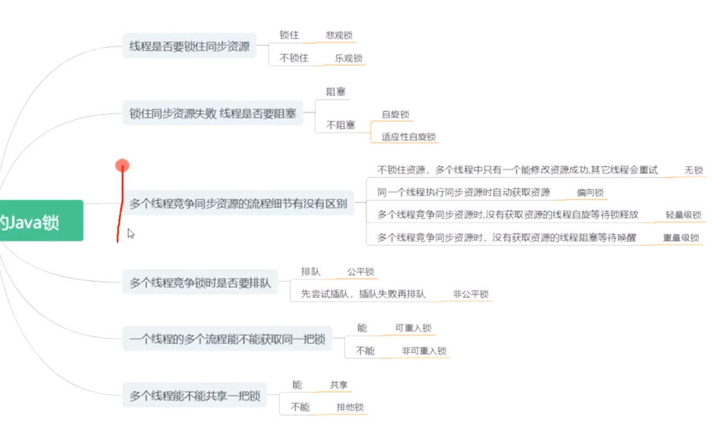

#### 1：乐观锁与悲观锁

>   悲观锁：认为自己在使用数据的时候一定会有别的线程来修改数据。

>   Java中，synchronized关键字和Lock的实现类都是悲观锁。

>   悲观锁**适合写操作多**的场景，先加锁可以保证写操作时数据正确。

>   乐观锁**适合读操作多**的场景，不加锁的特点能够使其读操作的性能大幅提升。

>   乐观锁：自己在使用数据时不会有别的线程修改数据，所以不会添加锁，只是在更新数据的时候去判断之前有没有别的线程更新了这个数据。使用CAS算法

>   CAS算法（比较与交换），会导致ABA问题，可以加时间戳

#### 2：自旋锁VS适应性自旋锁

如果同步代码块的内容过于简单，线程挂起切换的时间比线程执行的时间还要长，就得不尝失，如果物理机器有多个处理器，能够让两个或以上的线程同时并行执行，我们就可以让后面那个请求锁的线程不放弃CPU的执行时间，看看持有锁的线程是否很快就会释放锁。

而为了让当前线程“稍等一下”，我们需让当前线程进行自旋，如果在自旋完成后前面锁定同步资源的线程已经释放了锁，那么当前线程就可以不必阻塞而是直接获取同步资源，从而避免切换线程的开销。这就是自旋锁。


如果锁被占用的时间很短，自旋等待的效果就会非常好。反之，如果锁被占用的时间很长，那么自旋的线程只会白浪费处理器资源。

如果自旋超过了限定次数（默认是10次，可以使用-XX:PreBlockSpin来更改）没有成功获得锁，就应当挂起线程。

实现原理也是CAS

自适应意味着自旋的时间（次数）不再固定，而是由前一次在同一个锁上的自旋时间及锁的拥有者的状态来决定。如果在同一个锁对象上，自旋等待刚刚成功获得过锁，并且持有锁的线程正在运行中，那么虚拟机就会认为这次自旋也是很有可能再次成功，进而它将允许自旋等待持续相对更长的时间。如果对于某个锁，自旋很少成功获得过，那在以后尝试获取这个锁时将可能省略掉自旋过程，直接阻塞线程，避免浪费处理器资源。


#### 3：无锁 VS 偏向锁 VS 轻量级锁 VS 重量级锁

**什么Synchronized能实现线程同步？**

在回答这个问题之前我们需要了解两个重要的概念：`“Java对象头”、“Monitor”`。

**Java对象头**

synchronized是悲观锁，在操作同步资源之前需要给同步资源先加锁，这把锁就是存在Java对象头里的，而Java对象头又是什么呢？

我们以Hotspot虚拟机为例，Hotspot的对象头主要包括两部分数据：**Mark Word（标记字段）**、**Klass Pointer（类型指针）**。

`Mark Word`：默认存储对象的HashCode，分代年龄和锁标志位信息。这些信息都是与对象自身定义无关的数据，所以Mark Word被设计成一个非固定的数据结构以便在极小的空间内存存储尽量多的数据。它会根据对象的状态复用自己的存储空间，也就是说在运行期间Mark Word里存储的数据会随着锁标志位的变化而变化。

`Klass Point`：对象指向它的类元数据的指针，虚拟机通过这个指针来确定这个对象是哪个类的实例。

**Monitor**

Monitor可以理解为一个同步工具或一种同步机制，通常被描述为一个对象。每一个Java对象就有一把看不见的锁，称为内部锁或者Monitor锁。

Monitor是线程私有的数据结构，每一个线程都有一个可用monitor record列表，同时还有一个全局的可用列表。每一个被锁住的对象都会和一个monitor关联，同时monitor中有一个Owner字段存放拥有该锁的线程的唯一标识，表示该锁被这个线程占用。

现在话题回到synchronized，synchronized通过Monitor来实现线程同步，Monitor是依赖于底层的操作系统的Mutex Lock（互斥锁）来实现的线程同步。

如同我们在自旋锁中提到的“阻塞或唤醒一个Java线程需要操作系统切换CPU状态来完成，这种状态转换需要耗费处理器时间。如果同步代码块中的内容过于简单，状态转换消耗的时间有可能比用户代码执行的时间还要长”。这种方式就是synchronized最初实现同步的方式，这就是JDK 6之前synchronized效率低的原因。这种依赖于操作系统Mutex Lock所实现的锁我们称之为“重量级锁”，JDK 6中为了减少获得锁和释放锁带来的性能消耗，引入了“偏向锁”和“轻量级锁”。

所以目前锁一共有4种状态，级别从低到高依次是：无锁、偏向锁、轻量级锁和重量级锁。锁状态只能升级不能降级。


**无锁**

无锁没有对资源进行锁定，所有的线程都能访问并修改同一个资源，但同时只有一个线程能修改成功。

无锁的特点就是修改操作在循环内进行，线程会不断的尝试修改共享资源。如果没有冲突就修改成功并退出，否则就会继续循环尝试。如果有多个线程修改同一个值，必定会有一个线程能修改成功，而其他修改失败的线程会不断重试直到修改成功。上面我们介绍的CAS原理及应用即是无锁的实现。无锁无法全面代替有锁，但无锁在某些场合下的性能是非常高的。


**偏向锁**

偏向锁是指一段同步代码一直被一个线程所访问，那么该线程会自动获取锁，降低获取锁的代价。

当一个线程访问同步代码块并获取锁时，会在Mark Word里存储锁偏向的线程ID。在线程进入和退出同步块时不再通过CAS操作来加锁和解锁，而是检测Mark Word里是否存储着指向当前线程的偏向锁。引入偏向锁是为了在无多线程竞争的情况下尽量减少不必要的轻量级锁执行路径，因为轻量级锁的获取及释放依赖多次CAS原子指令，而偏向锁只需要在置换ThreadID的时候依赖一次CAS原子指令即可。

偏向锁只有遇到其他线程尝试竞争偏向锁时，持有偏向锁的线程才会释放锁，线程不会主动释放偏向锁。偏向锁的撤销，需要等待全局安全点（在这个时间点上没有字节码正在执行），它会首先暂停拥有偏向锁的线程，判断锁对象是否处于被锁定状态。撤销偏向锁后恢复到无锁（标志位为“01”）或轻量级锁（标志位为“00”）的状态。

偏向锁在JDK 6及以后的JVM里是默认启用的。可以通过JVM参数关闭偏向锁：-XX:-UseBiasedLocking=false，关闭之后程序默认会进入轻量级锁状态。

**轻量级锁**

是指当锁是偏向锁的时候，被另外的线程所访问，偏向锁就会升级为轻量级锁，其他线程会通过自旋的形式尝试获取锁，不会阻塞，从而提高性能。

在代码进入同步块的时候，如果同步对象锁状态为无锁状态（锁标志位为“01”状态，是否为偏向锁为“0”），虚拟机首先将在当前线程的栈帧中建立一个名为锁记录（Lock Record）的空间，用于存储锁对象目前的Mark Word的拷贝，然后拷贝对象头中的Mark Word复制到锁记录中。

拷贝成功后，虚拟机将使用CAS操作尝试将对象的Mark Word更新为指向Lock Record的指针，并将Lock Record里的owner指针指向对象的Mark Word。

如果这个更新动作成功了，那么这个线程就拥有了该对象的锁，并且对象Mark Word的锁标志位设置为“00”，表示此对象处于轻量级锁定状态。

如果轻量级锁的更新操作失败了，虚拟机首先会检查对象的Mark Word是否指向当前线程的栈帧，如果是就说明当前线程已经拥有了这个对象的锁，那就可以直接进入同步块继续执行，否则说明多个线程竞争锁。

若当前只有一个等待线程，则该线程通过自旋进行等待。但是当自旋超过一定的次数，或者一个线程在持有锁，一个在自旋，又有第三个来访时，轻量级锁升级为重量级锁。

**重量级锁**

升级为重量级锁时，锁标志的状态值变为“10”，此时MarkWord中存储的是指向重量级锁的指针，此时等待锁的线程都会进入阻塞状态。


偏向锁通过对比Mark Word解决加锁问题，避免执行CAS操作。而轻量级锁是通过用CAS操作和自旋来解决加锁问题，避免线程阻塞和唤醒而影响性能。重量级锁是将除了拥有锁的线程以外的线程都阻塞。


#### 4：公平锁与非公平锁

公平锁是指多个线程按照申请锁的顺序来获取锁，线程直接进入队列中排队，队列中的第一个线程才能获得锁。

非公平锁是多个线程加锁时直接尝试获取锁，获取不到才会到等待队列的队尾等待。但如果此时锁刚好可用，那么这个线程可以无需阻塞直接获取到锁，所以非公平锁有可能出现后申请锁的线程先获取锁的场景。

#### 5：可重入锁和非可重入锁

可重入锁又名递归锁，是指在同一个线程在外层方法获取锁的时候，再进入该线程的内层方法会自动获取锁（前提锁对象得是同一个对象或者class），不会因为之前已经获取过还没释放而阻塞。Java中ReentrantLock和synchronized都是可重入锁，可重入锁的一个优点是可一定程度避免死锁。

为什么可重入锁就可以在嵌套调用时可以自动获得锁呢？

有多个人在排队打水，此时管理员允许锁和同一个人的多个水桶绑定。这个人用多个水桶打水时，第一个水桶和锁绑定并打完水之后，第二个水桶也可以直接和锁绑定并开始打水，所有的水桶都打完水之后打水人才会将锁还给管理员。这个人的所有打水流程都能够成功执行，后续等待的人也能够打到水。这就是可重入锁。

源码分析重入锁ReentrantLock以及非可重入锁NonReentrantLock

ReentrantLock和NonReentrantLock都继承父类AQS，其父类AQS中维护了一个同步状态status来计数重入次数，status初始值为0。

当线程尝试获取锁时，可重入锁先尝试获取并更新status值，如果status == 0表示没有其他线程在执行同步代码，则把status置为1，当前线程开始执行。如果status != 0，则判断当前线程是否是获取到这个锁的线程，如果是的话执行status+1，且当前线程可以再次获取锁。而非可重入锁是直接去获取并尝试更新当前status的值，如果status != 0的话会导致其获取锁失败，当前线程阻塞。

释放锁时，可重入锁同样先获取当前status的值，在当前线程是持有锁的线程的前提下。如果status-1 == 0，则表示当前线程所有重复获取锁的操作都已经执行完毕，然后该线程才会真正释放锁。而非可重入锁则是在确定当前线程是持有锁的线程之后，直接将status置为0，将锁释放。


#### 6：独享锁（排它锁）与共享锁

是指该锁一次只能被一个线程所持有。


## 5.6：线程协作

​	**1，CountDownLatch**

　　这个类是为了帮助猿友们方便的实现一个这样的场景，就是某一个线程需要等待其它若干个线程完成某件事以后才能继续进行

　　**2，CyclicBarrier**

　　这个类是为了帮助猿友们方便的实现多个线程一起启动的场景，就像赛跑一样，只要大家都准备好了，那就开始一起冲。比如下面这个程序，所有的线程都准备好了，才会一起开始执行。

　　**3，Semaphore**

　　这个类是为了帮助猿友们方便的实现控制数量的场景，可以是线程数量或者任务数量等等。来看看下面这段简单的代码。

　　**4，Exchanger**

　　这个类是为了帮助猿友们方便的实现两个线程交换数据的场景，使用起来非常简单，看看下面这段代码

# 六：IO与NIO

## 1：File类

`java.io.File` 类是文件和目录路径名的抽象表示，主要用于文件和目录的创建、查找和删除等操作。

构造

* `public File(String pathname) ` ：通过将给定的**路径名字符串**转换为抽象路径名来创建新的 File实例。  
* `public File(String parent, String child) ` ：从**父路径名字符串和子路径名字符串**创建新的 File实例。
* `public File(File parent, String child)` ：从**父抽象路径名和子路径名字符串**创建新的 File实例。

获取

* `public String getAbsolutePath() ` ：返回此File的绝对路径名字符串。
* ` public String getPath() ` ：将此File转换为路径名字符串。 
* `public String getName()`  ：返回由此File表示的文件或目录的名称。  
* `public long length()`  ：返回由此File表示的文件的长度。 

判断

- `public boolean exists()` ：此File表示的文件或目录是否实际存在。
- `public boolean isDirectory()` ：此File表示的是否为目录。
- `public boolean isFile()` ：此File表示的是否为文件。

创建删除功能的方法

- `public boolean createNewFile()` ：当且仅当具有该名称的文件尚不存在时，创建一个新的空文件。 
- `public boolean delete()` ：删除由此File表示的文件或目录。  
- `public boolean mkdir()` ：创建由此File表示的目录。
- `public boolean mkdirs()` ：创建由此File表示的目录，包括任何必需但不存在的父目录。
- public Boolean renameTo(File dest)把文件 重命名为指定的路

## 2：IO流原理及流的分类

按操作数据单位不同分为：字节流（8bit），字符流（16bit）

按数据流的流向不同分为：输入流，输出流

按流的角色不同分为：节点流（直接从数据源或目的地读写数据），处理流（连接在已存在的流（节点流或处理流）之上，通过对数据的处理为程序提供更为强大的读写功能）


#### 字节流：

字节（Byte）：八位0-255

一切皆字节

1：字节输出流OutputStream

public void close() ：关闭此输出流并释放与此流相关联的任何系统资源。

public void flush() ：刷新此输出流并强制任何缓冲的输出字节被写出。

public void write(byte[] b) ：将 b.length字节从指定的字节数组写入此输出流。

public void write(byte[] b, int off, int len) ：从指定的字节数组写入
len字节，从偏移量 off开始输出到此输出流。

public abstract void write(int b) ：将指定的字节输出流。

文件输出流FileOutputStream

public FileOutputStream(File file) ：创建文件输出流以写入由指定的
File对象表示的文件。 public FileOutputStream(String name) ：
创建文件输出流以指定的名称写入文件。

public FileOutputStream(File file, boolean append) ：
创建文件输出流以写入由指定的 File对象表示的文件。

public FileOutputStream(String name, boolean append) ：
创建文件输出流以指定的名称写入文件。

#### 字符流

字符：字的符号

①ASCII码中，一个英文字母（不分大小写）占一个字节的空间，一个中文汉字占两个字节的空间。一个二进制数字序列，在计算机中作为一个数字单元，一般为8位二进制数，换算为十进制。最小值0，最大值255。

②UTF-8编码中，一个英文字符等于一个字节，一个中文（含繁体）等于三个字节。

③Unicode编码中，一个英文等于两个字节，一个中文（含繁体）等于两个字节。

符号：英文标点占一个字节，中文标点占两个字节。举例：英文句号“.”占1个字节的大小，中文句号“。”占2个字节的大小。

④UTF-16编码中，一个英文字母字符或一个汉字字符存储都需要2个字节（Unicode扩展区的一些汉字存储需要4个字节）。

⑤UTF-32编码中，世界上任何字符的存储都需要4个字节。


## 3：节点流（文件流）

读取文件

1. 建立一个流对象，将已存在的文件加载进流

FileReader = new new new FileReader(new File(“Test.txt”));

2. 创建一个临时存放数据的组。

 char[] ch = new char[1024];

3. 调用流对象的读取方法将中数据入到组。

fr.read (ch );

4. 关闭资源。

 fr.close();

写入文件

1：创建流对象，建立数据存放文件

FileWriter fw = new FileWriter(new File(“Test.txt”));

2：调用流对象的写入方法，将数据写入流

Fw.write(“adasdnjakndj”);

3:关闭流资源，并将六种的数据清空到文件中

Fw.close（）；

## 4：缓冲流

为了提高数据读写速度，提供了带缓冲功能的流类，在使用这些流类时，会创建一个内部缓冲区数据，默认8192字节（8Kb）的缓冲区


缓冲流要套接在相应的节点流之上，


当读取数据时，数据按块读入缓冲区，其后的读操作则直接访问缓冲区

当使用BufferedInputStream读取字节文件时，BufferedInputStream会一次性从文件中读取8192个(8Kb)，存在缓冲区中，直到缓冲区装满了，才重新从文件中读取下一个8192个字节数组。

向流中写入字节时，不会直接写到文件，先写到缓冲区中直到缓冲区写满，BufferedOutputStream才会把缓冲区中的数据一次性写到文件里。使用方法flush()可以强制将缓冲区的内容全部写入输出流

关闭流的顺序和打开流的顺序相反。只要关闭最外层流即可，关闭最外层流也会相应关闭内层节点流

flush()方法的使用：手动将buffer中内容写入文件

如果是带缓冲区的流对象的close()方法，不但会关闭流，还会在关闭流之前刷新缓冲区，关闭后不能再写出

## 5：转换流

提供字节流和字符流之间的转换


InputStreamReader：字节输入流按指定字符集转换为字符的输入流

OutputStreamWriter：将字符的输出流按指定字符集转换成字节的输出流

## 6：标准输入输出流 

System.in和System.out分别代表了系统标准的输入和输出设备

System.in的类型是InputStream

System.out的类型是PrintStream，其是OutputStream的子类FilterOutputStream的子类

## 7：打印流

将基本数据类型的数据格式转换为字符串输出

打印流：**PrintStream**和**PrintWriter**

PrintStream和PrintWriter的输出不会抛出IOException异常

## 8：数据流

方便操作Java语言的基本数据类型和String的数据，使用数据流，用于读取和写出基本数据类型，String类的数据

DataInputStream和DataOutputStream，分别套接在InputStream和OutputStream子类的流上。


## 9：对象流

ObjectInputStream和OjbectOutputSteam

用于存储和读取基本数据类型数据或对象的处理流。它的强大之处就是可以把Java中的对象写入到数据源中，也能把对象从数据源中还原回来。

序列化：用ObjectOutputStream类保存基本类型数据或对象的机制

反序列化：用ObjectInputStream类读取基本类型数据或对象的机制

ObjectOutputStream和ObjectInputStream不能序列化static和transient修饰的成员变量

## 10：随机存取文件流

RandomAccessFile类

RandomAccessFile
声明在java.io包下，但直接继承于java.lang.Object类。并且它实现了DataInput、DataOutput这两个接口，也就意味着这个类既可以读也可以写。

RandomAccessFile 类支持“随机访问”
的方式，程序可以直接跳到文件的任意地方来读、写文件

支持只访问文件的部分内容

可以向已存在的文件后追加内容

RandomAccessFile
对象包含一个记录指针，用以标示当前读写处的位置。RandomAccessFile类对象可以自由移动记录指针：

long getFilePointer()：获取文件记录指针的当前位置

void seek(long pos)：将文件记录指针定位到pos位置

## 11：BIO

Block IO：jdk最早抽象出的IO体系，jdk1.0的io体系是阻塞的。


## 11：NIO

Java NIO (New IO，Non-Blocking IO)是从Java 1.4版本开始引入的一套新的IO API，可以替代标准的Java IO API。NIO与原来的IO有同样的作用和目的，但是使用的方式完全不同，NIO支持面向缓冲区的(IO是面向流的)、基于通道的IO操作。NIO将以更加高效的方式进行文件的读写操作。

Java API中提供了两套NIO，一套是针对标准输入输出NIO，另一套就是网络编程NIO。

\|-----java.nio.channels.Channel

\|-----FileChannel:处理本地文件

\|-----SocketChannel：TCP网络编程的客户端的Channel

\|-----ServerSocketChannel:TCP网络编程的服务器端的Channel

\|-----DatagramChannel：UDP网络编程中发送端和接收端的Channel

Path、Paths和Files核心API

早期的Java只提供了一个File类来访问文件系统，但File类的功能比较有限，所提供的方法性能也不高。而且，大多数方法在出错时仅返回失败，并不会提供异常信息。

NIO.
2为了弥补这种不足，引入了Path接口，代表一个平台无关的平台路径，描述了目录结构中文件的位置。Path可以看成是File类的升级版本，实际引用的资源也可以不存在。

在以前IO操作都是这样写的:

import java.io.File;

File file = new File("index.html");

但在Java7 中，我们可以这样写：

import java.nio.file.Path;

import java.nio.file.Paths;

Path path = Paths.get("index.html");

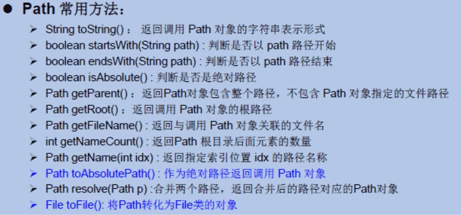


流的一层层封装，装饰者模式

区别：IO是面向流的，NIO是面向缓冲区的

三大核心部分：Channel(通道)，Buffer(缓冲区), Selector。

传统IO基于字节流和字符流进行操作，而NIO基于Channel和Buffer(缓冲区)进行操作，数据总是从通道读取到缓冲区中，或者从缓冲区写入到通道中。Selector(选择区)用于监听多个通道的事件（比如：连接打开，数据到达）。因此，单个线程可以监听多个数据通道。

### 1：Channel

与BIO中的stream差不多，只不过stream是单向的，而通道channel是双向的，其主要实现有：

FileChannel

DatagramChannel

SocketChannel

ServerSocketChannel

### 2：Buffer

### 3：selector

4：鲁班教学

服务器端：


客户端：


BIO的特点，阻塞

在不考虑多线程情况下，BIO无法处理并发

当一个阻塞时，其他客户端无法再连接到服务器了

可以开线程，每个添加一个线程，但是每来一个线程添加一个线程，耗费大，就像淘宝双11，但是有很多连接是不买东西的，qq很多连接不发消息，

设置不阻塞


设置为非阻塞：如果没人连接，打印，看已经连接的有没有发送


如果有人连接，放入list，遍历list看他有没有发送数据

NIO设置非阻塞：

ServerSocket变成ServerSocketChannel

Socket变成SocketChannel


13：AIO

Asynchronous IO：异步的，也称nio2

## 12：BIO，NIO 与AIO

1：Java对BIO、NIO、AIO的支持：

Java BIO (blocking I/O)：
同步并阻塞，服务器实现模式为一个连接一个线程，即客户端有连接请求时服务器端就需要启动一个线程进行处理，如果这个连接不做任何事情会造成不必要的线程开销，当然可以通过线程池机制改善。

Java NIO (non-blocking I/O)：
同步非阻塞，服务器实现模式为一个请求一个线程，即客户端发送的连接请求都会注册到多路复用器上，多路复用器轮询到连接有I/O请求时才启动一个线程进行处理。

Java AIO(NIO.2) (Asynchronous I/O) ：
异步非阻塞，服务器实现模式为一个有效请求一个线程，客户端的I/O请求都是由OS先完成了再通知服务器应用去启动线程进行处理，

:2：BIO、NIO、AIO适用场景分析:

BIO方式适用于连接数目比较小且固定的架构，这种方式对服务器资源要求比较高，并发局限于应用中，JDK1.4以前的唯一选择，但程序直观简单易理解。

NIO方式适用于连接数目多且连接比较短（轻操作）的架构，比如聊天服务器，并发局限于应用中，编程比较复杂，JDK1.4开始支持。

AIO方式使用于连接数目多且连接比较长（重操作）的架构，比如相册服务器，充分调用OS参与并发操作，编程比较复杂，JDK7开始支持。

BIO：磁盘-\>内核空间缓冲区-\>用户空间缓冲区

NIO：磁盘-\>用户空间缓冲区

IO是面向流的，NIO是面向缓冲区的

# 七：网络编程

## 1：TCP通信

### Socket类

该类实现客户端套接字，套接字指的是两台设备之间通讯的端点。

构造

`public Socket(String host, int port)` :创建套接字对象并将其连接到指定主机上的指定端口号。如果指定的host是null ，则相当于指定地址为回送地址。  

方法

* `public InputStream getInputStream()` ： 返回此套接字的输入流。
  * 如果此Scoket具有相关联的通道，则生成的InputStream 的所有操作也关联该通道。
  * 关闭生成的InputStream也将关闭相关的Socket。
* `public OutputStream getOutputStream()` ： 返回此套接字的输出流。
  * 如果此Scoket具有相关联的通道，则生成的OutputStream 的所有操作也关联该通道。
  * 关闭生成的OutputStream也将关闭相关的Socket。
* `public void close()` ：关闭此套接字。
  * 一旦一个socket被关闭，它不可再使用。
  * 关闭此socket也将关闭相关的InputStream和OutputStream 。 
* `public void shutdownOutput()` ： 禁用此套接字的输出流。   
  * 任何先前写出的数据将被发送，随后终止输出流。 

### ServerSocker类

这个类实现了服务器套接字，该对象等待通过网络的请求。

构造

`public ServerSocket(int port)` ：使用该构造方法在创建ServerSocket对象时，就可以将其绑定到一个指定的端口号上，参数port就是端口号。

方法

`public Socket accept()` ：侦听并接受连接，返回一个新的Socket对象，用于和客户端实现通信。该方法会一直阻塞直到建立连接。 


# 八：JDBC

# 九：特性

## 1：反射

**就是在运行时才知道要操作的类是什么，并且可以在运行时获取类的完整构造，并调用对应的方法。**


### 基本反射技术：

 **根据一个字符串得到一个类**

getClass方法

```java
 String name = "Huanglinqing";
 Class c1 = name.getClass();
 System.out.println(c1.getName());
//输出
//java.lang.String
```

**Class.forName**

```java
   String name = "java.lang.String";
   Class c1 = null;
   try {
          c1 = Class.forName(name);
          System.out.println(c1.getName());
      } catch (ClassNotFoundException e) {
  }
//输出
//java.lang.String
```

从这个简单的例子可以看出，一般情况下我们使用反射获取一个对象的步骤：

- 获取类的 Class 对象实例

```
Class clz = Class.forName("com.zhenai.api.Apple");
```

- 根据 Class 对象实例获取 Constructor 对象

```
Constructor appleConstructor = clz.getConstructor();
```

- 使用 Constructor 对象的 newInstance 方法获取反射类对象

```
Object appleObj = appleConstructor.newInstance();
```

而如果要调用某一个方法，则需要经过下面的步骤：

- 获取方法的 Method 对象

```
Method setPriceMethod = clz.getMethod("setPrice", int.class);
```

- 利用 invoke 方法调用方法

```
setPriceMethod.invoke(appleObj, 14);
```

### 获取类的成员

当类中方法定义为私有的时候我们能调用？不能！当变量是私有的时候我们能获取吗？不能！但是反射可以。比如源码中有你需要用到的方法，但是那个方法是私有的，这个时候你就可以通过反射去执行这个私有方法，并且获取私有变量。

**获取类的构造函数**

### 反射API

获取反射中的Class对象

在反射中，要获取一个类或调用一个类的方法，我们首先需要获取到该类的 Class 对象。

在 Java API 中，获取 Class 类对象有三种方法：

**第一种，使用 Class.forName 静态方法。**当你知道该类的全路径名时，你可以使用该方法获取 Class 类对象。

```
Class clz = Class.forName("java.lang.String");
```

**第二种，使用 .class 方法。**

这种方法只适合在编译前就知道操作的 Class。

```
Class clz = String.class;
```

**第三种，使用类对象的 getClass() 方法。**

```
String str = new String("Hello");
Class clz = str.getClass();
```


通过反射创建类对象

通过反射创建类对象主要有两种方式：通过 Class 对象的 newInstance() 方法、通过 Constructor 对象的 newInstance() 方法。

第一种：通过 Class 对象的 newInstance() 方法。

```
Class clz = Apple.class;
Apple apple = (Apple)clz.newInstance();
```

第二种：通过 Constructor 对象的 newInstance() 方法

```
Class clz = Apple.class;
Constructor constructor = clz.getConstructor();
Apple apple = (Apple)constructor.newInstance();
```

通过 Constructor 对象创建类对象可以选择特定构造方法，而通过 Class 对象则只能使用默认的无参数构造方法。下面的代码就调用了一个有参数的构造方法进行了类对象的初始化。

```
Class clz = Apple.class;
Constructor constructor = clz.getConstructor(String.class, int.class);
Apple apple = (Apple)constructor.newInstance("红富士", 15);
```


通过反射获取类属性、方法、构造器

我们通过 Class 对象的 getFields() 方法可以获取 Class 类的属性，但无法获取私有属性。

```
Class clz = Apple.class;
Field[] fields = clz.getFields();
for (Field field : fields) {
    System.out.println(field.getName());
}
```

输出结果是：

```
price
```

而如果使用 Class 对象的 getDeclaredFields() 方法则可以获取包括私有属性在内的所有属性：

```
Class clz = Apple.class;
Field[] fields = clz.getDeclaredFields();
for (Field field : fields) {
    System.out.println(field.getName());
}
```

输出结果是：

```
name
price
```

与获取类属性一样，当我们去获取类方法、类构造器时，如果要获取私有方法或私有构造器，则必须使用有 declared 关键字的方法。

### 源码解析

异常报错时的输出

可以看到异常堆栈指出了异常在 Method 的第 497 的 invoke 方法中，其实这里指的 invoke 方法就是我们反射调用方法中的 invoke。

```
Method method = clz.getMethod("setPrice", int.class); 
method.invoke(object, 4);   //就是这里的invoke方法
```


允许程序在执行期借助于反射API取得任何类的内部信息，并能直接操作任意对象的内部属性及方法。

加载完类后，在堆内存的方法区就产生一个Class类型的对象（一个类只有一个class对象）


### 1：Class实例

在Object类中定义了方法

Public final Class getClass（）

返回一个Class类，它是Java反射的源头

Class的常用方法

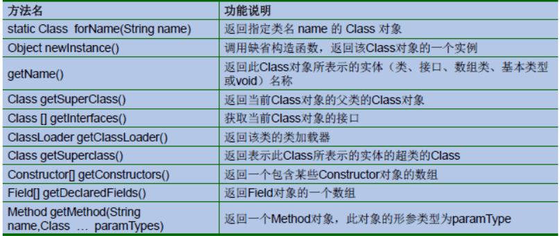

### 2：类的加载与ClassLoader

当程序主动使用某个类时，如果该类还未被加载到内存中，则系统会通过如下三个步骤对该类进行初始化


类加载器的作用：

类加载的作用：将class文件字节码内容加载到内存中，并将这些静态数据转换成方法区的运行时数据结构，然后在堆中生成一个代表这个类的java.lang.Class对象，作为方法区中类数据的访问入口。

类缓存：标准的JavaSE类加载器可以按要求查找类，但一旦某个类被加载到类加载器中，它将维持加载（缓存）一段时间。不过JVM垃圾回收机制可以回收这些Class对象。

在运行状态中，对于任意一个类，都能够知道这个类的所有属性和方法；对于任意一个对象，都能够调用它的任意一个方法和属性；这种动态获取的信息以及动态调用对象的方法的功能称为
Java 语言的反射机制。

反射机制：

1：代理模式的原理：使用一个代理将对象包装起来，然后用该代理对象取代原始对象，任何对原始对象的调用都要通过代理，代理对象决定是否以及何时将方法转移到原始对象

2：静态代理：

2.1举例：实现Runnable接口的方法创建多线程

Class MyThread implements Runnable{};//想当与被代理类

Class Thread implements Runnable{}//相当于代理类

Main（）{

Mythread t = new MyThread();

Thread thread = new Thread(t);

Thread.start();//启动线程，调用线程的run();

}

## 3：枚举

枚举类对象的属性不允许被改动，应该使用private
final修饰，且应在构造器中为其赋值。私有化构造器，保证不能在类外部创建对象

方法


## 4：注解Annotation

在代码中嵌入注解，再通过反射拿到

### 类型

内置注解：JDK内置的三个基本注解)

- @Override: 限定重写父类方法, 该注解只能用于方法


- @Deprecated: 用于表示所修饰的元素(类, 方法等)已过时。通常是因为所修饰的结构危险或存在更好的选择

- @SuppressWarnings: 抑制编译器警告

元注解：负责解释其他注解

- @Target：用于描述注解的使用范围，即：被描述的注解可以在什么地方使用

JDK1.8以后参数ElementType多了两个枚举值为TYPE_PARAMETER，USE

- @Retention：表示需要什么保存该注释信息，用于描述注解的生命周期
  - 级别范围：Source < Class < Runtime
- @Document：说明该注解被包含在java doc中
- @Inherited：说明子类可以集成父类中的注解


```java
/**
 * 定义一个注解
 */
@Target(value={ElementType.METHOD, ElementType.TYPE})  // target表示我们注解应用的范围，在方法上，和类上有效
@Retention(RetentionPolicy.RUNTIME)   // Retention：表示我们的注解在什么时候还有效，运行时候有效
@Documented   // 表示说我们的注解是否生成在java doc中
@Inherited   // 表示子类可以继承父类的注解
@interface MyAnnotation {
}
```


自定义注解：使用 `@interface`自定义注解

```java
/**
 * 定义一个注解
 */
@Target(value={ElementType.METHOD, ElementType.TYPE})  // target表示我们注解应用的范围，在方法上，和类上有效
@Retention(RetentionPolicy.RUNTIME)   // Retention：表示我们的注解在什么时候还有效，运行时候有效
@Documented   // 表示说我们的注解是否生成在java doc中
@Inherited   // 表示子类可以继承父类的注解
@interface MyAnnotation {

    // 注解的参数：参数类型 + 参数名()
    // 通过default来申明参数的默认值
    String name() default "";

    int age() default 0;

    // 如果默认值为-1，代表不存在
    int id() default -1;

    String[] schools();
}
```


## 5：泛型

1.5以后

把集合中的内容限定为一个特定的数据类型

**如果Foo 是Bar 的一个子类型(子类或者子接口)，而G 是某种**

**泛型声明，那么G\<Foo\>是G\<Bar\>的子类型并不成立!!**


### 5.2：泛型通配符

当使用泛型类或者接口时，传递的数据中，泛型类型不确定，可以通过通配符<?>表示。但是一旦使用泛型的通配符后，只能使用Object类中的共性方法，集合中元素自身方法无法使用。

### 5.3：受限泛型

之前设置泛型的时候，实际上是可以任意设置的，只要是类就可以设置。但是在JAVA的泛型中可以指定一个泛型的**上限**和**下限**。

**泛型的上限**：

* **格式**： `类型名称 <? extends 类 > 对象名称`
* **意义**： `只能接收该类型及其子类`

**泛型的下限**：

- **格式**： `类型名称 <? super 类 > 对象名称`
- **意义**： `只能接收该类型及其父类型`

```java
// 泛型的上限：此时的泛型?，必须是Number类型或者Number类型的子类
public static void getElement1(Collection<? extends Number> coll){}
// 泛型的下限：此时的泛型?，必须是Number类型或者Number类型的父类
public static void getElement2(Collection<? super Number> coll){}
```


# Java8

## 1：Lambda表达式

Lambda表达式的标准格式为：

(参数类型 参数名称) ‐\> { 代码语句 }

格式说明：

小括号内的语法与传统方法参数列表一致：无参数则留空；多个参数则用逗号分隔。对应于抽象方法的参数

\-\> 是新引入的语法格式，代表指向动作。

大括号内的语法与传统方法体要求基本一致。相当于对抽象方法的实现，函数式接口，只有一个抽象方法。


### 1.1：Lambda语法糖

匿名函数，由编译器推断并帮你

解决了什么？？

例一：

```java
TreeSet<Integer> set = new TreeSet<>(new Comparator<Integer>() {
    @Override
    public int compare(Integer o1, Integer o2) {
        return Integer.compare(o1,o2);
    }
});
```

去掉多余的一模一样的架子

```java
 TreeSet<Integer> set = new TreeSet<>((x,y)->Integer.compare(x,y));
```

例二：自定义


### 1.2：六大语法

->lambda操作符，左侧是lambda表达式的参数列表，右侧是所需执行的功能，依赖于函数式接口，lambda表达式即对接口的实现

函数式接口：

使用注解@FunctionalInterface，该接口只有一个方法

**语法1：无参无返回值**

```java
		//语法一：无参无返回值
		Runnable runnable = new Runnable() {
			@Override
			public void run() {
				System.out.println("输出某些东西");
			}
		};
		//简化实现
		Runnable runnable1 = ()->System.out.println("输出某些东西");
```

注意：匿名内部类使用外部的变量必须为final，无法改变，即使没有声明，也是final的

**语法二：有一个参数，无返回值**

```java
//语法二：有一个参数，无返回值
		Consumer<String> com = new Consumer<String>() {
			@Override
			public void accept(String s) {
				System.out.println(s);
			}
		};
		//简化实现
		//如果只有一个参数，(x)也可以直接写成x
		Consumer<String> com1 = (x)->{System.out.println(x);};
		com1.accept("有一个参数，无返回值,输出参数");
		
```

**语法三：多个参数，有返回值，多条执行语句**

```java
//语法三：多个参数，有返回值，多条执行语句
		Comparator<Integer> com2 = (x,y)->{
			System.out.println("执行某些操作");
			return Integer.compare(x,y);
		};
		//如果只有一条语句，return 和大括号都可以省略
		Comparator<Integer> com3 = (x,y)->Integer.compare(x,y);
		//语法六：参数指定类型
		//语法三依然可以执行，是因为JVM的上下文推断
		Comparator<Integer> com4 = (Integer x ,Integer y)->Integer.compare(x,y);
```


### 1.3：四大内置函数


 

### 1.4：方法引用和构造器引用

若lambda体中的内容由方法已经实现了，我们可以使用方法引用

语法一

对象::实例方法名

抽象方法的参数类型与参数引用的参数类型一致

```java
//以前
Employee emp = new Employee();
Supplier<String> sup = ()->emp.getName();
String str = sup.get();//供给型接口的get（）方法
System.out.println(str);

//现在:由于对象emp有实现
Supplier<Integer> sup2 = emp::getAge;
```

语法二

类：：静态方法名

```java
Comparator<Integer> com = (x,y)->Integer.compare(x,y);

Comparator<Integer> com = Integer::compare;
```

语法三

类：：实例方法名

当抽象方法第一个参数为实例方法的调用者，第二个参数为实例方法的参数

```java
//以前
BiPredicate<String,String> bp = (x,y)->x.equals(y);

//now
BigPrediacate<String,String> bp = String::equals;
```


构造器引用

需要调用的构造器参数列表与函数式的构造列表保持一致。

ClassName：：new

```java
//供给型
Supplier<Employee> sup = ()->new Employee();
//构造器引用方式,自动匹配无参构造器
Supplier<Employee> sup = Employee::new;
Employee emp = sup.get();
```

法二

```java
//函数形
Function<Integer,Employee> fun = (x)->new Employee(x);
//构造器引用，自动匹配有参构造器
Function<Integer,Employee> fun = Employee::new;
Employee emp = sup.apply(101);
```

数组引用

Type[]::new

```java
//函数型
Function<Integer,String[]> fun = (x)->new String[x];
String[] str = fun.apply(10);
System.out.println(str.length);

//数组引用
Function<Integer,String[]> fun = String[]::new;
String[] str = fun.apply(20);
System.out.println(str.length);
```

**lambda表达式与方法引用的取舍？**

优先使用lambdas表达式而不是匿名类

优先使用方法引用而不是lambdas

lambdas表达式能做到方法引用做不到的？？

lambdas表达式可以捕获外围词法的变量，但是方法引用不行，方法引用只能将其传进去。

方法引用更短更清楚的时候使用方法引用，，否则使用lambdas表示


## 2：Stream

字母哥的博客：你可能真的不懂java

Stream是Java8中处理集合的关键抽象概念，他可以指定你希望对集合进行的操作，可以执行非常复杂的查找，过滤和映射数据等操作。


接口的抽象方法的形参表，返回类型需要和调用的类方法的形参表，返回类型保持一致


### 2.1：获取流

1：可以通过Collection系列集合提供的stream()或者parallelStream()

```java
List<String> list = new ArrayList<>();
Stream<String> stream1 = list.stream();
```

2：通过Arrays中静态方法stream()获取数组流

```java
Employee[] emps = new Employee[10];
Stream<Employee> stream2 = Arrays.stream(emps);
```

3：通过Stream类的静态方法of()

```java
Stream<String> stream = Stream.of("aa","bb","cc");
```

4：创建无限流

```java
//迭代
Stream<Integer> stream = Stream.iterate(0,(x)->x+2);
Stream.limit(10).forEach(System.out::println);
//生成
Stream.generate(()->Math.random())

```


### 2.2：中间操作

中间操作不会执行任何操作其实，只有终止操作时才会一次性执行全部内容，成为惰性求值

#### 2.2.1：筛选与切片

Filter与谓词逻辑

谓词逻辑：比如sql语句中WHERE 和AND 限定了主语employee是什么，那么WHERE和AND语句所代表的逻辑就是谓词逻辑。

```java
//创建Employee类，并创建10个对象
List<Employee> employees = Arrays.asList(e1,e2,e3,e4,e5,e6,e7,e8);
List<Employee> employeeList = employees.stream()
    									.filter(e->e.getAge()>70 && e.getGender = 'M')
    									.collect(Collectors.toList());
```

limit(n);截断流，使元素不超过给定数量

```java
employee.stream()
    	.filter((e)->{
            System.out.println("!!");
            return e.getSalary()>5000;
        })
    	.limit(2)
    	.forEach(System.out::println);
//发现只执行两次，主要满足2个条件就就此截断
```

skip(n);跳过元素，返回一个扔掉前n个元素的流


distinct—筛选，通过流生成元素的hashCode()和equals()去除重复元素

#### 2.2.2：映射

map—接收lambda，将元素转换成其他形式或提取信息，接收一个函数作为参数，该函数会被应用到每个元素上。


map转换数据

```java
//类型转换
Stream.of("Monkey", "Lion", "Giraffe", "Lemur")
        .mapToInt(String::length)
        .forEach(System.out::println);
```

多步骤操作

```java
List<Employee> maped = employees.stream()
            .map(e -> {
                e.setAge(e.getAge() + 1);
                e.setGender(e.getGender().equals("M")?"male":"female");
                return e;
            }).collect(Collectors.toList());
//peek和map一样
List<Employee> maped = employees.stream()
    .peek(e -> {
        e.setAge(e.getAge() + 1);
        e.setGender(e.getGender().equals("M")?"male":"female");
    }).collect(Collectors.toList());
```


flatmap()处理多维数组

flatMap()接收一个函数作为参数，将流中的每个值都换成另一个流，然后把所有的流连接成一个流

```java
//取出每个字符
public static Stream<Character> filterCharacter(String str){
    List<Character> list = new ArrayList<>();
    for(Character ch:str.toCharArray()){
        list.add(ch);
    }
    return list.stream();
}
public static main(String[] args){
    Stream<Stream<Character>> stream = list.stream().map(this::filterCharacter);
    stream.forEach((sm)->{
        sm.forEach(System.out::println);
    });
}
```

使用flatMap

```java
Stream<Character> sm = list.stream()   						.flatMap(this::filterCharacter);

```


#### 2.2.3：排序

sorted()——自然排序（Comparable）

sorted（Comparator com）——定制排序

```java
list.stream()
    .sorted()
    .forEach(System.out::println);

emp.stream()
    .sorted((e1,e2)->{
        if(e1.getAge().equals(e2.getAge())){
            return e1.getName().comparaTo(e2.getName());
        }else{
            return e1.getAge.compareTO(e2.getAge());
        }
    }).forEach(System.out::println);
```


#### Stream API代替for循环

例：

```java
List<String> nameStrs = Arrays.asList("Monkey","Lion","Giraffe","Lemur");
List<String> list = nameStrs.stream()
    						.filter(s->s.startsWith("L"))//过滤以L开头的
    						.map(String::toUpperCase)//map即对每个数据进行处理：调用String类的toUpperCase方法
    						.sorted()//排序
    						.collect(toList());//转换为list

//数组转换成流
String[] nameStrs1 = {"Monkey","Lion","Giraffe","Lemur"};

Stream.of(nameStrs1).filter(s->s.startsWith("L")).map(String::toUpperCase);

//Set
Set<String> set = new HashSet<>(nameStrs);
set.stream().filter(……)

//文件
	Stream<String> stringStream = Files.lines(Paths.get("file.txt"));
    
```

遍历二维数组

```java
        Arrays.stream(result2).forEach(arr->{
            Arrays.stream(arr).filter(i->i!=0).forEach( i ->System.out.print(i));
            System.out.println();
        });
```

问题？？

对于如下两个for循环，怎么改造？效率低了吗？

```java
        for (int j = 0; j < n; j++) {
            result[j][0] = 1;
        }
        for (int i = 1; i < n; i++) {
            for (int j = 1; j < n; j++) {
                result[i][j] =  result[i-1][j-1] + result[i-1][j];
            }
        }
```


#### 


有状态操作

```java
//取前两个
List<String> limitN = Stream.of("Monkey", "Lion", "Giraffe", "Lemur")
        .limit(2)
        .collect(Collectors.toList());
//跳过前两个
List<String> skipN = Stream.of("Monkey", "Lion", "Giraffe", "Lemur")
        .skip(2)
        .collect(Collectors.toList());
//去重
List<String> uniqueAnimals = Stream.of("Monkey", "Lion", "Giraffe", "Lemur", "Lion")
        .distinct()
        .collect(Collectors.toList());
```

并行不要用有状态操作

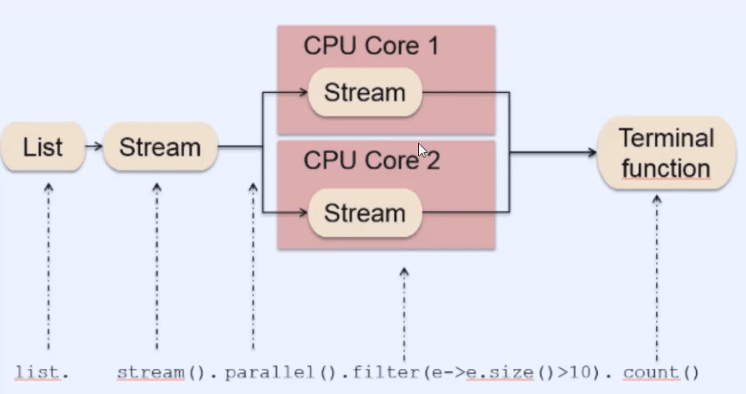

#### 并行操作

```java
Stream.of("Monkey", "Lion", "Giraffe", "Lemur", "Lion")
        .parallel()
        .forEach(System.out::println);
```


### 2.3：终端操作

#### 2.3.1：查找与匹配

allMatch()——检查是否匹配所有元素，返回boolean

```java
//是否所有元素的状态都是BUSY
boolean b = emplist.stream()
    .allMatch((e)->e.getStatus().equals(Status.BUSY));
```

anyMatch——检查是否至少匹配一个元素

```java
//是否存在状态为BUSY的元素
boolean b = emplist.stream()
    		.anyMatch((e)->e.getStatus().equals(Status.BUSY));
```

noneMatch——检查是否没有匹配所有元素

```java
//是否没有状态为BUSY的元素
boolean b = emplist.stream()
    		.noneMatch((e)->e.getStatus().equals(Status.BUSY));
```

findFirst——返回第一个元素

```java
//工资最高的
Optional<Employee> op = emplist.stream()
    	.sorted((e1,e2)->Double.compare(e1.getSalary(),e2.getSalary()))
    .findFirst();
```

findAny——返回当前流中任意元素

count——返回流中元素总个数

max——返回流中最大值

min——返回流中最小值


#### 2.3.2：归约

`Stream.reduce`可以将流中元素反复结合起来，得到一个值。

用来实现集合元素的归约。reduce函数有三个参数：

- *Identity标识*：一个元素，它是归约操作的初始值，如果流为空，则为默认结果。
- *Accumulator累加器*：具有两个参数的函数：归约运算的部分结果和流的下一个元素。
- *Combiner合并器（可选）*：当归约并行化时，或当累加器参数的类型与累加器实现的类型不匹配时，用于合并归约操作的部分结果的函数

Integer类型归约

reduce初始值为0，累加器可以是[lambda](http://www.zimug.com/tag/lambda)表达式，也可以是方法引用。

```java
List<Integer> numbers = Arrays.asList(1, 2, 3, 4, 5, 6);
int result = numbers
        .stream()
        .reduce(0, (subtotal, element) -> subtotal + element);
System.out.println(result);  //21

int result = numbers
        .stream()
        .reduce(0, Integer::sum);
System.out.println(result); //21
```

String类型归约

不仅可以归约Integer类型，只要累加器参数类型能够匹配，可以对任何类型的集合进行归约计算。

```java
List<String> letters = Arrays.asList("a", "b", "c", "d", "e");
String result = letters
        .stream()
        .reduce("", (partialString, element) -> partialString + element);
System.out.println(result);  //abcde

String result = letters
        .stream()
        .reduce("", String::concat);
System.out.println(result);  //ancde
```

对象归约

```java
List<Employee> employees = Arrays.asList(e1, e2, e3, e4, e5, e6, e7, e8, e9, e10);

Integer total = employees.stream().map(Employee::getAge).reduce(0,Integer::sum);
System.out.println(total); //346
```

#### 2.3.3：收集

调用完终端操作就不能再用了，流已经关闭了

collect——将流转换为其他形式，接收一个Collector接口的实现，用于给Stream中元素汇总的方法。


```java
//打印
Stream.of("Monkey", "Lion", "Giraffe", "Lemur", "Lion")
        .parallel()
        .forEach(System.out::println);
Stream.of("Monkey", "Lion", "Giraffe", "Lemur", "Lion")
        .parallel()
        .forEachOrdered(System.out::println);
//收集
.collect(Collectors.toSet());
.collect(Collectors.toList());
.collect(Collectors.toCollection(LinkedList::new));
.toArray(String[]::new);
.collect(Collectors.toMap(
       Function.identity(),   //元素输入就是输出，作为key
       s -> (int) s.chars().distinct().count()// 输入元素的不同的字母个数，作为value
));
// 最终toMap的结果是: {Monkey=6, Lion=4, Lemur=5, Giraffe=6} 
.collect(Collectors.groupingBy(
       s -> s.charAt(0) ,  //根据元素首字母分组，相同的在一组
       // counting()        // 加上这一行代码可以实现分组统计
));

// 最终groupingByList内的元素: {G=[Giraffe], L=[Lion, Lemur, Lion], M=[Monkey]}
//如果加上counting() ，结果是:  {G=1, L=3, M=1}
boolean containsTwo = IntStream.of(1, 2, 3).anyMatch(i -> i == 2);
// 判断管道中是否包含2，结果是: true

long nrOfAnimals = Stream.of(
    "Monkey", "Lion", "Giraffe", "Lemur"
).count();
// 管道中元素数据总计结果nrOfAnimals: 4

int sum = IntStream.of(1, 2, 3).sum();
// 管道中元素数据累加结果sum: 6

OptionalDouble average = IntStream.of(1, 2, 3).average();
//管道中元素数据平均值average: OptionalDouble[2.0]

int max = IntStream.of(1, 2, 3).max().orElse(0);
//管道中元素数据最大值max: 3

IntSummaryStatistics statistics = IntStream.of(1, 2, 3).summaryStatistics();
// 全面的统计结果statistics: IntSummaryStatistics{count=3, sum=6, min=1, average=2.000000, max=3}
```

### 2.4：并行流

#### 对于stream性能方面

1：测试性能的方法

使用  junitperf

int的是for循环效率更高，否则更高


函数式接口Comparator

 Stream查找匹配规则

并行流

```java
Integer total2 = employees
        .parallelStream()
        .map(Employee::getAge)
        .reduce(0,Integer::sum,Integer::sum);  //注意这里reduce方法有三个参数

System.out.println(total); //346
```


## 3：空指针异常optional


## 4：接口中的默认方法和静态方法

接口中以前只能有全局静态常量和抽象方法

现在可以拥有默认方法

```java
public interface MyFun{
    default String getName(){
        return "1234";
    }
}
```

这样就会出现冲突

接口默认方法的“类优先”原则，优先继承


静态方法

```java
public interface MyFun{
    default String getName(){
        return "1234";
    }
    public static void show(){
        System.out.println("静态方法");
    }
}
```

## 5：全新日期与时间

不可变的，线程安全，都在java.time包下

距离1970年的毫秒数

5.1

日期：LocalDate  : 时间：LocalTime  :日期时间：LocalDateTime

三个类的方法大体一样，以最全的LocalDateTime为例

```java
//获取当前系统时间
LocalDateTime ldt = LocalDateTime.now();
System.out.println(ldt);
//输出：2020-12-02T09:11:37.247
```

构造时间

```java
LocalDateTime ldt = LocalDateTime.of(2020,12,01,13,22,33);
System.out.println(ldt);
//输出：2020-12-01T13:22:33
```

加时间，减时间

```java
// 在该日期时间基础上增加或减少一定时间，
// 参数1：时间量，可以是负数，参数2:时间单位
LocalDateTime plus = parse.plus(1L, ChronoUnit.HOURS); // 2019-10-17T17:54:50.941
// LocalDateTime plus(TemporalAmount amountToAdd)：在该时间基础上增加一定时间
LocalDateTime plus1 = parse.plus(Period.ofDays(1)); // 2019-10-18T16:54:50.941
LocalDateTime plus2 = parse.plusDays(1L); // 2019-10-18T16:54:50.941
		// LocalDateTime    plusDays(long days)：增加指定天数
        // LocalDateTime	plusHours(long hours)：增加指定小时数
        // LocalDateTime	plusMinutes(long minutes)：增加指定分钟数
        // LocalDateTime	plusMonths(long months)：增加指定月份数
        // LocalDateTime	plusNanos(long nanos)：增加指定毫秒数
        // LocalDateTime	plusSeconds(long seconds):增加指定秒数
        // LocalDateTime	plusWeeks(long weeks):增加指定周数
        // LocalDateTime	plusYears(long years):增加指定年数
```

//获取拆分

```java
ldt.getYear();
ldt.getMonthValue();
ldt.getDayOfMonth();
ldt.getHour();
ldt.getMinute();
ldt.getSencond();
```

5.2：Instant时间戳

以unix元年：1970年1月1日到某个时间之间的毫秒值

```java
Instant ins = Instant.now();//默认获取的不是系统时间，而是格林威治时区时间
System.out.println(ins);
//偏移量,偏移8个时区
OffsetDateTime odt = ins.atOffset(ZoneOffset.ofHours(8));
System.out.println(odt);
//输出：2020-12-01T13:22:33+8:00
//获取毫秒时间
System.out.println(ins.toEpochMilli());   
```


## 6：重复注解和类型注解


## 3：HashMap的实现

当碰撞达到一定的设置值（默认碰撞长度为8，总长度大于64）时，会将链表转换成红黑树

红黑树，除了插入其他操作都比链表快，扩容时元素位置变到

ConcurrentHashMap同样也变了

以前使用锁分段机制，现在使用CAS算法


## 4：JVM结构的变化

元空间——OOM发生的几率就低了

## 


## 


# Java9

从此以后六个月迭代一次，小步快跑，快速迭代。 

官方提供的新特性列表：

https://docs.oracle.com/javase/9/whatsnew/toc.htm\#JSNEW-GUID-C23AFD78-C777-460B-8ACE-58BE5EA681F6

或参考OpenJDK

http://openjdk.java.net/projects/jdk9/

在线OracleJDK9Documentation

https://docs.oracle.com/javase/9/

## 1：下载安装

与以前版本不冲突，安装jdk并安装jre

配置环境变量

## 1：目录结构的改变

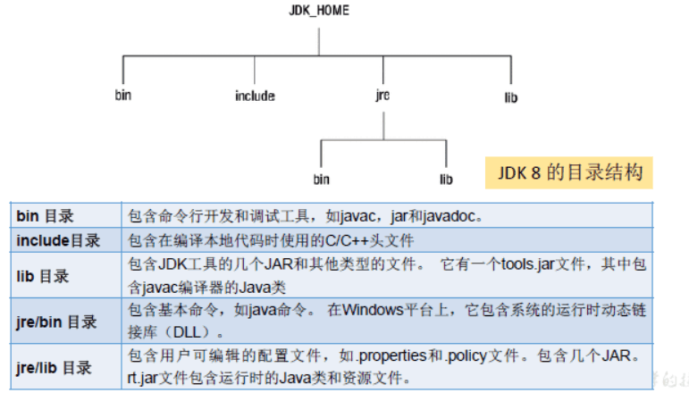


不包含jre目录了

## 2：模块系统

最大变化之一引入模块系统（Jigsaw项目）—>

运行环境的碰撞与臃肿，需要加载rt.jar

减少内存消耗

对外暴露

java9demo模块


在引入模块


## 3：REPL工具：jShell命令

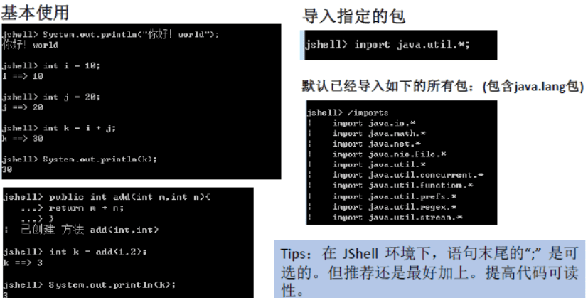

REPL（read-evaluate-print-loop）交互式编程环境

bin目录下jshell.exe

配好环境变量后

cmd输入jshell

输出：

定义变量

定义方法：

如果定义一个已经存在的方法则直接修改原本的方法

```jshell
/edit add
```

可以直接修改add方法

tab键补全

从外部文件加载源代码

/open 文件路径


受检异常

编译前异常，比如IOExcetption

jshell直接隐藏处理了

## 4：多版本兼容jar包

向后兼容


## 5：接口的私有方法

接口中放啊的访问权限修饰符可以声明为private的了


```java
//声明私有方法

```


抽象类和接口的异同

1：声明的方式

2：内部结构

3：共同点

不能实例化，以多态的方式使用

4：不同点

单继承，多实现

## 6：钻石操作符的使用升级

即泛型

```java
//JDK7
Set<String> set = new HashSet<String>();
//JDK8可以进行类型推断
Set<String> set = new HashSet<>();
//JDK9中能够与匿名实现类共同使用钻石操作符
Set<String> set = new HashSet<>(){};
```


匿名实现类与钻石操作符共同使用在8中会报错，Java9可以


## 7：try语句优化

流资源的关闭

JDK7以前

```java
InputStreamReader reader = null;
try{
    reader = new InputStreamReader(System.in);
    //读取数据的过程
    reader.read();
}catch(IOException e){
    e.printStackTrace();
}finally{
    //资源的关闭操作
    if(reader!=null){
        try{
            reader.close();
        }catch(IOException e){
            e.printStackTrace();
        }
    }
}
```

JDK8在try中声明的资源会自动关闭，不用显示处理资源的关闭，必须在资源对象实例化必须放在try（）中

```java
try(InputStreamReader reader = new InputStreamReader(System.in)){
    reader.read();
}catch(IOException e){
    e.printStackTrace();
}
```

JDK9支持在外部声明资源文件,此时的reader是final的，不可再被赋值。而且可以传多个，然后用；分开

```java
InputStreamReader reader = new InputStreamReader(System.in);
OutputStreamReader writer = new OutputStreamWriter(System.in);
try(reader;writer){
    reader.read();
}catch(IOException e){
    e.printStackTrace();
}
```

## 8：下划线

String _是不允许的，是一个特殊的关键字

## API层面

## 9：String

JDK8以前String以前是char[]存储的，每个是两个字节

JDK9使用byte[]数组，并使用encodeFlag标记编码类型，防止中文等两个字节存储

UTF-16存储都是两个字节

StringBuilder和StringBuffer也是做了同样的改变。

问题：String，StringBuilder和StringBuffer？

## 10：集合

创建只读集合，不可改变的集合

```java
//调用Collection中方法，将list变成只读的
List<String> newList = Collections.unmodifiablelist(list);
//遍历JDK8
newList.forEach(System.out::println);
```

//对只读Map的创建

```java
//匿名子类和泛型可以一起使用
Map<Object,Object> map = COllections.unmodifiableMap(new HashMap<>(){
    {
        put("1",1);
        put("2",2);
        put("3",3);
    }
})
 //遍历
map.forEach((k,v)->System.out.println(k + ":" + v));
```

//JDK9中提供了更加方便的只读集合方法

```java
//创建只读list
List<Integer> list = List.of(1,2,3);
list.forEach(System.out::println);
//创建只读Set
Set<Integer> set = Set.of(2,3,4);
//创建只读Map法一
Map<String,Integer> map = Map.of("1",1,"2",2,"3",3);
//创建只读Map法二
Map<String,Integer> map = Map.ofEntries(Map.entry("1",1),Map.entry("2",2));
```

## 11：增强的StreamAPI

JDK9中针对Stream中添加了四个方法

1：takeWhile()：一直取直到满足条件就不取了，不同于filter

```java
List<Integer> list = Arrays.asList(1,2,3,4,5,6,7,8);
Stream<Integer> stream = list.stream();
stream.takeWhile(x-x<5).forEach(System.out::println);
//此时输出为：1,2,3,4
```

2：dropWhile()：与takeWhile正好相反

```java
List<Integer> list = Arrays.asList(1,2,3,4,5,6,7,8);
Stream<Integer> stream = list.stream();
stream.dropWhile(x-x<5).forEach(System.out::println);
//此时输出为：5,6,7,8
```

3：ofNullable

Java8中Stream不能完全为null，否则会报空指针异常。而Java9中可以使用ofNullable方法创建一个单元素

```java
//Stream其中一种实例化方法of

Stream<Integer> stream = Stream.of(1,2,3，null);
//此时没有问题
stream.forEach(System.out::println);

//如果单元素且为null就会报空指针异常
Stream<Object> stream = Stream.of(null);

//JDK9中可以创建
Stream<String> stream = Stream.ofNullAble("Tom");
System.out.println(stream.count());//输出1
Stream<String> stream = Stream.ofNullAble(null);
System.out.println(stream.count());//输出0
```

4：iterator()的重载

Stream的实例化方法：

通过集合的stream()

通过数组工具类Arrays

Stream中静态方法of

iterator()/gen

```java
//JDK8中
Stream.iterator(0,x->x+1).limit(10).forEach(System.out::println);
//输出0 1 2 3 4 5 6 7 8 9
//JDK9中对其进行重载，添加一个判定条件
Stream.iterate(0,x->x<10,x->x+1).forEach(System.out::println);
```


## 12：optional的变化

可以转换成stream

```java
Optional<List<String>> optional = Optional.ofNullable(list);

Stream<String> stream = optional.stream().flatMap(x->x.stream());
stream.forEach(System.out::println);
```

## 13：高分辨率图像API

## 14：全新的HTTP客户端API

2015年推出HTTP2

HTTP1.1和HTTP2的主要区别在哪里？

区别在如何在客户端和服务器之间构件和传输数据

Http1依赖于请求响应周期，Http2允许服务器push数据，它可以发送比客户端请求更多的数据，这使得他可以优先处理并发送对于首先加载网页至关重要的数据

```java
//JDK9中可以使用HttpClient替换原有的HttpURLConnection
HttpClient client = HttpClient.newHttpClient();
HttpRequest req = HttpRequest.newBuilder(URL.create("http://www.baidu.com")).GET().build();
HttpResponse<String> response = null;
response = client.send(req,HttpResponse.BodyHandler.asString());
System.out.println(response.statusCode());
System.out.println(response.version.name());
System.out.println(response.body());
```

## 15：Deprecated的API

抛弃了几个不常用的API，主要是Applet API

## 16：智能Java编译工具

sjavac 慢慢代替javac

## 17：统一的JVM日志系统

G1作为了默认垃圾回收器

# Java10

## 1：局部变量类型推断

var ：JDK10中提供的保留类型

只针对局部变量

var 是保留类型不是关键字，意味着我们还可以用var 来定义变量名和方法名

```java
public static void main(String[] args){
    var i =10;
    var str = "abc";
    var list = new ArrayList<>();
    list.add("test");
    
    var set = new HashSet<>();
    
    var user = new User();  
}
```

注意：不允许赋值为null

```java
var aa = null;//错误
```


## 2：垃圾收集器的优化

Java9的改变

新生代：ParNew

老年代：Paraller Old

JDK10：G1（Grabage -First）收集器：全收集器，既可以收集新生代又可以收集老年代。

分析工具


## 3：新增的API功能

### 3.1：copyOf()方法

在List，Set和Map下新增了copyOf方法

拷贝后的集合不可修改

且是根据其迭代顺序拷贝的

### 3.2：Java.io.ByteArrayOutStream::toString(Charset)

对toString进行重载，可以指定编码，默认使用UTF-8

```java
String str = "中文测试";
//将str以GBK编码转换成Byte转换成流
ByteArrayInputStream bis = new ByteArrayInputStream(str.getByte("GBK"));

ByteArrayOutStream bos = new ByteArrayOutStream();

int c =0;
while((c=bis.read())!=-1){
    bos.write(c);
}
System.out.println(bos.toString());
System.out.println(bos.toString("GBK"));
```


### 3.3：PrintStream和PrintWrite新增构造方法


### 3.4：Reader::transferTo


### 3.5：Scanner和Formatter新增构造方法


# Java11

长期支持的版本 

## 1：新增字符串处理方法


## 2：全新HTTP客户端API


## 3：Epsilon垃圾收集器

开发一个处理内存分配但不实现任何实际内存回收的机制的GC


## 3：全新垃圾收集器ZGC

可伸缩的，低延迟的！！初始只支持64位，支持TB级的，

热对象置于DRAM

冷对象置于NVMe闪存

ZGC是一个并发，基于region，压缩型的垃圾收集器，只有root扫描阶段会STW（所有线程暂停），因此GC停顿时间不会随着堆的增长和存活对象的增长而变长。

用法：-XX：+UnlockExperimentalVMOptions -XX:+UseZGC

在Window中暂时没有提供

由oracle开发，承诺在数TB的堆上具有非常低的暂停时间，多层堆（即热对象置于DRAM和冷对象置于NVMe闪存），压缩堆

SWT阶段：应用程序线程被暂停，以便gc执行其工作。
当应用程序因为GC暂停时，这通常是由于Stop The World阶段。

ZGC给Hotspot Garbage Collectors增加了两种新技术：着色指针和读屏障。

### 着色指针

着色指针是一种将信息存储在指针（或使用Java术语引用）中的技术。因为在64位平台上（ZGC仅支持64位平台），指针可以处理更多的内存，因此可以使用一些位来存储状态。
ZGC将限制最大支持4Tb堆（42-bits），那么会剩下22位可用，它目前使用了4位：
finalizable， remap， mark0和mark1。

着色指针的一个问题是，当您需要取消着色时，它需要额外的工作（因为需要屏蔽信息位）。

### 多重映射

### 读屏障

读屏障是每当应用程序线程从堆加载引用时运行的代码片段（即访问对象上的非原生字段non-primitive
field）：

# Java12

2019年3月20日

## 1：Switch表达式

缺点：

忘了break都会执行，

在各个case中定义的局部变量名不可重复

新的switch表达式

可以返回值

```java
switch(fruit){
        //不再写break，直接跳
        case PEAR->System.out.println("1");
        //多个一样的可以放在一起
        case APPLE,GRAPE,MANGO->System.out.println("2");
        default->new IllegalStateException("No Such Fruit");
}
```

## 2：shenandoah GC低停顿时间的GC

省得我

与堆大小无关，吞吐量有限的原则


新生代内存空间较小，所以暂停的时间可以接受，但是一旦老年代出现FullGC，线程暂停的时间就会更久

工作原理：

其内存结构与 G1 非常相似，都是将内存划分为类似棋盘的region。整体流程与 G1 也是比较相似的，最大的区别在于实现了并发的 疏散(Evacuation) 环节，引入的 BrooksForwarding Pointer 技术使得 GC 在移动对象时，对象引用仍然可以访问。

Shenandoah GC 工作周期如下所示：


上图对应工作周期如下：
1. Init Mark 启动并发标记 阶段
2. 并发标记遍历堆阶段
3. 并发标记完成阶段
4. 并发整理回收无活动区域阶段
5. 并发 Evacuation 整理内存区域阶段
6. Init Update Refs 更新引用初始化 阶段
7. 并发更新引用阶段
8. Final Update Refs 完成引用更新阶段
9. 并发回收无引用区域阶段

推荐几个配置或调试 Shenandoah 的 JVM 参数:

```xml
-XX:+AlwaysPreTouch：使用所有可用的内存分页，减少系统运行停顿，为避免运行时性能损失。
-Xmx == -Xmsv：设置初始堆大小与最大值一致，可以减轻伸缩堆大小带来的压力，与 AlwaysPreTouch 参数配
合使用，在启动时提交所有内存，避免在最终使用中出现系统停顿。
-XX:+ UseTransparentHugePages：能够大大提高大堆的性能，同时建议在 Linux 上使用时将
/sys/kernel/mm/transparent_hugepage/enabled 和
/sys/kernel/mm/transparent_hugepage/defragv 设置为：madvise，同时与 AlwaysPreTouch 一起使
用时，init 和 shutdownv 速度会更快，因为它将使用更大的页面进行预处理。
-XX:+UseNUMA：虽然 Shenandoah 尚未明确支持 NUMA（Non-Uniform Memory Access），但最好启用此功
能以在多插槽主机上启用 NUMA 交错。与 AlwaysPreTouch 相结合，它提供了比默认配置更好的性能。
-XX:+DisableExplicitGC：忽略代码中的 System.gc() 调用。当用户在代码中调用 System.gc() 时会强制
Shenandoah 执行 STW Full GC ，应禁用它以防止执行此操作，另外还可以使用 -
XX:+ExplicitGCInvokesConcurrent，在 调用 System.gc() 时执行 CMS GC 而不是 Full GC，建议在有
System.gc() 调用的情况下使用。
不过目前 Shenandoah 垃圾回收器还被标记为实验项目，如果要使用Shenandoah GC需要编译时--with-jvmfeatures
选项带有shenandoahgc，然后启动时使用参数
-XX:+UnlockExperimentalVMOptions -XX:+UseShenandoahGC
```

## 3：常量API

## 4：微基准测试套件

JMH，即Java Microbenchmark Harness，是专门用于代码微基准测试的工具套件。何谓Micro Benchmark呢？简
单的来说就是基于方法层面的基准测试，精度可以达到微秒级。当你定位到热点方法，希望进一步优化方法性能的时
候，就可以使用JMH对优化的结果进行量化的分析。
 JMH比较典型的应用场景：
想准确的知道某个方法需要执行多长时间，以及执行时间和输入之间的相关性；
对比接口不同实现在给定条件下的吞吐量；
查看多少百分比的请求在多长时间内完成；

JMH的使用
要使用JMH，首先需要准备好Maven环境，JMH的源代码以及官方提供的Sample就是使用Maven进行项目管理的，
github上也有使用gradle的例子可自行搜索参考。使用mvn命令行创建一个JMH工程：
如果要在现有Maven项目中使用JMH

```cmd
mvn archetype:generate \
        -DinteractiveMode=false \
        -DarchetypeGroupId=org.openjdk.jmh \
        -DarchetypeArtifactId=jmh-java-benchmark-archetype \
        -DgroupId=co.speedar.infra \
        -DartifactId=jmh-test \
        -Dversion=1.0
```


只需要把生成出来的两个依赖以及shade插件拷贝到项目的pom中即可：

## 5：只保留一个 AArch64 实现

Java 12 中将删除由 Oracle 提供的 arm64端口相关的所有源码，即删除目录 open/src/hotspot/cpu/arm 中关于
64-bit 的这套实现，只保留其中有关 32-bit ARM端口的实现，余下目录的 open/src/hotspot/cpu/aarch64 代码
部分就成了 AArch64 的默认实现。这将使开发贡献者将他们的精力集中在单个 64 位 ARM 实现上，并消除维护两套实现所需的重复工作。

## 6：默认生成类数据共享(CDS)归档文件

## 7：可中断的 G1 Mixed GC

G1垃圾收集器设计的主要目标之一是满足用户设置的预期的 JVM 停顿时间

G1 收集器必须完成收集集合的所有区域中的所有活动对象之后才能停止；但是如果收集器选择过大
的 GC 回收集，此时的STW时间会过长超出目标pause time。

将 GC 回收集拆分为必需和可选部分时，垃圾收集过程优先处理必需部分。同时，需要为可选 GC 回收集部分维
护一些其他数据，这会产生轻微的 CPU 开销，但小于 1 ％的变化，同时在 G1 回收器处理 GC 回收集期间，本
机内存使用率也可能会增加，使用上述情况只适用于包含可选 GC 回收部分的 GC 混合回收集合。
在 G1 垃圾回收器完成收集需要必需回收的部分之后，如果还有时间的话，便开始收集可选的部分。但是粗粒度
的处理，可选部分的处理粒度取决于剩余的时间，一次只能处理可选部分的一个子集区域。在完成可选收集部
分的收集后，G1 垃圾回收器可以根据剩余时间决定是否停止收集。如果在处理完必需处理的部分后，剩余时间
不足，总时间花销接近预期时间，G1 垃圾回收器也可以中止可选部分的回收以达到满足预期停顿时间的目标。

## 8：增强G1，自动返回未用堆内存给操作系统

# Java13

## 1：switch表达式增加yield

用于返回值

```java
String x = "3";
int i = switch (x) {
	case "1" -> 1;
	case "2" -> 2;
	default -> {
		yield 3;
	}
};
System.out.println(i);
```

## 2：文本块

对于一些html文本或则sql语句，拼接四问题

```java
//原来的html拼接
String html = "<html>\n" +
                " <body>\n" +
                " <p>Hello, World</p>\n" +
                " </body>\n" +
                "</html>\n";
//原本的SQL
String query = "select employee_id,last_name,salary,department_id\n" +
                "from employees\n" +
                "where department_id in (40,50,60)\n" +
                "order by department_id asc";
//JDK13html拼接
String html1 = """
                <html>
                <body>
                <p>Hello, world</p>
                </body>
                </html>
			  """;
//JDK13的SQL拼接
String newQuery = """
                select employee_id,last_name,salary,department_id
                from employees
                where department_id in (40,50,60)
                order by department_id asc
				""";
```

开始分隔符是由三个双引号字符（"""），后面可以跟零个或多个空格，最终以行终止符结束。文本块内容
以开始分隔符的行终止符后的第一个字符开始。
结束分隔符也是由三个双引号字符（"""）表示，文本块内容以结束分隔符的第一个双引号之前的最后一个
字符结束。


注意：

编译器在编译时会删除掉这些多余的空格。不过行前有没有空格在于终止符的位置

转义字符

```java
//错误
String d = """
			abc \ def
			"""; // 含有未转义的反斜线
```

文本框连接

```java
String code = """
        public void print(""" + type + """
            o) {
            	System.out.println(Objects.toString(o));
            }
		""";
```

更简洁的替代方法是使用String :: replace或String :: format，比如：

```java
String code = """
        public void print($type o) {
        	System.out.println(Objects.toString(o));
        }
		""".replace("$type", type);
String code = String.format("""
        public void print(%s o) {
        	System.out.println(Objects.toString(o));
        }
		""", type);           
```

另一个方法是使用String :: formatted，这是一个新方法，比如：

```java
String source = """
        public void print(%s object) {
        	System.out.println(Objects.toString(object));
        }
		""".formatted(type);
```

## 3：动态CDS档案（动态类数据共享归档）

## 4：ZGC:取消使用未使用的内存

## 5：重新实现旧版套接字API


更简洁的替代方法是使用String :: replace或String :: format，比如：
另一个方法是使用String :: formatted，这是一个新方法，比如：
String code = "public void print(Object o) {" +
"""
System.out.println(Objects.toString(o));
}
""";

String code = """
public void print(Object o) {
System.out.println(Objects.toString(o));
}
""";
1
2
3
4
5
String code = """
public void print(""" + type + """
o) {
System.out.println(Objects.toString(o));
}
""";
1
2
3
4
5
6
String code = """
public void print($type o) {
System.out.println(Objects.toString(o));
}
""".replace("$type", type);
1
2
3
4
5
String code = String.format("""
public void print(%s o) {
System.out.println(Objects.toString(o));
}
""", type);

String source = """
public void print(%s object) {
System.out.println(Objects.toString(object));
}
""".formatted(type);

# 面试题：

1：实现拷贝文件工具类使用字节流还是字符流？

字节流（图片，声音，图像）

