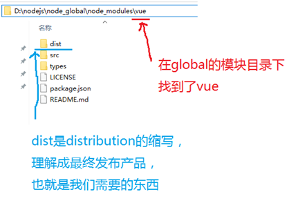
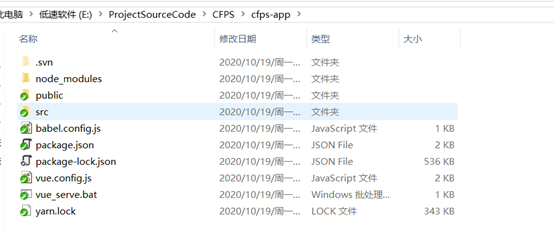
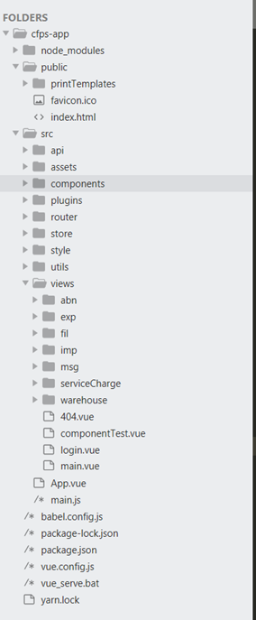
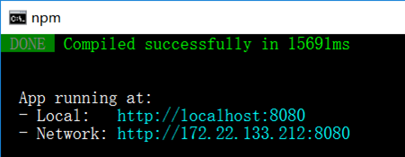
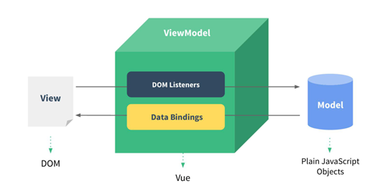
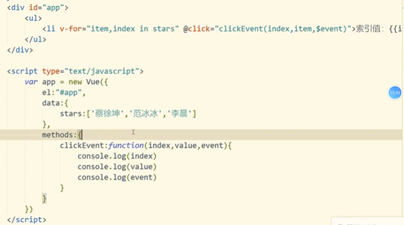
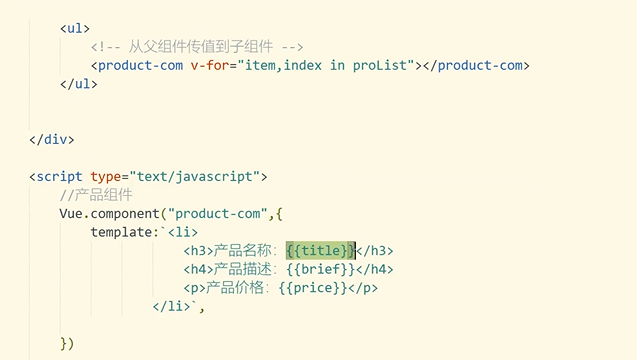

# 第1章：安装与使用

## 1：安装

先安装nodejs

安装npm，但是npm有点慢，安装淘宝镜像cnpm

```cmd
#查看版本
$npm -v
# 升级或安装 cnpm
npm install cnpm -g
# 安装VUE：
npm install -g vue-cli
```

使用

                          

安装vue-router

npm install vue-router –g

## 2：运行项目

1：从某处download下一个项目，项目结果大体如下





目录说明：

1：assets——静态资源，如css，js

2：components——公共组件

（一些可复用，非独立的页面），当然开发者也可以在 components 中直接创建完整页面。

3：router——路由文件

4：App.vue——根组件

一个vue页面通常由三部分组成:模板(template)、js(script)、样式(style)

5：main.js——入口文件

main.js主要是引入vue框架，根组件及路由设置，并且定义vue实例。

6：node_modules 

这个目录存放的是项目的所有依赖，即 npm install 命令下载下来的文件

7：src 这个目录下存放项目的源码，即开发者写的代码放在这里

8：package.json 中定义了项目的所有依赖，包括开发时依赖和发布时依赖

2：进入项目目录cd XXX，执行npm install等待安装所需要的依赖，依赖安装完成，新增node_modules模块

3：运行

```cmd
npm run serve
```



4：访问：http://localhost:8080


测试，调试环境：

引入：

```html
<!-- 开发环境版本，包含了有帮助的命令行警告 -->
<script src="https://cdn.jsdelivr.net/npm/vue/dist/vue.js"></script>
```

使用

```vue
视图
<div id="app">
    <!--插入模板变量-->
  {{ message }}
</div>
实例化一个对象
var app = new Vue({
在什么元素上使用
  el: '#app',
模型
  data: {
    message: 'Hello Vue!'
  }
})
```

这种方法其实是找到之后然后替换，但是这样性能不好很容易就看到模板的内容，为解决使用vue-cli编译的方法

## 


## 1.1：Vue 核心

### 1.1.1 Vue 的基本认识

1) 英文官网: https://vuejs.org/

2) 中文官网: https://cn.vuejs.org/

### 1.1.2. 介绍描述

1) 渐进式 JavaScript 框架：需要什么加什么库

2) 作者: 尤雨溪(一位华裔前 Google 工程师)

3) 作用: 动态构建用户界面

### 1.1.3. Vue 的特点

1) 遵循 MVVM 模式

2) 编码简洁, 体积小, 运行效率高, 适合移动/PC 端开发

3) 它本身只关注 UI, 可以轻松引入 vue 插件或其它第三库开发项目

### 1.1.4. 与其它前端JS框架的关联

1) 借鉴 angular 的模板和数据绑定 数据绑定技术

2) 借鉴 react 的组件化和虚拟DOM 技术

 

### 1.1.5. Vue 扩展插件

1) vue-cli: vue 脚手架2

) vue-resource(axios): ajax 请求

3) vue-router: 路由

4) vuex: 状态管理

5) vue-lazyload: 图片懒加载

6) vue-scroller: 页面滑动相关

7) mint-ui: 基于 vue 的 UI 组件库(移动端)

8) element-ui: 基于 vue 的 UI 组件库(PC 端)

## 1.2：Vue的基本使用


```vue
<div id="app">
	<input type="text" v-model="username">
	<p>Hello, {{username}}</p>
</div>
<script type="text/javascript" src="../js/vue.js"></script>
<script type="text/javascript">
	//创建vue实例
    new Vue({//配置对象
        el: '#app',//element:选择器
        data: {//数据Model
        	username: 'atguigu'
    	}
    }）
</script>

```

Vue插件工具

### 1.2.3 理解Vue的MVVM

 

省略了原本MVC中的Controller，VUE帮忙做了

页面——————VM——————data

MVVM：

Model模型，数据对象

View：视图，模板对象

viewModel：视图模型（Vue的实例）

vue在Augular和React的基础上实现的。实现了双向的数据绑定，利用虚拟DOM实现快速渲染。


### 条件渲染

vue隐藏组件

v-if

用于条件性地渲染一块内容，确保条件快内的事件监听器和子组件适当的被销毁和重建

v-else

v-if与v-else之间不能有其他元素


v-show

元素始终会被渲染保留在DOM中，只是通过v-show的取值是true还是false简单的切换元素的CSS属性display

反复切换的内容使用v-show

只是渲染一次的用v-if


绑定点击事件

```vue
<button @click="showPanel"></button>
……
	methods:{
		showPane:function(e){
			
		}
	}
……
```


### 列表渲染

v-for


### 模板方法

v-once

只插入一次，不再修改

v-html

插入html代码

不能插入脚本

xss攻击，利用这种进行xss攻击


v-bind:id=“tname”

可以省略为:id = "tname"

 模板语言表达式应用

{{firstname + lastname}}


v-on绑定事件

v-on:@click等同与@click

## 1.3模板语法

### 1.3.1. 双大括号表达式

1) 语法: {{exp}}

2) 功能: 向页面输出数据

3) 可以调用对象的方法

### 1.3.2.指令一: 强制数据绑定

1) 功能: 指定变化的属性值

2) 完整写法: v-bind:xxx='yyy' //yyy 会作为表达式解析执

3) 简洁写法: :xxx='yyy'

### 1.3.3. 指令二: 绑定事件监听

1) 功能: 绑定指定事件名的回调函数

2) 完整写法:

v-on:keyup='xxx'

v-on:keyup='xxx(参数)'

v-on:keyup.enter='xxx'

3) 简洁写法:

@keyup='xxx'

@keyup.enter='xxx'


state

state(vuex) ≈ data (vue)

 vuex的state和vue的data有很多相似之处,都是用于存储一些数据,或者说状态值.这些值都将被挂载 数据和dom的双向绑定事件,也就是当你改变值的时候可以触发dom的更新.

 虽然state和data有很多相似之处,但state在使用的时候一般被挂载到子组件的computed计算属性上,这样有利于state的值发生改变的时候及时响应给子组件.如果你用data去接收$store.state,当然可以接收到值,但由于这只是一个简单的赋值操作,因此state中的状态改变的时候不能被vue中的data监听到,

mapState

当一个组件需要获取多个状态时候，将这些状态都声明为计算属性会有些重复和冗余。为了解决这个问题，我们可以使用 `mapState` 辅助函数帮助我们生成计算属性，让你少按几次键

 在使用mapState之前,要导入这个辅助函数.

```javascript
import { mapState } from 'vuex'
```

 ...mapState

...对象展开符的扩展


## 1.4：计算属性和监视

### 1.4.1计算属性

在computed属性对象中定义计算属性的方法。在页面中使用{{方法名}}来显示计算的结果

会将计算的结果进行缓存

```vue
<div>
    <!--一般情况-->
    <h1>
        {{firstname + lastname}}
    </h1>
    <!--计算属性-->
    <h1>
        {{fullname}}
    </h1>
</div>

data:{
	firstname:"zhang",
	lastname:"san"
},
computed:{
	fullname:function(){
		console.log(this)
		//会将计算的结果进行缓存,只要变量不改变就不会重新计算 
return this.firstname + this.lastname
	}
}
```


### 1.4.3侦听器

通过通过vm对象的$watch()或watch配置来监视指定的属性。当属性变化时，回调函数自动调用，在函数内部进行计算


### 内联操作


### 事件绑定

事件传参



事件修饰符


stop：阻止冒泡

prevent：阻止默认的事件


### 1.4.4计算属性高级

通过gette r/setter实现对属性数据的显示和监视

计算属性存在缓存，多次读取只执行一次getter计算

 ```vue
<div id=”demo">
              姓:<input type="text" placeholder="First Name" v一model="firstName"></br>
              名:<input type="text" placeholder="Last Name" v一model="lastName"></br>
		姓名1(单向):<input type="text" placeholder="Full Name" v-model="fullNamel"></br>
  		姓名2(单向):<input type="text" placeholder="Full Name" v-model="fullName2"></br>
  		姓名3(双向):<input type="text" placeholder="Full Name2" v-model="fullName3"></br>
</div>
<script type="text/javascript" src=”../js/vue.js"></script>
<script type="text/javascript">
    var vm=new Vue({
        e1:'#demo',
        data:{
            firstName:’Kobe’，
            lastName: ’bryant
            fullName2:’Kobebryant’
    	}，
//fullnamel虽然用了三次，但只执行一次---有缓存
//初始化显示/相关的data属性数据发生改变
//计算属性的一个方法，方法的返回值作为属性值
        computed:{
            fullName：function(){
        		return this.firstName+””+this.lastName
        	}，
            fullName3:{//回调函数，计算并返回当前属性的值
                get:function(){
                    return this.firstName+””+this.lastName
                }，
//回调函数，你定义的,你没有调用，它执行了，
            set:function(value){ //当需要读取当前属性值时回调
                var name=value.split(’’)
                this.firstName=names[0]

                this.lastName=names[1]
                //当属性值发生改变时回调
            }
		}
	}，
//监视，当lastname发生变化，执行function
    watch:{
        lastName:function(newVal, o1dVa1){
        	this.fullName2=this.firstName+”+newVal
        }
     }
})
vm.$watch(’firstName’，function (val){
          this.fullName2=val+’  ’+this.lastName
})

 ```


## 1.5 class与style绑定

```js
·classA{
  color:red;
}
·classB{
	background:blue;
}
·classC{
	font一size:20px;
}
```


 <h2>1. class绑定::class='xxx'</h2>

  <p class="classB" :class="a">表达式是字符串:'classA'</p>

  <p :class="{classA: isA, classB: isB}">表达式是对象:{classA:isA, classB:isB}</p

  <p :class="[’classA'，’classC’]”>表达式是数组:[’classA'，’ classB’]</p>

<h2>2. style绑定</h2>

<p:style="{color, fontSize}">style="{ color:activeColor, fontSize:fontSize+’px’}"</p>

<button @click="update">更新</button>

</div>

<script type="text/javascript" Src=”..s/js/vue .js"></script>

<script type="text/javascript">

new Vue({

 el:’#demo’，

data:{

 a:’classA'，

 isA: true,

 1sB:false,

 color:’red’，

 font5ize:’20px’

}，

methods:{

update(){

 this.a=’classC’

 this.isA=false

 this.1sB=true

 this.color=’blue’

 this.font5ize=’30px’

}

}

})

## 1.6条件渲染

 

 

## 1.10 vue的生命周期


 

mounted之前是拿不到dom对象的


初始化显示

*beforeCreate()

*created()

*beforeMount()

*mounted()

钩子函数

一般在初始化页面完成以后，在对dom夜店进行相关的操作。


更新状态:th is.xxx二value

*beforeUpdate()

*updated()

销毁vu。实例:vm.$destory()

*beforeDestory()

*d estoryed ()

 

 

created()/mounted():发送ajax请求，启动定时器等异步任卖

beforeDestory():做收尾工作，如:清除定时器

 

 

<div>

 <button @click="destoryVue">destory vue</button>

  <p v-show="isshowing">{{msg}}</p>

</div>

<script type="text/javascript" src=”../js/vue .js"></script>

<script type="text/javascript">

var vue=new Vue({

 e1:’d1V’，

 data:{

  msg:’尚硅谷IT教育·，

  isshowing:true,

  persons:[]

 }，

 beforeCreate(){

console.log(’beforeCreate()msg=’+this.msg)

 

created(){

console.log(’created()msg二’+this.msg)

this.intervalId

 console.log(’

=setInterval(()=>{

 this.isshowing=

}，1000)

!this.isshowing

}，

 

beforeMount(){

console.log(’beforeMount()msg=’+this.msg)

}，

mounted(){

console.log(’mounted()msg二’+this.msg)

}，

beforeUpdate(){

 console.log(’beforeUpdate is5howing二’+this.isshowing)

}，

updated(){

 console.log(’updated is5howing=’+this.isshowing)

}，

beforeDestroy(){

 console.log(’beforeDestroy()msg=’+this.msg)

clearInterval(this.intervalId)

}，

destroyed(){

console.log(’destroyed()msg=’+this.msg)

}，

methods:{

 destoryVue(){

  vue.$destroy()

 }

}

})

</script>

 

## 1.11动画

1)操作。ss的trasition或。nimation

2) vue会给目标元素添加/移除特定的。lass

3)过渡的相关类名

  xxx-e n to r-a ct ive:指定显示的transition

  xxx-I ea ve-a ct ive:指定隐藏的transition

xxx-a nte r/xxx-I eave-to:指定隐藏时的样式

 

1)在目标元素外包裹<<transition name="xxx">

2)定义。lass样式

指定过渡样式:transition

指定隐藏时的样式:opacity/其它

 

<style>

 .fade一enter一active,.fade一leave一active{

transition:opacity .5s

}

.fade一enter, .fade一leave一to{

opacity: 0

}

可州 l}i岁价协灸脸边入和,Y万动u*/

/*

.slide一fade一enter一active{

transition:all .3s ease;

}

.slide一fade一leave一active

{

transition:all .8s cubic一bezier(1.0, 0.5, 0.8, 1.0);

}

.slide一fade一enter,.slide一fade一leave一to{

transform:translateX(10px);

opacity: 0;

}

</style>

<div id二”demol">

 <button @click="show二!show">

  Togglel

 </button>

 <transition name="fade">

    <p v一if="show">hello</p>

 </transition>

</div>

<div id二”demo2">

 <button @click="show二!show">

  Toggle2

 </button>

 <transition name="slide一fade">

    <p v一if="show">hello</p>

 </transition>

</div>

<script type="text/javascript"

<script type="text/javascript">

Sr仁二

”二/js/vue .js"></script>

new

e1

Vue({

:’#demol’，

data:{

show: true

}

})

new

e1

Vue({

:’#demo2’，

data:{

show: true

}

 })

</scriot>

 

 

动画2

<style>

 .bounce一enter一active{

animation:bounce一in .5s

}

.bounce一leave一active{

animation:bounce一in .5s reverse;

}

@keyframes bounce一in{

 e冤{

 transform:

}

50}{

 transform:

}

100{

 transform:

}

scale(。);

scale(1.5);

scale(1);

}

</style>

<div id二”test2">

<button @click="show二!show">Toggle show</button>

<br>

<transition name="bounce">

<p v一if="show" style二”display: inline一block">Look at me!</p>

 </transition>

</div>

<script type="text/javascript"

<script>

Sr仁二

”二/js/vue .js"></script>

new

e1

Vue({

:’#test2’，

data:{

show: true

}

 })

</script>

 

# 第2章：vue组件化编码

## 2.1使用vue-cli创建模板项目

Vue-cli是vue官方提供的脚手架工具

 

创建vue项目

npm install -g vue-cli

vue init webpack vue_demo

cd vue demo

npm install

npm run dev

访问:http://Iocalhost:8080/

 

模板项目的结构

build : webpack相关的配置文件夹(基本不需要修改)

 |--dev-server.js:通过express启动后台服务器

config: webpack相关的配置文件夹(基本不需要修改)

 |--index.js:指定的后台服务的端口号和静态资源文件夹

node modules

--src:源码文件夹

 |--components: vue组件及其相关资源文件夹

 |--App.vue:应用根主组件

 |--main.js:应用入口js

static:静态资源文件夹

.babelrc: babel的配置文件

.eslintignore: eslint检查忽略的配置

.eslintrc.js: eslint检查的配置

.gitignore: git版本管制忽略的配置

index.html:主页面文件

package.json:应用包配置文件

README.md:应用描述说明的readme文件

 

## 2.2.项目的打包与发布

2.2.1.打包:

npm run build

2.2.2.发布

1:使用静态服务器工具包

npm install -g serve

serve dist

访问:http://Iocalhost:5000

 

2.2.3.发布2:使用动态web服务器(tomcat)

修改配置:webpack.prod.conf.js

  output:{

   publicPath: '/xxx/' //打包文件夹的名称

  }

重新打包:

  npm run build

修改dist文件夹为项目名称:xxx

将xxx拷贝到运行的tomcat的webapps目录下

访问:http://Iocalhost:8080/xxx

 

## 2.3.eslint

ESLint是一个代码规范检查工具

它定义了很多特定的规则，一旦你的代码违背了某一规则，eslint会作出非常有用的提示

相关配置文件

1：.eslintrc.js:全局规则配置文件

'rules':{

no-new': 1

}

2：在js/vu。文件中修改局部规则

/*eslint-disable no-new*/

new

eI

Vue({

:'body',

components:{App

})

.eslintignore:指令检查忽略的文件

*.js

*.vue

 

### 组件的定义与使用

```vue
Vue.component("hello-com",{
	template:'<h1>{{test}}</h1>',
	data:function(){
		return {
			test:"hello world"
		}
	}
})
```

 

### 组件间传值




$root

$parent

$children


### v-model双向绑定

某一个变化另一个跟随变化

https://cn.vuejs.org/v2/guide/forms.html


# 


# 第3章：Vue-ajax

3.1常用的2个ajax库

1.Vue-resource

Axios

 


async/await

# vue-cli脚手架

先编译好，在进行加载


# vue-route路由


# Axios拦截器


# vuex状态管理

