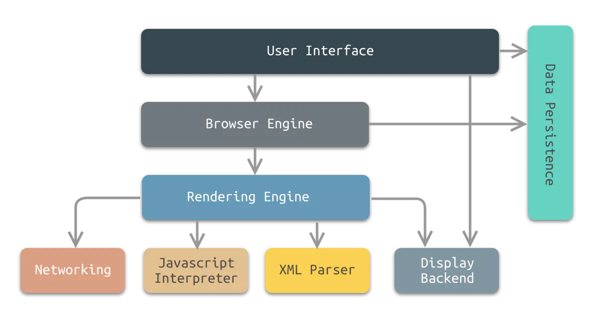
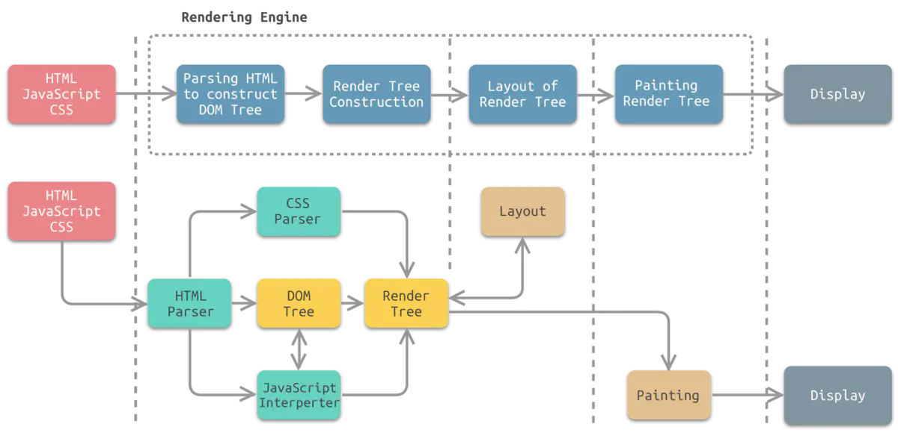

开发者模式：

ctrl + shift + p：运行脚本或者打开文件


Console控制台：


过滤器：


# 一：浏览器构成



![浏览器的抽象分层结构图中将浏览器分成了以下8个子系统：

**用户界面（User Interface）**

用户界面主要包括工具栏、地址栏、前进/后退按钮、书签菜单、可视化页面加载进度、智能下载处理、首选项、打印等。除了浏览器主窗口显示请求的页面之外，其他显示的部分都属于用户界面。

用户界面还可以与桌面环境集成，以提供浏览器会话管理或与其他桌面应用程序的通信。

**浏览器引擎（Browser Engine）**

浏览器引擎是一个可嵌入的组件，其为渲染引擎提供高级接口。

浏览器引擎可以加载一个给定的URI，并支持诸如：前进/后退/重新加载等浏览操作。

浏览器引擎提供查看浏览会话的各个方面的挂钩，例如：当前页面加载进度、JavaScript alert。

浏览器引擎还允许查询/修改渲染引擎设置。

**渲染引擎（Rendering Engine）**

渲染引擎为指定的URI生成可视化的表示。

渲染引擎能够显示HTML和XML文档，可选择CSS样式，以及嵌入式内容（如图片）。

渲染引擎能够准确计算页面布局，可使用“回流”算法逐步调整页面元素的位置。

渲染引擎内部包含HTML解析器。

**网络（Networking）**

网络系统实现HTTP和FTP等文件传输协议。 网络系统可以在不同的字符集之间进行转换，为文件解析MIME媒体类型。 网络系统可以实现最近检索资源的缓存功能。

**JavaScript解释器（JavaScript Interpreter）**

JavaScript解释器能够解释并执行嵌入在网页中的JavaScript（又称ECMAScript）代码。 为了安全起见，浏览器引擎或渲染引擎可能会禁用某些JavaScript功能，如弹出窗口的打开。

**XML解析器（XML Parser）**

XML解析器可以将XML文档解析成文档对象模型（Document Object Model，DOM）树。 XML解析器是浏览器架构中复用最多的子系统之一，几乎所有的浏览器实现都利用现有的XML解析器，而不是从头开始创建自己的XML解析器。

**显示后端（Display Backend）**

显示后端提供绘图和窗口原语，包括：用户界面控件集合、字体集合。

**数据持久层（Data Persistence）**

数据持久层将与浏览会话相关联的各种数据存储在硬盘上。 这些数据可能是诸如：书签、工具栏设置等这样的高级数据，也可能是诸如：Cookie，安全证书、缓存等这样的低级数据。

这里可能会产生一个疑问：功能相似的HTML解析器和XML解析器为什么前者划分在渲染引擎中，后者作为独立的系统？

原因：XML解析器对于系统来说，其功能并不是关键性的，但是从复用角度来说，XML解析器是一个通用的，可重用的组件，具有标准的，定义明确的接口。相比之下，HTML解析器通常与渲染引擎紧耦合。

# 二：渲染引擎

目前，常见的渲染引擎有Trident、Gecko、WebKit等。

## 工作流程

如下图所示为渲染引擎的渲染流程示意图，其以HTML/JavaScript/CSS等文件作为输入，以可视化内容作为输出。


**Parsing HTML to Construct DOM Tree**

渲染引擎使用HTML解析器（调用XML解析器）解析HTML（XML）文档，将各个HTML（XML）元素逐个转化成DOM节点，从而生成DOM树。

同时，渲染引擎使用CSS解析器解析外部CSS文件以及HTML（XML）元素中的样式规则。元素中带有视觉指令的样式规则将用于下一步，以创建另一个树结构：渲染树。

**Render Tree construction**

渲染引擎使用第1步CSS解析器解析得到的样式规则，将其附着到DOM树上，从而构成渲染树。

渲染树包含多个带有视觉属性（如颜色和尺寸）的矩形。这些矩形的排列顺序就是它们将在屏幕上显示的顺序。

**Layout of Render Tree**

渲染树构建完毕之后，进入本阶段进行“布局”，也就是为每个节点分配一个应出现在屏幕上的确切坐标。

**Painting Render Tree**

渲染引擎将遍历渲染树，并调用显示后端将每个节点绘制出来。

## 组成模块



**HTML（XML）解析器**

解析HTML（XML）文档，主要作用是将HTML（XML）文档转换成DOM树。

**CSS解析器**

将DOM中的各个元素对象进行计算，获取样式信息，用于渲染树的构建。

**JavaScript解释器**

使用JavaScript可以修改网页的内容、CSS规则等。JavaScript解释器能够解释JavaScript代码，并通过DOM接口和CSSOM接口来修改网页内容、样式规则，从而改变渲染结果。

**布局**

DOM创建之后，渲染引擎将其中的元素对象与样式规则进行结合，可以得到渲染树。布局则是针对渲染树，计算其各个元素的大小、位置等布局信息。

**绘图**

使用图形库将布局计算后的渲染树绘制成可视化的图像结果。


# 三：CSS特性

1：优先级

!important > 行内样式（权重1000） > ID 选择器（权重 100） > 类选择器（权重 10） > 标签（权重1） > 通配符 > 继承 > 浏览器默认属性

2：继承性

- 继承得到的样式的优先级是最低的，在任何时候，只要元素本身有同属性的样式定义，就可以覆盖掉继承值；
- 在存在多个继承样式时，层级关系距离当前元素最近的父级元素的继承样式，具有相对最高的优先级；

3：层叠性

## CSS语法解析过程


## 优化策略

1.使用 id selector 非常的高效。在使用 id selector 的时候需要注意一点：因为 id 是唯一的，所以不需要既指定 id 又指定 tagName 

```
/* Good  */
#id1 {color:red;}
```

2.避免深层次的 node ，譬如：

```
/* Bad  */
div > div > div > p {color:red;} 
/* Good  */
p-class{color:red;}
```

3.不要使用 attribute selector ，如：p[att1=”val1”]。这样的匹配非常慢。

4.通常将浏览器前缀置于前面，将标准样式属性置于最后，类似：

```
.foo {
  -moz-border-radius: 5px;
  border-radius: 5px;
}
```

5.遵守 CSSLint 规则

```
font-faces        　　　　  　　　不能使用超过5个web字体
import        　　　　　　　 　　  禁止使用@import
regex-selectors        　　　　  禁止使用属性选择器中的正则表达式选择器
universal-selector    　　 　　  禁止使用通用选择器*
unqualified-attributes    　　　禁止使用不规范的属性选择器
zero-units            　　 　　　0后面不要加单位
overqualified-elements    　　　使用相邻选择器时，不要使用不必要的选择器
shorthand        　　　　　　　　 简写样式属性
duplicate-background-images    相同的url在样式表中不超过一次
```

6.减少 CSS 文档体积

- 移除空的 CSS 规则（Remove empty rules）
- 值为 0 不需要单位
- 使用缩写
- 属性值为浮动小数 0.**，可以省略小数点之前的0；
- 不给 h1-h6 元素定义过多的样式

\7. CSS Will Change 
WillChange 属性，允许作者提前告知浏览器的默认样式，使用一个专用的属性来通知浏览器留意接下来的变化，从而优化和分配内存。

8.不要使用 @import 
使用 @import 引入 CSS 会影响浏览器的并行下载。使用 @import 引用的 CSS 文件只有在引用它的那个 CSS 文件被下载、解析之后，浏览器才会知道还有另外一个 CSS 需要下载，这时才去下载，然后下载后开始解析、构建 Render Tree 等一系列操作。

多个 @import 会导致下载顺序紊乱。在 IE 中， @import 会引发资源文件的下载顺序被打乱，即排列在 @import 后面的 JS 文件先于 @import 下载，并且打乱甚至破坏 @import 自身的并行下载。

9.避免过分重排（Reflow）

浏览器重新计算布局位置与大小。

# 四

低版本浏览器不支持HTML5标签：

在你的网页中引入Google的html5shiv包

```html
<!--[if lt IE 9]>
    <script src="http://css3-mediaqueries-js.googlecode.com/files/css3-mediaqueries.js"></script>
    <script src="http://html5shim.googlecode.com/svn/trunk/html5.js"></script>
<![endif]-->
```

