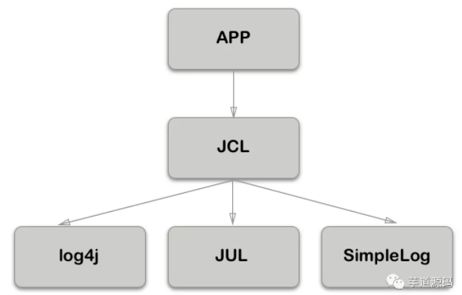

本文的目的是搞清楚Java中各种日志Log之间是怎么的关系，如何作用、依赖，好让我们平时在工作中如果遇到“日志打不出”或者“日志jar包冲突”等之类的问题知道该如何入手解决，以及在各种场景下如何调整项目中的各个框架的日志输出，使得输出统一。


在日常工作中我们可能看到项目中依赖的跟日志相关的jar包有很多，`commons-logging.jar`、`log4j.jar`、`sl4j-api.jar`、`logback.jar`等等，眼花缭乱。我们要正确的配置，使得jar包相互作用生效之前，就先要理清它们之间的关系。


发展史：

那就要从Java Log的发展历程开始说起。

1. `log4j`（作者Ceki Gülcü）出来时就等到了广泛的应用（注意这里是直接使用），是Java日志事实上的标准，并成为了Apache的项目
2. Apache要求把log4j并入到JDK，SUN拒绝，并在jdk1.4版本后增加了`JUL`（`java.util.logging`）
3. 毕竟是JDK自带的，JUL也有很多人用。同时还有其他日志组件，如SimpleLog等。这时如果有人想换成其他日志组件，如log4j换成JUL，因为api完全不同，就需要改动代码。
4. Apache见此，开发了`JCL`（Jakarta Commons Logging），即`commons-logging-xx.jar`。它只提供一套通用的日志接口api，并不提供日志的实现。很好的设计原则嘛，依赖抽象而非实现。这样应用程序可以在运行时选择自己想要的日志实现组件。
5. 这样看上去也挺美好的，但是log4j的作者觉得JCL不好用，自己开发出`slf4j`，它跟JCL类似，本身不替供日志具体实现，只对外提供接口或门面。目的就是为了替代JCL。同时，还开发出`logback`，一个比log4j拥有更高性能的组件，目的是为了替代log4j。
6. Apache参考了logback,并做了一系列优化，推出了`log4j2`


### 概述

体系


**日志门面**

日志门面定义了一组日志的接口规范，它并不提供底层具体的实现逻辑。`Apache Commons Logging` 和 `Slf4j` 就属于这一类。

**日志实现**

日志实现则是日志具体的实现，包括日志级别控制、日志打印格式、日志输出形式（输出到数据库、输出到文件、输出到控制台等）。`Log4j`、`Log4j2`、`Logback` 以及 `Java Util Logging` 则属于这一类。

###  **日志级别**

使用日志级别的好处在于，调整级别，就可以屏蔽掉很多调试相关的日志输出。不同的日志实现定义的日志级别不太一样，不过也都大同小异。

**Java Util Logging**

`Java Util Logging` 定义了 7 个日志级别，从严重到普通依次是：

- SEVERE
- WARNING
- INFO
- CONFIG
- FINE
- FINER
- FINEST

因为默认级别是 INFO，因此 INFO 级别以下的日志，不会被打印出来。

**Log4j**

`Log4j` 定义了 8 个日志级别（除去 OFF 和 ALL，可以说分为 6 个级别），从严重到普通依次是：

- OFF：最高等级的，用于关闭所有日志记录。
- FATAL：重大错误，这种级别可以直接停止程序了。
- ERROR：打印错误和异常信息，如果不想输出太多的日志，可以使用这个级别。
- WARN：警告提示。
- INFO：用于生产环境中输出程序运行的一些重要信息，不能滥用。
- DEBUG：用于开发过程中打印一些运行信息。
- TRACE
- ALL 最低等级的，用于打开所有日志记录。


**Logback**

`Logback` 日志级别比较简单，从严重到普通依次是：

- ERROR
- WARN
- INFO
- DEBUG
- TRACE


**对比**

`Java Util Logging` 系统在 `JVM` 启动时读取配置文件并完成初始化，一旦应用程序开始运行，就无法修改配置。另外，这种日志实现配置也不太方便，只能在 `JVM` 启动时传递参数，像下面这样：

```
-Djava.util.logging.config.file=<config-file-name>。
```

由于这些局限性，导致 `Java Util Logging` 并未广泛使用。

`Log4j` 虽然配置繁琐，但是一旦配置完成，使用起来就非常方便，只需要将相关的配置文件放到 `classpath` 下即可。在很多情况下，`Log4j` 的配置文件我们可以在不同的项目中反复使用。

`Log4j` 可以和 `Apache Commons Logging` 搭配使用，`Apache Commons Logging` 会自动搜索并使用 `Log4j`，如果没有找到 `Log4j`，再使用 `Java Util Logging`。

比 `Log4j` + `Apache Commons Logging` 组合更得人心的是 `Slf4j` + `Logback` 组合。

`Logback` 是 `Slf4j` 的原生实现框架，它也出自 `Log4j` 作者（Ceki Gülcü）之手，但是相比 `Log4j`，它拥有更多的优点、特性以及更强的性能。

- 如果不想添加任何依赖，使用 `Java Util Logging` 或框架容器已经提供的日志接口。
- 如果比较在意性能，推荐：`Slf4j` + `Logback`。
- 如果项目中已经使用了 `Log4j` 且没有发现性能问题，推荐组合为：`Slf4j` + `Log4j2`。


JCL

`commons-logging`已经停止更新，最后的状态如下所示：




### SLF4j

意思为如果你想用slf4j作为日志门面的话，你如何去配合使用其他日志实现组件，这里说明一下（注意jar包名缺少了版本号，在找版本时也要注意版本之间是否兼容）

- slf4j + logback`slf4j-api.jar` + `logback-classic.jar` + `logback-core.jar`
- slf4j + log4j`slf4j-api.jar` + `slf4j-log4j12.jar` + `log4j.jar`
- slf4j + jul`slf4j-api.jar` + `slf4j-jdk14.jar`
- 也可以只用slf4j无日志实现`slf4j-api.jar` + `slf4j-nop.jar`

以后开发的时候，日志记录方法的调用，不应该来直接调用日志的实现类，而是调用日志抽象层里面的方法；

给系统里面导入slf4j的jar和  logback的实现jar

```java
import org.slf4j.Logger;
import org.slf4j.LoggerFactory;

public class HelloWorld {
  public static void main(String[] args) {
    Logger logger = LoggerFactory.getLogger(HelloWorld.class);
    logger.info("Hello World");
  }
}
```


#### 输出到文件

如果想禁止控制台的日志输出，转而将日志内容输出到一个文件，我们可以自定义一个 `logback-spring.xml` 文件，并引入前面所说的 `file-appender.xml` 文件。

像下面这样（`resources/logback-spring.xml`）：

```xml
<?xml version="1.0" encoding="UTF-8"?>
<configuration>
    <include resource="org/springframework/boot/logging/logback/defaults.xml" />
    <property name="LOG_FILE" value="${LOG_FILE:-${LOG_PATH:-${LOG_TEMP:-${java.io.tmpdir:-/tmp}}/}spring.log}"/>
    <include resource="org/springframework/boot/logging/logback/file-appender.xml" />
    <root level="INFO">
        <appender-ref ref="FILE" />
    </root>
</configuration>
```


logback配置

默认的 `Logback` 配置文件名有两种：

- `logback.xml`：这种配置文件会直接被日志框架加载。
- `logback-spring.xml`：这种配置文件不会被日志框架直接加载，而是由 Spring Boot 去解析日志配置，可以使用 Spring Boot 的高级 Profile 功能。

Spring Boot 中为 `Logback` 提供了四个默认的配置文件，位置在 `org/springframework/boot/logging/logback/`，分别是：

- defaults.xml：提供了公共的日志配置，日志输出规则等。
- console-appender.xml：使用 CONSOLE_LOG_PATTERN 添加一个ConsoleAppender。
- file-appender.xml：添加一个 RollingFileAppender。
- base.xml：为了兼容旧版 Spring Boot 而提供的。

如果需要自定义 `logback.xml` 文件，可以在自定义时使用这些默认的配置文件，也可以不使用。一个典型的 `logback.xml` 文件如下（resources/logback.xml）：

```xml
<?xml version="1.0" encoding="UTF-8"?>
<configuration>
    <include resource="org/springframework/boot/logging/logback/defaults.xml"/>
    <include resource="org/springframework/boot/logging/logback/console-appender.xml" />
    <root level="INFO">
        <appender-ref ref="CONSOLE" />
    </root>
    <logger name="org.springframework.web" level="DEBUG"/>
</configuration>
```

可以通过 include 引入 Spring Boot 已经提供的配置文件，也可以自定义。


Spring

Spring是用JCL作为日志门面的


### SpringBoot

Spring Boot 使用 `Apache Commons Logging` 作为内部的日志框架门面，它只是一个日志接口，在实际应用中需要为该接口来指定相应的日志实现。


Spring Boot 默认的日志实现是 `Logback`

在 Spring Boot 项目中，只要添加了如下 web 依赖，日志依赖就自动添加进来了：

```xml
<dependency>
    <groupId>org.springframework.boot</groupId>
    <artifactId>spring-boot-starter-web</artifactId>
</dependency>
```


**日志配置**

Spring Boot 的日志系统会自动根据 classpath 下的内容选择合适的日志配置，在这个过程中首选 Logback。

如果开发者需要修改日志级别，只需要在 application.properties 文件中通过 `logging.level 前缀+包名` 的形式进行配置即可

```properties
logging.level.org.springframework.web=debug
logging.level.org.hibernate=error
```

如果你想将日志输出到文件，可以通过如下配置指定日志文件名：

```properties
logging.file.name=javaboy.log
或者
logging.file.name=/Users/sang/Documents/javaboy/javaboy.log
```

指定日志文件全路径

```properties
logging.file.path=/Users/sang/Documents/javaboy
```

想对输出到文件中的日志进行精细化管理，还有如下一些属性可以配置：

```properties
logging.logback.rollingpolicy.file-name-pattern：日志归档的文件名，日志文件达到一定大小之后，自动进行压缩归档。
logging.logback.rollingpolicy.clean-history-on-start：是否在应用启动时进行归档管理。
logging.logback.rollingpolicy.max-file-size：日志文件大小上限，达到该上限后，会自动压缩。
logging.logback.rollingpolicy.total-size-cap：日志文件被删除之前，可以容纳的最大大小。
logging.logback.rollingpolicy.max-history：日志文件保存的天数。
```

### Log4j 配置

如果 classpath 下存在 `Log4j2` 的依赖，Spring Boot 会自动进行配置。

默认情况下 classpath 下当然不存在 `Log4j2` 的依赖，如果想使用 `Log4j2`，可以排除已有的 `Logback`，然后再引入 `Log4j2`，如下：

```xml
<dependency>
    <groupId>org.springframework.boot</groupId>
    <artifactId>spring-boot-starter-web</artifactId>
    <exclusions>
        <exclusion>
            <groupId>org.springframework.boot</groupId>
            <artifactId>spring-boot-starter-logging</artifactId>
        </exclusion>
    </exclusions>
</dependency>
<dependency>
    <groupId>org.springframework.boot</groupId>
    <artifactId>spring-boot-starter-log4j2</artifactId>
</dependency>
```

`Log4j2` 的配置就比较容易了，在 reources 目录下新建 log4j2.xml 文件，内容如下：

```xml
<?xml version="1.0" encoding="UTF-8"?>
<configuration status="warn">
    <properties>
        <Property name="app_name">logging</Property>
        <Property name="log_path">logs/${app_name}</Property>
    </properties>
    <appenders>
        <console name="Console" target="SYSTEM_OUT">
            <PatternLayout pattern="[%d][%t][%p][%l] %m%n" />
        </console>
        <RollingFile name="RollingFileInfo" fileName="${log_path}/info.log"
                     filePattern="${log_path}/$${date:yyyy-MM}/info-%d{yyyy-MM-dd}-%i.log.gz">
            <Filters>
                <ThresholdFilter level="INFO" />
                <ThresholdFilter level="WARN" onMatch="DENY"
                                 onMismatch="NEUTRAL" />
            </Filters>
            <PatternLayout pattern="[%d][%t][%p][%c:%L] %m%n" />
            <Policies>
                <TimeBasedTriggeringPolicy interval="1" modulate="true" />
                <SizeBasedTriggeringPolicy size="2 MB" />
            </Policies>
            <DefaultRolloverStrategy compressionLevel="0" max="10"/>
        </RollingFile>
        <RollingFile name="RollingFileWarn" fileName="${log_path}/warn.log"
                     filePattern="${log_path}/$${date:yyyy-MM}/warn-%d{yyyy-MM-dd}-%i.log.gz">
            <Filters>
                <ThresholdFilter level="WARN" />
                <ThresholdFilter level="ERROR" onMatch="DENY"
                                 onMismatch="NEUTRAL" />
            </Filters>
            <PatternLayout pattern="[%d][%t][%p][%c:%L] %m%n" />
            <Policies>
                <TimeBasedTriggeringPolicy interval="1" modulate="true" />
                <SizeBasedTriggeringPolicy size="2 MB" />
            </Policies>
            <DefaultRolloverStrategy compressionLevel="0" max="10"/>
        </RollingFile>

        <RollingFile name="RollingFileError" fileName="${log_path}/error.log"
                     filePattern="${log_path}/$${date:yyyy-MM}/error-%d{yyyy-MM-dd}-%i.log.gz">
            <ThresholdFilter level="ERROR" />
            <PatternLayout pattern="[%d][%t][%p][%c:%L] %m%n" />
            <Policies>
                <TimeBasedTriggeringPolicy interval="1" modulate="true" />
                <SizeBasedTriggeringPolicy size="2 MB" />
            </Policies>
            <DefaultRolloverStrategy compressionLevel="0" max="10"/>
        </RollingFile>
    </appenders>
    <loggers>
        <root level="info">
            <appender-ref ref="Console" />
            <appender-ref ref="RollingFileInfo" />
            <appender-ref ref="RollingFileWarn" />
            <appender-ref ref="RollingFileError" />
        </root>
    </loggers>
</configuration>
```

首先在 properties 节点中指定了应用名称以及日志文件位置。

然后通过几个不同的 RollingFile 对不同级别的日志分别处理，不同级别的日志将输出到不同的文件，并按照各自的命名方式进行压缩。

