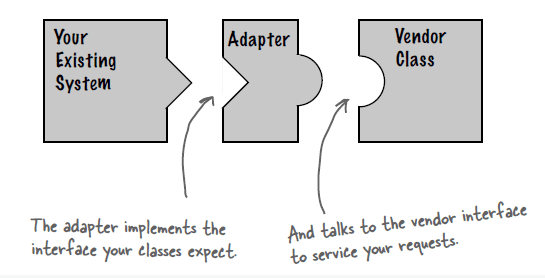
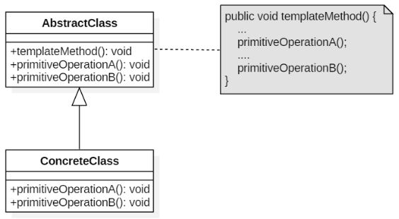
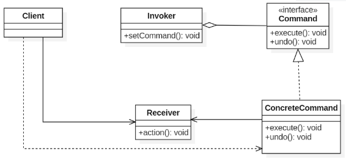
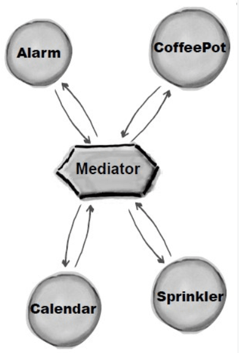

设计模式的深入内容较多，我这里只是列举一些基本思想，如果想深入理解，给大家推荐一些博客：


# 第 1 章 总论

## 概述

**概念：**设计模式（Design pattern）是一套被反复使用、多数人知晓的、经过分类编目的、代码设计经验的总结。使用设计模式是为了可重用代码、让代码更容易被他人理解、保证代码可靠性。

设计模式具有“适应需求变化”的优点。

**基本原则：**模块应对外扩展开放，而对修改关闭，要针对接口，而不是组合，抽象不应该依赖于细节，细节应当依赖于抽象

**基本分类：**共23种模式 3种分类 创建型5 结构型7 行为型11


## 创建型5种：相公生原子

对象实例化的模式，创建型模式用于解耦对象的实例化过程。

抽象工厂模式（Abstract Factory Pattern） 

定义：（为创建一组相关或相互依赖的对象提供一个接口，而且无须指定它们的具体类。）  

 　所谓抽象工厂模式就是提供一个接口，用于创建相关或者依赖对象的家族，而不需要明确指定具体类。他允许客户端使用抽象的接口来创建一组相关的产品，而不需要关系实际产出的具体产品是什么。这样一来，客户就可以从具体的产品中被解耦。它的优点是隔离了具体类的生成，使得客户端不需要知道什么被创建了，而缺点就在于新增新的行为会比较麻烦，因为当添加一个新的产品对象时，需要更加需要更改接口及其下所有子类。

工厂方法模式

定义：（定义一个用于创建对象的接口，让子类决定实例化哪一个类。工厂方法使一个类的实例化延迟到其子类。）

　　工厂方法模式非常符合“开闭原则”，当需要增加一个新的产品时，我们只需要增加一个具体的产品类和与之对应的具体工厂即可，无须修改原有系统。同时在工厂方法模式中用户只需要知道生产产品的具体工厂即可，无须关系产品的创建过程，甚至连具体的产品类名称都不需要知道。虽然他很好的符合了“开闭原则”，但是由于每新增一个新产品时就需要增加两个类，这样势必会导致系统的复杂度增加。

 

生成器模式（Builder Pattern） 

定义：（将一个复杂对象的构建与它的表示分离，使得同样的构建过程可以创建不同的表示。）

使用场景：

● 相同的方法，不同的执行顺序，产生不同的事件结果时，可以采用建造者模式。

● 多个部件或零件，都可以装配到一个对象中，但是产生的运行结果又不相同时，则可以使用该模式。

● 产品类非常复杂，或者产品类中的调用顺序不同产生了不同的效能，这个时候使用建造者模式非常合适。

 

 

原型模式（Prototype Pattern）

定义：（用原型实例指定创建对象的种类，并且通过拷贝这些原型创建新的对象。）

 

单子模式 （Singleton Pattern）

定义：（确保某一个类只有一个实例，而且自行实例化并向整个系统提供这个实例。）

使用场景：

● 要求生成唯一序列号的环境；

● 在整个项目中需要一个共享访问点或共享数据，例如一个Web页面上的计数器，可以不用把每次刷新都记录到数据库中，使用单例模式保持计数器的值，并确保是线程安全的；

● 创建一个对象需要消耗的资源过多，如要访问IO和数据库等资源；

● 需要定义大量的静态常量和静态方法（如工具类）的环境，可以采用单例模式（当然，也可以直接声明为static的方式）。

　　当系统中只需要一个实例对象或者系统中只允许一个公共访问点，除了这个公共访问点外，不能通过其他访问点访问该实例时，可以使用单例模式。

　　单例模式的主要优点就是节约系统资源、提高了系统效率，同时也能够严格控制客户对它的访问。也许就是因为系统中只有一个实例，这样就导致了单例类的职责过重，违背了“单一职责原则”，同时也没有抽象类，所以扩展起来有一定的困难。

实现：

1）懒汉式——线程不安全

2）饿汉式——线程安全：

采取直接实例化 uniqueInstance 的方式就不会产生线程不安全问题。

但是直接实例化的方式也丢失了延迟实例化带来的节约资源的好处。

 

3）懒汉式——线程安全

4）双重校验锁——线程安全

5）静态内部类

6）枚举


## 结构型7种：乔装打扮想外住

把类或对象结合在一起形成一个更大的结构。

桥模式（Bridge Pattern）

定义：（将抽象和实现解耦，使得两者可以独立地变化。）

使用场景：

● 不希望或不适用使用继承的场景

● 接口或抽象类不稳定的场景

● 重用性要求较高的场景

 

注意：

发现类的继承有N层时，可以考虑使用桥梁模式。桥梁模式主要考虑如何拆分抽象和实现。

 

装饰（Decorator）模式

定义：（动态地给一个对象添加一些额外的职责。就增加功能来说，装饰模式相比生成子类更为灵活。）

使用场景：

● 需要扩展一个类的功能，或给一个类增加附加功能。

● 需要动态地给一个对象增加功能，这些功能可以再动态地撤销。

● 需要为一批的兄弟类进行改装或加装功能，当然是首选装饰模式。

 

代理模式（Proxy Pattern） 

定义：（为其他对象提供一种代理以控制对这个对象的访问。）

 

适配器模式（Adapter Pattern）

定义：（将一个类的接口变换成客户端所期待的另一种接口，从而使原本因接口不匹配而无法在一起工作的两个类能够在一起工作。）

使用场景：

你有动机修改一个已经投产中的接口时，适配器模式可能是最适合你的模式。比如系统扩展了，需要使用一个已有或新建立的类，但这个类又不符合系统的接口，怎么办？使用适配器模式，这也是我们例子中提到的。

注意事项：

详细设计阶段不要考虑使用适配器模式，使用主要场景为扩展应用中。

 

享元模式（Flyweight Pattern）

定义：（使用共享对象可有效地支持大量的细粒度的对象。）

使用场景：

● 系统中存在大量的相似对象。

● 细粒度的对象都具备较接近的外部状态，而且内部状态与环境无关，也就是说对象没有特定身份。

● 需要缓冲池的场景。

注意：

● 享元模式是线程不安全的，只有依靠经验，在需要的地方考虑一下线程安全，在大部分场景下不用考虑。对象池中的享元对象尽量多，多到足够满足为止。

● 性能安全：外部状态最好以java的基本类型作为标志，如String，int，可以提高效率。

 

外观模式（Facade Pattern）

定义：（要求一个子系统的外部与其内部的通信必须通过一个统一的对象进行。门面模式提供一个高层次的接口，使得子系统更易于使用。）

使用场景：

● 为一个复杂的模块或子系统提供一个供外界访问的接口

● 子系统相对独立——外界对子系统的访问只要黑箱操作即可

● 预防低水平人员带来的风险扩散

注意：

●一个子系统可以有多个门面

●门面不参与子系统内的业务逻辑

 

## 行为型11种

访问者通过观察备忘录模版状态命令中介者迭代解释职责策略

 访问者模式（Visitor Pattern）

定义：（封装一些作用于某种数据结构中的各元素的操作，它可以在不改变数据结构的前提下定义作用于这些元素的新的操作。）

 

 

观察者模式（Observer Pattern）

定义：（定义对象间一种一对多的依赖关系，使得每当一个对象改变状态，则所有依赖于它的对象都会得到通知并被自动更新。）

使用场景：

● 关联行为场景。需要注意的是，关联行为是可拆分的，而不是“组合”关系。

● 事件多级触发场景。

● 跨系统的消息交换场景，如消息队列的处理机制。

注意：

● 广播链的问题

在一个观察者模式中最多出现一个对象既是观察者也是被观察者，也就是说消息最多转发一次（传递两次）。

● 异步处理问题

观察者比较多，而且处理时间比较长，采用异步处理来考虑线程安全和队列的问题。

 

 备忘录模式（Memento Pattern）

定义：（在不破坏封装性的前提下，捕获一个对象的内部状态，并在该对象之外保存这个状态。这样以后就可将该对象恢复到原先保存的状态。）

使用场景：

● 需要保存和恢复数据的相关状态场景。

● 提供一个可回滚（rollback）的操作。

● 需要监控的副本场景中。

● 数据库连接的事务管理就是用的备忘录模式。

注意：

●备忘录的生命期

●备忘录的性能

  不要在频繁建立备份的场景中使用备忘录模式（比如一个for循环中）。

 

 

模版模式（Template Method Pattern）

定义：（定义一个操作中的算法的框架，而将一些步骤延迟到子类中。使得子类可以不改变一个算法的结构即可重定义该算法的某些特定步骤。）

 

 

状态模式

定义：（当一个对象内在状态改变时允许其改变行为，这个对象看起来像改变了其类。）

使用场景：

● 行为随状态改变而改变的场景

这也是状态模式的根本出发点，例如权限设计，人员的状态不同即使执行相同的行为结果也会不同，在这种情况下需要考虑使用状态模式。

● 条件、分支判断语句的替代者

注意：

状态模式适用于当某个对象在它的状态发生改变时，它的行为也随着发生比较大的变化，也就是说在行为受状态约束的情况下可以使用状态模式，而且使用时对象的状态最好不要超过5个。

 

命令模式

定义：（将一个请求封装成一个对象，从而让你使用不同的请求把客户端参数化，对请求排队或者记录请求日志，可以提供命令的撤销和恢复功能。）

 

 

中介者（mediator）模式

定义：（用一个中介对象封装一系列的对象交互，中介者使各对象不需要显示地相互作用，从而使其耦合松散，而且可以独立地改变它们之间的交互。）

使用场景：

中介者模式适用于多个对象之间紧密耦合的情况，紧密耦合的标准是：在类图中出现了蜘蛛网状结构，即每个类都与其他的类有直接的联系。

 

 

迭代器模式（Iterator Pattern）

定义：（它提供一种方法访问一个容器对象中各个元素，而又不需暴露该对象的内部细节。）

 

解释器模式（Interpreter Pattern）

定义：（给定一门语言，定义它的文法的一种表示，并定义一个解释器，该解释器使用该表示来解释语言中的句子。）

使用场景：

● 重复发生的问题可以使用解释器模式

● 一个简单语法需要解释的场景

 

注意：

尽量不要在重要的模块中使用解释器模式，否则维护会是一个很大的问题。在项目中可以使用shell、JRuby、Groovy等脚本语言来代替解释器模式，弥补Java编译型语言的不足。

 

职责链模式

定义：（使多个对象都有机会处理请求，从而避免了请求的发送者和接受者之间的耦合关系。将这些对象连成一条链，并沿着这条链传递该请求，直到有对象处理它为止。）

 

 

 

策略模式（Strategy Pattern）

定义：（定义一组算法，将每个算法都封装起来，并且使它们之间可以互换。）

使用场景：

● 多个类只有在算法或行为上稍有不同的场景。

● 算法需要自由切换的场景。

● 需要屏蔽算法规则的场景。

注意事项：具体策略数量超过4个，则需要考虑使用混合模式

 

最后 加上两个 mvc 既是架构风格 也可以是 设计模式
筛选器模式 java .net 在注册访问时 常用的方法
1、策略 2、观察者、3、装饰 4、工厂 5、单子 6、命令 7、适配器 8模版 9、组合 10、状态
设计模式 是干啥的 ？ 是 对于一类问题的通用解决办法
四要素 ：模式名称、问题、解决方案、效果

 


组合（Composite）模式

定义：（将对象组合成树形结构以表示“部分-整体”的层次结构，使得用户对单个对象和组合对象的使用具有一致性。）

使用场景：

● 维护和展示部分-整体关系的场景，如树形菜单、文件和文件夹管理。

● 从一个整体中能够独立出部分模块或功能的场景。

注意：

只要是树形结构，就考虑使用组合模式。


# 第 2 章 七大原则

## 设计模式的目的

编写软件过程中，程序员面临着来自耦合性，内聚性以及可维护性，可扩展性，重用性，灵活性等多方面的挑战，设计模式是为了让程序(软件)，具有更好

代码重用性 (即：相同功能的代码，不用多次编写)

可读性 (即：编程规范性, 便于其他程序员的阅读和理解)

可扩展性 (即：当需要增加新的功能时，非常的方便，称为可维护)

可靠性 (即：当我们增加新的功能后，对原来的功能没有影响)

使程序呈现高内聚，低耦合的特性：

设计模式原则，其实就是程序员在编程时，应当遵守的原则 程序员在编程时，应当遵守的原则，也是各种设计模式的基础 设计模式的基础(即：设计模式为什么 设计模式为什么这样设计的依据 这样设计的依据)

## 一：单一职责原则

对类来说的，即一个类应该只负责一项职责 即一个类应该只负责一项职责。如类 A 负责两个不同职责：职责 1，职责 2。当职责 1 需求变更而改变 A 时，可能造成职责 2 执行错误，所以需要将类 A 的粒度分解为 A1，A2

 

## 二：接口隔离原则

客户端不应该依赖它不需要的接口，即一个类对另一个类的依赖应该建立在最小的接口 上

如：

类 A 通过接口 Interface1 依赖类 B，类 C 通过接口 Interface1 依赖类 D，如果接口 Interface1 对于类 A 和类 C来说不是最小接口，那么类 B 和类 D 必须去实现他们不需要的方法。

按隔离原则应当这样处理：将接口 Interface1 拆分为独立的几个接口(这里我们拆分成 这里我们拆分成 3 个接口 )， 类 A 和类 C 分别与他们需要的接口建立依赖关系。也就是采用接口隔离原则。

 

## 三：依赖倒转原则

高层模块不应该依赖低层模块，二者都应该依赖其抽象

抽象不应该依赖细节，细节应该依赖抽象

依赖倒转(倒置)的中心思想是面向接口编程

依赖倒转原则是基于这样的设计理念：相对于细节的多变性，抽象的东西要稳定的多。以抽象为基础搭建的架构比以细节为基础的架构要稳定的多。在 java 中，抽象指的是接口或抽象类，细节就是具体的实现类

使用接口或抽象类的目的是制定好规范，而不涉及任何具体的操作，把展现细节的任务交给他们的实现类去完成

依赖关系传递的三种方式：接口传递，构造方法传递，setter方式传递

例如：学生写字需要用到笔，学生类里面就要依赖笔这个接口，而不应该依赖某一种笔（比如铅笔）。

## 四：里氏替换原则

继承在给程序设计带来便利的同时 ， 也带来了弊端。 比如使用继承会给程序带来侵入性， 程序的可移植性降低增加对象间的耦合性，如果一个类被其他的类所继承，则当这个类需要修改时，必须考虑到所有的子类，并且父类修改后，所有涉及到子类的功能都有可能产生故障

如何正确的继承——>里氏替换原则

所有引用基类（父类、接口）的地方必须能够透明地使用其子类对象。

例如：我喜欢动物（父类）—（替换为）—》我喜欢狗（子类）【√】

反例：我喜欢狗（子类）—（替换为）—》我喜欢动物（父类）【×】


## 五：开闭原则

一个软件实体如类，模块和函数应该**对扩展开放(对提供方)，对修改关闭 ( 对使用方)**。用抽象构建框架，用实现扩展细节。

当软件需要变化时，尽量通过扩展软件 通过扩展软件实体的行为来实现变化，而不是通过修改 通过修改已有的代码来实现变化。

## 六：迪米特法则

迪米特法则(Demeter Principle)又叫最少知道原则 ，即一个类对自己依赖的类知道的越少越好 。也就是说，对于被依赖的类不管多么复杂，都尽量将逻辑封装在类的内部。对外除了提供的 public 方法，不对外泄露任何信息。


## 七：合成复用原则

原则是尽量使用合成/聚合的方式，而不是使用继承

## 设计原则核心思想

1.  找出应用中可能需要变化之处，把它们独立出来，不要和那些不需要变化的代码混在一起。

2.  针对接口编程，而不是针对实现编程。

3.  为了交互对象之间的松耦合设计而努力

# 第 3 章 单例模式（重）

## 1：概述

所谓类的单例设计模式，就是采取一定的方法保证在整个的软件系统中，对某个类只能存在一个对象实例，并且该类只提供一个取得其对象实例的方法(静态方法)。

2：单例模式有八种方式
**1) 饿汉式(静态常量 )**
**2) 饿汉式（静态代码块）**
3) 懒汉式(线程不安全)
4) 懒汉式(线程安全，同步方法)
5) 懒汉式(线程安全，同步代码块)
**6) 双重检查**
**7) 静态内部类**
**8) 枚举**

3：说明

1) 单例模式保证了 系统内存中该类只存在一个对象，节省了系统资源，对于一些需要频繁创建销毁的对象，使用单例模式可以提高系统性能

2) 当想实例化一个单例类的时候，必须要记住使用相应的获取对象的方法，而不是使用 new

3) 单例模式使用的场景 使用的场景：需要频繁的进行创建和销毁的对象 频繁的进行创建和销毁的对象、创建对象时耗时过多或耗费资源过多(即：重量级对象)，但又经常用到的对象、工具类对象 工具类对象、频繁访问数据库或文件的对象(比如数据源、 数据源、session 工厂 工厂等)

## 2：饿汉式（静态常量）

```
class Singleton {

//1. 构造器私有化, 外部能 new

private Singleton() {

}

//2.本类内部创建对象实例

private final static Singleton instance = new Singleton();

//3. 提供一个公有的静态方法，返回实例对象

public static Singleton getInstance() {

return instance;

}
```


```
 1 public class SingletonTest01 {
 2 public static void main(String[] args) {
 3 //测试
 4 Singleton instance = Singleton.getInstance();
 5 Singleton instance2 = Singleton.getInstance();
 6 System.out.println(instance == instance2); //true
 7 System.out.println("instance.hashCode=" + instance.hashCode());
 8 System.out.println("instance2.hashCode=" + instance2.hashCode());
 9 }
10 }
```


这种方式在类装载时完成实例化，避免线程同步问题。

 缺点：在类装载的时候就完成实例化，没有达到 Lazy Loading 的效果。如果从始至终从未使用过这个实例，则会造成内存的浪费

这种单例模式可用，可能造成内存浪费

 

## 3：饿汉式（静态代码块）


```
//饿汉式(静态变量)
class Singleton {
//1. 构造器私有化, 外部能 new
private Singleton() {}

//2.本类内部创建对象实例——不同处
private static Singleton instance;
static {
 // 在静态代码块中，创建单例对象i
nstance = new Singleton();
}

//3. 提供一个公有的静态方法，返回实例对象
public static Singleton getInstance() {
return instance;
}
}
```

System.out.println(instance == instance2); // true

这种方式和上面的方式其实类似，只不过将类实例化的过程放在了静态代码块中，也是在类装载的时候，就执行静态代码块中的代码，初始化类的实例。优缺点和上面是一样的。

## 4：懒汉式（线程不安全）


```
class Singleton {
private static Singleton instance;
private Singleton() {}

//提供一个静态的公有方法，当使用到该方法时，才去创建 instance
//即懒汉式
public static Singleton getInstance() {
if(instance == null) {
instance = new Singleton();
}
return instance;

}
}
```

起到了 Lazy Loading 的效果，但是只能在单线程下使用。

如果在多线程下，一个线程进入了 if (singleton == null)判断语句块，还未来得及往下执行，另一个线程也通过了这个判断语句，这时便会产生多个实例 产生多个实例。

所以在多线程环境下不可使用这种方式

结论：在实际开发中，不要使用 不要使用这种方式.

## 5：懒汉式（线程安全，同步方法）

```
// 懒汉式(线程安全，同步方法)
class Singleton {
private static Singleton instance;
private Singleton() {}
//提供一个静态的公有方法，加入同步处理的代码，解决线程安全问题
//即懒汉式
public static synchronized Singleton getInstance() {
if(instance == null) {
instance = new Singleton();
}
return instance;
}
}
```

1) 解决了线程安全 线程安全问题

2) 效率太低了，每个线程在想获得类的实例时候，执行 getInstance()方法都要进行同步。而其实这个方法只执行一次实例化代码就够了，后面的想获得该类实例，直接 return 就行了。方法进行同步效率太 方法进行同步效率太低

3) 结论：在实际开发中，不推荐 不推荐使用这种方式

 

## 6：懒汉式（线程安全，同步代码块）

简单变成，同上

```
// 懒汉式(线程安全，同步代码块)
class Singleton {
private static Singleton instance;
private Singleton() {}
//提供一个静态的公有方法，加入同步处理的代码，解决线程安全问题
//即懒汉式
public static synchronized Singleton getInstance() {
if(instance == null) {


synchronized(Singleton.class){
    singleton= new Singleton();
}


instance = new Singleton();
}
return instance;
}
}
```

 

7双重检查

```
// 懒汉式(线程安全，同步方法)
class Singleton {
private static volatile Singleton instance;
private Singleton() {}
//提供一个静态的公有方法，加入双重检查代码，解决线程安全问题, 同时解决懒加载问题
//同时保证了效率, 推荐使用
public static synchronized Singleton getInstance() {
  if(instance == null) {
    synchronized (Singleton.class) {
      if(instance == null) {
         instance = new Singleton();
}
}
}
return instance;
}
}
```

1) Double-Check 概念是多线程开发中常使用到的，如代码中所样就可以保证线程安全了。2) 这样，实例化代码只用执行一次，后面再次访问时，判断 免的反复进行方法同步.

3) 线程安全 线程安全；延迟加载 延迟加载；效率较高 效率较高

4) 结论：在实际开发中，推荐使用这种单例设计模 推荐使用这种单例设计模式

## 7：双重锁校验

加锁操作只需要对实例化那部分的代码进行，只有当对象没有被实例化，才需要进行加锁。

## 8：静态内部类

```
// 静态内部类完成， 推荐使用
class Singleton {
private static volatile Singleton instance;
//构造器私有化private Singleton() {}
//写一个静态内部类,该类中有一个静态属性 
Singletonprivate static class SingletonInstance {
private static final Singleton INSTANCE = new Singleton();
}
//提供一个静态的公有方法，直接返回 SingletonInstance.INSTANCE
public static synchronized Singleton getInstance() {
return SingletonInstance.INSTANCE;
}
}
```

1) 这种方式采用了类装载的机制来保证初始化实例时只有一个线程。

2) 静态内部类方式在 Singleton 类被装载时并不会立即实例化，而是在需要实例化时，调用 getInstance 方法，才会装载 SingletonInstance 类，从而完成 Singleton 的实例化。

3) 类的静态属性只会在第一次加载类的时候初始化，所以在这里，JVM 帮助我们保证了线程的安全性，在类进行初始化时，别的线程是无法进入的。

4) 优点：避免了线程不安全，利用静态内部类特点实现延迟加载，效率高

5) 结论：推荐 推荐使用.

## 9：枚举

```
//使用枚举，可以实现单例, 推荐
enum Singleton {
INSTANCE; //属性
public void sayOK() {
System.out.println("ok~");
}
}
```

 不仅能避免多线程同步问题，而且还能防止反序列化重新创建新的对象。

## JDK 应用的源码分析

1.  我们 JDK 中，java.lang.Runtime 就是经典的单例模式(饿汉式)


Mybatis中ErrorContext和LogFactory；

Spring依赖注入Bean实例默认是单例的。Spring的依赖注入（包括lazy-init方式）都是发生在AbstractBeanFactory的getBean里。getBean的doGetBean方法调用getSingleton进行bean的创建。

# 第4章：工厂模式

## 简单工厂

在创建一个对象时不向客户暴露内部细节，并提供一个创建对象的通用接口。

简单工厂把实例化的操作单独放到一个类中，这个类就成为简单工厂类，让简单工厂类来决定应该用哪个具体子类来实例化。

这样做能把客户类和具体子类的实现解耦，客户类不再需要知道有哪些子类以及应当实例化哪个子类。客户类往往有多个，如果不使用简单工厂，那么所有的客户类都要知道所有子类的细节。而且一旦子类发生改变，例如增加子类，那么所有的客户类都要进行修改。

```java
int prodNo;
class IProduct
{
    public:
    SimpleFactroy(int proNo)
    {
        this.prodNo=prodNo;
    }
    IProduct GetProduct()
    {
        switch(prodNo)
            {
                case 1:
                    return new ProductA();
                case 2:
                    return new ProductB();
                default:
                    return new ProductC();
            }
    }
}
```

问题：

比如来了新需求，D、E、F、G、H等，需要再switch case或者 if else中维护工厂中的判断语句，造成的后果就是可能这个工厂类会非常非常长，各种判断全部挤在一起，给扩展和维护带来麻烦，就是说，工厂和产品还没有完全解耦，绑定在一起的。得出结论： 
简单工厂通过构造时传入的标识来生产产品，不同产品都在同一个工厂中生产，会随着产品的增加而增加，给扩展和维护带来麻烦。


Mybatis中SqlSessionFactory、ObjectFactory、MapperProxyFactory；

Spring中的BeanFactory就是简单工厂模式的体现，根据传入一个唯一的标识来获得Bean对象

## 工厂方法

定义了一个创建对象的接口，但由子类决定要实例化哪个类。工厂方法把实例化操作推迟到子类。

在简单工厂中，创建对象的是另一个类，而在工厂方法中，是由子类来创建对象。

下图中，Factory 有一个 doSomething() 方法，这个方法需要用到一个产品对象，这个产品对象由 factoryMethod() 方法创建。该方法是抽象的，需要由子类去实现。


## 抽象工厂

提供一个接口，用于创建   **相关的对象家族**  。

抽象工厂模式创建的是对象家族，也就是很多对象而不是一个对象，并且这些对象是相关的，也就是说必须一起创建出来。而工厂方法模式只是用于创建一个对象，这和抽象工厂模式有很大不同。

抽象工厂模式用到了工厂方法模式来创建单一对象，AbstractFactory 中的 createProductA() 和 createProductB() 方法都是让子类来实现，这两个方法单独来看就是在创建一个对象，这符合工厂方法模式的定义。

至于创建对象的家族这一概念是在 Client 体现，Client 要通过 AbstractFactory 同时调用两个方法来创建出两个对象，在这里这两个对象就有很大的相关性，Client 需要同时创建出这两个对象。

从高层次来看，抽象工厂使用了组合，即 Cilent 组合了 AbstractFactory，而工厂方法模式使用了继承。


## 区别

简单工厂：根据传递给工厂类的不同参数创建不同的产品。例如：给生产汽车的工厂传递不同的参数生产不同的汽车。

工厂方法：根据自己的需要使用不同的工厂来生产产品。例如：我要一辆奥迪汽车，那么就找奥迪汽车的工厂来生产奥迪汽车。

抽象工厂：根据自己的需要使用不同的工厂来生产同一个产品族的多个产品。例如：我要一辆奥迪汽车，还要奥迪牌的手机（假如奥迪生产手机），那么就找奥迪的工厂来生产奥迪汽车和奥迪手机。

建造者与工厂模式的区别：

- 建造者模式创建的是同一个类不同表示的对象；工厂模式创建的是不同的类的不同的对象。

- 抽象工厂模式可以创建一系列同一个产品族的产品（如：电脑的各种配件），建造者模式可以把一系列同一个产品族的产品组装成更复杂的产品（电脑）


# 第5章：原型模式

使用原型实例指定要创建对象的类型，通过复制这个原型来创建新对象。

解决复制对象时只能遍历该对象的所有属性进行重新set，有些类的属性没有提供外部访问方法的问题。原型模式将克隆过程委托给被克隆对象，让被克隆对象实现 ` clone() ` 方法。

举例：克隆飞机

```java
public class PrototypePattern {
    public static void main(String[] args) {
        Plane plane = new Plane();
        System.out.println(plane.getName() + " " + plane.getType());
        Plane clone = (Plane) plane.clone();
        System.out.println(clone.getName() + " " + clone.getType());
    }
}
/**
 * 原型接口
 */
interface Prototype{
    Object clone();
}
class Plane implements Prototype{
    private String name;
    private String type;
    public Plane(){
        name = "Name" + Math.random();
        type = "Type" + Math.random();
    }
    public Plane(Plane plane){
        this.name = plane.name;
        this.type = plane.type;
    }

    public String getName() {
        return name;
    }

    public String getType() {
        return type;
    }

    @Override
    public Object clone() {
        return new Plane(this);
    }
}
```

深拷贝与浅拷贝

### 优缺点

创建新的对象比较复杂时，可以利用原型模式简化对象的创建过程，同时也能够提高效率

不用重新初始化对象，而是动态地获得对象运行时的状态

如果原始对象发生变化(增加或者减少属性)，其它克隆对象的也会发生相应的变化，无需修改代码

在实现深克隆的时候可能需要比较复杂的代码

缺点：

需要为每一个类配备一个克隆方法，这对全新的类来说不是很难，但对已有的类进行改造时，需要修改其源代码，违背了
ocp 原则


# 第6章：建造者模式

封装一个对象的构造过程，并允许按步骤构造。

建造者模式建议不要把初始化工作都放在构造函数里，而是将构建的代码抽取出来，放到一个名为生成器的对象中，

举例：

可以将建房子分成：

建枪，建门，建窗户，建天花板，建花园，获取房屋对象，这些组成一个HouseBuild生成器

客户端在使用时可以根据自己需求使用建造者中的生成器。

```java
public class BuilderPattern {
    public static void main(String[] args) {
        House house = new House.HouseBuilder.wall(new Wall()).window(new Window()).door(new Door()).build();
    }
}
@Data
@Builder
class House{
    private Window window;
    private Door door;
    private Wall wall;
}
```

简单对象没有必要使用生成器模式


Mybatis中

例如SqlSessionFactoryBuilder、XMLConfigBuilder、XMLMapperBuilder、XMLStatementBuilder、CacheBuilder；


# 第七章：适配器模式

把一个类接口转换成另一个用户需要的接口。




例如Log的Mybatis接口和它对jdbc、log4j等各种日志框架的适配实现；


# 第八章：桥接模式

桥接模式是一种结构型设计模式， 可将一个大类或一系列紧密相关的类拆分为抽象和实现两个独立的层次结构， 从而能在开发时分别使用。

桥接（Bridge）是用于把抽象化与实现化解耦，使得二者可以独立变化。这种类型的设计模式属于结构型模式，它通过提供抽象化和实现化之间的桥接结构，来实现二者的解耦。 

- Abstraction：定义抽象类的接口
- Implementor：定义实现类接口


**总结：桥接模式可以将系统中稳定的部分和可扩展的部分解耦，使得系统更加容易扩展，且满足OCP原则，对调用者修改关闭。**


# 第九章：装饰者模式

为对象动态添加功能。

装饰器模式（Decorator Pattern）允许向一个现有的对象添加新的功能，同时又不改变其结构。这种类型的设计模式属于结构型模式，它是作为现有的类的一个包装。这种模式创建了一个装饰类，用来包装原有的类，并在保持类方法签名完整性的前提下，提供了额外的功能。


在不影响其他对象的情况下，以动态、透明的方式给单个对象添加职责。需要动态地给一个对象增加功能，这些功能也可以动态地被撤销。 当不能采用继承的方式对系统进行扩展或者继承。希望对原有类的功能做增强，但又不希望增加过多子类时，可以使用装饰器模式来达到同样的效果。 


## 应用举例

有一个咖啡店，销售各种各样的咖啡，拿铁，卡布奇洛，蓝山咖啡等，在冲泡前，会询问顾客是否要加糖，加奶，加薄荷等。这样不同的咖啡配上不同的调料就会卖出不同的价格。

```java
/**
* 抽象类Coffee
*/
public abstract class Coffee {
    /**
     * 获取咖啡得名字
     */
    public abstract String getName();

    /**
     * 获取咖啡的价格
     */
    public abstract double getPrice();
}

/**
*利用继承和组合的结合,现在我们可以考虑设计出一个装饰类，它也继承自coffee，
*并且它内部有一个coffee的实例对象
*/
public abstract class CoffeeDecorator implements Coffee {
    private Coffee delegate;

    public CoffeeDecorator(Coffee coffee) {
        this.delegate = coffee;
    }

    @Override
    public String getName() {
        return delegate.getName();
    }

    @Override
    public double getPrice() {
        return delegate.getPrice();
    }
}


/**
*牛奶咖啡的装饰者模式的案例
*/
public class MilkCoffeeDecorator extends CoffeeDecorator {
    public MilkCoffeeDecorator(Coffee coffee) {
        super(coffee);
    }

    @Override
    public String getName() {
        return "牛奶, " + super.getName();
    }

    @Override
    public double getPrice() {
        return 1.1 + super.getPrice();
    }
}

//其他咖啡的模式类似


/**
*测试案例 可以通过加入不用内容 咖啡名称和价格都是不同的
*/
public class App {
    public static void main(String[] args) {
        // 得到一杯原始的蓝山咖啡
        Coffee blueCoffee = new BlueCoffee();
        System.out.println(blueCoffee.getName() + ": " + blueCoffee.getPrice());

        // 加入牛奶
        blueCoffee = new MilkCoffeeDecorator(blueCoffee);
        System.out.println(blueCoffee.getName() + ": " + blueCoffee.getPrice());

        // 再加入薄荷
        blueCoffee = new MintCoffeeDecorator(blueCoffee);
        System.out.println(blueCoffee.getName() + ": " + blueCoffee.getPrice());

        // 再加入糖
        blueCoffee = new SugarCoffeeDecorator(blueCoffee);
        System.out.println(blueCoffee.getName() + ": " + blueCoffee.getPrice());
    }
}
```

**使用装饰器模式做了功能的增强，对使用者来说只需要做简单的组合就能继续使用原功能。装饰器模式充分展示了组合的灵活。利用它来实现扩展。它同时也是开闭原则的体现。如果相对某个类实现运行时功能动态的扩展。这个时候你就可以考虑使用装饰者模式！**


例如Cache包中的cache.decorators子包中等各个装饰者的实现；

# 第十章：组合模式

将对象组合成树形结构来表示“整体/部分”层次关系，允许用户以相同的方式处理单独对象和组合对象。

组件（Component）类是组合类（Composite）和叶子类（Leaf）的父类，可以把组合类看成是树的中间节点。

组合对象拥有一个或者多个组件对象，因此组合对象的操作可以委托给组件对象去处理，而组件对象可以是另一个组合对象或者叶子对象。


例如SqlNode和各个子类ChooseSqlNode等；

# 第十一章：外观模式

提供了一个统一的接口，用来访问子系统中的一群接口，从而让子系统更容易使用。

观看电影需要操作很多电器，使用外观模式实现一键看电影功能。

```java
public class SubSystem {
    public void turnOnTV() {
        System.out.println("turnOnTV()");
    }

    public void setCD(String cd) {
        System.out.println("setCD( " + cd + " )");
    }

    public void startWatching(){
        System.out.println("startWatching()");
    }
}
```

```java
public class Facade {
    private SubSystem subSystem = new SubSystem();

    public void watchMovie() {
        subSystem.turnOnTV();
        subSystem.setCD("a movie");
        subSystem.startWatching();
    }
}
```

```java
public class Client {
    public static void main(String[] args) {
        Facade facade = new Facade();
        facade.watchMovie();
    }
}
```


### 设计原则

最少知识原则：只和你的密友谈话。也就是说客户对象所需要交互的对象应当尽可能少。

# 第十二章：享元模式

利用共享的方式来支持大量细粒度的对象，这些对象一部分内部状态是相同的。

- Flyweight：享元对象
- IntrinsicState：内部状态，享元对象共享内部状态
- ExtrinsicState：外部状态，每个享元对象的外部状态不同

举例：线程池中获取，百度云网盘获取，

内部状态就是百度云盘里的片子，外部状态就是你自己的信息和这个片子的关系。


FlyweightFactory：相当于池容器，享元工厂一般使用单例模式。


### 优缺点

享元模式能够解决重复对象的内存浪费的问题，当系统中有大量相似对象，需要缓冲池时。不需总是创建新对象，可以从缓冲池里拿。这样可以降低系统内存，同时提高效率

享元模式经典的应用场景就是池技术了，String常量池、数据库连接池、缓冲池等等都是享元模式的应用，享元模式是池技术的重要实现方式

# 第十三章：代理模式

对比：装饰器模式注重的是对类的扩展。代理模式针对的是对类中方法的增强。

有对数据进行前后埋点计算，业务入侵太大，代码严重冗余。这时就可以使用动态代理。

控制对其它对象的访问。

代理有以下四类：

- 远程代理（Remote Proxy）：控制对远程对象（不同地址空间）的访问，它负责将请求及其参数进行编码，并向不同地址空间中的对象发送已经编码的请求。
- 虚拟代理（Virtual Proxy）：根据需要创建开销很大的对象，它可以缓存实体的附加信息，以便延迟对它的访问，例如在网站加载一个很大图片时，不能马上完成，可以用虚拟代理缓存图片的大小信息，然后生成一张临时图片代替原始图片。
- 保护代理（Protection Proxy）：按权限控制对象的访问，它负责检查调用者是否具有实现一个请求所必须的访问权限。
- 智能代理（Smart Reference）：取代了简单的指针，它在访问对象时执行一些附加操作：记录对象的引用次数；当第一次引用一个对象时，将它装入内存；在访问一个实际对象前，检查是否已经锁定了它，以确保其它对象不能改变它。

Mybatis实现的核心，比如MapperProxy、ConnectionLogger，用的jdk的动态代理；还有executor.loader包使用了cglib或者javassist达到延迟加载的效果；

### Cglib代理

静态代理和 JDK代理模式都要求目标对象是实现一个接口,但是有时候目标对象只是一个单独的对象,并没有实现任何的接口,这个时候可使用目标对象子类来实现代理-这就是Cglib 代理

Cglib代理也叫作子类代理**,**它是在内存中构建一个子类对象从而实现对目标对象功能扩展,有些书也将Cglib 代理归属到动态代理。

Cglib 是一个强大的高性能的代码生成包,它可以在运行期扩展 java 类与实现 java接口.它广泛的被许多 AOP 的框架使用,例如 Spring AOP，实现方法拦截

在 AOP 编程中如何选择代理模式：

1.  目标对象需要实现接口，用 JDK 代理

2.  目标对象不需要实现接口，用 Cglib 代理

Cglib 包的底层是通过使用字节码处理框架 ASM 来转换字节码并生成新的类


# 第十四章：模板方法模式

模板的价值就在于骨架的定义，骨架内部将问题处理的流程已经定义好，通用的处理逻辑一般由父类实现，个性化的处理逻辑由子类实现。

不同场景的处理流程，部分逻辑是通用的，可以放到父类中作为通用实现，部分逻辑是个性化的，需要子类去个性实现。

模板模式（Template Pattern）中，一个抽象类公开定义了执行它的方法的方式/模板。它的子类可以按需要重写方法实现，但调用将以抽象类中定义的方式进行。这种类型的设计模式属于行为型模式。



举例：炒菜

模板方法：放油，爆香，放菜，放盐，翻炒，放调味品，关火，起锅

具体子类步骤实现：

```java
public class TemplateMethodPattern {
    public static void main(String[] args) {
        Cooking cooking = new CookEgg();
        cooking.cook();
    }
}
abstract class Cooking{
    protected abstract void step1();
    protected abstract void step2();
    public void cook(){
        System.out.print("做法开始");
        step1();
        step2();
        System.out.print("做法结束");
    }
}
class CookEgg extends Cooking{
    @Override
    protected void step1() {
        System.out.println("放西红柿和鸡蛋");
    }
    @Override
    protected void step2() {
        System.out.println("少放盐多放味精");
    }
}
```

符合开闭原则

例如BaseExecutor和SimpleExecutor，还有BaseTypeHandler和所有的子类例如IntegerTypeHandler；


## 在Spring中应用

SpringIOC容器初始化时运用到的模板方法模式


# 第十五章：命令模式

将命令封装成对象中，具有以下作用：

- 使用命令来参数化其它对象
- 将命令放入队列中进行排队
- 将命令的操作记录到日志中
- 支持可撤销的操作

相当于一个遥控器一样

- Command：命令
- Receiver：命令接收者，也就是命令真正的执行者
- Invoker：通过它来调用命令
- Client：可以设置命令与命令的接收者



优缺点：

将发起请求的对象与执行请求的对象解耦。发起请求的对象是调用者，调用者只要调用命令对象的execute()方法就可以让接收者工作，而不必知道具体的接收者对象是谁、是如何实现的，命令对象会负责让接收者执行请求的动作，也就是说：”请求发起者”和“请求执行者”之间的解耦是通过命令对象实现的，命令对象起到了纽带桥梁的作用。

容易设计一个命令队列。只要把命令对象放到列队，就可以多线程的执行命令

容易实现对请求的撤销和重做

命令模式不足：

可能导致某些系统有过多的具体命令类，增加了系统的复杂度，这点在在使用的时候要注意

空命令也是一种设计模式，它为我们省去了判空的操作。在上面的实例中，如果没有用空命令，我们每按下一个按键都要判空，这给我们编码带来一定的麻烦。

命令模式经典的应用场景：界面的一个按钮都是一条命令、模拟 CMD（DOS命令）订单的撤销/恢复、触发- 反馈机制

# 第十六章：访问者模式

为一个对象结构（比如组合结构）增加新能力。

- Visitor：访问者，为每一个 ConcreteElement 声明一个 visit 操作
- ConcreteVisitor：具体访问者，存储遍历过程中的累计结果
- ObjectStructure：对象结构，可以是组合结构，或者是一个集合。

访问者模式（VisitorPattern），封装一些作用于某种数据结构的各元素的操作，它可以在不改变数据结构的前提下定义作用于这些元素的新的操作。

主要将数据结构与数据操作分离，解决 数据结构和操作耦合性问题

访问者模式的基本工作原理是：在被访问的类里面加一个对外提供接待访问者的接口

访问者模式主要应用场景是：需要对一个对象结构中的对象进行很多不同操作(这些操作彼此没有关联)，同时需要避免让这些操作"污染"这些对象的类，可以选用访问者模式解决

### 优缺点

-   优点

访问者模式符合单一职责原则、让程序具有优秀的扩展性、灵活性非常高

访问者模式可以对功能进行统一，可以做报表、UI、拦截器与过滤器，适用于数据结构相对稳定的系统

-   缺点

具体元素对访问者公布细节，也就是说访问者关注了其他类的内部细节，这是迪米特法则所不建议的,这样造成了具体元素变更比较困难违背了依赖倒转原则。访问者依赖的是具体元素，而不是抽象元素

因此，如果一个系统有比较稳定的数据结构，又有经常变化的功能需求，那么访问者模式就是比较合适的.


# 第十七章：迭代器模式

提供一种顺序访问聚合对象元素的方法，并且不暴露聚合对象的内部表示。

如果我们的集合元素是用不同的方式实现的，有数组，还有 java的集合类，或者还有其他方式，当客户端要遍历这些集合元素的时候就要使用多种遍历方式，而且还会暴露元素的内部结构，可以考虑使用迭代器模式解决。

迭代器模式，提供一种遍历集合元素的统一接口，用一致的方法遍历集合元素，不需要知道集合对象的底层表示，即：不暴露其内部的结构。

例如迭代器模式PropertyTokenizer；

-   优点

提供一个统一的方法遍历对象，客户不用再考虑聚合的类型，使用一种方法就可以遍历对象了。

隐藏了聚合的内部结构，客户端要遍历聚合的时候只能取到迭代器，而不会知道聚合的具体组成。

提供了一种设计思想，就是一个类应该只有一个引起变化的原因（叫做单一责任原则）。在聚合类中，我们把迭代器分开，就是要把管理对象集合和遍历对象集合的责任分开，这样一来集合改变的话，只影响到聚合对象。而如果遍历方式改变的话，只影响到了迭代器。

当要展示一组相似对象，或者遍历一组相同对象时使用, 适合使用迭代器模式

- 缺点

  每个聚合对象都要一个迭代器，会生成多个迭代器不好管理类

# 第十八章：观察者模式

定义对象之间的一对多依赖，当一个对象状态改变时，它的所有依赖都会收到通知并且自动更新状态。

主题（Subject）是被观察的对象，而其所有依赖者（Observer）称为观察者。

此模式需要有观察者（Observer）和被观察者（Observable）两类角色。当 Observable 状态变化时会通知 Observer，Observer 一般会实现一类通用的接口。

比如 java.util.Observer，Observable 需要通知 Observer 时，逐个调用 Observer 的 update 方法即可，Observer 的处理成功与否不应该影响 Observable 的流程。


当对象间存在一对多关系时，则使用观察者模式（Observer Pattern）。比如，当一个对象被修改时，则会自动通知依赖它的对象。观察者模式属于行为型模式。


一个对象（Observable）状态改变需要通知其他对象，Observer 的存在不影响 Observable 的处理结果，Observer 的增删对 Observable 无感知。


比如 Kafka 的消息订阅，Producer 发送一条消息到 Topic，至于是 1 个还是 10 个 Consumer 订阅这个 Topic，Producer 是不需要关注的。


spring的事件驱动模型使用的是 观察者模式 ，Spring中Observer模式常用的地方是listener的实现。如：ApplicationContextEvent、ApplicationListener


### 好处：

观察者模式设计后，会以集合的方式来管理用户(Observer)，包括注册，移除和通知。这样，我们增加观察者(这里可以理解成一个新的公告板)，就不需要去修改核心类WeatherData 不会修改代码， 遵守了 ocp 原则。


# 第十九章：中介者模式

中介者模式（MediatorPattern），用一个中介对象来封装一系列的对象交互。中介者使各个对象不需要显式地相互引用，从而使其耦合松散，而且可以独立地改变它们之间的交互

- Mediator：中介者，定义一个接口用于与各同事（Colleague）对象通信。
- Colleague：同事，相关对象



### 优缺点

多个类相互耦合，会形成网状结构,使用中介者模式将网状结构分离为星型结构，进行解耦

减少类间依赖，降低了耦合，符合迪米特原则

中介者承担了较多的责任，一旦中介者出现了问题，整个系统就会受到影响

如果设计不当，中介者对象本身变得过于复杂，这点在实际使用时，要特别注意


# 第二十章：备忘录模式

备忘录模式（MementoPattern）在不破坏封装性的前提下，捕获一个对象的内部状态，并在该对象之外保存这个状态。这样以后就可将该对象恢复到原先保存的状态。

可以这里理解备忘录模式：现实生活中的备忘录是用来记录某些要去做的事情，或者是记录已经达成的共同意见的事情，以防忘记了。而在软件层面，备忘录模式有着相同的含义，备忘录对象主要用来记录一个对象的某种状态，或者某些数据，当要做回退时，可以从备忘录对象里获取原来的数据进行恢复操作

### 优缺点：

给用户提供了一种可以恢复状态的机制，可以使用户能够比较方便地回到某个历史的状态

实现了信息的封装，使得用户不需要关心状态的保存细节

如果类的成员变量过多，势必会占用比较大的资源，而且每一次保存都会消耗一定的内存,这个需要注意

### 适用的应用场景：

1、后悔药。 2、打游戏时的存档。 3、Windows 里的 ctri + z。4、IE 中的后退。 4、数据库的事务管理

为了节约内存，备忘录模式可以和原型模式配合使用


# 第二十一章：解释器模式

是指给定一个语言**(**表达式**)**，定义它的文法的一种表示，并定义一个解释器，使用该解释器来解释语言中的句子**(**表达式)


注意：

1.  当有一个语言需要解释执行，可将该语言中的句子表示为一个抽象语法树，就可以考虑使用解释器模式，让程序具有良好的扩展性

2.  应用场景：编译器、运算表达式计算、正则表达式、机器人等

3.  使用解释器可能带来的问题：解释器模式会引起类膨胀、解释器模式采用递归调用方法，将会导致调试非常复杂、效率可能降低.


# 第二十二章：状态模式

允许对象在内部状态改变时改变它的行为，对象看起来好像修改了它所属的类。主要用来解决对象在多种状态转换时，需要对外输出不同的行为的问题。状态和行为是一一对应的，状态之间可以相互转换

Context 类为环境角色, 上下文，用于维护 State 实例,这个实例定义当前状态

State 是抽象状态角色,定义一个接口封装与 Context 的一个特点接口相关行为

ConcreteState 具体的状态角色，每个子类实现一个与 Context 的一个状态相关行为


### 优缺点：

代码有很强的可读性。状态模式将每个状态的行为封装到对应的一个类中

方便维护。将容易产生问题的 if-else语句删除了，如果把每个状态的行为都放到一个类中，每次调用方法时都要判断当前是什么状态，不但会产出很多
if-else 语句，而且容易出错

符合“开闭原则”。容易增删状态

会产生很多类。每个状态都要一个对应的类，当状态过多时会产生很多类，加大维护难度

应用场景：当一个事件或者对象有很多种状态，状态之间会相互转换，对不同的状态要求有不同的行为的时候，
可以考虑使用状态模式

# 第二十三章：策略模式

## 基本介绍

打个比方说，我们出门的时候会选择不同的出行方式，比如骑自行车、坐公交、坐火车、坐飞机等等，这些出行方式，每一种都是一个策略。

**策略模式（Strategy Pattern）是定义了一组算法，将每个算法都封装起来，并且使它们之间可以互换。** ，此模式让算法的变化独立于使用算法的客户

这算法体现了几个设计原则，

第一、把变化的代码从不变的代码中分离出来；

第二、针对接口编程而不是具体类（定义了策略接口）；

第三、多用组合/聚合，少用继承（客户通过组合方式使用策略）。


策略模式的关键是：分析项目中变化部分与不变部分

策略模式的核心思想是：多用组合/聚合，少用继承；用行为类组合，而不是行为的继承。更有弹性

体现了“对修改关闭，对扩展开放”原则，客户端增加行为不用修改原有代码，只要添加一种策略（或者行为）即可，避免了使用多重转移语句（if..else if..else）

提供了可以替换继承关系的办法： 策略模式将算法封装在独立的 Strategy类中使得你可以独立于其 Context 改变它，使它易于切换、易于理解、易于扩展

需要注意的是：每添加一个策略就要增加一个类，当策略过多是会导致类数目庞


适用场景：

主要是为了消除大量的 if else 代码，将每种判断背后的算法逻辑提取到具体的策略对象中，当算法逻辑修改时对使用者无感知，只需要修改策略对象内部逻辑即可。这类策略对象一般都实现了某个共同的接口，可以达到互换的目的。 

商品打折活动，==计费规则优惠规则==

定义策略类，定义不同的优惠规则实现类，计费的时候直接set策略。


## 对比

与状态模式实现上都是差不多的，都是定义子类，然后环境变量使用。

状态模式：关注点是某一个状态，生气是状态，状态改变导致行为改变。

策略模式：关注点是某一个方法，打游戏是行为，

## JDK-Arrays中应用

JDK 的 Arrays 的 Comparator 就使用了策略模式

Java多线程的拒绝策略也采用了策略模式。


Spring框架的资源访问Resource接口。该接口提供了更强的资源访问能力，Spring 框架本身大量使用了 Resource 接口来访问底层资源。

- UrlResource：访问网络资源的实现类。
- ClassPathResource：访问类加载路径里资源的实现类。
- FileSystemResource：访问文件系统里资源的实现类。
- ServletContextResource：访问相对于 ServletContext 路径里的资源的实现类.
- InputStreamResource：访问输入流资源的实现类。
- ByteArrayResource：访问字节数组资源的实现类。


## 应用举例

比如即将到来的双十一活动某些线下商家举办活动，折扣力度如下满300-80，部分商品5折，根据不同会员等级享受不同的折扣最低7折，周年庆活动可享8折等等。假如这些活动折扣不可同享，那么如何去实现以及考虑可扩展性的话策略模式是一种不错的选择。

- 挑选商品
- 选择不同的优惠方式结账

```java
/**
 * 抽象折扣策略接口
 */

public abstract class DiscountStrategy {
  /**
   * 计算折扣后的价格
    * @param price      原价
   * @return           折扣后的价格
   */
  public abstract CalculationResult getDiscountPrice(Long userId ,BigDecimal price);
}


/**
 * 满减活动 -- 满300减80
 */
public class FullReductionStrategyOne extends DiscountStrategy {
    /**
     * 计算折扣后的价格
     * @param price      原价
     * @return
     */
    @Override
    public CalculationResult getDiscountPrice(Long userId ,BigDecimal price) {
        if (price.doubleValue() < 300) {
            return price;
        }
        BigDecimal dealPrice= price.subtract(BigDecimal.valueOf(80));
        return getCalculationResult(userId,dealPrice);
    }
}


/**
 * 部分商品5折
 */
public class MerchandiseDiscountStrategy extends DiscountStrategy {
    /**
     * 计算折扣后的价格
     * @param price      原价
     * @return
     */
    @Override
    public CalculationResult getDiscountPrice(BigDecimal price) {
        BigDecimal dealPrice=  price.multiply(BigDecimal.valueOf(0.5));
        return getCalculationResult(userId,dealPrice);
    }
}


/**
*当有新的需求式，我们只需要添加一个新的接口即可，不需要修改原有的具体策略实现代码即可完成。
*定义完策略后，我们再定义一个”环境角色”，假设我们这个环境角色就使用价格对象吧
*/

public class Price {

    private DiscountStrategy discountStrategy;

    /**
     * 定义一个无参构造，用于实例对象
     */
    private Price(DiscountStrategy discountStrategy) {
        this.discountStrategy = discountStrategy;
    }

    /**
     * 获取折扣后的价格
     *
     * @param price 原始价格
     * @return
     */
    public CalculationResult discount(Long userId,BigDecimal price) {
        return discountStrategy.getDiscountPrice(userId ,price);
    }
}
```

策略模式是一种行为型模式，将算法的使用和算法本身分割开，委派给不同的对象管理。策略实现类一般是封装好的轻量级的算法，当客户端（调用方）遇到不同的情况时，这些算法可以根据需要动态地去互相替换。策略的选择完全是由客户端进行的，这就要求客户端必须理解所有的策略实现类，虽然提高了系统的灵活性，但也增加了客户端的使用难度。策略模式体现了开闭原则——“对扩展开放，对修改关闭”。新的策略增加时，不会影响其他类的修改，增加了扩展性，对扩展开放；只依赖于抽象，而不依赖于具体实现，所以对修改是关闭的。这样在提高代码扩展性的同时，也降低了耦合。


# 第二十四章：责任链模式

##  基本介绍

则每个节点可以看做一个对象，每个对象有不同的处理逻辑，将一个请求从链的首端发出，沿着链的路径依次传递每个节点对象，直到有对象处理这个请求为止，我们将这样一种模式称为责任链模式。

责任链中一个处理者对象，其中只有两个行为，**一是处理请求，二是将请求转送给下一个节点**，不允许某个处理者对象在处理了请求后又将请求转送给上一个节点的情况。对于一条责任链来说，一个请求最终只有两种情况，一是被某个处理对象所处理，另一个是所有对象均未对其处理，前一种情况称该责任链为纯的责任链，对于后一种情况称为不纯的责任链，实际应用中，多为不纯的责任链。


### 优缺点

将请求和处理分开，实现解耦，提高系统的灵活性

简化了对象，使对象不需要知道链的结构

性能会受到影响，特别是在链比较长的时候，因此需控制链中最大节点数量，一般通过在Handler 中设置一个最大节点数量，在setNext()方法中判断是否已经超过阀值，超过则不允许该链建立，避免出现超长链无意识地破坏系统性能

调试不方便。采用了类似递归的方式，调试时逻辑可能比较复杂


最佳应用场景：

有多个对象可以处理同一个请求时，

适用于多节点的流程处理，每个节点完成各自负责的部分，节点之间不知道彼此的存在，比如 OA 的审批流，Java Web 开发中的 Filter 机制，多级请求、请假/加薪等审批流程、JavaWeb 中 Tomcat对 Encoding 的处理、拦截器

原理类图


说明：

1.  Handler : 抽象的处理者, 定义了一个处理请求的接口, 同时含义另外 Handler
2.  ConcreteHandlerA , B 是具体的处理者, 处理它自己负责的请求，可以访问它的后继者(即下一个处理者),如果可以处理当前请求，则处理，否则就将该请求交个后继者去处理，从而形成一个职责链
3.  Request ， 含义很多属性，表示一个请求


## 在SpringMVC的应用

SpringMVC-HandlerExecutionChain 类就使用到职责链模式

HandlerExecutionChain：主要负责的是请求拦截器的执行和请求处理,但是他本身不处理请求，只是将请求分配给链上注册处理器执行，这是职责链实现方式,减少职责链本身与处理逻辑之间的耦合,规范了处理流程。


## 应用代码举例

以注销信用卡为例，注销前需要验证几个逻辑

- 是否存在账单未还清，比如有已出账单未还清，有未出账单未还清，有年费管理费等未还清等。
- 是否存在溢出款多余的钱。
- 是否存在高额积分未使用，需用户确认放弃积分等。

针对这几类情况建立了三类过滤器，分别是：

- UserLogoutUnpaidBillsLimitFilter：是否存在未还清金额。
- UserLogoutOverflowLimitFilter：是否存在溢出款。
- UserLogoutGiveUpPointsLimitFilter：是否放弃高额金额。


判断逻辑是先通过UserLogoutUnpaidBillsLimitFilter判断当前用户是否可以注销信用卡。如果允许继续由 UserLogoutOverflowLimitFilter 判断是否存在溢出款，是否可以注销信用卡；如果没有溢出款继续由UserLogoutGiveUpPointsLimitFilter 判断当前用户是否存在高额积分，前面三条判断，只要有一个不满足就提前返回。

```java
public boolean canLogout(String userId) {
        //获取用户信息
        UserInfo userInfo = getUserInfo(userId);

        // 构造注销信用卡限制过滤器链条
        LogoutLimitFilterChain filterChain = new LogoutLimitFilterChain();
        filterChain.addFilter(new UserLogoutUnpaidBillsLimitFilter());
        filterChain.addFilter(new UserLogoutOverflowLimitFilter());
        filterChain.addFilter(new UserLogoutGiveUpPointsLimitFilter());
        boolean checkResult = filterChain.doFilter(filterChain, userInfo);

        //filterChain.doFilter方法
        public boolean doFilter (LogoutLimitFilterChain filterChain, UserInfo userInfo){
            //迭代调用过滤器
            if (index < filters.size()) {
                return filters.get(index++).doFilter(filterChain, userInfo);
            }
        }
    }

    //UserLogoutUnpaidBillsLimitFilter.doFilter方法
    public boolean doFilter(LogoutLimitFilterChain filterChain, UserInfo userInfo) {
        //获取用户当前欠款金额
        UserCardBillInfo userCardBillInfo = findUserCardBillInfo(userInfo);

        // 判断当前卡用户是否允许消费
        if (userCardBillInfo != null) {
            if ((!CAN_LOGOUT.equals(userCardBillInfo.getEnabledLogout()))) {
                return false;
            }
        }
        //其余情况，继续往后传递
        return filterChain.doFilter(filterChain, memberInfo, consumeConfig);
    }

    //UserLogoutOverflowLimitFilter.doFilter方法
    public boolean doFilter(LogoutLimitFilterChain filterChain, UserInfo userInfo) {
        //判断用户是否存在溢出款
        UserCardDeposit userCardDeposit = findUserCardDeposit(userInfo);

        // 判断当前卡用户是否允许消费
        if (userCardDeposit != null) {
            if (userCardDeposit.getDeposit() != 0) {
                return false;
            }
        }
        //其余情况，继续往后传递
        return filterChain.doFilter(filterChain, memberInfo, consumeConfig);
    }
```


# 目前生产中使用的设计模式

埋点问题：使用代理模式，减少侵入性。

计费规则：采用策略模式。

