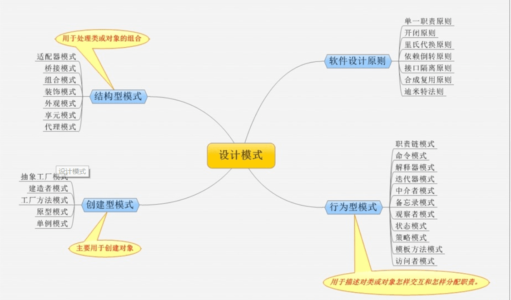

设计模式的深入内容较多，我这里只是列举一些基本思想，如果想深入理解，给大家推荐一些博客：


# 第 1 章 总论

## 概述

**概念：**设计模式（Design pattern）是一套被反复使用、多数人知晓的、经过分类编目的、代码设计经验的总结。使用设计模式是为了可重用代码、让代码更容易被他人理解、保证代码可靠性。

设计模式具有“适应需求变化”的优点。

**基本原则：**模块应对外扩展开放，而对修改关闭，要针对接口，而不是组合，抽象不应该依赖于细节，细节应当依赖于抽象

**基本分类：**共23种模式 3种分类 创建型5 结构型7 行为型11




## 创建型5种：相公生原子

对象实例化的模式，创建型模式用于解耦对象的实例化过程。

抽象工厂模式（Abstract Factory Pattern） 

定义：（为创建一组相关或相互依赖的对象提供一个接口，而且无须指定它们的具体类。）  

 　所谓抽象工厂模式就是提供一个接口，用于创建相关或者依赖对象的家族，而不需要明确指定具体类。他允许客户端使用抽象的接口来创建一组相关的产品，而不需要关系实际产出的具体产品是什么。这样一来，客户就可以从具体的产品中被解耦。它的优点是隔离了具体类的生成，使得客户端不需要知道什么被创建了，而缺点就在于新增新的行为会比较麻烦，因为当添加一个新的产品对象时，需要更加需要更改接口及其下所有子类。

工厂方法模式

定义：（定义一个用于创建对象的接口，让子类决定实例化哪一个类。工厂方法使一个类的实例化延迟到其子类。）

　　工厂方法模式非常符合“开闭原则”，当需要增加一个新的产品时，我们只需要增加一个具体的产品类和与之对应的具体工厂即可，无须修改原有系统。同时在工厂方法模式中用户只需要知道生产产品的具体工厂即可，无须关系产品的创建过程，甚至连具体的产品类名称都不需要知道。虽然他很好的符合了“开闭原则”，但是由于每新增一个新产品时就需要增加两个类，这样势必会导致系统的复杂度增加。

 

生成器模式（Builder Pattern） 

定义：（将一个复杂对象的构建与它的表示分离，使得同样的构建过程可以创建不同的表示。）

使用场景：

● 相同的方法，不同的执行顺序，产生不同的事件结果时，可以采用建造者模式。

● 多个部件或零件，都可以装配到一个对象中，但是产生的运行结果又不相同时，则可以使用该模式。

● 产品类非常复杂，或者产品类中的调用顺序不同产生了不同的效能，这个时候使用建造者模式非常合适。

 

 

原型模式（Prototype Pattern）

定义：（用原型实例指定创建对象的种类，并且通过拷贝这些原型创建新的对象。）

 

单子模式 （Singleton Pattern）

定义：（确保某一个类只有一个实例，而且自行实例化并向整个系统提供这个实例。）

使用场景：

● 要求生成唯一序列号的环境；

● 在整个项目中需要一个共享访问点或共享数据，例如一个Web页面上的计数器，可以不用把每次刷新都记录到数据库中，使用单例模式保持计数器的值，并确保是线程安全的；

● 创建一个对象需要消耗的资源过多，如要访问IO和数据库等资源；

● 需要定义大量的静态常量和静态方法（如工具类）的环境，可以采用单例模式（当然，也可以直接声明为static的方式）。

　　当系统中只需要一个实例对象或者系统中只允许一个公共访问点，除了这个公共访问点外，不能通过其他访问点访问该实例时，可以使用单例模式。

　　单例模式的主要优点就是节约系统资源、提高了系统效率，同时也能够严格控制客户对它的访问。也许就是因为系统中只有一个实例，这样就导致了单例类的职责过重，违背了“单一职责原则”，同时也没有抽象类，所以扩展起来有一定的困难。

实现：

1）懒汉式——线程不安全

2）饿汉式——线程安全：

采取直接实例化 uniqueInstance 的方式就不会产生线程不安全问题。

但是直接实例化的方式也丢失了延迟实例化带来的节约资源的好处。

 

3）懒汉式——线程安全

4）双重校验锁——线程安全

5）静态内部类

6）枚举


## 结构型7种：乔装打扮想外住

把类或对象结合在一起形成一个更大的结构。

桥模式（Bridge Pattern）

定义：（将抽象和实现解耦，使得两者可以独立地变化。）

使用场景：

● 不希望或不适用使用继承的场景

● 接口或抽象类不稳定的场景

● 重用性要求较高的场景

 

注意：

发现类的继承有N层时，可以考虑使用桥梁模式。桥梁模式主要考虑如何拆分抽象和实现。

 

装饰（Decorator）模式

定义：（动态地给一个对象添加一些额外的职责。就增加功能来说，装饰模式相比生成子类更为灵活。）

使用场景：

● 需要扩展一个类的功能，或给一个类增加附加功能。

● 需要动态地给一个对象增加功能，这些功能可以再动态地撤销。

● 需要为一批的兄弟类进行改装或加装功能，当然是首选装饰模式。

 

代理模式（Proxy Pattern） 

定义：（为其他对象提供一种代理以控制对这个对象的访问。）

 

适配器模式（Adapter Pattern）

定义：（将一个类的接口变换成客户端所期待的另一种接口，从而使原本因接口不匹配而无法在一起工作的两个类能够在一起工作。）

使用场景：

你有动机修改一个已经投产中的接口时，适配器模式可能是最适合你的模式。比如系统扩展了，需要使用一个已有或新建立的类，但这个类又不符合系统的接口，怎么办？使用适配器模式，这也是我们例子中提到的。

注意事项：

详细设计阶段不要考虑使用适配器模式，使用主要场景为扩展应用中。

 

享元模式（Flyweight Pattern）

定义：（使用共享对象可有效地支持大量的细粒度的对象。）

使用场景：

● 系统中存在大量的相似对象。

● 细粒度的对象都具备较接近的外部状态，而且内部状态与环境无关，也就是说对象没有特定身份。

● 需要缓冲池的场景。

注意：

● 享元模式是线程不安全的，只有依靠经验，在需要的地方考虑一下线程安全，在大部分场景下不用考虑。对象池中的享元对象尽量多，多到足够满足为止。

● 性能安全：外部状态最好以java的基本类型作为标志，如String，int，可以提高效率。

 

外观模式（Facade Pattern）

定义：（要求一个子系统的外部与其内部的通信必须通过一个统一的对象进行。门面模式提供一个高层次的接口，使得子系统更易于使用。）

使用场景：

● 为一个复杂的模块或子系统提供一个供外界访问的接口

● 子系统相对独立——外界对子系统的访问只要黑箱操作即可

● 预防低水平人员带来的风险扩散

注意：

●一个子系统可以有多个门面

●门面不参与子系统内的业务逻辑

 

## 行为型11种

访问者通过观察备忘录模版状态命令中介者迭代解释职责策略

 访问者模式（Visitor Pattern）

定义：（封装一些作用于某种数据结构中的各元素的操作，它可以在不改变数据结构的前提下定义作用于这些元素的新的操作。）

 

 

观察者模式（Observer Pattern）

定义：（定义对象间一种一对多的依赖关系，使得每当一个对象改变状态，则所有依赖于它的对象都会得到通知并被自动更新。）

使用场景：

● 关联行为场景。需要注意的是，关联行为是可拆分的，而不是“组合”关系。

● 事件多级触发场景。

● 跨系统的消息交换场景，如消息队列的处理机制。

注意：

● 广播链的问题

在一个观察者模式中最多出现一个对象既是观察者也是被观察者，也就是说消息最多转发一次（传递两次）。

● 异步处理问题

观察者比较多，而且处理时间比较长，采用异步处理来考虑线程安全和队列的问题。

 

 备忘录模式（Memento Pattern）

定义：（在不破坏封装性的前提下，捕获一个对象的内部状态，并在该对象之外保存这个状态。这样以后就可将该对象恢复到原先保存的状态。）

使用场景：

● 需要保存和恢复数据的相关状态场景。

● 提供一个可回滚（rollback）的操作。

● 需要监控的副本场景中。

● 数据库连接的事务管理就是用的备忘录模式。

注意：

●备忘录的生命期

●备忘录的性能

  不要在频繁建立备份的场景中使用备忘录模式（比如一个for循环中）。

 

 

模版模式（Template Method Pattern）

定义：（定义一个操作中的算法的框架，而将一些步骤延迟到子类中。使得子类可以不改变一个算法的结构即可重定义该算法的某些特定步骤。）

 

 

状态模式

定义：（当一个对象内在状态改变时允许其改变行为，这个对象看起来像改变了其类。）

使用场景：

● 行为随状态改变而改变的场景

这也是状态模式的根本出发点，例如权限设计，人员的状态不同即使执行相同的行为结果也会不同，在这种情况下需要考虑使用状态模式。

● 条件、分支判断语句的替代者

注意：

状态模式适用于当某个对象在它的状态发生改变时，它的行为也随着发生比较大的变化，也就是说在行为受状态约束的情况下可以使用状态模式，而且使用时对象的状态最好不要超过5个。

 

命令模式

定义：（将一个请求封装成一个对象，从而让你使用不同的请求把客户端参数化，对请求排队或者记录请求日志，可以提供命令的撤销和恢复功能。）

 

 

中介者（mediator）模式

定义：（用一个中介对象封装一系列的对象交互，中介者使各对象不需要显示地相互作用，从而使其耦合松散，而且可以独立地改变它们之间的交互。）

使用场景：

中介者模式适用于多个对象之间紧密耦合的情况，紧密耦合的标准是：在类图中出现了蜘蛛网状结构，即每个类都与其他的类有直接的联系。

 

 

迭代器模式（Iterator Pattern）

定义：（它提供一种方法访问一个容器对象中各个元素，而又不需暴露该对象的内部细节。）

 

解释器模式（Interpreter Pattern）

定义：（给定一门语言，定义它的文法的一种表示，并定义一个解释器，该解释器使用该表示来解释语言中的句子。）

使用场景：

● 重复发生的问题可以使用解释器模式

● 一个简单语法需要解释的场景

 

注意：

尽量不要在重要的模块中使用解释器模式，否则维护会是一个很大的问题。在项目中可以使用shell、JRuby、Groovy等脚本语言来代替解释器模式，弥补Java编译型语言的不足。

 

职责链模式

定义：（使多个对象都有机会处理请求，从而避免了请求的发送者和接受者之间的耦合关系。将这些对象连成一条链，并沿着这条链传递该请求，直到有对象处理它为止。）

 

 

 

策略模式（Strategy Pattern）

定义：（定义一组算法，将每个算法都封装起来，并且使它们之间可以互换。）

使用场景：

● 多个类只有在算法或行为上稍有不同的场景。

● 算法需要自由切换的场景。

● 需要屏蔽算法规则的场景。

注意事项：具体策略数量超过4个，则需要考虑使用混合模式

 

最后 加上两个 mvc 既是架构风格 也可以是 设计模式
筛选器模式 java .net 在注册访问时 常用的方法
1、策略 2、观察者、3、装饰 4、工厂 5、单子 6、命令 7、适配器 8模版 9、组合 10、状态
设计模式 是干啥的 ？ 是 对于一类问题的通用解决办法
四要素 ：模式名称、问题、解决方案、效果

 


组合（Composite）模式

定义：（将对象组合成树形结构以表示“部分-整体”的层次结构，使得用户对单个对象和组合对象的使用具有一致性。）

使用场景：

● 维护和展示部分-整体关系的场景，如树形菜单、文件和文件夹管理。

● 从一个整体中能够独立出部分模块或功能的场景。

注意：

只要是树形结构，就考虑使用组合模式。


# 第 2 章 七大原则

## 设计模式的目的

编写软件过程中，程序员面临着来自耦合性，内聚性以及可维护性，可扩展性，重用性，灵活性等多方面的挑战，设计模式是为了让程序(软件)，具有更好

代码重用性 (即：相同功能的代码，不用多次编写)

可读性 (即：编程规范性, 便于其他程序员的阅读和理解)

可扩展性 (即：当需要增加新的功能时，非常的方便，称为可维护)

可靠性 (即：当我们增加新的功能后，对原来的功能没有影响)

使程序呈现高内聚，低耦合的特性：

设计模式原则，其实就是程序员在编程时，应当遵守的原则 程序员在编程时，应当遵守的原则，也是各种设计模式的基础 设计模式的基础(即：设计模式为什么 设计模式为什么这样设计的依据 这样设计的依据)

## 一：单一职责原则

对类来说的，即一个类应该只负责一项职责 即一个类应该只负责一项职责。如类 A 负责两个不同职责：职责 1，职责 2。当职责 1 需求变更而改变 A 时，可能造成职责 2 执行错误，所以需要将类 A 的粒度分解为 A1，A2

 

## 二：接口隔离原则

客户端不应该依赖它不需要的接口，即一个类对另一个类的依赖应该建立在最小的接口 一个类对另一个类的依赖应该建立在最小的接口上

如：

类 A 通过接口 Interface1 依赖类 B，类 C 通过接口 Interface1 依赖类 D，如果接口 Interface1 对于类 A 和类 C来说不是最小接口，那么类 B 和类 D 必须去实现他们不需要的方法。

按隔离原则应当这样处理：将接口 将接口 Interface1 拆分为独立的几个接口 独立的几个接口(这里我们拆分成 这里我们拆分成 3 个接口 个接口)， 类 A 和类 C 分别与他们需要的接口建立依赖关系。也就是采用接口隔离原则

 

## 三：依赖倒转原则

高层模块不应该依赖低层模块，二者都应该依赖其抽象

抽象不应该依赖细节，细节应该依赖抽象

抽象不应该依赖细节，细节应该依赖抽象

依赖倒转(倒置)的中心思想是面向接口编程

依赖倒转原则是基于这样的设计理念：相对于细节的多变性，抽象的东西要稳定的多。以抽象为基础搭建的架构比以细节为基础的架构要稳定的多。在 java 中，抽象指的是接口或抽象类，细节就是具体的实现类

使用接口或抽象类的目的是制定好规范，而不涉及任何具体的操作，把展现细节的任务交给他们的实现类去完成

依赖关系传递的三种方式：接口传递，构造方法传递，setter方式传递

## 四：里氏替换原则

继承在给程序设计带来便利的同时 继承在给程序设计带来便利的同时， 也带来了弊端 也带来了弊端。 比如使用继承会给程序带来侵入性 侵入性， 程序的可移植性降低增加对象间的耦合性，如果一个类被其他的类所继承，则当这个类需要修改时，必须考虑到所有的子类，并且父类修改后，所有涉及到子类的功能都有可能产生故障

如何正确的继承——>里氏替换原则

所有引用基类的地方必须能够透明地使用其子类对象

## 五：开闭原则

一个软件实体如类，模块和函数应该对扩展开放 对扩展开放(对提供方 对提供方)，对修改关闭 修改关闭(对使用方 对使用方)。用抽象构建框架，用实现扩展细节。

当软件需要变化时，尽量通过扩展软件 通过扩展软件实体的行为来实现变化，而不是通过修改 通过修改已有的代码来实现变化。

## 六：迪米特法则

迪米特法则(Demeter Principle)又叫最少知道原则 最少知道原则，即一个类对自己依赖的类知道的越少越好 对自己依赖的类知道的越少越好。也就是说，对于被依赖的类不管多么复杂，都尽量将逻辑封装在类的内部。对外除了提供的 public 方法，不对外泄露任何信息

## 七：合成复用原则

原则是尽量使用合成/聚合的方式，而不是使用继承

## 设计原则核心思想

1.  找出应用中可能需要变化之处，把它们独立出来，不要和那些不需要变化的代码混在一起。

2.  针对接口编程，而不是针对实现编程。

3.  为了交互对象之间的松耦合设计而努力

# 第 3 章 单例模式（重）

## 1：概述

所谓类的单例设计模式，就是采取一定的方法保证在整个的软件系统中，对某个类只能存在一个对象实例，并且该类只提供一个取得其对象实例的方法(静态方法)。

2：单例模式有八种方式
**1) 饿汉式(静态常量 )**
**2) 饿汉式（静态代码块）**
3) 懒汉式(线程不安全)
4) 懒汉式(线程安全，同步方法)
5) 懒汉式(线程安全，同步代码块)
**6) 双重检查**
**7) 静态内部类**
**8) 枚举**

3：说明

1) 单例模式保证了 系统内存中该类只存在一个对象，节省了系统资源，对于一些需要频繁创建销毁的对象，使用单例模式可以提高系统性能

2) 当想实例化一个单例类的时候，必须要记住使用相应的获取对象的方法，而不是使用 new

3) 单例模式使用的场景 使用的场景：需要频繁的进行创建和销毁的对象 频繁的进行创建和销毁的对象、创建对象时耗时过多或耗费资源过多(即：重量级对象)，但又经常用到的对象、工具类对象 工具类对象、频繁访问数据库或文件的对象(比如数据源、 数据源、session 工厂 工厂等)

## 2：饿汉式（静态常量）

```
class Singleton {

//1. 构造器私有化, 外部能 new

private Singleton() {

}

//2.本类内部创建对象实例

private final static Singleton instance = new Singleton();

//3. 提供一个公有的静态方法，返回实例对象

public static Singleton getInstance() {

return instance;

}
```


```
 1 public class SingletonTest01 {
 2 public static void main(String[] args) {
 3 //测试
 4 Singleton instance = Singleton.getInstance();
 5 Singleton instance2 = Singleton.getInstance();
 6 System.out.println(instance == instance2); //true
 7 System.out.println("instance.hashCode=" + instance.hashCode());
 8 System.out.println("instance2.hashCode=" + instance2.hashCode());
 9 }
10 }
```


这种方式在类装载时完成实例化，避免线程同步问题。

 缺点：在类装载的时候就完成实例化，没有达到 Lazy Loading 的效果。如果从始至终从未使用过这个实例，则会造成内存的浪费

这种单例模式可用，可能造成内存浪费

 

## 3：饿汉式（静态代码块）


```
//饿汉式(静态变量)
class Singleton {
//1. 构造器私有化, 外部能 new
private Singleton() {}

//2.本类内部创建对象实例——不同处
private static Singleton instance;
static {
 // 在静态代码块中，创建单例对象i
nstance = new Singleton();
}

//3. 提供一个公有的静态方法，返回实例对象
public static Singleton getInstance() {
return instance;
}
}
```

System.out.println(instance == instance2); // true

这种方式和上面的方式其实类似，只不过将类实例化的过程放在了静态代码块中，也是在类装载的时候，就执行静态代码块中的代码，初始化类的实例。优缺点和上面是一样的。

## 4：懒汉式（线程不安全）


```
class Singleton {
private static Singleton instance;
private Singleton() {}

//提供一个静态的公有方法，当使用到该方法时，才去创建 instance
//即懒汉式
public static Singleton getInstance() {
if(instance == null) {
instance = new Singleton();
}
return instance;

}
}
```

起到了 Lazy Loading 的效果，但是只能在单线程下使用。

如果在多线程下，一个线程进入了 if (singleton == null)判断语句块，还未来得及往下执行，另一个线程也通过了这个判断语句，这时便会产生多个实例 产生多个实例。

所以在多线程环境下不可使用这种方式

结论：在实际开发中，不要使用 不要使用这种方式.

## 5：懒汉式（线程安全，同步方法）

```
// 懒汉式(线程安全，同步方法)
class Singleton {
private static Singleton instance;
private Singleton() {}
//提供一个静态的公有方法，加入同步处理的代码，解决线程安全问题
//即懒汉式
public static synchronized Singleton getInstance() {
if(instance == null) {
instance = new Singleton();
}
return instance;
}
}
```

1) 解决了线程安全 线程安全问题

2) 效率太低了，每个线程在想获得类的实例时候，执行 getInstance()方法都要进行同步。而其实这个方法只执行一次实例化代码就够了，后面的想获得该类实例，直接 return 就行了。方法进行同步效率太 方法进行同步效率太低

3) 结论：在实际开发中，不推荐 不推荐使用这种方式

 

## 6：懒汉式（线程安全，同步代码块）

简单变成，同上

```
// 懒汉式(线程安全，同步代码块)
class Singleton {
private static Singleton instance;
private Singleton() {}
//提供一个静态的公有方法，加入同步处理的代码，解决线程安全问题
//即懒汉式
public static synchronized Singleton getInstance() {
if(instance == null) {


synchronized(Singleton.class){
    singleton= new Singleton();
}


instance = new Singleton();
}
return instance;
}
}
```

 

7双重检查

```
// 懒汉式(线程安全，同步方法)
class Singleton {
private static volatile Singleton instance;
private Singleton() {}
//提供一个静态的公有方法，加入双重检查代码，解决线程安全问题, 同时解决懒加载问题
//同时保证了效率, 推荐使用
public static synchronized Singleton getInstance() {
  if(instance == null) {
    synchronized (Singleton.class) {
      if(instance == null) {
         instance = new Singleton();
}
}
}
return instance;
}
}
```

1) Double-Check 概念是多线程开发中常使用到的，如代码中所样就可以保证线程安全了。2) 这样，实例化代码只用执行一次，后面再次访问时，判断 免的反复进行方法同步.

3) 线程安全 线程安全；延迟加载 延迟加载；效率较高 效率较高

4) 结论：在实际开发中，推荐使用这种单例设计模 推荐使用这种单例设计模式

## 8：静态内部类

```
// 静态内部类完成， 推荐使用
class Singleton {
private static volatile Singleton instance;
//构造器私有化private Singleton() {}
//写一个静态内部类,该类中有一个静态属性 
Singletonprivate static class SingletonInstance {
private static final Singleton INSTANCE = new Singleton();
}
//提供一个静态的公有方法，直接返回 SingletonInstance.INSTANCE
public static synchronized Singleton getInstance() {
return SingletonInstance.INSTANCE;
}
}
```

1) 这种方式采用了类装载的机制来保证初始化实例时只有一个线程。

2) 静态内部类方式在 Singleton 类被装载时并不会立即实例化，而是在需要实例化时，调用 getInstance 方法，才会装载 SingletonInstance 类，从而完成 Singleton 的实例化。

3) 类的静态属性只会在第一次加载类的时候初始化，所以在这里，JVM 帮助我们保证了线程的安全性，在类进行初始化时，别的线程是无法进入的。

4) 优点：避免了线程不安全， 避免了线程不安全，利用静态内部类特点实现延迟加载，效率 静态内部类特点实现延迟加载，效率高

5) 结论：推荐 推荐使用.

## 9：枚举

```
//使用枚举，可以实现单例, 推荐
enum Singleton {
INSTANCE; //属性
public void sayOK() {
System.out.println("ok~");
}
}
```

 不仅能避免多线程同步问题，而且还能防止反序列化重新创建新的对象。

## JDK 应用的源码分析

1.  我们 JDK 中，java.lang.Runtime 就是经典的单例模式(饿汉式)


Mybatis中ErrorContext和LogFactory；

Spring依赖注入Bean实例默认是单例的。Spring的依赖注入（包括lazy-init方式）都是发生在AbstractBeanFactory的getBean里。getBean的doGetBean方法调用getSingleton进行bean的创建。

# 第4章：工厂模式

Mybatis中SqlSessionFactory、ObjectFactory、MapperProxyFactory；

Spring中的BeanFactory就是简单工厂模式的体现，根据传入一个唯一的标识来获得Bean对象

# 第5章：原型模式


# 第6章：建造者模式


Mybatis中

例如SqlSessionFactoryBuilder、XMLConfigBuilder、XMLMapperBuilder、XMLStatementBuilder、CacheBuilder；


# 第七章：适配器模式

例如Log的Mybatis接口和它对jdbc、log4j等各种日志框架的适配实现；


# 第八章：桥接模式


# 第九章：装饰者模式


例如Cache包中的cache.decorators子包中等各个装饰者的实现；

# 第十章：组合模式

例如SqlNode和各个子类ChooseSqlNode等；

# 第十一章：外观模式


# 第十二章：享元模式


# 第十三章：代理模式


Mybatis实现的核心，比如MapperProxy、ConnectionLogger，用的jdk的动态代理；还有executor.loader包使用了cglib或者javassist达到延迟加载的效果；

# 第十四章：模板方法模式

例如BaseExecutor和SimpleExecutor，还有BaseTypeHandler和所有的子类例如IntegerTypeHandler；


# 第十五章：命令模式


# 第十六章：访问者模式


# 第十七章：迭代器模式


例如迭代器模式PropertyTokenizer；


# 第十八章：观察者模式

spring的事件驱动模型使用的是 观察者模式 ，Spring中Observer模式常用的地方是listener的实现。如：ApplicationContextEvent、ApplicationListener

# 第十九章：中介者模式

# 第二十章：备忘录模式

# 第二十一章：解释器模式

# 第二十二章：状态模式

# 第二十三章：策略模式

Spring框架的资源访问Resource接口。该接口提供了更强的资源访问能力，Spring 框架本身大量使用了 Resource 接口来访问底层资源。

- UrlResource：访问网络资源的实现类。
- ClassPathResource：访问类加载路径里资源的实现类。
- FileSystemResource：访问文件系统里资源的实现类。
- ServletContextResource：访问相对于 ServletContext 路径里的资源的实现类.
- InputStreamResource：访问输入流资源的实现类。
- ByteArrayResource：访问字节数组资源的实现类。


# 第二十四章：责任链模式