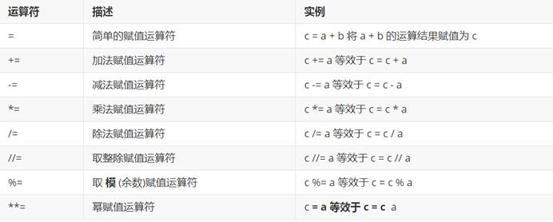
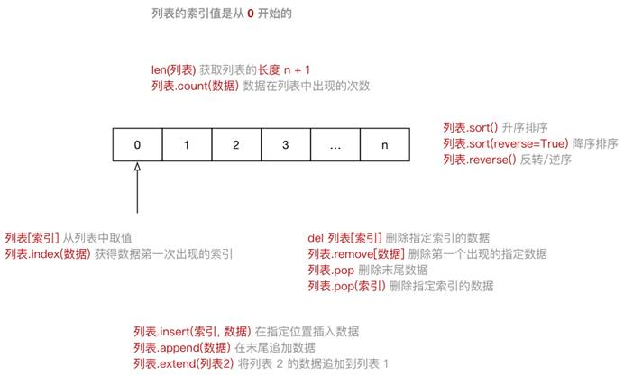
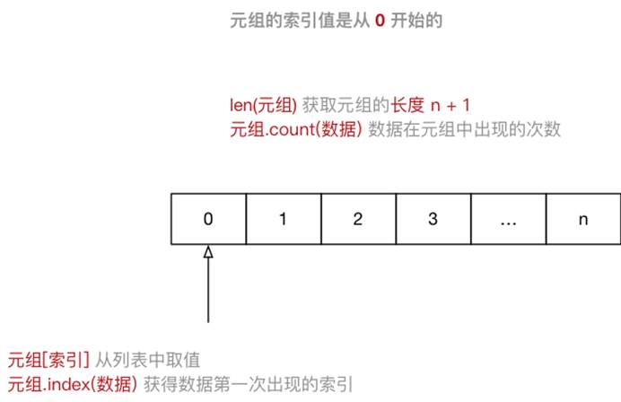
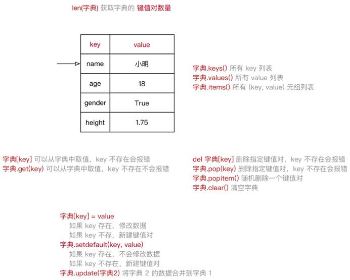
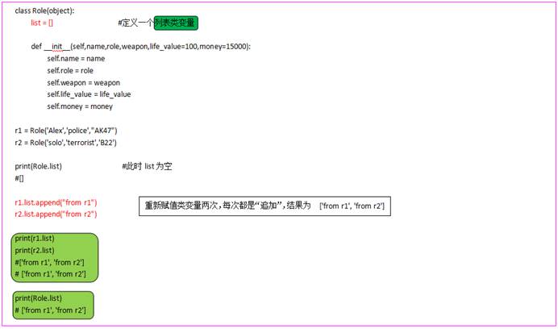
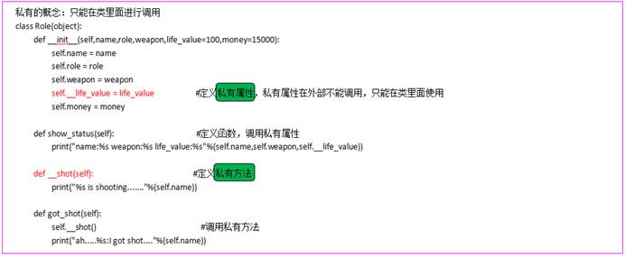

# 第一章：认识Python

## 1：解释器

**计算机不能直接理解任何除机器语言以外的语言**，所以必须要把程序员所写的程序语言翻译成机器语言，计算机才能执行程序。**将其他语言翻译成机器语言的工具，被称为编译器**

编译器翻译的方式有两种：一个是**编译**，另外一个是**解释**。两种方式之间的区别在于**翻译时间点的不同**。当编译器**以解释方式运行的时候**，也称之为**解释器** 

- **编译型语言**：程序在执行之前需要一个专门的编译过程，把程序编译成为机器语言的文件，运行时不需要重新翻译，直接使用编译的结果就行了。程序执行效率高，依赖编译器，跨平台性差些。如 C、C++
- **解释型语言**：解释型语言编写的程序不进行预先编译，以文本方式存储程序代码，会将代码一句一句直接运行。在发布程序时，看起来省了道编译工序，但是在运行程序的时候，必须先解释再运行

**编译型语言和解释型语言对比**

- **速度** —— 编译型语言比解释型语言执行速度快
- **跨平台性** —— 解释型语言比编译型语言跨平台性好

## 2：python特点

 

 

## 3：错误

SyntaxError: invalid syntax

 

语法错误：语法无效

 

IndentationError: unexpected indent

 

缩进错误：不期望出现的缩进

 

 

 

 

 

Python的三种执行方式

1：解释器

官方C语言开发的解释器Cpython

2：交互式

Shell命令行，适合小的测试，代码无法保存

Exit()或者Ctrl+d即可退出

使用：iPython

3：ipython

 

# 第二章：开发工具PyCharm使用

参考开发工具pycharm

# 第三章：语法基础

## 1：注释

单行注释

```python
# 这是第一个单行注释
print("hello python")
```

多行注释

要在 Python 程序中使用多行注释，可以用 **一对** **连续的** **三个** **引号**(单引号和双引号都可以)

```python
"""
这是一个多行注释

在多行注释之间，可以写很多很多的内容……
""" 
print("hello python")
```

三个引号还有一种含义，是保持原本的语句格式，三引号内的数据会保留原本的格式，可以与单引号联合使用

## 2：运算符

算术运算符：

| 运算符 |  描述  | 实例                                       |
| :----: | :----: | ------------------------------------------ |
|   +    |   加   | 10 + 20 = 30                               |
|   -    |   减   | 10 - 20 = -10                              |
|   *    |   乘   | 10 * 20 = 200                              |
|   /    |   除   | 10 / 20 = 0.5                              |
|   //   | 取整除 | 返回除法的整数部分（商） 9 // 2 输出结果 4 |
|   %    | 取余数 | 返回除法的余数 9 % 2 = 1                   |
|   **   |   幂   | 又称次方、乘方，2 ** 3 = 8                 |

比较运算符


逻辑运算符


赋值运算符



运算符优先级


 

 

## 3：变量

在 Python 中，每个变量 **在使用前都必须赋值**，变量 **赋值以后** 该变量 **才会被创建**

* 在 `Python` 中定义变量是 **不需要指定类型**（在其他很多高级语言中都需要）
* 数据类型可以分为 **数字型** 和 **非数字型**
* 数字型
    * 整型 (`int`)
    * 浮点型（`float`）
    * 布尔型（`bool`） 
        * 真 `True` `非 0 数` —— **非零即真**
        * 假 `False` `0`
    * 复数型 (`complex`)
        * 主要用于科学计算，例如：平面场问题、波动问题、电感电容等问题
* 非数字型
    * 字符串
    * 列表
    * 元组
    * 字典


**不同类型之间的计算：**

1：Bool类型在计算时：

- **True** **对应的数字是** **1**
- **False** **对应的数字是** **0**

 

**2：字符串拼接**


**3：数字不能与字符串计算**

类型错误：`+` 不支持的操作类型：`int` 和 `str`

 

**格式化输出：**

| 格式化字符 | 含义                                                         |
| ---------- | ------------------------------------------------------------ |
| %s         | 字符串                                                       |
| %d         | 有符号十进制整数，`%06d` 表示输出的整数显示位数，不足的地方使用 `0` 补全 |
| %f         | 浮点数，`%.2f` 表示小数点后只显示两位                        |
| %%         | 输出 `%`                                                     |

 

```python
print("我的名字叫 %s，请多多关照！" % name)
print("我的学号是 %06d" % student_no)
print("苹果单价 %.02f 元／斤，购买 %.02f 斤，需要支付 %.02f 元" % (price, weight, money))
print("数据比例是 %.02f%%" % (scale * 100))
```

 

## 4：结构

### 2：列表List

[1,2]其实就是数组

```python
name_list = ["zhangsan", "lisi", "wangwu"]
```



 

循环遍历

·    使用 for 就能够实现迭代遍历

```python
# for 循环内部使用的变量 in 列表
for name in name_list:

    循环内部针对列表元素进行操作
    print(name)
```

### 3：元组Tuple

元素不能修改,索引从0开始

```python
info_tuple = ("zhangsan", 18, 1.75)
```

当只有一个元素时，也需要在后边添加逗号



 

实际应用中


**函数的 参数 和 返回值**，一个函数可以接收 **任意多个参数**，或者 **一次返回多个数据**

· **格式字符串**，格式化字符串后面的 () 本质上就是一个元组

· **让列表不可以被修改**，以保护数据安全

元组和列表之间的转换

·    使用 `list` 函数可以把元组转换成列表

```
list(元组) 
```

·    使用 `tuple` 函数可以把列表转换成元组

```
tuple(列表)
```

### 4：字典

无序的对象集合，使用键值对存储数据

**值** 可以取任何数据类型，但 **键** 只能使用 **字符串**、**数字**或 **元组**

 



 

```python
xiaoming = {"name": "小明",
            "age": 18,
            "gender": True,
            "height": 1.75}
```

遍历：

·    **遍历** 就是 **依次** 从 **字典** 中获取所有键值对

```python
# for 循环内部使用的 `key 的变量` in 字典
for k in xiaoming:

    print("%s: %s" % (k, xiaoming[k]))
```

提示：在实际开发中，由于字典中每一个键值对保存数据的类型是不同的，所以针对字典的循环遍历需求并不是很多

 

### 5：字符串

在 Python 中可以使用 **一对双引号** " 或者 **一对单引号** ' 定义一个字符串

 

 

### 6：公共方法

内置函数

| 函数              | 描述                              | 备注                        |
| ----------------- | --------------------------------- | --------------------------- |
| len(item)         | 计算容器中元素个数                |                             |
| del(item)         | 删除变量                          | del 有两种方式              |
| max(item)         | 返回容器中元素最大值              | 如果是字典，只针对 key 比较 |
| min(item)         | 返回容器中元素最小值              | 如果是字典，只针对 key 比较 |
| cmp(item1, item2) | 比较两个值，-1 小于/0 相等/1 大于 | Python 3.x 取消了 cmp 函数  |

 

切片

| 描述 | Python 表达式      | 结果    | 支持的数据类型     |
| :--: | ------------------ | ------- | ------------------ |
| 切片 | "0123456789"[::-2] | "97531" | 字符串、列表、元组 |

* **切片** 使用 **索引值** 来限定范围，从一个大的 **字符串** 中 **切出** 小的 **字符串**
* **列表** 和 **元组** 都是 **有序** 的集合，都能够 **通过索引值** 获取到对应的数据
* **字典** 是一个 **无序** 的集合，是使用 **键值对** 保存数据

 

# 第四章：函数

定义函数的格式如下：

```
def 函数名():

   函数封装的代码
   ……
```

1. `def` 是英文 `define` 的缩写
2. **函数名称** 应该能够表达 **函数封装代码** 的功能，方便后续的调用
3. **函数名称** 的命名应该 **符合** **标识符的命名规则**
    * 可以由 **字母**、**下划线** 和 **数字** 组成
    * **不能以数字开头**
    * **不能与关键字重名**

# 第五章：面向对象

 




 




# 第六章：网络


第七章：多线程


第八章：数据库


# 第十章：发展方向

## 1：Web开发

Django框架，Flask框架，Pyramid，Japronto（高性能微服务架构），Tornado（网络异步框架）等；

## 2：爬虫

数据抓取：Scapy，PySpider，Portia、Beautiful Soup、Cola(分布式爬虫框架)。

## 3：数据分析

NumPy、Scipy、Pandas。

## 4：数据可视化

Matplotlib、Seaborn、Bokeh。

## 5：人工智能

TensorFlow

## 6：测试

自动化测试

## 第十一章

1：安装pip

打开网址https://bootstrap.pypa.io/get-pip.py另存为；

打开cmd，找到get-pip.py文件的路径 ，然后输入python get-pip.py，敲回车就开始安装。

测试：cmd输入pip 有提示即安装成功

