# 一：JVM内存结构

Java虚拟机在运行时，会把内存空间分为若干个区域。Java虚拟机所管理的内存区域分为如下部分：方法区、堆内存、虚拟机栈、本地方法栈、程序计数器。

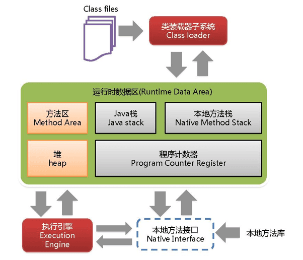

## 1、类装载器ClassLoader

负责加载class文件，class文件在文件开头有特定的文件标识，并且ClassLoader只负责class文件的加载，至于它是否
可以运行，则是由执行引擎（Execution Engine）决定。

虚拟机自带的加载器：

启动类加载器（Bootstrap）：由C++编写，不是前端框架Bootstrap。

扩展类加载器（Extension）：由Java语言编写

应用程序类加载器（App）：由Java语言编写，也叫系统类加载器，加载当前应用的classpath的所有类。

用户自定义加载器

Java.lang.ClassLoader的之类，用户可以定制的加载方式。

类加载器的双亲委派机制

某个特定的类加载器在加载类的请求时，首先将加载任务委托给父类加载器，依次递归，如果父类加载器可以完成类加载任务，就成功返回；只有父类加载器无法完成该加载任务时，才自己去加载。

沙箱机制（防止恶意代码对java本身的破坏）

当用户命名了和Java一样的类时，Java会首先加载自带的类。

## 2、方法区

方法区是线程共享的，通常用来保存装载的类的元结构信息。主要用于存储虚拟机加载的类信息、常量、静态变量，以及编译器编译后的代码等数据。，字符串池

在jdk1.7及其之前，方法区是堆的一个“逻辑部分”（一片连续的堆空间）。也有人用“永久代”表示方法区。

在jdk1.8中，方法区已经不存在，原方法区中存储的类信息、编译后的代码数据等已经移动到了元空间（MetaSpace）中，元空间并没有处于堆内存上，而是直接占用的本地内存（NativeMemory）。


## 3：堆内存

一个JVM实例只存在一个堆内存，堆内存的大小是可以调节的。类加载器读取了类文件后，需要把类，方法，穿变量放到堆内存中，New创建对象在堆内存

它是JVM管理的内存中最大的一块区域，堆内存和方法区都被所有线程共享，在虚拟机启动时创建。在垃圾收集的层面上来看，由于现在收集器基本上都采用分代收集算法，因此堆还可以分为新生代（YoungGeneration）和老年代（OldGeneration），新生代还可以分为Eden、FromSurvivor、To Survivor。

JAVA1.7如下图，但在Java1.8中，其他基本没变，只是将Perm变成了元空间


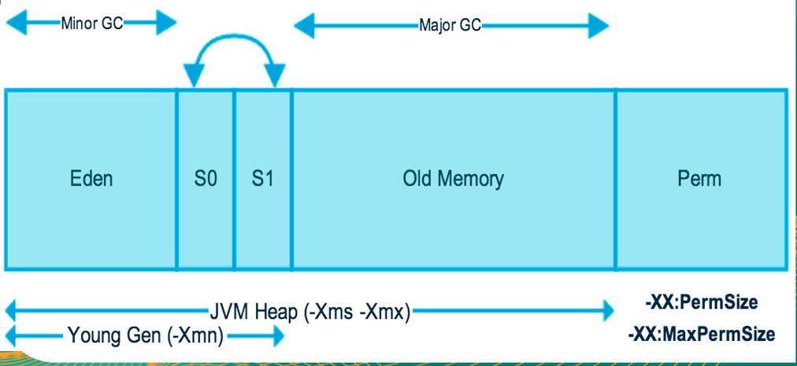


### 3.1：新生代

在方法中去new一个对象，那这方法调用完毕后，对象就会被回收，这就是一个典型的新生代对象。

新生代中的对象98%都是“朝生夕死”的，所以并不需要按照1:1的比例来划分内存空间，而是将**内存分为一块比较大的Eden空间和两块较小的Survivor空间**，每次使用Eden和其中一块Survivor。当回收时，将Eden和Survivor中还存活着的对象一次性地复制到另外一块Survivor空间上，最后清理掉Eden和刚才用过的Survivor空间。

**当Survivor空间不够用时，需要依赖于老年代进行分配担保，所以大对象直接进入老年代**。同时，**长期存活的对象将进入老年代**

### 3.2：老年代


### 3.3：永久代


2：诊断

Jmap：查看堆内存占用情况 jmap - heap 进程id

## 4：程序计数器

作用：记住下一条jvm指令的执行地址

特点：是线程私有的，不会存在内存溢出

程序计数器是一块非常小的内存空间，可以看做是当前线程执行字节码的行号指示器，每个线程都有一个独立的程序计数器，因此程序计数器是线程私有的一块空间，此外，程序计数器是Java虚拟机规定的唯一不会发生内存溢出的区域。

## 5：虚拟机栈

1：虚拟机栈也是每个线程私有的一块内存空间，它描述的是方法的内存模型。

虚拟机会为每个线程分配一个虚拟机栈，每个虚拟机栈中都有若干个栈帧，每个栈帧中存储了局部变量表、操作数栈、动态链接、返回地址等。一个栈帧就对应Java代码中的一个方法，当线程执行到一个方法时，就代表这个方法对应的栈帧已经进入虚拟机栈并且处于栈顶的位置，每一个Java方法从被调用到执行结束，就对应了一个栈帧从入栈到出栈的过程。

:2：栈内存溢出：栈帧过多导致栈内存溢出 栈帧过大导致栈内存溢出

## 6、本地方法栈

虚拟机栈执行的是Java方法，本地方法栈执行的是本地方法（Native
Method）,其他基本上一致

## 7：元空间

上面说到，jdk1.8中，已经不存在永久代（方法区），替代它的一块空间叫做“元空间”，和永久代类似，都是JVM规范对方法区的实现，但是元空间并不在虚拟机中，而是使用本地内存，元空间的大小仅受本地内存限制，但可以通过-XX:MetaspaceSize和-XX:MaxMetaspaceSize来指定元空间的大小。

# 二：垃圾回收机制

垃圾回收，就是通过垃圾收集器把内存中没用的对象清理掉。垃圾回收涉及到的内容有：

1、判断对象是否已死；

2、选择垃圾收集算法；

3、选择垃圾收集的时间；

4、选择适当的垃圾收集器清理垃圾（已死的对象）。

## 1:判断对象是否以死

判断对象是否已死就是找出哪些对象是已经死掉的，以后不会再用到的，就像地上有废纸、饮料瓶和百元大钞，扫地前要先判断出地上废纸和饮料瓶是垃圾，百元大钞不是垃圾。判断对象是否已死有引用计数算法和可达性分析算法。

### （1）引用计数算法

给每一个对象添加一个引用计数器，每当有一个地方引用它时，计数器值加1；每当有一个地方不再引用它时，计数器值减1，这样只要计数器的值不为0，就说明还有地方引用它，它就不是无用的对象。如下图，对象2有1个引用，它的引用计数器值为1，对象1有两个地方引用，它的引用计数器值为2
。

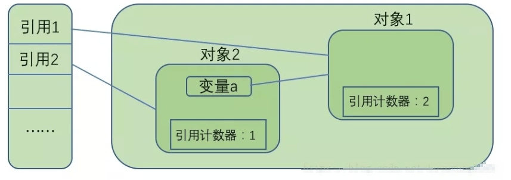

这种方法看起来非常简单，但目前许多主流的虚拟机都没有选用这种算法来管理内存，原因就是当某些对象之间互相引用时，无法判断出这些对象是否已死，如下图，对象1和对象2都没有被堆外的变量引用，而是被对方互相引用，这时他们虽然没有用处了，但是引用计数器的值仍然是1，无法判断他们是死对象，垃圾回收器也就无法回收。

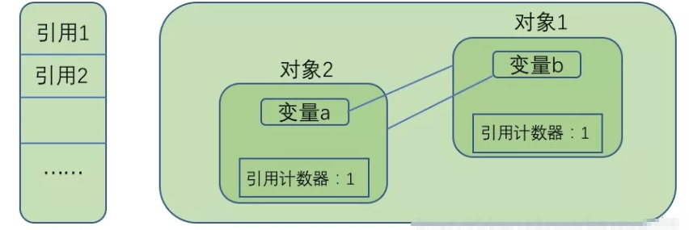

### （2）可达性分析算法

了解可达性分析算法之前先了解一个概念——GC Roots，垃圾收集的起点，可以作为GC
Roots的有虚拟机栈中本地变量表中引用的对象、方法区中静态属性引用的对象、方法区中常量引用的对象、本地方法栈中JNI（Native方法）引用的对象。

当一个对象到GC Roots没有任何引用链相连（GC
Roots到这个对象不可达）时，就说明此对象是不可用的，是死对象。如下图：object1、object2、object3、object4和GC
Roots之间有可达路径，这些对象不会被回收，但object5、object6、object7到GC
Roots之间没有可达路径，这些对象就被判了死刑。


#### 1：四种引用

（1）强引用 只有所有 GC Roots
对象都不通过【强引用】引用该对象，该对象才能被垃圾回收。

当内存空间不足，Java虚拟机宁愿抛出OutOfMemoryError错误，使程序异常终止，也不会靠随意回收具有强引用的对象来解决内存不足的问题。

（2） 软引用（SoftReference）
仅有软引用引用该对象时，在垃圾回收后，内存仍不足时会再次出发垃圾回收，回收软引用对象 可以配合引用队列来释放软引用自身。

（3） 弱引用（WeakReference）
仅有弱引用引用该对象时，在垃圾回收时，无论内存是否充足，都会回收弱引用对象
可以配合引用队列来释放弱引用自身

（4） 虚引用（PhantomReference） 必须配合引用队列使用，主要配合 ByteBuffer
使用，被引用对象回收时，会将虚引用入队， 由 Reference Handler
线程调用虚引用相关方法释放直接内存

### （3）方法区回收

上面说的都是对堆内存中对象的判断，方法区中主要回收的是废弃的常量和无用的类。

判断常量是否废弃可以判断是否有地方引用这个常量，如果没有引用则为废弃的常量。

判断类是否废弃需要同时满足如下条件：

该类所有的实例已经被回收（堆中不存在任何该类的实例）

加载该类的ClassLoader已经被回收

该类对应的java.lang.Class对象在任何地方没有被引用（无法通过反射访问该类的方法）

## 2、常用垃圾回收算法

### （1）标记-清除算法

分为标记和清除两个阶段，首先标记出所有需要回收的对象，标记完成后统一回收所有被标记的对象，如下图。

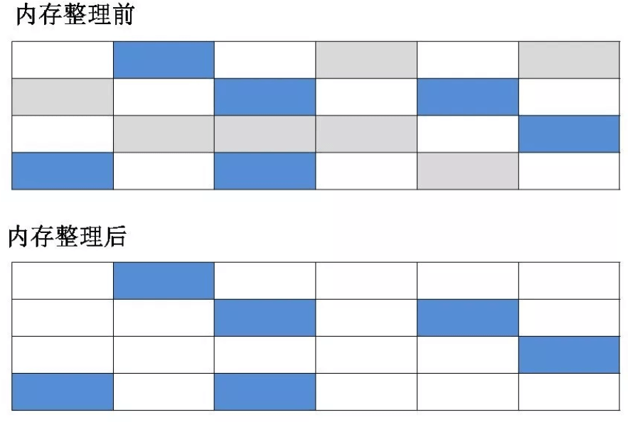

缺点：标记和清除两个过程效率都不高；标记清除之后会产生大量不连续的内存碎片。

### （2）复制算法

把内存分为大小相等的两块，每次存储只用其中一块，当这一块用完了，就把存活的对象全部复制到另一块上，同时把使用过的这块内存空间全部清理掉，往复循环，如下图。

缺点：实际可使用的内存空间缩小为原来的一半，比较适合。

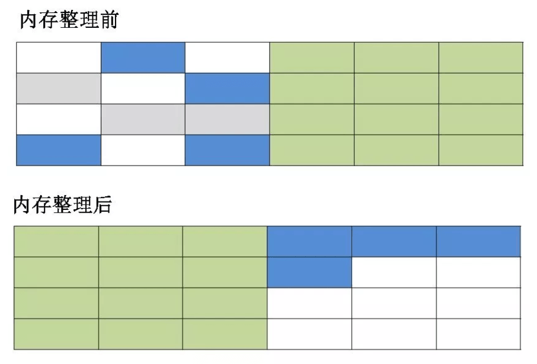

### （3）标记-整理算法

先对可用的对象进行标记，然后所有被标记的对象向一段移动，最后清除可用对象边界以外的内存，如下图。


### （4）分代收集算法

把堆内存分为新生代和老年代，新生代又分为Eden区、From Survivor和To
Survivor。一般新生代中的对象基本上都是朝生夕灭的，每次只有少量对象存活，因此采用复制算法，只需要复制那些少量存活的对象就可以完成垃圾收集；老年代中的对象存活率较高，就采用标记-清除和标记-整理算法来进行回收。

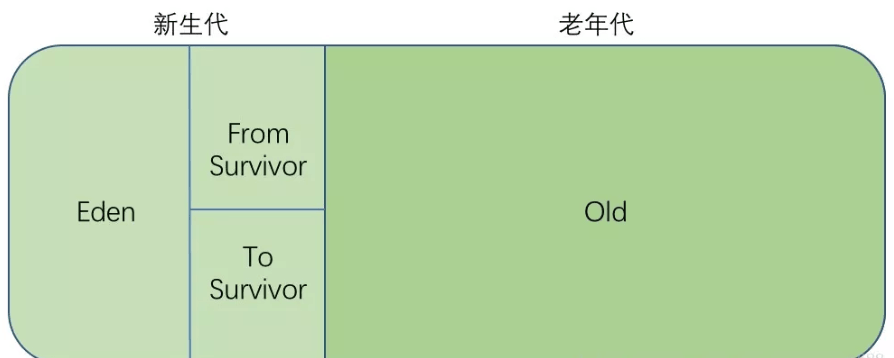

对象首先分配在伊甸园区域

新生代空间不足时，触发 minor gc，伊甸园和 from 存活的对象使用 copy 复制到 to
中，存活的 对象年龄加 1并且交换 from to

minor gc 会引发 stop the
world，暂停其它用户的线程，等垃圾回收结束，用户线程才恢复运行
当对象寿命超过阈值时，会晋升至老年代，最大寿命是15（4bit）

当老年代空间不足，会先尝试触发 minor gc，如果之后空间仍不足，那么触发 full
gc，STW的时 间更长

## 3、选择垃圾收集的时间

当程序运行时，各种数据、对象、线程、内存等都时刻在发生变化，当下达垃圾收集命令后就立刻进行收集吗？肯定不是，他们要在保证线程安全的前提下进行垃圾回收

安全点：从线程角度看，安全点可以理解为是在代码执行过程中的一些特殊位置，当线程执行到安全点的时候，说明虚拟机当前的状态是安全的，如果有需要，可以在这里暂停用户线程。当垃圾收集时，如果需要暂停当前的用户线程，但用户线程当时没在安全点上，则应该等待这些线程执行到安全点再暂停。理论上，解释器的每条字节码的边界上都可以放一个安全点，实际上，安全点基本上以“是否具有让程序长时间执行的特征”为标准进行选定。

安全区：安全点是相对于运行中的线程来说的，对于如sleep或blocked等状态的线程，收集器不会等待这些线程被分配CPU时间，这时候只要线程处于安全区中，就可以算是安全的。安全区就是在一段代码片段中，引用关系不会发生变化，可以看作是被扩展、拉长了的安全点。

## 4、常见垃圾收集器

新生代收集器：Serial、ParNew、Parallel Scavenge

老年代收集器：Serial Old、CMS、Parallel Old

堆内存垃圾收集器：G1

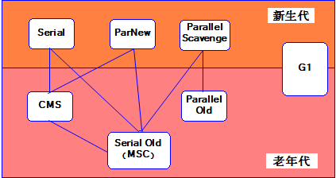

图中展示了7种作用于不同分代的收集器，如果两个收集器之间存在连线，则说明它们可以搭配使用。虚拟机所处的区域则表示它是属于新生代还是老年代收集器。

## （1）串行Serial

单线程，堆内存较小，适合个人电脑

\-XX:+UseSerialGC = Serial + SerialOld


- 新生代采用复制算法，Stop-The-World
- 老年代采用标记-整理算法，Stop-The-World

## （2）吞吐量优先——并行

\-XX:+UseParallelGC \~ -XX:+UseParallelOldGC

\-XX:GCTimeRatio=ratio

\-XX:MaxGCPauseMillis=ms

\-XX:ParallelGCThreads=n


- 新生代采用复制算法，Stop-The-World
- 老年代采用标记-整理算法，Stop-The-World

停顿时间和吞吐量不可能同时调优。

## （3）响应时间优先

\-XX:+UseConcMarkSweepGC \~ -XX:+UseParNewGC \~ SerialOld

\-XX:ParallelGCThreads=n \~ -XX:ConcGCThreads=threads

\-XX:CMSInitiatingOccupancyFraction=percent

\-XX:+CMSScavengeBeforeRemark


## （4）G1

适用场景

同时注重吞吐量（Throughput）和低延迟（Low latency），默认的暂停目标是 200 ms

超大堆内存，会将堆划分为多个大小相等的 Region

整体上是标记+整理算法，两个区域之间是复制算法

\-XX:+UseG1GC

\-XX:G1HeapRegionSize=size

\-XX:MaxGCPauseMillis=time


### 1：YoungCollection

### 2：YoungCollection+CM

### 3：Mixed Collection

### 4：fullGC

SerialGC

新生代内存不足发生的垃圾收集 - minor gc

老年代内存不足发生的垃圾收集 - full gc

ParallelGC

新生代内存不足发生的垃圾收集 - minor gc

老年代内存不足发生的垃圾收集 - full gc

CMS

新生代内存不足发生的垃圾收集 - minor gc

老年代内存不足

G1

新生代内存不足发生的垃圾收集 - minor gc

老年代内存不足

## （5）CMS(并发标记清除)垃圾收集器

老年代收集器

以获取最短回收停顿时间

“Concurrent”并发是指垃圾收集的线程和用户执行的线程是可以同时执行的。

CMS是基于“标记-清除”算法实现的，整个过程分为4个步骤：
1、初始标记（CMS initial mark）。
2、并发标记（CMS concurrent mark）。
3、重新标记（CMS remark）。
4、并发清除（CMS concurrent sweep）。

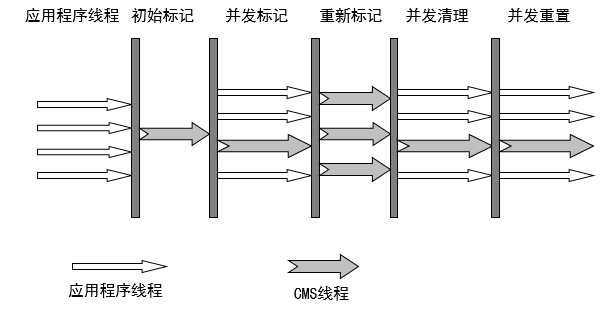

上图中，初始标记和重新标记时，需要stop the world。整个过程中耗时最长的是并发标记和并发清除，这两个过程都可以和用户线程一起工作。

缺点：
1、CMS收集器对CPU资源非常敏感。
2、CMS收集器无法处理浮动垃圾（Floating Garbage，就是指在之前判断该对象不是垃圾，由于用户线程同时也是在运行过程中的，所以会导致判断不准确的， 可能在判断完成之后在清除之前这个对像已经变成了垃圾对象，所以有可能本该此垃圾被回收但是没有被回收，只能等待下一次GC再将该对象回收，所以这种对像就是浮动垃圾）可能出现“Concurrent Mode Failure”失败而导致另一次Full GC的产生

https://www.cnblogs.com/webor2006/p/11055468.html


# 三：类加载与字节码技术

## 1. 类文件结构 

执行 javac -parameters -d . HellowWorld.java

编译为 HelloWorld.class 后是这个样子的：

[root\@localhost \~]\# od -t xC HelloWorld.class

……

1.1魔数

0\~3 字节，表示它是否是【class】类型的文件

0000000 ca fe ba be 00 00 00 34 00 23 0a 00 06 00 15 09

1.2 版本

4\~7 字节，表示类的版本 00 34（52） 表示是 Java 8

0000000 ca fe ba be 00 00 00 34 00 23 0a 00 06 00 15 09

1.3常量池

8\~9 字节，表示常量池长度，00 23 （35） 表示常量池有 \#1\~\#34项，注意 \#0
项不计入，也没有值

0000000 ca fe ba be 00 00 00 34 00 23 0a 00 06 00 15 09

第\#1项 0a 表示一个 Method 信息，00 06 和 00 15（21） 表示它引用了常量池中 \#6
和 \#21 项来获得 这个方法的【所属类】和【方法名】

0000000 ca fe ba be 00 00 00 34 00 23 0a 00 06 00 15 09

第\#2项 09 表示一个 Field 信息，00 16（22）和 00 17（23） 表示它引用了常量池中
\#22 和 \# 23 项 来获得这个成员变量的【所属类】和【成员变量名】

0000000 ca fe ba be 00 00 00 34 00 23 0a 00 06 00 15 09

0000020 00 16 00 17 08 00 18 0a 00 19 00 1a 07 00 1b 07

1.4访问标识与继承信息

1.5 Field信息

1.6 Method 信息 表示方法数量

1.7 附加属性

00 01 表示附加属性数量

00 13 表示引用了常量池 \#19 项，即【SourceFile】

00 00 00 02 表示此属性的长度

00 14 表示引用了常量池 \#20 项，即【HelloWorld.java】

## 2. 字节码指令 

## 3. 编译期处理 

## 4. 类加载阶段 

## 5. 类加载器 

## 6. 运行期优化

# 四：内存模型JMM

JMM 定义了一套在多线程读写共享数据时（成员变量、数组）时，对数据的可见性、有序
性、和原子性的规则和保障

1：原子性

解决:

synchronized( 对象 ) {

要作为原子操作代码

}

2：可见性

volatile（易变关键字）
它可以用来修饰成员变量和静态成员变量，他可以避免线程从自己的工作缓存中查找变量的值，必须到
主存中获取它的值，线程操作 volatile 变量都是直接操作主存

3：有序性

指令重排

volatile 修饰的变量，可以禁用指令重排

4；CAS与原子类

CAS 即 Compare and Swap ，它体现的一种乐观锁的思想

juc（java.util.concurrent）中提供了原子操作类，可以提供线程安全的操作，例如：AtomicInteger、
AtomicBoolean等，它们底层就是采用 CAS 技术 + volatile 来实现的。

5：synchronized 优化

5.1 轻量级锁

学生（线程
A）用课本占座，上了半节课，出门了（CPU时间到），回来一看，发现课本没变，说明没
有竞争，继续上他的课。 如果这期间有其它学生（线程
B）来了，会告知（线程A）有并发访问，线程 A
随即升级为重量级锁，进入重量级锁的流程。
而重量级锁就不是那么用课本占座那么简单了，可以想象线程 A
走之前，把座位用一个铁栅栏围起来

5.2 锁膨胀

如果在尝试加轻量级锁的过程中，CAS
操作无法成功，这时一种情况就是有其它线程为此对象加上了轻
量级锁（有竞争），这时需要进行锁膨胀，将轻量级锁变为重量级锁。

5.3 重量锁

重量级锁竞争的时候，还可以使用自旋来进行优化，如果当前线程自旋成功（即这时候持锁线程已经退
出了同步块，释放了锁），这时当前线程就可以避免阻塞。 在 Java 6
之后自旋锁是自适应的，比如对象刚刚的一次自旋操作成功过，那么认为这次自旋成功的可能
性会高，就多自旋几次；反之，就少自旋甚至不自旋，总之，比较智能。

5.4偏向锁

5.5 其它优化

1. 减少上锁时间 同步代码块中尽量短

2. 减少锁的粒度 将一个锁拆分为多个锁提高并发度

3. 锁粗化 多次循环进入同步块不如同步块内多次循环 另外 JVM
可能会做如下优化，把多次 append 的加锁操作
粗化为一次（因为都是对同一个对象加锁，没必要重入多次）

4. 锁消除 JVM
会进行代码的逃逸分析，例如某个加锁对象是方法内局部变量，不会被其它线程所访问到，这时候
就会被即时编译器忽略掉所有同步操作。

5. 读写分离 CopyOnWriteArrayList ConyOnWriteSet

## 内存泄露与溢出

### 1：简介

1、内存泄漏memory leak
:是指程序在申请内存后，无法释放已申请的内存空间，一次内存泄漏似乎不会有大的影响，但内存泄漏堆积后的后果就是内存溢出。

2、内存溢出 out of memory
:指程序申请内存时，没有足够的内存供申请者使用，或者说，给了你一块存储int类型数据的存储空间，但是你却存储long类型的数据，那么结果就是内存不够用，此时就会报错OOM,即所谓的内存溢出。

### 2：为什么会发生内存泄露？

对象A引用对象B，A的生命周期（t1-t4）比B的生命周期（t2-t3）要长，当B在程序中不再被使用的时候，A仍然引用着B。在这种情况下，垃圾回收器是不会回收B对象的，这就可能造成了内存不足问题，因为A可能不止引用着B对象，还可能引用其它生命周期比A短的对象，这就造成了大量无用对象不能被回收，且占据了昂贵的内存资源。


如何检查？

由于是发生在堆内存中，不可见，需要借助MAT，LeakCanary等工具检测

### 3：常见的内存泄露及解决方法：

1：单例引起的内存泄露：静态实例存在的生命周期和应用一样长

2：资源未关闭引起的内存泄露

怎么阻止内存泄露？

1.使用List、Map等集合时，在使用完成后赋值为null

2.使用大对象时，在用完后赋值为null

3.目前已知的jdk1.6的substring()方法会导致内存泄露

4.避免一些死循环等重复创建或对集合添加元素，撑爆内存

5.简洁数据结构、少用静态集合等

6.及时的关闭打开的文件，socket句柄等

7.多关注事件监听(listeners)和回调(callbacks)，比如注册了一个listener，当它不再被使用的时候，忘了注销该listener，可能就会产生内存泄露

### 4：内存溢出的解决方案

1、内存泄漏memory leak
:是指程序在申请内存后，无法释放已申请的内存空间，一次内存泄漏似乎不会有大的影响，但内存泄漏堆积后的后果就是内存溢出。

2、内存溢出 out of memory
:指程序申请内存时，没有足够的内存供申请者使用，或者说，给了你一块存储int类型数据的存储空间，但是你却存储long类型的数据，那么结果就是内存不够用，此时就会报错OOM,即所谓的内存溢出。

重点排查以下几点：

1.检查对数据库查询中，是否有一次获得全部数据的查询。一般来说，如果一次取十万条记录到内存，就可能引起内存溢出。这个问题比较隐蔽，在上线前，数据库中数据较少，不容易出问题，上线后，数据库中数据多了，一次查询就有可能引起内存溢出。因此对于数据库查询尽量采用分页的方式查询。

2.检查代码中是否有死循环或递归调用。

3.检查是否有大循环重复产生新对象实体。

4.检查对数据库查询中，是否有一次获得全部数据的查询。一般来说，如果一次取十万条记录到内存，就可能引起内存溢出。这个问题比较隐蔽，在上线前，数据库中数据较少，不容易出问题，上线后，数据库中数据多了，一次查询就有可能引起内存溢出。因此对于数据库查询尽量采用分页的方式查询。

5.检查List、MAP等集合对象是否有使用完后，未清除的问题。List、MAP等集合对象会始终存有对对象的引用，使得这些对象不能被GC回收。

第四步，使用内存查看工具动态查看内存使用情况


# 五：常用JVM配置参数

1：在IDE的后台打印GC日志

Eclipse设置


箭头处加上**-XX:+PrintGCDetails**这句话


IDEA设置


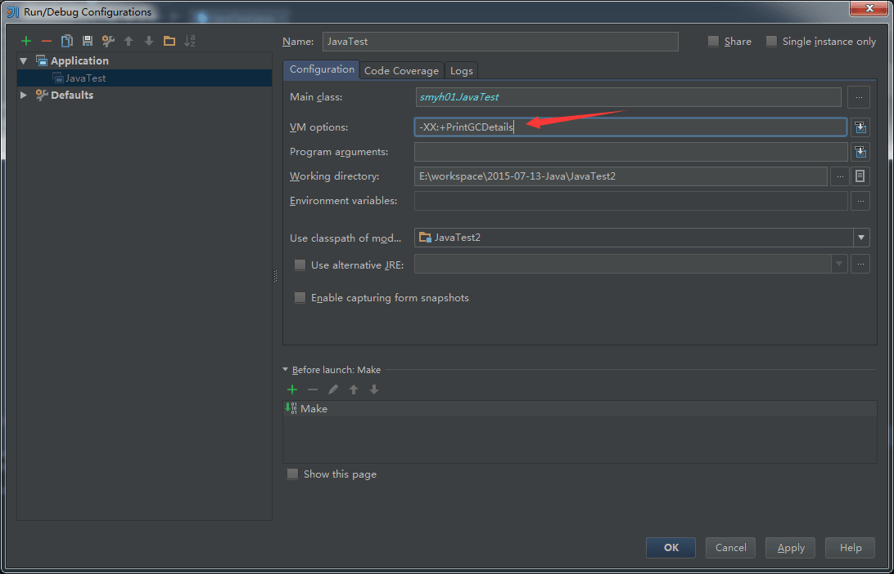

箭头处加上**-XX:+PrintGCDetails**这句话

## 5.1：Trace跟踪打印

1、打印GC的简要信息：

```
-verbose:gc
-XX:+printGC
```

解释：可以打印GC的简要信息。比如：

[GC 4790K->374K(15872K), 0.0001606 secs]

[GC 4790K->374K(15872K), 0.0001474 secs]

[GC 4790K->374K(15872K), 0.0001563 secs]

[GC 4790K->374K(15872K), 0.0001682 secs]

上方日志的意思是说，GC之前，用了4M左右的内存，GC之后，用了374K内存，一共回收了将近4M。内存大小一共是16M左右。

 

**2、打印GC的详细信息：**

```
-XX:+PrintGCDetails
```

解释：打印GC详细信息。

```
-XX:+PrintGCTimeStamps
```

解释：打印CG发生的时间戳。

 

**理解GC日志的含义：**

**例如下面这段日志：**

[GC[DefNew: 4416K->0K(4928K), 0.0001897 secs] 4790K->374K(15872K), 0.0002232 secs] [Times: user=0.00 sys=0.00, real=0.00 secs] 

上方日志的意思是说：这是一个新生代的GC。方括号内部的“4416K->0K(4928K)”含义是：“GC前该**内存区域**已使用容量->GC后该内存区域已使用容量（该内存区域总容量）”。而在方括号之外的“4790K->374K(15872K)”表示“GC前**Java堆**已使用容量->GC后Java堆已使用容量（Java堆总容量）”。

再往后看，“0.0001897 secs”表示该内存区域GC所占用的时间，单位是秒。

 

**再比如下面这段GC日志：**

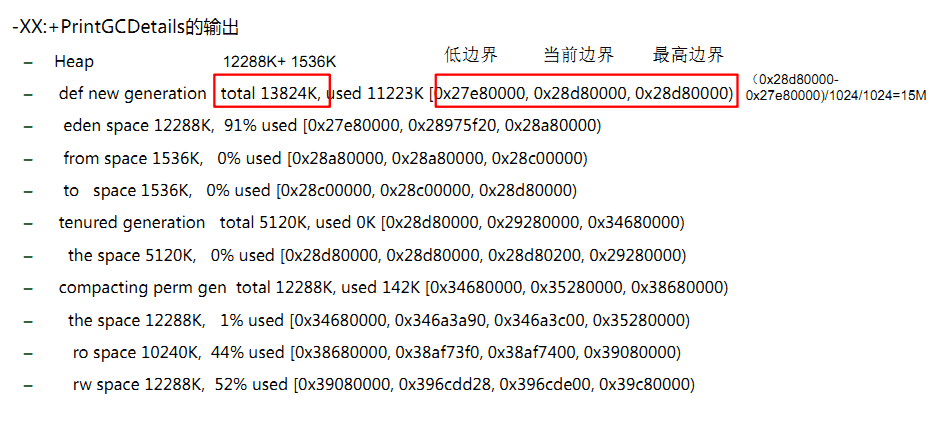

上图中，我们先看一下用红框标注的“[0x27e80000, 0x28d80000, 0x28d80000)”的含义，它表示新生代在内存当中的位置：第一个参数是申请到的起始位置，第二个参数是申请到的终点位置，第三个参数表示最多能申请到的位置。上图中的例子表示新生代申请到了15M的控件，而这个**15M是等于：（eden space的12288K）+（from space的1536K）+（to space的1536K）**。

疑问：**分配到的新生代有15M，但是可用的只有13824K**，为什么会有这个差异呢？等我们在后面的文章中学习到了GC算法之后就明白了。

 

**3、指定GC log的位置：**

```
-Xloggc:log/gc.log
```

解释：**指定GC log的位置，以文件输出**。帮助开发人员分析问题。

[

 

```
-XX:+PrintHeapAtGC
```

解释：每一次GC前和GC后，都打印堆信息。

例如：


上图中，红框部分正好是一次GC，红框部分的前面是GC之前的日志，红框部分的后面是GC之后的日志。

 

```
-XX:+TraceClassLoading
```

解释：监控类的加载。

例如：

> [Loaded java.lang.Object from shared objects file]
>
> [Loaded java.io.Serializable from shared objects file]
>
> [Loaded java.lang.Comparable from shared objects file]
>
> [Loaded java.lang.CharSequence from shared objects file]
>
> [Loaded java.lang.String from shared objects file]
>
> [Loaded java.lang.reflect.GenericDeclaration from shared objects file]
>
> [Loaded java.lang.reflect.Type from shared objects file]

```
-XX:+PrintClassHistogram
```

 

解释：按下Ctrl+Break后，打印类的信息。

例如：


##  5.2：堆的分配参数

#### 1、-Xmx –Xms

指定最大堆和最小堆


#### 2、-Xmn、-XX:NewRatio、-XX:SurvivorRatio：

- -Xmn

　　　　**设置新生代大小**

- -XX:NewRatio

　　　　新生代（eden+2*s）和老年代（不包含永久区）的比值

  　　　　例如：4，表示新生代:老年代=1:4，即新生代占整个堆的1/5

- -XX:SurvivorRatio（幸存代）

　　　　设置两个Survivor区和eden的比值

  　　　　例如：8，表示两个Survivor:eden=2:8，即一个Survivor占年轻代的1/10


#### 3、-XX:+HeapDumpOnOutOfMemoryError、-XX:+HeapDumpPath

- **-XX:+HeapDumpOnOutOfMemoryError**

　　　　OOM时导出堆到文件

　　　　　　根据这个文件，我们可以看到系统dump时发生了什么。

- -XX:+HeapDumpPath

　　　　导出OOM的路径

## 5.3：栈的分配参数

**1、Xss：**

> 设置栈空间的大小。通常只有几百K
>
> 　　决定了函数调用的深度
>
> 　　每个线程都有独立的栈空间
>
> 　　局部变量、参数 分配在栈上

注：栈空间是每个线程私有的区域。栈里面的主要内容是栈帧，而栈帧存放的是局部变量表，局部变量表的内容是：局部变量、参数。

我们来看下面这段代码：（没有出口的递归调用）

```java
public class TestStackDeep {
    private static int count = 0;
    public static void recursion(long a, long b, long c) {
        long e = 1, f = 2, g = 3, h = 4, i = 5, k = 6, q = 7, x = 8, y = 9, z = 10;
        count++;
        recursion(a, b, c);
    }
    public static void main(String args[]) {
        try {
            recursion(0L, 0L, 0L);
        } catch (Throwable e) {
            System.out.println("deep of calling = " + count);
            e.printStackTrace();
        }
    }
}
```

上方这段代码是没有出口的递归调用，肯定会出现OOM的。

如果设置栈大小为128k：

```
-Xss128K 
```

运行效果如下：（方法被调用了294次）


如果设置栈大小为256k：（方法被调用748次）


意味着函数调用的次数太深，像这种递归调用就是个典型的例子。