# 一：JVM 内存结构

Java 虚拟机在运行时，会把内存空间分为若干个区域。Java 虚拟机所管理的内存区域分为如下部分：方法区、堆内存、虚拟机栈、本地方法栈、程序计数器。


## 1、类装载器 ClassLoader

负责加载 class 文件，class 文件在文件开头有特定的文件标识，并且 ClassLoader 只负责 class 文件的加载，至于它是否可以运行，则是由执行引擎（Execution Engine）决定。

虚拟机自带的加载器：

启动类加载器（Bootstrap）：由 C++编写，不是前端框架 Bootstrap。

扩展类加载器（Extension）：由 Java 语言编写

应用程序类加载器（App）：由 Java 语言编写，也叫系统类加载器，加载当前应用的 classpath 的所有类。

用户自定义加载器：Java.lang.ClassLoader 的子类，用户可以定制的加载方式。

类加载器的双亲委派机制：某个特定的类加载器在加载类的请求时，首先将加载任务委托给父类加载器，依次递归，如果父类加载器可以完成类加载任务，就成功返回；只有父类加载器无法完成该加载任务时，才自己去加载。

沙箱机制（防止恶意代码对 java 本身的破坏）：当用户命名了和 Java 一样的类时，Java 会首先加载自带的类。

## 2、执行引擎

执行引擎在其中起到的作用就是将字节码指令转换为机器指令.

执行引擎的工作过程:

1. 执行引擎从pc寄存器中获取要执行的指令索引
2. 使用指令索引从操作数栈中获取要执行的指令
3. 将指令转换为具体的机器指令
4. 交给操作系统执行

## 2、方法区/永久代/元空间

方法区是线程共享的，通常用来保存装载的类的元结构信息。主要用于存储虚拟机加载的类信息、常量、静态变量，以及编译器编译后的代码等数据。字符串池

在 jdk1.7 及其之前，方法区是堆的一个“逻辑部分”（一片连续的堆空间）。也有人用“永久代”表示方法区。

在 jdk1.8 中，方法区已经不存在，原方法区中存储的类信息、编译后的代码数据等已经移动到了元空间（MetaSpace）中，元空间并没有处于堆内存上，而是直接占用的本地内存（NativeMemory）。


HotSpot中，使用永久代来实现方法区，相当于说方法区时规范，永久代是HotSpot针对规范进行的实现

前面方法区时也说了，在 jdk1.8 中，方法区已经不存在，原方法区中存储的类信息、编译后的代码数据等已经移动到了元空间（MetaSpace）中，元空间并没有处于堆内存上，而是直接占用的本地内存（NativeMemory）。

这也就意味着，只要本地内存足够，他就不会出现像永久代中那种元空间不足的错误；也就是说元空间是可以无限膨胀的，但是一般我们不能让他无限膨胀：

如果元空间内存不够用，就会报`OOM`，默认情况下，对应一个`64`位的服务端`JVM`来说，其默认的`-XX:MetaspaceSize`值为`21MB`，这就是初始的高水位线，一旦元空间的大小触及这个高水位线，就会触发`Full GC`并会卸载没有用的类，同时GC会对该值进行调整，如果释放了大量的空间，就适当的降低该值；如果释放了很少的空间，那么在不超过MaxMetaspaceSize（如果设置了的话），适当的提高该值。建议将`-XX:MetaspaceSize`设置为较高的值，而`-XX:MaxMetaspaceSize`不进行设置。即-1 无限制。

比如 8/16G 的，设置 256M，最大设置 512M

## 3：堆内存

一个 JVM 实例只存在一个堆内存，堆内存的大小是可以调节的。类加载器读取了类文件后，需要把类，方法，变量放到堆内存中，New 创建对象在堆内存。

它是 JVM 管理的内存中最大的一块区域，堆内存和方法区都被所有线程共享，在虚拟机启动时创建。在垃圾收集的层面上来看，由于现在收集器基本上都采用分代收集算法，因此堆还可以分为新生代（YoungGeneration）和老年代（OldGeneration），新生代还可以分为 Eden、FromSurvivor、To Survivor。

新生代和老年代的默认比例为 `1:2`，也就是说新生代占用 `1/3`的堆内存，而老年代占用 `2/3` 的堆内存。

可以通过参数 `-XX:NewRatio=2` 来设置老年代/新生代的比例。

JAVA1.7 如下图，但在 Java1.8 中，其他基本没变，只是将 Perm 变成了元空间


### 3.1：新生代

在方法中去 new 一个对象，那这方法调用完毕后，对象就会被回收，这就是一个典型的新生代对象。

新生代中的对象 98%都是“朝生夕死”的，所以并不需要按照 1:1 的比例来划分内存空间，而是将**内存分为一块比较大的 Eden 空间和两块较小的 Survivor 空间**，

刚刚新建的对象在 Eden 中，经历一次 Minor GC，Eden 中的存活对象就会被移动到第一块 survivor space S0，Eden 被清空；等 Eden 区再满了，就再触发一次 Minor GC，Eden 和 S0 中的存活对象又会被复制送入第二块 survivor space S1（这个过程非常重要，因为这种复制算法保证了 S1 中来自 S0 和 Eden 两部分的存活对象占用连续的内存空间，避免了碎片化的发生）。S0 和 Eden 被清空，然后下一轮 S0 与 S1 交换角色，如此循环往复。如果对象的复制次数达到 16 次，该对象就会被送到老年代中。

**当 Survivor 空间不够用时，需要依赖于老年代进行分配担保，所以大对象直接进入老年代**。同时，**长期存活的对象将进入老年代**

### 3.2：老年代

对象何时进入老年代？

- 大对象直接进入老年代
- 长期存活的对象：每熬过一回 Minor GC，对象 age +1 ，当年龄达到一定数值时（JDK7 是 15，可以通过参数-XX:MaxTenuringThreshold 设置年龄阀值）
- 当 Survivor 空间中相同年龄所有对象的大小总和大于 Survivor 空间的一半，年龄大于或等于该年龄的对象就可以直接进入老年代，而不需要达到默认的分代年龄。

## 4：程序计数器

作用：记住下一条 jvm 指令的执行地址

特点：是线程私有的，不会存在内存溢出

程序计数器是一块非常小的内存空间，可以看做是当前线程执行字节码的行号指示器，每个线程都有一个独立的程序计数器，因此程序计数器是线程私有的一块空间，此外，程序计数器是 Java 虚拟机规定的唯一不会发生内存溢出的区域。

## 5：虚拟机栈

1：虚拟机栈也是每个线程私有的一块内存空间，它描述的是方法的内存模型。

虚拟机会为每个线程分配一个虚拟机栈，每个虚拟机栈中都有若干个栈帧，每个栈帧中存储了局部变量表、操作数栈、动态链接、返回地址等。一个栈帧就对应 Java 代码中的一个方法，当线程执行到一个方法时，就代表这个方法对应的栈帧已经进入虚拟机栈并且处于栈顶的位置，每一个 Java 方法从被调用到执行结束，就对应了一个栈帧从入栈到出栈的过程。

2：栈内存溢出：栈帧过多导致栈内存溢出 栈帧过大导致栈内存溢出

## 6、本地方法栈

虚拟机栈执行的是 Java 方法，本地方法栈执行的是本地方法（NativeMethod）,其他基本上一致

## JVM 关闭

正常关闭：

- 所有守护线程执行结束
- System.exit()
- ctrl + C
- kill (-15) SIGTERM 信号

异常关闭

- RuntimeException
- OOM

强制关闭

- kill -9 SIGKILL 信号
- Runtime.halt()
- 断电
- 系统关机
- 系统 carsh

# 二：垃圾回收机制

**为什么 Java 要进行垃圾回收？**

手动回收的缺点：1：容易造成引用悬挂（所引用的对象不存在了，引用再继续操作执行结果不可预知）；2：内存泄漏（当某些引用变量不再引用该内存对象的时候，而该对象原本占用的内存并没有被释放）；3：手动管理成本太高，风险太大。

垃圾回收可以有效的防止内存泄露，有效的使用可以使用的内存。

**什么是垃圾回收？**

垃圾回收，就是通过垃圾收集器把内存中没用的对象清理掉。垃圾回收涉及到的内容有：

1、判断对象是否已死；

2、选择垃圾收集算法；

3、选择垃圾收集的时间；

4、选择适当的垃圾收集器清理垃圾（已死的对象）。

## 1：判断对象是否以死

判断对象是否已死就是找出哪些对象是已经死掉的，以后不会再用到的，就像地上有废纸、饮料瓶和百元大钞，扫地前要先判断出地上废纸和饮料瓶是垃圾，百元大钞不是垃圾。判断对象是否已死有引用计数算法和可达性分析算法。

### （1）引用计数算法

给每一个对象添加一个引用计数器，每当有一个地方引用它时，计数器值加 1；每当有一个地方不再引用它时，计数器值减 1，这样只要计数器的值不为 0，就说明还有地方引用它，它就不是无用的对象。如下图，对象 2 有 1 个引用，它的引用计数器值为 1，对象 1 有两个地方引用，它的引用计数器值为 2。


这种方法看起来非常简单，但目前许多主流的虚拟机都没有选用这种算法来管理内存，原因就是当某些对象之间互相引用时，无法判断出这些对象是否已死，如下图，对象 1 和对象 2 都没有被堆外的变量引用，而是被对方互相引用，这时他们虽然没有用处了，但是引用计数器的值仍然是 1，无法判断他们是死对象，垃圾回收器也就无法回收。


### （2）可达性分析算法

了解可达性分析算法之前先了解一个概念——GC Roots，垃圾收集的起点，可以作为 GCRoots 的有：

1：虚拟机栈中本地变量表中引用的对象

每个方法执行的时候看，JVM 都会创建一个相应的栈帧，栈帧包括（操作数栈，局部变量表，运行时常量池的引用），栈帧中包含这个方法内部使用的所有对象的引用，这就是虚拟机栈中的引用对象，一旦该方法执行完后，该栈帧就会从虚拟机栈中弹出，这样一来这些局部（临时）对象的引用也就不存在了，或者说没有任何 GCRoot 指向这些临时对象，所以这些对象在下一次 GC 时就会被回收掉。

2：方法区中静态属性引用的对象

一般指被 static 修饰的对象，加载类的时候就加载到内存中

```java
private static User user = new User();
private static User user1;
```

3：方法区中常量引用的对象

```java
private final User user2 = new User();
```

4：本地方法栈中 JNI（Native 方法）引用的对象。

当一个对象到 GC Roots 没有任何引用链相连（GCRoots 到这个对象不可达）时，就说明此对象是不可用的，是死对象。如下图：object1、object2、object3、object4 和 GC Roots 之间有可达路径，这些对象不会被回收，但 object5、object6、object7 到 GC Roots 之间没有可达路径，这些对象就被判了死刑。


#### 四种引用

（1）强引用 ：只有所有 GC Roots对象都不通过【强引用】引用该对象，该对象才能被垃圾回收。

当内存空间不足，Java 虚拟机宁愿抛出 OutOfMemoryError 错误，使程序异常终止，也不会靠随意回收具有强引用的对象来解决内存不足的问题。

（2） 软引用（SoftReference）
仅有软引用引用该对象时，在垃圾回收后，内存仍不足时会再次出发垃圾回收，回收软引用对象 可以配合引用队列来释放软引用自身。适合做缓存。缓存个图片。

```java
SoftReference<byte[]> m = new SoftReference<>(new byte[1024*1024*10]);//m为强引用，字节数组为软引用
```

（3） 弱引用（WeakReference）
仅有弱引用引用该对象时，在垃圾回收时，无论内存是否充足，都会回收弱引用对象

可以配合引用队列来释放弱引用自身

（4） 虚引用（PhantomReference） 必须配合引用队列使用，主要配合 ByteBuffer 使用，被引用对象回收时，会将虚引用入队， 由 Reference Handler，虚引用根本 get 不到。回收时会去队列里检查是否还有引用。

线程调用虚引用相关方法释放直接内存。

主要用来管理直接内存，即堆外内存。NIO 中零拷贝，会将资源拷贝到堆外内存 buffer，JVM 要想使用 buffer，要么拷贝到虚拟机堆内，要么使用虚引用进行直接操作。

### （3）方法区回收

上面说的都是对堆内存中对象的判断，方法区中主要回收的是废弃的常量和无用的类。

判断常量是否废弃可以判断是否有地方引用这个常量，如果没有引用则为废弃的常量。

判断类是否废弃需要同时满足如下条件：

该类所有的实例已经被回收（堆中不存在任何该类的实例）

加载该类的 ClassLoader 已经被回收

该类对应的 java.lang.Class 对象在任何地方没有被引用（无法通过反射访问该类的方法）

## 2、常用垃圾回收算法

### （1）标记-清除算法

分为标记和清除两个阶段，首先标记出所有需要回收的对象，标记完成后统一回收所有被标记的对象，如下图。


缺点：标记和清除两个过程效率都不高；标记清除之后会产生大量不连续的内存碎片。

### （2）复制算法

把内存分为大小相等的两块，每次存储只用其中一块，当这一块用完了，就把存活的对象全部复制到另一块上，同时把使用过的这块内存空间全部清理掉，往复循环，如下图。

缺点：实际可使用的内存空间缩小为原来的一半，比较适合。


### （3）标记-整理算法

先对可用的对象进行标记，然后所有被标记的对象向一段移动，最后清除可用对象边界以外的内存，如下图。


缺点：效率会低

### （4）分代收集算法

把堆内存分为新生代和老年代，新生代又分为 Eden 区、From Survivor 和 To Survivor。

一般**新生代**中的对象基本上都是朝生夕灭的，每次只有少量对象存活，因此采用**复制算法**，只需要复制那些少量存活的对象就可以完成垃圾收集；

**老年代**中的对象存活率较高，就采用**标记-清除和标记-整理算法**来进行回收。


对象首先分配在伊甸园区域

新生代空间不足时，触发 minor gc，伊甸园和 from Survivor区 存活的对象使用 copy 复制到 to Survivor中，存活的 对象年龄加 1 并且交换 from Survivor区和 to Survivor区；

minor gc 会引发 stop the world，暂停其它用户的线程，等垃圾回收结束，用户线程才恢复运行，当对象寿命超过阈值时，会晋升至老年代，最大寿命是 15（4bit）

当老年代空间不足，会先尝试触发 minor gc，如果之后空间仍不足，那么触发 full gc，STW 的时 间更长

为什么有两个 Survivor 区？如果只有一个 Survivor 区的话，容易造成碎片，如果两个的话，当回收的时候就可以将 Eden 和 From 区的都放到 To 区就好了。

## 3、选择垃圾收集的时间

当程序运行时，各种数据、对象、线程、内存等都时刻在发生变化，当下达垃圾收集命令后就立刻进行收集吗？肯定不是，他们要在保证线程安全的前提下进行垃圾回收

安全点：从线程角度看，安全点可以理解为是在代码执行过程中的一些特殊位置，当线程执行到安全点的时候，说明虚拟机当前的状态是安全的，如果有需要，可以在这里暂停用户线程。当垃圾收集时，如果需要暂停当前的用户线程，但用户线程当时没在安全点上，则应该等待这些线程执行到安全点再暂停。理论上，解释器的每条字节码的边界上都可以放一个安全点，实际上，安全点基本上以“是否具有让程序长时间执行的特征”为标准进行选定。

安全区：安全点是相对于运行中的线程来说的，对于如 sleep 或 blocked 等状态的线程，收集器不会等待这些线程被分配 CPU 时间，这时候只要线程处于安全区中，就可以算是安全的。安全区就是在一段代码片段中，引用关系不会发生变化，可以看作是被扩展、拉长了的安全点。

## 4、常见垃圾收集器

新生代收集器：Serial、ParNew、Parallel Scavenge

老年代收集器：Serial Old、CMS、Parallel Old

堆内存垃圾收集器：G1


前六种叫做分代模型，G1 逻辑分代，物理不分代，ZGC 逻辑物理都不分，Epsilon 是啥也不做

图中展示了 7 种作用于不同分代的收集器，如果两个收集器之间存在连线，则说明它们可以搭配使用。虚拟机所处的区域则表示它是属于新生代还是老年代收集器。

查看命令：java -XX:+PrintCommandLineFlags -version

1.8 默认的是 Paralle

1.9 默认的是 G1

G1 适用于 8/16G 以上的内存适用，清理垃圾时虽然 STW，但是是可控的.

CMS 并发但是不可控

## （1）串行 Serial

单线程，堆内存较小，适合个人电脑

\-XX:+UseSerialGC = Serial + SerialOld


随着内存越来越大，STW 时间越来越长


## （2）并行

花费了大量时间在进程调度上。

\-XX:+UseParallelGC \~ -XX:+UseParallelOldGC

\-XX:GCTimeRatio=ratio

\-XX:MaxGCPauseMillis=ms

\-XX:ParallelGCThreads=n


停顿时间和吞吐量不可能同时调优。


## （5）CMS(并发标记清除)垃圾收集器

老年代收集器

以获取最短回收停顿时间

“Concurrent”并发是指垃圾收集的线程和用户执行的线程是可以同时执行的。

CMS 是基于“标记-清除”算法实现的，整个过程分为 4 个步骤：

1、初始标记（CMS initial mark）：找到根对象，标记老年代中所有的 GC Root 对象，标记年轻代中活着的对象引用到老年代的对象（指年轻代中还存活的引用类型对象，引用指向老年代的对象）

2、并发标记（CMS concurrent mark）：过滤对象树，可能产生错误标记，已经标记为垃圾，又被连上了，该阶段会把上述对象所在的 Card 标识为 Dirty，后续只需扫描这些 Dirty Card 的对象，避免扫描整个老年代；并发标记阶段只负责将引用发生改变的 Card 标记为 Dirty 状态，不负责处理；

3、重新标记（CMS remark）：由于前面是并发标记的，这时候年轻代的对象对老年代的引用已经发生了改变，修正错标，CMS 和 G1 都采用的三色标记，CMS 采用增量更新，G1 使用快照的方式。ZGC 采用颜色指针。

4、并发清除（CMS concurrent sweep）。


上图中，初始标记和重新标记时，需要 stop the world。整个过程中耗时最长的是并发标记和并发清除，这两个过程都可以和用户线程一起工作。

优点：

- 支持并发收集.
- 低停顿,

缺点：

1、CMS 收集器对 CPU 资源非常敏感。

2、CMS 收集器无法处理浮动垃圾（Floating Garbage，并发清理阶段用户线程还在运行着，伴随程序运行自然就还会有新的垃圾不断产生，只能等待下一次 GC 再将该对象回收，所以这种对像就是浮动垃圾）可能出现“Concurrent Mode Failure”失败而导致另一次 Full GC 的产生

3，采用标记清理算法，清理后可能会产生大量的内存碎片，如果没有整块空间存了，就会触发 Full GC ,然后进行空间整理压缩。

解决内存碎片：

-XX:CMSFullGCsBeforeCompaction=n意思是说在上一次 CMS 并发 GC 执行过后，到底还要再执行多少次 full GC 才会做压缩。默认是 0，也就是在默认配置下每次 CMS GC 顶不住了而要转入 full GC 的时候都会做压缩。 如果把 CMSFullGCsBeforeCompaction 配置为 10，就会让上面说的第一个条件变成每隔 10 次真正的 full GC 才做一次压缩。

**TLABs**

为每一个线程分配一个 Buffer，线程分配内存就在这个 Buffer 内分配。但是当线程耗尽了自己的 Buffer 之后，需要申请新的 Buffer。

## （4）G1

**适用场景**

同时注重吞吐量（Throughput）和低延迟（Low latency），默认的暂停目标是 200 ms

适用于超大堆内存，会将堆划分为多个大小相等的 Region

整体上是标记+整理算法，两个区域之间是复制算法

软实时（G1 会努力在一定时限内完成垃圾回收，但是不保证每次都能在这个时限内完成），低延时

**结构**

G1 的内存布局不再是新生代老年代等等的了，变成了


每个 Region 的大小可以通过-XX:G1HeapRegionSize 参数设置。大小只能是 2 的幂次方。在 HotSpot 的实现中，整个堆被划分为 2048 左右各 Region。

**跨代引用：**

Card Table 和 Remebered Set（记住谁引用了我）

RS(Remember Set)是一种抽象概念，在 G1 回收器里面，RS 被用来记录从其他 Region 指向一个 Region 的指针情况。因此，一个 Region 就会有一个 RS。

这种记录可以带来一个极大的好处：在回收一个 Region 的时候不需要执行全堆扫描，只需要检查它的 RS 就可以找到外部引用。如果一个线程修改了 Region 内部的引用，就必须要去通知 RS。

Writer Barrier（写屏障）

**GC 流程：**

G1 中提供了三种模式垃圾回收模式，young GC ，Mixed GC 和 Full GC，在不同的条件下触发。

1：Fully young GC 完全的年轻代 GC，产生一个 STW，构建 CS（Eden + Surivor），扫描 GC Rooot，排空 Dirty Card Queue，处理 Remebered Set （找到被老年代所引用的对象）使用卡表（Card Table）进行卡标记（card Marking）来解决老年代与新生代直接的引用问题，复制对象到 Survivor 区，处理软，虚等引用

具体是，使用卡表（Card Table）和写屏障（Write Barrier）来进行标记并加快对 GC Roots 的扫描。卡表的设计师将堆内存平均分成 2 的 N 次方大小（默认 512 字节）个卡，并且维护一个卡表，用来储存每个卡的标识位。当对一个对象引用进行写操作时（对象引用改变），写屏障逻辑将会标记对象所在的卡页为脏页。在 YGC 只需要扫描卡表中的脏卡，将脏中的对象加入到 YGC 的 GC Roots 里面。当完成所有脏卡扫描时候，虚拟机会将卡表的脏卡标志位清空。

2：ConCurrent Marking：并发标记进行，三色（黑灰白）标记算法：初始标记，标记根节点直接到达的对象；根区域扫描，扫描 survivor 区直接可达的老年代区域对象,并标记被引用的对象；并发标记，在整个堆中进行标记；再次标记，修正标记（STW），独占清理（STW），计算各个区域的存活对象和 GC 回收比例,并进行排序,识别可以混合回收的区域；并发清理

3：Mixed GC

当越来越多的对象晋升到老年代 old region 时,为了避免堆内存被耗尽,虚拟机会触发一个混合的垃圾收集器,即 Mixed GC,该算法并不是一个 Old GC,除了回收整个 Young Region,还会回收一部分的 Old Region。

- 全局并发标记：在 MixGC 之前，会先进行全局并发标记。其中会分为五个步骤：初始标记（STW，从 GC Root 触发标记全部直接子节点），根区域扫描（在初始标记的存活区，扫描老年代的引用），并发标记（整个堆中查找存活对象），再标记（STW，，清除垃圾

- 拷贝存活对象

G1 垃圾回收周期如下图所示


优点：

- 并行与并发
- 管理不同的代
- 没有内存碎片，整体上是标记整理算法，从局部看（相关的两块 Region）看是复制算法，都不会产生内存碎片。
- 可控的 STW

缺点：

- 卡表占用了大量的内存

## （5）ZGC


使用了着色指针和内存屏障

ZGC 只有三个 STW 阶段：**初始标记**，**再标记**，**初始转移**。其中，初始标记和初始转移分别都只需要扫描所有 GC Roots，其处理时间和 GC Roots 的数量成正比，一般情况耗时非常短；再标记阶段 STW 时间很短，最多 1ms，超过 1ms 则再次进入并发标记阶段。

关键技术：

ZGC 通过着色指针和读屏障技术，解决了转移过程中准确访问对象的问题，实现了并发转移。大致原理描述如下：并发转移中“并发”意味着 GC 线程在转移对象的过程中，应用线程也在不停地访问对象。假设对象发生转移，但对象地址未及时更新，那么应用线程可能访问到旧地址，从而造成错误。而在 ZGC 中，应用线程访问对象将触发“读屏障”，如果发现对象被移动了，那么“读屏障”会把读出来的指针更新到对象的新地址上，这样应用线程始终访问的都是对象的新地址。那么，JVM 是如何判断对象被移动过呢？就是利用对象引用的地址，即着色指针。

着色指针：

ZGC 将对象存活信息存储在 42~45 位中，这与传统的垃圾回收并将对象存活信息放在对象头中完全不同。

读屏障：

读屏障是 JVM 向应用代码插入一小段代码的技术。当应用线程从堆中读取对象引用时，就会执行这段代码。需要注意的是，仅“从堆中读取对象引用”才会触发这段代码。

1：Young GC 的改变

CMS 新生代的 Young GC、G1 和 ZGC 都基于标记-复制算法，但算法具体实现的不同就导致了巨大的性能差异。

标记-复制算法应用在 CMS 新生代（ParNew 是 CMS 默认的新生代垃圾回收器）和 G1 垃圾回收器中。标记-复制算法可以分为三个阶段：

- 标记阶段，即从 GC Roots 集合开始，标记活跃对象；
- 转移阶段，即把活跃对象复制到新的内存地址上；
- 重定位阶段，因为转移导致对象的地址发生了变化，在重定位阶段，所有指向对象旧地址的指针都要调整到对象新的地址上。

## 5：内存分配与回收策略

### Minor GC 和 Full GC

- Minor GC：回收新生代，因为新生代对象存活时间很短，因此 Minor GC 会频繁执行，执行的速度一般也会比较快。

- Full GC：回收老年代和新生代，老年代对象其存活时间长，因此 Full GC 很少执行，执行速度会比 Minor GC 慢很多。

### 内存分配策略

1. 对象优先在 Eden 分配

大多数情况下，对象在新生代 Eden 上分配，当 Eden 空间不够时，发起 Minor GC。

2. 大对象直接进入老年代

大对象是指需要连续内存空间的对象，最典型的大对象是那种很长的字符串以及数组。

经常出现大对象会提前触发垃圾收集以获取足够的连续空间分配给大对象。

-XX:PretenureSizeThreshold，大于此值的对象直接在老年代分配，避免在 Eden 和 Survivor 之间的大量内存复制。

3. 长期存活的对象进入老年代

为对象定义年龄计数器，对象在 Eden 出生并经过 Minor GC 依然存活，将移动到 Survivor 中，年龄就增加 1 岁，增加到一定年龄则移动到老年代中。

-XX:MaxTenuringThreshold 用来定义年龄的阈值。

4. 动态对象年龄判定

虚拟机并不是永远要求对象的年龄必须达到 MaxTenuringThreshold 才能晋升老年代，如果在 Survivor 中相同年龄所有对象大小的总和大于 Survivor 空间的一半，则年龄大于或等于该年龄的对象可以直接进入老年代，无需等到 MaxTenuringThreshold 中要求的年龄。

5. 空间分配担保

在发生 Minor GC 之前，虚拟机先检查老年代最大可用的连续空间是否大于新生代所有对象总空间，如果条件成立的话，那么 Minor GC 可以确认是安全的。

如果不成立的话虚拟机会查看 HandlePromotionFailure 的值是否允许担保失败，如果允许那么就会继续检查老年代最大可用的连续空间是否大于历次晋升到老年代对象的平均大小，如果大于，将尝试着进行一次 Minor GC；如果小于，或者 HandlePromotionFailure 的值不允许冒险，那么就要进行一次 Full GC。

### Full GC 的触发条件

对于 Minor GC，其触发条件非常简单，当 Eden 空间满时，就将触发一次 Minor GC。而 Full GC 则相对复杂，有以下条件：

1. 调用 System.gc()

只是建议虚拟机执行 Full GC，但是虚拟机不一定真正去执行。不建议使用这种方式，而是让虚拟机管理内存。

2. 老年代空间不足

老年代空间不足的常见场景为前文所讲的大对象直接进入老年代、长期存活的对象进入老年代等。

为了避免以上原因引起的 Full GC，应当尽量不要创建过大的对象以及数组。除此之外，可以通过 -Xmn 虚拟机参数调大新生代的大小，让对象尽量在新生代被回收掉，不进入老年代。还可以通过 -XX:MaxTenuringThreshold 调大对象进入老年代的年龄，让对象在新生代多存活一段时间。

3. 空间分配担保失败

使用复制算法的 Minor GC 需要老年代的内存空间作担保，如果担保失败会执行一次 Full GC。具体内容请参考上面的第 5 小节。

4. JDK 1.7 及以前的永久代空间不足

在 JDK 1.7 及以前，HotSpot 虚拟机中的方法区是用永久代实现的，永久代中存放的为一些 Class 的信息、常量、静态变量等数据。

当系统中要加载的类、反射的类和调用的方法较多时，永久代可能会被占满，在未配置为采用 CMS GC 的情况下也会执行 Full GC。如果经过 Full GC 仍然回收不了，那么虚拟机会抛出 java.lang.OutOfMemoryError。

为避免以上原因引起的 Full GC，可采用的方法为增大永久代空间或转为使用 CMS GC。

5. Concurrent Mode Failure

执行 CMS GC 的过程中同时有对象要放入老年代，而此时老年代空间不足（可能是 GC 过程中浮动垃圾过多导致暂时性的空间不足），便会报 Concurrent Mode Failure 错误，并触发 Full GC。

# 三：类加载与字节码技术

## 1. 类文件结构

执行 javac -parameters -d . HellowWorld.java

编译为 HelloWorld.class 的结构组成


0000000 ca fe ba be 00 00 00 34 00 23 0a 00 06 00 15 09

0000020 00 16 00 17 08 00 18 0a 00 19 00 1a 07 00 1b 07


1.1 魔数

0\~3 字节，表示它是否是【class】类型的文件 ca fe ba be 

1.2 版本

4\~7 字节，表示类的版本 00 34（52） 表示是 Java 8

1.3 常量池

8\~9 字节，表示常量池长度，00 23 （35） 表示常量池有 \#1\~\#34 项，注意 \#0项不计入，也没有值

第\#1 项 0a 表示一个 Method 信息，

00 06 和 00 15（21） 表示它引用了常量池中 \#6和 \#21 项来获得 这个方法的【所属类】和【方法名】

第\#2 项 09 表示一个 Field 信息，00 16（22）和 00 17（23） 表示它引用了常量池中\#22 和 \# 23 项 来获得这个成员变量的【所属类】和【成员变量名】

1.4 访问标识与继承信息

1.5 Field 信息

1.6 Method 信息 表示方法数量

1.7 附加属性

00 01 表示附加属性数量

00 13 表示引用了常量池 \#19 项，即【SourceFile】

00 00 00 02 表示此属性的长度

00 14 表示引用了常量池 \#20 项，即【HelloWorld.java】

## 2. 字节码指令

## 3. 编译期处理

## 类加载机制

Java 虚拟机把描述类的数据从 Class 文件加载到内存，并对数据进行校验、转换解析和初始化，静态代码块在初始化阶段完成，最终形成可以被虚拟机直接使用的 Java 类型，这就是虚拟机的加载机制。

类从被加载到虚拟机内存中开始，到卸载出内存为止，它的整个生命周期包括了：加载（Loading）、验证（Verification）、准备（Preparation）、解析（Resolution）、初始化（Initialization）、使用（using）、和卸载（Unloading）七个阶段。其中验证、准备和解析三个部分统称为连接（Linking）


JVM 就是按照上面的顺序一步一步的将字节码文件加载到内存中并生成相应的对象的。首先将字节码加载到内存中，然后对字节码进行连接，连接阶段包括了验证准备解析这 3 个步骤，连接完毕之后再进行初始化工作。

## 4. 类加载阶段

#### 类加载时机：

对于初始化阶段，虚拟机规范规定了有且只有 5 种情况必须立即对类进行“初始化”（而加载、验证、准备自然需要在此之前开始）：

1. 遇到 new、getstatic 和 putstatic 或 invokestatic 这 4 条字节码指令时，如果类没有进行过初始化，则需要先触发其初始化。对应场景是：使用 new 实例化对象、读取或设置一个类的静态字段（被 final 修饰、已在编译期把结果放入常量池的静态字段除外）、以及调用一个类的静态方法。
2. 对类进行反射调用的时候，如果类没有进行过初始化，则需要先触发其初始化。
3. 当初始化类的父类还没有进行过初始化，则需要先触发其父类的初始化。（而一个接口在初始化时，并不要求其父接口全部都完成了初始化）
4. 虚拟机启动时，用户需要指定一个要执行的主类（包含 main() 方法的那个类），
   虚拟机会先初始化这个主类。

> 1. 当使用 JDK 1.7 的动态语言支持时，如果一个 java.lang.invoke.MethodHandle 实例最后的解析结果 REF_getStatic、REF_putStatic、REF_invokeStatic 的方法句柄，并且这个方法句柄所对应的类没有进行过初始化，则需要先触发其初始化。

#### 类加载的过程

Java文件到最终运行必须经过编译和类加载，编译是指将`.java` 文件编译成`.class` 文件，而类加载就是将 ` .class ` 文件 加载到虚拟机的内存中去；装载完成后就可以得到一个 class对象，通过new来实例化对象；


（1）加载

类加载过程的一个阶段，ClassLoader 通过一个类的完全限定名查找此类字节码文件，并利用字节码文件，将这些数据转换成方法区中的运行时数据（静态变量、静态代码块、常量池等），在堆中生成一个 Class 类对象代表这个类（反射原理），作为方法区类数据的访问入口。

在加载阶段，虚拟机主要完成三件事情：
```txt
① 通过一个类的全限定名（比如 com.danny.framework.t）来获取定义该类的二进制流；
② 将这个字节流所代表的静态存储结构转化为方法区的运行时存储结构；
③ 在内存中生成一个代表这个类的 java.lang.Class 对象，作为程序访问方法区中这个类的外部接口。
```

（2）验证

目的在于确保 class 文件的字节流中包含信息符合当前虚拟机要求，不会危害虚拟机自身的安全，主要包括四种验证：

文件格式的验证，

元数据的验证，

字节码验证，

符号引用验证。

（3）准备

为类变量（static 修饰的字段变量）分配内存并且设置该类变量的初始值，（如 static int i = 5 这里只是将 i 赋值为 0，在初始化的阶段再把 i 赋值为 5)，这里不包含 final 修饰的 static ，因为 final 在编译的时候就已经分配了。这里不会为实例变量分配初始化，类变量会分配在方法区中，实例变量会随着对象分配到 Java 堆中。

（4）解析

这里主要的任务是把常量池中的符号引用替换成直接引用

（5）初始化

这里是类记载的最后阶段，如果该类具有父类就进行对父类进行初始化，执行其静态初始化器（静态代码块）和静态初始化成员变量。（前面已经对 static 初始化了默认值，这里我们对它进行赋值，成员变量也将被初始化）

有以下几种情况进行初始化：

1.当创建某个类的新实例时（如通过 new 或者反射，克隆，反序列化等）。

2.当调用某个类的静态方法时。

3.当使用某个类或接口的静态字段时。

4.当调用 Java API 中的某些反射方法时，比如类 Class 中的方法，或者 java.lang.reflect 中的类的方法时。

5.当初始化某个子类时。

6.当虚拟机启动某个被标明为启动类的类（即包含 main 方法的那个类）。

静态代码块在初始化阶段完成。

初始化的顺序：

```txt
父类静态变量，父类静态代码块，多个按先后顺序执行；
子类静态变量，子类静态代码块，多个按先后顺序执行；
父类非静态代码
父类构造函数
子类非静态代码
子类构造函数
```

## 5. 类加载器

作用：加载 class，确定类的唯一性

把实现类加载阶段中的“通过一个类的全限定名来获取描述此类的二进制字节流”这个动作的代码模块称为“类加载器”。

将 class 文件二进制数据放入方法区内，然后在堆内（heap）创建一个 java.lang.Class 对象，Class 对象封装了类在方法区内的数据结构，并且向开发者提供了访问方法区内的数据结构的接口。

目前类加载器却在类层次划分、OSGi、热部署、代码加密等领域非常重要，我们运行任何一个 Java 程序都会涉及到类加载器。

类的唯一性和类加载器：

对于任意一个类，都需要由加载它的类加载器和这个类本身一同确立其在 Java 虚拟机中的唯一性。

即使两个类来源于同一个 Class 文件，被同一个虚拟机加载，只要加载它们的类加载器不同，那这两个类也不相等。
这里所指的“相等”，包括代表类的 Class 对象的 equals() 方法、 isAssignableFrom() 方法、isInstance() 方法的返回结果，也包括使用 instanceof 关键字做对象所属关系判定等情况。

#### 分类及关系

类加载器分为如下几种：启动类加载器（Bootstrap ClassLoader）、扩展类加载器（Extension ClassLoader）、应用程序类加载器（Application ClassLoader）和自定义类加载器（User ClassLoader），其中启动类加载器属于 JVM 的一部分，其他类加载器都用 java 实现，并且最终都继承自 java.lang.ClassLoader。

① 启动类加载器（Bootstrap ClassLoader）是由 C/C++编译而来的。启动类加载器主要负责加载 JAVA_HOME的 lib 目录或者被-Xbootclasspath 参数指定目录中的部分类，如rt.jar 和resource.jar

② 扩展类加载器（Extension ClassLoader）由 sun.misc.Launcher.ExtClassLoader 实现，负责加载 JAVA_HOME的lib/ext 目录或者被 java.ext.dirs 系统变量指定的路径中的所有类库，可以用通过`System.getProperty(“java.ext.dirs”)`来查看具体都加载哪些类。

③ 应用程序类加载器（Application ClassLoader）由 sun.misc.Launcher.AppClassLoader 实现，负责加载用户类路径（我们通常指定的 classpath）上的类，如果程序中没有自定义类加载器，应用程序类加载器就是程序默认的类加载器。

④ 自定义类加载器（User ClassLoader），JVM 提供的类加载器只能加载指定目录的类（jar 和 class），如果我们想从其他地方甚至网络上获取 class 文件，就需要自定义类加载器来实现，自定义类加载器主要都是通过继承 ClassLoader 或者它的子类来实现，但无论是通过继承 ClassLoader 还是它的子类，最终自定义类加载器的父加载器都是应用程序类加载器，因为不管调用哪个父类加载器，创建的对象都必须最终调用 java.lang.ClassLoader.getSystemClassLoader()作为父加载器，getSystemClassLoader()方法的返回值是 sun.misc.Launcher.AppClassLoader 即应用程序类加载器。


#### 双亲委派

如果一个类加载器收到了类加载的请求，它首先不会自己去尝试加载这个类，而是把这个请求委派给父类加载器去完成，每一个层次的类加载器都是如此，因此所有的加载请求最终都应该传送到顶层的启动类加载器中，只有当父加载器反馈自己无法完成这个加载请求（它的搜索范围中没有找到所需的类）时，子加载器才会尝试自己去加载。


优势：

采用双亲委派模式的好处就是 Java 类随着它的类加载器一起具备一种带有优先级的层次关系，通过这种层级关系可以避免类的重复加载，当父亲已经加载了该类的时候，就没有必要子类加载器（ClassLoader）再加载一次。

其次是考虑到安全因素，Java 核心 API 中定义类型不会被随意替换，假设通过网路传递一个名为 java.lang.Integer 的类，通过双亲委派的的模式传递到启动类加载器，而启动类加载器在核心 Java API 发现这个名字类，发现该类已经被加载，并不会重新加载网络传递过来的 java.lang.Integer.而之际返回已经加载过的 Integer.class，这样便可以防止核心 API 库被随意篡改。

可能你会想，如果我们在 calsspath 路径下自定义一个名 java.lang.SingInteger?该类并不存在 java.lang 中，经过双亲委托模式，传递到启动类加载器中，由于父类加载器路径下并没有该类，所以不会加载，将反向委托给子类加载器，最终会通过系统类加载器加载该类，但是这样做是不允许的，因为 java.lang 是核心的 API 包，需要访问权限，强制加载将会报出如下异常。

```java
java.lang.SecurityException:Prohibited package name: java.lang
```

**破坏双亲委派模型**

典型的两中方法：一种是自定义类加载器，重写 loadClass 方法，第二种是使用线程上下文类加载器

线程上下文类加载器

双亲委派模型主要出现过 3 较大规模的“被破坏”情况。

1. 双亲委派模型在引入之前已经存在破坏它的代码存在了。
   双亲委派模型在 JDK 1.2 之后才被引入，而类加载器和抽象类 `java.lang.ClassLoader` 则在 JDK 1.0 时代就已经存在，JDK 1.2 之后，其添加了一个新的 protected 方法 `findClass()`，在此之前，用户去继承 ClassLoader 类的唯一目的就是为了重写 `loadClass()` 方法，而双亲委派的具体逻辑就实现在这个方法之中，JDK 1.2 之后已不提倡用户再去覆盖 `loadClass()` 方法，而应当把自己的类加载逻辑写到 `findClass()` 方法中，这样就可以保证新写出来的类加载器是符合双亲委派规则的。
2. 基础类无法调用类加载器加载用户提供的代码。
   双亲委派很好地解决了各个类加载器的基础类的统一问题（越基础的类由越上层的加载器进行加载），但如果基础类又要调用用户的代码，例如 JNDI 服务，JNDI 现在已经是 Java 的标准服务，它的代码由启动类加载器去加载（在 JDK 1.3 时放进去的 rt.jar ），但 JNDI 的目的就是对资源进行集中管理和查找，它需要调用由独立厂商实现并部署在应用程序的 ClassPath 下的 JNDI 接口提供者（SPI,Service Provider Interface，例如 JDBC 驱动就是由 MySQL 等接口提供者提供的）的代码，但启动类加载器只能加载基础类，无法加载用户类。

为此 Java 引入了线程上下文类加载器（Thread Context ClassLoader）。这个类加载器可以通过 `java.lang.Thread.setContextClassLoaser()` 方法进行设置，如果创建线程时还未设置，它将会从父线程中继承一个，如果在应用程序的全局范围内都没有设置过的话，那这个类加载器默认就是应用程序类加载器。
如此，JNDI 服务使用这个线程上下文类加载器去加载所需要的 SPI 代码，也就是父类加载器请求子类加载器去完成类加载的动作，这种行为实际上就是打通了双亲委派模型的层次结构来逆向使用类加载器，实际上已经违背了双亲委派模型的一般性原则，但这也是无可奈何的事情。Java 中所有涉及 SPI 的加载动作基本上都采用这种方式，例如 JNDI、JDBC、JCE、JAXB 和 JBI 等。

1. 用户对程序动态性的追求。
   代码热替换（HotSwap）、模块热部署（Hot Deployment）等，OSGi 实现模块化热部署的关键则是它自定义的类加载器机制的实现。每一个程序模块（Bundle）都有一个自己的类加载器，当需要更换一个 Bundle 时，就把 Bundle 连同类加载器一起换掉以实现代码的热替换。

> 在 OSGi 环境下，类加载器不再是双亲委派模型中的树状结构，而是进一步发展为更加复杂的网状结构，当收到类加载请求时，OSGi 将按照下面的顺序进行类搜索：
> 1）将以 java.\* 开头的类委派给父类加载器加载。
> 2）否则，将委派列表名单内的类委派给父类加载器加载。
> 3）否则，将 Import 列表中的类委派给 Export 这个类的 Bundle 的类加载器加载。
> 4）否则，查找当前 Bundle 的 ClassPath，使用自己的类加载器加载。
> 5）否则，查找类是否在自己的 Fragment Bundle 中，如果在，则委派给 Fragment Bundle 的类加载器加载。
> 6）否则，查找 Dynamic Import 列表的 Bundle，委派给对应 Bundle 的类加载器加载。
> 7）否则，类查找失败。
> 上面的查找顺序中只有开头两点仍然符合双亲委派规则，其余的类查找都是在平级的类加载器中进行的。OSGi 的 Bundle 类加载器之间只有规则，没有固定的委派关系。

#### 全盘委托机制

当一个类运行时,可能有其他的类,这时由应用类加载器委托给扩展类加载器是否加载这些类,扩展类加载器再次向上委托引导类加载器是否加载这些类,引导类加载器判断后将有的类进行加载向内存中返回 class 对象后,再由扩展类加载器中有的类进行加载返回 class 对象,剩下全部有应用类加载器进行加载.

#### 自定义类加载器

Java 默认 ClassLoader，只加载指定目录下的 class，如果需要动态加载类到内存，例如要从远程网络下来类的二进制，然后调用这个类中的方法实现我的业务逻辑，如此，就需要自定义 ClassLoader。

自定义类加载器分为两步：

1. 继承 java.lang.ClassLoader
2. 重写父类的 findClass() 方法

针对第 1 步，为什么要继承 ClassLoader 这个抽象类，而不继承 AppClassLoader 呢？
因为它和 ExtClassLoader 都是 Launcher 的静态内部类，其访问权限是缺省的包访问权限。
`static class AppClassLoader extends URLClassLoader{...}`

第 2 步，JDK 的 `loadCalss()` 方法在所有父类加载器无法加载的时候，会调用本身的 `findClass()` 方法来进行类加载，因此我们只需重写 `findClass()` 方法找到类的二进制数据即可。

#### 线程上下文类加载器

如上所说，为解决基础类无法调用类加载器加载用户提供代码的问题，Java 引入了线程上下文类加载器（Thread Context ClassLoader）。这个类加载器默认就是 Application 类加载器，并且可以通过 `java.lang.Thread.setContextClassLoaser()` 方法进行设置。

```java
Copy// Now create the class loader to use to launch the application
try {
    loader = AppClassLoader.getAppClassLoader(extcl);
} catch (IOException e) {
    throw new InternalError(
"Could not create application class loader" );
}

// Also set the context class loader for the primordial thread.
Thread.currentThread().setContextClassLoader(loader);
```

那么问题来了，我们使用 `ClassLoader.getSystemClassLoader()` 方法也可以获取到 Application 类加载器，使用它就可以加载用户类了呀，为什么还需要线程上下文类加载器？
其实直接使用 `getSystemClassLoader()` 方法获取 AppClassLoader 加载类也可以满足一些情况，但有时候我们需要使用自定义类加载器去加载某个位置的类时，例如 Tomcat 使用的线程上下文类加载器并非 AppClassLoader ，而是 Tomcat 自定义类加载器。

以 Tomcat 为例，其每个 Web 应用都有一个对应的类加载器实例，该类加载器使用代理模式，首先尝试去加载某个类，如果找不到再代理给父类加载器这与一般类加载器的顺序是相反的。
这是 Java Servlet 规范中的推荐做法，其目的是使得 Web 应用自己的类的优先级高于 Web 容器提供的类。

更多关于 Tomcat 类加载器的知识，这里暂时先不讲了。

#### new 一个对象过程中发生了什么？

1. **确认类元信息是否存在。**当 JVM 接收到 new 指令时，首先在 metaspace 内检查需要创建的类元信息是否存在。 若不存在，那么在双亲委派模式下，使用当前类加载器以 ClassLoader + 包名＋类名为 Key 进行查找对应的 class 文件。 如果没有找到文件，则抛出 ClassNotFoundException 异常 ， 如果找到，则进行类加载（加载 - 验证 - 准备 - 解析 - 初始化），并生成对应的 Class 类对象。
2. **分配对象内存。** 首先计算对象占用空间大小，如果实例成员变量是引用变量，仅分配引用变量空间即可，即 4 个字节大小，接着在堆中划分—块内存给新对象。 在分配内存空间时，需要进行同步操作，比如采用 CAS (Compare And Swap) 失败重试、 区域加锁等方式保证分配操作的原子性。
3. **设定默认值。** 成员变量值都需要设定为默认值， 即各种不同形式的零值。
4. **设置对象头。**设置新对象的哈希码、 GC 信息、锁信息、对象所属的类元信息等。这个过程的具体设置方式取决于 JVM 实现。
5. **执行 init 方法。** 初始化成员变量，执行实例化代码块，调用类的构造方法，并把堆内对象的首地址赋值给引用变量。

首先尝试在栈上进行分配（效率高，对象少），如果对象很大，直接分配到老年代，否则，就先分配到 Eden 区；

#### 1.9变化

扩展类加载器变成平台类加载器，双亲委派机制向上委派到平台类加载器，如果平台类加载器能够找到的话，就会直接加载，不会再向上委派给启动类加载器了；


## 6. 运行期优化

# 四：内存模型 JMM

其主要的作用是围绕着在并发处理过程中如何处理可见性、原子性、有序性这三个特性而建立的模型。

JMM 定义了一套在多线程读写共享数据时（成员变量、数组）时，对数据的可见性、有序性、和原子性的规则和保障

Java 线程线程间通信使用共享内存隐式进行，代码中加同步锁等。

1：原子性

解决:

```java
synchronized( 对象 ) {
	要作为原子操作代码
}
```

2：可见性

在 JMM 中提供了 Volatile、final、synchronized 块来保证可见性。

volatile（易变关键字）它可以用来修饰成员变量和静态成员变量，他可以避免线程从自己的工作缓存中查找变量的值，必须到主存中获取它的值，线程操作volatile 变量都是直接操作主存

3：有序性（Happeen-hefore 原则）

这个概念是相对，如果在本线程内，所有操作都是有序的，如果在另一个线程观察另一个线程，所有的操作 都是无序的。

后句表现为“指令的重排序”和“工作 内存和主存同步延迟”现象。

指令重排：JMM 在执行程序时为了提高性能，编译器和处理器通常会对程序的指令进行重排序，就是因为这些重排序，导致了多线程内存可见性问题。

volatile 修饰的变量，可以禁用指令重排

happens-before 规定了哪些写操作对其它线程的读操作可见，它是可见性与有序性的一套规则总结， 抛开以下 happens-before 规则，JMM 并不能保证一个线程对共享变量的写，对于其它线程对该共享变 量的读可见

4；CAS 与原子类

CAS 即 Compare and Swap ，它体现的一种乐观锁的思想

juc（java.util.concurrent）中提供了原子操作类，可以提供线程安全的操作，例如：AtomicInteger、AtomicBoolean 等，它们底层就是采用 CAS 技术 + volatile 来实现的。

5：synchronized 优化

5.1 轻量级锁

学生（线程A）用课本占座，上了半节课，出门了（CPU 时间到），回来一看，发现课本没变，说明没有竞争，继续上他的课。 如果这期间有其它学生（线程B）来了，会告知（线程 A）有并发访问，线程 A随即升级为重量级锁，进入重量级锁的流程。而重量级锁就不是那么用课本占座那么简单了，可以想象线程 A走之前，把座位用一个铁栅栏围起来

5.2 锁膨胀

如果在尝试加轻量级锁的过程中，CAS操作无法成功，这时一种情况就是有其它线程为此对象加上了轻量级锁（有竞争），这时需要进行锁膨胀，将轻量级锁变为重量级锁。

5.3 重量锁

重量级锁竞争的时候，还可以使用自旋来进行优化，如果当前线程自旋成功（即这时候持锁线程已经退出了同步块，释放了锁），这时当前线程就可以避免阻塞。 在 Java 6之后自旋锁是自适应的，比如对象刚刚的一次自旋操作成功过，那么认为这次自旋成功的可能性会高，就多自旋几次；反之，就少自旋甚至不自旋，总之，比较智能。

5.4 偏向锁

5.5 其它优化

1. 减少上锁时间 同步代码块中尽量短
2. 减少锁的粒度 将一个锁拆分为多个锁提高并发度
3. 锁粗化 多次循环进入同步块不如同步块内多次循环 另外 JVM
   可能会做如下优化，把多次 append 的加锁操作
   粗化为一次（因为都是对同一个对象加锁，没必要重入多次）
4. 锁消除 JVM
   会进行代码的逃逸分析，例如某个加锁对象是方法内局部变量，不会被其它线程所访问到，这时候
   就会被即时编译器忽略掉所有同步操作。
5. 读写分离 CopyOnWriteArrayList ConyOnWriteSet

## 模型

JMM 是一个抽象的概念，并不是真实的存在，它涵盖了缓冲区，寄存器以及其他硬件和编译器优化。


主内存 和 工作内存

- 主内存：就是计算机的内存，也就是经常提到的 8G 内存，16G 内存
- 工作内存：但我们实例化 new student，那么 age = 25 也是存储在主内存中

即：JMM 内存模型的可见性，指的是当主内存区域中的值被某个线程写入更改后，其它线程会马上知晓更改后的值，并重新得到更改后的值。

为什么这里主线程中某个值被更改后，其它线程能马上知晓呢？其实这里是用到了总线嗅探技术

在说嗅探技术之前，首先谈谈缓存一致性的问题，就是当多个处理器运算任务都涉及到同一块主内存区域的时候，将可能导致各自的缓存数据不一。

为了解决缓存一致性的问题，需要各个处理器访问缓存时都遵循一些协议，在读写时要根据协议进行操作，这类协议主要有 MSI、MESI 等等。

**MESI**

当 CPU 写数据时，如果发现操作的变量是共享变量，即在其它 CPU 中也存在该变量的副本，会发出信号通知其它 CPU 将该内存变量的缓存行设置为无效，因此当其它 CPU 读取这个变量的时，发现自己缓存该变量的缓存行是无效的，那么它就会从内存中重新读取。

**总线嗅探**

那么是如何发现数据是否失效呢？

这里是用到了总线嗅探技术，就是每个处理器通过嗅探在总线上传播的数据来检查自己缓存值是否过期了，当处理器发现自己的缓存行对应的内存地址被修改，就会将当前处理器的缓存行设置为无效状态，当处理器对这个数据进行修改操作的时候，会重新从内存中把数据读取到处理器缓存中。

**总线风暴**

总线嗅探技术有哪些缺点？

由于 Volatile 的 MESI 缓存一致性协议，需要不断的从主内存嗅探和 CAS 循环，无效的交互会导致总线带宽达到峰值。因此不要大量使用 volatile 关键字，至于什么时候使用 volatile、什么时候用锁以及 Syschonized 都是需要根据实际场景的。

**内存屏障**

如何保证 CPU 上述重排序动作不会导致一致性的问题呢：内存屏障(memory barriers)：

- 写屏障（store barrier）：在执行屏障之后的指令之前，先执行所有已经在存储缓冲中保存的指令。
- 读屏障（load barrier）：在执行任何的加载指令之前，先应执行所有已经在失效队列中的指令。

有了内存屏障，就可以保证缓存的一致性了。

## 通信

如果两个线程之间要进行通信的话：


是不要以为线程之间的通信就是这么简单的，其实在 Java 中 JMM 内存模型定义了八种操作来实现同步的细节。

- **read** 读取，作用于主内存把变量从主内存中读取到本地内存。
- **load** 加载，主要作用本地内存，把从主内存中读取的变量加载到本地内存的变量副本中
- **use** 使用，主要作用本地内存，把工作内存中的一个变量值传递给执行引擎，每当虚拟机遇到一个需要使用变量的值的字节码指令时将会执行这个操作。、
- **assign** 赋值 作用于工作内存的变量，它把一个从执行引擎接收到的值赋值给工作内存的变量，每当虚拟机遇到一个给变量赋值的字节码指令时执行这个操作。
- **store** 存储 作用于工作内存的变量，把工作内存中的一个变量的值传送到主内存中，以便随后的 write 的操作。
- **write** 写入 作用于主内存的变量，它把 store 操作从工作内存中一个变量的值传送到主内存的变量中。
- **lock** 锁定 ：作用于主内存的变量，把一个变量标识为一条线程独占状态。
- **unlock** 解锁：作用于主内存变量，把一个处于锁定状态的变量释放出来，释放后的变量才可以被其他线程锁定。

同时在 Java 内存模型中明确规定了要执行这些操作需要满足以下规则：

- 不允许 read 和 load、store 和 write 的操作单独出现。
- 不允许一个线程丢弃它的最近 assign 的操作，即变量在工作内存中改变了之后必须同步到主内存中。
- 不允许一个线程无原因地（没有发生过任何 assign 操作）把数据从工作内存同步回主内存中。
- 一个新的变量只能在主内存中诞生，不允许在工作内存中直接使用一个未被初始化（load 或 assign）的变量。即就是对一个变量实施 use 和 store 操作之前，必须先执行过了 assign 和 load 操作。
- 一个变量在同一时刻只允许一条线程对其进行 lock 操作，lock 和 unlock 必须成对出现
- 如果对一个变量执行 lock 操作，将会清空工作内存中此变量的值，在执行引擎使用这个变量前需要重新执行 load 或 assign 操作初始化变量的值
- 如果一个变量事先没有被 lock 操作锁定，则不允许对它执行 unlock 操作；也不允许去 unlock 一个被其他线程锁定的变量。
- 对一个变量执行 unlock 操作之前，必须先把此变量同步到主内存中（执行 store 和 write 操作）。

## 对象内存存储布局

Java对象由三个部分组成：对象头、实例数据、对齐填充。

由于 Java 面向对象的思想，在 JVM 中需要大量存储对象，存储时为了实现一些额外的功能，需要在对象中添加一些标记字段用于增强对象功能，这些标记字段组成了对象头。

普通对象 new XX()：markword 标记字，class pointer 类型指针，instance data 实例对象，padding 对齐

其中 markword 和 class point 一起称为对象头，如果前三个一个没有满足 8 个字节，用 padding 补齐

### markWord 标记字

`markWord`的位长度为 JVM 的一个 Word 大小，也就是说 32 位 JVM 的`Mark word`为 32 位，64 位 JVM 为 64 位。

为了让一个字大小存储更多的信息，JVM 将字的最低两个位设置为标记位，不同标记位下的 Mark Word 示意如下：

lock:2 位的锁状态标记位，由于希望用尽可能少的二进制位表示尽可能多的信息，所以设置了 lock 标记。该标记的值不同，整个 mark word 表示的含义不同。

| biased_lock | lock | 状态     |
| ----------- | ---- | -------- |
| 0           | 01   | 无锁     |
| 1           | 01   | 偏向锁   |
| 0           | 00   | 轻量级锁 |
| 0           | 10   | 重量级锁 |
| 0           | 11   | GC标记   |

biased_lock：对象是否启用偏向锁标记，只占 1 个二进制位。为 1 时表示对象启用偏向锁，为 0 时表示对象没有偏向锁。

age：4 位的 Java 对象年龄。在 GC 中，如果对象在 Survivor 区复制一次，年龄增加 1。当对象达到设定的阈值时，将会晋升到老年代。默认情况下，并行 GC 的年龄阈值为 15，并发 GC 的年龄阈值为 6。由于 age 只有 4 位，所以最大值为 15，这就是`-XX:MaxTenuringThreshold`选项最大值为 15 的原因。

identity_hashcode：25 位的对象标识 Hash 码，采用延迟加载技术。调用方法`System.identityHashCode()`计算，并会将结果写到该对象头中。当对象被锁定时，该值会移动到管程 Monitor 中。

thread：持有偏向锁的线程 ID。

epoch：偏向时间戳。

ptr_to_lock_record：指向栈中锁记录的指针。

ptr_to_heavyweight_monitor：指向管程 Monitor 的指针。

### ClassPoint 类型指针

指针的位长度为 JVM 的一个字大小，即 32 位的 JVM 为 32 位，64 位的 JVM 为 64 位。

如果应用的对象过多，使用 64 位的指针将浪费大量内存，统计而言，64 位的 JVM 将会比 32 位的 JVM 多耗费 50%的内存。为了节约内存可以使用选项`+UseCompressedOops`开启指针压缩，

### ArrayLength

如果对象是一个数组，那么对象头中还需要有额外的空间存储数组的长度。

### Instance Data 实例数据

它是对象**真正存储的有效信息**，包括程序代码中定义的各种字段类型(包括从父类继承下来的和自己本身拥有的字段)，注意这里有一些规则：**相同宽度的字段总是被分配在一起，父类中定义的变量会出现在子类之前**，因为父类的加载是优先于子类加载的

### 对象的访问方式

句柄方式

直接指针

## TLAB

Thread Local Allocation Buffer 即线程本地分配缓存区，这是一个线程专用的内存分配区域。

如果设置了虚拟机参数 -XX:UseTLAB，在线程初始化时，同时也会申请一块指定大小的内存，只给当前线程使用，这样每个线程都单独拥有一个空间，如果需要分配内存，就在自己的空间上分配，这样就不存在竞争的情况，可以大大提升分配效率。

TLAB 空间的内存非常小，缺省情况下仅占有整个 Eden 空间的 1%，也可以通过选项-XX:TLABWasteTargetPercent 设置 TLAB 空间所占用 Eden 空间的百分比大小。

TLAB 的本质其实是三个指针管理的区域：start，top 和 end，每个线程都会从 Eden 分配一块空间，例如说 100KB，作为自己的 TLAB，其中 start 和 end 是占位用的，标识出 eden 里被这个 TLAB 所管理的区域，卡住 eden 里的一块空间不让其它线程来这里分配。

事务总不是完美的，TLAB 也又自己的缺点。因为 TLAB 通常很小，所以放不下大对象。设置最大浪费空间，当剩余的空间小于最大浪费空间，那该 TLAB 属于的线程在重新向 Eden 区申请一个 TLAB 空间。进行对象创建，还是空间不够，那你这个对象太大了，去 Eden 区直接创建吧！但又会造成新的病垢。Eden 空间够的时候，你再次申请 TLAB 没问题，我不够了，Heap 的 Eden 区要开始 GC，TLAB 允许浪费空间，导致 Eden 区空间不连续，积少成多。以后还要人帮忙打理。

## 内存泄露与溢出

### 1：简介

1、内存泄漏 memory leak：是指程序在申请内存后，无法释放已申请的内存空间，一次内存泄漏似乎不会有大的影响，但内存泄漏堆积后的后果就是内存溢出。

2、内存溢出 out of memory：指程序申请内存时，没有足够的内存供申请者使用，或者说，给了你一块存储 int 类型数据的存储空间，但是你却存储 long 类型的数据，那么结果就是内存不够用，此时就会报错 OOM,即所谓的内存溢出。

### 2：为什么会发生内存泄露？

对象 A 引用对象 B，A 的生命周期（t1-t4）比 B 的生命周期（t2-t3）要长，当 B 在程序中不再被使用的时候，A 仍然引用着 B。在这种情况下，垃圾回收器是不会回收 B 对象的，这就可能造成了内存不足问题，因为 A 可能不止引用着 B 对象，还可能引用其它生命周期比 A 短的对象，这就造成了大量无用对象不能被回收，且占据了昂贵的内存资源。


如何检查？

由于是发生在堆内存中，不可见，需要借助 MAT，LeakCanary 等工具检测

### 3：常见的内存泄露及解决方法：

1：单例引起的内存泄露：静态实例存在的生命周期和应用一样长

2：资源未关闭引起的内存泄露

怎么阻止内存泄露？

1.使用 List、Map 等集合时，在使用完成后赋值为 null

2.使用大对象时，在用完后赋值为 null

3.目前已知的 jdk1.6 的 substring()方法会导致内存泄露

4.避免一些死循环等重复创建或对集合添加元素，撑爆内存

5.简洁数据结构、少用静态集合等

6.及时的关闭打开的文件，socket 句柄等

7.多关注事件监听(listeners)和回调(callbacks)，比如注册了一个 listener，当它不再被使用的时候，忘了注销该 listener，可能就会产生内存泄露

### 4：内存溢出的解决方案

重点排查以下几点：

1.检查对数据库查询中，是否有一次获得全部数据的查询。一般来说，如果一次取十万条记录到内存，就可能引起内存溢出。这个问题比较隐蔽，在上线前，数据库中数据较少，不容易出问题，上线后，数据库中数据多了，一次查询就有可能引起内存溢出。因此对于数据库查询尽量采用分页的方式查询。

2.检查代码中是否有死循环或递归调用。

3.检查是否有大循环重复产生新对象实体。

4.检查对数据库查询中，是否有一次获得全部数据的查询。一般来说，如果一次取十万条记录到内存，就可能引起内存溢出。这个问题比较隐蔽，在上线前，数据库中数据较少，不容易出问题，上线后，数据库中数据多了，一次查询就有可能引起内存溢出。因此对于数据库查询尽量采用分页的方式查询。

5.检查 List、MAP 等集合对象是否有使用完后，未清除的问题。List、MAP 等集合对象会始终存有对对象的引用，使得这些对象不能被 GC 回收。

第四步，使用内存查看工具动态查看内存使用情况

## JVM 内存溢出

**1、堆内存溢出**

堆内存中主要存放对象、数组等，只要不断地创建这些对象，并且保证 GC Roots 到对象之间有可达路径来避免垃圾收集回收机制清除这些对象，当这些对象所占空间超过最大堆容量时，就会产生 OutOfMemoryError 的异常。

新产生的对象最初分配在新生代，新生代满后会进行一次 Minor GC，如果 Minor GC 后空间不足会把该对象和新生代满足条件的对象放入老年代，老年代空间不足时会进行 Full GC，之后如果空间还不足以存放新对象则抛出 OutOfMemoryError 异常。

常见原因：内存中加载的数据过多如一次从数据库中取出过多数据；集合对对象引用过多且使用完后没有清空；代码中存在死循环或循环产生过多重复对象；堆内存分配不合理；网络连接问题、数据库问题等。

**2、虚拟机栈/本地方法栈溢出**

（1）StackOverflowError：当线程请求的栈的深度大于虚拟机所允许的最大深度，则抛出 StackOverflowError，简单理解就是虚拟机栈中的栈帧数量过多（一个线程嵌套调用的方法数量过多）时，就会抛出 StackOverflowError 异常。最常见的场景就是方法无限递归调用，

（2）OutOfMemoryError：如果虚拟机在扩展栈时无法申请到足够的内存空间，则抛出 OutOfMemoryError.

虚拟机中可以供栈占用的空间 ≈ 可用物理内存 - 最大堆内存 - 最大方法区内存，比如一台机器内存为 4G，系统和其他应用占用 2G，虚拟机可用的物理内存为 2G，最大堆内存为 1G，最大方法区内存为 512M，那可供栈占有的内存大约就是 512M，假如我们设置每个线程栈的大小为 1M，那虚拟机中最多可以创建 512 个线程，超过 512 个线程再创建就没有空间可以给栈了，就报 OutOfMemoryError 异常了。

事例：

```java
/**
* 设置每个线程的栈大小：-Xss2m
* 运行时，不断创建新的线程（且每个线程持续执行），每个线程对一个一个栈，最终没有多余的空间来为新的线程分配，导致OutOfMemoryError
*/
public class StackOOM {
   private static int threadNum = 0;
   public void doSomething() {
       try {
           Thread.sleep(100000000);
       } catch (InterruptedException e) {
           e.printStackTrace();
       }
   }
   public static void main(String[] args) {
       final StackOOM stackOOM = new StackOOM();
       try {
           while (true) {
               threadNum++;
               Thread thread = new Thread(new Runnable() {
                   @Override
                   public void run() {
                       stackOOM.doSomething();
                   }
               });
               thread.start();
           }
       } catch (Throwable e) {
           System.out.println("目前活动线程数量：" + threadNum);
           throw e;
       }
   }
}
```

上述代码运行后会报异常，在堆栈信息中可以看到 java.lang.OutOfMemoryError: unable to create new native thread 的信息，无法创建新的线程，说明是在扩展栈的时候产生的内存溢出异常。

总结：在线程较少的时候，某个线程请求深度过大，会报 StackOverflow 异常，解决这种问题可以适当加大栈的深度（增加栈空间大小），也就是把-Xss 的值设置大一些，但一般情况下是代码问题的可能性较大；在虚拟机产生线程时，无法为该线程申请栈空间了，会报 OutOfMemoryError 异常，解决这种问题可以适当减小栈的深度，也就是把-Xss 的值设置小一些，每个线程占用的空间小了，总空间一定就能容纳更多的线程，但是操作系统对一个进程的线程数有限制，经验值在 3000~5000 左右。在 jdk1.5 之前-Xss 默认是 256k，jdk1.5 之后默认是 1M，这个选项对系统硬性还是蛮大的，设置时要根据实际情况，谨慎操作。

**3、方法区溢出**

方法区主要用于存储虚拟机加载的类信息、常量、静态变量，以及编译器编译后的代码等数据，所以方法区溢出的原因就是没有足够的内存来存放这些数据。

由于在 jdk1.6 之前字符串常量池是存在于方法区中的，所以基于 jdk1.6 之前的虚拟机，可以通过不断产生不一致的字符串（同时要保证和 GC Roots 之间保证有可达路径）来模拟方法区的 OutOfMemoryError 异常；但方法区还存储加载的类信息，所以基于 jdk1.7 的虚拟机，可以通过动态不断创建大量的类来模拟方法区溢出。

```java
/**
* 设置方法区最大、最小空间：-XX:PermSize=10m -XX:MaxPermSize=10m
* 运行时，通过cglib不断创建JavaMethodAreaOOM的子类，方法区中类信息越来越多，最终没有可以为新的类分配的内存导致内存溢出
*/
public class JavaMethodAreaOOM {
   public static void main(final String[] args){
      try {
          while (true){
              Enhancer enhancer=new Enhancer();
              enhancer.setSuperclass(JavaMethodAreaOOM.class);
              enhancer.setUseCache(false);
              enhancer.setCallback(new MethodInterceptor() {
                  @Override
                  public Object intercept(Object o, Method method, Object[] objects, MethodProxy methodProxy) throws Throwable {
                      return methodProxy.invokeSuper(o,objects);
                  }
              });
              enhancer.create();
          }
      }catch (Throwable t){
          t.printStackTrace();
      }
   }
}
```

上述代码运行后会报“java.lang.OutOfMemoryError: PermGen space”的异常，说明是在方法区出现了内存溢出的错误。

# 五：常用 JVM 配置参数

## 1：开发IDE设置

1：在 IDE 的后台打印 GC 日志

Eclipse 设置

Run->Debug Configurations 


箭头处加上**-XX:+PrintGCDetails**这句话

IDEA 设置

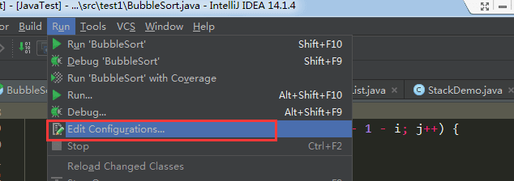


箭头处加上**-XX:+PrintGCDetails**这句话

2、配置打印 GC 的简要信息：

```
-verbose:gc
-XX:+printGC
```

解释：可以打印 GC 的简要信息。比如：

[GC 4790K->374K(15872K), 0.0001606 secs]

[GC 4790K->374K(15872K), 0.0001474 secs]

[GC 4790K->374K(15872K), 0.0001563 secs]

[GC 4790K->374K(15872K), 0.0001682 secs]

上方日志的意思是说，GC 之前，用了 4M 左右的内存，GC 之后，用了 374K 内存，一共回收了将近 4M。内存大小一共是 16M 左右。

**2、打印 GC 的详细信息：**

```
-XX:+PrintGCDetails
```

解释：打印 GC 详细信息。

```
-XX:+PrintGCTimeStamps
```

解释：打印 CG 发生的时间戳。

**理解 GC 日志的含义：**

**例如下面这段日志：**

[GC[DefNew: 4416K->0K(4928K), 0.0001897 secs] 4790K->374K(15872K), 0.0002232 secs] [Times: user=0.00 sys=0.00, real=0.00 secs]

上方日志的意思是说：这是一个新生代的 GC。方括号内部的“4416K->0K(4928K)”含义是：“GC 前该**内存区域**已使用容量->GC 后该内存区域已使用容量（该内存区域总容量）”。而在方括号之外的“4790K->374K(15872K)”表示“GC 前**Java 堆**已使用容量->GC 后 Java 堆已使用容量（Java 堆总容量）”。

再往后看，“0.0001897 secs”表示该内存区域 GC 所占用的时间，单位是秒。

**再比如下面这段 GC 日志：**


上图中，我们先看一下用红框标注的“[0x27e80000, 0x28d80000, 0x28d80000)”的含义，它表示新生代在内存当中的位置：第一个参数是申请到的起始位置，第二个参数是申请到的终点位置，第三个参数表示最多能申请到的位置。上图中的例子表示新生代申请到了 15M 的控件，而这个**15M 是等于：（eden space 的 12288K）+（from space 的 1536K）+（to space 的 1536K）**。

疑问：**分配到的新生代有 15M，但是可用的只有 13824K**，为什么会有这个差异呢？等我们在后面的文章中学习到了 GC 算法之后就明白了。

**3、指定 GC log 的位置：**

```
-Xloggc:log/gc.log
```

解释：**指定 GC log 的位置，以文件输出**。帮助开发人员分析问题。

```
-XX:+PrintHeapAtGC
```

解释：每一次 GC 前和 GC 后，都打印堆信息。

例如：

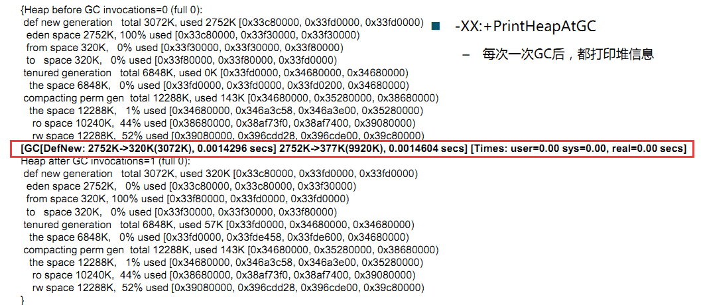

上图中，红框部分正好是一次 GC，红框部分的前面是 GC 之前的日志，红框部分的后面是 GC 之后的日志。

```
-XX:+TraceClassLoading
```

解释：监控类的加载。

例如：

```console
[Loaded java.lang.Object from shared objects file]

[Loaded java.io.Serializable from shared objects file]

[Loaded java.lang.Comparable from shared objects file]

[Loaded java.lang.CharSequence from shared objects file]

[Loaded java.lang.String from shared objects file]

[Loaded java.lang.reflect.GenericDeclaration from shared objects file]

[Loaded java.lang.reflect.Type from shared objects file]
```

```
-XX:+PrintClassHistogram
```

解释：按下 Ctrl+Break 后，打印类的信息。

例如：

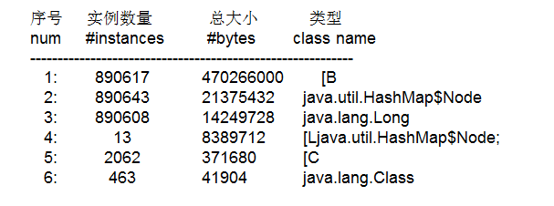

## 2：linux查看

1：linux查看打印当前系统JVM信息

查看初始参数

```shell
java -XX:+PrintFlagsInitial 
```

查看修改后的参数 =表示没有改过 :=表示人为修改或者jvm修改过的 公式：

```shell
java -XX:+PrintFlagsFinal 
java -XX:+PrintFlagsFinal -version
```

查看简要信息

```shell
#查看进程
jps
#jinfo查看对应进程的信息
jinfo -flag MaxPermSize 4680
# -XX:MaxPermSize=138412032
```

只查看堆的相关信息

```shell
java -XX:+PrintFlagsFinal -version | grep HeapSize
```

只查看栈的相关信息

```shell
 java -XX:+PrintFlagsFinal -version | grep ThreadStackSize
```


## 3：堆的分配参数

1、-Xmx –Xms，-Xss：

指定最大堆和最小堆，指定栈空间

2、-Xmn、-XX:NewRatio、-XX:SurvivorRatio：

- -Xmn**设置新生代大小**

- -XX:NewRatio

新生代（eden+2\*s）和老年代（不包含永久区）的比值

例如：4，表示新生代:老年代=1:4，即新生代占整个堆的 1/5

- -XX:SurvivorRatio（幸存代）

设置两个 Survivor 区和 eden 的比值

例如：8，表示两个 Survivor:eden=2:8，即一个 Survivor 占年轻代的 1/10

3、-XX:+HeapDumpOnOutOfMemoryError、-XX:+HeapDumpPath

- **-XX:+HeapDumpOnOutOfMemoryError**

OOM 时导出堆到文件

根据这个文件，我们可以看到系统 dump 时发生了什么。

- -XX:+HeapDumpPath

导出 OOM 的路径

导出的文件使用专门的工具进行打开，可参考第六章

**4、-XX:OnOutOfMemoryError：**

- -XX:OnOutOfMemoryError

在 OOM 时，执行一个脚本。

可以在 OOM 时，发送邮件，甚至是重启程序。

例如我们设置如下的参数：

```
-XX:OnOutOfMemoryError=D:/tools/jdk1.7_40/bin/printstack.bat %p //p代表的是当前进程的pid
```

上方参数的意思是说，执行 printstack.bat 脚本，而这个脚本做的事情是：D:/tools/jdk1.7_40/bin/jstack -F %1 > D:/a.txt，即当程序 OOM 时，在 D:/a.txt 中将会生成**线程**的 dump。

5：-XX:PermSize -XX:MaxPermSize

设置永久区的初始空间和最大空间。也就是说，jvm 启动时，永久区一开始就占用了 PermSize 大小的空间，如果空间还不够，可以继续扩展，但是不能超过 MaxPermSize，否则会 OOM。

他们表示，一个系统可以容纳多少个类型

目前生产上

```txt
-Xms8192M
-Xmx8192M
-XX:NewRatio=1 //设置新生代和老年代的比例为1:1
-XX:SurvivorRatio=6 //设置幸存代与Eden区的比例为2:6
-XX:MetaspaceSize=256M //元空间大小
-XX:MaxMetaspaceSize=512M
```

#### **堆的分配参数总结：**

- 根据实际事情调整新生代和幸存代的大小，默认为新生代占堆内存 1/3，老年代占 2/3
- 官方推荐新生代占堆的 3/8
- 幸存代占新生代的 1/10
- **在 OOM 时，记得 Dump 出堆**，确保可以排查现场问题

## 5.3：栈的分配参数

**1、Xss：**

设置栈空间的大小。通常只有几百 K

> 决定了函数调用的深度
>
> 每个线程都有独立的栈空间
>
> 局部变量、参数 分配在栈上

注：栈空间是每个线程私有的区域。栈里面的主要内容是栈帧，而栈帧存放的是局部变量表，局部变量表的内容是：局部变量、参数。

我们来看下面这段代码：（没有出口的递归调用）

```java
public class TestStackDeep {
    private static int count = 0;
    public static void recursion(long a, long b, long c) {
        long e = 1, f = 2, g = 3, h = 4, i = 5, k = 6, q = 7, x = 8, y = 9, z = 10;
        count++;
        recursion(a, b, c);
    }
    public static void main(String args[]) {
        try {
            recursion(0L, 0L, 0L);
        } catch (Throwable e) {
            System.out.println("deep of calling = " + count);
            e.printStackTrace();
        }
    }
}
```

上方这段代码是没有出口的递归调用，肯定会出现 OOM 的。

如果设置栈大小为 128k：

```
-Xss128K
```

运行效果如下：（方法被调用了 294 次）

```shell
deep of calling = 294
java.lang.StackOverflowError
```

如果设置栈大小为 256k：（方法被调用 748 次）

```shell
java.lang.StackOverflowError
deep of calling = 748
	……
```

意味着函数调用的次数太深，像这种递归调用就是个典型的例子。

### GC 常用参数

- -Xmn -Xms -Xmx -Xss
  年轻代 最小堆 最大堆 栈空间
- -XX:+UseTLAB
  使用 TLAB，默认打开
- -XX:+PrintTLAB
  打印 TLAB 的使用情况
- -XX:TLABSize
  设置 TLAB 大小
- -XX:+DisableExplictGC
  System.gc()不管用 ，FGC
- -XX:+PrintGC
- -XX:+PrintGCDetails
- -XX:+PrintHeapAtGC
- -XX:+PrintGCTimeStamps
- -XX:+PrintGCApplicationConcurrentTime (低)
  打印应用程序时间
- -XX:+PrintGCApplicationStoppedTime （低）
  打印暂停时长
- -XX:+PrintReferenceGC （重要性低）
  记录回收了多少种不同引用类型的引用
- -verbose:class
  类加载详细过程
- -XX:+PrintVMOptions
- -XX:+PrintFlagsFinal -XX:+PrintFlagsInitial
  必须会用
- -Xloggc:opt/log/gc.log
- -XX:MaxTenuringThreshold
  升代年龄，最大值 15
- 锁自旋次数 -XX:PreBlockSpin 热点代码检测参数-XX:CompileThreshold 逃逸分析 标量替换 ...
  这些不建议设置

### Parallel 常用参数

- -XX:SurvivorRatio
- -XX:PreTenureSizeThreshold
  大对象到底多大
- -XX:MaxTenuringThreshold
- -XX:+ParallelGCThreads
  并行收集器的线程数，同样适用于 CMS，一般设为和 CPU 核数相同
- -XX:+UseAdaptiveSizePolicy
  自动选择各区大小比例

### CMS 常用参数

- -XX:+UseConcMarkSweepGC
- -XX:ParallelCMSThreads
  CMS 线程数量
- -XX:CMSInitiatingOccupancyFraction
  使用多少比例的老年代后开始 CMS 收集，默认是 68%(近似值)，如果频繁发生 SerialOld 卡顿，应该调小，（频繁 CMS 回收）
- -XX:+UseCMSCompactAtFullCollection
  在 FGC 时进行压缩
- -XX:CMSFullGCsBeforeCompaction
  多少次 FGC 之后进行压缩
- -XX:+CMSClassUnloadingEnabled
- -XX:CMSInitiatingPermOccupancyFraction
  达到什么比例时进行 Perm 回收
- GCTimeRatio
  设置 GC 时间占用程序运行时间的百分比
- -XX:MaxGCPauseMillis
  停顿时间，是一个建议时间，GC 会尝试用各种手段达到这个时间，比如减小年轻代

### G1 常用参数

- -XX:+UseG1GC
- -XX:MaxGCPauseMillis
  建议值，G1 会尝试调整 Young 区的块数来达到这个值
- -XX:GCPauseIntervalMillis
  ？GC 的间隔时间
- -XX:+G1HeapRegionSize
  分区大小，建议逐渐增大该值，1 2 4 8 16 32。
  随着 size 增加，垃圾的存活时间更长，GC 间隔更长，但每次 GC 的时间也会更长
  ZGC 做了改进（动态区块大小）
- G1NewSizePercent
  新生代最小比例，默认为 5%
- G1MaxNewSizePercent
  新生代最大比例，默认为 60%
- GCTimeRatio
  GC 时间建议比例，G1 会根据这个值调整堆空间
- ConcGCThreads
  线程数量
- InitiatingHeapOccupancyPercent
  启动 G1 的堆空间占用比例

### ZGC参数

采用 ZGC 生产上的参数设置：

```txt
-Xms10G -Xmx10G
-XX:ReservedCodeCacheSize=256m -XX:InitialCodeCacheSize=256m
-XX:+UnlockExperimentalVMOptions -XX:+UseZGC
-XX:ConcGCThreads=2 -XX:ParallelGCThreads=6
-XX:ZCollectionInterval=120 -XX:ZAllocationSpikeTolerance=5
-XX:+UnlockDiagnosticVMOptions -XX:-ZProactive
-Xlog:safepoint,classhisto*=trace,age*,gc*=info:file=/opt/logs/logs/gc-%t.log:time,tid,tags:filecount=5,filesize=50m
```

**-Xms -Xmx**：堆的最大内存和最小内存，这里都设置为 10G，程序的堆内存将保持 10G 不变。

**-XX:ReservedCodeCacheSize -XX:InitialCodeCacheSize**: 设置 CodeCache 的大小， JIT 编译的代码都放在 CodeCache 中，一般服务 64m 或 128m 就已经足够。我们的服务因为有一定特殊性，所以设置的较大，后面会详细介绍。

**-XX:+UnlockExperimentalVMOptions -XX:+UseZGC**：启用 ZGC 的配置。

**-XX:ConcGCThreads**：并发回收垃圾的线程。默认是总核数的 12.5%，8 核 CPU 默认是 1。调大后 GC 变快，但会占用程序运行时的 CPU 资源，吞吐会受到影响。

**-XX:ParallelGCThreads**：STW 阶段使用线程数，默认是总核数的 60%。

**-XX:ZCollectionInterval**：ZGC 发生的最小时间间隔，单位秒。

**-XX:ZAllocationSpikeTolerance**：ZGC 触发自适应算法的修正系数，默认 2，数值越大，越早的触发 ZGC。

**-XX:+UnlockDiagnosticVMOptions -XX:-ZProactive**：是否启用主动回收，默认开启，这里的配置表示关闭。

**-Xlog**：设置 GC 日志中的内容、格式、位置以及每个日志的大小。


# 六：VisualVM 的使用

## 命令

2：jstat命令查看JVM的GC情况

（1）定时打印Java堆情况

```shell
#每隔500毫秒打印一次Java堆状况，打印5次
jstat -gcutil 线程号 500 5
```

各参数的含义

```txt
   S0  -- Heap上的 Survivor space 0 区已使用空间的百分比 
    S1  -- Heap上的 Survivor space 1 区已使用空间的百分比 
    E   -- Heap上的 Eden space 区已使用空间的百分比 
    O   -- Heap上的 Old space 区已使用空间的百分比 
    P   -- Perm space 区已使用空间的百分比 
    YGC -- 从应用程序启动到采样时发生 Young GC 的次数 
    YGCT-- 从应用程序启动到采样时 Young GC 所用的时间(单位秒) 
    FGC -- 从应用程序启动到采样时发生 Full GC 的次数 
    FGCT-- 从应用程序启动到采样时 Full GC 所用的时间(单位秒) 
    GCT -- 从应用程序启动到采样时用于垃圾回收的总时间(单位秒)
```

(2)静态其他统计


Loaded：加载class的数量；

Bytes：所占用空间大小；

unloaded：未加载数量；

Bytes：未加载占用空间

Time：时间

```shell
# 编译统计
jstat -compiler 线程号
# 垃圾回收统计
jstat -gc 线程号
# 堆内存统计
jstat -gccapacity 线程号
# 新生代垃圾回收统计
jstat -gcnew 线程号
# 新生代内存统计
jstat -gcnewcapacity 线程号
# 老年代垃圾回收统计
jstat -gcold 线程号
# 老年代内存统计
jstat -gcoldcapacity 线程号
#总结垃圾回收
jstat -gcutil 线程号
```

3：Tomcat部署配置的话，可以在Tomcat/bin/catalina.sh文件中查看配置

```properties
JAVA_OPTS="-Xms1024M -Xmx2048M"
```

4：jstack堆栈

```shell
# 打印调用栈
jstack 线程数
```

5：jmap

```shell
## 查看对象占用情况
jmap -hosto 线程数|head -20
```


jps：查看 Java 进程概述，安装了 java 就有

Jinfo pi ：查看指定 pid 的所有 JVM 信息

- jinfo -flags pid 查询虚拟机运行参数信息。
- jinfo -flag name pid，查询具体参数信息，如 jinfo -flag UseSerialGC 42324，查看是否启用 UseSerialGC


jmap

1）jmap -heap pid：输出堆内存设置和使用情况（JDK11 使用 jhsdb jmap --heap --pid pid）

2）jmap -histo pid：输出 heap 的直方图，包括类名，对象数量，对象占用大小

3）jmap -histo:live pid：同上，只输出存活对象信息

4）jmap -clstats pid：输出加载类信息

5）jmap -help：jmap 命令帮助信息

6）jmap -dump:file=a 10340：jmap 下载堆信息文件，查看信息需要下载专门的工具

jstat 每个一定时间监控内存使用情况

jstat -gctil 进程号 时间间隔

百分比显示


不想显示百分比，直接不加时间间隔，打印当前使用情况


jstack 命令

打印线程信息

jconsole：图形化查看内存线程等信息

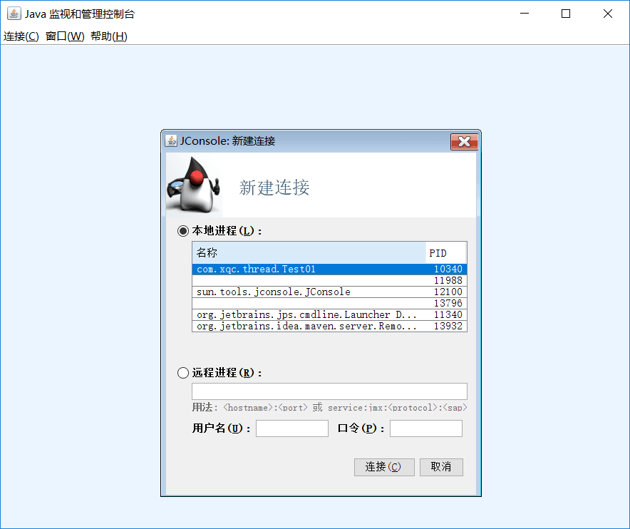

选择需要查看的进程进行连接


## VisualVM 安装插件

### VisualGC 插件

我们可以通过找到安装 JDK 的目录

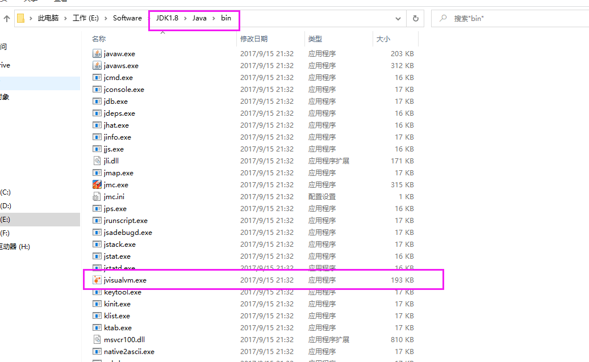

或者使用 cmd 命令来打开图形化界面

```bash
jvisualvm
```

启动完成后，会有这样一个界面

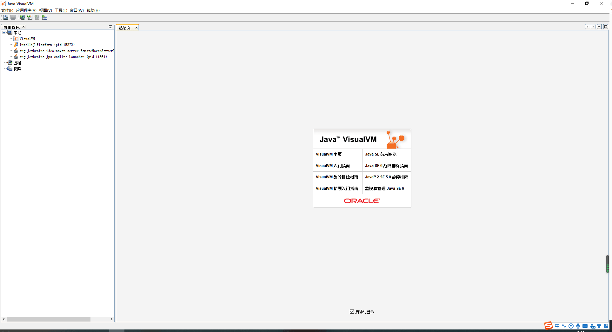

这就代表 Java VisualVM 启动成功

安装 VisualGC 插件

VIsualGC 插件，是能够让我们通过图形化的页面，来查看我们的堆内存，以及各区使用情况

下载插件

首先我们需要到 Visual 的 [插件官网](https://visualvm.github.io/pluginscenters.html) 下载，我们需要找到自己的 JDK 版本

比如我的是 JDK1.8，那么我就选择这里

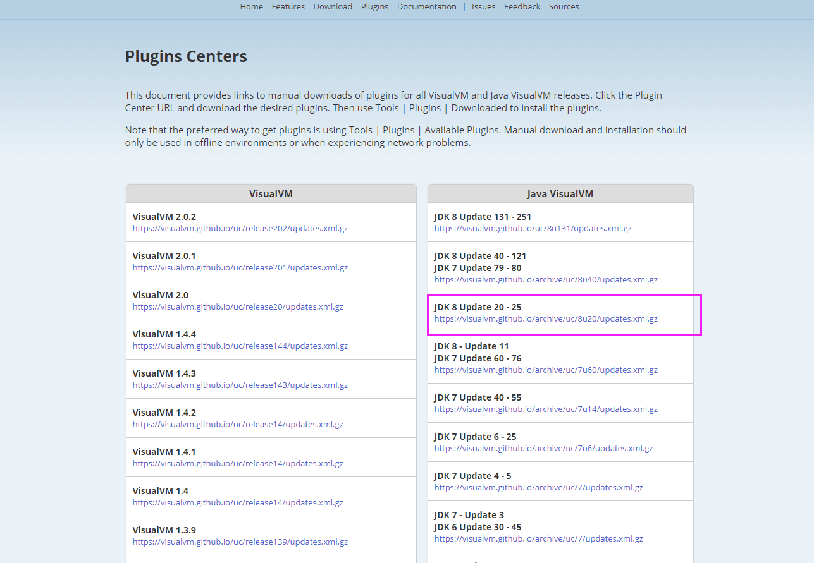

然后在找到 VisualGC 插件

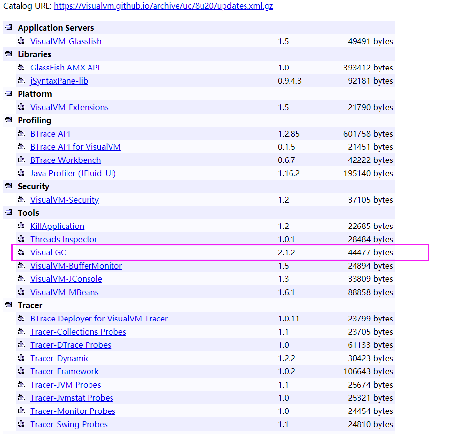

下载完成后

```bash
C:\Users\Administrator\AppData\Roaming\VisualVM
```


安装

然后在到我们刚刚打开的 Visual VM 图形化页面，点击工具 -> 插件

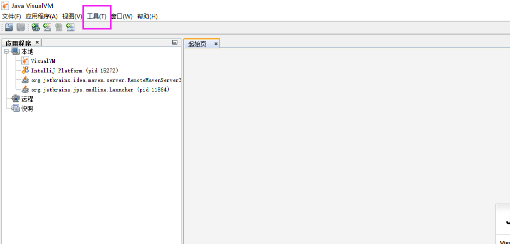

然后在点击已下载 -> 添加插件

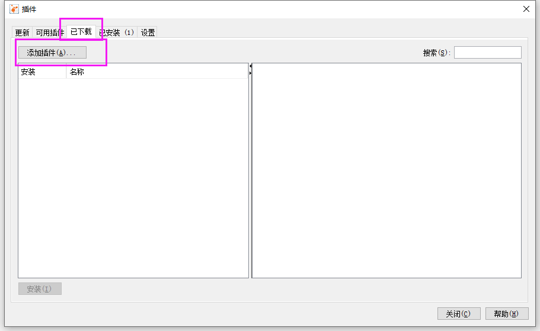

找到刚刚我们的这个文件，然后选择安装


安装成功后，我们通过写一个代码来进行检测

设置启动的 JVM 参数

```bash
-Xms100m  -Xmx100m
```

最后点击 Visual GC 查看我们的堆内存情况

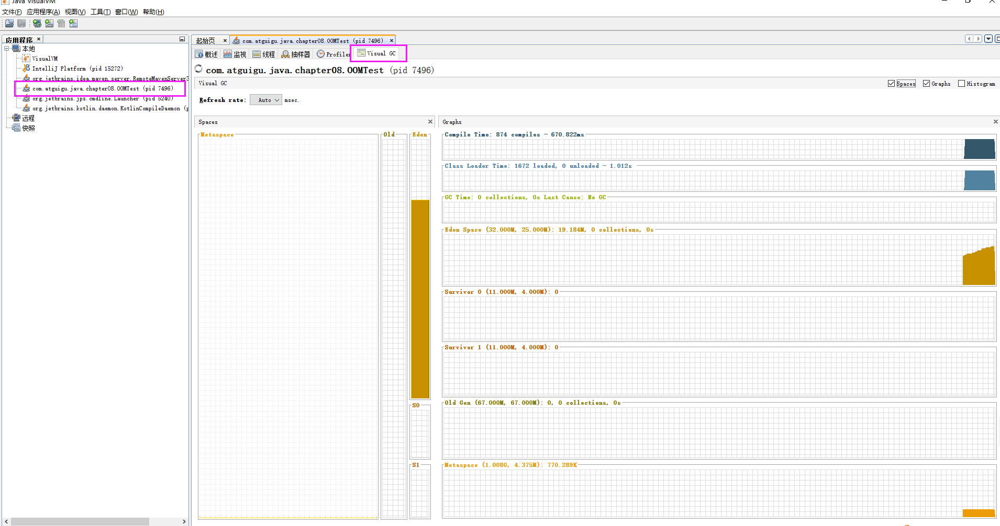

## 工具 MAT

## 性能分析的主要方式

查看是哪个类占用内存比较高

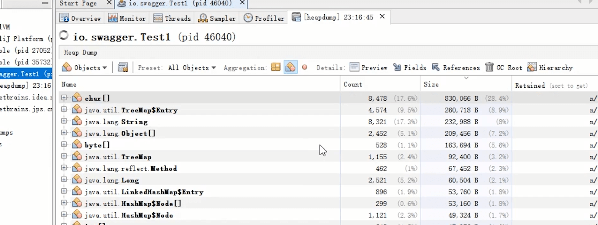

可以使用 visualVM 打开下载好的 dump 信息

自动下载 dump 信息参数

XX:+heapDumpOnOfMermoryError

## Linux 上调优工具 Arthas

下载包，直接 jar 运行

java -jar arthas-boot.jar


直接显示出正在运行的 Java 进程

输入命令 dashboard 显示线程执行情况，

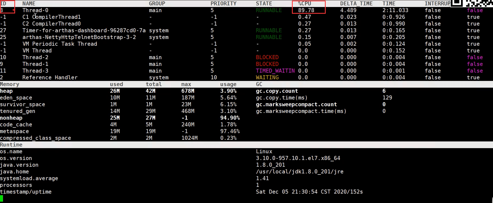

线程 8 占用过高不正常

直接输入 thread 8

直接定位到哪一行导致内存 CPU 占用过高


调优：尽可能减少 GC 特别是 Full GC，因为它会导致 stop the World

正常几天出现一次 Full GC 正常，几分钟出现一次明显异常

提交订单时创建订单对象，


可能在 14 秒时的部分对象并没有变成垃圾对象，此时部分对象就会转移到 Survice 区，甚至部分对象直接转移到老年代

老年代总共 2G，很快也会被放满

调优方案一：调整各个区的大小，当从 eden 区转移到 S 区时，并不会高于其一半，所以不会产生转移到老年代的情况，故下次的 minorGC 就会将 S0 区的对象也回收，故不会产生 FullGC

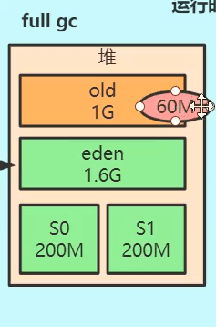

单机几十万并发的系统 JVM 的优化

当 Eden 去调的很大，也需要优化 minorGC

## 结合垃圾收集器调优

因为 Eden 与 S0 区是 8:1:1 的时候，Eden 区的东西放到 S 区放不下，还是得放到 old 区，而且 Eden 区的内存大，还得必须对 minorGC 进行优化。

让其每次不让他每次都回收全部的 Eden 区，每次只回收 Eden 的一部分区域，

使用 G1 回收器

## 实用 VisualVM 进行方法优化

项目中的某一个接口，在某一场景下（数据量大），性能让人难以忍受。

使用 Visual VM 分析某个接口的性能的方法如下：

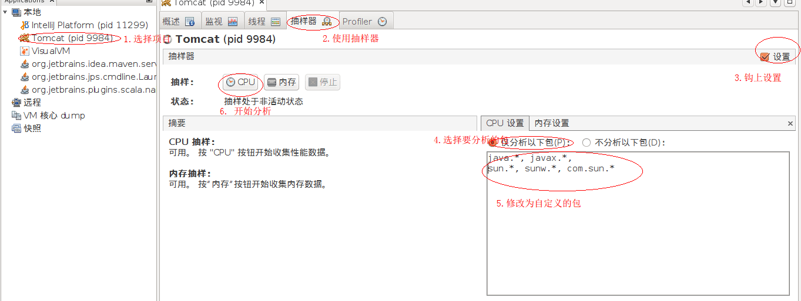

结果显示如下:


通过上图，我们可以看到比较耗时的方法为 resolveBytePosition 和 rest，getFile 和 currentUser 是网络请求，暂不考虑。

Plumbr

JVM 检测工具，但是要企业邮箱注册

# 七：HotSpot

hotspot 与 openJDK 是 JVM 的具体实现，JVM 相当于一种规范。

new 一个对象

申请内存——初始化默认值——构造方法，设置值——建立关联

```java
class T{
    int m = 8;
}
T t = new T();

汇编代码
    new #2<T>      申请内存
    dup            复制一份
    invokespecial #3 <T.<init>>  调用构造方法，初始化为8
    astore_1                    将t与内存中的T对象建立关联
    return
```

对象在内存中的存储布局

普通对象 new XX()

markword 标记字，class pointer 类型指针，instance data 实例对象，padding 对齐

其中 markword 和 class point 一起称为对象头

如果前三个一个没有满足 8 个字节，用 padding 补齐

数组

int[] a = new int[4]

T[] a = new T[5]

markword,class poniter,length(数组长度 4 字节) ，instance data 实例对象，padding

对象头主要包括的就是锁的信息，现在的 synchronized 是一个锁升级的过程

先上偏向锁，自旋锁（无锁，轻量级锁），重量级锁，

偏向锁：坑上贴个名片，如果你来就可以直接进入

当发生竞争时，使用 CAS 算法往坑上贴名片。

对象是怎么定位的？

句柄方式，直接指针

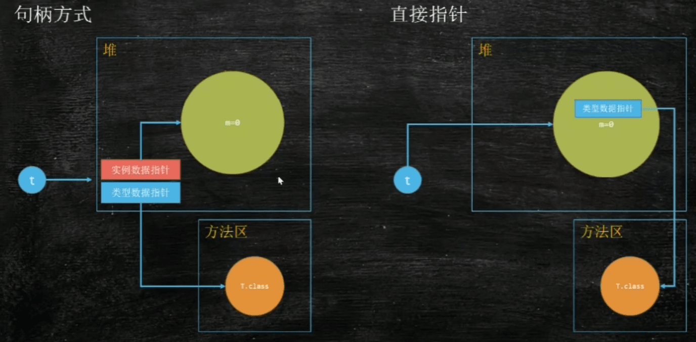

