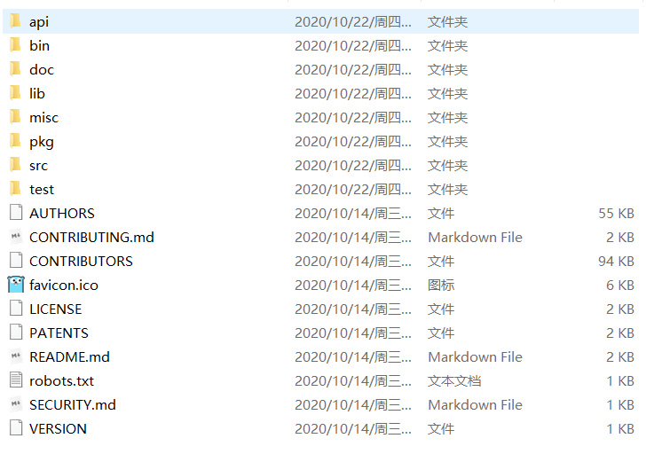

# 第一章：环境的搭建

1：下载

安装包下载地址为：https://golang.org/dl/。

如果打不开可以使用这个地址：https://golang.google.cn/dl/。

2：window下安装

注意如果更改安装路径一定要确保Path路径下有：D:\Golang\install\bin

目录结构



bin：go的指令

src：go的源代码

3：测试

创建工作区间，并创建文件test.go,文本方式打开，键入

```go
package main

import "fmt"

func main() {
  fmt.Println("Hello, World!")
}
```

使用cmd运行

```
D:\Golang\Workplace>go run test.go
```

4：开发工具


# 第二章：Golang开山

## 2.1：应用

区块链，服务器（美团），处理大并发很强，游戏软件开发，数据通道，分布式、云计算，盛大云cdn

## 2.2：特点

1）引入包的概念，用于组织程序结构，Go语言的一个文件否要归属于一个包。

2）垃圾回收机制，内存自动回收

3）天然并发（重要特点）

4）goroutine，轻量级线程，可实现大量并发

5）吸收管道通信，形成特有的管道channel，可以实现不同线程goroute之间的相互通信

6)函数可以返回多个值

7）切片slice，延时执行defer

C + Python

如果定义了变量，没有用到，代码编译不能通过


官方API文档

中文网在线文档：https://studygolang.com/pkgdoc


## 2.3：变量

标识符


### 2.3.1：类型

第一种：指定变量类型，**声明后若不赋值，使用默认值**

```go
func main(){
    //int 的默认值是0
    var i int
    var b float32 //0
    var c float64 //0
    var isMarried bool //false
    var name string //""
    fmt.Println("i=",i)
}
```

第二种：根据值自行判定变量类型（类型推导）

```go
var num = 10.11
```

第三种：省略var ，：=左侧的变量不应该是已经声明过的，否则会编译错误

```go
name :="tom"
```


基本数据类型

int

float

bool

string

数组

结构体struct

### 2.3.2：运算


### 2.3.3：指针

```go
var ptr *int = &num
```


## 2.4：运算符

同其他语言基本

## 2.5：函数

### 2.5.1：匿名函数

```go
func main(){
    //使用匿名函数，求两个数的值
    resl:= func(n1 int,n2 int) int{
        return n1 + n2
    }(10,20)
    fmt.Println("resl = ",resl)
```

也可以将匿名函数赋值给一个变量

```go
a:= func (n1 int,n2 int) int {
    return n1 + n2
}
res2 := a(10,20)

```

如果将匿名函数赋值给一个全局变量，则变成了全局匿名函数

```go
var(
    //Fun1就是一个全局匿名函数
    Fun1 = func(n1 int ,n2 int) int {
        return n1 * n2
    }
)
res3 := Fun1(4,9)

```

### 2.5.2：值传递与引用传递

1）值类型：int ，float ，bool，string

2）引用类型：指针，slice切片，map，管道chan，interface等


### 2.5.3init函数

每一个源文件都可以包含一个init函数，该函数会在main函数执行前，被Go运行框架调用

### 2.5.3：字符串函数

```go
//统计肌肤穿长度
len("str")

//字符串遍历
str = "hello 北京"
r := []rune(str)
for i:=0;i<len(r);i++ {
    fmt.Printf("字符串=%c\n",r[i])
}

```


### 2.5.4：时间与日期相关函数


## 2.6：闭包

闭包就是一个函数，但是他会使用函数外的变量，与函数外的变量共同组成一个整体，叫做闭包

```go
var n int = 10
return func(x int) int {
    n = n + x
    return n
}
```

## 2.7：函数的defer(延迟执行)

在函数中，**为了在函数执行完毕后，及时释放资源**，提供defer

当go执行到一个defer时，不会立即执行defer后的语句，而是将语句压入栈中，当函数执行完毕，再重栈中取出执行。

```go
func sun(n1 int,n2 int) int {
    //当执行到defer时，暂时不行行，会将defer后面的语句压入到独立的栈（defer栈）
    //当函数执行完毕后，再从defer栈，按照先入后出的方式出栈，执行
    //入栈时，也会将其值保存到栈中，故值还是以前的
    defer fmt.Println("ok1 n1=",n1)
    defer fmt.Println("ok2 n2=",n2)
    
    n1++  //n1 = 11
    n2++  //n2 = 21
    
    res := n1 + n2
    fmt.Println("ok3 res = ",res)
}
func main(){
    res := sum(10,20)
    fmt.Println("res = ",res)
}
```

执行结果

```cmd
ok3 res = 32
ok2 n2 = 20
ok1 n1 = 10
res = 32
```

实践

资源关闭：如

defer file.close()

defer connect.close()

## 2.8：错误处理

Go语言不支持try ……catch……finally，而是引入的处理方式为**defer ，panic，recover**：Go中可以抛出一个**panic的异常**，然后在**defer中通过recover捕获**这个异常，然后处理

```go
func test(){
    //使用defer + recover 来捕获和处理异常
    defer func(){
        //recover()内置函数，可以捕获到异常
        err := recover()
        if err !=nil{
            fmt.Println("err = ",err)
        }        
    }()
    num1 :=10
    num2 :=0
    res :=num1/num2
    fmt.Println("res = ",res)    
}
```

自定义异常


## 2.9：数组与切片

```go
var a[5] int 
```

遍历的for--range结构

```go
for index,value :=range a {
    fmt.Println(" index = %v value = %v",index,value)
}
```

**当个数不确定时，使用切片**，切片是数组的一个引用，切片是引用类型

```go
var a[] int
```

简单使用

```go
func main(){
    //定义并初始化一个数组
    var intArr [5]int = [...]int[1,22,33,66,99]
    //定义一个切片slice，引用数组从1到3的位置,不包含3
    slice := intArr[1:3]
}

```

切片在内存中的存储形式

slice[ 存放22的地址，长度len，容量cap]

## 2.10：Map

key-value结构，成为字段或者关联数组

key和value的值不能是slice，map还有function，其他都可以，key是不能重复的，重复的相当于更新

声明是不会分配内存的，初始化需要make，分配内存后才能赋值和使用

```go
func main(){
    //map的声明和注意事项
    var a map[string]string
    //在使用map前，需要先make，make的作用就是给分配数据空间
    a = make(map[string]string,10)
    a["no1"] = "no1"
    a["no2"] = "no2"
    a["no1"] = "no3"
    fmt.Println(a)
    //删除
    delete(a,"no1")
    //如果删除的不存在，不会操作，也不会报错
    delete(a,"no4")
    //遍历
    for k,v := range a {
        fmt.Print("k=%v v=%v",k,v)
    }
    
}
```

### map切片

切片的数据类型如果是map，称之为map切片，这样map的个数就可以动态变化了

```go
func main(){
    var m []map[string]string
    //???这个2
    m = make([]map[string]string,2)
}
```

# 第三章：面向对象

结构体

声明结构体

```go
type Student struct{
    Name string
    Age int
    Score float32
}
```

封装

继承

```go
type Pupil struct{
    //直接嵌入Student匿名结构体
    Student
}
```

多重继承

接口

```go
type AInterface interface{
    Say()
}
```

多态

# 第四章：文件

打开文件

```go
func main(){
    file ,err := os.open("d:/test.txt")
    if err !=nil {
        fmt.Println("open file err=",err)
    }
    //输出文件
    fmt.Println("file = %v",file)
    //关闭文件
    err = file.close()
    if err != nil {
        fmt.Println("close file err=",err)
    }
}
```


# 第五章：Goroutine 和channel

Golang的协程重要，它可以轻松开启上万个协程，其他编程语言的并发机制是一般基于线程，开启过多的线程，资源耗费大，这里就凸显Golang的并发的优势了。

## Goroutine的调度模型

MPG模式

M：操作系统的主线程（物理线程）

P：协程执行需要的上下文

G：协程


设置Golang运行的CPU数

go1.8后，默认让程序运行在多个核上。可以不用设置

```go
func main(){
    //获取当前系统CPU的数量
    num：= runtime.NumCPU()
    //我这里设置num-1的CPU运行go程序
    runtime.GOMAXPROCS(num)
    fmt.Println("num=",num)
}
```


## channel管道

不同的goroutine之间如何进行通信？

1）全局变量互斥锁

2）使用管道channel来解决


本质是一个队列，保持先进先出的原则，线程安全，都goroutine访问时，不需要加锁，channel是有类型的，string的channel只能存放string，

声明

```go
var 变量名 chan 数据类型
var intChan chan int(intChan用于存放int数据)
```

channel是引用类型，必须make之后才能使用

```go
func main() {
	//创建一个可以存放3个int类型的管道
	var intChan chan int
	intChan = make(chan int,3)

	//看看intChan是什么
	fmt.Printf("intChan的值 = %v intChan 本身的地址 = %p \n",intChan,&intChan)
	//像管道写入数据
	intChan<- 10
	num :=211
	intChan<- num
	intChan<- 50
	//查看管道的长度和容量
	fmt.Printf("channel len %v cap=%v \n",len(intChan),cap(intChan))//3,3

	//从管道中取出数据
	var num2 int
	num2 = <- intChan
	fmt.Printf("num2 = %v\n",num2)
	fmt.Printf("channel len %v cap=%v \n",len(intChan),cap(intChan))//2,3

}
```

channel有声明为只读或则只写性质

```go
var chan2 chan<- int//只写性质
var chan3 <-chan int//只读性质 
```


# 第六章：反射

反射可以在运行时动态获取变量的各种信息，比如变量的类型，类别，如果是结构体变量，还可以回去到结构体本身信息

使用反射，需要引入 `import ("reflect")


当不知道接口调用那个函数，根据传入参数在运行时确定调用的具体接口，这种需要对函数或方法反射

```go
func reflectTest01(num interface{}) {
	//通过反射获取的传入的变量的type，kind值
	//先获取到reflect。Type
	rTyp:= reflect.TypeOf(num)
	fmt.Printf("rType = ",rTyp)

	//获取reflect.Value
	rVal:=reflect.ValueOf(num)
	n2:=2 + rVal.Int()
	fmt.Printf("n2 = %v\n",n2)
	fmt.Printf("rVal = %v rVal Type = %T\n",rVal,rVal)
}
```


# 第七章：网络编程


# 第八章：Redis的使用

1：安装Redis库

在GoPath路径下执行安装命令

```cmd
go get github.com/garyburd/redigo/redis
```

使用

```go
import(
	"fmt"
    "github.com/garyburd/redigo/redis"//引入redis包
)

func main(){
    //通过go向redis写入数据和读取数据
    //链接到redis
    conn,err := redis.Dial("tcp","127.0.0.1:6379")
    if err!=nil {
        fmt.Println("redis.Dial err = ",err)
        return
    }
    defer conn.Close()//关闭
    //痛过go向redis写入数据
    _,err = conn.Do("Set","name","maoma")
        if err!=nil {
        fmt.Println("Set err = ",err)
        return
    }
    
    //通过go向redis读取数据
    r,err := redis.String(conn.Do("Get","name"))
    if err!=nil{
                fmt.Println("Get err = ",err)
        return
    }
}

```


## Redisl连接池

事先初始化一定数量的链接，放入连接词中

```go
import(
	"fmt"
    "github.com/garyburd/redigo/redis"//引入redis包
)
//定义一个全局的pool
var pool *redis.Pool

//当启动程序是，就初始化连接词
func init(){
    pool = &redis.Pool{
        MaxIdle:8,//最大空闲连接数
        MaxActive:0,//表示和数据库的最大连接数，0表示没有限制
        IdleTimeout:100,//最大空闲时间
        Dial:func()(redis.Conn,error){
            //初始化链接的代码，链接那个IP的redis
            return redis.Dial("tcp","localhost:6379")
        },
    }
}
func main(){
    //先从pool取出一个链接
    conn:=pool.Get()
    defer conn.Close()
    
    
}
```

