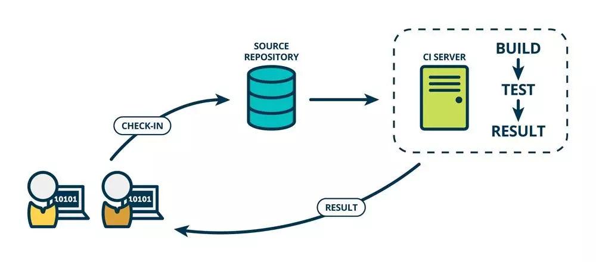
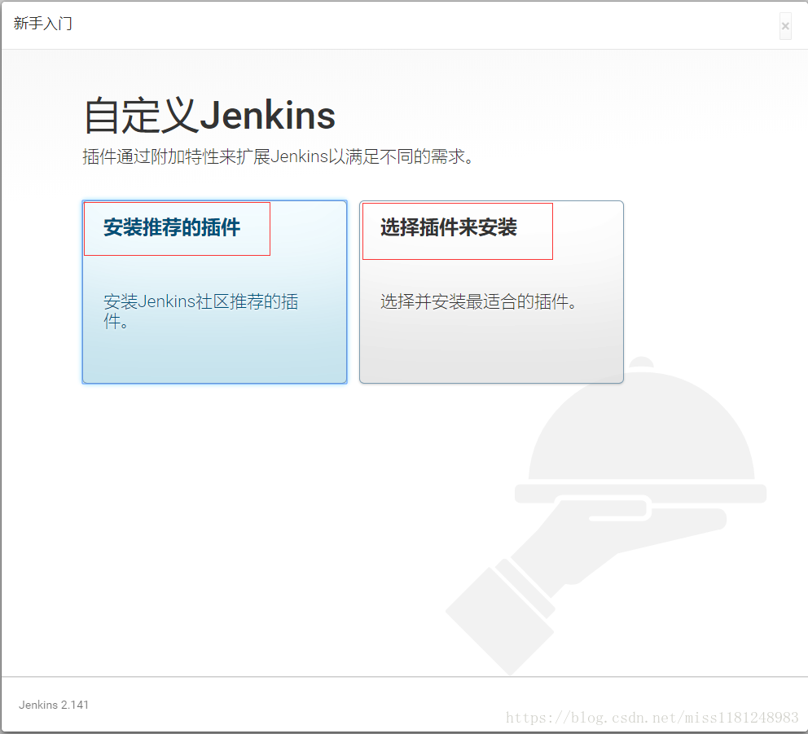
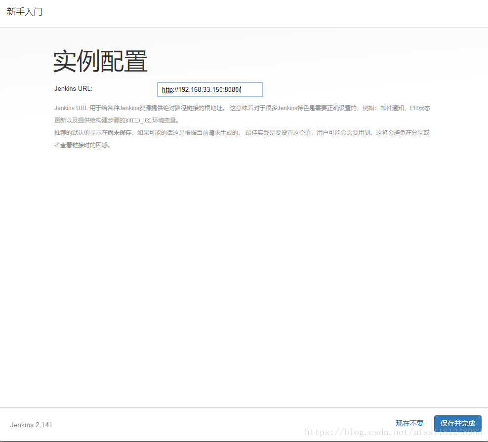
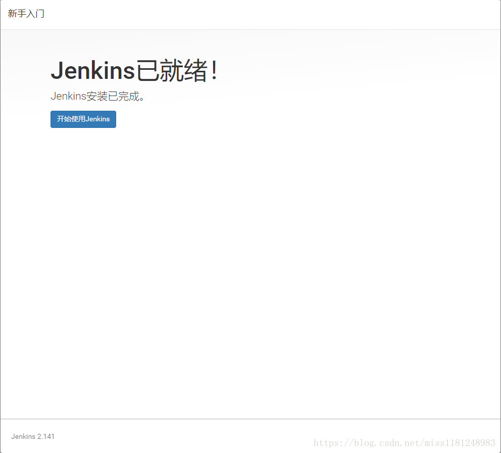
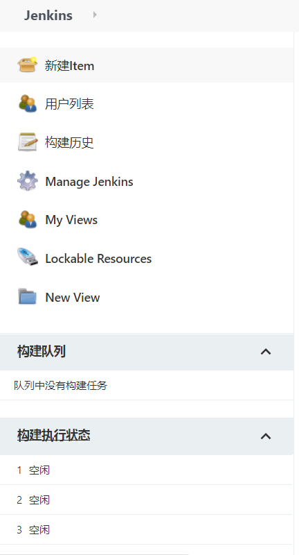
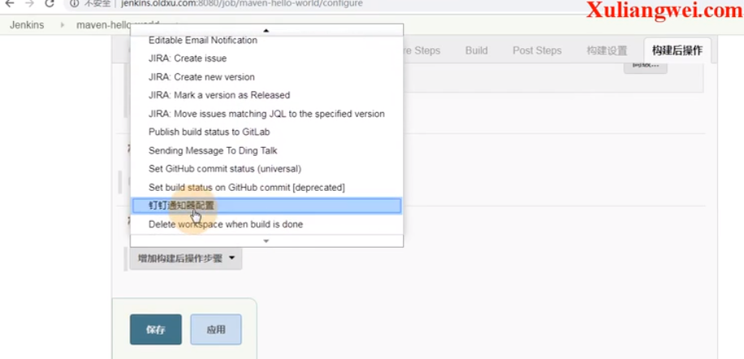
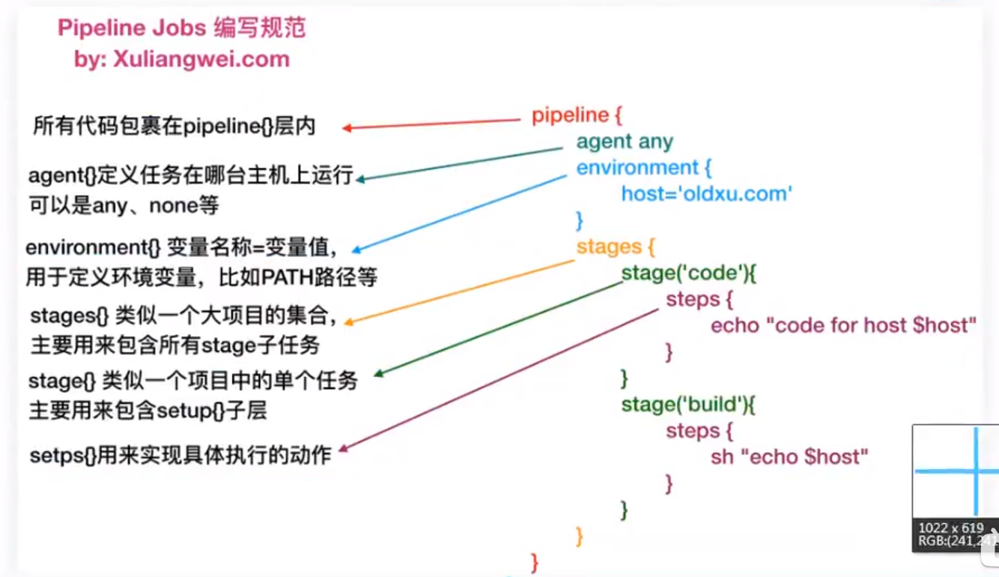

# 一：简介

Jenkins是一个开源的、提供友好操作界面的持续集成(CI)工具

主要用于持续、自动的构建/测试软件项目、监控外部任务的运行

。

Jenkins用Java语言编写，可在Tomcat等流行的servlet容器中运行，也可独立运行。通常与版本管理工具(SCM)、构建工具结合使用。常用的版本控制工具有SVN、GIT，构建工具有Maven、Ant、Gradle。

## 1.1：CI/CD

CI(Continus integration 持续集成)。持续集成强调开发人员提交新代码后，立即进行构件，测试。




CD（Continuous Deliery 持续交付）在持续集成的基础上，将集成后的代码部署到更贴近真实运行环境中。

# 二：安装

Jenkins是基于JDK开发的，故要求JDK版本大于8

## 2.1：安装JDK

## 2.2：安装Jenkins

获取

```cmd
wget -O /etc/yum.repos.d.jenkins.repo https://pkg.jenkins.io/redhat/jenkins.repo
```

查看

```cmd
# cat /etc/yum.repos.d/jenkins.repo 
[jenkins]
name=Jenkins
baseurl=http://pkg.jenkins.io/redhat
gpgcheck=1				#为1时会检测key
```

安装jenkins

```cmd
rpm --import https://pkg.jenkins.io/redhat/jenkins.io.key

yum install -y jenkins
```

启动

```cmd
systemctl start jenkins
# 查看
ps aux |grep jenkins
jenkins    1157 84.7 10.0 2320896 100884 ?      Ssl  23:28   0:08 /etc/alternatives/java -Dcom.sun.akuma.Daemon=daemonized -Djava.awt.headless=true -DJENKINS_HOME=/var/lib/jenkins -jar /usr/lib/jenkins/jenkins.war --logfile=/var/log/jenkins/jenkins.log --webroot=/var/cache/jenkins/war --daemon --httpPort=8080 --debug=5 --handlerCountMax=100 --handlerCountMaxIdle=20
```

访问设置

打开浏览器法，访问ip8080


提示需要输入管理员密码，输入77faa20f2ad544f7bcb6593b1cf1436b（上面查到的admin密码），点击`继续`，会初始化一小段时间



这里我选择`安装推荐的插件`


这里就已经开始在安装插件，我们等它安装完就好了。

上面等插件安装完后，就进入到下面界面，提示要创建第一个admin用户，并设置用户名密码


点击`保存并完成`



提示配置jenkins URL，这里保持默认即可，继续点击`保存并完成`



# 三：使用

## 3.1：基本配置

使用前，先了解一些jenkins的配置

配置文件

```cmd
# cat /etc/sysconfig/jenkins				#查看jenkins的配置文件，定义了home、JAVA_CMD、user、port等基础配置，保持默认即可

```

文件内容

```text
## Path:        Development/Jenkins
## Description: Jenkins Automation Server
## Type:        string
## Default:     "/var/lib/jenkins"
## ServiceRestart: jenkins
#
# Directory where Jenkins store its configuration and working
# files (checkouts, build reports, artifacts, ...).
#
JENKINS_HOME="/var/lib/jenkins"

## Type:        string
## Default:     ""
## ServiceRestart: jenkins
#
# Java executable to run Jenkins
# When left empty, we'll try to find the suitable Java.
#
JENKINS_JAVA_CMD=""

## Type:        string
## Default:     "jenkins"
## ServiceRestart: jenkins
#
# Unix user account that runs the Jenkins daemon
# Be careful when you change this, as you need to update
# permissions of $JENKINS_HOME and /var/log/jenkins.
#
JENKINS_USER="jenkins"

## Type:        string
## Default: "false"
## ServiceRestart: jenkins
#
# Whether to skip potentially long-running chown at the
# $JENKINS_HOME location. Do not enable this, "true", unless
# you know what you're doing. See JENKINS-23273.
#
#JENKINS_INSTALL_SKIP_CHOWN="false"

## Type: string
## Default:     "-Djava.awt.headless=true"
## ServiceRestart: jenkins
#
# Options to pass to java when running Jenkins.
#
JENKINS_JAVA_OPTIONS="-Djava.awt.headless=true"

## Type:        integer(0:65535)
## Default:     8080
## ServiceRestart: jenkins
#
# Port Jenkins is listening on.
# Set to -1 to disable
#
JENKINS_PORT="8080"

## Type:        string
## Default:     ""
## ServiceRestart: jenkins
#
# IP address Jenkins listens on for HTTP requests.
# Default is all interfaces (0.0.0.0).
#
JENKINS_LISTEN_ADDRESS=""

## Type:        integer(0:65535)
## Default:     ""
## ServiceRestart: jenkins
#
# HTTPS port Jenkins is listening on.
# Default is disabled.
#
JENKINS_HTTPS_PORT=""

## Type:        string
## Default:     ""
## ServiceRestart: jenkins
#
# Path to the keystore in JKS format (as created by the JDK 'keytool').
# Default is disabled.
#
JENKINS_HTTPS_KEYSTORE=""

## Type:        string
## Default:     ""
## ServiceRestart: jenkins
#
# Password to access the keystore defined in JENKINS_HTTPS_KEYSTORE.
# Default is disabled.
#
JENKINS_HTTPS_KEYSTORE_PASSWORD=""

## Type:        string
## Default:     ""
## ServiceRestart: jenkins
#
# IP address Jenkins listens on for HTTPS requests.
# Default is disabled.
#
JENKINS_HTTPS_LISTEN_ADDRESS=""


## Type:        integer(1:9)
## Default:     5
## ServiceRestart: jenkins
#
# Debug level for logs -- the higher the value, the more verbose.
# 5 is INFO.
#
JENKINS_DEBUG_LEVEL="5"

## Type:        yesno
## Default:     no
## ServiceRestart: jenkins
#
# Whether to enable access logging or not.
#
JENKINS_ENABLE_ACCESS_LOG="no"

## Type:        integer
## Default:     100
## ServiceRestart: jenkins
#
# Maximum number of HTTP worker threads.
#
JENKINS_HANDLER_MAX="100"

## Type:        integer
## Default:     20
## ServiceRestart: jenkins
#
# Maximum number of idle HTTP worker threads.
#
JENKINS_HANDLER_IDLE="20"

## Type:        string
## Default:     ""
## ServiceRestart: jenkins
#
# Pass arbitrary arguments to Jenkins.
# Full option list: java -jar jenkins.war --help
#
JENKINS_ARGS=""
```

目录；

jobs		浏览器上面创建的任务都会存放在这里

logs		存放jenkins相关的日志

nodes		多节点时用到

plugins		插件所在目录

secrets		密码秘钥所在目录				#jobs和plugins目录比较重要

## 3.2：发布项目代码

登录Jenkins， 点击左侧的新建，创建新的构建任务。




# 四：集成

## 集成GitLab


## 集成Maven项目


## 集成钉钉通知


优点：简单，提醒，查看

邮件也行


下载钉钉，启动机器人，然后群主搞一个自定义机器人，拿到token


Jenkins安装插件

配置




## 集成pipeline

基本语法




新建项目：

构建一个流水线的项目

写pipline脚本


