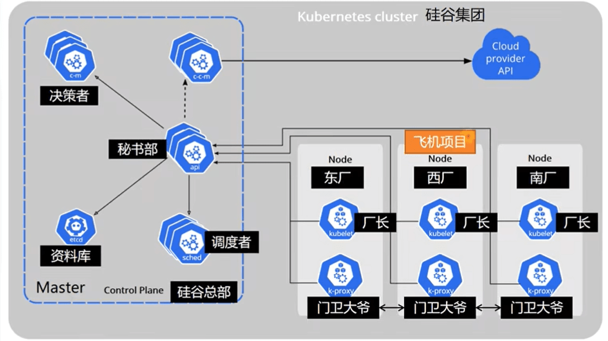
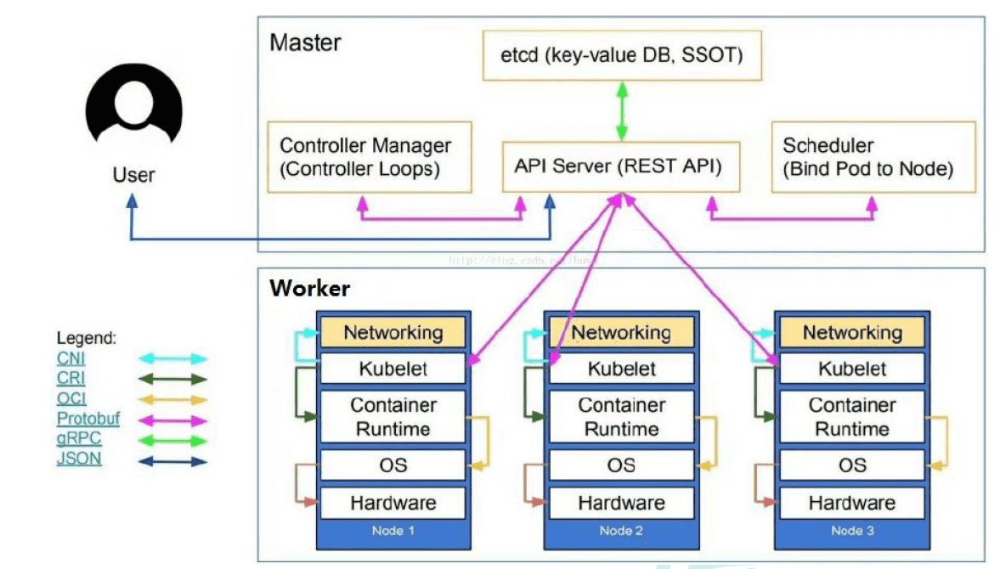
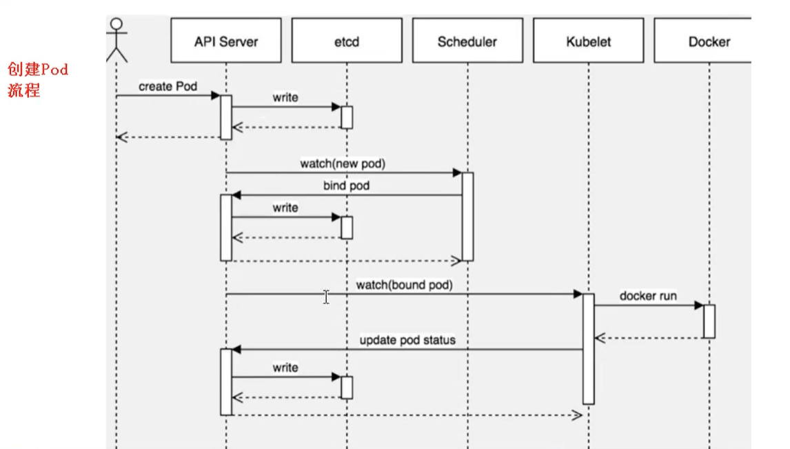

# 第一章：基本概念

## 概述

kubernetes，简称K8s，是用8 代替8 个字符“ubernete”而成的缩写。是一个开源的，用于管理云平台中多个主机上的容器化的应用，Kubernetes 的目标是让部署容器化的应用简单并且高效（powerful）,Kubernetes 提供了应用部署，规划，更新，维护的一种机制。

docker单机版比较方面，k8s对于集群更加方便，K8S有如下作用与优势：

**服务发现与负载均衡**

用户不需使用额外的服务发现机制，就能够基于Kubernetes 自身能力实现服务发现和负载均衡，对外提供统一的入口，让它来做节点的调度和负载均衡， 相当于微服务里面的网关

**存储编排**

K8S允许你自动挂载你选择的存储系统，本地或者云提供商，存储交给K8S管理编排；

**自动装箱**

基于容器对应用运行环境的资源配置要求自动部署应用容器

自我修复(自愈能力)

当容器失败时，会对容器进行重启

当所部署的Node节点有问题时，会对容器进行重新部署和重新调度

当容器未通过监控检查时，会关闭此容器直到容器正常运行时，才会对外提供服务

**水平扩展**

通过简单的命令、用户UI 界面或基于CPU 等资源使用情况，对应用容器进行规模扩大或规模剪裁

当我们有大量的请求来临时，我们可以增加副本数量，从而达到水平扩展的效果

**滚动更新**

可以根据应用的变化，对应用容器运行的应用，进行一次性或批量式更新；添加应用的时候，不是加进去就马上可以进行使用，而是需要判断这个添加进去的应用是否能够正常使用

**版本回退**

可以根据应用部署情况，对应用容器运行的应用，进行历史版本即时回退

**密钥和配置管理**

在不需要重新构建镜像的情况下，可以部署和更新密钥和应用配置，类似热部署。

批处理

提供一次性任务，定时任务；满足批量数据处理和分析的场景

## 架构

K8S架构主要包含两部分：Master（主控节点）和 node（工作节点）；

集群 = N 个Master Node (奇数个) + N个 Worker Node ；


k8s 集群控制节点，对集群进行调度管理，接受集群外用户去集群操作请求；

**master**：主控节点

- controller-manager：处理集群中常规后台任务，一个资源对应一个控制器，相当于公司决策者；

- API Server：集群统一入口，以restful风格进行操作，同时交给etcd存储；提供认证、授权、访问控制、API注册和发现等机制；

- scheduler：节点的调度，选择node节点应用部署

- etcd：存储系统，用于保存集群中的相关数据

  

**Work node**：工作节点

- Kubelet：master派到node节点代表，管理本机容器；一个集群中每个节点上运行的代理，它保证容器都运行在Pod中；负责维护容器的生命周期，同时也负责Volume(CSI) 和 网络(CNI)的管理；
- kube-proxy：提供网络代理，负载均衡等操作

- 容器运行环境【**Container Runtime**】：容器运行环境是负责运行容器的软件；Kubernetes支持多个容器运行环境：Docker、containerd、cri-o、rktlet以及任何实现Kubernetes CRI (容器运行环境接口) 的软件。

- fluentd：是一个守护进程，它有助于提升 集群层面日志




完整图：





# 第二章：搭建K8S集群

## minikube

只是一个K8S集群模拟器，只有一个节点的集群，只为测试用，master和worker都在一起直接用；

先安装Docker；

## 云平台

可视化搭建，只需简单几步就可以创建好一个集群。

## 裸机

### Kubeadm部署集群

kubeadm是一个K8S部署工具，提供kubeadm init 和 kubeadm join，用于快速部署Kubernetes集群

```bash
# 创建一个 Master 节点
kubeadm init

# 将一个 Node 节点加入到当前集群中
kubeadm join <Master节点的IP和端口 >
```

步骤

- 安装虚拟机，在虚拟机安装Linux操作系统【3台虚拟机】
- 对操作系统初始化操作
- 所有节点安装Docker、kubeadm、kubelet、kubectl【包含master和slave节点】
  - 安装docker、使用yum，不指定版本默认安装最新的docker版本
  - 修改docker仓库地址，yum源地址，改为阿里云地址
  - 安装kubeadm，kubelet 和 kubectl
    - k8s已经发布最新的1.19版本，可以指定版本安装，不指定安装最新版本
    - `yum install -y kubelet kubeadm kubectl`
- 在master节点执行初始化命令操作
  - `kubeadm init`
  - 默认拉取镜像地址 K8s.gcr.io国内地址，需要使用国内地址
- 安装网络插件(CNI)
  - `kubectl apply -f kube-flannel.yml`
- 在所有的node节点上，使用join命令，把node添加到master节点上
- 测试kubernetes集群

**1：准备环境**

| 角色   | IP              |
| ------ | --------------- |
| master | 192.168.177.130 |
| node1  | 192.168.177.131 |
| node2  | 192.168.177.132 |

2：操作系统初始化

```bash
# 关闭防火墙
systemctl stop firewalld
# 永久关闭防火墙
systemctl disable firewalld

# 关闭selinux
# 永久关闭
sed -i 's/enforcing/disabled/' /etc/selinux/config  
# 临时关闭
setenforce 0  

# 关闭swap
# 临时
swapoff -a 
# 永久关闭
sed -ri 's/.*swap.*/#&/' /etc/fstab

# 根据规划设置主机名【master节点上操作】
hostnamectl set-hostname k8smaster
# 根据规划设置主机名【node1节点操作】
hostnamectl set-hostname k8snode1
# 根据规划设置主机名【node2节点操作】
hostnamectl set-hostname k8snode2

# 在master添加hosts
cat >> /etc/hosts << EOF
192.168.177.130 k8smaster
192.168.177.131 k8snode1
192.168.177.132 k8snode2
EOF


# 将桥接的IPv4流量传递到iptables的链
cat > /etc/sysctl.d/k8s.conf << EOF
net.bridge.bridge-nf-call-ip6tables = 1
net.bridge.bridge-nf-call-iptables = 1
EOF
# 生效
sysctl --system  

# 时间同步
yum install ntpdate -y
ntpdate time.windows.com
```

3：安装Docker/kubeadm/kubelet

所有节点安装Docker/kubeadm/kubelet ，Kubernetes默认CRI（容器运行时）为Docker，因此先安装Docker

**安装Docker**

安装wget

```shell
yum install wget
```

安装docker

```shell
# yum安装
yum -y install docker-ce
```

首先配置一下Docker的阿里yum源

```bash
cat >/etc/yum.repos.d/docker.repo<<EOF
[docker-ce-edge]
name=Docker CE Edge - \$basearch
baseurl=https://mirrors.aliyun.com/docker-ce/linux/centos/7/\$basearch/edge
enabled=1
gpgcheck=1
gpgkey=https://mirrors.aliyun.com/docker-ce/linux/centos/gpg
EOF
```

然后yum方式安装docker

```bash

# 查看docker版本
docker --version  

# 启动docker
systemctl enable docker
systemctl start docker
```

配置docker的镜像源

```bash
cat >> /etc/docker/daemon.json << EOF
{
  "registry-mirrors": ["https://b9pmyelo.mirror.aliyuncs.com"]
}
EOF
```

然后重启docker

```bash
systemctl restart docker
```

**添加kubernetes软件源**

然后我们还需要配置一下yum的k8s软件源

```bash
cat > /etc/yum.repos.d/kubernetes.repo << EOF
[kubernetes]
name=Kubernetes
baseurl=https://mirrors.aliyun.com/kubernetes/yum/repos/kubernetes-el7-x86_64
enabled=1
gpgcheck=0
repo_gpgcheck=0
gpgkey=https://mirrors.aliyun.com/kubernetes/yum/doc/yum-key.gpg https://mirrors.aliyun.com/kubernetes/yum/doc/rpm-package-key.gpg
EOF
```

**安装kubeadm，kubelet和kubectl**

由于版本更新频繁，这里指定版本号部署：

```bash
# 安装kubelet、kubeadm、kubectl，同时指定版本
yum install -y kubelet-1.18.0 kubeadm-1.18.0 kubectl-1.18.0
# 设置开机启动
systemctl enable kubelet
```

4：部署master

在   192.168.177.130  执行，也就是master节点

```bash
kubeadm init --apiserver-advertise-address=192.168.177.130 --image-repository registry.aliyuncs.com/google_containers --kubernetes-version v1.18.0 --service-cidr=10.96.0.0/12  --pod-network-cidr=10.244.0.0/16
```

由于默认拉取镜像地址k8s.gcr.io国内无法访问，这里指定阿里云镜像仓库地址，【执行上述命令会比较慢，因为后台其实已经在拉取镜像了】，我们 docker images 命令即可查看已经拉取的镜像

当我们出现下面的情况时，表示kubernetes的镜像已经安装成功

使用kubectl工具 【master节点操作】

```bash
mkdir -p $HOME/.kube
sudo cp -i /etc/kubernetes/admin.conf $HOME/.kube/config
sudo chown $(id -u):$(id -g) $HOME/.kube/config
```

执行完成后，我们使用下面命令，查看我们正在运行的节点

```bash
kubectl get nodes
```

能够看到，目前有一个master节点已经运行了，但是还处于未准备状态

下面我们还需要在Node节点执行其它的命令，将node1和node2加入到我们的master节点上

5：加入Slave

下面我们需要到 node1 和 node2服务器，执行下面的代码向集群添加新节点

执行在kubeadm init输出的kubeadm join命令：

> 注意，以下的命令是在master初始化完成后，每个人的都不一样！！！需要复制自己生成的

```bash
kubeadm join 192.168.177.130:6443 --token 8j6ui9.gyr4i156u30y80xf \
    --discovery-token-ca-cert-hash sha256:eda1380256a62d8733f4bddf926f148e57cf9d1a3a58fb45dd6e80768af5a500
```

默认token有效期为24小时，当过期之后，该token就不可用了。这时就需要重新创建token，操作如下：

```
kubeadm token create --print-join-command
```

当我们把两个节点都加入进来后，我们就可以去Master节点 执行下面命令查看情况

```bash
kubectl get node
```

6：部署CNI网络插件

上面的状态还是NotReady，下面我们需要网络插件，来进行联网访问

```bash
# 下载网络插件配置
wget https://raw.githubusercontent.com/coreos/flannel/master/Documentation/kube-flannel.yml
```

默认镜像地址无法访问，sed命令修改为docker hub镜像仓库。

```bash
# 添加
kubectl apply -f https://raw.githubusercontent.com/coreos/flannel/master/Documentation/kube-flannel.yml

# 查看状态 【kube-system是k8s中的最小单元】
kubectl get pods -n kube-system
```

运行后的结果


运行完成后，我们查看状态可以发现，已经变成了Ready状态了

如果上述操作完成后，还存在某个节点处于NotReady状态，可以在Master将该节点删除

```bash
# master节点将该节点删除
kubectl delete node k8snode1
 
# 然后到k8snode1节点进行重置
 kubeadm reset
# 重置完后在加入
kubeadm join 192.168.177.130:6443 --token 8j6ui9.gyr4i156u30y80xf     --discovery-token-ca-cert-hash sha256:eda1380256a62d8733f4bddf926f148e57cf9d1a3a58fb45dd6e80768af5a500
```

7：测试kubernetes集群

我们都知道K8S是容器化技术，它可以联网去下载镜像，用容器的方式进行启动

在Kubernetes集群中创建一个pod，验证是否正常运行：

```bash
# 下载nginx 【会联网拉取nginx镜像】
kubectl create deployment nginx --image=nginx
# 查看状态
kubectl get pod
```

如果我们出现Running状态的时候，表示已经成功运行了

下面我们就需要将端口暴露出去，让其它外界能够访问

```bash
# 暴露端口
kubectl expose deployment nginx --port=80 --type=NodePort
# 查看一下对外的端口
kubectl get pod,svc
```

能够看到，我们已经成功暴露了 80端口  到 30529上

我们到我们的宿主机浏览器上，访问如下地址

```bash
http://192.168.177.130:30529/
```

发现我们的nginx已经成功启动了


8：安装K8S可视化界面dashboard


### 二进制包方式部署

- 安装虚拟机和操作系统，对操作系统进行初始化操作
- 生成cfssl 自签证书
  - `ca-key.pem`、`ca.pem`
  - `server-key.pem`、`server.pem`
- 部署Etcd集群
  - 部署的本质，就是把etcd集群交给 systemd 管理
  - 把生成的证书复制过来，启动，设置开机启动
- 为apiserver自签证书，生成过程和etcd类似
- 部署master组件，主要包含以下组件
  - apiserver
  - controller-manager
  - scheduler
  - 交给systemd管理，并设置开机启动
  - 如果要安装最新的1.19版本，下载二进制文件进行安装
- 部署node组件
  - docker
  - kubelet
  - kube-proxy【需要批准kubelet证书申请加入集群】
  - 交给systemd管理组件- 组件启动，设置开机启动
- 批准kubelet证书申请 并加入集群
- 部署CNI网络插件
- 测试Kubernets集群【安装nginx测试】


# 第三章：kubectl

kubectl是Kubernetes集群的命令行工具，通过kubectl能够对集群本身进行管理，并能够在集群上进行容器化应用的安装和部署

## 命令格式

命令格式如下

```bash
kubectl [command] [type] [name] [flags]
```

参数

- command：指定要对资源执行的操作，例如create、get、describe、delete
- type：指定资源类型，资源类型是大小写敏感的，开发者能够以单数 、复数 和 缩略的形式

例如：

```bash
kubectl get pod pod1
kubectl get pods pod1
kubectl get po pod1
```

- name：指定资源的名称，名称也是大小写敏感的，如果省略名称，则会显示所有的资源，例如

```bash
kubectl get pods
```

- flags：指定可选的参数，例如，可用 -s 或者 -server参数指定Kubernetes API server的地址和端口

## 常见命令

通过 help命令，能够获取帮助信息

```bash
# 获取kubectl的命令
kubectl --help

# 获取某个命令的介绍和使用
kubectl get --help

# 创建一个nginx镜像
kubectl create deployment nginx --image=nginx

# 对外暴露端口
kubectl expose deployment nginx --port=80 --type=NodePort

# 查看资源
kubectl get pod, svc

# 查看当前的系统资源
kubectl api-resource
```

### 基础命令

常见的基础命令

|  命令   |                      介绍                      |
| :-----: | :--------------------------------------------: |
| create  |          通过文件名或标准输入创建资源          |
| expose  |        将一个资源公开为一个新的Service         |
|   run   |           在集群中运行一个特定的镜像           |
|   set   |             在对象上设置特定的功能             |
|   get   |               显示一个或多个资源               |
| explain |                  文档参考资料                  |
|  edit   |          使用默认的编辑器编辑一个资源          |
| delete  | 通过文件名，标准输入，资源名称或标签来删除资源 |

### 部署命令

|      命令      |                        介绍                        |
| :------------: | :------------------------------------------------: |
|    rollout     |                   管理资源的发布                   |
| rolling-update |             对给定的复制控制器滚动更新             |
|     scale      | 扩容或缩容Pod数量，Deployment、ReplicaSet、RC或Job |
|   autoscale    |      创建一个自动选择扩容或缩容并设置Pod数量       |


### 集群管理命令

| 命令         | 介绍                           |
| ------------ | ------------------------------ |
| certificate  | 修改证书资源                   |
| cluster-info | 显示集群信息                   |
| top          | 显示资源(CPU/M)                |
| cordon       | 标记节点不可调度               |
| uncordon     | 标记节点可被调度               |
| drain        | 驱逐节点上的应用，准备下线维护 |
| taint        | 修改节点taint标记              |
|              |                                |

### 故障和调试命令

|     命令     |                             介绍                             |
| :----------: | :----------------------------------------------------------: |
|   describe   |                显示特定资源或资源组的详细信息                |
|     logs     | 在一个Pod中打印一个容器日志，如果Pod只有一个容器，容器名称是可选的 |
|    attach    |                     附加到一个运行的容器                     |
|     exec     |                        执行命令到容器                        |
| port-forward |                        转发一个或多个                        |
|    proxy     |             运行一个proxy到Kubernetes API Server             |
|      cp      |                    拷贝文件或目录到容器中                    |
|     auth     |                           检查授权                           |

### 其它命令

|     命令     |                        介绍                         |
| :----------: | :-------------------------------------------------: |
|    apply     |         通过文件名或标准输入对资源应用配置          |
|    patch     |            使用补丁修改、更新资源的字段             |
|   replace    |          通过文件名或标准输入替换一个资源           |
|   convert    |            不同的API版本之间转换配置文件            |
|    label     |                  更新资源上的标签                   |
|   annotate   |                  更新资源上的注释                   |
|  completion  |             用于实现kubectl工具自动补全             |
| api-versions |                 打印受支持的API版本                 |
|    config    | 修改kubeconfig文件（用于访问API，比如配置认证信息） |
|     help     |                    所有命令帮助                     |
|    plugin    |                 运行一个命令行插件                  |
|   version    |              打印客户端和服务版本信息               |


# 第四章：YAML文件

k8s 集群中对资源管理和资源对象编排部署都可以通过声明样式（YAML）文件来解决，也就是可以把需要对资源对象操作编辑到YAML 格式文件中，我们把这种文件叫做资源清单文件，通过kubectl 命令直接使用资源清单文件就可以实现对大量的资源对象进行编排部署了。一般在我们开发的时候，都是通过配置YAML文件来部署集群的。

YAML文件：就是资源清单文件，用于资源编排

##  基本语法

* 使用空格做为缩进
* 缩进的空格数目不重要，只要相同层级的元素左侧对齐即可
* 低版本缩进时不允许使用Tab 键，只允许使用空格
* 使用#标识注释，从这个字符一直到行尾，都会被解释器忽略
* 使用 --- 表示新的yaml文件开始

### 支持的数据结构

对象

键值对的集合，又称为映射(mapping) / 哈希（hashes） / 字典（dictionary）

```yaml
# 对象类型：对象的一组键值对，使用冒号结构表示
name: Tom
age: 18

# yaml 也允许另一种写法，将所有键值对写成一个行内对象
hash: {name: Tom, age: 18}
```

数组

```bash
# 数组类型：一组连词线开头的行，构成一个数组
People
- Tom
- Jack

# 数组也可以采用行内表示法
People: [Tom, Jack]
```

## 文件组成

主要分为了两部分，一个是控制器的定义 和 被控制的对象

1：控制器的定义

```yaml
apiVersion:apps/v1
kind：Deployment
metadata:
 name:nginx-deployment
 namespace:default
spec:
 replocas:3
 selector:
  matchLabels:
   app:nginx
```

### 被控制的对象

包含一些 镜像，版本、端口等

```yaml
template:
 matadata:
  labels:
   app:nginx
 spec:
  containers:
  -name:nginx
   image:nginx:latest
   ports:
   -containerPort:80
```

### 属性说明

在一个YAML文件的控制器定义中，有很多属性名称

|  属性名称  |    介绍    |
| :--------: | :--------: |
| apiVersion |  API版本   |
|    kind    |  资源类型  |
|  metadata  | 资源元数据 |
|    spec    |  资源规格  |
|  replicas  |  副本数量  |
|  selector  | 标签选择器 |
|  template  |  Pod模板   |
|  metadata  | Pod元数据  |
|    spec    |  Pod规格   |
| containers |  容器配置  |

## 如何快速编写YAML文件

一般来说，我们很少自己手写YAML文件，因为这里面涉及到了很多内容，我们一般都会借助工具来创建

### 使用kubectl create命令

这种方式一般用于资源没有部署的时候，我们可以直接创建一个YAML配置文件

```bash
# 尝试运行,并不会真正的创建镜像
kubectl create deployment web --image=nginx -o yaml --dry-run
```

或者我们可以输出到一个文件中

```bash
kubectl create deployment web --image=nginx -o yaml --dry-run > hello.yaml
```

然后我们就在文件中直接修改即可

### 使用kubectl get命令导出yaml文件

可以首先查看一个目前已经部署的镜像

```bash
kubectl get deploy
```

然后我们导出 nginx的配置

```bash
kubectl get deploy nginx -o=yaml --export > nginx.yaml
```

然后会生成一个 `nginx.yaml` 的配置文件

# 第五章：核心概念

## Pod

pod是最小的单元，一个pod中可以包含多个Docker，每个Docker中又可以安装多个程序，封装成一个，可以有多个这种pod组成集群，k8s中内置了kube_Proxy做负载均衡，使用Etcd做一致性监控，保证一致性。

Pod是Kubernetes的最重要概念，每一个Pod都有一个特殊的被称为 “根容器”的Pause容器。Pause容器对应的镜像属于Kubernetes平台的一部分，除了Pause容器，每个Pod还包含一个或多个紧密相关的用户业务容器。

- 最小部署的单元
- Pod里面是由一个或多个容器组成【一组容器的集合】
- 一个pod中的容器是共享网络命名空间
- Pod是短暂的
- 每个Pod包含一个或多个紧密相关的用户业务容器

### 存在的意义

- 创建容器使用docker，一个docker对应一个容器，一个容器运行一个应用进程
- Pod是多进程设计，运用多个应用程序，也就是一个Pod里面有多个容器，而一个容器里面运行一个应用程序

- Pod的存在是为了亲密性应用
  - 两个应用之间进行交互
  - 网络之间的调用【通过127.0.0.1 或 socket】
  - 两个应用之间需要频繁调用

Pod是在K8S集群中运行部署应用或服务的最小单元，它是可以支持多容器的。Pod的设计理念是支持多个容器在一个Pod中共享网络地址和文件系统，可以通过进程间通信和文件共享这种简单高效的方式组合完成服务。同时Pod对多容器的支持是K8S中最基础的设计理念。在生产环境中，通常是由不同的团队各自开发构建自己的容器镜像，在部署的时候组合成一个微服务对外提供服务。

Pod是K8S集群中所有业务类型的基础，可以把Pod看作运行在K8S集群上的小机器人，不同类型的业务就需要不同类型的小机器人去执行。目前K8S的业务主要可以分为以下几种

- 长期伺服型：long-running
- 批处理型：batch
- 节点后台支撑型：node-daemon
- 有状态应用型：stateful application

上述的几种类型，分别对应的小机器人控制器为：Deployment、Job、DaemonSet 和 StatefulSet  (后面将介绍控制器)

### 实现机制

主要有以下两大机制

- 共享网络
- 共享存储

**共享网络**

容器本身之间相互隔离的，一般是通过 **namespace** 和 **group** 进行隔离，那么Pod里面的容器如何实现通信？

- 首先需要满足前提条件，也就是容器都在同一个**namespace**之间

关于Pod实现原理，首先会在Pod会创建一个根容器： `pause容器`，然后我们在创建业务容器 【nginx，redis 等】，在我们创建业务容器的时候，会把它添加到 `info容器` 中

而在 `info容器` 中会独立出  ip地址，mac地址，port 等信息，然后实现网络的共享

完整步骤如下

- 通过 Pause 容器，把其它业务容器加入到Pause容器里，让所有业务容器

**共享存储**

Pod持久化数据，专门存储到某个地方中

使用 Volumn数据卷进行共享存储

```yaml
apiVersion:apps/v1
kind：Pod
metadata:
 name:my-pod
spec:
 containers:
 - name:write
   image:centos
   command:["bash","-c","for i in {1..100};do echo $i>>/data/hello;sleep 1;done"]
   volumeMounts:
   - name:data
     mountPath:/data
  - name:read
    image:centos
    command:["bash","-c","tail -f /data/hello"]
    volumeMounts:
    - name:data
      mountPath:/data
   volumes:
   - name:data
     emptyDir:{}
```

### 镜像拉取策略

我们以具体实例来说，拉取策略就是 `imagePullPolicy`

```yaml
apiVersion:apps/v1
kind：Pod
metadata:
 name:my-pod
spec:
 containers:
 - name:write
   image:centos
   imagePullPolicy:Always
```

拉取策略主要分为了以下几种

- IfNotPresent：默认值，镜像在宿主机上不存在才拉取
- Always：每次创建Pod都会重新拉取一次镜像
- Never：Pod永远不会主动拉取这个镜像

### 资源限制

也就是我们Pod在进行调度的时候，可以对调度的资源进行限制，例如我们限制 Pod调度是使用的资源是 2C4G，那么在调度对应的node节点时，只会占用对应的资源，对于不满足资源的节点，将不会进行调度

我们在下面的地方进行资源的限制

这里分了两个部分

- request：表示调度所需的资源
- limits：表示最大所占用的资源

### 重启机制

因为Pod中包含了很多个容器，假设某个容器出现问题了，那么就会触发Pod重启机制

重启策略主要分为以下三种

- Always：当容器终止退出后，总是重启容器，默认策略 【nginx等，需要不断提供服务】
- OnFailure：当容器异常退出（退出状态码非0）时，才重启容器。
- Never：当容器终止退出，从不重启容器 【批量任务】

### Pod健康检查

通过容器检查，原来我们使用下面的命令来检查

```bash
kubectl get pod
```

但是有的时候，程序可能出现了 **Java** 堆内存溢出，程序还在运行，但是不能对外提供服务了，这个时候就不能通过 容器检查来判断服务是否可用了

这个时候就可以使用应用层面的检查

```bash
# 存活检查，如果检查失败，将杀死容器，根据Pod的restartPolicy【重启策略】来操作
livenessProbe

# 就绪检查，如果检查失败，Kubernetes会把Pod从Service endpoints中剔除
readinessProbe
```

K8S提供了三类Probe探针来执行对pod的健康监测：

1） livenessProbe探针

根据用户自定义规则来判定pod是否健康，如果探针探测到不健康，则会根据其重启策略来决定是否重启，如果一个容器不包含 livenessProbe探针探针，则会人为容器的 livenessProbe探针探针的返回值永远成功；

2）ReadinessProbe探针

同样是可以根据用户自定义规则来判断pod是否健康，如果探测失败，控制器会将此pod从对应service的endpoint列表中移除，从此不再将任何请求调度到此Pod上，直到下次探测成功。

3） startupProbe探针

启动检查机制，应用一些启动缓慢的业务，避免业务长时间启动而被上面两类探针kill掉，这个问题也可以换另一种方式解决，就是定义上面两类探针机制时，初始化时间定义的长一些即可。

Probe支持以下三种探测方式

- http Get：发送HTTP请求，返回200 - 400 范围状态码为成功
- exec：执行Shell命令返回状态码是0为成功
- tcpSocket：发起TCP Socket建立成功

### Pod调度策略

kube-Scheduler：

创建Pod流程

- 首先创建一个pod，然后创建一个API Server 和 Etcd【把创建出来的信息存储在etcd中】
- 然后创建 Scheduler，监控API Server是否有新的Pod，如果有的话，会通过调度算法，把pod调度某个node上
- 在node节点，会通过 `kubelet -- apiserver ` 读取etcd 拿到分配在当前node节点上的pod，然后通过docker创建容器



影响Pod调度的属性

Pod资源限制对Pod的调度会有影响

根据request找到足够node节点进行调度

节点选择器标签影响Pod调度

关于节点选择器，其实就是有两个环境，然后环境之间所用的资源配置不同


我们可以通过以下命令，给我们的节点新增标签，然后节点选择器就会进行调度了

```bash
kubectl label node node1 env_role=prod
```


节点亲和性

节点亲和性 **nodeAffinity** 和 之前nodeSelector 基本一样的，根据节点上标签约束来决定Pod调度到哪些节点上

- 硬亲和性：约束条件必须满足
- 软亲和性：尝试满足，不保证

支持常用操作符：in、NotIn、Exists、Gt、Lt、DoesNotExists

反亲和性：就是和亲和性刚刚相反，如 NotIn、DoesNotExists等


### 污点和污点容忍

nodeSelector 和 NodeAffinity，都是Prod调度到某些节点上，属于Pod的属性，是在调度的时候实现的。

Taint 污点：节点不做普通分配调度，是节点属性

场景

- 专用节点【限制ip】
- 配置特定硬件的节点【固态硬盘】
- 基于Taint驱逐【在node1不放，在node2放】

查看污点情况

```bash
kubectl describe node k8smaster | grep Taint
```

污点值有三个

- NoSchedule：一定不被调度
- PreferNoSchedule：尽量不被调度【也有被调度的几率】
- NoExecute：不会调度，并且还会驱逐Node已有Pod

未节点添加污点

```bash
kubectl taint node [node] key=value:污点的三个值
```

举例：

```bash
kubectl taint node k8snode1 env_role=yes:NoSchedule
```

删除污点

```bash
kubectl taint node k8snode1 env_role:NoSchedule-
```

我们现在创建多个Pod，查看最后分配到Node上的情况

首先我们创建一个 nginx 的pod

```bash
kubectl create deployment web --image=nginx
```

然后使用命令查看

```bash
kubectl get pods -o wide
```

我们可以非常明显的看到，这个Pod已经被分配到 k8snode1 节点上了

下面我们把pod复制5份，在查看情况pod情况

```bash
kubectl scale deployment web --replicas=5
```

我们可以发现，因为master节点存在污点的情况，所以节点都被分配到了 node1 和 node2节点上

我们可以使用下面命令，把刚刚我们创建的pod都删除

```bash
kubectl delete deployment web
```

现在给了更好的演示污点的用法，我们现在给 node1节点打上污点

```bash
kubectl taint node k8snode1 env_role=yes:NoSchedule
```

然后我们查看污点是否成功添加

```bash
kubectl describe node k8snode1 | grep Taint
```

然后我们在创建一个 pod

```bash
# 创建nginx pod
kubectl create deployment web --image=nginx
# 复制五次
kubectl scale deployment web --replicas=5
```

然后我们在进行查看

```bash
kubectl get pods -o wide
```

我们能够看到现在所有的pod都被分配到了 k8snode2上，因为刚刚我们给node1节点设置了污点

最后我们可以删除刚刚添加的污点

```bash
kubectl taint node k8snode1 env_role:NoSchedule-
```

#### 污点容忍

污点容忍就是某个节点可能被调度，也可能不被调度

## 


## Controller

Controller是在集群上管理和运行容器的对象，Controller是实际存在的，Pod是虚拟的；

工作负载：

Deployment:无状态应用部署，比如微服务，提供多副本等功能，无状态就是指，不需要依赖于网络或者ip

StatefulSet:有状态应用部署，比如redis，提供稳定的存储、网络等功能

DaemonSet:守护型应用部署，比如日志收集组件，在每个机器都运行一份

Job/CronJob:定时任务部署，比如垃圾清理组件，可以在指定时间运行

### Deployment

定义一组Pod副本数目，版本等，通过控制器【Controller】维持Pod数目【自动回复失败的Pod】；通过控制器以指定的策略控制版本【滚动升级、回滚等】；

可以用来组合pod，同时对外提供服务

1：多副本：启动多副本，如果其中一个Pod挂了，自动从新启动，如果要删除，必须要删除这个deploy才能删除这个应用；

```bash
## 创建deployment
kubectrl create deployment web --image=nginx
```

或使用一个yaml配置文件 `nginx.yml` ，配置文件如下所示

```yaml
apiVersion: apps/v1
kind: Deployment
metadata:
  creationTimestamp: null
  labels:
    app: web
  name: web
spec:
  replicas: 1
  selector:
    matchLabels:
      app: web
  strategy: {}
  template:
    metadata:
      creationTimestamp: null
      labels:
        app: web
    spec:
      containers:
      - image: nginx
        name: nginx
        resources: {}
status: {}
```


2：扩容与缩容能力：

可以自定义或者交给K8S判断，如果某个Pod的负载太高，新建Pod；

```shell
kubectrl scale deploy/my-dep --replicas=5
```

或者修改yaml文件的副本数量；

3：自愈和故障转移

机器坏了，可以将这个机器中所有的Pod转移到其他机器上；

4：滚动更新(灰度发布)

不停机更新，先启动一个新Pod

```shell
kubectrl set image deployment/my-dep nginx=nginx1.16.1 --record
kubectrl rollout status deployment/my-dep
```

5：版本回退

```shell
## 查看历史记录
kubectrl rollout history deployment/my-dep

## 回退到指定版本
kubectrl rollout undo deployment/my-dep --to-revision=1
```

## Service

主要用于服务发现与负载均衡；service是一组Pod公开为网络服务的方法；

1：防止Pod失联【服务发现】

因为Pod每次创建都对应一个IP地址，而这个IP地址是短暂的，每次随着Pod的更新都会变化，假设当我们的前端页面有多个Pod时候，同时后端也多个Pod，这个时候，他们之间的相互访问，就需要通过注册中心，拿到Pod的IP地址，然后去访问对应的Pod

2：定义Pod访问策略【负载均衡】

页面前端的Pod访问到后端的Pod，中间会通过Service一层，而Service在这里还能做负载均衡，负载均衡的策略有很多种实现策略，例如：随机；轮询；响应比

### Service常用类型

Service常用类型有三种

- ClusterIp：集群内部访问，对外暴露一个虚拟IP，默认方式
- NodePort：对外访问应用使用，每一个Pod都有一个公网IP，端口默认暴露30000—32767之间；
- LoadBalancer：对外访问应用使用，公有云

举例

我们可以导出一个文件 包含service的配置信息

```bash
kubectl expose deployment web --port=80 --target-port=80 --dry-run -o yaml > service.yaml
```

service.yaml 如下所示

```yaml
apiVersion: v1
kind: Service
metadata:
  creationTimestamp: null
  labels:
    app: web
  name: web
spec:
  ports:
  - port: 80
    protocol: TCP
    targetPort: 80
  selector:
    app: web
status:
  loadBalancer: {}
```

如果我们没有做设置的话，默认使用的是第一种方式 ClusterIp，也就是只能在集群内部使用，我们可以添加一个type字段，用来设置我们的service类型

```yaml
apiVersion: v1
kind: Service
metadata:
  creationTimestamp: null
  labels:
    app: web
  name: web
spec:
  ports:
  - port: 80
    protocol: TCP
    targetPort: 80
  selector:
    app: web
  type: NodePort
status:
  loadBalancer: {}
```

修改完命令后，我们使用创建一个pod

```bash
kubectl apply -f service.yaml
```

然后能够看到，已经成功修改为 NodePort类型了，最后剩下的一种方式就是LoadBalanced：对外访问应用使用公有云node一般是在内网进行部署，而外网一般是不能访问到的，那么如何访问的呢？

- 找到一台可以通过外网访问机器，安装nginx，反向代理
- 手动把可以访问的节点添加到nginx中

如果我们使用LoadBalancer，就会有负载均衡的控制器，类似于nginx的功能，就不需要自己添加到nginx上


- 定义一组pod的访问规则
- Pod的负载均衡，提供一个或多个Pod的稳定访问地址
- 支持多种方式【ClusterIP、NodePort、LoadBalancer】

## Ingree

service的统一网关入口，所有请求流量进入到ingree，然后再由ingree转发给service；和其他网关一样，可以设置路由转发，路径重写，限流等功能；

## 存储抽象

文件系统构建存储层，假设一个Pod在机器1上，挂载的数据也挂载到机器1上，当Pod失效时，可能会在机器2上重新启动一个Pod，文件系统就会找到机器2上对机器1文件系统挂载的备份；

网络文件系统：NFS


PV和PVC：持久卷和持久卷申明

PV池动态供应；当创建Pod挂载时，创建一个PVC向PV池申请一块内存，当删除一个Pod时，PVC相对应被删除，指向的PV池的内存就被释放了；

### Volume

- 声明在Pod容器中可访问的文件目录
- 可以被挂载到Pod中一个或多个容器指定路径下
- 支持多种后端存储抽象【本地存储、分布式存储、云存储】


### Secret

用于保存敏感信息，例如密码，令牌和秘钥等；


### Label

label：标签，用于对象资源查询，筛选

### Namespace

命名空间，逻辑隔离

- 一个集群内部的逻辑隔离机制【鉴权、资源】
- 每个资源都属于一个namespace
- 同一个namespace所有资源不能重复
- 不同namespace可以资源名重复

```shell
## 查看名称空间
kubectl get ns

## 创建名称空间
kubectl create ns hello
## 删除名称空间
kubectl delete ns hello
```

如果创建资源在不指定名称空间的情况下，默认在default名称空间下；


### API

我们通过Kubernetes的API来操作整个集群

同时我们可以通过 kubectl 、ui、curl 最终发送 http + json/yaml 方式的请求给API Server，然后控制整个K8S集群，K8S中所有的资源对象都可以采用 yaml 或 json 格式的文件定义或描述

如下：使用yaml部署一个nginx的pod


## 完整流程


浏览器发送请求给每个的Kube-apiserver 进行访问，kube-Scheduler是一个内部的调度器，如果多个Pod之间是一个分布式的关系，Etcd就会起到一个负载均衡的作用，

- 通过Kubectl提交一个创建RC（Replication Controller）的请求，该请求通过APlserver写入etcd
- 此时Controller Manager通过API Server的监听资源变化的接口监听到此RC事件
- 分析之后，发现当前集群中还没有它所对应的Pod实例
- 于是根据RC里的Pod模板定义一个生成Pod对象，通过APIServer写入etcd
- 此事件被Scheduler发现，它立即执行执行一个复杂的调度流程，为这个新的Pod选定一个落户的Node，然后通过API Server讲这一结果写入etcd中
- 目标Node上运行的Kubelet进程通过APiserver监测到这个"新生的Pod.并按照它的定义，启动该Pod并任劳任怨地负责它的下半生，直到Pod的生命结束
- 随后，我们通过Kubectl提交一个新的映射到该Pod的Service的创建请求
- ControllerManager通过Label标签查询到关联的Pod实例，然后生成Service的Endpoints信息，并通过APIServer写入到etod中，
- 接下来，所有Node上运行的Proxy进程通过APIServer查询并监听Service对象与其对应的Endponts信息，建立一个软件方式的负载均衡器来实现Service访问到后端Pod的流量转发功能

错误汇总

错误一

在执行Kubernetes  init方法的时候，出现这个问题

```bash
error execution phase preflight: [preflight] Some fatal errors occurred:
	[ERROR NumCPU]: the number of available CPUs 1 is less than the required 2
```

是因为VMware设置的核数为1，而K8S需要的最低核数应该是2，调整核数重启系统即可

错误二

我们在给node1节点使用 kubernetes join命令的时候，出现以下错误

```bash
error execution phase preflight: [preflight] Some fatal errors occurred:
	[ERROR Swap]: running with swap on is not supported. Please disable swap
```

错误原因是我们需要关闭swap

```bash
# 关闭swap
# 临时
swapoff -a 
# 临时
sed -ri 's/.*swap.*/#&/' /etc/fstab
```

错误三

在给node1节点使用 kubernetes join命令的时候，出现以下错误

```bash
The HTTP call equal to 'curl -sSL http://localhost:10248/healthz' failed with error: Get http://localhost:10248/healthz: dial tcp [::1]:10248: connect: connection refused
```

解决方法，首先需要到 master 节点，创建一个文件

```bash
# 创建文件夹
mkdir /etc/systemd/system/kubelet.service.d

# 创建文件
vim /etc/systemd/system/kubelet.service.d/10-kubeadm.conf

# 添加如下内容
Environment="KUBELET_SYSTEM_PODS_ARGS=--pod-manifest-path=/etc/kubernetes/manifests --allow-privileged=true --fail-swap-on=false"

# 重置
kubeadm reset
```

然后删除刚刚创建的配置目录

```bash
rm -rf $HOME/.kube
```

然后 在master重新初始化

```bash
kubeadm init --apiserver-advertise-address=202.193.57.11 --image-repository registry.aliyuncs.com/google_containers --kubernetes-version v1.18.0 --service-cidr=10.96.0.0/12  --pod-network-cidr=10.244.0.0/16
```

初始完成后，我们再到 node1节点，执行 kubeadm join命令，加入到master

```bash
kubeadm join 202.193.57.11:6443 --token c7a7ou.z00fzlb01d76r37s \
    --discovery-token-ca-cert-hash sha256:9c3f3cc3f726c6ff8bdff14e46b1a856e3b8a4cbbe30cab185f6c5ee453aeea5
```

添加完成后，我们使用下面命令，查看节点是否成功添加

```bash
kubectl get nodes
```

错误四

我们再执行查看节点的时候，  kubectl get nodes 会出现问题

```bash
Unable to connect to the server: x509: certificate signed by unknown authority (possibly because of "crypto/rsa: verification error" while trying to verify candidate authority certificate "kubernetes")
```

这是因为我们之前创建的配置文件还存在，也就是这些配置

```bash
mkdir -p $HOME/.kube
sudo cp -i /etc/kubernetes/admin.conf $HOME/.kube/config
sudo chown $(id -u):$(id -g) $HOME/.kube/config
```

我们需要做的就是把配置文件删除，然后重新执行一下

```bash
rm -rf $HOME/.kube
```

然后再次创建一下即可

```bash
mkdir -p $HOME/.kube
sudo cp -i /etc/kubernetes/admin.conf $HOME/.kube/config
sudo chown $(id -u):$(id -g) $HOME/.kube/config
```

这个问题主要是因为我们在执行 kubeadm reset 的时候，没有把 $HOME/.kube 给移除掉，再次创建时就会出现问题了

错误五

安装的时候，出现以下错误

```bash
Another app is currently holding the yum lock; waiting for it to exit...
```

是因为yum上锁占用，解决方法

```bash
yum -y install docker-ce
```

错误六

在使用下面命令，添加node节点到集群上的时候

```bash
kubeadm join 192.168.177.130:6443 --token jkcz0t.3c40t0bqqz5g8wsb  --discovery-token-ca-cert-hash sha256:bc494eeab6b7bac64c0861da16084504626e5a95ba7ede7b9c2dc7571ca4c9e5
```

然后出现了这个错误

```bash
[root@k8smaster ~]# kubeadm join 192.168.177.130:6443 --token jkcz0t.3c40t0bqqz5g8wsb     --discovery-token-ca-cert-hash sha256:bc494eeab6b7bac64c0861da16084504626e5a95ba7ede7b9c2dc7571ca4c9e5
W1117 06:55:11.220907   11230 join.go:346] [preflight] WARNING: JoinControlPane.controlPlane settings will be ignored when control-plane flag is not set.
[preflight] Running pre-flight checks
	[WARNING IsDockerSystemdCheck]: detected "cgroupfs" as the Docker cgroup driver. The recommended driver is "systemd". Please follow the guide at https://kubernetes.io/docs/setup/cri/
error execution phase preflight: [preflight] Some fatal errors occurred:
	[ERROR FileContent--proc-sys-net-ipv4-ip_forward]: /proc/sys/net/ipv4/ip_forward contents are not set to 1
[preflight] If you know what you are doing, you can make a check non-fatal with `--ignore-preflight-errors=...`
To see the stack trace of this error execute with --v=5 or higher
```

出于安全考虑，Linux系统**默认是禁止数据包转发**的。所谓**转发即当主机拥有多于一块的网卡时，其中一块收到数据包，根据数据包的目的ip地址将包发往本机另一网卡，该网卡根据路由表继续发送数据包**。这通常就是路由器所要实现的功能。也就是说  **/proc/sys/net/ipv4/ip_forward** 文件的值不支持转发

- 0：禁止
- 1：转发

所以我们需要将值修改成1即可

```bash
echo “1” > /proc/sys/net/ipv4/ip_forward
```

修改完成后，重新执行命令即可


## 持久化


