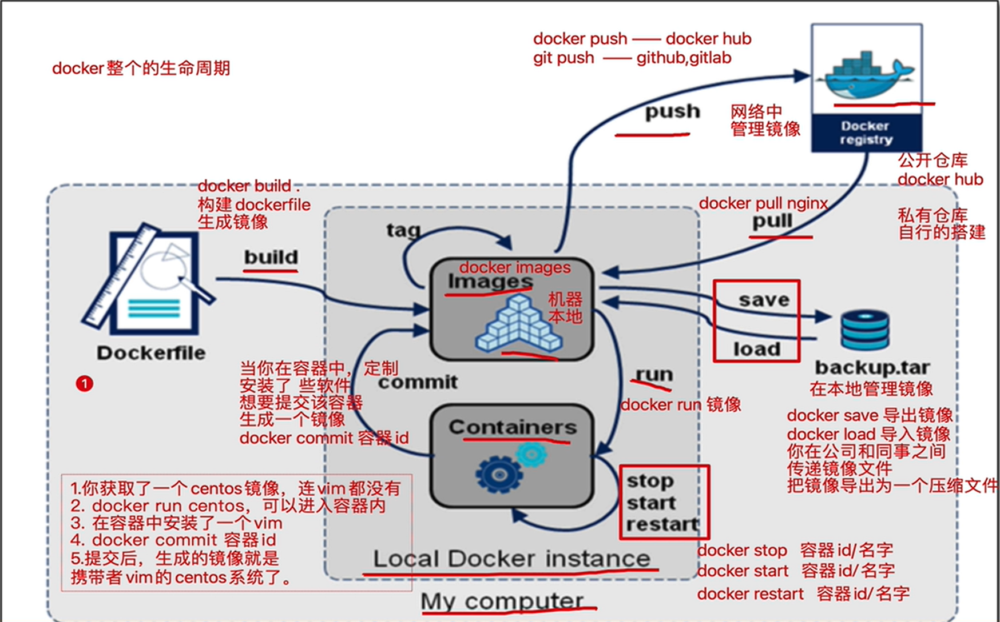

# 一、简介

你是否经历过“我本地运行没问题啊！““哪个哥们有写死循环了““完了，服务器撑不住了“等等问题，docker就是这么帮你解决问题的工具，它可以帮你把web应用自动化打包和发布，在服务型环境下进行部署和调整数据库或其他的后台应用。

**Docker**是一个开源的应用容器引擎；是一个轻量级容器技术；

Docker 支持将软件编译成一个镜像；然后在镜像中各种软件做好配置，将镜像发布出去，其他使用者可以直接使用这个镜像；

运行中的这个镜像称为容器，容器启动是非常快速的。


优点：

隔离性好；


# 二、核心概念

## 核心组件

image镜像：

仓库：

容器：

## 生命周期



## 镜像分层原理

镜像比原本的程序大得多，是一系列可独立运行的软件包，

分层的设计，如果全部都打包会有很多重复的内容依赖，所以 Docker 将粒度分的很细，应用的公共部分就可以重用，称为 Base 镜像，这样抽取的粒度越细，可重用性越高。


主要包括：

Bootfs：主要包含 bootloader 和 Kemel。

rootfs：在 boots 之上，包含的就是典型的 linux 系统中的/dev ,/proc,， /bin，/etc 等标准的目录和文件。rootfs 就是各种不同的操作系统发行版。

不同的 linux 发行版本,他们的 bootfs 是一致的，roofs 会有差别。

docker镜像是不会下载宿主机内核的，只会下载操作系统的发行版；


# 三、安装 Docker

1：https://blog.csdn.net/weixin_39912640/article/details/120391027


**1）、安装 linux 虚拟机**

 1）、VMWare、VirtualBox（安装）；

 2）、导入虚拟机文件 centos7-atguigu.ova；

 3）、双击启动 linux 虚拟机;使用 root/ 123456 登陆

 4）、使用客户端连接 linux 服务器进行命令操作；

 5）、设置虚拟机网络；

 桥接网络===选好网卡====接入网线；

 6）、设置好网络以后使用命令重启虚拟机的网络

```shell
service network restart
```

 7）、查看 linux 的 ip 地址

```shell
ip addr
```

 8）、使用客户端连接 linux；

**2）、在 linux 虚拟机上安装 docker**

步骤：

```shell
1、检查内核版本，必须是3.10及以上
uname -r
2、安装docker
yum install docker
3、输入y确认安装
4、启动docker
[root@localhost ~]# systemctl start docker
[root@localhost ~]# docker -v
Docker version 1.12.6, build 3e8e77d/1.12.6
5、开机启动docker
[root@localhost ~]# systemctl enable docker
Created symlink from /etc/systemd/system/multi-user.target.wants/docker.service to /usr/lib/systemd/system/docker.service.
6、停止docker
systemctl stop docker
```

**3）常见问题**

1：Failed to set locale, defaulting to C.UTF-8

https://www.freesion.com/article/32491172601/

2：Fail to start docker.service : Unit docker.service not fund；

3：打开API服务

https://blog.csdn.net/zuo84526076/article/details/120353935

4：IDEA 冲突

在开始菜单中，找到windows系统，右键点击命令提示符并且选择以管理员身份打开，然后输入此命令暂时关闭hyper-v。

```text
dism.exe /Online /Disable-Feature:Microsoft-Hyper-V
```

接下来需要重新启动系统。

重新启动后，按如下方法操作，在开始菜单中，找到windows系统，右键点击命令提示符并且选择以管理员身份打开，然后分别输入以下命令。

```text
netsh int ipv4 set dynamicport tcp start=49152 num=16383
netsh int ipv4 set dynamicport udp start=49152 num=16383
dism.exe /Online /Enable-Feature:Microsoft-Hyper-V /All
```

这样预留一些端口给Intellij IDEA。


4）配置

镜像存储路径：

```bash
## 查看docker镜像的存储路径
docker info|grep Root
```

镜像文件是一个json格式的数据；


# 四、Docker 常用命令&操作

## 1）、镜像操作

```bash
## 搜索镜像:tag tag指具体的标签版本
docker search nginx

## 拉取下载镜像
docker pull nginx

## 查看本地的docker镜像
docker image ls
docker images
## 查看本地具体某个镜像
docker images nginx

## 删除镜像，要删除的镜像不得有容器依赖
docker rmi 镜像id

## 运行镜像，容器中就跑着服务，会返回容器的ID
##   run 运行 -d 后台运行 -p 端口映射 宿主机端口:容器内端口  nginx 镜像名称
docker run -d -p 80:80 nginx

## 查看正在运行的容器
docker ps

## 停止容器
docker stop 容器ID


## 导出本地镜像
docker image save centos:7.8.2003 > /opt/centos7.8.2003.tgz

## 导入镜像
docker image load -i /opt/centos7.8.2003.tgz

## 查看镜像详细信息
docker info
docker image inspect 镜像id
```


## 2）、容器操作

容器内的进程必须处于前台运行状态，否则容器就会直接退出

```bash
## 查看你所有容器（包括未运行的）
docker ps -a

## 运行镜像并进入容器
docker run -it #参数：-it 可交互终端
docker run -it nginx:latest  /bin/bash

## 退出容器
ctrl+p & ctrl+q

## 进入到正在运行的容器内
docker exec -it 容器ID bash

## -d 后台运行容器 --rm容器退出后自动删除 
docker run -d --rm 

## 停止容器
docker stop 容器ID
## 强制停止容器
docker container  kill  容器名称/id


## 查看日志，实时打印
docker logs -f  容器ID

## 查看最新的5条
docker logs 容器ID|tail -5

##查看容器详细信息
docker container inspect 容器ID

## 查看容器端口转发情况
docker port 容器ID

## 容器的提交 ,提交后的容器可以直接运行
docker commit 容器Id /opt/centos-vim-7.8.2003
```

更多命令参看：https://docs.docker.com/engine/reference/commandline/docker/


几个其他的高级操作

```
docker run --name mysql03 -v /conf/mysql:/etc/mysql/conf.d -e MYSQL_ROOT_PASSWORD=my-secret-pw -d mysql:tag
把主机的/conf/mysql文件夹挂载到 mysqldocker容器的/etc/mysql/conf.d文件夹里面
改mysql的配置文件就只需要把mysql配置文件放在自定义的文件夹下（/conf/mysql）

docker run --name some-mysql -e MYSQL_ROOT_PASSWORD=my-secret-pw -d mysql:tag --character-set-server=utf8mb4 --collation-server=utf8mb4_unicode_ci
指定mysql的一些配置参数
```

# 五、Dockerfile

Dockerfile 是一个包含用于组合映像的命令的文本文档。Docker 通过读取`Dockerfile`中的指令自动生成映像。

编辑好后通过`docker build`命令用于从 Dockerfile 构建映像。可以在`docker build`命令中使用`-f`标志指向文件系统中任何位置的 Dockerfile。

```shell
docker build -f /path/to/a/Dockerfile
```

说明：

Dockerfile 一般分为四部分：基础镜像信息、维护者信息、镜像操作指令和容器启动时执行指令，’#’ 为 Dockerfile 中的注释。

Docker 以从上到下的顺序运行 Dockerfile 的指令。为了指定基本映像，第一条指令必须是FROM。一个声明以`＃`字符开头则被视为注释。可以在 Docker 文件中使用`RUN`，`CMD`，`FROM`，`EXPOSE`，`ENV`等指令。

## 文件说明

from ： 指定基础镜像，必须为第一个命令。

maintainer: 维护者信息

run：构建镜像时执行的命令

```txt
RUN指令创建的中间镜像会被缓存，并会在下次构建中使用。如果不想使用这些缓存镜像，可以在构建时指定--no-cache参数，如：docker build --no-cache
```

Add：将本宿主机文件添加到容器中，tar 类型文件会自动解压，可以访问网络资源，类似于 wget

copy：功能类似 add，但是不会自动解压文件，也不能访问网络资源。支持通配符，保留原文件权限，访问时间等；

```txt
copy my* /tmp/cc?.txt /home
```

cmd：构建容器后调用，也就是在容器启动后要干什么事

```txt
　CMD不同于RUN，CMD用于指定在容器启动时所要执行的命令，而RUN用于指定镜像构建时所要执行的命令。
　## 如 运行centos 后查看版本 相当于进入容器执行docker run -it centos cat /etc/os-release
CMD["cat","/etc/os-release"]
```

entrypoint：配置容器，使其可执行化，当配置了entrypoint之后，CMD的内容就会当做参数传递给ENTRYPOINT指令；

```txt
```


label：用于为镜像添加元数据

```txt
使用LABEL指定元数据时，一条LABEL指定可以指定一或多条元数据，指定多条元数据时不同元数据之间通过空格分隔。推荐将所有的元数据通过一条LABEL指令指定，以免生成过多的中间镜像。
```

实例：

```
LABEL version="1.0" description="这是一个Web服务器" by="Xiao"
```

Env：设置环境变量

expose：制定外界交互的端口

volume：用于制定持久化目录，把容器内的数据映射到宿主机目录上

```
一个卷可以存在于一个或多个容器的指定目录，该目录可以绕过联合文件系统，并具有以下功能：
1 卷可以容器间共享和重用
2 容器并不一定要和其它容器共享卷
3 修改卷后会立即生效
4 对卷的修改不会对镜像产生影响
5 卷会一直存在，直到没有任何容器在使用它
```

workdir：工作目录，类似于 cd 命令

```
　　通过WORKDIR设置工作目录后，Dockerfile中其后的命令RUN、CMD、ENTRYPOINT、ADD、COPY等命令都会在该目录下执行。在使用docker run运行容器时，可以通过-w参数覆盖构建时所设置的工作目录
```

user：指定运行容器时的用户名或 UID，后续的 RUN 也会使用指定用户，使用 USER 指定用户时，可以使用用户名、UID 或 GID，或是两者的组合。当服务不需要管理员权限时，可以通过该命令指定运行用户。并且可以在之前创建所需要的用户。

Arg：用于指定传递给构建运行的变量

onbuild：用于设置镜像触发器

例子：

```properties
# This my first nginx Dockerfile
# Version 1.0

# Base images 基础镜像
FROM centos

#MAINTAINER 维护者信息
MAINTAINER xiaoqc

#ENV 设置环境变量
ENV PATH /usr/local/nginx/sbin:$PATH

#ADD  文件放在当前目录下，拷过去会自动解压
ADD nginx-1.8.0.tar.gz /usr/local/
ADD epel-release-latest-7.noarch.rpm /usr/local/

#RUN 执行以下命令
RUN rpm -ivh /usr/local/epel-release-latest-7.noarch.rpm
RUN yum install -y wget lftp gcc gcc-c++ make openssl-devel pcre-devel pcre && yum clean all
RUN useradd -s /sbin/nologin -M www

#WORKDIR 相当于cd
WORKDIR /usr/local/nginx-1.8.0

RUN ./configure --prefix=/usr/local/nginx --user=www --group=www --with-http_ssl_module --with-pcre && make && make install

RUN echo "daemon off;" >> /etc/nginx.conf

#EXPOSE 映射端口
EXPOSE 80

#CMD 运行以下命令
CMD ["nginx"]
```

# 六：其他

## 工作流程

Docker 使用客户端-服务器架构。Docker 客户端与 Docker 守护进程进行对话，该守护进程完成了构建，运行和分发 Docker 容器的繁重工作。Docker 客户端和守护程序可以在同一系统上运行，也可以将 Docker 客户端连接到远程 Docker 守护程序。Docker 客户端和守护程序在网络接口上使用 REST API 进行通信。

**Docker 守护程序（Docker daemon）**

Docker 守护程序侦听 Docker API 请求并管理 Docker 对象，例如图像，容器，网络和卷。守护程序还可以与其他守护程序通信以管理 Docker 服务。

**Docker 客户端（Client）**

Docker 客户端是 Docker 用户与 Docker 交互的主要方式。当您使用诸如`docker run`之类的命令时，客户端会将这些命令发送到`Docker daemon`，以执行这些命令。Docker 客户端可以与多个守护程序通信。

**Docker 注册中心（Registry）**

Docker 注册中心存储 Docker 镜像。Docker Hub 是任何人都可以使用的公共注册中心（远程/中央仓库），并且 Docker 默认配置为在 Docker Hub 上查找映像。

使用`docker pull`或`docker run`命令时，所需的镜像将从配置的中央仓库中提取。使用`docker push`命令时，会将镜像推送到配置的注册中心。

1：命名空间：命名空间（namespaces）是 Linux 为我们提供的用于分离进程树、网络接口、挂载点以及进程间通信等资源的方法。在日常使用 Linux 或者 macOS 时，我们并没有运行多个完全分离的服务器的需要，但是如果我们在服务器上启动了多个服务，这些服务其实会相互影响的，每一个服务都能看到其他服务的进程，也可以访问宿主机器上的任意文件，这是很多时候我们都不愿意看到的，我们更希望运行在同一台机器上的不同服务能做到完全隔离，就像运行在多台不同的机器上一样。

在这种情况下，一旦服务器上的某一个服务被入侵，那么入侵者就能够访问当前机器上的所有服务和文件，这也是我们不想看到的，而 Docker 其实就通过 Linux 的 Namespaces 对不同的容器实现了隔离。

Linux 的命名空间机制提供了以下七种不同的命名空间，包括 CLONE_NEWCGROUP、CLONE_NEWIPC、CLONE_NEWNET、CLONE_NEWNS、CLONE_NEWPID、CLONE_NEWUSER 和 CLONE_NEWUTS，通过这七个选项我们能在创建新的进程时设置新进程应该在哪些资源上与宿主机器进行隔离。

2：网络：Docker的网络，介绍一种网桥的机制。在这种模式下，除了分配隔离的网络命名空间之外，Docker 还会为所有的容器设置 IP 地址。当 Docker 服务器在主机上启动之后会创建新的虚拟网桥 docker0，随后在该主机上启动的全部服务在默认情况下都与该网桥相连。


docker 主机(Host)：安装了 Docker 程序的机器（Docker 直接安装在操作系统之上）；

docker 客户端(Client)：连接 docker 主机进行操作；

## 网络通信配置

docker 允许通过访问容器或网络互联的方式来提供网络服务。

docker 与宿主机的通信机制：

当 Docker 启动时，会自动在主机上创建一个 docker 虚拟网桥，实际上是 Linux 的一个 bridge，可以理解为一个软件交换机。它会在挂载到它的网口之间进行转发。

当创建一个 Docker 容器的时候，同时会创建了一对 veth pair 接口（当数据包发送到一个接口时，另外一个接口也可以收到相同的数据包)。这对接口一端在容器内，即 eth0 ;另一端在本地并被挂载到 dockere 网桥，名称以 veth 开头(例如 vethAQI20T )。通过这种方式，主机可以跟容器通信，容器之间也可以相互通信。Docker 就创建了在主机和所有容器之间一个虚拟共享网络。

同时，Docker 随机分配一个本地未占用的私有网段(在 RFC1918 中定义)中的一个地址给 docker 接口。比如典型的 172.17.42.1，掩码为 255.255.0.0。此后启动的容器内的网口也会自动分配一个同一网段(172.17.0.0/16 )的地址。

命令

```cmd
docker inspect 容器
```

所有容器都应用到同一个网桥，某些容器因为带宽影响，我们应该根据实际构建网桥。一般使用 docker 网桥实际容器与容器通信时，都是站在一个应用角度进行容器通信。

创建多余的网桥：

查看默认网桥：

```shell
docker network ls
```

创建自定义网桥

```shell
docker network 命令
```

新建网桥，一旦在启动容器时制定了网桥之后，日后可以在任何这个网桥关联的容器中使用容器名字进行与其他容器通信。

删除网桥

```shell
docker network rm 网桥名
```

## 数据卷

实现宿主机与容器之间实现数据共享的一种机制。

特点：

1：可以在容器之间实现共享与重用。

2：对数据卷的修改，会立即影响到容器。

3：数据卷会一直存在，容器删除并不会删除数据卷。

数据卷操作：

1：自定义数据卷目录

docker run -v 绝对路径：容器内路径

2：自动创建数据卷

docker run -v 卷名 容器内路径


## CGroup

docker基于Namespce和Cgroups，其中

- Namespace主要用于隔离资源
- Cgroups用来提供对一组进程以及将来子进程的资源限制

CGroup包含三个组件：

控制组：一个cgroup包含一组进程，并可以在这个cgroup上增加Linux subsystem的各种参数配置。

subsystem子系统：一组资源控制模块，可以通过lssubsys  -啊 命令查看当前内核支持哪些subsystem。subsystem作用于hierarchy的cgroup节点，并控制节点中进程的资源占用。

**hierarchy 层级树** 主要功能是把cgroups串成一个树型结构，使cgruops可以做到继承。也就是说将cgroup通过树状结构串起来，通过虚拟文件系统的方式暴露给用户。

三个组件的关系：

- 系统创建新的hierarchy之后，系统中所有的进程都会加入这个hierarchy的cgroup的根节点，这个cgroup根节点是hierarchy默认创建的，在这个hierarchy中创建的所有cgroup都是这个cgroup根节点的子节点。
- 一个subsystem只能附加到一个hierarchy上
- 一个hierarchy可以附加多个subsystem
- 一个进程可以作为多个cgroup的成员，但是这些cgroup必须在不同的hierarchy下
- 一个进程fork出子进程时，子进程和父进程是在同一个cgroup中的，根据需要也可以移动到其他的cgroup中

使用：

使用Cgroup对程序使用CPU进行限制；

```shell
cat cpu.cfs_periokd_us
cat cpu.,cfs_quota_us
echo 2000> cpu.cfs_quata_us # 20毫秒写入文件
echo 11321 > tasks # 将进程ID写进task文件
# 这样该进程最多使用20%的CPU
```

## Namespce

隔离资源

# IDEA插件

https://juejin.cn/post/7111500936547139614
