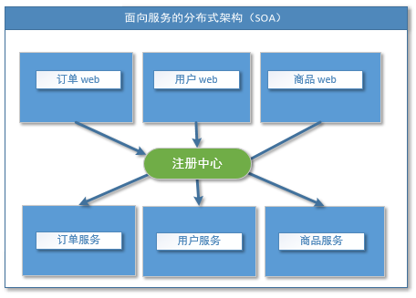

# 概述

架构师的作用：

1：系统建模与架构设计文档写作

领域问题——经过分析，抽象——建立模型——设计，抽象变成——软件系统；

关于系统的指标进行量化，TPS，存储等需要进行文档化，

2：系统性能测试与优化

三个性能指标：响应时间，并发数。吞吐量；

3：故障诊断与分析

监控，日志，经验，基础

4：软件设计模式

写给其他工程师的代码：写更灵活，

5：系统架构模式

分布式：从物理上分离一切；

缓存：CDN，反向代理，分布式缓存

异步：消息与事件驱动

微服务：RPC，DDD

备份：主从备份，主主备份，失效转移

自动化：自动化部署，自动化测试，自动化监控，自动化运维

安全：

# 一：架构模型

（1）结构模型：这是一个最直观、最普遍的建模方法。这种方法以架构的构件、连接件（connector）和其他概念来刻画结构，并力图通过结构来反映系统的重要语义内容，包括系统的配置、约束、隐含的假设条件、风格、性质等。研究结构模型的核心是架构描述语言。

（2）框架模型：框架模型与结构模型类似，但它不太侧重描述结构的细节而更侧重于整体的结构。框架模型主要以一些特殊的问题为目标建立只针对和适应该问题的结构。

（3）动态模型：动态模型是对结构或框架模型的补充，研究系统的“大颗粒”的行为性质。例如，描述系统的重新配置或演化。动态可以指系统总体结构的配置、建立或拆除通信通道或计算的过程。这类系统常是激励型的。

（4）过程模型：过程模型研究构造系统的步骤和过程。因而结构是遵循某些过程脚本的结果。

（5）功能模型：该模型认为架构是由一组功能构件按层次组成，下层向上层提供服务。它可以看作是一种特殊的框架模型。

5种，但各有所长，将它们有机统一起来也许更合适，所以有人提出了“4+1”视图模型： 

**逻辑视图：**逻辑视图关注功能，不仅包括用户可见的功能，还包括为实现用户功能而必须提供的"辅助功能模块"；它们可能是逻辑层、功能模块等。

**开发视图：**开发视图关注程序包，不仅包括要编写的源程序，还包括可以直接使用的第三方SDK和现成框架、类库，以及开发的系统将运行于其上的系统软件或中间件。开发视图和逻辑视图之间可能存在一定的映射关系：比如逻辑层一般会映射到多个程序包等。

**处理视图：**处理视图关注进程、线程、对象等运行时概念，以及相关的并发、同步、通信等问题。处理视图和开发视图的关系：开发视图一般偏重程序包在编译时期的静态依赖关系，而这些程序运行起来之后会表现为对象、线程、进程，处理视图比较关注的正是这些运行时单元的交互问题。
**物理视图：**物理视图关注"目标程序及其依赖的运行库和系统软件"最终如何安装或部署到物理机器，以及如何部署机器和网络来配合软件系统的可靠性、可伸缩性等要求。物理视图和处理视图的关系：处理视图特别关注目标程序的动态执行情况，而物理视图重视目标程序的静态位置问题；物理视图是综合考虑软件系统和整个IT系统相互影响的架构视图。

**场景（scenarios）**：可以看作是那些重要系统活动的抽象，它使四个视图有机联系起来，从某种意义上说场景是最重要的需求抽象。在开发架构时，它可以帮助设计者找到架构的构件和它们之间的作用关系。同时，也可以用场景来分析一个特定的视图，或描述不同视图构件间是如何相互作用的。场景可以用文本表示，也可以用图形表示。

## 发展

单一应用架构

当网站流量很小时，只需一个应用，将所有功能都部署在一起，以减少部署节点和成本。此时，用于简化增删改查工作量的数据访问框架(ORM)是关键。

适用于小型网站，小型管理系统，将所有功能都部署到一个功能里，简单易用。

缺点： 1、性能扩展比较难

2、协同开发问题

3、不利于升级维护

垂直应用架构

当访问量逐渐增大，单一应用增加机器带来的加速度越来越小，将应用拆成互不相干的几个应用，以提升效率。此时，用于加速前端页面开发的 Web 框架(MVC)是关键。

通过切分业务来实现各个模块独立部署，降低了维护和部署的难度，团队各司其职更易管理，性能扩展也更方便，更有针对性。

缺点： 公用模块无法重复利用，开发性的浪费，应用直接无法交互。前后端耦合在一起。

分布式服务架构

当垂直应用越来越多，应用之间交互不可避免，将核心业务抽取出来，作为独立的服务，逐渐形成稳定的服务中心，使前端应用能更快速的响应多变的市场需求。此时，用于提高业务复用及整合的分布式服务框架(RPC)是关键。

流动计算架构

当服务越来越多，容量的评估，小服务资源的浪费等问题逐渐显现，此时需增加一个调度中心基于访问压力实时管理集群容量，提高集群利用率。此时，用于提高机器利用率的资源调度和治理中心(SOA)[Service Oriented Architecture]是关键。

当某个服务压力大了，就少些请求，可以动态处理。

# 二：架构需求与软件质量属性

# 三：软件架构风格

架构设计的一个核心问题是能能否达到架构级的软件复用

架构风格反映了领域中众多系统所共有的结构和语义特性，并指导如何将各个构件有效地组织成一个完成的系统

软件架构风格是描述某一特定应用领域中系统组织方式的惯用模式（idiomatic paradigm）。

## SOA架构

服务是一种为了满足某项业务需求的操作，规则等的逻辑组合，它包含一系列有序活动的交互，为实现用户目标提供支持。

基于服务的架构（SOA）到实现方式：

## 特定领域软件架构

# 分布式

参考[分布式系统](../21：分布式/分布式系统.md)

## 概述

解决单个物理服务器容量和性能瓶颈问题而采用的优化手段，将一个业务拆分成不同的子业务，分布在不同的机器上执行。服务之间通过远程调用协同工作，对外提供服务。

该领域需要解决的问题极多，在不同的技术层面上，又包括：分布式缓存、分布式数据库、分布式计算、分布式文件系统等，一些技术如 MQ、Redis、zookeeper 等都跟分布式有关。

分布式两种形式：

**水平扩展**：当一台机器扛不住流量时，就通过添加机器的方式，将流量平分到所有服务器上，所有机器都可以提供 相同的服务；

**垂直拆分**：前端有多种查询需求时，一台机器扛不住，可以将不同的业务需求分发到不同的机器上，比如 A 机器处理余票查询的请求，B 机器处理支付的请求。

## 集群

在多台不同的服务器中部署相同应用或服务模块，构成一个集群，通过负载均衡设备对外提供服务。

特点

**可扩展性**：集群中的服务节点，可以动态的添加机器，从而增加集群的处理能力。

**高可用性**：如果集群某个节点发生故障，这台节点上面运行的服务，可以被其他服务节点接管，从而增强集群的高可用性。

两大能力

**负载均衡**：负载均衡能把任务比较均衡地分布到集群环境下的计算和网络资源。

**集群容错**：当我们的系统中用到集群环境，因为各种原因在集群调用失败时，集群容错起到关键性的作用。

## 微服务

很小的服务，小到一个服务只对应一个单一的功能，只做一件事。这个服务可以单独部署运行，服务之间通过远程调用协同工作，每个微服务都是由独立的小团队开发，测试，部署，上线，负责它的整个生命周期。

## 分布式设计理念

### 目标：

目标是提升系统的整体性能和吞吐量另外还要尽量保证分布式系统的容错性（假如增加 10 台服务器才达到单机运行效果 2 倍左右的性能，那么这个分布式系统就根本没有存在的意义）。

即使采用了分布式系统，我们也要尽力运用并发编程、高性能网络框架等等手段提升单机上的程序性能。

### 两大思路：

**中心化设计**

“领导”通常负责分发任务并监督“干活的”，发现谁太闲了，就想发设法地给其安排新任务，确保没有一个“干活的”能够偷懒，如果“领导”发现某个“干活的”因为劳累过度而病倒了，则是不会考虑先尝试“医治”他的，而是一脚踢出去，然后把他的任务分给其他人。其中微服务架构 **Kubernetes** 就恰好采用了这一设计思路。

问题：

效率什么全部在于领导

解决办法：

大多数中心化系统都采用了主备两个“领导”的设计方案，可以是热备或者冷备，也可以是自动切换或者手动切换，而且越来越多的新系统都开始具备自动选举切换“领导”的能力，以提升系统的可用性。

**去中心化设计**

“去中心化”不是不要中心，而是由节点来自由选择中心。集群的成员会自发的举行“会议”选举新的“领导”主持工作。

问题：

脑裂问题：指一个集群由于网络的故障，被分为至少两个彼此无法通信的单独集群，此时如果两个集群都各自工作，则可能会产生严重的数据冲突和错误。一般的设计思路是，当集群判断发生了脑裂问题时，规模较小的集群就“自杀”或者拒绝服务。

# 系统设计指标

## 一、性能

### 性能指标

#### 1. 响应时间

指某个请求从发出到接收到响应消耗的时间。

在对响应时间进行测试时，通常采用重复请求的方式，然后计算平均响应时间。

#### 2. 吞吐量

指系统在单位时间内可以处理的请求数量，通常使用每秒的请求数来衡量。

#### 3. 并发用户数

指系统能同时处理的并发用户请求数量。

在没有并发存在的系统中，请求被顺序执行，此时响应时间为吞吐量的倒数。例如系统支持的吞吐量为 100 req/s，那么平均响应时间应该为 0.01s。

目前的大型系统都支持多线程来处理并发请求，多线程能够提高吞吐量以及缩短响应时间，主要有两个原因：

- 多 CPU
- IO 等待时间

使用 IO 多路复用等方式，系统在等待一个 IO 操作完成的这段时间内不需要被阻塞，可以去处理其它请求。通过将这个等待时间利用起来，使得 CPU 利用率大大提高。

并发用户数不是越高越好，因为如果并发用户数太高，系统来不及处理这么多的请求，会使得过多的请求需要等待，那么响应时间就会大大提高。

### 性能优化

#### 1. 集群

将多台服务器组成集群，使用负载均衡将请求转发到集群中，避免单一服务器的负载压力过大导致性能降低。

#### 2. 缓存

缓存能够提高性能的原因如下：

- 缓存数据通常位于内存等介质中，这种介质对于读操作特别快；
- 缓存数据可以位于靠近用户的地理位置上；
- 可以将计算结果进行缓存，从而避免重复计算。

#### 3. 异步

某些流程可以将操作转换为消息，将消息发送到消息队列之后立即返回，之后这个操作会被异步处理。

## 二、伸缩性

指不断向集群中添加服务器来缓解不断上升的用户并发访问压力和不断增长的数据存储需求。

### 伸缩性与性能

如果系统存在性能问题，那么单个用户的请求总是很慢的；

如果系统存在伸缩性问题，那么单个用户的请求可能会很快，但是在并发数很高的情况下系统会很慢。

### 实现伸缩性

应用服务器只要不具有状态，那么就可以很容易地通过负载均衡器向集群中添加新的服务器。

关系型数据库的伸缩性通过 Sharding 来实现，将数据按一定的规则分布到不同的节点上，从而解决单台存储服务器的存储空间限制。

对于非关系型数据库，它们天生就是为海量数据而诞生，对伸缩性的支持特别好。

## 三、扩展性

指的是添加新功能时对现有系统的其它应用无影响，这就要求不同应用具备低耦合的特点。

实现可扩展主要有两种方式：

- 使用消息队列进行解耦，应用之间通过消息传递进行通信；
- 使用分布式服务将业务和可复用的服务分离开来，业务使用分布式服务框架调用可复用的服务。新增的产品可以通过调用可复用的服务来实现业务逻辑，对其它产品没有影响。

## 四、可用性

高可用相当于保险，成本高，但是公司不仅花钱买到了一堆资产，还买到了安全感，更买到了用户对公司无价的信任，只要规划在合理范围内，这笔买卖的性价比就非常高。

### 设计要素

#### 冗余

保证高可用的主要手段是使用冗余，当某个服务器故障时就请求其它服务器。

应用服务器的冗余比较容易实现，只要保证应用服务器不具有状态，那么某个应用服务器故障时，负载均衡器将该应用服务器原先的用户请求转发到另一个应用服务器上，不会对用户有任何影响。

存储服务器的冗余需要使用主从复制来实现，当主服务器故障时，需要提升从服务器为主服务器，这个过程称为切换。

#### 监控

对 CPU、内存、磁盘、网络等系统负载信息进行监控，当某个信息达到一定阈值时通知运维人员，从而在系统发生故障之前及时发现问题。

#### 故障转移

一种手动或者自动机制，如果监控显示活动组件发生故障，该机制可以从当前活动的组件切换到冗余组件

### 服务降级

服务降级是系统为了应对大量的请求，主动关闭部分功能，从而保证核心功能可用。

常见的可用性评价指标：

MTBF：平均故障间隔时间

MTTR：平均恢复前时间

MTTF：修复前平均时间

SA：同时可用此公式计算：SA = MTBF/(MTBF + MTTR)

RPO：恢复点目标

RTO：恢复时间目标

容错，高可用，灾难恢复的区别？

答：

容错指系统运行过程中，即使某部分单元故障，也可以继续运行。

高可用指系统在故障发生时可以用极少的时间恢复业务运行，需要的中断时间越短高可用性等级越高，其关键在“快速”的恢复能力。

灾难恢复指当灾难发生时，可以切换业务、数据到其它地域进行恢复，关键在通过“切换”实现恢复，这里注意灾难恢复不是为了挽救基础设施，而是为了挽救业务或数据。

检测：

全链路故障演练

## 五、安全性

要求系统在应对各种攻击手段时能够有可靠的应对措施。

## 高内聚低耦合

主要是面向对象的设计，看类的内聚性是否高，耦合度是否低。

内聚关注模块内部的元素的结合程度，耦合关注模块之间的依赖程度

好处：体现在系统持续发展的过程中，高内聚，低耦合的系统具有更好的重用性，维护性，扩展性，可以高效的完成系统的维护开发，持续的支持业务的发展。

高内聚，同一模块内的东西尽可能的可重用，函数化。低耦合，多个模块间尽可能少依赖。

### 内聚

模块的功能强度的度量，若一个模块内的各元素联系越紧密，则它的内聚性越高。内聚有如下的种类，它们之间的内聚度由弱到强排列如下：

一：偶然内聚：个模块内的各处理元素之间没有任何联系，只是偶然地被凑到一起。这种模块也称为巧合内聚，内聚程度最低。

二：逻辑内聚：这种模块把几种相关的功能组合在一起， 每次被调用时，由传送给模块参数来确定该模块应完成哪一种功能 。

三：时间内聚：把需要同时执行的动作组合在一起形成的模块称为时间内聚模块

四：过程内聚：构件或者操作的组合方式，允许在调用前面的构件或操作之后，马上调用后面的构件或操作。

五：通信内聚：指模块内各个组成部分都使用相同的数据结构或产生相同的数据结构。

六：顺序内聚：一个模块中各个处理元素和同一功能密切相关。

七：功能内聚

### 耦合

一、 内容耦合：一个模块直接访问另一模块的内容，则称这两个模块为内容耦合。

二、公共耦合：一组模块都访问同一个全局数据结构，则称之为公共耦合。

三、外部耦合：一组模块都访问同一全局简单变量，而且不通过参数表传递该全局变量的信息，则称之为外部耦合。

四、控制耦合：模块之间传递的不是数据信息，而是控制信息例如标志、开关量等，一个模块控制了另一个模块的功能。

五、标记耦合：调用模块和被调用模块之间传递数据结构而不是简单数据，同时也称作特征耦合。表就和的模块间传递的不是简单变量，而是像高级语言中的数据名、记录名和文件名等数据结果，这些名字即为标记，其实传递的是地址。

六、数据耦合：调用模块和被调用模块之间只传递简单的数据项参数。相当于高级语言中的值传递。

七、非直接耦合：两个模块之间没有直接关系，它们之间的联系完全是通过主模块的控制和调用来实现的。耦合度最弱，模块独立性最强