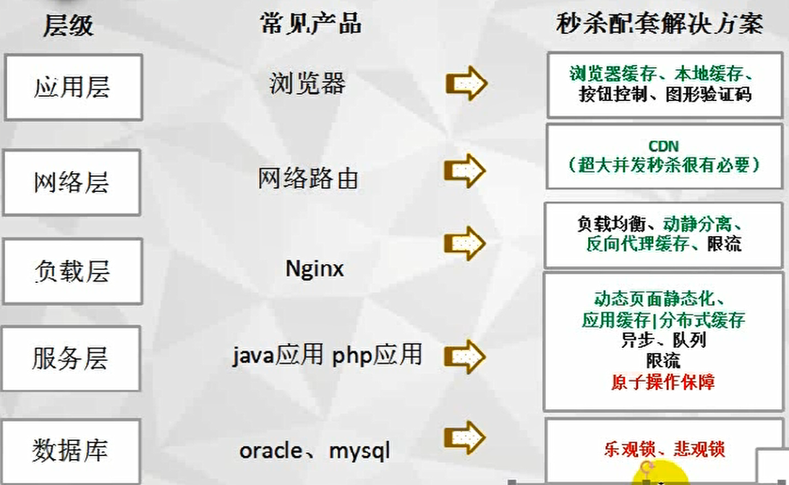

# 情景：

使用场景？流程？输入输出？

约束？


4S分析法：

场景：具体场景，实际需求，详细流程，QPS

服务：将大系统拆分为小系统

存储：数据如何存储

升级：处理可能遇到的问题；


## 可能的问题：

瞬时大流量高并发：

有限库存，不能超卖：

黄牛恶意请求：

固定时间开启：

严格限购：


- 服务端：导致站点服务器、DB服务器资源被占满崩溃。数据的存储和更新结果和理想的设计不一致。
- 用户角度：尼玛，网站这么卡，刷新了还这样，垃圾网站，不玩了

资源冲突：

原子操作——数据库锁，分布式锁；




并发估算怎么算？

平均并发用户数：


## 分析

### 阻碍服务器速度的原因

1：事务行级锁的等待


**解决方案思路**

业界有一系列的解决方案，通过不同维度来提升系统的性能与稳定性，包括动静分离，异步处理，令牌队列，多级缓存，作弊行为规范，流量防护，全链路压测等；


主要解决的就是并发读和并发写的问题。对应到架构设计，就是高可用、一致性和高性能的要求

思路：

高并发：

1：限流，请求限制

2：负载均衡

3：缓存

4：异步

5：队列


# 高性能

Nginx 加载页面数据，减少 QPS

加载图片，可以将几个图片合并成一个，利用偏移量进行展示。减少 QPS。

但是这种静态资源一般都放在 CDN 上。

APP 和 WEB

TPS：

瓜子二手车为例：峰值达到 1 千，平时也就 200 到 300 左右。

如果每秒的处理时间跟不上来的请求，就会导致请求积压，导致很多请求超时，用户体验不好，必须进行限流。

最严重的需要考虑的：网络抖动。

如何支撑高并发，如何抵抗高 IOPS？

## 缓存

缓存：热点

读写分离

## 热点

JVM

# 高一致

可能会出现一致性问题：可以采用预扣库存，下单后一般都有个 “有效付款时间”，超过该时间订单自动释放，这就是典型的预扣库存方案

超卖问题：

1：直接update判定,库存大于0的；

```sql
update …… where stock>0
```

2：减少锁，使用Redis，用CAS方法；


1：分布式事务：强一致性

2：消息队列

一是在通过事务来判断，即保证减后库存不能为负，否则就回滚；

二是直接设置数据库字段类型为无符号整数，这样一旦库存为负就会在执行 SQL 时报错；

三是使用 CASE WHEN 判断语句：

例如预扣的库存超时后如何进行回补，再比如第三方支付如何保证减库存和付款时的状态一致性

高并发写

高并发写的优化方式，一种是更换 DB 选型，

Redis 加锁设置过期时间


# 高可用

## 流量削峰

### 答题

### 消息队列

### 过滤

1：区分有效无效请求，防刷防作弊

前端会对客户点击抢购按钮的频率作限制，正常情况下不会出现某客户请求频率过高的情况；客户的登录请求在 nginx 进行反向代理时会经过 lua 脚本的处理，对于请求过于频繁的可疑 ip 进行一段时间的封禁处理，拒绝其请求；

抢购过程中，对于频率过高的用户请求，会被认为是作弊，返回失败结果，强制其下线。

设计：区分有效请求和无效请求。

2：限流

服务降级熔断，

限流，

拒绝策略（当 CPU 负载达到 90%）时，直接拒绝）主备动静分离，流量削峰，热点数据进行缓存预热做集群，

异步：以秒杀为例，客户抢购成功立即返回，之后通过消息队列，异步处理后续步骤。从而缓解服务器的峰值压力。

分流：通过集群进行部署服务器

常见的应对措施有缓存，限流和降级。缓存可以有效缓解服务器的压力，增大系统处理能力，加快请求响应速度，几乎是高并发服务器系统的标配；

限流是通过减少请求频率来减轻服务器压力；

降级的意思是把不重要的服务暂时关闭，节省服务器资源，从而保证核心服务的正常运行，降级首要考虑的问题是区分核心服务与非核心服务，分辨哪些服务可以降级，哪些不能降级。核心服务如写库、下单、支付等是不能降级的，在高并发的情形下需要考虑应对措施保证其可用。

另外，新的削峰手段也层出不穷，以业务切入居多，比如零点大促时同步发放优惠券或发起抽奖活动，将一部分流量分散到其他系统，这样也能起到削峰的作用。

公平性？

https://segmentfault.com/a/1190000021051028?utm_source=tag-newest

要想优雅的处理高并发问题，需要进行全面的考量，包括但不限于：网络请求，服务器性能，IO 瓶颈；

## 限流

秒杀为例：多次限流，尽早限流

### 合法性的限流

合法性限流指的是仅仅限制那些合法的用户请求能够抵达到秒杀服务器，而将一些非法的请求全部进行拦截掉。在请求合法性限流以前，就得先知道哪些请求是合法的，哪些是非法的。

1：验证码方式，区分人机，还能延时削峰

2：通过 IP，网络监测某 IP 下单频率为毫秒级，或者反复购买同一商品，加入黑名单。

3：隐藏秒杀入口地址，在秒杀开始之前，服务器并不会向外界暴露秒杀服务的地址，当秒杀服务开始之后才开放地址。

### 负载限流：

1：基于软件实现限流

- nginx 进行集群分流
- 网络模型其他层进行负载：端口号负载（LVS），IP 负载，MAC 负载


2：基于硬件实现限流

- F5

### 服务限流：

1：Tomact 最大链接数，我们可以设置单 Tomcat 的最大链接数只为 300，那如果超过 300 的链接请求就会被 Tomcat 的无条件拒绝，那这样就可以保证谈不开的稳定性了。

### 算法实现限流：

令牌桶算法、漏洞算法

### 消息队列实现限流：

消息队列可当做一个缓冲区，各个子系统服务可以根据自己本身性能，分别取消息队列中针对性来去特定数量的请求进行处理。

### 缓存限流：

限流的本质是为了不断地削减请求的数量，而缓存的作用是为了减少用户请求服务端的数量，因此缓存也可以作为限流的一种实现方案。

1：静态缓存限流：将前端代码图片或音频缓存到浏览器，Nginx 或则 CDN 中，减少 QPS

2：动态缓存：Redis 缓存也可以减少

### 监控的限流：

知道 CPU、内存、并发量等都是衡量系统稳定性的重要指标，如果他们的使用频率过高，也可能造成系统的不稳定。

### 程序限流

限购：

userID放到Redis；


## 集群负载均衡

**Nginx 负载均衡**：Nginx 可以支持 10W 的并发访问，而应用服务器却达不到这个水准，tomcat 一般支持 1W 的并发访问就很好了。Nginx 支持配置请求的代理策略，把请求路由到多个 Web 服务器处理。Nginx 支持的负载均衡策略包括：轮询，权重，ip_hash，fair，url_hash 等。

**分布式架构的负载策略**：Web 层调用 service，以及 service 之间的调用，每个 service 都需要部署多份。目前最常用的两个框架技术，spring cloud 和 dubbo，都采用客户端负载均衡策略，路由到 service 的不同实例。

**Redis 负载**：redis 是内存的缓存结构，非常高效，瓶颈在于网络 IO，支持几十万的 QPS。redis 分流，可考虑分片的设计，把数据分配到多台服务器上，减轻每台机器的负载。一般情况下，分片策略多用户 redis 数据扩容方案。

**Mysql 读写分离**：对写请求，不适合做分流，因为分流后的数据同步是大问题，导致数据不一致。对于写请求，一般采用读写分离的策略，并且可以多台读库。读库应用 MyIsam 引擎，单独设置合适的索引，提高读性能。从库并不是越多越好，因为从库越多，数据延迟越严重，要保持好平衡。

## 兜底 PlanB

当一个系统面临持续的高峰流量时，其实是很难单靠自身调整来恢复状态的，日常运维没有人能够预估所有情况，意外总是无法避免。尤其在秒杀这一场景下，为了保证系统的高可用，必须设计一个 Plan B 方案来进行兜底。

# 设计

## 拆分：

1：水平拆分：

按照功能模块进行区分

2：垂直拆分：

每个子系统功能相同，只是通过算法吧大量请求合理分配。

项目后端服务集群部署，客户端请求经过多层负载均衡，均匀地分散到各个应用服务器，各服务器共同分担计算力

## 缓存设计：

预热：

问题：缓存一致性，缓存穿透，缓存雪崩，缓存击穿问题

## DB 设计：

使用分表或者分库技术

优化 SQL，建立索引

读写分离技术

哪些需要分库分表，哪些不需要分库分表，单库单表跟分库分表如何 join，哪些数据要放到缓存里去啊，放哪些数据再可以抗掉高并发的请求，你需要完成对一个复杂业务系统的分析之后，然后逐步逐步的加入高并发的系统架构的改造，这个过程是务必复杂的，一旦做过一次，一旦做好了，
