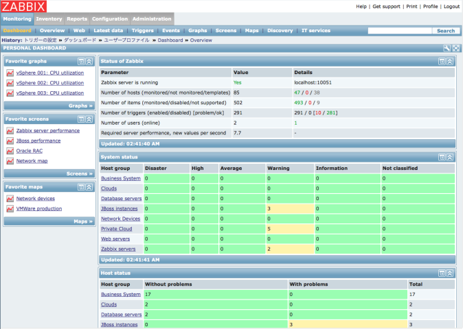

监控定义：

通过技术手段发现服务异常，持续优化业务可用性与用户体验。这句话的关键词是 **发现持续优化可用性与体验**。

监控的方式

主动：程序内部埋点，服务主动上报自身的运行情况，一般都是具化为业务的各个属性或者指标，这种方式准、快，灵活性好，指标丰富。但是在非标准框架下会有一定的代码改造成本。

被动：无需埋点，从外部探测或获取服务的运行情况，例如ping探测、日志采集分析等等。

旁路：与程序逻辑无关，对服务质量与口碑的监控，例如舆情分析。

监控的类型

从大的对象范畴与层级关系来说，监控一般分为五种类型

基础监控：这里的基础监控囊括范围比较广主要指IAAS层(服务器、系统、网络等)

服务端监控：一般指后台服务，例如QQ的后台消息服务

客户端监控：一般指app，手Q的客户端与微信的客户端。

WEB监控：一般指网站，例如对网站域名的拨测。

用户端监控：一般指用户舆情监控，例如某个APP的口碑好坏

监控的本质

在DevOps中，运维、开发、测试这三个角色应该视角统一，这里为什么说要视角统一，就是大家在监控这个层面关注的点应该是一致的，而不是你关注你的点，我关注我的点。例如所有的业务监控都可以抽象出三个核心指标：请求量、成功率、耗时。这三个关键指标来判断我们服务的可靠性，通过可靠性可以推算出可用性，并且可以间接反映用户使用我们产品的的体验。例如如果服务的可靠性不好，那么用户的产品体验肯定不会好。

常见云运维监控工具：

1：Zabbix

使用最广的监控软件；

2：Nagios

功能主要监控服务和主机，代码的监控告警可以由相关插件完成；

3：Ganlia

集群监控

4：Zenoss

 Zenoss比较出色的地方在于它的Dashboard，可以配置很多portlet

 每个用户的界面都是分开管理的，自定义dashboard不会影响其他用户

5：Open-falcon

小米的；

6：阿里云监控

7：百度云监控

8：TICK(telegraf + influxdb + chronograf + kapacitor)架构

influxdb时间序列数据库

telegraf数据收集器

collector业务数据收集器

kapacitor报警器

grafana数据可视化界面

chronograf可视化界面

9：ELK日志监控

