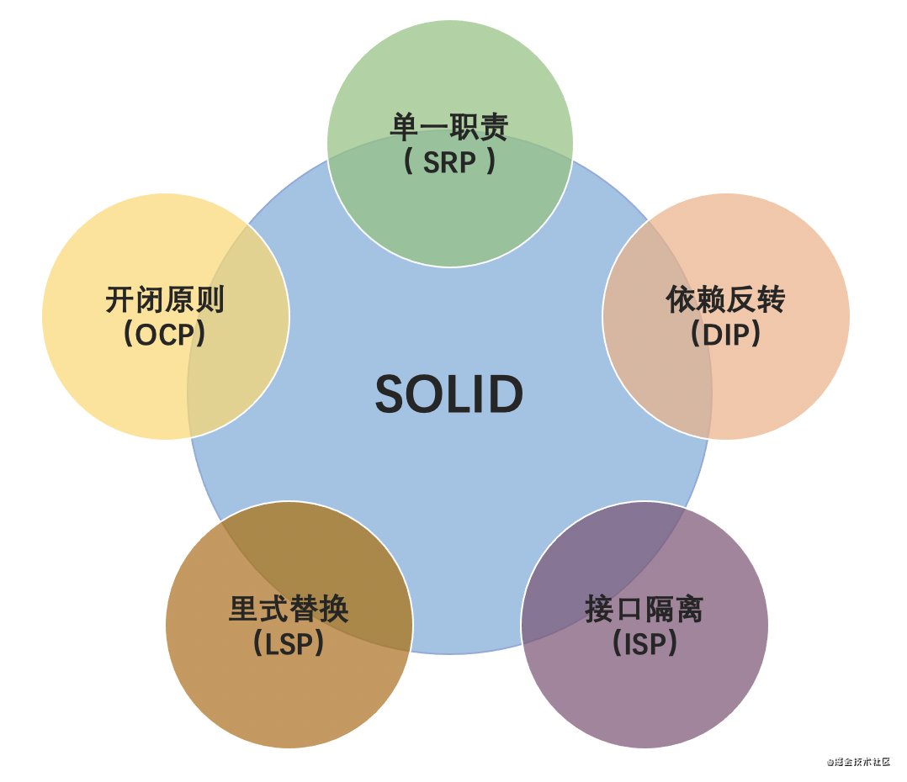

代码堆砌式编程

缺乏有效代码质量监督机制

必须通过不断的重构代码

大型重构：对顶层代码设计的重构，包括：系统，模块，代码结构，类与类之间的关系等。

重构的手段有：分层、模块化、解耦、抽象可复用组件等等。

这类重构涉及的代码改动会比较多，影响面会比较大，所以难度也较大，耗时会比较长，引入 bug 的风险也会相对比较大。

小型重构：对代码细节的重构，

好处：

1：可以将混乱的，不正确或重复的代码转换成整洁的代码；

2：解决开发的标准化问题

3：提高可读性便于维护

# 如何重构

SOLID 原则：



设计模式：

代码分层：

1：提炼方法

2：多台代替冗长的条件判断

## 面临问题

1：开发需求与代码重构的并行进度安排

2：项目开发文档的完善程度：很大一部分原因是因为文档不够全面，代码重构起来较为迷惑；

3：高管对重构的支持，重构代码花费的成本高管是否愿意

### 代码风格

整洁；

统一；

流行；

便捷；

### 注释要求

1：禁止废话是注释

```java
/**
* 该算法不如某某算法优秀，可以优化，，时间太紧，以后再说
*/
```

这种的目的是啥？可以写个 TODO 标记，

2：大家都懂的一些东西就没有必要，大家都不是代码白痴；

3：禁止大块注释代码

4：专为 JavaDoc 编写的注释

法律版权；解释意图；警示性注释；

5：TODO 注释

## 1：静态常量优化

2：魔法值优化：

所谓魔法值，是指在代码中直接出现的数值，但是这些数值可能没有明确是什么意思，或者距离对应的太远，可读性不好；

可以固定静态常量：

```java
static final int LENGTH_OF_ARRAY= 20;
```

3：太多，可以组合使用代码质量管理平台进行规范；

Sonar 或阿里巴巴规范

建议：

不要

## 格式化统一

https://www.cnblogs.com/lsysy/p/9954785.html

## 性能优化

望闻问切

望：观察性能问题，是不可重现的偶发问题还是可重现的性能问题；

闻：

问：技术人员和用户一起看重现步骤等，使用频率等；

切：

### 定义性能衡量标准：

比如一个请求在 2 秒内响应对技术人员来说已经非常快了，但是对业务人员需要在 0.5 秒就要看到结果，就会出现衡量的偏差；

性能优化的副作用就是倒是代码的可读性差，可扩展性降低；

比如一个简单的乘法计算

```java
int i = 100* 16;
//为提高性能就要写成，并加上注释
//把100扩大16倍
int i= 100<< 4;
```

定义优化目标：一个好的性能衡量标准应该包括以下 KPI；

1：核心业务的响应时间：

2：重要业务的响应时间：

### 解决首要的性能问题

### 调整 JVM 参数

1：调整堆内存大小：

调整的太小会导致频繁的发生 FULLGC；调整的太大一是导致浪费资源，而是产生系统不稳定的情况；

2：调整堆内存各分区的比例

分区原理：参考别的

3：变更 GC 的垃圾回收策略

4：更换 JVM：主流的产品有 Java HotSpot VM;Oracle JRockit JVM;IBM JVM 等；

5：指针压缩

### 以技术员自律

熟悉工具；坚持编码；编码前思考；坚持重构；多写文档；做好备份；不要拷贝，避免重复造轮子；
