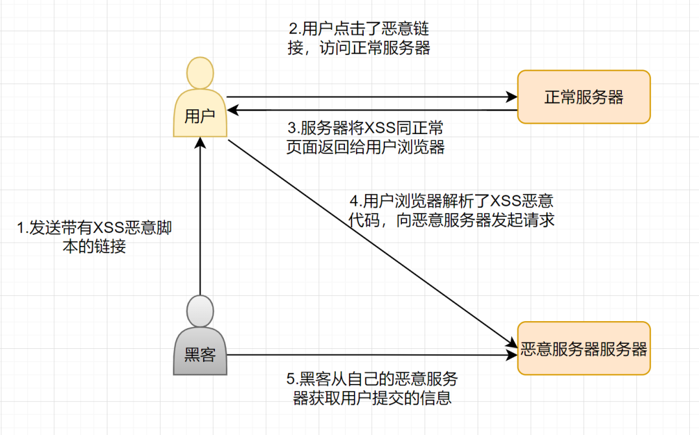
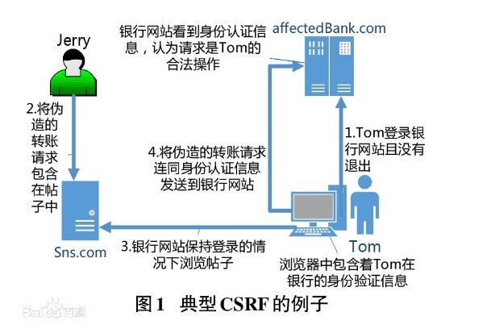

# 常见问题

## 1：删库比特币勒索

公司一个客户的自建环境，堡垒机问题，被人家入侵后数据库删的干干净净，只留个个打钱账号；运维老大说要是打了真能恢复钱还不算多，就怕他们不讲武德，最后还是联系Oracle厂商恢复的数据；这要是用的其他的数据库还真没法搞；

## 1：SQL注入

1：使用#{}而不是${}：

因为`#{}`是一个参数占位符，对于字符串类型，会自动加上""，其他类型不加。由于Mybatis采用**预编译**，其后的参数不会再进行SQL编译，所以一定程度上防止SQL注入。

`${}`是一个简单的字符串替换，字符串是什么，就会解析成什么，存在SQL注入风险

2：不要暴露一些不必要的日志，如果SQL发生异常，不要暴露给客户，可以自定义异常进行相应。

3：不相信任何外部输入参数，过滤参数中含有的一些数据库关键词。

4：适当性权限控制

## 2：JSON反序列化漏洞

比如fastjson1,2,24的一个漏洞，

如何解决json反序列化漏洞问题

- 可以升级版本，比如fastjson后面版本，增强AutoType打开时的安全性 fastjson，增加了AutoType黑名单等等，都是为了应对这些安全漏洞。
- 反序列化有fastjson、gson、jackson等等类型，可以替换其他类型。
- 升级+打开safemode

## 3：XSS攻击

XSS 攻击全称跨站脚本攻击（Cross-Site Scripting），这会与层叠样式表(Cascading Style Sheets, CSS)的缩写混淆，因此有人将跨站脚本攻击缩写为XSS。它指的是恶意攻击者往Web页面里插入恶意html代码，当用户浏览该页之时，嵌入其中Web里面的html代码会被执行，从而达到恶意攻击用户的特殊目的。XSS攻击一般分三种类型：存储型 、反射型 、DOM型XSS

如何攻击？

如何解决XSS攻击：

- 不相信用户的输入，对输入进行过滤，过滤标签等，只允许合法值。
- HTML 转义
- 对于链接跳转，如`<a href="xxx"` 等，要校验内容，禁止以script开头的非法链接。
- 限制输入长度等等

### 防攻击

AntiSamy：

 

## 4：CSRF攻击

CSRF，跨站请求伪造，攻击者盗用了你的身份，以你的名义发送恶意请求。

 如何解决CSRF攻击

- 检查Referer字段。HTTP头中有一个Referer字段，这个字段用以标明请求来源于哪个地址。
- 添加校验token。

## 5：文件上传下载漏洞

文件上传漏洞是指用户上传了一个可执行的脚本文件，并通过此脚本文件获得了执行服务器端命令的能力。常见场景是web服务器允许用户上传图片或者普通文本文件保存，而用户绕过上传机制上传恶意代码并执行从而控制服务器。

**解决办法**一般就是：

- 限制服务器相关文件目录的权限
- 校验上传的文件，如后缀名 禁止上传恶意代码的文件
- 尽量禁止使用前端上传的文件名

文件下载漏洞

文件下载漏洞，举个例子，使用 .. 等字符，使应用读取到指定目录之外的其他目录中的文件内容，从而可能读取到服务器的其他相关重要信息。

## 6：敏感数据泄露

## 7：DDOS攻击

一般来说是指攻击者对目标网站在较短的时间内发起大量请求，大规模消耗目标网站的主机资源，让它无法正常服务。

解决：

- **高防服务器**，即能独立硬防御 50Gbps 以上的服务器，能够帮助网站拒绝服务攻击，定期扫描网络主节点等
- **黑名单**
- **DDoS 清洗**
- **CDN 加速**

## 8：框架的漏洞

# 常见方案

1：filter过滤无效客户的请求；

2：异常禁止直接抛出；

