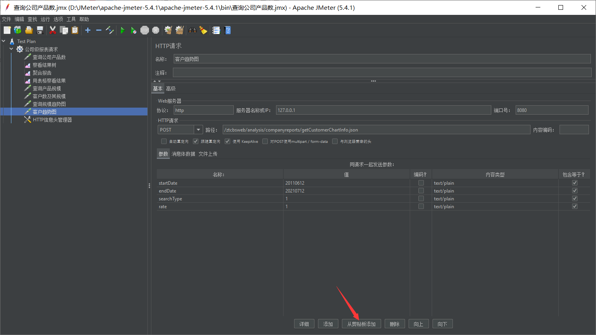
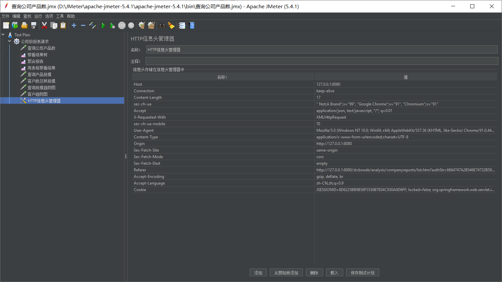
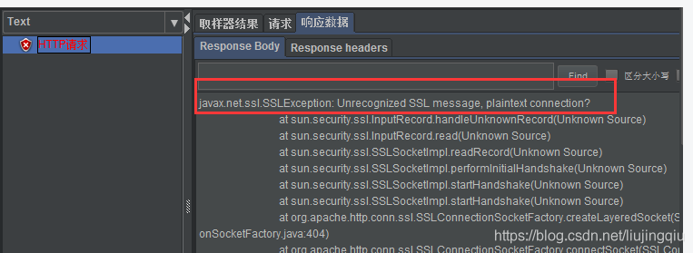

# JMeter

一位测试方面的大佬博客

https://www.cnblogs.com/liulinghua90/category/714144.html

基于Java的压力测试工具

## 一：下载安装

官网：http://jmeter.apache.org/download_jmeter.cgi

下载zip包，

解压，点击进入bin文件夹，双击jmeter.bat文件，会启动JMeter GUI工具

选择Options --> Choose Language --> Chinese(Simplified)，设置语言为中文简体

## 二：接口使用

1.选择TestPlan，右键-->添加-->线程-->线程组

2..线程组内容


a.线程组名称，可修改

b.取样器错误后执行的操作，可修改

c.线程数，即为并发请求数量，可修改

d.ramp-UI时间，即为几秒内开启全部线程，可修改

3.选择线程组，

右键——添加——配置原件——HTTP请求默认值：这里配置后其他请求就不用再配置了； 

右键-->添加-->取样器-->HTTP请求



参数和消息体数据只能选一个

Web服务器信息，网络协议、域名或IP、端口号，可自行修改

接口请求：请求方式、请求路径、编码格式，可自行修改

参数传递：消息体数据存储JSON信息

4.选择线程组，右键-->添加-->配置元件-->HTTP信息头管理器




自定义变量模拟多用户

CVS Data Set Config：


JMeter命令行使用：

在windows上录好jmx；

```shell
sh jmeter.sh -n -t XXX.jmt -l result.jtl
```

把result.jtl 导入到jmeter


redis压测工具：redis-benchmark

```shell
## 模拟100个并发100000 个请求
redis-benchmark -h 127.0.0.1 -p 6379 -c 100 -n 10000

redis-benchmark -t set,lpush -q -n 10
```


## 三：结果查看

选择线程组，右键-->添加-->监听器-->查看结果树


1.开始测试


```xml
	authStr: 6664747A2B546E74732B59646B3755374731776271413D3D,
	icm_token: 

	authStr: 6664747A2B546E74732B59646B3755374731776271413D3D,
	icm_token: ,
	dealline: 20210710

	authStr: 6664747A2B546E74732B59646B3755374731776271413D3D,
	icm_token: ,
	endDate: 20210710

	authStr: 6664747A2B546E74732B59646B3755374731776271413D3D,
icm_token: ,
startDate: 20010612,
endDate: 20210612,
searchType: 1,
rate: 1,

	authStr: 6664747A2B546E74732B59646B3755374731776271413D3D
icm_token: 
startDate: 20010612
endDate: 20210612
searchType: 1
rate: 1

```


## 脚本工具

chrome插件录制脚本工具BlazeMeter


# 问题

jmeter 运行接口报javax.net.ssl.SSLException: Unrecognized SSL message, plaintext connection



1：查看请求是HTTP还是HTTPS

2：查看域名能不能ping通

