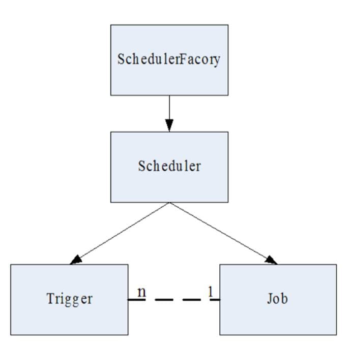
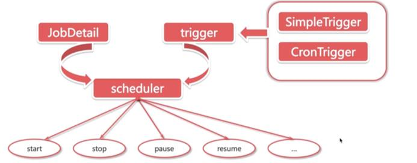
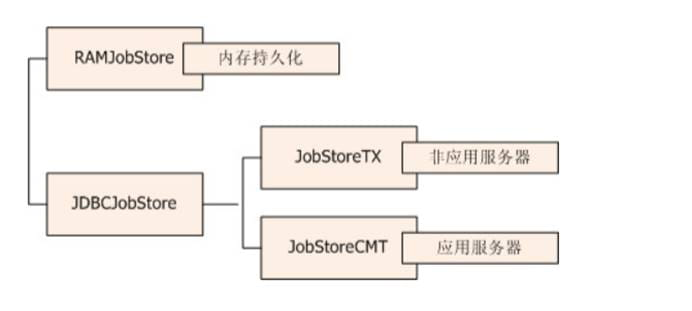
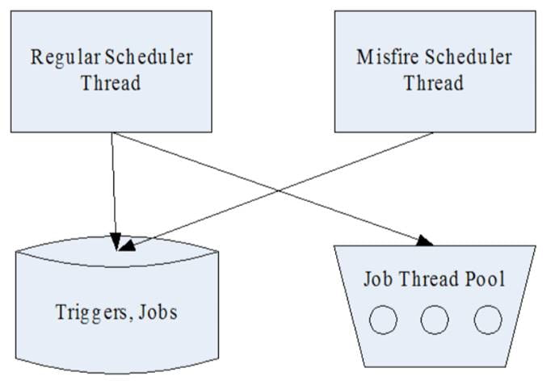
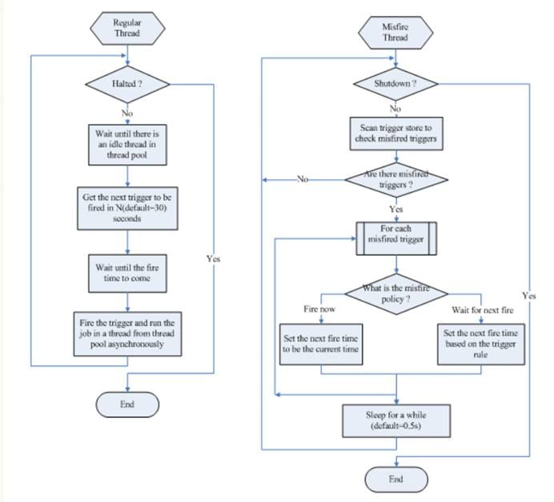
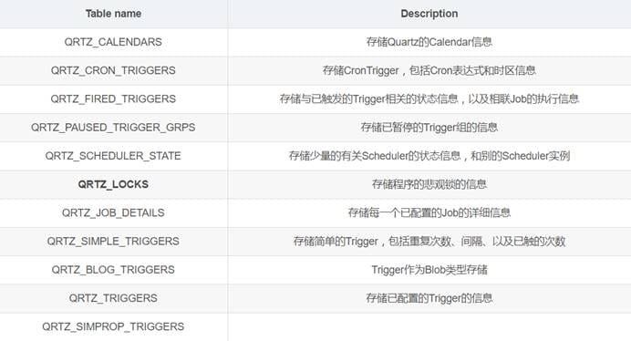

# 一：Quertz简介

　　Quertz是一个开源的作业任务调度框架，他可以完成像JavaScript定时器类式的功能，其实Java中Timer也可实现部分功能，但相比Quertz还是略逊一筹，本人这次需要解决的就是**定期统计消费记录**的功能。你还可以用他完成定期执行各类操作的功能。比如

o  想每月25号，信用卡自动还款

o  想每年4月1日自己给当年暗恋女神发一封匿名贺卡

o  想每隔1小时，备份一下自己的学习笔记到云盘

这些问题总结起来就是：

在某一个有规律的时间点干某件事。并且时间的触发的条件可以非常复杂（比如每月最后一个工作日的17:50），复杂到需要一个专门的框架来干这个事。

Quartz就是来干这样的事，你给它一个触发条件的定义，它负责到了时间点，触发相应的Job起来干活。

核心概念：

**Job** 表示一个工作，要执行的具体内容。此接口中只有一个方法，如下：

void execute(JobExecutionContext context) 

# 二：使用方法

（主要是Spring整合使用）

采用Spring整合Quartz使用代码方式或者xml方式都可以，我这里也提供两种方式，名称相同适合对比学习。

**代码方式**

1：引入配置，pom.xml文件引入下列两个路径（非Maven可自行配置）

```xml
<!-- https://mvnrepository.com/artifact/org.quartz-scheduler/quartz -->
        <dependency>
            <groupId>org.quartz-scheduler</groupId>
            <artifactId>quartz</artifactId>
            <version>2.3.0</version>
        </dependency>
        <!-- https://mvnrepository.com/artifact/org.springframework/spring-context-support -->
        <dependency>
            <groupId>org.springframework</groupId>
            <artifactId>spring-context-support</artifactId>
            <version>5.1.0.RELEASE</version>
        </dependency>
```


　　2：创建【com.xqc.campusshop.config.quartz】包进行相关配置

（我知道大家不喜欢看源码，但是我还是得说看源码效果好）源码中


productSellDailyService为定期统计消费记录Service接口 

dailyCalculate 为ProductSellDailyService接口中执行定期统计的的方法，

triggerFactory.setCronExpression("? 0 0 * * ? *");为定时的时间，可访问在线cron表达式生成器生成相应时间 http://cron.qqe2.com/

```java
 1 package com.xqc.campusshop.config.quartz;
 2 
 3 import org.springframework.beans.factory.annotation.Autowired;
 4 import org.springframework.context.annotation.Bean;
 5 import org.springframework.context.annotation.Configuration;
 6 import org.springframework.scheduling.quartz.CronTriggerFactoryBean;
 7 import org.springframework.scheduling.quartz.MethodInvokingJobDetailFactoryBean;
 8 import org.springframework.scheduling.quartz.SchedulerFactoryBean;
 9 
10 import com.xqc.campusshop.service.ProductSellDailyService;
11 
12 @Configuration
13 public class QuartzConfiguration {
14     
15     //定期统计消费记录Service接口
16     @Autowired
17     private ProductSellDailyService productSellDailyService;
18     
19     @Autowired
20     private MethodInvokingJobDetailFactoryBean jobDetailFactory;
21     
22     @Autowired
23     private CronTriggerFactoryBean productSellDailyTriggerFactory;
24     
25     /**
26      * 创建jobDetail并返回
27      * @return
28      */
29     @Bean(name="jobDetailFactory")
30     public MethodInvokingJobDetailFactoryBean crateJobDetail(){
31     
32         //new出jobDetailFactory对象，此工厂主要用来制作一个jobDetail,及制作一个任务
33         //由于我们所做的定时任务根本上讲其实就是执行一个方法，所以这个工厂比较方便
34         MethodInvokingJobDetailFactoryBean jobDetailFactoryBean = new MethodInvokingJobDetailFactoryBean();
35         //设置jobDetail的名字
36         jobDetailFactoryBean.setName("product_sell_daily_job");
37         //设置jobDetail的组名
38         jobDetailFactoryBean.setGroup("job_product_sell_daily_group");
39         //对于相同的JobDetail，当指定多个Triggger时，很可能第一个job完成以前，第二个job就开始了
40         //指定设为false，多个job则不会并发运行，第二个job不会再第一个job完成前开始
41         jobDetailFactoryBean.setConcurrent(false);
42         //指定运行任务的类
43         jobDetailFactoryBean.setTargetObject(productSellDailyService);
44         //指定运行任务的方法
45         jobDetailFactoryBean.setTargetMethod("dailyCalculate");
46         
47         return jobDetailFactoryBean;    
48     }
49     
50     /**
51      * 创建cronTriggerFactory并返回
52      * 
53      * @return
54      */
55     @Bean("productSellDailyTriggerFactory")
56     public CronTriggerFactoryBean createProductSellDailyTrigger(){
57         //创建TriggerFactory实例，用来创建trigger
58         CronTriggerFactoryBean triggerFactory = new CronTriggerFactoryBean();
59         //设置triggerFactory的名字
60         triggerFactory.setName("product_sell_daily_trigger");
61         //设置组名
62         triggerFactory.setGroup("job_product_sell_daily_group");
63         //绑定jobDetail
64         triggerFactory.setJobDetail(jobDetailFactory.getObject());
65         //设置cron表达式，请访问:http://cron.qqe2.com/在线表达式生成器
66         triggerFactory.setCronExpression("? 0 0 * * ? *");
67         
68         return triggerFactory;
69         
70     }
71     /**
72      * 创建调度工厂并返回
73      * @return
74      */
75     @Bean("schedulerFactory")
76     public SchedulerFactoryBean createSchedulerFactory(){
77         
78         SchedulerFactoryBean schedulerFactory = new SchedulerFactoryBean();
79         schedulerFactory.setTriggers(productSellDailyTriggerFactory.getObject());
80         return schedulerFactory;
81         
82     }
83     
84 
85 }

```


3：业务方法我就不贴了，大家可以打印一下测试一下即可(记得把cron表达式时间改小一点)，譬如

```java
 1 package com.xqc.campusshop.service.impl;
 2 
 3 import org.springframework.stereotype.Service;
 4 
 5 @Service
 6 public class ProductSellDailyServiceImpl implements ProductSellDailyService{
 7     
 8     @Override
 9     public void dailyCalculate() {
10             system.out.println("Quartz跑起来了！”）;
11         
12     }    
13 }

```


**使用配置文件方式**

1：引入pom.xml（同上）

2：在Spring配置文件配置如下

```xml
<!-- 使用MethodInvokingJobDetailFactoryBean，任务类可以不实现Job接口，通过targetMethod指定调用方法-->
    <bean id="productSellDailyService" class="com.xqc.campusshop.service"/>
    <bean id="jobDetail" class="org.springframework.scheduling.quartz.MethodInvokingJobDetailFactoryBean">
        <property name="group" value="job_product_sell_daily_group"/>
        <property name="name" value="product_sell_daily_job"/>
        <!--false表示等上一个任务执行完后再开启新的任务-->
        <property name="concurrent" value="false"/>
        <property name="targetObject">
            <ref bean="productSellDailyService"/>
        </property>
        <property name="targetMethod">
            <value>dailyCalculate</value>
        </property>
    </bean>
    <!--  调度触发器 -->
    <bean id="myTrigger"
        class="org.springframework.scheduling.quartz.CronTriggerFactoryBean">
        <property name="name" value="product_sell_daily_trigger"/>
        <property name="group" value="job_product_sell_daily_group"/>
        <property name="jobDetail">
            <ref bean="jobDetail" />
        </property>
        <property name="cronExpression">
            <value>? 0 0 * * ? *</value>
        </property>
    </bean>
    <!-- 调度工厂 -->
    <bean id="scheduler" class="org.springframework.scheduling.quartz.SchedulerFactoryBean">
        <property name="triggers">
            <list>
                <ref bean="myTrigger"/>
            </list>
        </property>
    </bean>
```


3：编写业务方法（同上）

# 三：相关知识

官网：http://www.quartz-scheduler.org/

API：http://www.quartz-scheduler.org/api/2.2.1/index.html

**三个核心概念：**

**Scheduler**：调度器。所有的调度都是由它控制。

**Trigger**：定义触发的条件。

 **Job & JobDetail**： JobDetail 定义的是任务数据，而真正的执行逻辑是在Job中。

为什么设计成 JobDetail + Job，不直接使用Job？

这是因为任务是有可能并发执行，如果Scheduler直接使用Job，就会存在对同一个Job实例并发访问的问题。而JobDetail & Job 方式，sheduler每次执行，都会根据JobDetail创建一个新的Job实例，这样就可以规避并发访问的问题。

**核心关系图**

 



 

Quartz体系结构



**重要组成部分**

**Job**

Job实例在Quartz中的生命周期

每次调度器执行Job时，它在调用execute方法前会创建一个新的Job实例

当调用完成后，关联的Job对象实例会被释放，释放实例会被垃圾回收机制回收。

 

**JobBuild**

 

**JonDetail**

JobDetail为Job实例提供了许多设置属性，以及JobDataMap成员变量属性，它用来存储特定Job实例信息，可以理解为Job携带的内容。调度器需要借助JobDetail对象来添加Job实例

JobDetail和Trigger都有**name**和**group**。

**name**是它们在这个sheduler里面的唯一标识。如果我们要更新一个JobDetail定义，只需要设置一个name相同的JobDetail实例即可。

**group**是一个组织单元，sheduler会提供一些对整组操作的API，比如 scheduler.resumeJobs()。

**JobExecutionContext**

当Scheduler调用一个Job，就会将JobExecutionContext传递给Job的execute（）方法

Job能通过JobExecutionContext对象访问到Quartz运行时候的环境以及Job本身的明细数据

**JobDataMap**

在进行任务调度时JobDataMap存储，在JobExecutionContext中，非常方便获取

JobDataMap可以用来装载任何可序列化的数据对象，当Job实例对象被执行时这些参数对象会传递给他

JobDataMap实现了JDK的Map接口，并且添加了一些非常方便的方法用来存取基本的数据类型

**获取JobDataMap的两种方式**

从Map中直接获取

Job实现类中添加Setter方法对应JobDataMap的键值（Quartz框架默认的JobFactory实现类在初始化Job实例对象时就会自动调用这些setter方法*）*

**Trigger**

**startTime**和**endTime**指定的Trigger会被触发的时间区间。在这个区间之外，Trigger是不会被触发的。

**Trigger**的实现类


**SimpleTrigger**

指定从某一个时间开始，以一定的时间间隔（单位是毫秒）执行的任务。

它适合的任务类似于：9:00 开始，每隔1小时，执行一次。

它的属性有：

**repeatInterval** 重复间隔

**repeatCount** 重复次数。实际执行次数是 repeatCount+1。因为在startTime的时候一定会执行一次。

**CronTrigger**

适合于更复杂的任务，它支持类型于Linux Cron的语法（并且更强大）。基本上它覆盖了以上三个Trigger的绝大部分能力（但不是全部）—— 当然，也更难理解。

它适合的任务类似于：每天0:00,9:00,18:00各执行一次。

它的属性只有:

o  Cron表达式。虽然有在线生成器，但是还是介绍一下


星号(*)**：可用在所有字段中，表示对应时间域的每一个时刻，例如，* 在分钟字段时，表示“每分钟”；

问号（?）：该字符只在日期和星期字段中使用，它通常指定为“无意义的值”，相当于点位符；

减号(-)：表达一个范围，如在小时字段中使用“10-12”，则表示从10到12点，即10,11,12；

逗号(,)：表达一个列表值，如在星期字段中使用“MON,WED,FRI”，则表示星期一，星期三和星期五；

斜杠(/)：x/y表达一个等步长序列，x为起始值，y为增量步长值。如在分钟字段中使用0/15，则表示为0,15,30和45秒，而5/15在分钟字段中表示5,20,35,50，你也可以使用*/y，它等同于0/y；

L：该字符只在日期和星期字段中使用，代表“Last”的意思，但它在两个字段中意思不同。L在日期字段中，表示这个月份的最后一天，如一月的31号，非闰年二月的28号；如果L用在星期中，则表示星期六，等同于7。但是，如果L出现在星期字段里，而且在前面有一个数值X，则表示“这个月的最后X天”，例如，6L表示该月的最后星期五；

W：该字符只能出现在日期字段里，是对前导日期的修饰，表示离该日期最近的工作日。例如15W表示离该月15号最近的工作日，如果该月15号是星期六，则匹配14号星期五；如果15日是星期日，则匹配16号星期一；如果15号是星期二，那结果就是15号星期二。但必须注意关联的匹配日期不能够跨月，如你指定1W，如果1号是星期六，结果匹配的是3号星期一，而非上个月最后的那天。W字符串只能指定单一日期，而不能指定日期范围；

LW组合：在日期字段可以组合使用LW，它的意思是当月的最后一个工作日；

井号(#)：该字符只能在星期字段中使用，表示当月某个工作日。如6#3表示当月的第三个星期五(6表示星期五，#3表示当前的第三个)，而4#5表示当月的第五个星期三，假设当月没有第五个星期三，忽略不触发；

C：该字符只在日期和星期字段中使用，代表“Calendar”的意思。它的意思是计划所关联的日期，如果日期没有被关联，则相当于日历中所有日期。例如5C在日期字段中就相当于日历5日以后的第一天。1C在星期字段中相当于星期日后的第一天。

 

**JobStore**

 Quartz支持任务持久化，这可以让你在运行时增加任务或者对现存的任务进行修改，并为后续任务的执行持久化这些变更和增加的部分。中心概念是JobStore接口。默认的是RAMJobStore。



**ThreadTool**

**TriggerBuild**

**Scheduler**

**Calendar**

Quartz体贴地为我们提供以下几种Calendar，注意，所有的Calendar既可以是排除，也可以是包含，取决于：

HolidayCalendar。指定特定的日期，比如20140613。精度到天。

DailyCalendar。指定每天的时间段（rangeStartingTime, rangeEndingTime)，格式是HH:MM[:SS[:mmm]]。也就是最大精度可以到毫秒。

WeeklyCalendar。指定每星期的星期几，可选值比如为java.util.Calendar.SUNDAY。精度是天。

MonthlyCalendar。指定每月的几号。可选值为1-31。精度是天

AnnualCalendar。 指定每年的哪一天。使用方式如上例。精度是天。

CronCalendar。指定Cron表达式。精度取决于Cron表达式，也就是最大精度可以到秒。

一个Trigger可以和多个Calendar关联，以排除或包含某些时间点

**监听器：**

JobListener，TriggerListener，SchedulerListener

**原生执行过程：**

通过工厂创建一个Scheduler

创建一个实现Job接口的实现类（就是要具体做的事情，可以具体调用自己写的service）

定义一个Job，并绑定我们自己实现Job接口的实现类（例如通过JobBuilder的方式）

创建Trigger，并设置相关参数，如启动时间等。

将job和trigger绑定到scheduler对象上，并启动

代码略（网上一百度都有的HelloQuartz，我就懒得写了）

**四：深入探究**

**原理：**

quartz定时调度是通过Object.wait方式（native方法）实现的，其本质是通过操作系统的时钟来实现的。

**设计模式：**

Bulild模式

组件模式

Factory模式

链式写法

 **线程视图**

在 Quartz 中，有两类线程，Scheduler 调度线程和任务执行线程，其中任务执行线程通常使用一个线程池维护一组线程。



　　Scheduler 调度线程主要有两个： 执行常规调度的线程，和执行 misfired trigger 的线程。常规调度线程轮询存储的所有 trigger，如果有需要触发的 trigger，即到达了下一次触发的时间，则从任务执行线程池获取一个空闲线程，执行与该 trigger 关联的任务。Misfire 线程是扫描所有的 trigger，查看是否有 misfired trigger，如果有的话根据 misfire 的策略分别处理。下图描述了这两个线程的基本流程：



**启动流程**

　　若quartz是配置在spring中，当服务器启动时，就会装载相关的bean。SchedulerFactoryBean实现了InitializingBean接口，因此在初始化bean的时候，会执行afterPropertiesSet方法，该方法将会调用SchedulerFactory(DirectSchedulerFactory 或者 StdSchedulerFactory，通常用StdSchedulerFactory)创建Scheduler。SchedulerFactory在创建quartzScheduler的过程中，将会读取配置参数，初始化各个组件

**集群配置**

　　quartz集群是通过数据库表来感知其他的应用的，各个节点之间并没有直接的通信。只有使用持久的JobStore才能完成Quartz集群。
 数据库表：以前有12张表，现在只有11张表，现在没有存储listener相关的表，多了QRTZ_SIMPROP_TRIGGERS表：



QRTZ_LOCKS就是Quartz集群实现同步机制的行锁表,包括以下几个锁：CALENDAR_ACCESS 、JOB_ACCESS、MISFIRE_ACCESS 、STATE_ACCESS 、TRIGGER_ACCESS。

 

 