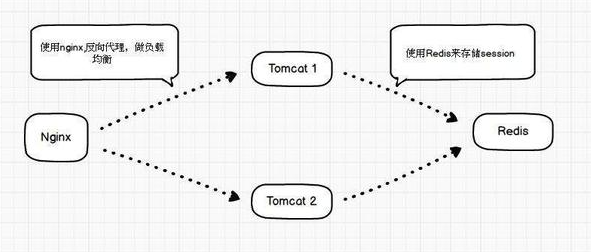

两种方式：

一种是nginx使用ip_hash策略进行，将同一个请求分发到相同的服务器上，（还有一个类似于王者荣耀选取，由客户手动负载）


第二种是基于Redis存储session

- 这是企业中使用的最多的一种方式
- spring为我们封装好了spring-session，直接引入依赖即可
- 数据保存在redis中，无缝接入，不存在任何安全隐患
- redis自身可做集群，搭建主从，同时方便管理

多了一次网络调用，web容器需要向redis访问


Cookie：缓存在浏览器的，每次客户端向服务器发送请求时都会带上的特殊信息。

Cookie的产生：第一次服务器向客户端回传响应的超文本是，也发回一些信息，当然这些信息并不是存放在HTTP响应体（Response Body）中的，而是存放于HTTP响应头（Response Header）；

cookie的内容主要包括：名字，值，过期时间，路径和域。路径与域合在一起就构成了cookie的作用范围。

如果不设置过期时间，则表示这个cookie的生命期为浏览器会话期间，只要关闭浏览器窗口，cookie就消失了，这种生命期为浏览器会话期的 cookie被称为会话cookie。会话cookie一般不存储在硬盘上而是保存在内存里。如果设置了过期时间，浏览器就会把cookie保存到硬盘上，关闭后再次打开浏览器，这些cookie仍然有效直到超过设定的过期时间。

存储在硬盘上的cookie 不可以在不同的浏览器间共享，可以在同一浏览器的不同进程间共享，比如两个IE窗口。这是因为每中浏览器存储cookie的位置不一样，比如

Chrome下的cookie放在：C:\Users\sharexie\AppData\Local\Google\Chrome\User Data\Default\Cache

Firefox下的cookie放在：C:\Users\sharexie\AppData\Roaming\Mozilla\Firefox\Profiles\tq2hit6m.default\cookies.sqlite （倒数第二个文件名是随机的文件名字）

Ie下的cookie放在：C:\Users\Administrator\AppData\Roaming\Microsoft\Windows\Cookies


Session：一个浏览器和服务器的交互的会话，Cookie中保存着SessionId，Session保存在服务器上。


分布式Session问题：

因为分布式的，客户端发送了一个请求，经过负载均衡后该请求会被分配到下列服务器中的任意一个，这是用户验证了，如果用户再次请求，该请求被负载到另一台服务器上，此时检查Cookie中的sessionId发现该服务器没有，这是会让用户重新登录，这就会出现问题。


方法一：Session复制

将所有服务器中的Session都同步复制到所有服务器上。在所有服务器间做一个Session的同步。部署两台Tomcat，开启集群配置。


在项目中在WEB-INF目录下的web.xml文件中添加开启

```xml
<!--tomcat session复制开启-->
<distributable/>
```


方法二：使用Nginx中IP绑定策略

在Nginx中配置ip_hash，配置了IP绑定就不支持负载均衡了。


方法三：使用Token代替Session

　　当Web服务器接收到请求后，请求会进入对应的Filter进行过滤，将原本需要由Web服务器创建会话的过程转交给Spring-Session进行创建。Spring-Session会将原本应该保存在Web服务器内存的Session存放到Redis中。然后Web服务器之间通过连接Redis来共享数据，达到Sesson共享的目的。

使用基于 Token 的身份验证方法，在服务端不需要存储用户的登录记录。大概的流程是这样的： 

   1、客户端通过用户名和密码登录服务器；
   2、服务端对客户端身份进行验证；
   3、服务端对该用户生成Token，返回给客户端；
   4、客户端将Token保存到本地浏览器，一般保存到cookie中；
   5、客户端发起请求，需要携带该Token；
   6、服务端收到请求后，首先验证Token，之后返回数据。

浏览器第一次访问服务器，根据传过来的唯一标识userId，服务端会通过一些算法，如常用的HMAC-SHA256算法，然后加一个密钥，生成一个token，然后通过BASE64编码一下之后将这个token发送给客户端；客户端将token保存起来，下次请求时，带着token，服务器收到请求后，然后会用相同的算法和密钥去验证token，如果通过，执行业务操作，不通过，返回不通过信息。

优缺点：

- 无状态、可扩展 ：在客户端存储的Token是无状态的，并且能够被扩展。基于这种无状态和不存储Session信息，负载均衡器能够将用户信息从一个服务传到其他服务器上。
- 安全：请求中发送token而不再是发送cookie能够防止CSRF(跨站请求伪造)。
- 可提供接口给第三方服务：使用token时，可以提供可选的权限给第三方应用程序。
- 多平台跨域


方法三：基于Redis存储的session方案。

重写了getSession方法，

步骤：

添加Redis依赖

配置application.properties,本地开启redis服务

添加Session配置类

```java
/**
 * 这个类用配置redis服务器的连接
 * maxInactiveIntervalInSeconds为SpringSession的过期时间（单位：秒）
 */
@EnableRedisHttpSession(maxInactiveIntervalInSeconds = 1800)
public class SessionConfig {
    // 冒号后的值为没有配置文件时，制动装载的默认值
    @Value("${redis.hostname:localhost}")
    private String hostName;
    @Value("${redis.port:6379}")
    private int port;
    // @Value("${redis.password}")
    // private String password;

    @Bean
    public JedisConnectionFactory jedisConnectionFactory() {
        RedisStandaloneConfiguration redisStandaloneConfiguration =
                new RedisStandaloneConfiguration();
        redisStandaloneConfiguration.setHostName(hostName);
        redisStandaloneConfiguration.setPort(port);
        // redisStandaloneConfiguration.setDatabase(0);
        // redisStandaloneConfiguration.setPassword(RedisPassword.of("123456"));
        return new JedisConnectionFactory(redisStandaloneConfiguration);
    }

    @Bean
    public StringRedisTemplate redisTemplate(RedisConnectionFactory redisConnectionFactory) {
        return new StringRedisTemplate(redisConnectionFactory);
    }
}
```

