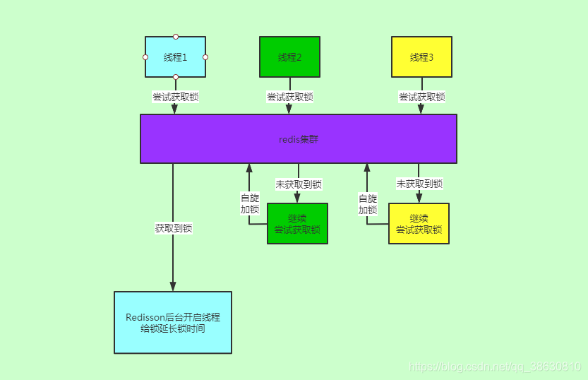

# 幂等性

比如一个付款接口，然后前端操作上，一个订单发起了两次支付请求，然后这俩请求分散在了两个不同的服务器上，这就……出问题了，一定订单不能扣款两次啊！

订单系统调用支付系统进行支付，结果不小心因为网络超时了，然后订单系统走了前面我们看到的那个重试机制，咔嚓给你重试了一把，好，支付系统收到一个支付请求两次，而且因为负载均衡算法落在了不同的机器上，尴尬了。。。

所谓幂等性，就是说一个接口，多次发起同一个请求，你这个接口得保证结果是准确的，比如不能多扣款，不能多插入一条数据，不能将统计值多加了 1。这就是幂等性

其实保证幂等性主要是三点：

- 对于每个请求必须有一个唯一的标识，举个例子：订单支付请求，肯定得包含订单 id，一个订单 id 最多支付一次，对吧
- 每次处理完请求之后，必须有一个记录标识这个请求处理过了，比如说常见的方案是在 mysql 中记录个状态啥的，比如支付之前记录一条这个订单的支付流水，而且支付流水采
- 每次接收请求需要进行判断之前是否处理过的逻辑处理，比如说，如果有一个订单已经支付了，就已经有了一条支付流水，那么如果重复发送这个请求，则此时先插入支付流水，orderId 已经存在了，唯一键约束生效，报错插入不进去的。然后你就不用再扣款了。

可以写一个标识到 redis 里面去，set order_id payed，下一次重复请求过来了，先查 redis 的 order_id 对应的 value，如果是 payed 就说明已经支付过了，你就别重复支付了

然后呢，你再重复支付这个订单的时候，你写尝试插入一条支付流水，数据库给你报错了，说 unique key 冲突了，整个事务回滚就可以了

来保存一个是否处理过的标识也可以，服务的不同实例可以一起操作 redis

# 顺序性

实分布式系统接口的调用顺序，也是个问题，一般来说是不用保证顺序的。但是有的时候可能确实是需要严格的顺序保证。

比如：本来应该是先插入 -> 再删除，这条数据应该没了，结果现在先删除 -> 再插入，数据还存在

## 解决方式

1：类似分布式 Session，使用 Dubbo 的一致性 hash 负载均衡策略，将订单全部发到某个机器上。

问题：导致某台机器过热，不采用

2：采用 MQ 以及内存队列

分发到特定机器上，然后机器内部在把请求放到内存队列中，线程从内存队列中获取消费，保证线程的顺序性

3，采用分布式锁来解决

分布式锁能够保证强一致性，但是因为引入这种重量级的同步机制，会导致并发量急剧降低，因为需要频繁的获取锁，释放锁的操作。

# 场景

减库存操作

```java
int stock = Integer.parseInt(stringRedisTemplate.opsForValue().get('stock'));
if(stock > 0){
    int realStock = stock -1;
    stringRedisTemplate.opsForValue().set('stock',realStock+'');
    System.out.println("成功，库存为  " + realStock);
}
```

多线程肯定会出现问题，如果单体，加个 sync 解决

```java
synchronized(this){
    int stock = Integer.parseInt(stringRedisTemplate.opsForValue().get('stock'));
    if(stock > 0){
        int realStock = stock -1;
        stringRedisTemplate.opsForValue().set('stock',realStock+'');
        System.out.println("成功，库存为  " + realStock);
    }
}
```

先获取，再操作的场景。——重复提交问题

# 分布式锁

## 高效的分布式锁

当我们在设计分布式锁的时候，我们应该考虑分布式锁至少要满足的一些条件，同时考虑如何高效的设计分布式锁，

1、互斥

在分布式高并发的条件下，我们最需要保证，同一时刻只能有一个线程获得锁，这是最基本的一点。

2、防止死锁

在分布式高并发的条件下，比如有个线程获得锁的同时，还没有来得及去释放锁，就因为系统故障或者其它原因使它无法执行释放锁的命令,导致其它线程都无法获得锁，造成死锁。

所以分布式非常有必要设置锁的`有效时间`，确保系统出现故障后，在一定时间内能够主动去释放锁，避免造成死锁的情况。

3、性能

对于访问量大的共享资源，需要考虑减少锁等待的时间，避免导致大量线程阻塞。

所以在锁的设计时，需要考虑两点。

1）、`锁的颗粒度要尽量小`。比如你要通过锁来减库存，那这个锁的名称你可以设置成是商品的 ID,而不是任取名称。这样这个锁只对当前商品有效,锁的颗粒度小。

2）、`锁的范围尽量要小`。比如只要锁 2 行代码就可以解决问题的，那就不要去锁 10 行代码了。

4、重入

我们知道 ReentrantLock 是可重入锁，那它的特点就是：同一个线程可以重复拿到同一个资源的锁。重入锁非常有利于资源的高效利用。

5，分布式情况下别的线程不能释放本线程加的锁。

## redis 实现分布式锁

### setnx 实现

当且仅当不存在的时候才会添加，容易造成死锁，设置有效期；

也可能造成无锁情况，释放了不是自己的锁，解决：需要判断当前这把锁是不是我的锁。

setnx key value

如果 redis 中已经存在该 key，则不进行操作。redis 是单线程的。

```java
//Boolean result = stringRedisTemplate.opsForValue().setIfAbsent(lockKey,'key');
//设置超时时间
//stringRedisTemplate。expire(lockKey,10,TimeUnit.SECONDS);
Boolean result = stringRedisTemplate.opsForValue().setIfAbsent(lockKey,'key',10,TimeUnit.SECONDS);
if(!result){
    return "err";
}
//finally释放锁
stringRedisTemplate.delete(lockKey);
```

多线程下可能会释放掉其他线程的锁，导致出错。

### Jedis 实现

**加锁**

```java
public class RedisTool {
private static final String LOCK_SUCCESS = "OK";
private static final String SET_IF_NOT_EXIST = "NX";
private static final String SET_WITH_EXPIRE_TIME = "PX";
　　/**
　　* 尝试获取分布式锁
　　* @param jedis Redis客户端
　　* @param lockKey 锁
　　* @param requestId 请求标识
　　* @param expireTime 超期时间
　　* @return 是否获取成功
　　*/

　　public static boolean tryGetDistributedLock(Jedis jedis, String lockKey, String requestId, int expireTime) {
　　　　String result = jedis.set(lockKey, requestId, SET_IF_NOT_EXIST, SET_WITH_EXPIRE_TIME, expireTime);
　　　　if (LOCK_SUCCESS.equals(result)) {
　　　　　　return true;
　　　　}
　　　　return false;
　　}
}
```

加锁就一行代码，这个 set()方法一共有五个形参：

第一个为 key，我们使用 key 来当锁，因为 key 是唯一的。

第二个为 value，我们传的是 requestId，通过给 value 赋值为 requestId，我们就知道这把锁是哪个请求加的了，在解锁的时候就可以有依据。不至于释放了别的线程加的锁。requestId 可以使用 UUID.randomUUID().toString()方法生成。

第三个为 nxxx，这个参数我们填的是 NX，意思是 SET IF NOT EXIST，即当 key 不存在时，我们进行 set 操作；若 key 已经存在，则不做任何操作；

第四个为 expx，这个参数我们传的是 PX，意思是我们要给这个 key 加一个过期的设置，具体时间由第五个参数决定。

第五个为 time，与第四个参数相呼应，代表 key 的过期时间。

总的来说，执行上面的 set()方法就只会导致两种结果：1. 当前没有锁（key 不存在），那么就进行加锁操作，并对锁设置个有效期，同时 value 表示加锁的客户端。2. 已有锁存在，不做任何操作。

**解锁**

```java
public class RedisTool {
private static final Long RELEASE_SUCCESS = 1L;
/**
* 释放分布式锁
* @param jedis Redis客户端
* @param lockKey 锁
* @param requestId 请求标识
* @return 是否释放成功
*/
　　public static boolean releaseDistributedLock(Jedis jedis, String lockKey, String requestId) {
　　　　String script = "if redis.call('get', KEYS[1]) == ARGV[1] then return redis.call('del', KEYS[1]) else return 0 end";
　　　　Object result = jedis.eval(script, Collections.singletonList(lockKey), Collections.singletonList(requestId));
　　　　if (RELEASE_SUCCESS.equals(result)) {
　　　　　　return true;
　　　　}
　　　　return false;
　　}
}
```

解锁两行代码，第一行 lua 脚本，

第一行我们写了一个 lua 脚本，意思：首先获取锁对应的 value 值，检查是否与 requestId 相等，如果相等则删除锁（解锁）。因为 Lua 脚本可以保证原子性。

第二行代码，我们将 Lua 代码传到 jedis.eval()方法里，并使参数 KEYS[1]赋值为 lockKey，ARGV[1]赋值为 requestId。eval()方法是将 Lua 代码交给 Redis 服务端执行。

### redisson 实现（选用）

Redisson 是一个在 Redis 基础上实现的 Java 驻内存网络网格。它不仅提供了一系列的分布式的 Java 常用对象，还提供了许多分布式服务，包括 Queue，Lock，AtomicLong，CountDownLatch，Publish/Subscribe，Executor service 等，提供了使用 Redis 的最简单和最便捷的能够将精力更集中的放在处理业务逻辑上。Redisson 底层采用的 Netty 框架。

**对比 Jedis**

Jedis 只是简单封装了 Redis 的 API 库，可以看做 Redis 客户端，它的方法和 Redis 命令很类似，相比于 Redisson 更原生一些，更灵活。

Redisson 不仅封装了 Redis，还封装了多种数据结构的致辞，以及锁等功能，相比于 Jedis 更加强大。

#### 配置方式

a，单 Redis 节点模式

```java
//默认连接地址
RedissionClient redission = Redission.create();
Config config = new Config();
config.useSingleServer().setAddress("myredisserver:6379");
RedissionClient redission = Redission.create(config);
```

b：微服务 SpringBoot 配置

引入启动器依赖：

配置

```yml
spring:
	redis:
		host:127.0.0.1
		password:123456
		database:8
```

#### 使用锁

阻塞式获取锁

```java
    //阻塞获取锁，没有获取到锁阻塞线程
    public void testgetLock(){
        RLock lock = null;
        try{
            lock = redissonClient.getLock("lock");
            lock.lock();
            System.out.println(Thread.currentThread().getName() + "获取到锁");
            Thread.sleep(2000);
        }catch (InterruptedException e){
            e.printStackTrace();
        }finally {
            if (null!=lock && lock.isHeldByCurrentThread()){
                lock.unlock();
            }
        }
    }
```

非阻塞的锁

```java
    //立即返回获取锁的状态
    public void testTryLock(){
        RLock lock = null;
        try{
            lock = redissonClient.getLock("lock");
            if (lock.tryLock()){
                System.out.println(Thread.currentThread().getName() + "获取到锁");
                Thread.sleep(2000);
            }else{
                System.out.println(Thread.currentThread().getName() + "没有获取到锁");
            }
        }catch (InterruptedException e){
            e.printStackTrace();
        }finally {
            if (null!=lock && lock.isHeldByCurrentThread()){
                lock.unlock();
            }
        }
    }
```

加最长等待时间，防止死锁

```java
//立即返回获取锁的状态
public void testFairLockAndtryTime(){
    RLock lock = null;
    try{
        //非公平锁，随机取一个等待中的线程分配锁
        //lock = redissonClient.getLock("lock");
        //公平锁，按照先后顺序依次分配锁
        lock = redissonClient.getFairLock("lock");
        //尝试获取锁，最多等待锁4秒，如果一个线程10秒则强制释放锁
        if (lock.tryLock(4,10, TimeUnit.SECONDS)){
            System.out.println(Thread.currentThread().getName() + "获取到锁");
            Thread.sleep(2000);
        }else{
            System.out.println(Thread.currentThread().getName() + "没有获取到锁");
        }
    }catch (InterruptedException e){
        e.printStackTrace();
    }finally {
        if (null!=lock && lock.isHeldByCurrentThread()){
            lock.unlock();
        }
    }
}
```

#### 底层原理

底层使用 lua 脚本实现，使用 lua 语言将其发送给 redis，保证复杂业务逻辑的原子性

获取锁以及防止锁失效



1.线程 1，线程 2，线程 3 同时去获取锁；

2.线程 1 获取到锁，线程 2，线程 3 未获取到锁；

3.线程 2，线程 3while 循环，进行自旋获取锁

4.线程 1 后台开启线程，每 1/3 超时时间执行一次锁延迟动作，防止锁失效

**lua 字段解释**
KEYS[1]:表示你加锁的那个 key，比如说
RLock lock = redisson.getLock(“myLock”);
这里你自己设置了加锁的那个锁 key 就是“myLock”。
ARGV[1]:表示锁的有效期，默认 30s
ARGV[2]:表示表示加锁的客户端 ID,类似于下面这样：
8743c9c0-0795-4907-87fd-6c719a6b4586:1


问题：redis 主从架构，如果第一个线程加了锁，然后挂了，还没来得及将 lockkey 同步到从节点上去，其他线程访问则没加锁。

redLock 解决，底层与 ZK 类似，有几个相同的节点，当大于一半的节点返回加锁成功加锁才成功

问题：性能问题，锁回滚问题

#### 加锁机制

##### 锁互斥机制

第一个 if 判断会执行“exists myLock”，发现 myLock 这个锁 key 已经存在了。

接着第二个 if 判断，判断一下，myLock 锁 key 的 hash 数据结构中，是否包含客户端 2 的 ID，但是明显不是的，因为那里包含的是客户端 1 的 ID。

所以，客户端 2 会获取到 pttl myLock 返回的一个数字，这个数字代表了 myLock 这个锁 key 的**剩余生存时间。**比如还剩 15000 毫秒的生存时间。

此时客户端 2 会进入一个 while 循环，不停的尝试加锁。

##### 可重入锁机制

第一个 if 判断肯定不成立，“exists myLock”会显示锁 key 已经存在了。

第二个 if 判断会成立，因为 myLock 的 hash 数据结构中包含的那个 ID，就是客户端 1 的那个 ID，也就是“8743c9c0-0795-4907-87fd-6c719a6b4586:1”

此时就会执行可重入加锁的逻辑，他会用：

incrby myLock

8743c9c0-0795-4907-87fd-6c71a6b4586:1 1

通过这个命令，对客户端 1 的加锁次数，累加 1。

##### 释放锁机制

lua 源码

```lua
if (redis.call('exists', KEYS[1]) == 0) then
       redis.call('publish', KEYS[2], ARGV[1]);
        return 1;
        end;
if (redis.call('hexists', KEYS[1], ARGV[3]) == 0) then
     return nil;
     end;
local counter = redis.call('hincrby', KEYS[1], ARGV[3], -1);
if (counter > 0) then
     redis.call('pexpire', KEYS[1], ARGV[2]);
     return 0;
else redis.call('del', KEYS[1]);
     redis.call('publish', KEYS[2], ARGV[1]);
     return 1;
     end;
return nil;
```

执行 lock.unlock()，就可以释放分布式锁，此时的业务逻辑也是非常简单的。

就是每次都对 myLock 数据结构中的那个加锁次数减 1。如果发现加锁次数是 0 了，说明这个客户端已经不再持有锁了，此时就会用：“del myLock”命令，从 redis 里删除这个 key。

然后另外的客户端 2 就可以尝试完成加锁了。

##### watch dog 自动延期机制

Redisson 中客户端 1 一旦加锁成功，就会启动一个 watch dog 看门狗，他是一个后台线程，会每隔 1/3 的超时时间（设定生存时间为 30 秒，每隔 10 秒）检查一下，如果客户端 1 还持有锁 key，那么就会不断的延长锁 key 的生存时间。

默认情况下，看门狗的续期时间是 30s，也可以通过修改 Config.lockWatchdogTimeout 来另行指定。

另外 Redisson 还提供了可以指定 leaseTime 参数的加锁方法来指定加锁的时间。超过这个时间后锁便自动解开了。不会延长锁的有效期！！！

默认情况下,加锁的时间是 30 秒.如果加锁的业务没有执行完,那么有效期到 30-10 = 20 秒的时候,就会进行一次续期,把锁重置成 30 秒.那这个时候可能又有同学问了,那业务的机器万一宕机了呢?宕机了定时任务跑不了,就续不了期,那自然 30 秒之后锁就解开了呗.

## ZK 实现分布式锁

Zookeeper 采用树状节点的方式来保存我们的服务的注册信息（znode），我们创建 znode 的时候，有 name 属性，如果 znode 已经存在那么就创建失败，以节点作为锁，可能会造成死锁，解决方案使用非持久化节点，客户端失去连接后，该节点会自动删除。

实现最终一致性的。

zk 分布式锁，其实可以做的比较简单，就是某个节点尝试创建临时 znode，此时创建成功了就获取了这个锁；这个时候别的客户端来创建锁会失败，只能注册个监听器监听这个锁。释放锁就是删除这个 znode，一旦释放掉就会通知客户端，然后有一个等待着的客户端就可以再次重新加锁。


ZK 实现分布式锁，就是不需要执行轮询算法，而是注册监听器，但有人释放锁的时候，会通知需要获取锁的进程。

同时 ZK 获取锁的时候，其实就是创建了一个临时节点，如果这个临时节点之前不存在，那么就创建成功，也就是说这个锁就是属于该线程的。

同时其它的线程会尝试创建相同名称的一个临时节点，如果已经存在，说明别人已经占有了这把锁，那么就创建失败。

一旦临时节点被删除，zk 就通知别人这个锁已经被释放掉了，相当于锁被释放掉了。

假设这个时候，持有锁的服务器宕机了，那么 Zookeeper 会自动将该锁给释放掉。

### 对比

redis 分布式锁，其实需要自己不断去尝试获取锁，比较消耗性能

zk 分布式锁，获取不到锁，注册个监听器即可，不需要不断主动尝试获取锁，性能开销较小

另外一点就是，如果是 redis 获取锁的那个客户端 bug 了或者挂了，那么只能等待超时时间之后才能释放锁；而 zk 的话，因为创建的是临时 znode，只要客户端挂了，znode 就没了，此时就自动释放锁。

但是zk加锁也会有一个问题，那就是假如说客户端1加锁成功后，由于网络原因，暂时无法收到心跳，则zk会判断改客户端已经死亡，会主动释放改顺序节点，并通知下一个客户端来获取锁，也就会造成有两个客户端同时拿到锁。这就类似于因为网络原因，造成有两个master的脑裂是同样的问题。

# Redisson 其他知识

## 使用限流器

```java
    //初始化限流器
    public void init(){
        RRateLimiter limiter = redissonClient.getRateLimiter("rateLimiter");
        //每1秒产生5个令牌，一秒内只有五个令牌可用，如果过来10个线程，只有五个能用
        limiter.trySetRate(RateType.PER_CLIENT,5,1, RateIntervalUnit.SECONDS);
    }
```

每 1 秒产生 5 个令牌，一秒内只有五个令牌可用，如果过来 10 个线程，只有五个能用

```java
//获取令牌
public void thread(){
    RRateLimiter limiter = redissonClient.getRateLimiter("rateLimiter");
    //尝试获取1个令牌
    if (limiter.tryAcquire()){
        System.out.println(Thread.currentThread().getName() + "ch");
    }else{
        System.out.println(Thread.currentThread().getName() + "未获取到令牌");
    }
}
```

## Map

Redission 中的 Map 是有序的，理论上大小没有限制，但是受 Redis 的内存大小限制其实是有限制的

Redisson 提供了一系列的映射类型的数据结果，这些结构按特性分为三类：

- 元素淘汰类
- 本地缓存类
- 数据分片类

实现类


RMapCache 可以设置过期时间

RLocalCachedMap 支持本地缓存

## Set

淘汰机制，设置过期时间


List

队列

闭锁

话题


分布式锁的坑：

https://mp.weixin.qq.com/s?__biz=MzkwNjMwMTgzMQ==&mid=2247490430&idx=1&sn=a1f42f9a981a8f161941a6472f317b10&chksm=c0ebc396f79c4a801a330917ca700e7d7a6af3a3c2c5a4e11a05770da925de8aa9ed3c277737&token=2041133408&lang=zh_CN&scene=21#wechat_redirect
